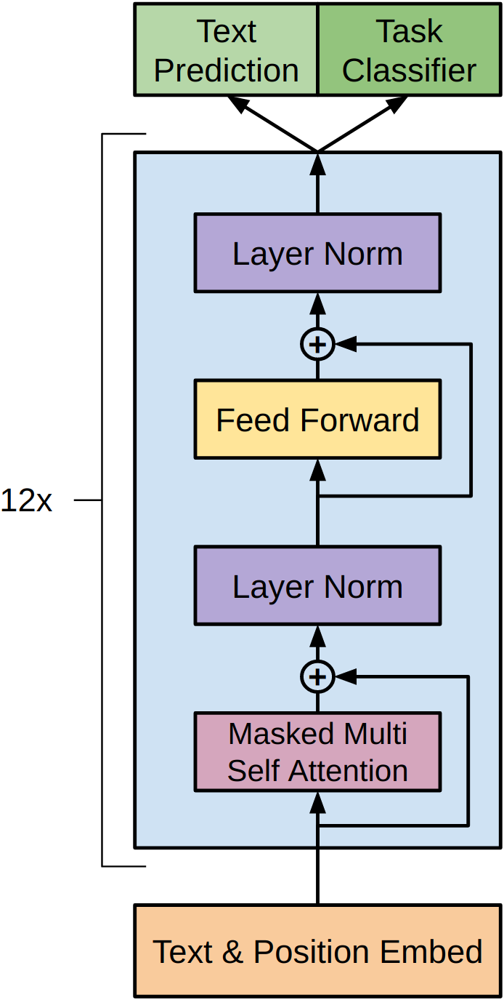
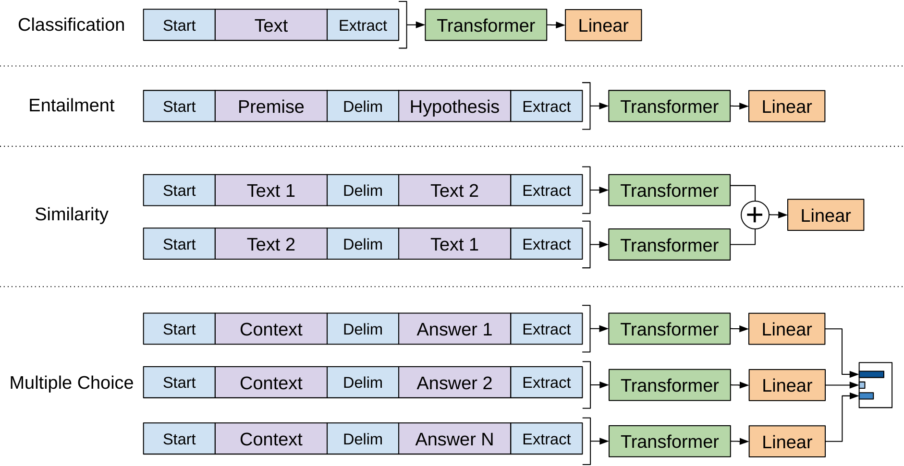
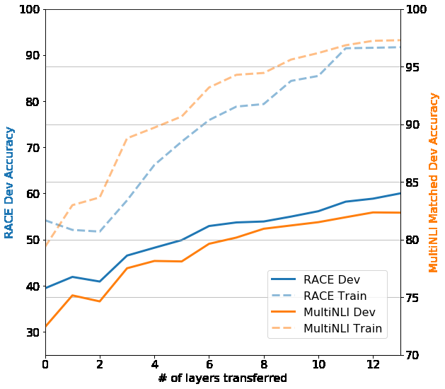
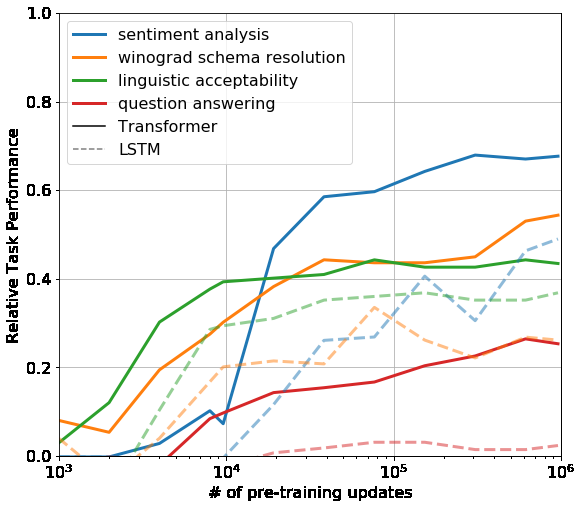

# Повышение понимания языка посредством генеративного предобучения (pre-training)

> **Неофициальный перевод.** Оригинал: Alec Radford, Karthik Narasimhan, Tim Salimans, Ilya Sutskever. «Improving Language Understanding by Generative Pre-Training». OpenAI, 2018. PDF: [https://cdn.openai.com/research-covers/language-unsupervised/language_understanding_paper.pdf](https://cdn.openai.com/research-covers/language-unsupervised/language_understanding_paper.pdf). Лицензия: All rights reserved (see original PDF).

## Аннотация

Понимание естественного языка включает в себя множество различных задач: выявление логической связи между текстами, ответы на вопросы, оценка семантического сходства и классификация документов. Несмотря на обилие крупных корпусов неразмеченного текста, данных с разметкой для решения этих задач крайне мало; это затрудняет адекватное функционирование моделей, обученных дискриминативным методом. Мы показываем, что значительного улучшения результатов по этим задачам можно добиться путем предобучения (pre-training) языковой модели на разнообразном корпусе неразмеченного текста, после чего проводится дообучение (fine-tuning) модели для каждой конкретной задачи. В отличие от ранее применявшихся подходов, в процессе дообучения мы используем преобразования входных данных, учитывающие специфику задачи; это позволяет эффективно переносить знания, при этом внося минимальные изменения в архитектуру модели. Эффективность нашего подхода подтверждается на множестве эталонных тестов по пониманию естественного языка. Наша универсальная модель, не зависящая от конкретной задачи, превосходит модели, обученные дискриминативным методом и имеющие архитектуру, специально разработанную под каждую задачу; при этом в 9 из 12 рассмотренных задач она значительно превосходит существующие достижения. Например, мы добились абсолютного улучшения результатов на 8.9% в задаче здравомыслящего рассуждения (Stories Cloze Test), на 5.7% в задаче ответов на вопросы (RACE) и на 1.5% в задаче выявления логической связи между текстами (MultiNLI).

## 1 Введение

Способность эффективно извлекать знания из необработанного текста играет ключевую роль в снижении зависимости от обучения с учителем (supervised learning) в обработке естественного языка (NLP). Большинство методов глубокого обучения требуют огромного количества данных, размеченных вручную; это ограничивает их применение в областях, где не хватает аннотированных материалов [61]. В таких случаях модели, способные использовать языковую информацию из неразмеченных данных, представляют собой ценную альтернативу сбору дополнительных аннотаций, который часто требует много времени и средств. Кроме того, даже при наличии значительного количества размеченных данных обучение без учителя позволяет получить качественные представления, значительно повышающие эффективность моделей. Наиболее убедительным подтверждением этого служит широкое применение предобученных векторов слов [10, 39, 42] для улучшения результатов в различных задачах NLP [8, 11, 26, 45]. Однако использование информации из необработанного текста, выходящей за рамки уровня отдельных слов, затруднено по двум основным причинам. Во-первых, до сих пор не ясно, какие целевые функции оптимизации наиболее эффективны для получения представлений текста, пригодных для переноса на другие задачи. В последних исследованиях рассматривались такие подходы, как моделирование языка [44], машинный перевод [38] и обеспечение связности дискурса [22]; при этом каждый из этих методов демонстрирует лучшие результаты в разных задачах.1 Во-вторых, отсутствует единое мнение относительно наиболее эффективного способа переноса полученных представлений на конкретную задачу. Существующие методы включают в себя внесение специфических изменений в архитектуру модели [43, 44], применение сложных схем обучения [21] и добавление дополнительных целевых функций [50]. Все эти неопределенности затрудняют разработку эффективных полуобученных подходов в обработке языка. 1https://gluebenchmark.com/leaderboard Препринт. Работа в процессе.

В данной работе мы исследуем полусупервизированный подход к решению задач по пониманию языка, основанный на сочетании бесплатного предобучения и супервизированного дообучения. Наша цель — выработать универсальное представление данных, которое при минимальной адаптации подходило бы для широкого круга задач. Предполагается наличие большого корпуса неразмеченного текста, а также нескольких наборов данных с вручную аннотированными обучающими примерами (целевые задачи). При этом эти целевые задачи не обязаны относиться к той же области, что и неразмеченный корпус. Мы применяем двухэтапную процедуру обучения: сначала на неразмеченных данных решается задача моделирования языка с целью определения начальных параметров нейронной сети; затем эти параметры адаптируются к конкретной целевой задаче с использованием соответствующего супервизированного критерия. В качестве архитектуры модели мы используем Transformer [62]; данная модель продемонстрировала высокую эффективность при решении различных задач, таких как машинный перевод [62], генерация документов [34] и синтаксический анализ [29]. По сравнению с альтернативными моделями, например рекуррентными сетями, такая архитектура обеспечивает более структурированную память для обработки долгосрочных зависимостей в тексте, что позволяет добиваться устойчиво высоких результатов при переносе модели на различные задачи. При переносе модели мы применяем специфические для каждой задачи способы подготовки входных данных, основанные на подходах типа «обхода структуры» [52]; они позволяют рассматривать структурированный текст как единую непрерывную последовательность токенов. Как показывают наши эксперименты, такие подходы позволяют эффективно проводить дообучение при минимальных изменениях в архитектуре предварительно обученной модели.

Мы тестируем наш подход на четырех типах задач по пониманию языка: выводе по естественному языку, ответах на вопросы, оценке семантического сходства и классификации текстов. Наша универсальная модель, не зависящая от конкретной задачи, превосходит модели, обученные дискриминативным методом с использованием архитектур, специально разработанных под каждую прикладную задачу (downstream task); при этом в 9 из 12 исследованных задач она значительно превосходит существующие передовые решения. Например, мы добились абсолютного улучшения результатов на 8.9% в задаче рассуждений на основе здравого смысла (тест Stories Cloze Test) [40], на 5.7% в задачах ответов на вопросы (RACE) [30], на 1.5% в задачах вывода по тексту (MultiNLI) [66] и на 5.5% в недавно введенном многозадачном бенчмарке GLUE [64]. Кроме того, мы проанализировали способность предварительно обученной модели к решению задач в режиме нулевого демонстрационного обучения в четырех различных условиях; результаты показывают, что модель приобретает полезные лингвистические знания, пригодные для решения прикладных задач (downstream task).

## 2 Смежные исследования

Полуобучение с учителем в обработке естественного языка. Наша работа в целом относится к категории полуобучения с учителем в области обработки естественного языка. Этот подход привлекает значительный интерес; он находит применение в таких задачах, как разметка последовательностей [24, 33, 57] и классификация текстов [41, 70]. В самых ранних подходах неразмеченные данные использовались для расчета статистики на уровне слов или фраз, которые затем применялись в качестве признаков в модели обучения с учителем [33]. За последние несколько лет исследователи продемонстрировали преимущества использования векторов слов [11, 39, 42], обученных на неразмеченных корпусах, для повышения эффективности решения различных задач [8, 11, 26, 45]. Однако вышеупомянутые подходы передают в основном информацию на уровне отдельных слов, тогда как наша цель — извлечение семантики более высокого уровня.

В последнее время исследователи изучают возможность извлечения и использования семантической информации более высокого уровня, чем словной, из неразмеченных данных. Фразовые или предложные эмбеддинги, обучаемые на неразмеченном корпусе, применяются для преобразования текста в подходящие векторные представления, необходимые для решения различных задач [28, 32, 1, 36, 22, 12, 56, 31].

Безнадзорное предобучение представляет собой особый случай обучения с полунадзором, при котором целью является нахождение подходящей начальной точки для параметров модели, а не изменение исходной функции потерь обучения с учителем. В ранних исследованиях изучалось применение данного подхода в задачах классификации изображений [20, 49, 63] и регрессии [3]. Более поздние работы [15] показали, что предобучение выступает в роли механизма регуляризации, способствующего лучшей обобщающей способности глубоких нейронных сетей. В последнее время этот метод применяется для обучения глубоких нейронных сетей в таких задачах, как классификация изображений [69], распознавание речи [68], разрешение неоднозначностей в идентификации сущностей [17] и машинный перевод [48]. Наиболее близким к нашему подходу является метод, предполагающий предобучение нейронной сети с использованием задачи моделирования языка, после чего проводится дообучение на конкретной задаче с применением надзора. Dai и соавторы [13] а также Howard и Ruder [21] используют данный подход для улучшения результатов классификации текстов. Однако, несмотря на то, что этап предобучения способствует извлечению определенной языковой информации, применение моделей типа LSTM ограничивает их способность делать прогнозы на большие расстояния. В отличие от них, выбор нами трансформерных сетей позволяет учитывать языковую структуру на больших расстояниях, как подтверждают наши эксперименты. Кроме того, мы демонстрируем эффективность нашей модели в широком спектре задач: выводы по тексту, определение парафразов и завершение повествований. Другие подходы [43, 44, 38] предполагают использование скрытых представлений, полученных в результате предобучения языковой модели или модели машинного перевода, в качестве дополнительных признаков при обучении модели с учителем на конкретной задаче. Однако это требует добавления большого количества новых параметров для каждой отдельной задачи, тогда как в нашем случае изменения в архитектуре модели при переносе знаний минимальны. Введение дополнительных безнадзорных задач обучения — еще один вариант обучения с полунадзором. В ранних исследованиях Collobert и Weston [10] использовали множество вспомогательных задач обработки естественного языка, таких как определение частей речи, разбиение предложений на фразы, распознавание именованных сущностей и моделирование языка, для улучшения результатов разметки семантических ролей. Недавно Rei [50] добавил вспомогательную задачу моделирования языка к основной целевой задаче и добился улучшения результатов в задачах разметки последовательностей. В наших экспериментах также применяется вспомогательная задача; однако, как показано, безнадзорное предобучение уже позволяет извлечь множество языковых аспектов, важных для решения целевых задач.

## 3 Архитектура

Наш процесс обучения включает два этапа. На первом этапе с помощью большого корпуса текстов обучается языковая модель с высокой ёмкостью. Затем следует этап дообучения, в ходе которого модель адаптируется к дискриминативной задаче с использованием размеченных данных.

### 3.1 Несупервизированное предобучение

При наличии неразмеченного корпуса токенов U = {u1, ..., un} мы используем стандартную целевую функцию для построения языковой модели, максимизируя следующую вероятность: L1(U) = Σi log P(ui|ui−k, ..., ui−1; Θ) (1), где k — размер окна контекста, а условная вероятность P моделируется с помощью нейронной сети с параметрами Θ. Данные параметры обучаются методом стохастического градиентного спуска [51]. В наших экспериментах для построения языковой модели применяется многослойный декодер Transformer [34], представляющий собой вариант архитектуры трансформера [62]. В этой модели над входными токенами контекста выполняется операция многоголового самовнимания (self-attention), после чего следуют позиционно-независимые полносвязные слои, формирующие распределение вероятностей для целевых токенов: h0 = UWe + Wp; hl = transformer_block(hl−1) ∀i ∈ [1, n]; P(u) = softmax(hnW Te ) (2). Здесь U = (u−k, ..., u−1) — вектор контекстных токенов, n — количество слоев, We — матрица эмбеддингов токенов, а Wp — матрица позиционных эмбеддингов.

### 3.2 Супервизированное дообучение

После обучения модели с использованием критерия из уравнения 1 мы проводим дообучение её параметров под конкретную задачу с использованием размеченных данных. Предполагается наличие набора данных C, в котором каждый пример представляет собой последовательность входных токенов x1, ..., xm и соответствующую метку y. Эти входные данные передаются в предварительно обученную модель; в результате получается вектор активации hm l из последнего блока трансформера, который затем подается на дополнительный линейный выходной слой с параметрами Wy для предсказания значения y: P(y|x1, ..., xm) = softmax(hm l Wy). (3) Это позволяет сформулировать следующую целевую функцию для максимизации: L2(C) = ∑_(x,y) log P(y|x1, ..., xm). (4) Кроме того, было установлено, что добавление задачи моделирования языка в качестве вспомогательной цели при дообучении способствует обучению: а) улучшает обобщающую способность модели, обученной на размеченных данных, и б) ускоряет сходимость процесса обучения. Это согласуется с результатами предыдущих исследований [50, 43], в которых также отмечалось повышение эффективности моделей при использовании подобной вспомогательной цели. В частности, мы оптимизируем следующую целевую функцию (с весом λ): L3(C) = L2(C) + λ ∗L1(C). (5) В целом, единственными дополнительными параметрами, требующимися при дообучении, являются параметры Wy и векторы вложений для разделительных токенов (о них речь пойдет ниже в разделе 3.3).

**Рис. 1.** (слева) Архитектура и целевые функции обучения Transformer, использованные в данной работе. (справа) Преобразования входных данных при проведении дообучения для различных задач. Мы преобразуем все структурированные входные данные в последовательности токенов, подлежащие обработке нашей предварительно обученной моделью; после этого применяется линейный слой, за которым следует слой softmax.

### 3.3 Входные преобразования, специфичные для конкретных задач

Для некоторых задач, таких как классификация текстов, мы можем напрямую дообучать нашу модель, как описано выше. Однако для других задач — например, ответов на вопросы или определения логической связи между текстами — требуются структурированные входные данные в виде упорядоченных пар предложений либо троек, состоящих из документа, вопроса и ответов. Поскольку наша предварительно обученная модель была обучена на непрерывных последовательностях текста, для применения её к подобным задачам необходимы определённые модификации. В предыдущих исследованиях предлагалось создавать архитектуры, специфичные для конкретных задач, на основе перенесённых представлений [44]. Однако такой подход требует значительной кастомизации под каждую задачу и не позволяет в полной мере использовать преимущества трансферного обучения для дополнительных компонентов архитектуры. Вместо этого мы применяем подход, основанный на последовательном обходе структуры входных данных [52]: структурированные входы преобразуются в упорядоченную последовательность, которую способна обработать наша предварительно обученная модель. Такие преобразования входных данных позволяют избежать значительных изменений в архитектуре модели при переходе от одной задачи к другой. Ниже приводится краткое описание данных преобразований; на рисунке 1 представлено их визуальное изображение. Все преобразования включают добавление случайно инициализированных начального и конечного токенов (⟨s⟩, ⟨e⟩).

Текстуальное следствие. Для задач определения текстуального следствия мы конкатенируем последовательности токенов посылки p и гипотезы h, разделяя их токеном-разделителем ($).

Сходство. В задачах на определение сходства порядок расположения двух сравниваемых предложений не имеет значения. Для учета этого входная последовательность модифицируется таким образом, чтобы включать оба возможных порядка предложений (с разделителем между ними); каждая из таких последовательностей обрабатывается отдельно, в результате чего получаются два векторных представления hm l, которые затем суммируются поэлементно перед подачей на линейный выходной слой.

Вопросно-ответные задачи и рассуждения на основе здравого смысла. Для этих задач предоставляется контекстный документ z, вопрос q и множество возможных ответов {ak}. Контекстный документ, вопрос и каждый из возможных ответов объединяются в единую последовательность с использованием разделителя $; таким образом формируются последовательности вида [z; q; $; ak]. Каждая из этих последовательностей обрабатывается моделью независимо; результаты нормализуются с помощью слоя softmax, после чего формируется распределение вероятностей по всем возможным ответам.

## 4 Эксперименты

### 4.1 Настройка

Безнадзорное предобучение. Для обучения языковой модели мы используем набор данных BooksCorpus [71].

Набор данных BooksCorpus содержит более 7 000 уникальных неопубликованных книг различных жанров: приключения, фэнтези и любовные романы. Особенно важно то, что в нём имеются длинные фрагменты непрерывного текста, что позволяет генеративной модели учиться опираться на информацию, расположенную на большом расстоянии друг от друга. Альтернативный набор данных — 1B Word Benchmark, используемый в рамках аналогичного подхода ELMo [44], имеет примерно такой же объём.

[Таблица 1] Перечень различных задач и наборов данных, использованных в наших экспериментах.  
Задача | Наборы данных  
--- | ---  
Распознавание выводов в естественном языке | SNLI [5], MultiNLI [66], Question NLI [64], RTE [4], SciTail [25]  
Ответы на вопросы | RACE [30], Story Cloze [40]

Для оценки схожести предложений использовались корпус MSR Paraphrase Corpus [14], набор данных Quora Question Pairs [9] и тестовый набор STS Benchmark [6]. Для задачи классификации применялись Stanford Sentiment Treebank-2 [54] и CoLA [65]; однако в этих наборах предложения были перемешаны на уровне отдельных предложений, что нарушало наличие дальних корреляций между ними. Наша языковая модель демонстрирует крайне низкую сложность генерации на уровне токенов — значение перплексии составляет 18.4 на данном корпусе.

Характеристики модели: Наша модель в основном повторяет архитектуру оригинального трансформера [62]. Мы обучили трансформер с 12 слоями декодера, использующий маскированное самовнимание (размерность векторов состояний — 768, количество внимательных головок — 12). Для позиционно-независимых сетей прямого распространения применялись внутренние состояния размерностью 3072. В качестве метода оптимизации использовался алгоритм Адама [27]; максимальный темп обучения составил 2.5e-4. Темп обучения линейно возрастал от нуля в течение первых 2000 итераций, после чего по косинусной схеме снижался до нуля. Обучение проводилось в течение 100 эпох с использованием мини-пакетов по 64 случайно выбранных последовательностей длиной по 512 токенов. Поскольку нормализация слоев [2] широко применялась в модели, достаточно было простой инициализации весов по распределению N(0, 0.02). Для кодирования текста использовался словарь BPE, сформированный путем 40 000 слияний [53]; для регуляризации применялись дропауты в слоях остаточных связей, эмбеддингов и самовнимания с вероятностью 0.1. Кроме того, использовалась модифицированная версия регуляризации L2, описанная в [37]; параметр w при этом равнялся 0.01 для всех весов, кроме смещений и коэффициентов масштабирования. В качестве функции активации применялась функция GELU [18]. Вместо синусоидальных эмбеддингов позиций, предложенных в оригинальной работе, использовались обучаемые эмбеддинги позиций. Для очистки необработанного текста из корпуса BooksCorpus, стандартизации знаков препинания и пробелов применялась библиотека ftfy2; токенизация выполнялась с помощью spaCy3.

Детали дообучения: Если не указано иное, мы используем те же гиперпараметры, что и при безнадзорном предобучении. В классификатор добавляется дропаут с вероятностью 0.1. Для большинства задач применяется темп обучения 6.25e-5 и размер пакета 32. Наша модель быстро проходит дообучение; в большинстве случаев достаточно 3 эпох обучения. Темп обучения снижается линейно по графику с периодом разогрева, составляющим 0.2% от общего времени обучения. Параметр λ установлен равным 0.5.

### 4.2 Супервизированное дообучение

Мы проводим эксперименты по ряду задач с учителем, включая распознавание импликаций в естественном языке, ответы на вопросы, оценку семантического сходства и классификацию текстов. Некоторые из этих задач входят в состав недавно выпущенного многозадачного бенчмарка GLUE [64], которым мы и пользуемся. На рисунке 1 представлен обзор всех задач и наборов данных.

Задача распознавания выводов из текста (Natural Language Inference, NLI), также известная как определение текстуального следствия, заключается в том, чтобы прочитать пару предложений и определить их взаимосвязь как следствие, противоречие или нейтральность. Несмотря на значительный интерес к этой задаче в последнее время [58, 35, 44], она остается сложной из-за наличия множества различных явлений: лексического следствия, кореференции, а также лексической и синтаксической неоднозначности. Мы проводим оценку на пяти наборах данных различного происхождения: описаниях изображений (SNLI), расшифровках речи, популярной художественной литературе и официальных документах (MNLI), статьях из Википедии (QNLI), заданиях по естественным наукам (SciTail) и новостных статьях (RTE).

В таблице 2 приведены результаты применения нашей модели и ранее существовавших передовых подходов к решению различных задач NLI. Наш метод значительно превосходит базовые модели на четырех из пяти наборов данных: абсолютное улучшение показателей достигает 1.5% на MNLI, 5% — на SciTail, 5.8% — на QNLI и 0.6% — на SNLI по сравнению с ранее достигнутыми лучшими результатами. Это свидетельствует о способности нашей модели более эффективно рассуждать на основе нескольких предложений и справляться с различными аспектами лингвистической неоднозначности. На наборе данных RTE, представляющем собой один из наименьших тестовых наборов (2490 примеров), точность нашей модели составила 56%, что ниже показателя в 61.7%, продемонстрированного мультизадачной моделью типа biLSTM. Учитывая высокую эффективность нашего подхода на более крупных наборах данных NLI, вполне вероятно, что мультизадачное обучение также пойдет нашей модели на пользу; однако в настоящее время мы этот вариант не исследовали. 2https://ftfy.readthedocs.io/en/latest/ 3https://spacy.io/

[Таблица 2] Результаты экспериментов по задачам вывода из естественного языка; в них сравнивается наша модель с современными передовыми методами. Обозначение «5x» указывает на использование ансамбля (ensemble) из 5 моделей. Во всех наборах данных в качестве метрики оценки применяется точность.

Метод MNLI-m MNLI-mm SNLI SciTail QNLI RTE ESIM + ELMo [44] (5x) 89.3 CAFE [58] (5x) 80.2 79.0 89.3 Stochastic Answer Network [35] (3x) 80.6 80.1 CAFE [58] 78.7 77.9 88.5 83.3 GenSen [64] 71.4 71.3 82.3 59.2 Multi-task BiLSTM + Attn [64] 72.2 72.1 82.1 61.7 Дообученная Transformer языковая модель (наша разработка) 82.1 81.4 89.9 88.3 88.1 56.0

[Таблица 3] Результаты тестирования модели на задачах вопросно-ответной системы и рассуждений на основе здравого смысла; в таблице сравниваются наша модель с современными передовыми методами. Пометка «9x» означает **ансамбль** из 9 моделей.

Метод | Story Cloze | RACE-m | RACE-h | RACE val-LS-skip  
--- | --- | --- | --- | ---  
[55] | 76.5 | — | — | —  
Hidden Coherence Model [7] | 77.6 | — | — | —  
Dynamic Fusion Net [67] (9x) | 55.6 | 49.4 | 51.2 | —  
BiAttention MRU [59] (9x) | 60.2 | 50.3 | 53.3 | —  
Тонко настроенная языковая модель эмбеддингов Transformer (наша модель) | 86.5 | 62.9 | 57.4 | 59.0  

Ответы на вопросы и рассуждения на основе здравого смысла  
Еще одной задачей, требующей одно- и многопредложного рассуждения, является ответ на вопросы. Для ее решения мы используем недавно опубликованный набор данных RACE [30], включающий английские тексты и вопросы из экзаменов для учащихся средних и старших классов. Этот корпус данных содержит больше вопросов, требующих рассуждений, по сравнению с такими наборами, как CNN [19] или SQuaD [47]; это делает его идеальным инструментом для оценки нашей модели, обученной работать с длинными контекстами. Кроме того, мы проводим тестирование на тесте Story Cloze [40], в котором необходимо выбрать правильное окончание многопредложного рассказа из двух вариантов. В этих задачах наша модель вновь значительно превосходит предыдущие лучшие результаты: на тесте Story Cloze разрыв составил до 8.9%, а по всему набору RACE — 5.7%. Это подтверждает способность нашей модели эффективно работать с длинными контекстами.  

Семантическое сходство  
Задачи на определение семантического сходства (или обнаружение парафразов) заключаются в определении того, являются ли два предложения семантически эквивалентны или нет. Основные трудности здесь — распознавание переформулировок, понимание отрицания и устранение синтаксической двусмысленности. Для решения этих задач мы используем три набора данных: корпус Microsoft Paraphrase (MRPC) [14] (собранный из новостных источников), набор данных Quora Question Pairs (QQP) [9] и эталонный набор данных Semantic Textual Similarity benchmark (STS-B) [6]. На двух из трех задач на семантическое сходство наша модель показала результаты, соответствующие передовому уровню (см. Таблицу 4); при этом на наборе STS-B был достигнут абсолютный прирост в 1 процентный пункт. На наборе QQP наблюдается значительный скачок производительности: абсолютное улучшение составило 4.2% по сравнению с моделью Single-task BiLSTM + ELMo + Attn.

В заключение мы также проводим оценку на двух различных задачах классификации текстов. Корпус лингвистической приемлемости (CoLA; Corpus of Linguistic Acceptability) [65] содержит экспертные оценки того, является ли предложение грамматически корректным или нет, и позволяет проверить врожденную лингвистическую предвзятость обученных моделей. Стэнфордский корпус для анализа тональности текстов (SST-2; Stanford Sentiment Treebank) [54], напротив, представляет собой стандартную задачу бинарной классификации. Наша модель демонстрирует результат в 45.4 балла на CoLA; это значительное улучшение по сравнению с предыдущим лучшим показателем в 35.0 баллов, что свидетельствует о развитии у модели врожденной лингвистической предвзятости. Точность модели на SST-2 составила 91.3%, что сопоставимо с передовыми результатами. Мы также получили общий балл 72.8 по эталонному набору GLUE GLUE (General Language Understanding Evaluation), что значительно превосходит предыдущий рекорд в 68.9 баллов.

[Таблица 4] Результаты по оценке семантического сходства и классификации; в них сравнивается наша модель с современными передовыми методами. Все оценки задач в данной таблице проводились с использованием тестового набора GLUE. (mc — коэффициент Мэтьюса, acc — точность, pc — коэффициент корреляции Пирсона)

Классификация методов. Семантическое сходство: GLUE. CoLA, SST2, MRPC, STSB, QQP (коэффициент Мэтьюса), (точность), (F1), (коэффициент Пирсона), (F1). Алгоритм Sparse byte mLSTM [16] показал результат 93.2; алгоритм TF-KLD [23] — 86.0. Метод ECNU (смешанный ансамбль) [60] продемонстрировал результат 81.0. Метод Single-task BiLSTM + ELMo + Attn [64] дал следующие показатели: 35.0; 90.2; 80.2; 55.5; 66.1; 64.8. Метод Multi-task BiLSTM + ELMo + Attn [64] показал результаты: 18.9; 91.6; 83.5; 72.8; 63.3; 68.9. Наш метод — дообученная языковая модель Transformer — достиг показателей 45.4; 91.3; 82.3; 82.0; 70.3; 72.8. В целом наш подход позволил достичь новых рекордных результатов в 9 из 12 испытанных наборов данных, во многих случаях превзойдя производительность ансамблей. Полученные результаты также свидетельствуют о том, что наш подход эффективен как на небольших наборах данных, таких как STS-B (примерно 5.7 тысяч обучающих примеров), так и на самых крупных — например, SNLI (около 550 тысяч обучающих примеров).

## 5 Анализ

Влияние количества передаваемых слоев Мы изучили влияние передачи различного числа слоев, полученных в ходе неконтролируемого предобучения, на выполнение целевой задачи. На рисунке 2(слева) показана эффективность нашего подхода при решении задач MultiNLI и RACE в зависимости от количества передаваемых слоев. Наблюдается ожидаемый эффект: передача слоев действительно улучшает результаты, причем каждый дополнительный слой трансформера приносит пользу; при полной передаче слоев улучшение достигает 9% в задаче MultiNLI. Это свидетельствует о том, что каждый слой предобученной модели содержит полезные характеристики для решения целевых задач.

**Рис. 2.** (слева) Влияние переноса разного количества слоёв из предобученной языковой модели на результаты на наборах данных RACE и MultiNLI. (справа) График, демонстрирующий изменение показателей работы модели в режиме «нулевого дистанционного обучения» на различных задачах в зависимости от количества выполненных обновлений в процессе предобучения. Показатели эффективности для каждой задачи нормализованы относительно уровня случайных предположений и текущего состояния передовых моделей.

Поведение в условиях нулевого демонстрационного обучения. Нам хотелось бы лучше понять, почему предобучение трансформерных языковых моделей оказывается эффективным. Одна из гипотез заключается в том, что базовая генеративная модель учится выполнять множество задач, которые мы тестируем, с целью улучшения собственных способностей к моделированию языка; при этом более структурированные

[Таблица 5] Анализ результатов моделей при различных условиях экспериментов на разных задачах. Средний балл представляет собой невзвешенное среднее всех полученных результатов. (mc — коэффициент Мэтьюса; acc — точность; pc — коэффициент корреляции Пирсона)

Метод Средний балл CoLA SST2 MRPC STSB QQP MNLI QNLI RTE (mc) (acc) (F1) (pc) (F1) (acc) (acc) Transformer с вспомогательной языковой моделью (полная версия) 74.7 45.4 91.3 82.3 82.0 70.3 81.8 88.1 56.0 Transformer без предобучения 59.9 18.9 84.0 79.4 30.9 65.5 75.7 71.2 53.8 Transformer без вспомогательной языковой модели 75.0 47.9 92.0 84.9 83.2 69.8 81.1 86.9 54.4 LSTM с вспомогательной языковой моделью 69.1 30.3 90.5 83.2 71.8 68.1 73.7 81.1 54.6 Механизм внимания в трансформере способствует переносу знаний по сравнению с LSTM. Мы разработали ряд эвристических решений, позволяющих использовать базовую генеративную модель для выполнения задач без необходимости в супервизированной дообучении. Эффективность этих решений в процессе генеративного предобучения проиллюстрирована на рис. 2 (справа). Мы отметили, что результаты применения этих эвристик остаются стабильными и постепенно улучшаются в ходе обучения, что свидетельствует о том, что генеративное предобучение способствует формированию широкого спектра функциональных возможностей, необходимых для решения различных задач. Кроме того, мы заметили, что у LSTM наблюдается большая вариативность в результатах работы без дообучения; это указывает на то, что индуктивное смещение архитектуры Transformer способствует переносу знаний. Для задачи CoLA (определение лингвистической корректности) оценка производится как среднее значение лог-вероятностей токенов, присвоенных генеративной моделью; прогнозы формируются путем применения порогового значения. Для задачи SST-2 (анализ тональности) к каждому примеру добавляется токен «very», а диапазон допустимых выходных слов ограничивается словами «positive» и «negative»; в качестве прогноза выбирается слово, которому модель присвоила большую вероятность. Для задачи RACE (ответы на вопросы) выбирается ответ, которому генеративная модель присвоила наивысшую среднюю лог-вероятность при условии заданного документа и вопроса. В рамках задачи DPRD [46] (схемы Винограда) определенный местоимение заменяется двумя возможными референтами; в качестве решения выбирается вариант, которому модель присваивает наибольшую среднюю лог-вероятность для оставшейся части предложения после замены.

Исследования с устранением компонентов Мы провели три исследования с постепенным исключением компонентов (Таблица 5). Во-первых, мы изучили эффективность нашего метода при отсутствии вспомогательной целевой функции во время дообучения. Оказалось, что данная вспомогательная функция полезна для задач NLI и QQP. В целом наблюдается тенденция: на больших наборах данных использование вспомогательной функции приносит пользу, а на малых — нет. Во-вторых, мы проанализировали влияние элемента Transformer, сравнив его с однослойной LSTM-сетью, содержащей 2048 элементов, в рамках той же архитектуры. При использовании LSTM вместо Transformer средний показатель эффективности снизился на 5.6 пункта. LSTM превосходит Transformer лишь на одном наборе данных — MRPC. Наконец, мы сравнили нашу модель с трансформерной архитектурой, обученной непосредственно на целевых задачах без этапа предобучения. Оказалось, что отсутствие предобучения негативно сказывается на результатах во всех задачах; по сравнению с полной версией нашей модели показатели снизились на 14.8%.

## 6 Заключение

Мы разработали фреймворк, позволяющий добиться высокого уровня понимания естественного языка с помощью одной модели, не зависящей от конкретной задачи; данный фреймворк предполагает использование генеративного предобучения и дискриминативного дообучения. Благодаря предобучению на разнообразном корпусе текстов, содержащем длинные непрерывные фрагменты, наша модель приобретает значительные знания о мире и способность обрабатывать долгосрочные зависимости; эти навыки затем успешно переносятся на решение дискриминативных задач, таких как ответы на вопросы, оценка семантического сходства, определение логического следствия и классификация текстов. В результате на 9 из 12 изучаемых нами наборов данных достигается новый уровень качества решения задач. Использование неконтролируемого (пред-)обучения для повышения эффективности дискриминативных задач на протяжении долгого времени являлось важной целью исследований в области машинного обучения. Наша работа показывает, что значительное улучшение результатов действительно возможно, а также дает представление о том, какие модели (Transformers) и какие наборы данных (тексты с долгосрочными зависимостями) наилучшим образом подходят для данного подхода. Мы надеемся, что это поспособствует развитию новых исследований в области неконтролируемого обучения как в сфере понимания естественного языка, так и в других областях, что в свою очередь позволит лучше понять, как и в каких случаях неконтролируемое обучение оказывается эффективным. Список литературы.

## Список литературы

1. [1] S. Arora, Y. Liang, and T. Ma. A simple but tough-to-beat baseline for sentence embeddings. 2016.
2. [2] J. L. Ba, J. R. Kiros, and G. E. Hinton. Layer normalization. arXiv preprint arXiv:1607.06450, 2016.
3. [3] Y. Bengio, P. Lamblin, D. Popovici, and H. Larochelle. Greedy layer-wise training of deep networks. In Advances in neural information processing systems, pages 153–160, 2007.
4. [4] L. Bentivogli, P. Clark, I. Dagan, and D. Giampiccolo. The fifth pascal recognizing textual entailment challenge. In TAC, 2009.
5. [5] S. R. Bowman, G. Angeli, C. Potts, and C. D. Manning. A large annotated corpus for learning natural language inference. EMNLP, 2015.
6. [6] D. Cer, M. Diab, E. Agirre, I. Lopez-Gazpio, and L. Specia. Semeval-2017 task 1: Semantic textual similarity-multilingual and cross-lingual focused evaluation. arXiv preprint arXiv:1708.00055, 2017.
7. [7] S. Chaturvedi, H. Peng, and D. Roth. Story comprehension for predicting what happens next. In Proceedings of the 2017 Conference on Empirical Methods in Natural Language Processing, pages 1603–1614, 2017.
8. [8] D. Chen and C. Manning. A fast and accurate dependency parser using neural networks. In Proceedings of the 2014 conference on empirical methods in natural language processing (EMNLP), pages 740–750, 2014.
9. [9] Z. Chen, H. Zhang, X. Zhang, and L. Zhao. Quora question pairs. https://data.quora.com/First-Quora- Dataset-Release-Question-Pairs, 2018.
10. [10] R. Collobert and J. Weston. A unified architecture for natural language processing: Deep neural networks with multitask learning. In Proceedings of the 25th international conference on Machine learning, pages 160–167. ACM, 2008.
11. [11] R. Collobert, J. Weston, L. Bottou, M. Karlen, K. Kavukcuoglu, and P. Kuksa. Natural language processing (almost) from scratch. Journal of Machine Learning Research, 12(Aug):2493–2537, 2011.
12. [12] A. Conneau, D. Kiela, H. Schwenk, L. Barrault, and A. Bordes. Supervised learning of universal sentence representations from natural language inference data. EMNLP, 2017.
13. [13] A. M. Dai and Q. V. Le. Semi-supervised sequence learning. In Advances in Neural Information Processing Systems, pages 3079–3087, 2015.
14. [14] W. B. Dolan and C. Brockett. Automatically constructing a corpus of sentential paraphrases. In Proceedings of the Third International Workshop on Paraphrasing (IWP2005), 2005.
15. [15] D. Erhan, Y. Bengio, A. Courville, P.-A. Manzagol, P. Vincent, and S. Bengio. Why does unsupervised pre-training help deep learning? Journal of Machine Learning Research, 11(Feb):625–660, 2010.
16. [16] S. Gray, A. Radford, and K. P. Diederik. Gpu kernels for block-sparse weights. 2017.
17. [17] Z. He, S. Liu, M. Li, M. Zhou, L. Zhang, and H. Wang. Learning entity representation for entity disam- biguation. In Proceedings of the 51st Annual Meeting of the Association for Computational Linguistics (Volume 2: Short Papers), volume 2, pages 30–34, 2013.
18. [18] D. Hendrycks and K. Gimpel. Bridging nonlinearities and stochastic regularizers with gaussian error linear units. arXiv preprint arXiv:1606.08415, 2016.
19. [19] K. M. Hermann, T. Kocisky, E. Grefenstette, L. Espeholt, W. Kay, M. Suleyman, and P. Blunsom. Teaching machines to read and comprehend. In Advances in Neural Information Processing Systems, pages 1693– 1701, 2015.
20. [20] G. E. Hinton, S. Osindero, and Y.-W. Teh. A fast learning algorithm for deep belief nets. Neural computation, 18(7):1527–1554, 2006.
21. [21] J. Howard and S. Ruder. Universal language model fine-tuning for text classification. Association for Computational Linguistics (ACL), 2018.
22. [22] Y. Jernite, S. R. Bowman, and D. Sontag. Discourse-based objectives for fast unsupervised sentence representation learning. arXiv preprint arXiv:1705.00557, 2017.
23. [23] Y. Ji and J. Eisenstein. Discriminative improvements to distributional sentence similarity. In Proceedings of the 2013 Conference on Empirical Methods in Natural Language Processing, pages 891–896, 2013.
24. [24] F. Jiao, S. Wang, C.-H. Lee, R. Greiner, and D. Schuurmans. Semi-supervised conditional random fields for improved sequence segmentation and labeling. In Proceedings of the 21st International Conference on Computational Linguistics and the 44th annual meeting of the Association for Computational Linguistics, pages 209–216. Association for Computational Linguistics, 2006.
25. [25] T. Khot, A. Sabharwal, and P. Clark. Scitail: A textual entailment dataset from science question answering. In Proceedings of AAAI, 2018.
26. [26] Y. Kim. Convolutional neural networks for sentence classification. EMNLP, 2014.
27. [27] D. P. Kingma and J. Ba. Adam: A method for stochastic optimization. arXiv preprint arXiv:1412.6980, 2014.
28. [28] R. Kiros, Y. Zhu, R. R. Salakhutdinov, R. Zemel, R. Urtasun, A. Torralba, and S. Fidler. Skip-thought vectors. In Advances in neural information processing systems, pages 3294–3302, 2015.
29. [29] N. Kitaev and D. Klein. Constituency parsing with a self-attentive encoder. ACL, 2018.
30. [30] G. Lai, Q. Xie, H. Liu, Y. Yang, and E. Hovy. Race: Large-scale reading comprehension dataset from examinations. EMNLP, 2017.
31. [31] G. Lample, L. Denoyer, and M. Ranzato. Unsupervised machine translation using monolingual corpora only. ICLR, 2018.
32. [32] Q. Le and T. Mikolov. Distributed representations of sentences and documents. In International Conference on Machine Learning, pages 1188–1196, 2014.
33. [33] P. Liang. Semi-supervised learning for natural language. PhD thesis, Massachusetts Institute of Technology, 2005.
34. [34] P. J. Liu, M. Saleh, E. Pot, B. Goodrich, R. Sepassi, L. Kaiser, and N. Shazeer. Generating wikipedia by summarizing long sequences. ICLR, 2018.
35. [35] X. Liu, K. Duh, and J. Gao. Stochastic answer networks for natural language inference. arXiv preprint arXiv:1804.07888, 2018.
36. [36] L. Logeswaran and H. Lee. An efficient framework for learning sentence representations. ICLR, 2018.
37. [37] I. Loshchilov and F. Hutter. Fixing weight decay regularization in adam. arXiv preprint arXiv:1711.05101, 2017.
38. [38] B. McCann, J. Bradbury, C. Xiong, and R. Socher. Learned in translation: Contextualized word vectors. In Advances in Neural Information Processing Systems, pages 6297–6308, 2017.
39. [39] T. Mikolov, I. Sutskever, K. Chen, G. S. Corrado, and J. Dean. Distributed representations of words and phrases and their compositionality. In Advances in neural information processing systems, pages 3111–3119, 2013.
40. [40] N. Mostafazadeh, M. Roth, A. Louis, N. Chambers, and J. Allen. Lsdsem 2017 shared task: The story cloze test. In Proceedings of the 2nd Workshop on Linking Models of Lexical, Sentential and Discourse-level Semantics, pages 46–51, 2017.
41. [41] K. Nigam, A. McCallum, and T. Mitchell. Semi-supervised text classification using em. Semi-Supervised Learning, pages 33–56, 2006.
42. [42] J. Pennington, R. Socher, and C. Manning. Glove: Global vectors for word representation. In Proceedings of the 2014 conference on empirical methods in natural language processing (EMNLP), pages 1532–1543, 2014.
43. [43] M. E. Peters, W. Ammar, C. Bhagavatula, and R. Power. Semi-supervised sequence tagging with bidirec- tional language models. ACL, 2017.
44. [44] M. E. Peters, M. Neumann, M. Iyyer, M. Gardner, C. Clark, K. Lee, and L. Zettlemoyer. Deep contextual- ized word representations. NAACL, 2018.
45. [45] Y. Qi, D. S. Sachan, M. Felix, S. J. Padmanabhan, and G. Neubig. When and why are pre-trained word embeddings useful for neural machine translation? NAACL, 2018.
46. [46] A. Rahman and V. Ng. Resolving complex cases of definite pronouns: the winograd schema challenge. In Proceedings of the 2012 Joint Conference on Empirical Methods in Natural Language Processing and Computational Natural Language Learning, pages 777–789. Association for Computational Linguistics, 2012.
47. [47] P. Rajpurkar, J. Zhang, K. Lopyrev, and P. Liang. Squad: 100,000+ questions for machine comprehension of text. EMNLP, 2016.
48. [48] P. Ramachandran, P. J. Liu, and Q. V. Le. Unsupervised pretraining for sequence to sequence learning. arXiv preprint arXiv:1611.02683, 2016.
49. [49] M. Ranzato, C. Poultney, S. Chopra, and Y. LeCun. Efficient learning of sparse representations with an energy-based model. In Advances in neural information processing systems, pages 1137–1144, 2007.
50. [50] M. Rei. Semi-supervised multitask learning for sequence labeling. ACL, 2017.
51. [51] H. Robbins and S. Monro. A stochastic approximation method. The annals of mathematical statistics, pages 400–407, 1951.
52. [52] T. Rocktäschel, E. Grefenstette, K. M. Hermann, T. Koˇcisk`y, and P. Blunsom. Reasoning about entailment with neural attention. arXiv preprint arXiv:1509.06664, 2015.
53. [53] R. Sennrich, B. Haddow, and A. Birch. Neural machine translation of rare words with subword units. arXiv preprint arXiv:1508.07909, 2015.
54. [54] R. Socher, A. Perelygin, J. Wu, J. Chuang, C. D. Manning, A. Ng, and C. Potts. Recursive deep models for semantic compositionality over a sentiment treebank. In Proceedings of the 2013 conference on empirical methods in natural language processing, pages 1631–1642, 2013.
55. [55] S. Srinivasan, R. Arora, and M. Riedl. A simple and effective approach to the story cloze test. arXiv preprint arXiv:1803.05547, 2018.
56. [56] S. Subramanian, A. Trischler, Y. Bengio, and C. J. Pal. Learning general purpose distributed sentence representations via large scale multi-task learning. arXiv preprint arXiv:1804.00079, 2018.
57. [57] J. Suzuki and H. Isozaki. Semi-supervised sequential labeling and segmentation using giga-word scale unlabeled data. Proceedings of ACL-08: HLT, pages 665–673, 2008.
58. [58] Y. Tay, L. A. Tuan, and S. C. Hui. A compare-propagate architecture with alignment factorization for natural language inference. arXiv preprint arXiv:1801.00102, 2017.
59. [59] Y. Tay, L. A. Tuan, and S. C. Hui. Multi-range reasoning for machine comprehension. arXiv preprint arXiv:1803.09074, 2018.
60. [60] J. Tian, Z. Zhou, M. Lan, and Y. Wu. Ecnu at semeval-2017 task 1: Leverage kernel-based traditional nlp features and neural networks to build a universal model for multilingual and cross-lingual semantic textual similarity. In Proceedings of the 11th International Workshop on Semantic Evaluation (SemEval-2017), pages 191–197, 2017.
61. [61] Y. Tsvetkov. Opportunities and challenges in working with low-resource languages. CMU, 2017.
62. [62] A. Vaswani, N. Shazeer, N. Parmar, J. Uszkoreit, L. Jones, A. N. Gomez, Ł. Kaiser, and I. Polosukhin. Attention is all you need. In Advances in Neural Information Processing Systems, pages 6000–6010, 2017.
63. [63] P. Vincent, H. Larochelle, Y. Bengio, and P.-A. Manzagol. Extracting and composing robust features with denoising autoencoders. In Proceedings of the 25th international conference on Machine learning, pages 1096–1103. ACM, 2008.
64. [64] A. Wang, A. Singh, J. Michael, F. Hill, O. Levy, and S. R. Bowman. Glue: A multi-task benchmark and analysis platform for natural language understanding. arXiv preprint arXiv:1804.07461, 2018.
65. [65] A. Warstadt, A. Singh, and S. R. Bowman. Corpus of linguistic acceptability. http://nyu-mll.github.io/cola, 2018.
66. [66] A. Williams, N. Nangia, and S. R. Bowman. A broad-coverage challenge corpus for sentence understanding through inference. NAACL, 2018.
67. [67] Y. Xu, J. Liu, J. Gao, Y. Shen, and X. Liu. Towards human-level machine reading comprehension: Reasoning and inference with multiple strategies. arXiv preprint arXiv:1711.04964, 2017.
68. [68] D. Yu, L. Deng, and G. Dahl. Roles of pre-training and fine-tuning in context-dependent dbn-hmms for real-world speech recognition. In Proc. NIPS Workshop on Deep Learning and Unsupervised Feature Learning, 2010.
69. [69] R. Zhang, P. Isola, and A. A. Efros. Split-brain autoencoders: Unsupervised learning by cross-channel prediction. In CVPR, volume 1, page 6, 2017.
70. [70] X. Zhu. Semi-supervised learning literature survey. 2005.
71. [71] Y. Zhu, R. Kiros, R. Zemel, R. Salakhutdinov, R. Urtasun, A. Torralba, and S. Fidler. Aligning books and movies: Towards story-like visual explanations by watching movies and reading books. In Proceedings of the IEEE international conference on computer vision, pages 19–27, 2015.
