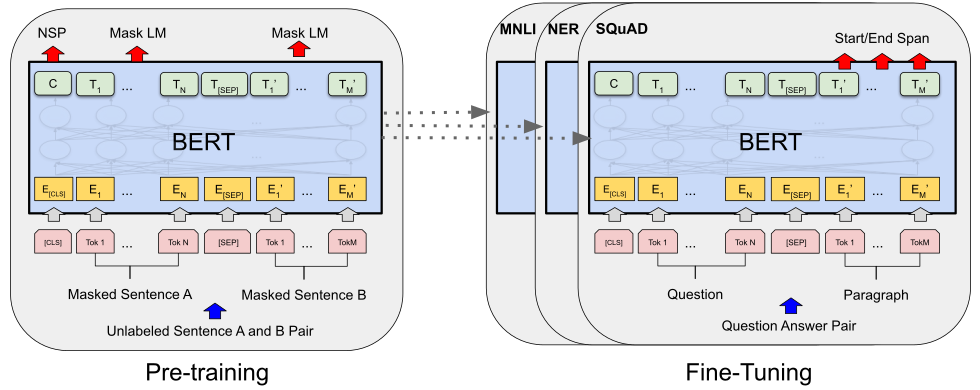
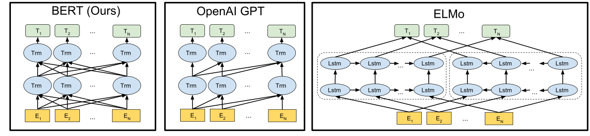
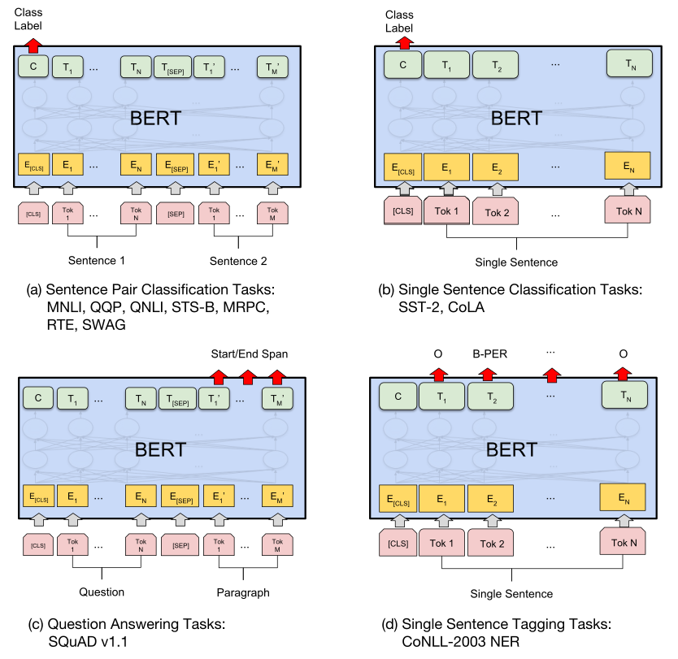

# BERT: Предобучение (pre-training) глубоких двунаправленных трансформеров для понимания языка

> **Неофициальный перевод.** Оригинал: Jacob Devlin, Ming-Wei Chang, Kenton Lee, Kristina Toutanova. «BERT: Pre-training of Deep Bidirectional Transformers for Language Understanding». NAACL-HLT, 2019. DOI: [10.18653/v1/N19-1423](https://doi.org/10.18653/v1/N19-1423). Лицензия: CC BY 4.0.

## Аннотация

Мы представляем новую модель представления языка под названием **BERT**, что является сокращением от **B**idirectional **E**ncoder **R**epresentations from **T**ransformers (двунаправленные представления, формируемые кодировщиком на основе трансформеров). В отличие от недавно разработанных моделей представления языка [Peters et al. (2018a)] и [Radford et al. (2018)], модель BERT предназначена для предобучения глубоких двунаправленных представлений на основе неразмеченного текста; при этом во всех слоях одновременно учитывается как левый, так и правый контекст. Благодаря этому предобученную модель BERT можно дообучить, добавив лишь один дополнительный выходной слой, чтобы получить модели передового уровня для решения самых разных задач — от ответов на вопросы до логического вывода по тексту — без необходимости вносить значительные изменения в архитектуру, специфичные для каждой задачи.

BERT по своей концепции проста и при этом чрезвычайно эффективна на практике. Она позволяет достигать новых рекордных результатов в одиннадцати задачах обработки естественного языка: показатель GLUE повышается до 80.5% (абсолютное улучшение на 7.7% процентных пункта), точность на наборе данных MultiNLI достигает 86.7% (абсолютное улучшение на 4.6% процентных пункта), значение Test F1 для задачи вопросно-ответной обработки по версии SQuAD v1.1 составляет 93.2 (абсолютное улучшение на 1.5 пункта), а значение Test F1 по версии SQuAD v2.0 равно 83.1 (абсолютное улучшение на 5.1 пункта).

## Введение

Предобучение языковых моделей оказалось эффективным способом улучшения результатов во многих задачах обработки естественного языка [Dai and Le (2015)]; [Peters et al. (2018a)]; [Radford et al. (2018)]; [Howard and Ruder (2018)]. К таким задачам относятся задачи на уровне предложений, например распознавание импликации в естественном языке [Bowman et al. (2015)]; [Williams et al. (2018)] и определение парафраз [Dolan and Brockett (2005)], целью которых является прогнозирование взаимосвязей между предложениями на основе их целостного анализа; также сюда относятся задачи на уровне токенов, такие как распознавание именованных сущностей и ответы на вопросы, при решении которых модели должны выдавать детализированные результаты на уровне отдельных токенов [Tjong Kim Sang and De Meulder (2003)]; [Rajpurkar et al. (2016)].

Существует два подхода к применению моделей, предварительно обученных на языковых данных, для решения прикладных задач (downstream task): *основанный на признаках* и *дообучение (fine-tuning)*. Подход, основанный на признаках, представленный, например, в работе ELMo [Peters et al. (2018a)], предполагает использование архитектур, специфичных для конкретной задачи, в которых предобученные представления выступают в качестве дополнительных признаков. Подход дообучения (fine-tuning), например, в рамках модели Generative Pre-trained Transformer (OpenAI GPT) [Radford et al. (2018)], предусматривает добавление минимального числа параметров, специфичных для задачи; при этом производится простое дообучение *all* предобученных параметров непосредственно на данных прикладной задачи (downstream task). Оба подхода используют одну и ту же функцию цели на этапе предобучения; при этом для формирования общих языковых представлений применяются однонаправленные языковые модели.

Мы утверждаем, что современные методы ограничивают потенциал предобученных представлений, особенно в случае подходов, предполагающих дообучение. Основным недостатком является однонаправленность стандартных языковых моделей, что в свою очередь ограничивает выбор архитектур, пригодных для использования на этапе предобучения. Например, в работе OpenAI GPT авторы применяют архитектуру, обрабатывающую данные слева направо; при этом в слоях самовнимания (self-attention) Transformer [Vaswani et al. (2017)] каждый токен может учитывать лишь предшествующие токены. Подобные ограничения неблагоприятно сказываются на выполнении задач на уровне предложений; они могут быть особенно вредными при применении подходов с дообучением к задачам на уровне отдельных токенов, таким как вопросно-ответная задача, где крайне важно учитывать контекст с обеих сторон.

В данной работе мы совершенствуем подходы, основанные на дообучении, предложив модель BERT — **B**idirectional **E**ncoder **R**epresentations from **T**ransformers. BERT позволяет устранить упомянутое выше ограничение однонаправленности путем использования целевой функции предобучения в виде маскированного языкового моделирования (MLM), вдохновленной задачей Cloze [Taylor (1953)]. При этом методе маскированного языкового моделирования случайным образом маскируются некоторые токены входного текста, а задача заключается в предсказании исходного идентификатора словаря для замаскированного слова исключительно на основе его контекста. В отличие от предобучения с использованием однонаправленных языковых моделей, данный подход позволяет представлениям интегрировать информацию как слева, так и справа, что дает возможность предобучить глубокую двунаправленную Transformer. Помимо маскированного языкового моделирования мы также применяем задачу предсказания следующего предложения (NSP) для совместного предобучения представлений пар текстов. Основные вклады данной работы заключаются в следующем:

## Смежные исследования

Существует многолетняя практика предобучения общих языковых представлений, и в данном разделе мы кратко рассмотрим наиболее распространенные подходы.

### Безнадзорные подходы, основанные на признаках

Создание универсально применимых представлений слов на протяжении десятилетий остается активной областью исследований; в этой сфере разрабатывались как нейросетевые рид (read; методы, основанные на искусственных нейронных сетях) методы [Brown et al. (1992)] [Ando and Zhang (2005)] [Blitzer et al. (2006)], так и ненейросетевые рид методы [Mikolov et al. (2013)] [Pennington et al. (2014)]. Предобученные векторы представлений слов являются неотъемлемой частью современных систем обработки естественного языка; они позволяют добиться значительного улучшения результатов по сравнению с векторами, обученными с нуля [Turian et al. (2010)]. Для предобучения таких векторов использовались задачи моделирования языка слева направо [Mnih and Hinton (2009)], а также задачи, заключающиеся в различении правильных и неправильных слов в левом и правом контексте [Mikolov et al. (2013)].

Эти подходы были обобщены на более крупные единицы текста, такие как векторы представления предложений [Kiros et al. (2015)]; [Logeswaran and Lee (2018)] или векторы представления абзацев [Le and Mikolov (2014)]. Для обучения представлений предложений в предыдущих исследованиях использовались задачи ранжирования возможных следующих предложений [Jernite et al. (2017)]; [Logeswaran and Lee (2018)], задачи генерации слов следующего предложения слева направо на основе представления предыдущего предложения [Kiros et al. (2015)], а также задачи, основанные на автоэнкодерах для удаления шума [Hill et al. (2016)].

Общие процедуры предобучения и дообучения для BERT. За исключением выходных слоев, в процессах предобучения и дообучения используются одинаковые архитектуры. Для инициализации моделей, предназначенных для различных последующих задач, применяются те же параметры, полученные в ходе предобучения. Во время дообучения корректируются все параметры модели. `[CLS]` представляет собой специальный символ, добавляемый в начало каждого входного примера; `[SEP]` — это специальный разделительный токен (например, используемый для разделения вопросов и ответов).

ELMo и его предшественник [Peters et al. (2017)]; а также [Peters et al. (2018a)] расширяют рамки традиционных исследований в области векторных представлений слов в новом направлении. Они извлекают *зависящие от контекста* признаки с помощью языковых моделей, обрабатывающих текст слева направо и справа налево. Контекстуальное представление каждого токена формируется путем объединения его представлений, полученных от этих двух моделей. При интеграции таких контекстуальных векторных представлений в существующие архитектуры, предназначенные для конкретных задач, ELMo позволяет достигать новых рекордных результатов на множестве ключевых тестовых наборов данных в области обработки естественного языка [Peters et al. (2018a)], включая задачи по ответам на вопросы [Rajpurkar et al. (2016)], анализу тональности [Socher et al. (2013)] и распознаванию именованных сущностей [Tjong Kim Sang and De Meulder (2003)]. В работе [Melamud et al. (2016)] было предложено обучать контекстуальным представлениям с помощью задачи предсказания конкретного слова на основе контекста слева и справа с использованием моделей типа LSTM. Подобно ELMo, их модель также основана на извлечении признаков и не является полностью двунаправленной. [Fedus et al. (2018)] демонстрирует, что задача заполнения пропусков в тексте может способствовать повышению устойчивости моделей генерации текста.

### Подходы к безнадзорному дообучению

Как и в случае с подходами, основанными на признаках, первые исследования в этом направлении использовали лишь параметры предобученных словных эмбеддингов из неразмеченного текста [Collobert and Weston (2008)].

В последнее время кодировщики предложений или документов, формирующие контекстуальные представления токенов, проходят **предобучение** на неразмеченном тексте, после чего их дообучают для решения определённой **прикладной задачи** [Dai and Le (2015)]; [Howard and Ruder (2018)]; [Radford et al. (2018)]. Преимуществом таких подходов является то, что лишь небольшое количество параметров требуется выучивать с нуля. Отчасти благодаря этому преимуществу модели OpenAI GPT [Radford et al. (2018)] продемонстрировали ранее лучшие результаты на множестве задач на уровне предложений из тестового набора GLUE [Wang et al. (2018a)]. Для **предобучения** подобных моделей использовались методы моделирования языка слева направо и автоэнкодеры [Howard and Ruder (2018)]; [Radford et al. (2018)]; [Dai and Le (2015)].

### Перенос обучения с использованием размеченных данных

Также проводились исследования, демонстрирующие эффективность применения полученных моделей в задачах с большими наборами данных, таких как умозаключение по естественному языку [Conneau et al. (2017)] и машинный перевод [McCann et al. (2017)]. В исследованиях в области компьютерного зрения также подчеркивалась важность трансферного обучения на основе крупных предварительно обученных моделей; эффективным подходом считается дообучение моделей, предварительно обученных на наборе данных ImageNet [Deng et al. (2009)]; [Yosinski et al. (2014)].

## BERT

В данном разделе мы описываем BERT и подробно рассматриваем его реализацию. Наша схема включает два этапа: *предобучение* и *дообучение*. На этапе предобучения модель обучается на неразмеченных данных с использованием различных задач предобучения. На этапе дообучения модель BERT сначала инициализируется параметрами, полученными в результате предобучения; после этого все её параметры дообучаются с применением размеченных данных для конкретных прикладных задач. Для каждой прикладной задачи создаётся своя модель после дообучения, хотя они и инициализируются одинаковыми предобученными параметрами. В качестве примера, сопровождающего данный раздел, выступает пример решения задачи вопросов и ответов, представленный на рисунке 1.

Одной из отличительных особенностей BERT является его унифицированная архитектура, применимая к различным задачам. Разница между исходной предобученной архитектурой и окончательной архитектурой, адаптированной для конкретных задач, практически отсутствует.

### Предобучение BERT

В отличие от [Peters et al. (2018a)] и [Radford et al. (2018)], мы не используем традиционные модели языка, обрабатывающие текст слева направо или справа налево, для предобучения BERT. Вместо этого мы предобучаем BERT с применением двух нерегулируемых задач, описанных в данном разделе. Этот этап показан в левой части рисунка 1.

### Дообучение BERT

Процесс дообучения является довольно простым, поскольку механизм самовнимания в Transformer позволяет BERT решать множество различных прикладных задач — независимо от того, требуется ли обработка одного текста или пары текстов — путем замены соответствующих входных и выходных данных. В случае задач, связанных с парами текстов, обычно применяется подход, при котором сначала каждый текст из пары кодируется отдельно, а затем используется двунаправленное взаимное внимание, как, например, в [Parikh et al. (2016)] и [Seo et al. (2017)]. В свою очередь, BERT использует механизм самовнимания для объединения этих двух этапов: кодирование склеенной пары текстов с помощью самовнимания фактически обеспечивает *двунаправленное* взаимное внимание между двумя предложениями.

Для каждой задачи мы просто подаём соответствующие входные и выходные данные в BERT и производим конечную настройку всех параметров в полном объёме. На вход подаются предложения `A` и `B`, полученные в ходе предобучения; они аналогичны (1) парам предложений в задачах парафразирования, (2) парам «гипотеза–исходный текст» в задачах вывода отношений между текстами, (3) парам «вопрос–текст» в задачах ответов на вопросы, а также (4) вырожденным парам «текст–$\varnothing$» в задачах классификации текстов или разметки последовательностей. На выходе векторные представления токенов поступают в выходной слой для задач на уровне токенов, таких как разметка последовательностей или ответы на вопросы; представление `[CLS]`, в свою очередь, поступает в выходной слой для задач классификации, например вывода отношений между текстами или анализа тональности.

По сравнению с предобучением, дообучение обходится относительно дешево. Все результаты, приведенные в статье, можно воспроизвести за максимум 1 час на одном Cloud TPU либо за несколько часов на GPU, используя абсолютно ту же предобученную модель.77 Например, модель BERT SQuAD может быть обучена примерно за 30 минут на одном Cloud TPU; при этом значение метрики Dev F1 достигает 91.0%. Особенности применения модели к конкретным задачам описаны в соответствующих подразделах раздела Эксперименты. Более подробная информация приводится в приложении Примеры применения дообучения к различным задачам.

GLUE Результаты тестов, полученные от сервера оценки ([https://gluebenchmark.com/leaderboard](https://gluebenchmark.com/leaderboard)). Число под каждой задачей указывает количество обучающих примеров. Столбец «Среднее значение» немного отличается от официального значения оценки GLUE, поскольку мы исключили проблематичный набор данных WNLI.99 См. вопрос 10 в [https://gluebenchmark.com/faq](https://gluebenchmark.com/faq). Модели BERT и OpenAI GPT представляют собой одномодельные решения для выполнения одной задачи. Для задач QQP и MRPC приводятся значения метрики F1; для задачи STS-B — значения корреляции Спирмена; для остальных задач указывается точность моделей. Мы исключаем из рассмотрения те модели, в состав которых входит компонент BERT.

## Эксперименты

В этом разделе мы приводим результаты **дообучения** модели BERT на 11 задачах обработки естественного языка.

### GLUE

Бенчмарк General Language Understanding Evaluation (GLUE) [Wang et al. (2018a)] представляет собой набор разнообразных задач по пониманию естественного языка. Подробные описания наборов данных GLUE приведены в Приложении Подробные описания экспериментов по тестированию на бенчмарке GLUE..

Для проведения дообучения на данных GLUE мы представляем входную последовательность (как состоящую из одного предложения, так и из пары предложений) в соответствии с описанием в разделе BERT; в качестве агрегированного представления используется конечный скрытый вектор $C\in\mathbb{R}^{H}$, соответствующий первому входному токену (`[CLS]`). Единственными новыми параметрами, появляющимися в процессе дообучения, являются веса классификационного слоя $W\in\mathbb{R}^{K\times H}$; при этом $K$ обозначает количество классов. Для вычисления стандартной функции потерь классификации применяются параметры $C$ и $W$; результатом этого вычисления является значение $\log({\rm softmax}(CW^{T}))$.

Мы используем размер пакета данных, равный 32, и проводим **дообучение** в течение 3 эпох для всех GLUE задач. Для каждой задачи мы выбирали наиболее подходящую скорость обучения (из числа 5e-5, 4e-5, 3e-5 и 2e-5) на основе данных из набора Dev. Кроме того, для BERT${}_{\textsc{LARGE}}$ мы обнаружили, что дообучение иногда даёт нестабильные результаты при работе с малыми наборами данных; поэтому мы выполняли несколько случайных перезапусков и выбирали наилучшую модель по критериям набора Dev. При этом используется тот же предобученный чекпоинт, однако производится иная перестановка данных и инициализация слоя классификатора.1010 В распределении данных набора GLUE отсутствуют метки тестовых примеров; поэтому для каждого из BERT${}_{\textsc{BASE}}$ и BERT${}_{\textsc{LARGE}}$ мы отправили лишь один результат на сервер оценки GLUE.

Результаты представлены в таблице 9. И BERT${}_{\textsc{BASE}}$, и BERT${}_{\textsc{LARGE}}$ значительно превосходят все системы на всех задачах, получая соответственно 4.5% и 7.0% среднего прироста точности относительно предыдущего уровня техники. Отметим, что BERT${}_{\textsc{BASE}}$ и OpenAI GPT почти идентичны по архитектуре модели, за исключением маскирования внимания. Для самой крупной и наиболее часто упоминаемой задачи GLUE, MNLI, BERT даёт абсолютный прирост точности 4.6%. На официальной таблице лидеров GLUE https://gluebenchmark.com/leaderboard, BERT${}_{\textsc{LARGE}}$ получает оценку 80.5, тогда как OpenAI GPT — 72.8 на момент написания.

Мы установили, что BERT${}_{\textsc{LARGE}}$ значительно превосходит BERT${}_{\textsc{BASE}}$ по результатам на всех задачах, особенно на тех, для которых имеется крайне мало обучающих данных. Влияние размера модели более подробно рассматривается в разделе Влияние размера модели.

### SQuAD v1.1

Стэнфордский датасет для вопросно-ответных задач (SQuAD v1.1) представляет собой набор из 100 тысяч вопросов и ответов, собранных с помощью краудсорсинга [Rajpurkar et al. (2016)]. При наличии вопроса и фрагмента текста из Википедии, содержащего ответ, необходимо определить соответствующий фрагмент текста в качестве ответа.

Как показано на рисунке 1, при выполнении задачи по поиску ответов в тексте входной вопрос и соответствующий фрагмент текста представляются в виде единой последовательности; для вопроса используется эмбеддинг `A`, а для текста — эмбеддинг `B`. В процессе дообучения вводятся лишь вектор начала $S\in\mathbb{R}^{H}$ и вектор конца $E\in\mathbb{R}^{H}$. Вероятность того, что слово $i$ является началом искомого фрагмента текста, вычисляется как скалярное произведение векторов $T_{i}$ и $S$ с последующим применением функции softmax ко всем словам в абзаце: $P_{i}=\frac{e^{S{\cdot}T_{i}}}{\sum_{j}e^{S{\cdot}T_{j}}}$. Аналогичная формула применяется для определения конца искомого фрагмента. Оценка подходящего фрагмента текста, начинающегося с позиции $i$ и заканчивающегося на позиции $j$, задается выражением $S{\cdot}T_{i}+E{\cdot}T_{j}$; в качестве предсказания выбирается фрагмент с наибольшей оценкой, при этом используется параметр $j\geq i$. Целевой функцией обучения служит сумма логарифмических вероятностей правильных позиций начала и конца ответа. Дообучение проводится в течение 3 эпох при скорости обучения 5e-5 и размере пакета 32.

Результаты для SQuAD 1.1. Рассматриваемый ансамбль (ensemble) BERT представляет собой совокупность из 7 систем, использующих различные чекпоинты предобучения и разные начальные условия для дообучения.

Результаты работы SQuAD 2.0. Мы исключаем те варианты, в которых в качестве одного из компонентов используется BERT.

В таблице 2 приведены лучшие результаты из рейтинга, а также данные по наиболее эффективным опубликованным системам: [Seo et al. (2017)], [Clark and Gardner (2018)], [Peters et al. (2018a)] и [Hu et al. (2018)]. Однако для лидирующих систем из рейтинга SQuAD отсутствуют актуальные публичные описания. Всего зафиксировано 1212 таких случаев. Система QANet описана в [Yu et al. (2018)], однако после публикации она претерпела значительные улучшения. Авторам этих систем разрешается использовать любые доступные публичные данные при обучении. Поэтому в нашей системе мы применили умеренное расширение набора данных: сначала провели дообучение на наборе данных TriviaQA [Joshi et al. (2017)], а затем — на наборе данных SQuAD.

Наша наилучшая модель превосходит лучшую модель из рейтинга по показателю F1 на 1.5 пункта при использовании ансамбля и на 1.3 пункта в случае работы в одиночном режиме. Более того, наша одиночная модель BERT показывает более высокий результат по F1, чем лучший ансамбль моделей. При отсутствии данных для дообучения на наборе TriviaQA мы теряем лишь 0.1-0.4 пункта по F1, однако всё равно значительно опережаем все существующие системы.1313 Использованные нами данные из TriviaQA представляют собой абзацы из TriviaQA-Wiki, состоящие из первых 400 токенов документов, содержащих хотя бы один из предложенных вариантов ответа.

### SQuAD v2.0

Задача SQuAD 2.0 расширяет определение проблемы в рамках SQuAD 1.1, допуская возможность отсутствия краткого ответа в предоставленном абзаце; это делает постановку задачи более реалистичной.

Мы применили простой подход для адаптации модели SQuAD v1.1 BERT к данной задаче. Вопросы, на которые не существует ответа, мы рассматриваем как вопросы, у которых диапазон ответа начинается и заканчивается на позиции токена `[CLS]`. Пространство вероятностей для позиций начала и конца диапазона ответа было расширено за счёт включения позиции токена `[CLS]`. Для формирования прогноза мы сравниваем оценку диапазона «ответа нет»: $s_{\tt null}=S{\cdot}C+E{\cdot}C$ с оценкой наилучшего ненулевого диапазона ответа $\hat{s_{i,j}}$ = ${\tt max}_{j\geq i}S{\cdot}T_{i}+E{\cdot}T_{j}$. Ненулевой ответ прогнозируется в том случае, если выполняется условие $\hat{s_{i,j}}>s_{\tt null}+\tau$; при этом порог $\tau$ подбирается на выборке для проверки таким образом, чтобы максимизировать значение метрики F1. Для обучения данной модели данные из набора TriviaQA не использовались. Обучение проводилось в течение 2 эпох при скорости обучения 5e-5 и размере пакета 48.

Результаты, сравненные с предыдущими значениями в рейтинге и с данными из ведущих опубликованных работ [Sun et al. (2018)]; [Wang et al. (2018b)], представлены в таблице 3; при этом системы, использующие BERT в качестве одного из компонентов, в расчет не принимались. Мы отмечаем увеличение показателя F1 на 5.1 пункта по сравнению с ранее лучшей системой.

### SWAG (State‑of‑the‑Art Web Application Generator)

Набор данных Situations With Adversarial Generations (SWAG) включает 113 тысяч примеров для завершения пар предложений; эти примеры используются для оценки способности к логическому выводу на основе здравого смысла [Zellers et al. (2018)]. При наличии исходного предложения необходимо выбрать наиболее правдоподобное продолжение из четырех вариантов.

При проведении дообучения на наборе данных SWAG мы формируем четыре входных последовательности; каждая из них представляет собой конкатенацию исходного предложения (предложение `A`) и одного из возможных продолжений (предложение `B`). Единственными параметрами, специфичными для данной задачи, является вектор, скалярное произведение которого с векторным представлением токена `[CLS]` $C$ дает оценку каждого варианта продолжения; эта оценка затем нормализуется с помощью слоя softmax.

Мы проводим дообучение модели в течение 3 эпох, используя скорость обучения 2e-5 и размер пакета 16. Результаты представлены в таблице 4. Модель BERT${}_{\textsc{LARGE}}$ превосходит базовую систему ESIM+ELMo, предложенную авторами, на 27.1%, а также превосходит модели OpenAI и GPT на 8.3%.

Точности модели SWAG на выборке Dev и Test. † Уровень производительности человека оценивался по 100 образцам, как указано в оригинальной статье по SWAG.

## Исследования методом «вычёркивания»

В данном разделе мы проводим эксперименты по абляции для ряда аспектов BERT с целью более полного понимания их относительной значимости. Дополнительные исследования по абляции приведены в Приложении Дополнительные исследования по абляции.

### Влияние задач предобучения

Мы демонстрируем важность глубокой двунаправленности BERT, оценивая две цели предобучения с использованием абсолютно одинаковых данных для предобучения, схемы дообучения и гиперпараметров, как у BERT${}_{\textsc{BASE}}$:

**Без предсказания следующего предложения**: двунаправленная модель, обученная с использованием метода маскированного языкового моделирования (MLM), но без выполнения задачи предсказания следующего предложения (NSP). **Только левый контекст и без предсказания следующего предложения**: модель, использующая исключительно левый контекст; обучалась с применением стандартного алгоритма языкового моделирования слева направо (LTR), а не метода MLM. Ограничение на использование только левого контекста сохранялось и на этапе дообучения, поскольку его снятие приводило к несоответствию между этапами предобучения и дообучения, что снижало эффективность модели в последующих задачах. Кроме того, данная модель предварительно обучалась без выполнения задачи NSP. Она напрямую сопоставима с OpenAI GPT, однако для её обучения использовался более крупный набор данных, иная форма представления входных данных и иной режим дообучения.

Исследование влияния отдельных этапов предобучения с использованием архитектуры BERT${}_{\textsc{BASE}}$. Модель под названием «Без NSP» обучается без выполнения задачи предсказания следующего предложения. Модель «LTR и без NSP» обучается как лево-правосторонняя языковая модель без учета задачи предсказания следующего предложения; подобный подход применялся в работах OpenAI и GPT. В модели «+ BiLSTM» во время этапа дообучения поверх модели «LTR и без NSP» добавляется случайно инициализированный слой BiLSTM.

Сначала мы рассмотрим влияние задачи предсказания следующего предложения. В таблице 5 показано, что исключение этой задачи никак не влияет на качество работы модели на датасетах QNLI, MNLI и SQuAD 1.1. Затем мы оценили влияние обучения двунаправленных представлений, сравнив модели «No NSP» и «LTR & No NSP». Модель типа LTR показывает худшие результаты по сравнению с моделью, использующей маскированное языковое моделирование, на всех задачах; при этом наблюдается значительное падение качества на датасетах MRPC и SQuAD.

Для SQuAD интуитивно понятно, что модель типа LTR будет показывать плохие результаты при предсказании токенов, поскольку скрытые состояния на уровне токенов не учитывают контекст справа. В попытке улучшить работу такой модели мы добавили сверху случайно инициализированный слой BiLSTM. Это действительно значительно улучшило результаты на SQuAD, однако они всё равно существенно хуже, чем у предварительно обученных двунаправленных моделей. Кроме того, использование BiLSTM негативно сказывается на производительности в задачах типа GLUE.

Мы понимаем, что также возможно обучить отдельные модели для обработки текста слева направо и справа налево, а затем представлять каждый токен как конкатенацию выходных данных этих двух моделей, как это делает ELMo. Однако: (а) такой подход вдвое дороже по вычислительным затратам, чем использование одной двунаправленной модели; (б) он неудобен для задач вроде вопросно-ответной системы, поскольку модель, обрабатывающая текст справа налево, не сможет учитывать вопрос при формировании ответа; (в) такой подход по своей эффективности уступает глубокой двунаправленной модели, так как последняя может использовать контекст как слева, так и справа на каждом слое.

### Влияние размера модели

В этом разделе мы исследуем влияние размера модели на точность результатов после дообучения. Мы обучили несколько моделей BERT, в которых количество слоев, скрытых юнитов и внимательных блоков варьировалось; при этом все остальные гиперпараметры и процедура обучения оставались такими же, как описано ранее.

Результаты по выбранным GLUE задачам представлены в таблице 6. В этой таблице указана средняя точность на тестовом наборе, полученная в результате 5 независимых сеансов **дообучения**. Видно, что использование более крупных моделей приводит к заметному повышению точности на всех четырех наборах данных; это справедливо даже для задачи MRPC, для которой имеется всего 3 600 размеченных обучающих примеров, а характер задачи существенно отличается от задач, использовавшихся при **предобучении**. Возможно, удивительно то, что такое значительное улучшение результатов удается достичь даже при использовании моделей, уже довольно больших по сравнению с типичными моделями, описанными в литературе. Например, наибольшая модель Transformer, рассмотренная в [Vaswani et al. (2017)], имеет параметры (L=6, H=1024, A=16) и 100 миллионов параметров в кодировщике; наибольшая модель Transformer, найденная нами в литературе, обладает параметрами (L=64, H=512, A=2) и 235 миллионов параметров [Al-Rfou et al. (2018)]. В сравнении с ними модель BERT${}_{\textsc{BASE}}$ содержит 110 миллионов параметров, а модель BERT${}_{\textsc{LARGE}}$ — 340 миллионов параметров.

Исследование влияния размера модели BERT. #L — количество слоев; #H — размер скрытого представления; #A — количество внимательных головок. «LM (ppl)» — это показатель запутанности (перплексности) маскированной языковой модели для отложенных фрагментов обучающих данных.

Давно известно, что увеличение размера модели способствует непрерывному улучшению результатов при решении крупномасштабных прикладных задач, таких как машинный перевод и моделирование языка; это подтверждается значениями перплексности модели для отложенного обучающего набора, приведенными в таблице 6. Тем не менее, мы считаем, что наша работа впервые убедительно демонстрирует: масштабирование модели до экстремальных размеров также приводит к значительному улучшению результатов при решении задач очень малого масштаба, при условии достаточной предварительной подготовки модели. В работе [Peters et al. (2018b)] получены неоднозначные результаты относительно влияния увеличения числа слоев предварительно обученной двухслойной модели с двух до четырех на решение прикладных задач; в работе [Melamud et al. (2016)] лишь кратко упоминалось, что увеличение размерности скрытого слоя с 200 до 600 положительно сказывается на результатах, однако дальнейшее увеличение до 1000 не приносит дополнительных улучшений. В обеих вышеупомянутых работах использовался подход, основанный на извлечении признаков из модели. Мы выдвигаем гипотезу: если модель непосредственно дообучается на конкретных прикладных задачах, при этом добавляя лишь небольшое количество случайно инициализированных параметров, то такие специализированные модели могут извлекать выгоду из более крупных и выразительных предварительно обученных представлений даже в условиях крайне ограниченного объема обучающих данных.

### Подход, основанный на использовании признаков, с применением BERT

Все представленные до сих пор результаты, полученные с участием BERT, были достигнуты с помощью метода дообучения: к предобученной модели добавляется простой классификационный слой, после чего все параметры совместно дообучаются для решения конкретной прикладной задачи. Однако подход, основанный на извлечении фиксированных признаков из предобученной модели, обладает рядом преимуществ. Во-первых, не для всех задач возможно легкое построение архитектуры энкодера типа Transformer; в таких случаях требуется создание специализированной архитектуры модели. Во-вторых, существует значительная вычислительная выгода в том, чтобы один раз предварительно вычислить сложное представление обучающих данных, а затем проводить множество экспериментов с более простыми моделями, использующими это представление.

В данном разделе мы сравниваем два подхода, применяя BERT к задаче распознавания именованных сущностей (NER) CoNLL-2003 [Tjong Kim Sang and De Meulder (2003)]. В качестве входных данных для BERT используется модель WordPiece, сохраняющая регистр символов; при этом задействуется максимально возможный контекст документа, предоставляемый данными. Согласно общепринятой практике, задача формулируется как задача разметки, однако на выходе не применяется слой CRF. В качестве входа для классификатора на уровне токенов, обучающегося на множестве меток NER, используется представление первого субтокена.

Для исключения этапа дообучения мы применяем подход, основанный на извлечении признаков: из одного или нескольких слоев извлекаются активации *без* проведения дообучения каких-либо параметров модели BERT. Полученные контекстуальные эмбеддинги используются в качестве входных данных для случайно инициализированного двухслойного BiLSTM размерностью 768, расположенного перед классификационным слоем.

Результаты представлены в таблице 7. BERT${}_{\textsc{LARGE}}$ показывает конкурентоспособные результаты по сравнению с передовыми методами. Наилучший результат достигается при объединении представлений токенов из четырех верхних скрытых слоев предварительно обученного Transformer; данный подход уступает методу дообучения всей модели лишь на 0.3 пункта по метрике F1. Это подтверждает, что BERT эффективен как при дообучении, так и при использовании подходов, основанных на извлечении признаков.

Результаты распознавания именованных сущностей по стандарту CoNLL-2003. Гиперпараметры подбирались с использованием набора данных Dev. Приведённые оценки для наборов Dev и Test представляют собой средние значения, полученные при 5 случайных запусках с применением этих гиперпараметров.

## Заключение

Недавние эмпирические успехи, достигнутые благодаря трансферному обучению с использованием языковых моделей, показали, что качественное, неконтролируемое предобучение является неотъемлемой частью многих систем обработки естественного языка. В частности, эти результаты позволяют даже задачам с ограниченным объемом данных извлекать выгоду из глубоких однонаправленных архитектур. Наш основной вклад заключается в расширении этих выводов на глубокие **двунаправленные** архитектуры, что дает возможность одной и той же предобученной модели успешно решать широкий спектр задач обработки естественного языка.

**Приложение к статье «BERT: Предобучение глубоких двунаправленных трансформеров для понимания языка»**

Мы разделили приложение на три части:

## Дополнительные сведения о BERT

Различия в архитектурах моделей при предобучении. В модели BERT используется двунаправленный Transformer. В модели OpenAI GPT применяется однонаправленный слева направо Transformer. Модель ELMo формирует признаки для прикладных задач путем конкатенации результатов независимо предобученных однонаправленных слева направо и справа налево LSTM-сетей. Из всех трех моделей только представления, полученные в модели BERT, во всех слоях зависят одновременно от контекста слева и справа. Помимо различий в архитектуре, методы BERT и OpenAI GPT представляют собой подходы к дообучению; метод ELMo же относится к подходам, основанным на использовании готовых признаков.

### Примеры задач для предобучения

Ниже приведены примеры задач предобучения.

### Процедура предобучения

Для формирования каждой обучающей последовательности мы выбираем два фрагмента текста из корпуса; их мы называем «предложениями», хотя на практике они обычно значительно длиннее одного предложения (но могут быть и короче). Первому фрагменту присваивается эмбеддинг `A`, а второму — эмбеддинг `B`. В 50 % случаев фрагмент `B` действительно является следующим предложением после фрагмента `A`; в остальных 50 % случаев он выбирается случайно. Такой подход используется для выполнения задачи **предсказания следующего предложения** (next sentence prediction; NSP). Длина объединённой последовательности составляет ровно $\leq$ 512 токенов. После процедуры токенизации с помощью WordPiece применяется маскирование: вероятность маскирования каждого токена равна 15 %, при этом не учитывается, является ли токен частью слова.

Мы проводим обучение с размером пакета 256 последовательностей (256 последовательностей * 512 токенов = 128 000 токенов на пакет) в течение 1 000 000 шагов; это соответствует примерно 40 эпохам на корпусе из 3.3 миллиарда слов. В качестве оптимизатора используется Adam с скоростью обучения 1e-4, параметрами ${\beta}_{1}=0.9$ и ${\beta}_{2}=0.999$; коэффициент затухания L2 равен $0.01$. В течение первых 10 000 шагов скорость обучения постепенно увеличивается, а затем линейно уменьшается. Во всех слоях применяется вероятность отбрасывания нейронов (dropout) в размере 0.1. Вместо стандартной функции активации `relu` мы используем активацию `gelu` с параметром [Hendrycks and Gimpel (2016)], согласно работам OpenAI и GPT. Функция потерь при обучении представляет собой сумму среднего логарифма вероятностей при маскировании токенов в рамках LM и среднего логарифма вероятностей при предсказании следующего предложения (NSP).

Процесс предобучения BERT${}_{\textsc{BASE}}$ осуществлялся на 4 Cloud TPU в режиме Pod (всего 16 чипов TPU).1414 https://cloudplatform.googleblog.com/2018/06/Cloud-TPU-now-offers-preemptible-pricing-and-global-availability.html Процесс предобучения BERT${}_{\textsc{LARGE}}$ проводился на 16 Cloud TPU (всего 64 чипа TPU). Каждый этап предобучения занимал 4 дня.

Более длинные последовательности требуют значительно больших вычислительных затрат, поскольку механизм внимания имеет квадратичную зависимость от длины последовательности. Для ускорения процесса предобучения в наших экспериментах модель предварительно обучается при длине последовательности 128 на протяжении 90% всех шагов. Затем оставшиеся 10% шагов выполняются при длине последовательности 512, чтобы модель смогла изучить позиционные эмбеддинги.

### Процедура дообучения

При проведении дообучения большинство гиперпараметров модели остаются такими же, как и при предобучении, за исключением размера пакета, скорости обучения и количества эпох. Вероятность применения механизма дропаута неизменно составляла 0.1. Оптимальные значения гиперпараметров зависят от конкретной задачи, однако мы установили следующий диапазон возможных значений, который хорошо подходит для всех задач:

Мы также заметили, что при работе с большими наборами данных (например, содержащими более 100 тысяч размеченных обучающих примеров) чувствительность к выбору гиперпараметров значительно ниже, чем при использовании небольших наборов данных. Процесс дообучения обычно проходит очень быстро; поэтому вполне разумно провести полный перебор указанных выше параметров и выбрать модель, показавшую наилучшие результаты на выборочном наборе данных.

### Сравнение BERT, ELMo и OpenAI GPT

В данной работе исследуются различия между современными популярными моделями для обучения представлений, включая ELMo, OpenAI, GPT и BERT. Сравнение архитектур этих моделей наглядно представлено на рисунке 3. Следует отметить, что помимо различий в архитектуре, BERT и OpenAI GPT представляют собой методы дообучения, тогда как ELMo относится к подходам, основанным на извлечении признаков.

Наиболее сопоставимым существующим методом предобучения по отношению к BERT является OpenAI GPT – метод, предусматривающий обучение одонаправленной Transformer языковой модели на большом текстовом корпусе. Фактически многие конструктивные решения в BERT были приняты специально с целью максимального сближения этого метода с GPT, чтобы облегчить их сопоставление. Основной тезис данной работы заключается в том, что двунаправленность модели и два задания предобучения, описанные в разделе Предобучение BERT, обусловливают большую часть наблюдаемых улучшений; однако следует отметить наличие ряда других различий в процессе обучения BERT и GPT.

Чтобы выделить влияние этих различий, в разделе Влияние задач предобучения мы проводим эксперименты по абляции, которые показывают, что большая часть наблюдаемых улучшений действительно обусловлена двумя задачами предобучения и двунаправленностью, которую они обеспечивают.

### Примеры применения дообучения к различным задачам

Пример применения дообучения BERT к различным задачам представлен на рисунке 4. Наші моделі, адаптированные под конкретные задачи, формируются путём добавления к BERT ещё одного выходного слоя; благодаря этому требуется обучать лишь минимальное количество параметров с нуля. Среди рассматриваемых задач задачи (a) и (b) относятся к уровню последовательностей, а задачи (c) и (d) — к уровню отдельных токенов. На рисунке $E$ обозначает входное эмбеддинг, $T_{i}$ — контекстуальное представление токена $i$; символ [CLS] служит для формирования выходных данных классификации, а символ [SEP] используется для разделения несмежных последовательностей токенов.

Примеры применения дообучения BERT для различных задач.

## Подробное описание экспериментальной установки

### Подробные описания экспериментов по тестированию на бенчмарке GLUE.

Полученные нашим GLUE результаты, представленные в таблице9, основаны на данных из [https://gluebenchmark.com/leaderboard](https://gluebenchmark.com/leaderboard) и [https://blog.openai.com/language-unsupervised](https://blog.openai.com/language-unsupervised). В рамках GLUE используются следующие наборы данных; их описания изначально были обобщены в [Wang et al. (2018a)]:

## Дополнительные исследования по абляции

### Влияние количества шагов обучения

На рисунке 5 показана точность модели на тестовой выборке MNLI после дообучения с использованием чекпоинта, предварительно обученного в течение $k$ шагов. Это позволяет нам ответить на следующие вопросы:

Анализ зависимости точности от количества шагов обучения. На графике показана точность модели на наборе данных MNLI после дообучения, причем начальные параметры модели были предварительно обучены в течение $k$ шагов. По оси абсцисс отложено значение параметра $k$.

### Абляция при различных процедурах маскирования

В разделе Предобучение BERT мы отмечали, что BERT применяет смешанную стратегию маскирования целевых токенов во время предобучения с использованием цели маскированного языкового моделирования (MLM). Ниже приводится исследование, призванное оценить влияние различных стратегий маскирования.

Следует отметить, что цель различных стратегий маскирования заключается в уменьшении несоответствия между процессом предобучения и последующим дообучением, поскольку символ `[MASK]` никогда не встречается на этапе дообучения. Мы приводим результаты тестирования на тестовом наборе данных как для задачи MNLI, так и для задачи распознавания именованных сущностей (NER). В случае задачи NER мы рассматриваем как подход с дообучением, так и подход, основанный на использовании заранее вычисленных признаков; мы полагаем, что несоответствие будет более выраженным при использовании последнего подхода, поскольку модель не получит возможности корректировать свои представления.

Исследование влияния различных стратегий маскирования.

Результаты представлены в таблице 8. В этой таблице «Mask» означает, что мы заменяем целевой токен символом `[MASK]` при использовании метода маскированного языкового моделирования; «Same» означает, что целевой токен остается без изменений; «Rnd» означает, что целевой токен заменяется на другой случайный токен.

Цифры в левой части таблицы отражают вероятности применения конкретных стратегий во время предобучения с использованием маскированного языкового моделирования (MLM); для BERT эти значения составляют 80%, 10% и 10% соответственно. В правой части таблицы приведены результаты на тестовом наборе Dev. В рамках подхода, основанного на извлечении признаков, мы объединяем последние 4 слоя модели BERT для формирования признаков; данный метод был признан оптимальным в разделе Подход, основанный на использовании признаков, с применением BERT.

Из таблицы видно, что дообучение неожиданно устойчиво к различным стратегиям маскирования. Однако, как и ожидалось, применение исключительно стратегии Mask в рамках подхода, основанного на признаках, оказалось проблематичным для задачи распознавания именованных сущностей. Примечательно также, что использование лишь стратегии Rnd дает значительно худшие результаты по сравнению с нашей стратегией.

## Список литературы

Akbik et al. (2018) Akbik et al. (2018) Alan Akbik, Duncan Blythe, and Roland Vollgraf. 2018. Contextual string embeddings for sequence labeling. In Proceedings of the 27th International Conference on Computational Linguistics, pages 1638–1649.
Al-Rfou et al. (2018) Al-Rfou et al. (2018) Rami Al-Rfou, Dokook Choe, Noah Constant, Mandy Guo, and Llion Jones. 2018. Character-level language modeling with deeper self-attention. arXiv preprint arXiv:1808.04444.
Ando and Zhang (2005) Ando and Zhang (2005) Rie Kubota Ando and Tong Zhang. 2005. A framework for learning predictive structures from multiple tasks and unlabeled data. Journal of Machine Learning Research, 6(Nov):1817–1853.
Bentivogli et al. (2009) Bentivogli et al. (2009) Luisa Bentivogli, Bernardo Magnini, Ido Dagan, Hoa Trang Dang, and Danilo Giampiccolo. 2009. The fifth PASCAL recognizing textual entailment challenge. In TAC. NIST.
Blitzer et al. (2006) Blitzer et al. (2006) John Blitzer, Ryan McDonald, and Fernando Pereira. 2006. Domain adaptation with structural correspondence learning. In Proceedings of the 2006 conference on empirical methods in natural language processing, pages 120–128. Association for Computational Linguistics.
Bowman et al. (2015) Bowman et al. (2015) Samuel R. Bowman, Gabor Angeli, Christopher Potts, and Christopher D. Manning. 2015. A large annotated corpus for learning natural language inference. In EMNLP. Association for Computational Linguistics.
Brown et al. (1992) Brown et al. (1992) Peter F Brown, Peter V Desouza, Robert L Mercer, Vincent J Della Pietra, and Jenifer C Lai. 1992. Class-based n-gram models of natural language. Computational linguistics, 18(4):467–479.
Cer et al. (2017) Cer et al. (2017) Daniel Cer, Mona Diab, Eneko Agirre, Inigo Lopez-Gazpio, and Lucia Specia. 2017. Semeval-2017 task 1: Semantic textual similarity multilingual and crosslingual focused evaluation. In Proceedings of the 11th International Workshop on Semantic Evaluation (SemEval-2017), pages 1–14, Vancouver, Canada. Association for Computational Linguistics.
Chelba et al. (2013) Chelba et al. (2013) Ciprian Chelba, Tomas Mikolov, Mike Schuster, Qi Ge, Thorsten Brants, Phillipp Koehn, and Tony Robinson. 2013. One billion word benchmark for measuring progress in statistical language modeling. arXiv preprint arXiv:1312.3005.
Chen et al. (2018) Chen et al. (2018) Z. Chen, H. Zhang, X. Zhang, and L. Zhao. 2018. Quora question pairs.
Clark and Gardner (2018) Clark and Gardner (2018) Christopher Clark and Matt Gardner. 2018. Simple and effective multi-paragraph reading comprehension. In ACL.
Clark et al. (2018) Clark et al. (2018) Kevin Clark, Minh-Thang Luong, Christopher D Manning, and Quoc Le. 2018. Semi-supervised sequence modeling with cross-view training. In Proceedings of the 2018 Conference on Empirical Methods in Natural Language Processing, pages 1914–1925.
Collobert and Weston (2008) Collobert and Weston (2008) Ronan Collobert and Jason Weston. 2008. A unified architecture for natural language processing: Deep neural networks with multitask learning. In Proceedings of the 25th international conference on Machine learning, pages 160–167. ACM.
Conneau et al. (2017) Conneau et al. (2017) Alexis Conneau, Douwe Kiela, Holger Schwenk, Loïc Barrault, and Antoine Bordes. 2017. Supervised learning of universal sentence representations from natural language inference data. In Proceedings of the 2017 Conference on Empirical Methods in Natural Language Processing, pages 670–680, Copenhagen, Denmark. Association for Computational Linguistics.
Dai and Le (2015) Dai and Le (2015) Andrew M Dai and Quoc V Le. 2015. Semi-supervised sequence learning. In Advances in neural information processing systems, pages 3079–3087.
Deng et al. (2009) Deng et al. (2009) J. Deng, W. Dong, R. Socher, L.-J. Li, K. Li, and L. Fei-Fei. 2009. ImageNet: A Large-Scale Hierarchical Image Database. In CVPR09.
Dolan and Brockett (2005) Dolan and Brockett (2005) William B Dolan and Chris Brockett. 2005. Automatically constructing a corpus of sentential paraphrases. In Proceedings of the Third International Workshop on Paraphrasing (IWP2005).
Fedus et al. (2018) Fedus et al. (2018) William Fedus, Ian Goodfellow, and Andrew M Dai. 2018. Maskgan: Better text generation via filling in the_. arXiv preprint arXiv:1801.07736.
Hendrycks and Gimpel (2016) Hendrycks and Gimpel (2016) Dan Hendrycks and Kevin Gimpel. 2016. Bridging nonlinearities and stochastic regularizers with gaussian error linear units. CoRR, abs/1606.08415.
Hill et al. (2016) Hill et al. (2016) Felix Hill, Kyunghyun Cho, and Anna Korhonen. 2016. Learning distributed representations of sentences from unlabelled data. In Proceedings of the 2016 Conference of the North American Chapter of the Association for Computational Linguistics: Human Language Technologies. Association for Computational Linguistics.
Howard and Ruder (2018) Howard and Ruder (2018) Jeremy Howard and Sebastian Ruder. 2018. Universal language model fine-tuning for text classification. In ACL. Association for Computational Linguistics.
Hu et al. (2018) Hu et al. (2018) Minghao Hu, Yuxing Peng, Zhen Huang, Xipeng Qiu, Furu Wei, and Ming Zhou. 2018. Reinforced mnemonic reader for machine reading comprehension. In IJCAI.
Jernite et al. (2017) Jernite et al. (2017) Yacine Jernite, Samuel R. Bowman, and David Sontag. 2017. Discourse-based objectives for fast unsupervised sentence representation learning. CoRR, abs/1705.00557.
Joshi et al. (2017) Joshi et al. (2017) Mandar Joshi, Eunsol Choi, Daniel S Weld, and Luke Zettlemoyer. 2017. Triviaqa: A large scale distantly supervised challenge dataset for reading comprehension. In ACL.
Kiros et al. (2015) Kiros et al. (2015) Ryan Kiros, Yukun Zhu, Ruslan R Salakhutdinov, Richard Zemel, Raquel Urtasun, Antonio Torralba, and Sanja Fidler. 2015. Skip-thought vectors. In Advances in neural information processing systems, pages 3294–3302.
Le and Mikolov (2014) Le and Mikolov (2014) Quoc Le and Tomas Mikolov. 2014. Distributed representations of sentences and documents. In International Conference on Machine Learning, pages 1188–1196.
Levesque et al. (2011) Levesque et al. (2011) Hector J Levesque, Ernest Davis, and Leora Morgenstern. 2011. The winograd schema challenge. In Aaai spring symposium: Logical formalizations of commonsense reasoning, volume 46, page 47.
Logeswaran and Lee (2018) Logeswaran and Lee (2018) Lajanugen Logeswaran and Honglak Lee. 2018. An efficient framework for learning sentence representations. In International Conference on Learning Representations.
McCann et al. (2017) McCann et al. (2017) Bryan McCann, James Bradbury, Caiming Xiong, and Richard Socher. 2017. Learned in translation: Contextualized word vectors. In NIPS.
Melamud et al. (2016) Melamud et al. (2016) Oren Melamud, Jacob Goldberger, and Ido Dagan. 2016. context2vec: Learning generic context embedding with bidirectional LSTM. In CoNLL.
Mikolov et al. (2013) Mikolov et al. (2013) Tomas Mikolov, Ilya Sutskever, Kai Chen, Greg S Corrado, and Jeff Dean. 2013. Distributed representations of words and phrases and their compositionality. In Advances in Neural Information Processing Systems 26, pages 3111–3119. Curran Associates, Inc.
Mnih and Hinton (2009) Mnih and Hinton (2009) Andriy Mnih and Geoffrey E Hinton. 2009. A scalable hierarchical distributed language model. In D. Koller, D. Schuurmans, Y. Bengio, and L. Bottou, editors, Advances in Neural Information Processing Systems 21, pages 1081–1088. Curran Associates, Inc.
Parikh et al. (2016) Parikh et al. (2016) Ankur P Parikh, Oscar Täckström, Dipanjan Das, and Jakob Uszkoreit. 2016. A decomposable attention model for natural language inference. In EMNLP.
Pennington et al. (2014) Pennington et al. (2014) Jeffrey Pennington, Richard Socher, and Christopher D. Manning. 2014. Glove: Global vectors for word representation. In Empirical Methods in Natural Language Processing (EMNLP), pages 1532–1543.
Peters et al. (2017) Peters et al. (2017) Matthew Peters, Waleed Ammar, Chandra Bhagavatula, and Russell Power. 2017. Semi-supervised sequence tagging with bidirectional language models. In ACL.
Peters et al. (2018a) Peters et al. (2018a) Matthew Peters, Mark Neumann, Mohit Iyyer, Matt Gardner, Christopher Clark, Kenton Lee, and Luke Zettlemoyer. 2018a. Deep contextualized word representations. In NAACL.
Peters et al. (2018b) Peters et al. (2018b) Matthew Peters, Mark Neumann, Luke Zettlemoyer, and Wen-tau Yih. 2018b. Dissecting contextual word embeddings: Architecture and representation. In Proceedings of the 2018 Conference on Empirical Methods in Natural Language Processing, pages 1499–1509.
Radford et al. (2018) Radford et al. (2018) Alec Radford, Karthik Narasimhan, Tim Salimans, and Ilya Sutskever. 2018. Improving language understanding with unsupervised learning. Technical report, OpenAI.
Rajpurkar et al. (2016) Rajpurkar et al. (2016) Pranav Rajpurkar, Jian Zhang, Konstantin Lopyrev, and Percy Liang. 2016. Squad: 100,000+ questions for machine comprehension of text. In Proceedings of the 2016 Conference on Empirical Methods in Natural Language Processing, pages 2383–2392.
Seo et al. (2017) Seo et al. (2017) Minjoon Seo, Aniruddha Kembhavi, Ali Farhadi, and Hannaneh Hajishirzi. 2017. Bidirectional attention flow for machine comprehension. In ICLR.
Socher et al. (2013) Socher et al. (2013) Richard Socher, Alex Perelygin, Jean Wu, Jason Chuang, Christopher D Manning, Andrew Ng, and Christopher Potts. 2013. Recursive deep models for semantic compositionality over a sentiment treebank. In Proceedings of the 2013 conference on empirical methods in natural language processing, pages 1631–1642.
Sun et al. (2018) Sun et al. (2018) Fu Sun, Linyang Li, Xipeng Qiu, and Yang Liu. 2018. U-net: Machine reading comprehension with unanswerable questions. arXiv preprint arXiv:1810.06638.
Taylor (1953) Taylor (1953) Wilson L Taylor. 1953. “Cloze procedure”: A new tool for measuring readability. Journalism Bulletin, 30(4):415–433.
Tjong Kim Sang and De Meulder (2003) Tjong Kim Sang and De Meulder (2003) Erik F Tjong Kim Sang and Fien De Meulder. 2003. Introduction to the conll-2003 shared task: Language-independent named entity recognition. In CoNLL.
Turian et al. (2010) Turian et al. (2010) Joseph Turian, Lev Ratinov, and Yoshua Bengio. 2010. Word representations: A simple and general method for semi-supervised learning. In Proceedings of the 48th Annual Meeting of the Association for Computational Linguistics, ACL ’10, pages 384–394.
Vaswani et al. (2017) Vaswani et al. (2017) Ashish Vaswani, Noam Shazeer, Niki Parmar, Jakob Uszkoreit, Llion Jones, Aidan N Gomez, Lukasz Kaiser, and Illia Polosukhin. 2017. Attention is all you need. In Advances in Neural Information Processing Systems, pages 6000–6010.
Vincent et al. (2008) Vincent et al. (2008) Pascal Vincent, Hugo Larochelle, Yoshua Bengio, and Pierre-Antoine Manzagol. 2008. Extracting and composing robust features with denoising autoencoders. In Proceedings of the 25th international conference on Machine learning, pages 1096–1103. ACM.
Wang et al. (2018a) Wang et al. (2018a) Alex Wang, Amanpreet Singh, Julian Michael, Felix Hill, Omer Levy, and Samuel Bowman. 2018a. Glue: A multi-task benchmark and analysis platform for natural language understanding. In Proceedings of the 2018 EMNLP Workshop BlackboxNLP: Analyzing and Interpreting Neural Networks for NLP, pages 353–355.
Wang et al. (2018b) Wang et al. (2018b) Wei Wang, Ming Yan, and Chen Wu. 2018b. Multi-granularity hierarchical attention fusion networks for reading comprehension and question answering. In Proceedings of the 56th Annual Meeting of the Association for Computational Linguistics (Volume 1: Long Papers). Association for Computational Linguistics.
Warstadt et al. (2018) Warstadt et al. (2018) Alex Warstadt, Amanpreet Singh, and Samuel R Bowman. 2018. Neural network acceptability judgments. arXiv preprint arXiv:1805.12471.
Williams et al. (2018) Williams et al. (2018) Adina Williams, Nikita Nangia, and Samuel R Bowman. 2018. A broad-coverage challenge corpus for sentence understanding through inference. In NAACL.
Wu et al. (2016) Wu et al. (2016) Yonghui Wu, Mike Schuster, Zhifeng Chen, Quoc V Le, Mohammad Norouzi, Wolfgang Macherey, Maxim Krikun, Yuan Cao, Qin Gao, Klaus Macherey, et al. 2016. Google’s neural machine translation system: Bridging the gap between human and machine translation. arXiv preprint arXiv:1609.08144.
Yosinski et al. (2014) Yosinski et al. (2014) Jason Yosinski, Jeff Clune, Yoshua Bengio, and Hod Lipson. 2014. How transferable are features in deep neural networks? In Advances in neural information processing systems, pages 3320–3328.
Yu et al. (2018) Yu et al. (2018) Adams Wei Yu, David Dohan, Minh-Thang Luong, Rui Zhao, Kai Chen, Mohammad Norouzi, and Quoc V Le. 2018. QANet: Combining local convolution with global self-attention for reading comprehension. In ICLR.
Zellers et al. (2018) Zellers et al. (2018) Rowan Zellers, Yonatan Bisk, Roy Schwartz, and Yejin Choi. 2018. Swag: A large-scale adversarial dataset for grounded commonsense inference. In Proceedings of the 2018 Conference on Empirical Methods in Natural Language Processing (EMNLP).
Zhu et al. (2015) Zhu et al. (2015) Yukun Zhu, Ryan Kiros, Rich Zemel, Ruslan Salakhutdinov, Raquel Urtasun, Antonio Torralba, and Sanja Fidler. 2015. Aligning books and movies: Towards story-like visual explanations by watching movies and reading books. In Proceedings of the IEEE international conference on computer vision, pages 19–27.
