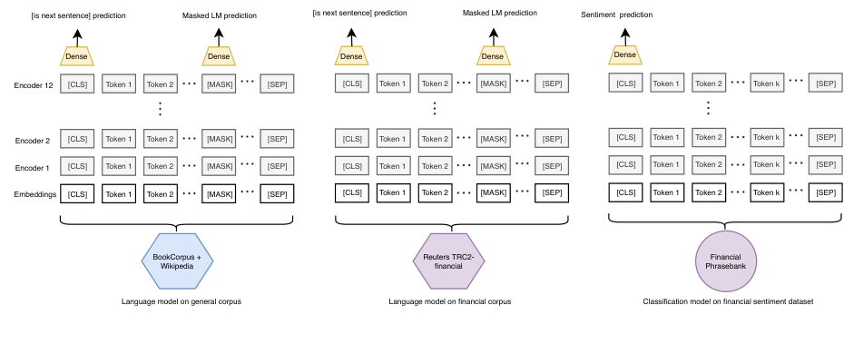
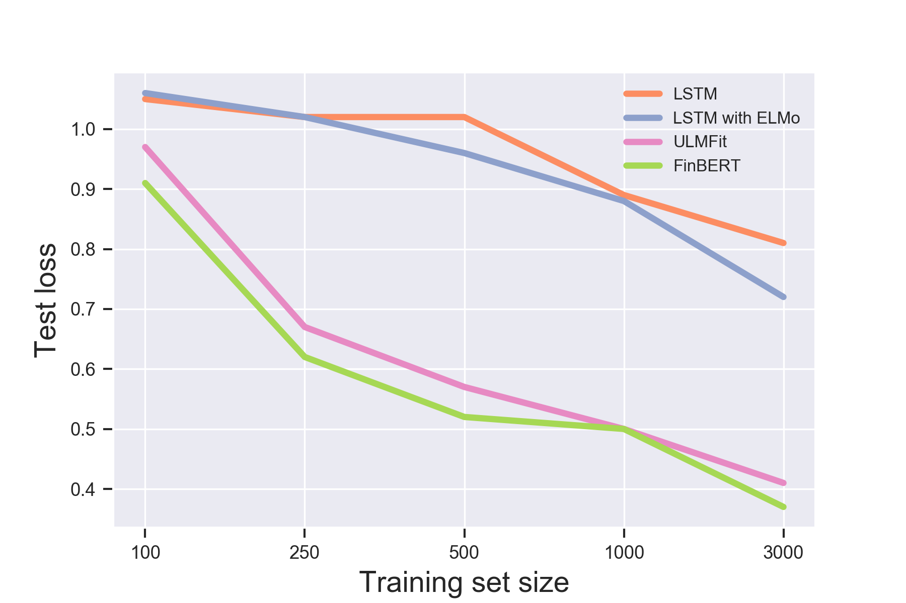
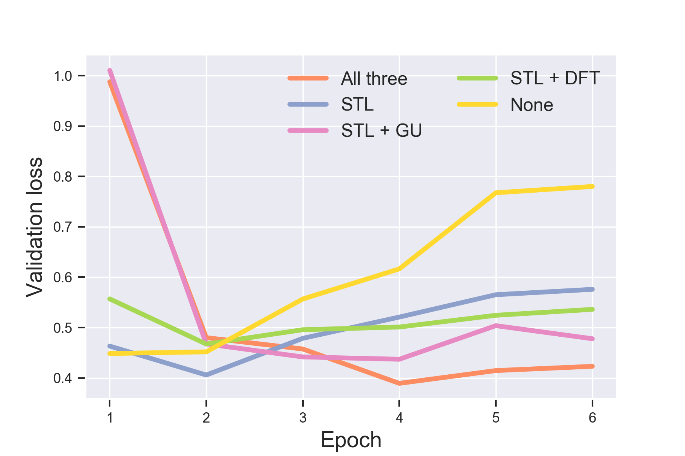
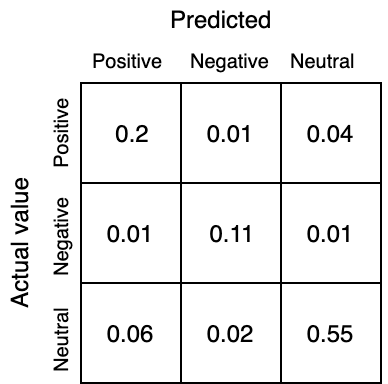

# FinBERT: анализ финансовых настроений с предобученными языковыми моделями

> **Неофициальный перевод.** Оригинал: Dogu Araci. «FinBERT: Financial Sentiment Analysis with Pre-trained Language Models». arXiv, 2019. DOI: [10.48550/arXiv.1908.10063](https://doi.org/10.48550/arXiv.1908.10063). Лицензия: arXiv perpetual non-exclusive.

## Аннотация

Анализ финансовых настроений представляет собой сложную задачу из-за специфической терминологии и недостатка размеченных данных в данной области. Универсальные модели оказываются недостаточно эффективными из-за особенностей языка, используемого в финансовом контексте. Мы предполагаем, что предобученные языковые модели способны помочь в решении этой проблемы, поскольку им требуется меньше размеченных примеров, а также их можно дополнительно подвергнуть **дообучению (fine-tuning)** на специализированных корпусах данных. Мы представляем модель FinBERT, созданную на основе BERT, для решения задач обработки естественного языка в финансовой сфере. Полученные нами результаты свидетельствуют об улучшении всех измеряемых показателей по сравнению с текущими передовыми методами на двух наборах данных для анализа финансовых настроений. Мы установили, что даже при использовании меньшего объема обучающих данных и при **дообучении (fine-tuning)** лишь части модели, FinBERT не уступает существующим передовым методам машинного обучения.

## Введение

Цены на открытом рынке отражают всю имеющуюся информацию об активах, обращающихся в экономике ([Malkiel, 2003]). При появлении новой информации все участники экономики корректируют свои позиции, а цены соответствующим образом изменяются; в результате стабильно превосходить рынок становится невозможно. Однако само понятие «новая информация» может меняться по мере появления новых технологий по её извлечению; раннее внедрение таких технологий в краткосрочной перспективе может дать определённое преимущество.

Анализ финансовых текстов — будь то новости, отчеты аналитиков или официальные заявления компаний — может служить источником новой информации. Ввиду того, что ежедневно создается беспрецедентное количество подобных текстов, их ручный анализ и извлечение из них полезных сведений представляет собой задачу, непосильную для любого отдельного субъекта. Поэтому за последнее десятилетие получила распространение автоматизированная оценка настроений или полярности текстов, создаваемых участниками финансового рынка, с применением методов обработки естественного языка (NLP) ([Guo et al., 2016]).

Основным предметом исследования в данной диссертации является анализ полярности текстов, то есть их классификация на положительные, отрицательные и нейтральные в рамках конкретной предметной области. Для решения этой задачи необходимо преодолеть два основных трудностных аспекта: 1) наиболее сложные методы классификации, использующие нейронные сети, требуют огромных объемов размеченных данных; при этом разметка фрагментов финансовых текстов требует дорогостоящих специализированных знаний. 2) Модели анализа настроений, обученные на общих корпусах текстов, не подходят для данной задачи, поскольку финансовые тексты характеризуются специфическим языком с уникальной лексикой, а также склонностью к использованию неоднозначных выражений вместо легко идентифицируемых положительных или отрицательных слов.

Использование тщательно составленных лексиконов для анализа финансовых настроений, таких как Loughran and McDonald (2011) ([Loughran and Mcdonald, 2011]), может показаться решением проблемы, поскольку они учитывают существующие знания в финансовой сфере при анализе текстов. Однако эти лексиконы основаны на методах «подсчёта слов», которые не позволяют адекватно выявить более глубокий семантический смысл текста.

Методы трансферного обучения в области обработки естественного языка представляются перспективным решением обеих вышеописанных проблем и являются предметом данной диссертации. Основная идея заключается в том, что при обучении языковых моделей на очень больших корпусах текстов, а затем при инициализации последующих моделей с помощью весов, полученных в ходе этой задачи, можно добиться значительно лучших результатов. Инициализироваться могут как отдельные слои, например слой векторных представлений слов ([Peters et al., 2018]), так и вся модель в целом ([Howard and Ruder, 2018]). В теории такой подход должен помочь преодолеть проблему нехватки размеченных данных: для обучения языковых моделей не требуются никакие метки, поскольку задача заключается в предсказании следующего слова; модели способны самостоятельно изучать способы представления семантической информации. В результате после этого этапа дообучение на размеченных данных сводится лишь к тому, чтобы научиться использовать эту семантическую информацию для предсказания меток.

Одним из ключевых аспектов методов трансферного обучения является возможность дополнительной предварительной подготовки языковых моделей на немумеративных корпусах данных, специфичных для конкретной области. Благодаря этому модель способна изучить семантические связи в текстах целевой области, распределение которых, вероятно, отличается от распределения в общем корпусе. Данный подход особенно перспективен для узкоспециализированных областей, таких как финансы, поскольку используемый там язык и лексика кардинально отличаются от общеупотребительных.

Цель данной диссертации — проверить предполагаемые преимущества использования предобученных языковых моделей и их дообучение для финансовой сферы. Для этого будет предпринята попытка предсказать тональность предложения из финансовой новостной статьи по отношению к упомянутому в нем финансовому субъекту, применяя набор данных Financial PhraseBank, созданный Malo и соавторами (2014) ([Malo et al., 2014]), а также набор данных для задачи FiQA Task 1 по оценке тональности ([Maia et al., 2018b]).

Основные достижения данной диссертации заключаются в следующем:

Далее в данной работе изложена следующая структура: сначала рассматривается соответствующая литература по анализу финансовой полярности и предобученным языковым моделям (раздел Сопутствующая литература). Затем описываются исследуемые модели (раздел Метод). После этого описывается используемая экспериментальная установка (раздел Экспериментальная установка). В разделе Экспериментальные результаты (RQ1 и RQ2) приводятся результаты экспериментов на наборах данных, связанных с финансовой сентиментальностью. В разделе Экспериментальный анализ проводится дополнительный анализ FinBERT с различных точек зрения. И наконец, раздел Заключение и перспективы дальнейших исследований служит заключением работы.

## Сопутствующая литература

В данном разделе описываются предыдущие исследования в области анализа тональности в финансовой сфере (Анализ тональности в финансовой сфере) и классификации текстов с использованием предобученных языковых моделей (Классификация текстов с использованием предобученных языковых моделей).

### Анализ тональности в финансовой сфере

Анализ тональности представляет собой задачу извлечения чувств или мнений людей из письменной речи ([Liu, 2012]). Современные подходы можно разделить на две группы: 1) методы машинного обучения, при которых из текста извлекаются признаки посредством подсчёта слов ([Agarwal and Mittal, 2016]; [Whitelaw et al., 2005]; [Martineau and Finin, 2009]; [Tripathy et al., 2016]); 2) методы глубокого обучения, в рамках которых текст представляется в виде последовательности эмбеддингов ([Severyn and Moschitti, 2015]; [Araque et al., 2017]; [Zhang et al., 2018]). Первые испытывают трудности в отражении семантической информации, обусловленной конкретной последовательностью слов; вторые же зачастую считаются чрезмерно «требовательными к данным», поскольку задействуют гораздо большее количество параметров ([Marcus, 2018]).

Анализ финансовой тональности отличается от общего анализа тональности не только по предметной области, но и по цели. Целью анализа финансовой тональности обычно является попытка предугадать реакцию рынков на информацию, содержащуюся в тексте ([Li et al., 2014]). Loughran и McDonald (2016) представляют подробный обзор последних исследований в области анализа финансовых текстов, в которых применяются методы машинного обучения на основе подхода «мешок слов» или лексиконные методы ([Loughran and Mcdonald, 2016]). Например, в работе Loughran и McDonald (2011) был создан словарь финансовых терминов, каждому из которых присвоены значения вроде «положительный» или «неопределенный»; тональность документа затем определяется путем подсчета слов, соответствующих этим значениям ([Loughran and Mcdonald, 2011]). Другим примером служит исследование Pagolu и соавторов (2016), в котором n-граммы из твитов, содержащих финансовую информацию, подаются в алгоритмы машинного обучения для определения тональности по отношению к упоминаемому финансовому объекту.

Одной из первых работ, в которой для анализа финансовой полярности текстов применялись методы глубокого обучения, стала работа Kraus и Feuerriegel (2017) ([Kraus and Feuerriegel, 2017]). Авторы используют нейронную сеть типа LSTM для обработки специально подготовленных корпоративных сообщений с целью прогнозирования динамики фондового рынка; при этом данный метод оказывается более точным по сравнению с традиционными подходами машинного обучения. Ими также было установлено, что предобучение (pre-training) модели на более крупном корпусе данных способствует улучшению результатов. Однако их предобучение проводилось на размеченном наборе данных, что представляет собой более ограниченный подход по сравнению с нашим: мы осуществляем предобучение языковой модели в рамках задачи без учителя.

Существует ряд других исследований, в которых применяются различные типы нейронных архитектур для анализа финансовых текстов на предмет эмоциональной окраски. Sohangir и соавторы (2018) ([Sohangir et al., 2018]) используют несколько типовых нейронных сетей для обработки данных из набора StockTwits; в результате установлено, что CNN является наиболее эффективной архитектурой. Lutz и соавторы (2018) ([Lutz et al., 2018]) применяют метод *doc2vec* для формирования векторных представлений предложений в специальных объявлениях компаний, после чего используют многоэкземплярное обучение для прогнозирования динамики рынка акций. Maia и соавторы (2018) ([Maia et al., 2018a]) сочетают методы упрощения текста с применением LSTM-сетей для классификации предложений из финансовых новостей по их эмоциональной окраске; их подход позволяет достичь наилучших результатов на наборе данных Financial PhraseBank, который также используется в данной работе.

Из-за отсутствия крупных размеченных финансовых наборов данных затруднительно полностью реализовать потенциал нейронных сетей в задачах анализа тональности. Даже если первые слои модели (слои векторного представления слов) инициализируются предобученными значениями, остальная часть модели всё равно вынуждена выявлять сложные взаимосвязи при использовании относительно небольшого количества размеченных данных. Более перспективным решением может быть инициализация почти всей модели предобученными значениями с последующим **дообучение** этих параметров с учётом конкретной задачи классификации.

### Классификация текстов с использованием предобученных языковых моделей

Моделирование языка представляет собой задачу предсказания следующего слова в заданном фрагменте текста. Одним из важнейших недавних достижений в области обработки естественного языка стало понимание того, что модель, обученная на задаче моделирования языка, может быть успешно дообучена для большинства последующих задач обработки естественного языка при внесении лишь незначительных изменений. Обычно такие модели обучаются на очень больших корпусах текстов; после этого к ним добавляются специализированные слои, предназначенные для конкретной задачи, и производится их дообучение на целевом наборе данных ([Kant et al., 2018]). Классификация текстов, являющаяся предметом данной диссертации, представляет собой один из очевидных примеров применения данного подхода.

ELMo (эмбеддинги, полученные с помощью языковых моделей) ([Peters et al., 2018]) стали одним из первых успешных примеров применения данного подхода. В рамках ELMo глубокая двунаправленная языковая модель предварительно обучается на большом корпусе текстов. Для каждого слова скрытые состояния этой модели используются для вычисления контекстуализированного представления. Используя предварительно обученные веса ELMo, можно рассчитать контекстуализированные эмбеддинги для любого фрагмента текста. Инициализация параметров моделей для последующих задач с помощью таких эмбеддингов, как показали исследования, повышает результативность в большинстве задач по сравнению со статическими эмбеддингами вроде word2vec или GloVe. В задачах классификации текстов, таких как SST-5, данный подход продемонстрировал высочайшую эффективность при совместном использовании с двунаправленной внимательной классификационной сетью ([McCann et al., 2017]).

Хотя ELMo и использует предобученные языковые модели для контекстуализации представлений, информация, извлекаемая с помощью таких моделей, присутствует лишь на первом слое любой модели, применяющей их. ULMFit (Universal Language Model Fine-tuning) ([Howard and Ruder, 2018]) стал первой работой, реализовавшей по-настоящему эффективное трансферное обучение в области обработки естественного языка; для этого авторы применили такие новаторские методы, как дискриминативное дообучение, косоугольные треугольные графики изменения скорости обучения и постепенное разморозивание параметров модели. Благодаря этим методам удалось эффективно дообучить всю предобученную языковую модель под задачи классификации текстов. Кроме того, в данной работе было предложено дополнительное предобучение языковой модели на корпусе текстов, специфичном для конкретной предметной области, при этом предполагалось, что данные целевой задачи распределены иначе, чем данные общего корпуса, на котором изначально обучалась модель.

Основная идея ULMFit — эффективное дообучение предварительно обученной языковой модели для решения последующих задач — была доведена до нового уровня с помощью модели Bidirectional Encoder Representations from Transformers (BERT) ([Devlin et al., 2018]), которая также является главной темой данной статьи. Модель BERT отличается от предшествующих моделей двумя важными особенностями: 1) задача моделирования языка в ней сводится к предсказанию случайно замаскированных токенов в последовательности, а не следующего токена; кроме того, предусмотрена задача классификации пар предложений на соответствие друг другу или нет. 2) это очень большая нейронная сеть, обученная на беспрецедентно большом корпусе данных. Благодаря этим двум факторам модель позволила достичь передовых результатов в множестве задач обработки естественного языка, таких как распознавание логических связей в тексте и ответы на вопросы.

Особенности процесса дообучения BERT для задач классификации текстов практически не изучены. Одной из недавних работ в этой области является работа Sun и соавторов (2019) ([Sun et al., 2019]). Авторы провели серию экспериментов с различными конфигурациями BERT в контексте классификации текстов. Некоторые из их результатов будут использоваться в дальнейшем в данной диссертации при описании конфигурации нашей модели.

## Метод

В данном разделе мы опишем нашу реализацию BERT для финансовой сферы под названием FinBERT, предварительно кратко рассказав об основных нейронных архитектурах, применимых в данной области.

### Предварительные сведения

#### LSTM

Длинно-краткосрочная память (LSTM) представляет собой разновидность рекуррентной нейронной сети, позволяющую сохранять долгосрочные зависимости в последовательностях за счёт использования «механизмов забывания» и «обновления». Это одна из основных архитектур для моделирования любых процессов генерации последовательных данных — от динамики цен на акции до естественного языка. Поскольку текст представляет собой последовательность токенов, первым шагом при создании любой модели обработки естественного языка на основе LSTM является определение способа первоначального представления отдельного токена. Обычной практикой является использование весов, полученных в ходе **предобучения**, для такого представления. Одним из подобных алгоритмов предобучения является GLoVe (Global Vectors for Word Representation) ([Pennington et al., 2014]). GLoVe — это модель для вычисления векторных представлений слов; она решает задачу обучения лог-билинейной регрессионной модели на матрице совместной встречаемости слов из большого корпуса текстов без использования разметки. Данная модель эффективно формирует векторные представления слов, однако не учитывает контекст их использования в конкретной последовательности11. Веса, полученные в ходе предобучения для GLoVe, доступны по ссылке: https://nlp.stanford.edu/projects/glove/.

#### ELMo

Векторные представления ELMo ([Peters et al., 2018]) представляют собой контекстуализированные формы слов, при которых окружающие слова влияют на их представление. В основе модели ELMo лежит двунаправленная языковая модель, состоящая из нескольких слоев LSTM. Целью такой языковой модели является изучение распределения вероятностей для последовательностей токенов в рамках заданного словаря. Модель ELMo определяет вероятность появления того или иного токена с учетом предшествующих (а также последующих) токенов в последовательности. Кроме того, модель учится определять веса различных векторных представлений, полученных на разных слоях LSTM, чтобы вычислить единый контекстуализированный вектор для каждого токена. После извлечения таких контекстуализированных представлений их можно использовать для инициализации любых последующих задач в области обработки естественного языка22 Предобученные модели ELMo доступны здесь: https://allennlp.org/elmo.

#### ULMFit

ULMFit представляет собой модель трансферного обучения для решения различных задач обработки естественного языка; при этом используется предобучение языковой модели ([Howard and Ruder, 2018]). В отличие от ELMo, в рамках подхода ULMFit производится дообучение всей языковой модели вместе с слоями, специфичными для конкретной задачи. В качестве базовой языковой модели в ULMFit выступает AWD-LSTM; для более эффективной регуляризации этой модели применяются сложные стратегии настройки параметров типа dropout ([Merity et al., 2017]). Для выполнения классификации в рамках подхода ULMFit к предобученной модели AWD-LSTM добавляются два линейных слоя; первый из них принимает на вход усредненные значения последних скрытых состояний модели.

ULMFit предлагает новые стратегии предобучения языковой модели на корпусе данных конкретной предметной области, а также дообучения модели под конкретную задачу. Мы реализовали эти стратегии с использованием FinBERT, как описано в разделе BERT для финансовой сферы: FinBERT.

#### Transformer

Transformer представляет собой архитектуру, основанную на механизме самовнимания (self-attention), для моделирования последовательной информации; она является альтернативой рекуррентным нейронным сетям ([Vaswani et al., 2017]). Данная архитектура была предложена как модель типа «последовательность–последовательность», включающая в себя механизмы энкодера и декодера. В данной работе мы рассмотрим лишь часть энкодера (хотя декодер по своей структуре весьма схож). Энкодер состоит из нескольких одинаковых слоев Transformer. Каждый слой включает в себя многоголовочный слой самовнимания (self-attention) и полностью связанную сеть прямого распространения. Для одного слоя самовнимания обучаются три отображения, связанные с эмбеддингами: ключом, запросом и значением. С помощью векторов ключа конкретного токена и векторов запросов всех токенов вычисляется коэффициент схожести посредством скалярного произведения; эти коэффициенты используются для взвешивания векторов значений, в результате чего формируется новое представление токена. В случае применения многоголовочного самовнимания полученные представления объединяются, что позволяет анализировать последовательность с различных «точек зрения». Затем полученные векторы проходят через сети прямого распространения с общими параметрами.

Как утверждается в работе Васвани 2017 ([Vaswani et al., 2017]), архитектура Transformer обладает рядом преимуществ по сравнению с подходами, основанными на RNN. Ввиду последовательной природы RNN их сложно параллелизовать на GPU; кроме того, большое количество шагов между удаленными элементами последовательности затрудняет сохранение информации.

#### BERT

BERT ([Devlin et al., 2018]) по сути представляет собой языковую модель, состоящую из набора Transformer-кодировщиков, расположенных друг над другом. Однако она формулирует задачу моделирования языка иначе, чем ELMo и AWD-LSTM. Вместо предсказания следующего слова на основе предыдущих BERT не «маскирует» случайно выбранные 15% всех токенов. С помощью слоя softmax поверх последнего кодировщика предсказываются эти замаскированные токены. Вторая задача, на которой обучается BERT, — предсказание следующего предложения (next sentence prediction). По двум предложениям модель определяет, следуют ли они реально друг за другом.

Входная последовательность представляется с помощью токеновых и позиционных эмбеддингов. В начало и конец последовательности добавляются два токена: [CLS] и [SEP]. Для всех задач классификации, включая предсказание следующего предложения, используется токен [CLS].

BERT имеет две версии: BERT-base, включающая 12 слоев кодировщика, размер скрытого слоя 768, 12 многоголовочных блоков внимания и в общей сложности 110 миллионов параметров; а также BERT-large, содержащая 24 слоя кодировщика, размер скрытого слоя 1024, 16 многоголовочных блоков внимания и 340 миллионов параметров. Обе модели были обучены на корпусе BookCorpus ([Zhu et al., 2015]) и английской Википедии; в совокупности эти источники содержат более 3,500 33 миллионов слов. Предобученные веса моделей были опубликованы создателями BERT. Код и веса доступны по ссылке: https://github.com/google-research/bert.

### BERT для финансовой сферы: FinBERT

В этом подразделе мы опишем нашу реализацию BERT: 1) как проводится дополнительное предобучение на корпусе данных конкретной области; 2-3) как мы реализовали BERT для задач классификации и регрессии; 4) какие стратегии обучения применялись во время дообучения с целью предотвращения катастрофического забывания.

#### Дальнейшее предобучение

Ховард и Рудер (2018) ([Howard and Ruder, 2018]) утверждают, что дополнительное **предобучение** языковой модели на корпусе целевой области повышает качество последующей классификации. В случае BERT подобных исследований, однозначно подтверждающих этот эффект, не существует. Тем не менее мы проводим дополнительное предобучение, чтобы выяснить, принесёт ли такая адаптация пользу в финансовой сфере.

Для проведения дополнительного предобучения мы испытали два подхода. Первый заключается в предобучении модели на относительно большом корпусе текстов из целевой области. Для этого мы дополнительно проводим предобучение языковой модели BERT на финансовом корпусе (подробности о корпусе приведены в разделе TRC2-финансовый). Второй подход предполагает предобучение модели исключительно на предложениях из обучающего набора данных для классификации. Хотя второй корпус значительно меньше по объему, использование данных непосредственно из целевой области может способствовать более эффективной адаптации модели к этой области.

#### FinBERT для задач классификации текстов

Классификация тональности осуществляется путем добавления плотного слоя после последнего скрытого состояния токена [CLS]. Это рекомендуемый подход для использования BERT в любых задачах классификации ([Devlin et al., 2018]). Затем сеть-классификатор обучается на размеченном наборе данных по тональности. Обзор всех этапов данной процедуры представлен на рисунке 1.

Обзор процесса предобучения, дополнительного предобучения и последующей дообучения классификатора. Родстер Franklin Model D 1907 года выпуска.

#### FinBERT для задач регрессии

Хотя основное внимание в данной работе уделено классификации, мы также реализовали задачу регрессии с практически идентичной архитектурой на другом наборе данных, содержащем непрерывные целевые значения. Единственное отличие заключается в том, что в качестве функции потерь используется среднеквадратичная ошибка вместо функции потерь на основе перекрестной энтропии.

#### Стратегии обучения, предотвращающие катастрофическое забывание

Как отмечают Howard и Ruder (2018) ([Howard and Ruder, 2018]), катастрофическое забывание представляет собой серьезную проблему при использовании данного подхода к дообучению. Дело в том, что процедура дообучения может быстро привести к тому, что модель «забудет» информацию, полученную в ходе задачи моделирования языка, пытаясь адаптироваться к новой задаче. Для борьбы с этим явлением мы применяем три метода, предложенные Howard и Ruder (2018): косоугольные треугольные распределения скоростей обучения, дискриминативное дообучение и постепенное разморозивание параметров модели.

При использовании косоугольного треугольного расписания скоростей обучения применяется график изменения скорости обучения в форме косоугольного треугольника: сначала скорость обучения линейно возрастает до определенной точки, а затем линейно уменьшается.

Дискриминативное дообучение подразумевает использование более низких скоростей обучения для нижних слоев сети. Предположим, что скорость обучения на слое $l$ равна $\alpha$. Тогда при коэффициенте дискриминации $\theta$ скорость обучения для слоя $l-1$ рассчитывается как $\alpha_{l-1}=\theta\alpha_{l}$. Основная идея данного метода заключается в том, что нижние слои отвечают за представление глубинной языковой информации, тогда как верхние слои содержат данные, необходимые для выполнения непосредственной задачи классификации. Именно поэтому для этих слоев применяется различное дообучение.

При постепенном разморозе слоев мы начинаем предобучение, при этом все слои, кроме слоя классификатора, остаются замороженными. В процессе обучения мы поочередно размораживаем все слои, начиная с самого верхнего; в результате признаки низкого уровня подвергаются наименьшей дообучению. Таким образом, на начальных этапах обучения предотвращается ситуация, когда модель «забывает» информацию о языке низкого уровня, усвоенную в ходе предобучения.

## Экспериментальная установка

### Вопросы исследования

Мы стремимся ответить на следующие исследовательские вопросы:

### Наборы данных

#### TRC2-финансовый

Для дополнительной предобучения модели BERT мы используем финансовый корпус, который называем TRC2-financial. Он представляет собой подмножество корпуса TRC244 от Reuters. Данный корпус можно получить для исследовательских целей по ссылке https://trec.nist.gov/data/reuters/reuters.html, он включает в себя 1.8 миллиона новостных статей, опубликованных Reuters в период с 2008 по 2010 год. Для повышения релевантности корпуса и в соответствии с имеющимися вычислительными ресурсами мы отобрали статьи, содержащие определенные финансовые ключевые слова. В итоге корпус TRC2-financial стал включать 46 143 документа, содержащих более 29 миллионов слов и почти 400 тысяч предложений.

#### Финансовый PhraseBank

Основным набором данных для анализа тональности, использованным в данной работе, является Financial PhraseBank55 (Финансовый банк фраз; набор данных для анализа тональности в финансовой сфере). Этот набор данных можно найти по ссылке: https://www.researchgate.net/publication/251231364 он был составлен Мало и соавторами в 2014 году ([Malo et al., 2014]). Financial PhraseBank включает в себя 4845 английских предложений, случайным образом выбранных из финансовых новостей из базы данных LexisNexis. Затем эти предложения были аннотированы 16 экспертами, имеющими опыт работы в финансовой и деловой сферах. Аннотаторам предлагалось присваивать метки, отражающие, как, по их мнению, содержание предложения может повлиять на цену акций упомянутой компании. В наборе данных также содержится информация об уровне согласованности мнений аннотаторов относительно каждого предложения. Распределение уровней согласованности и тональных меток представлено в таблице 1. Мы выделили 20% всех предложений в качестве тестовой выборки, а 20% оставшихся — в качестве выборки для валидации; в итоге обучающая выборка насчитывает 3101 пример. В некоторых экспериментах мы также применяли 10-кратную перекрестную проверку.

Распределение меток настроения и уровней согласованности в наборе данных Financial PhraseBank

#### Факторы настроений в FiQA

FiQA ([Maia et al., 2018b]) — набор данных, созданный для конкурса66 по финансовому opinion mining и question answering на конференции WWW ’18. Данные здесь: https://sites.google.com/view/fiqa/home. Мы используем данные для Task 1, который включает 1174 заголовка финансовых новостей и твитов с соответствующей оценкой настроения. В отличие от Financial PhraseBank, целевые значения непрерывны в диапазоне $[-1,1]$, причём $1$ соответствует наиболее позитивному настроению. У каждого примера также указано, какая финансовая сущность является целью в предложении. Для оценки модели на этом наборе мы применяем 10-fold cross validation.

### Базовые методы

Для проведения контрастивных экспериментов мы рассматриваем базовые модели, использующие три различных подхода: классификатор LSTM с эмбеддингами типа GLoVe, классификатор LSTM с эмбеддингами ELMo и классификатор ULMFit. Следует отметить, что эти базовые методы не изучались столь тщательно, как метод BERT. Поэтому полученные результаты не следует трактовать как окончательное доказательство превосходства какого-либо из методов.

#### Классификаторы на основе LSTM

Мы реализовали два классификатора на основе двунаправленных моделей LSTM. В обоих случаях размер скрытого слоя составляет 128; из-за двунаправленности размер последнего скрытого состояния равен 256. Полносвязный слой преобразует это последнее скрытое состояние в вектор из трех элементов, отражающих вероятность принадлежности объекта к одному из трех классов. Различие между моделями заключается в том, что в одной используются эмбеддинги GLoVe, а в другой — эмбеддинги ELMo. В обеих моделях вероятность применения механизма dropout равна 0.3, а скорость обучения составляет 3e-5. Обучение продолжается до тех пор, пока значение функции потерь на выборке для проверки не перестает улучшаться в течение 10 эпох.

#### ULMFit

Как было пояснено в разделе ULMFit, процесс классификации с использованием метода ULMFit включает три этапа. Первый этап, а именно предобучение языковой модели, уже завершен; предобученные веса модели были опубликованы Говардом и Рудером (2018). Сначала мы дополнительно проводим предобучение языковой модели AWD-LSTM на корпусе TRC2-financial в течение 3 эпох. После этого мы производим дообучение модели для задач классификации на наборе данных Financial PhraseBank, добавляя полносвязный слой к выходным данным предобученной языковой модели.

### Метрики оценки

Для оценки моделей классификации мы используем три метрики: точность, функцию потерь кросс-энтропии и среднее значение макро-F1. Функцию потерь кросс-энтропии мы взвешиваем с помощью квадратного корня из обратной частоты встречаемости меток. Например, если какая-либо метка встречается в 25% всех примеров, потери, связанные с этой меткой, умножаются на коэффициент 2. Среднее значение макро-F1 рассчитывается путем вычисления значений F1 для каждого класса и последующего усреднения этих значений. Поскольку в нашем наборе данных Financial PhraseBank наблюдается дисбаланс меток (почти 60% всех предложений являются нейтральными), данная метрика служит еще одним надежным показателем эффективности классификации. Для оценки регрессионной модели мы приводим значения среднеквадратичной ошибки и $R^{2}$; эти показатели являются стандартными и также используются в передовых работах, посвященных набору данных FiQA.

### Особенности реализации

В нашей реализации BERT мы используем вероятность применения механизма дропаута на уровне $p=0.1$, долю этапа разогрева обучения равную $0.2$, максимальную длину последовательности в $64$ токенов, скорость обучения, равную $2e-5$, и размер мини-пакета, равный $64$. Модель обучается в течение 6 эпох; после этого производится оценка на валидационном наборе данных и выбирается наилучшая модель. При проведении дискриминативного дообучения мы устанавливаем коэффициент дискриминации на уровне 0.85. Обучение начинается с того, что разморожается лишь слой классификации; после каждой трети эпохи размораживается следующий слой. Для обучения моделей используется инстанс Amazon EC2 типа p2.xlarge, оснащенный одной видеокартой NVIDIA K80, 4 виртуальными процессорами и 64 ГиБ оперативной памяти.

## Экспериментальные результаты (RQ1 и RQ2)

Результаты работы FinBERT, а также базовых методов и передовых подходов при решении задачи классификации на наборе данных Financial PhraseBank приведены в таблице 2. Мы представляем результаты как для всего набора данных, так и для его подмножества, в котором наблюдается 100% согласованность между аннотаторами.

Экспериментальные результаты на наборе данных Financial PhraseBank

По всем измеряемым метрикам **FinBERT** демонстрирует явно лучшие результаты как по сравнению с методами, разработанными нами самими (LSTM и ULMFit), так и по сравнению с моделями, описанными в других работах (LPS ([Malo et al., 2014]), HSC ([Krishnamoorthy, 2018]), FinSSLX ([Maia et al., 2018a])). Классификатор LSTM без использования информации из языковой модели показывает наихудшие результаты. По точности он сопоставим с LPS и HSC (даже превосходит LPS в случаях полного совпадения меток), однако его значение метрики F1 оказывается низким. Это обусловлено тем, что данный классификатор гораздо лучше справляется с классификацией нейтральных примеров. Классификатор LSTM, использующий **ELMo**-эмбеддинги, превосходит версию модели с статическими эмбеддингами по всем измеряемым метрикам. Однако у него по-прежнему наблюдается низкое среднее значение метрики F1 из-за слабых результатов при работе с менее распространенными метками. Тем не менее его показатели сопоставимы с результатами LPS и HSC, а по точности он их превосходит. Следовательно, контекстуализированные словесные эмбеддинги позволяют достигать результатов, сопоставимых с методами на основе машинного обучения при работе с наборами данных такого размера.

ULMFit значительно улучшает показатели по всем метрикам; при этом модель не демонстрирует значительного превосходства в точности лишь по некоторым классам. Она также без труда превосходит такие модели машинного обучения, как LPS и HSC. Это подтверждает эффективность **предобучения** языковых моделей. AWD-LSTM представляет собой очень большую модель; при таком небольшом объеме набора данных можно было бы ожидать проявления явления переобучения. Однако благодаря **предобучению** языковых моделей и эффективным стратегиям обучения эта проблема успешно преодолевается. ULMFit также превосходит модель FinSSLX, в которой предусмотрен этап упрощения текста, а также **предобучение** словесных эмбеддингов на большом финансовом корпусе с метками настроений.

Потери на тестовой выборке при различных размерах обучающего набора. Родстер Franklin Model D 1907 года выпуска.

FinBERT превосходит модель ULMFit, а значит и все остальные методы по всем метрикам. Для оценки эффективности моделей при различных объемах размеченных обучающих наборов мы протестировали классификаторы на основе LSTM, модель ULMFit и FinBERT в пяти различных конфигурациях. Результаты представлены на рисунке 2, где показаны значения перекрестной энтропии для тестового набора данных для каждой модели. При использовании всего 100 обучающих примеров ни одна из моделей не демонстрирует хороших результатов. Однако при увеличении объема обучающего набора до 250 примеров модели ULMFit и FinBERT начинают успешно различать метки; точность распознавания для FinBERT достигает 80%. Все методы показывают улучшение результатов при увеличении объема данных, однако модели ULMFit и FinBERT при 250 примерах демонстрируют лучшие показатели, чем классификаторы LSTM при использовании всего набора данных. Это подтверждает высокую эффективность предобучения языковых моделей.

Результаты, полученные на наборе данных FiQA для анализа тональности, приведены в таблице 3. Наша модель превосходит современные модели как по показателю MSE, так и по показателю $R^{2}$. Следует отметить, что тестовый набор, используемый в этих двух работах ([Yang et al., 2018], [Piao and Breslin, 2018]), представляет собой официальный тестовый набор для задачи №1 из проекта FiQA. Поскольку у нас нет доступа к этому набору, мы приводим результаты, полученные при 10-кратной перекрестной проверке. В работе ([Maia et al., 2018b]) не указывается, что опубликованные ими обучающий и тестовый наборы относятся к разным распределениям данных; кроме того, наша модель, по-видимому, находится в невыгодном положении, поскольку нам приходится выделять часть обучающего набора в качестве тестового, тогда как современные модели могут использовать весь обучающий набор.

Экспериментальные результаты на наборе данных FiQA для анализа тональности

## Экспериментальный анализ

### Влияние дополнительного предобучения (RQ3)

Сначала мы измеряем влияние дополнительного предобучения на эффективность классификатора. Мы сравниваем три модели: 1) без дополнительного предобучения (обозначается как Vanilla BERT), 2) с дополнительным предобучением на обучающем наборе для классификации (обозначается как FinBERT-task), 3) с дополнительным предобучением на корпусе текстов из финансовой сферы TRC2-financial (обозначается как FinBERT-domain). Оценка моделей производится по функции потерь, точности и среднему значению метрики F1 на тестовом наборе данных. Результаты представлены в таблице 4.

Эффективность при использовании различных стратегий предобучения

Классификатор, подвергнутый дополнительному **предобучению** на корпусе текстов из финансовой сферы, показывает наилучшие результаты среди всех трех моделей, хотя разница между ними невелика. Возможно, на этот результат влияют четыре фактора: 1) распределение данных в корпусе может отличаться от распределения в тестовом наборе; 2) у классификаторов типа BERT дополнительное предобучение вряд ли приводит к значительному улучшению; 3) классификация коротких предложений, вероятно, не получает большой выгоды от дополнительного предобучения; 4) исходные показатели эффективности уже настолько высоки, что дальнейшее улучшение маловероятно. По нашему мнению, наиболее вероятным является последний вариант: в подмножестве данных Financial Phrasebank, по которому все аннотаторы пришли к единому мнению, точность работы обычного классификатора BERT уже составляет 0.96. На остальных уровнях согласованности результаты, скорее всего, будут хуже, поскольку даже люди не всегда приходят к единому мнению. Для окончательного вывода о том, что дополнительное предобучение на специализированном корпусе не оказывает существенного влияния, необходимы дополнительные эксперименты с другим размеченным финансовым набором данных.

### Катастрофическое забывание (RQ4)

Для оценки эффективности рассматриваемых методов с точки зрения предотвращения катастрофического забывания мы испытали четыре различных варианта настройки: без каких-либо изменений (NA), с использованием только наклонной треугольной функции обучения (STL), с применением наклонной треугольной функции обучения и постепенным разморозом параметров (STL+GU), а также с использованием методов из предыдущего варианта в сочетании с дискриминативным дообучением. Мы приводим результаты работы этих четырех вариантов в виде значений функции потерь на тестовом наборе и графиков изменения функции потерь на этапах обучения. Результаты представлены в таблице 5 и на рисунке 3.

Динамика изменения валидационной ошибки при различных стратегиях обучения. Автомобиль Franklin Model D 1907 года выпуска.

Результаты при применении различных стратегий дообучения

Применение всех трех стратегий позволяет достичь наилучших результатов с точки зрения тестовой ошибки и точности. Постепенное разморозивание параметров и дискриминативное дообучение основаны на одной и той же логике: параметры более высоких уровней следует дообучать в большей степени, чем параметры нижних уровней, поскольку информация, извлеченная из моделирования языка, в основном содержится на нижних уровнях. Из таблицы 5 видно, что использование лишь дискриминативного дообучения совместно с косоугольными треугольными графиками изменения скорости обучения дает худшие результаты, чем применение только этих графиков. Это свидетельствует о том, что постепенное разморозивание параметров является наиболее важной техникой в нашем случае.

Одним из проявлений катастрофического забывания является резкое увеличение значения валидационной ошибки после нескольких эпох обучения. При отсутствии соответствующих мер модель быстро начинает переобучаться. Как видно на рисунке 3, это наблюдается в том случае, когда ни один из вышеупомянутых методов не применяется. В такой ситуации модель демонстрирует наилучшие результаты на валидационном наборе после первой эпохи, после чего начинает переобучаться. В то же время при одновременном применении всех трех методов модель остается гораздо более стабильной. Прочие комбинации методов занимают промежуточное положение между этими двумя крайними случаями.

### Выбор наилучшего слоя для классификации (RQ5)

Модель BERT содержит 12 Transformer слоев кодирования. Однако не всегда можно утверждать, что последний слой при обучении языковой модели извлекает наиболее релевантную информацию для решения задачи классификации. В рамках данного эксперимента мы исследуем, какой из 12 Transformer слоев кодирования обеспечивает наилучший результат при классификации. Классификационный слой размещается после токенов CLS] соответствующих представлений. Кроме того, мы пробовали использовать среднее значение по всем слоям.

Как видно из таблицы 6, последний слой вносит наибольший вклад в производительность модели по всем измеряемым метрикам. Это, вероятно, свидетельствует о двух факторах: 1) при использовании более верхних слоев обучаемая модель становится крупнее и, следовательно, возможно, мощнее; 2) нижние слои улавливают более глубокую семантическую информацию, в связи с чем им труднее адаптировать эту информацию для задачи классификации.

Эффективность различных слоев энкодера при использовании для классификации

### Обучение лишь подмножества слоев (RQ6)

BERT представляет собой очень большую модель. Даже при работе с небольшими наборами данных дообучение всей модели требует значительного времени и вычислительных ресурсов. Поэтому в некоторых случаях может оказаться предпочтительным дообучение лишь части всех параметров модели, даже если при этом качество результатов слегка снижается. Особенно если объем обучающего набора очень велик, такой подход может сделать BERT более удобной в использовании моделью. В данной работе мы проводим эксперименты, дообучая лишь последние *k* слоев кодировщика.

Результаты обучения при инициализации с различных слоев

Результаты представлены в таблице 7. Дообучение лишь классификационного слоя не позволяет достичь таких же показателей, как при дообучении других слоев. Однако дообучение только последнего слоя значительно превосходит современные методы машинного обучения, такие как HSC. После 9-го слоя показатели практически не меняются; при этом их превосходит дообучение всей модели. Этот результат свидетельствует о том, что для эффективного использования BERT не требуется дорогостоящее дообучение всей модели. Можно достичь приемлемого компромисса: сократить время обучения при незначительном снижении его эффективности.

### В каких случаях модель даёт ошибки?

При точности прогнозирования 97% % на подмножестве набора данных Financial PhraseBank, где наблюдается 100% % согласие между аннотаторами, мы считаем, что было бы интересно изучить случаи, когда модель не смогла предсказать верный класс. Поэтому в данном разделе мы приведём несколько примеров неверных предсказаний модели. Кроме того, в работе Malo и соавт. (2014) ([Malo et al., 2014]) отмечается, что большинство разногласий между аннотаторами приходится на различия между положительными и нейтральными метками (уровни согласия при разделении положительных и отрицательных, отрицательных и нейтральных, а также положительных и нейтральных меток составляют соответственно 98.7% %, 94.2% % и 75.2% %). Авторы связывают это с трудностью различения «обычно используемых фраз корпоративной рекламы и подлинно положительных утверждений». Мы также представим матрицу путаницы, чтобы выяснить, наблюдается ли подобная закономерность и для FinBERT.

**Пример 1:** `Pre-tax loss totaled euro 0.3 million , compared to a loss of euro 2.2 million in the first quarter of 2005 .
`

**Истинное значение:** Положительное **Прогнозируемое значение:** Отрицательное

**Пример 2:** `This implementation is very important to the operator , since it is about to launch its Fixed to Mobile convergence service in Brazil`

**Истинное значение:** Нейтральное **Прогнозируемое значение:** Положительное

**Пример 3:** `The situation of coated magazine printing paper will continue to be weak .`

**Истинное значение:** Отрицательное **Прогноз:** Нейтральное

Первый пример на самом деле представляет собой наиболее распространенный тип неудачи. Модель не справляется с математическим сравнением величин: определяет, какая из них больше; при отсутствии слов, указывающих на направление изменений (например, «увеличилось»), она может выдать предсказание «нейтрально». Однако существует множество аналогичных случаев, когда модель всё же даёт верное предсказание. Примеры 2 и 3 являются различными вариациями одного и того же типа неудачи: модель не в состоянии различить нейтральное утверждение о какой-либо ситуации и утверждение, указывающее на полярность отношения к компании. В третьем примере информация о деятельности компании, вероятно, помогла бы модели.

Матрица путаницы. Родстер Franklin Model D 1907 года.

Матрица путаницы приведена на рисунке 4. В 73 % случаев ошибки возникают при различении меток «положительный» и «отрицательный»; аналогичный показатель для пары «отрицательный» и «положительный» составляет 5 %. Это согласуется как с данными о согласованности между аннотаторами, так и с здравым смыслом. Различать метки «положительный» и «отрицательный» проще. Однако может возникнуть больше трудностей при определении того, указывает ли высказывание на положительную перспективу или представляет собой лишь объективное наблюдение.

## Заключение и перспективы дальнейших исследований

В данной работе мы применили модель BERT в финансовой сфере, проведя её дополнительное предобучение на финансовом корпусе, а затем дообучение для задачи анализа тональности (FinBERT). Насколько нам известно, это первое применение модели BERT в финансовой области; кроме того, это один из немногих примеров использования дополнительного предобучения на корпусе, специфичном для данной области. На обоих использованных нами наборах данных мы добились результатов, значительно превосходящих существующие стандарты. В задаче классификации точность наших результатов превысила текущий уровень на 15%.

Помимо BERT, мы также реализовали другие модели языка, прошедшие предобучение, такие как ELMo и ULMFit, для целей сравнения. Модель ULMFit, дополнительно предобученная на финансовом корпусе, превзошла предыдущий уровень достижений в задаче классификации, однако лишь в меньшей степени, чем BERT. Эти результаты подтверждают эффективность моделей, прошедших предобучение, при решении последующих задач, таких как анализ тональности, особенно при наличии небольшого количества размеченных данных. Весь набор данных включал более 3000 примеров, однако FinBERT смогла превзойти предыдущий уровень достижений даже при использовании обучающего набора, состоящего всего из 500 примеров. Это важный результат, поскольку методы глубокого обучения в обработке естественного языка традиционно считались чрезмерно требовательными к объему данных, что, по-видимому, уже не так.

Мы провели обширные эксперименты с BERT, исследуя эффекты дополнительного предобучения и нескольких стратегий обучения. Мы не смогли заключить, что дальнейшее предобучение на доменном корпусе значимо лучше, чем его отсутствие в нашем случае. Наша гипотеза: BERT уже достаточно хорошо работает на нашем наборе данных, поэтому дополнительное предобучение мало что добавляет. Мы также обнаружили, что режимы learning rate, которые агрессивнее проводят дообучение верхних слоев по сравнению с нижними, дают лучшее качество и эффективнее предотвращают catastrophic forgetting. Ещё один вывод: сопоставимое качество можно получить при гораздо меньшем времени обучения, дообучая только последние 2 слоя BERT.

Анализ финансовых настроений сам по себе не является самостоятельной целью; он полезен лишь в той мере, в какой способствует принятию обоснованных финансовых решений. Один из возможных путей развития нашей работы заключается в непосредственном применении FinBERT к данным о доходности фондового рынка (как с точки зрения направленности изменений, так и волатильности) в контексте финансовых новостей. Для извлечения явно выраженных настроений FinBERT вполне подходит; однако моделирование скрытой информации, которая может быть не очевидной даже для авторов текстов, представляет собой сложную задачу. Еще одним возможным направлением развития может стать использование FinBERT для решения других задач обработки естественного языка, таких как распознавание именованных сущностей или ответы на вопросы в финансовой сфере.

## Благодарности

Я хотел бы выразить свою благодарность Пэнцзе Рэну и Зулкуфу Генцу за их превосходное руководство. Они предоставили мне свободу в выборе направления исследований, а также ценные рекомендации в тех случаях, когда они были необходимы. Также хочу поблагодарить команду Naspers AI за доверие к моей работе над этим проектом и за постоянную поддержку в деле публикации моих результатов. Я признателен организации NIST за предоставление мне корпуса Reuters TRC-2, а также Мало и его коллегам за то, что они сделали доступным для общественности превосходный Financial PhraseBank.

## Список литературы

Agarwal and Mittal (2016) Agarwal and Mittal (2016) Basant Agarwal and Namita Mittal. 2016. Machine Learning Approach for Sentiment Analysis. Springer International Publishing, Cham, 21–45. https://doi.org/10.1007/978-3-319-25343-5_3
Araque et al. (2017) Araque et al. (2017) Oscar Araque, Ignacio Corcuera-Platas, J. Fernando Sánchez-Rada, and Carlos A. Iglesias. 2017. Enhancing deep learning sentiment analysis with ensemble techniques in social applications. Expert Systems with Applications 77 (jul 2017), 236–246. https://doi.org/10.1016/j.eswa.2017.02.002
Devlin et al. (2018) Devlin et al. (2018) Jacob Devlin, Ming-Wei Chang, Kenton Lee, and Kristina Toutanova. 2018. BERT: Pre-training of Deep Bidirectional Transformers for Language Understanding. (2018). https://doi.org/arXiv:1811.03600v2 arXiv:1810.04805
Guo et al. (2016) Guo et al. (2016) Li Guo, Feng Shi, and Jun Tu. 2016. Textual analysis and machine leaning: Crack unstructured data in finance and accounting. The Journal of Finance and Data Science 2, 3 (sep 2016), 153–170. https://doi.org/10.1016/J.JFDS.2017.02.001
Howard and Ruder (2018) Howard and Ruder (2018) Jeremy Howard and Sebastian Ruder. 2018. Universal Language Model Fine-tuning for Text Classification. (jan 2018). arXiv:1801.06146 http://arxiv.org/abs/1801.06146
Kant et al. (2018) Kant et al. (2018) Neel Kant, Raul Puri, Nikolai Yakovenko, and Bryan Catanzaro. 2018. Practical Text Classification With Large Pre-Trained Language Models. (2018). arXiv:1812.01207 http://arxiv.org/abs/1812.01207
Kraus and Feuerriegel (2017) Kraus and Feuerriegel (2017) Mathias Kraus and Stefan Feuerriegel. 2017. Decision support from financial disclosures with deep neural networks and transfer learning. Decision Support Systems 104 (2017), 38–48. https://doi.org/10.1016/j.dss.2017.10.001 arXiv:1710.03954
Krishnamoorthy (2018) Krishnamoorthy (2018) Srikumar Krishnamoorthy. 2018. Sentiment analysis of financial news articles using performance indicators. Knowledge and Information Systems 56, 2 (aug 2018), 373–394. https://doi.org/10.1007/s10115-017-1134-1
Li et al. (2014) Li et al. (2014) Xiaodong Li, Haoran Xie, Li Chen, Jianping Wang, and Xiaotie Deng. 2014. News impact on stock price return via sentiment analysis. Knowledge-Based Systems 69 (oct 2014), 14–23. https://doi.org/10.1016/j.knosys.2014.04.022
Liu (2012) Liu (2012) Bing Liu. 2012. Sentiment Analysis and Opinion Mining. Synthesis Lectures on Human Language Technologies 5, 1 (may 2012), 1–167. https://doi.org/10.2200/s00416ed1v01y201204hlt016
Loughran and Mcdonald (2011) Loughran and Mcdonald (2011) Tim Loughran and Bill Mcdonald. 2011. When Is a Liability Not a Liability? Textual Analysis, Dictionaries, and 10-Ks. Journal of Finance 66, 1 (feb 2011), 35–65. https://doi.org/10.1111/j.1540-6261.2010.01625.x
Loughran and Mcdonald (2016) Loughran and Mcdonald (2016) Tim Loughran and Bill Mcdonald. 2016. Textual Analysis in Accounting and Finance: A Survey. Journal of Accounting Research 54, 4 (2016), 1187–1230. https://doi.org/10.1111/1475-679X.12123
Lutz et al. (2018) Lutz et al. (2018) Bernhard Lutz, Nicolas Pröllochs, and Dirk Neumann. 2018. Sentence-Level Sentiment Analysis of Financial News Using Distributed Text Representations and Multi-Instance Learning. Technical Report. arXiv:1901.00400 http://arxiv.org/abs/1901.00400
Maia et al. (2018a) Maia et al. (2018a) Macedo Maia, Andr� Freitas, and Siegfried Handschuh. 2018a. FinSSLx: A Sentiment Analysis Model for the Financial Domain Using Text Simplification. In 2018 IEEE 12th International Conference on Semantic Computing (ICSC). IEEE, 318–319. https://doi.org/10.1109/ICSC.2018.00065
Maia et al. (2018b) Maia et al. (2018b) Macedo Maia, Siegfried Handschuh, André Freitas, Brian Davis, Ross Mcdermott, Manel Zarrouk, Alexandra Balahur, and Ross Mc-Dermott. 2018b. Companion of the The Web Conference 2018 on The Web Conference 2018, {WWW} 2018, Lyon , France, April 23-27, 2018. ACM. https://doi.org/10.1145/3184558
Malkiel (2003) Malkiel (2003) Burton G Malkiel. 2003. The Efficient Market Hypothesis and Its Critics. Journal of Economic Perspectives 17, 1 (feb 2003), 59–82. https://doi.org/10.1257/089533003321164958
Malo et al. (2014) Malo et al. (2014) Pekka Malo, Ankur Sinha, Pekka Korhonen, Jyrki Wallenius, and Pyry Takala. 2014. Good debt or bad debt: Detecting semantic orientations in economic texts. Journal of the Association for Information Science and Technology 65, 4 (2014), 782–796. https://doi.org/10.1002/asi.23062 arXiv:arXiv:1307.5336v2
Marcus (2018) Marcus (2018) G. Marcus. 2018. Deep Learning: A Critical Appraisal. arXiv e-prints (Jan. 2018). arXiv:cs.AI/1801.00631
Martineau and Finin (2009) Martineau and Finin (2009) Justin Martineau and Tim Finin. 2009. Delta TFIDF: An Improved Feature Space for Sentiment Analysis.. In ICWSM, Eytan Adar, Matthew Hurst, Tim Finin, Natalie S. Glance, Nicolas Nicolov, and Belle L. Tseng (Eds.). The AAAI Press. http://dblp.uni-trier.de/db/conf/icwsm/icwsm2009.html#MartineauF09
McCann et al. (2017) McCann et al. (2017) Bryan McCann, James Bradbury, Caiming Xiong, and Richard Socher. 2017. Learned in Translation: Contextualized Word Vectors. Nips (2017), 1–12. arXiv:1708.00107 http://arxiv.org/abs/1708.00107
Merity et al. (2017) Merity et al. (2017) Stephen Merity, Nitish Shirish Keskar, and Richard Socher. 2017. Regularizing and Optimizing LSTM Language Models. CoRR abs/1708.02182 (2017). arXiv:1708.02182 http://arxiv.org/abs/1708.02182
Pennington et al. (2014) Pennington et al. (2014) Jeffrey Pennington, Richard Socher, and Christopher Manning. 2014. Glove: Global Vectors for Word Representation. In Proceedings of the 2014 Conference on Empirical Methods in Natural Language Processing (EMNLP). Association for Computational Linguistics, Doha, Qatar, 1532–1543. https://doi.org/10.3115/v1/D14-1162
Peters et al. (2018) Peters et al. (2018) Matthew E Peters, Mark Neumann, Mohit Iyyer, Matt Gardner, Christopher Clark, Kenton Lee, and Luke Zettlemoyer. 2018. Deep contextualized word representations. (2018). https://doi.org/10.18653/v1/N18-1202 arXiv:1802.05365
Piao and Breslin (2018) Piao and Breslin (2018) Guangyuan Piao and John G Breslin. 2018. Financial Aspect and Sentiment Predictions with Deep Neural Networks. 1973–1977. https://doi.org/10.1145/3184558.3191829
Severyn and Moschitti (2015) Severyn and Moschitti (2015) Aliaksei Severyn and Alessandro Moschitti. 2015. Twitter Sentiment Analysis with Deep Convolutional Neural Networks. In Proceedings of the 38th International ACM SIGIR Conference on Research and Development in Information Retrieval - SIGIR '15. ACM Press. https://doi.org/10.1145/2766462.2767830
Sohangir et al. (2018) Sohangir et al. (2018) Sahar Sohangir, Dingding Wang, Anna Pomeranets, and Taghi M Khoshgoftaar. 2018. Big Data: Deep Learning for financial sentiment analysis. Journal of Big Data 5, 1 (2018). https://doi.org/10.1186/s40537-017-0111-6
Sun et al. (2019) Sun et al. (2019) Chi Sun, Xipeng Qiu, Yige Xu, and Xuanjing Huang. 2019. How to Fine-Tune BERT for Text Classification? (2019). arXiv:1905.05583 https://arxiv.org/pdf/1905.05583v1.pdfhttp://arxiv.org/abs/1905.05583
Tripathy et al. (2016) Tripathy et al. (2016) Abinash Tripathy, Ankit Agrawal, and Santanu Kumar Rath. 2016. Classification of sentiment reviews using n-gram machine learning approach. Expert Systems with Applications 57 (sep 2016), 117–126. https://doi.org/10.1016/j.eswa.2016.03.028
Vaswani et al. (2017) Vaswani et al. (2017) Ashish Vaswani, Noam Shazeer, Niki Parmar, Jakob Uszkoreit, Llion Jones, Aidan N. Gomez, Lukasz Kaiser, and Illia Polosukhin. 2017. Attention Is All You Need. Nips (2017). arXiv:1706.03762 http://arxiv.org/abs/1706.03762
Whitelaw et al. (2005) Whitelaw et al. (2005) Casey Whitelaw, Navendu Garg, and Shlomo Argamon. 2005. Using appraisal groups for sentiment analysis. In Proceedings of the 14th ACM international conference on Information and knowledge management - CIKM '05. ACM Press. https://doi.org/10.1145/1099554.1099714
Yang et al. (2018) Yang et al. (2018) Steve Yang, Jason Rosenfeld, and Jacques Makutonin. 2018. Financial Aspect-Based Sentiment Analysis using Deep Representations. (2018). arXiv:1808.07931 https://arxiv.org/pdf/1808.07931v1.pdfhttp://arxiv.org/abs/1808.07931
Zhang et al. (2018) Zhang et al. (2018) Lei Zhang, Shuai Wang, and Bing Liu. 2018. Deep learning for sentiment analysis: A survey. Wiley Interdisciplinary Reviews: Data Mining and Knowledge Discovery 8, 4 (mar 2018), e1253. https://doi.org/10.1002/widm.1253
Zhu et al. (2015) Zhu et al. (2015) Yukun Zhu, Ryan Kiros, Richard Zemel, Ruslan Salakhutdinov, Raquel Urtasun, Antonio Torralba, and Sanja Fidler. 2015. Aligning Books and Movies: Towards Story-like Visual Explanations by Watching Movies and Reading Books. (jun 2015). arXiv:1506.06724 http://arxiv.org/abs/1506.06724
