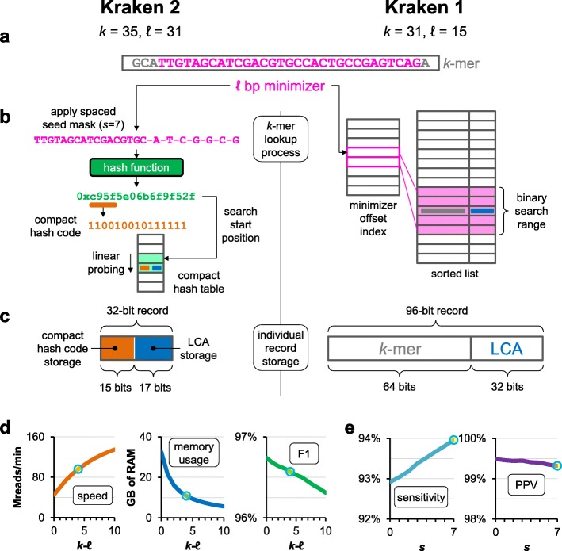
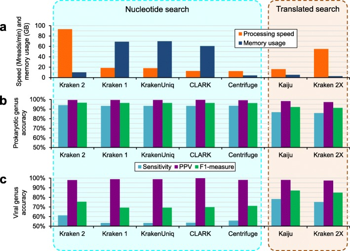

# Усовершенствованный метагеномный анализ с использованием Kraken 2

> **Неофициальный перевод.** Оригинал: Derrick E. Wood, Jennifer Lu, Ben Langmead. «Improved metagenomic analysis with Kraken 2». Genome Biology, 2019. DOI: [10.1186/s13059-019-1891-0](https://doi.org/10.1186/s13059-019-1891-0). Лицензия: CC BY 4.0.

## Аннотация

Хотя подход Kraken, основанный на использовании *k*-меров, обеспечивает быструю таксономическую классификацию метагеномных последовательностей, его высокие требования к объему памяти могут ограничивать его применение в некоторых случаях. Kraken 2 усовершенствует метод Kraken 1, снижая потребление памяти на 85%; это позволяет использовать больший объем референсных геномных данных, сохраняя при этом высокую точность и увеличивая скорость обработки в пять раз. Кроме того, Kraken 2 вводит режим трансляционного поиска, повышающий чувствительность анализа вирусных метагеномных данных.

Присвоение таксономических меток ридам, полученным в ходе секвенирования, является важным этапом во многих вычислительных геномических конвейерах, используемых в метагеномных исследованиях. В последние годы было предложено несколько подходов, позволяющих решить эту задачу с высокой эффективностью [1–3]. Одним из таких инструментов является Kraken [4]; он использует алгоритм, требующий больших объемов памяти, для сопоставления коротких геномных подпоследовательностей (*k*-меров) с таксонами, представляющими собой наименьший общий предок (LCA). Kraken и схожие программы, такие как KrakenUniq [5], продемонстрировали высокую эффективность и точность в ходе независимых сравнительных тестов [6, 7]. Однако из-за высоких требований к объему памяти Kraken вынуждает многих исследователей либо использовать менее чувствительную базу данных MiniKraken [8, 9], либо создавать и применять множество индексов для различных подмножеств референсных последовательностей [10,11]. Потребность в памяти у этих программ может легко превышать 100 ГБ [7], особенно если референсные данные включают крупные геномы эукариот [12,13]. В данной работе мы представляем Kraken 2 — программу, обеспечивающую значительное снижение расхода памяти и ускорение процесса классификации; она также включает механизм поиска с разреженными затравками, режим трансляционного поиска для сопоставления в пространстве аминокислот, а также сохраняет совместимость с алгоритмом Bracken [14] для оценки обилия последовательностей на уровне видов.

Kraken 2 решает проблему высоких требований к объему памяти за счет двух изменений в структурах данных и алгоритмах Kraken 1. Если в Kraken 1 использовался отсортированный список пар *k*-меров и наименьших общих предков, индексированный минимизаторами [15], то Kraken 2 применяет вероятностную, компактную хеш-таблицу для сопоставления минимизаторов с наименьшими общими предками. Объем памяти, требуемый этой таблицей, составляет лишь одну треть от объема стандартной хеш-таблицы; однако при этом снижаются специфичность и точность сопоставления. Кроме того, в структуре данных Kraken 2 сохраняются лишь минимизаторы (длиной *ℓ*, при условии *ℓ* ≤ *k*) из референсной базы; в то время как Kraken 1 сохранял все возможные *k*-меры. В результате при классификации в Kraken 2 сравнивается именно минимизатор (*ℓ*-мер) с элементами референсной базы, тогда как в Kraken 1 сравнивались *k*-меры (рис. 1а, б). Для индексации конкретной референсной базы, содержащей 9.1 Гбп геномных последовательностей, Kraken 2 требует всего 10.6 ГБ памяти во время классификации. Для той же референсной базы индекс Kraken 1 занимает 72.4 ГБ памяти (рис. 2а, дополнительный файл 1: таблица S1). В среднем размер базы данных Kraken 2 оказывается примерно на 85 % меньше размера базы данных Kraken 1 при использовании одних и тех же референсных последовательностей (дополнительный файл 2: рис. S1).

**Рис. 1.** Различия в принципах работы двух версий Kraken. **a** Обе версии Kraken начинают классификацию *k*-мера, вычисляя его минимизатор длиной *ℓ* пар оснований (выделен малиновым цветом). Стандартные значения параметров *k* и *ℓ* для каждой версии указаны на рисунке. **b** В Kraken 2 к минимизатору применяется маска разреженной затравки длиной *s* позиций, после чего вычисляется компактный хеш-код; данный код используется в качестве запроса для поиска в компактной хеш-таблице. Затем *k*-меру присваивается таксон, соответствующий наименьшему общему предку (LCA) данного хеш-кода (подробности см. в разделе «Методы»). В Kraken 1 минимизатор применяется для ускорения поиска *k*-мера посредством индекса смещений и бинарного поиска в ограниченном диапазоне; связь между *k*-мером и наименьшим общим предком напрямую сохраняется в отсортированном списке. **c** Кроме того, в Kraken 2 расход памяти ниже, чем в Kraken 1: для хранения информации о наименьшем общем предке используется меньше бит, а вместо полного *k*-мера сохраняется лишь компактный хеш-код его минимизатора. **d** Влияние изменения параметра *k* относительно значения *ℓ* на скорость работы, расход памяти и метрику F1 для родов прокариот в Kraken 2 (для всех трёх графиков значения *ℓ* и *s* равны 31 и 7 соответственно). **e** Влияние изменения количества пропусков в минимизаторе (параметр *s*) на чувствительность к определению родов прокариот и положительную прогностическую ценность (PPV); для обоих графиков значения *k* и *ℓ* равны 35 и 31 соответственно. В разделах **d** и **e** данные взяты из результатов нашего сканирования параметров, представленных в дополнительном файле 1: таблица S2; стандартные значения независимых переменных для Kraken 2 отмечены кружком.

**Рис. 2.** Сравнение Kraken 2 с другими инструментами классификации последовательностей. На рисунке **a** представлены скорость обработки (в миллионах ридов в минуту) и потребление памяти (измеряемое максимальным размером резидентного набора данных, в гигабайтах) для каждого классификатора; оценки проводились на 50 миллионах парных симулированных ридов при использовании 16 потоков. Результаты по точности приведены для **b** 40 прокариотических геномов и **c** 10 вирусных геномов. Здесь показаны значения чувствительности, положительной прогностической ценности (PPV) и показателя F1, рассчитанные для каждого фрагмента на уровне рода; для симуляции использовалось по 1000 ридов от каждого генома. Штаммы, с которых генерировались риды, исключались из референсных библиотек каждого инструмента классификации. Вариант «Kraken 2X» представляет собой Kraken 2 с использованием трансляционного поиска по базе данных белков. Полные результаты подобных экспериментов с исключением штаммов приведены в Дополнительном файле 1: таблица S1.

Метод Kraken 2 обладает большей скоростью по сравнению с методом Kraken 1, поскольку доступ к хеш-таблице инициируется лишь в случае наличия уникальных минимизаторов в запросе (рид). Подобный подход, основанный на использовании минимизаторов, уже доказал свою эффективность в ускорении процесса выравнивания ридов [16]. Кроме того, метод Kraken 2 предусматривает субдискретизацию данных с использованием хеш-функций; это позволяет сократить количество пар «минимизатор–наименьший общий предок», включаемых в таблицу, а также задавать желаемый размер хеш-таблицы. Меньший размер таблицы обеспечивает снижение потребления памяти и повышение производительности классификации, однако при этом снижается точность результатов (рис. 1d, дополнительный файл 1: таблица S2).

Kraken 2 также включает в себя другие усовершенствования, направленные на повышение точности и сокращение времени выполнения вычислений. Новый режим трансляционного поиска (Kraken 2X) использует сокращенный алфавит аминокислот; это позволяет повысить чувствительность метода при анализе вирусных последовательностей по сравнению с поиском на основе нуклеотидов. Для улучшения масштабируемости программы по числу потоков используется разбиение данных на блоки и пакеты в критической секции; подход аналогичен тому, что применяется в последних версиях программы Bowtie 2 [17]. Кроме того, был добавлен режим поиска с разреженными затравками, а также автоматическое маскирование низкокомплексных участков референсных последовательностей с целью повышения точности результатов.

Для оценки точности и производительности Kraken 2 мы выбрали 40 прокариотических и 10 вирусных геномов, для которых имелись референсные геномы как минимум двух близкородственных подвидов и двух близкородственных видов (дополнительный файл 1: таблица S3). Затем мы сформировали набор референсных геномов (или белков), исключив из него 50 таксонов, соответствующих выбранным геномам. Этот набор референсных данных и таксономия оставались неизменными при тестировании различных классификаторов, что позволило избежать искажений результатов, вызванных различиями в референсной базе. Подобный подход недавно применялся в другом исследовании [7] с той же целью.

Мы смоделировали 1 миллион ридов типа Illumina 100 × 100 нт парного чтения для каждого из 50 выбранных геномов; в итоге получилось 50 миллионов ридов (25 миллионов фрагментов). Эти данные были обработаны с помощью 4 программ классификации последовательностей, основанных на поиске по нуклеотидному составу: Centrifuge [1], CLARK [2], Kraken 1 [4] и KrakenUniq [5], а также с помощью трансляционного классификатора — Kaiju [3]. Кроме того, данные обрабатывались программой Kraken 2 с использованием нескольких баз данных, созданных при различных параметрах (раздел «Методы»).

Данный подход исключения штаммов имитирует реальную ситуацию, при которой риды, скорее всего, происходят от штаммов, генетически отличающихся от тех, что содержатся в базе данных. Введение в данные смоделированных ошибок секвенирования также увеличивает генетическое расстояние между тестовыми данными и референсными последовательностями. С помощью этого метода мы стремились избежать чрезмерно оптимистичных оценок эффективности классификатора.

Мы обнаружили, что Kraken 2 демонстрирует схожую, а зачастую и более высокую точность обработки каждой последовательности по сравнению с другими нуклеотидными классификаторами; кроме того, Kraken 2X показывает сопоставимую (хотя и немного меньшую) точность по сравнению с Kaiju (рис. 2b, дополнительный файл 1: таблица S1). Нуклеотидные классификаторы продемонстрировали более низкую точность при работе с данными ридов вирусов, чем классификаторы, использующие трансляционный поиск; это подтверждает преимущество последнего в ситуациях, характеризующихся высокой генетической изменчивостью и дефицитом доступных референсных геномов [3].

В некоторых случаях мы обнаружили, что Kraken 2 не смог правильно классифицировать значительную часть ридов на уровне видов, несмотря на наличие как минимум двух близкородственных штаммов в референсной базе (Дополнительный файл 2: Рис. S2). Зачастую это происходило из-за того, что классификация либо была неверной на уровне видов, либо верной, но лишь на уровне рода или выше. Такие ситуации могут возникать, когда геномы различных видов или родов обладают высокой степенью геномной идентичности; это характерно для многих групп таксономии, включая роды *Shigella* [18], *Bacillus* [19] и *Pseudomonas* [20]. Пересмотр таксономии на основе филогении, предложенный недавно [21], вероятно, повысит чувствительность методов классификации на уровне видов.

После оценки точности работы классификаторов мы изучили время выполнения и объем требуемой памяти для каждой программы. Kraken 2 обеспечил значительное увеличение скорости обработки: при использовании 16 потоков программа классифицировала парные риды со скоростью более 93 миллионов ридов в минуту. Эта скорость более чем в 5 раз превышает показатели Kraken 1 — второго по скорости классификатора (рис. 2a, дополнительный файл 1: таблица S1). Кроме того, Kraken 2 продемонстрировал лучшую масштабируемость по числу потоков по сравнению с Kraken 1 (дополнительный файл 1: таблица S4). Объем памяти, требуемый Kraken 2, составляет всего 15% от показателя Kraken 1; он также в 2.5 раза меньше, чем у наименее требовательного к памяти из рассмотренных нами классификатора — Centrifuge. Что касается программ с трансляционным поиском, то Kraken 2X работает более чем в 3 раза быстрее и требует на 47% меньше памяти, чем Kaiju.

Для определения того, демонстрирует ли Kraken 2 схожие аналитические показатели при работе с реальными данными секвенирования, мы классифицировали рид-данные из проекта FDA-ARGOS [22]. Мы сопоставили результаты классификации фрагментов, полученные различными программами, с таксономическими метками, присвоенными в соответствующих экспериментах ARGOS. Kraken 2 показывает схожие статистические показатели согласованности и несогласованности на уровне родов с другими программами поиска нуклеотидных последовательностей; при этом Kraken 2X демонстрирует схожую, но меньшую степень согласованности с метками ARGOS по сравнению с Kaiju (Дополнительный файл 1: Таблица S5). Эти результаты совпадают с данными, полученными в эксперименте по исключению штаммов на моделируемых данных.

В продолжение экспериментов по исключению штаммов мы применили программу Bracken [14] к результатам анализа выборок Kraken 1 и Kraken 2, оценивая обилие последовательностей прокариотических видов на уровне видов и родов. Программа Bracken использует байесовский алгоритм для интеграции ридов Kraken, классифицированных на более высоких таксономических уровнях, в расчеты обилия. Несмотря на то, что в базе данных отсутствуют записи о конкретных штаммах, программа Bracken смогла восстановить большую часть истинных показателей обилия последовательностей на уровне родов и видов, используя как результаты классификации Kraken 2, так и результаты классификации Kraken 1. При сравнении этих результатов выяснилось, что оценки, полученные с помощью Bracken, оказались более точными при использовании данных Kraken 2, чем данных Kraken 1, как на уровне родов, так и на уровне видов; это, вероятно, обусловлено более высокой чувствительностью алгоритма Kraken 2 (Дополнительный файл 2: Рисунок S2). Программа Bracken завершила вычисления менее чем за 1 секунду, что составляет ничтожно малую долю времени, затрачиваемого любыми из рассмотренных нами программ классификации.

По мере расширения баз данных собранных геномов будут расти и базы референсных последовательностей, применяемых в метагеномных исследованиях [21,23]. Мы представили Kraken 2 — крайне экономичный с точки зрения использования памяти инструмент для классификации метагеномных данных, в котором база данных *k*-меров программы Kraken 1 заменена на вероятностную структуру данных значительно меньшего размера; это позволяет хранить в шесть–семь раз больше референсных данных по сравнению с Kraken 1. Алгоритмы, введенные в Kraken 2 для выборки подмножества геномных подстрок, также дают Kraken 2 возможность дополнительно уменьшать размер своей базы данных и ускорять обработку секвенированных данных. Мы продемонстрировали, что точность работы Kraken 2 сопоставима с точностью Kraken 1 и других аналогичных инструментов; это согласуется с результатами других исследований [6,7]. Кроме того, новый режим трансляционного поиска обеспечивает точность, близкую к точности специализированного протеинового инструмента Kaiju, при этом требуя меньше памяти и времени на выполнение. Кроме того, Kraken 2 совместим с программным обеспечением Bracken, предназначенным для количественной оценки на уровне видов; благодаря этому Kraken 2 легко применяется в подобных задачах.

В будущем важно будет рассмотреть дополнительные сценарии использования Kraken 2. Например, можно было бы реализовать и применять в вычислительных средах и приложениях другие структуры данных, схожие с нашей компактной хеш-таблицей, такие как считающий квотиентный фильтр [24]; они могут оказаться полезными благодаря своей структуре и свойствам. Кроме того, в инструменте KrakenUniq [5] используется схема HyperLogLog [25] для оценки количества различных k-меров *k*, встречающихся в каждом узле таксономической иерархии; этот показатель, в свою очередь, помогает точнее определить наличие или отсутствие конкретных геномов. В будущем мы планируем добавить подобную функциональность, поскольку она позволит применять данный подход при диагностике инфекций, когда возбудитель присутствует в организме с низким обилием.

## Методы

### Компактная хеш-таблица

Минимизатор/LCA хеш-таблица, используемая Kraken 2 для хранения пар «ключ–значение», очень похожа на традиционную хеш-таблицу, применяющую линейное пробирование для разрешения коллизий, с некоторыми модификациями. Компактная хеш-таблица Kraken 2 представляет собой массив фиксированного размера, состоящий из 32-битных ячеек, предназначенных для хранения пар «ключ–значение». Количество бит, выделяемых в каждой ячейке для записи значения ключа, зависит от числа бит, необходимых для представления всех уникальных идентификаторов таксономии, имеющихся в библиотеке референсных последовательностей; в сентябре 2018 года для стандартной базы данных Kraken 2 это число составляло 17 бит. Значение ключа сохраняется в наименее значимых битах ячейки и должно быть положительным целым числом; значение 0 указывает на пустую ячейку. В оставшихся битах ячейки хранятся наиболее значимые биты хеш-кода ключа (то есть компактный хеш-код). Для поиска ключа *K* в компактной хеш-таблице сначала вычисляется его хеш-код *h*(*K*); затем производится линейный обход массива, начиная с позиции *h*(*K*) mod |*T*| (где |*T*| — общее число ячеек в массиве), в поисках совпадающего ключа. Примеры такого процесса поиска, включая вставку ключей/значений и запросы, приведены в дополнительном файле 2: на рисунке S3. В Kraken 2 в качестве функции хеширования используется функция *h* из алгоритма MurmurHash3 [26].

Такое сжатие хеш-кодов позволяет Kraken 2 использовать 32 бита для хранения пары «ключ–значение», что меньше, чем 96 бит, применяемых Kraken 1 (64 бита на ключ и 32 бита на значение) (рис. 1c). Однако это также порождает новый механизм «столкновения» ключей, влияющий на точность запросов к CHT. Два различных ключа могут восприниматься CHT как идентичные, если у них одинаковый сжатый хеш-код и начальные позиции поиска достаточно близки, чтобы линейный поиск наткнулся на совпадающий сжатый хеш-код до обнаружения пустой ячейки. Именно это обусловливает вероятностный характер работы CHT: возможны два типа ложноположительных результатов запроса: (а) ключ, который не вносился в таблицу, считается присутствующим в ней; (б) значения двух разных ключей путаются между собой. В Kraken 2 первый тип ошибки действительно является ложноположительным результатом; второй же приводит к тому, что минимизатору присваивается менее точный **наименьший общий предок** (дополнительный файл 2: рис. S3). Вероятность возникновения любой из этих ошибок при стандартном коэффициенте заполнения 70% у Kraken 2 не превышает 1% (дополнительный файл 2: рис. S4). Негативное влияние на классификацию на уровне **ридов** дополнительно снижается благодаря алгоритму, применяемому Kraken 2 для объединения информации по всему **риду**; данный алгоритм не изменился по сравнению с Kraken 1 и использует данные обо всех ***k*-мерах** в последовательности, чтобы компенсировать редко встречающиеся ошибочные значения **наименьшего общего предка**, которые могут быть возвращены хранилищем типа «ключ–значение».

Вероятностный характер работы CHT, а также сравнения, связанные с отдельными частями хеш-кода ключа, делают этот алгоритм схожим с считающим частотный фильтр (CQF), описанным Пандеем и соавторами [24]. Подобно CQF, CHT, реализованный в Kraken 2, характеризуется высокой локальностью доступа к памяти при выполнении отдельного запроса благодаря используемому в нём линейному пробированию. Однако в отличие от CQF наш CHT не позволяет восстановить полный хеш-код из сохранённого значения (аналог *остатка* в CQF); по этой причине изменить размер CHT после его инициализации невозможно. Кроме того, по сравнению с CQF в нашем CHT существует дополнительная вероятность возникновения ошибки: два ключа, у которых полные хеш-коды различаются, но усечённые хеш-коды совпадают, будут рассматриваться как идентичные. CQF способен избегать подобных «мягких» коллизий хеш-кодов.

### Внутренняя таксономия базы данных Kraken 2

Хотя в работе Kraken 1 использовалась предоставленная пользователем таксономия без каких-либо изменений, в работе Kraken 2 были внесены некоторые изменения во внутреннее представление таксономии, в результате чего оно стало отличаться от исходной версии. Во-первых, Kraken 2 определяет минимальный набор узлов в таксономии, предоставленной пользователем. Этот набор включает все узлы, которым назначена опорная последовательность, а также всех их предков; узлы, соединяющие элементы данного набора, остаются такими же, как в исходной таксономии, что позволяет сохранить структуру дерева во внутреннем представлении. Затем Kraken 2 последовательно присваивает узлам из этого минимального набора возрастающие внутренние идентификаторы таксономии с использованием ширинно-первого поиска (BFS), начиная с корневого узла, которому присваивается внутренний идентификатор 1. Данный алгоритм BFS гарантирует, что у предковых узлов внутренние идентификаторы будут меньше, чем у их потомков; пример такого нумерования приводится во вспомогательном файле 2: на рисунке S3. Наконец, Kraken 2 сохраняет соответствие между внутренними и внешними идентификаторами таксономии, чтобы облегчить интерпретацию полученных результатов; при этом все выводимые данные формируются с использованием внешних идентификаторов.

Использование Kraken 2 данного внутреннего представления таксономии позволяет упростить вычисление наименьшего общего предка двух узлов, поскольку сами номера идентификаторов содержат информацию об их относительной глубине в дереве; в то время как идентификаторы таксономии Национального центра биотехнологической информации (NCBI) таким свойством не обладают. Кроме того, такое внутреннее представление таксономии позволяет Kraken 2 использовать минимально возможное количество бит для хранения идентификаторов таксономии, что обеспечивает достаточно места для компактных хеш-кодов и снижает вероятность возникновения ошибок в хеш-таблицах (или «коллизий хеш-таблиц», как мы описываем в других разделах данной статьи).

База данных Kraken 2 включает в себя хеш-таблицу сжатия (CHT) и данную внутреннюю репрезентацию таксономии. Как правило, базы данных создаются с использованием таксономии NCBI [27]; однако пользователи могут изменить этот параметр по умолчанию для формирования специализированных баз данных, предназначенных для нестандартных сценариев применения.

### Субвыборка на основе минимизатора

В отличие от подхода Kraken 1, при котором в стандартном сценарии использования учитываются все k-меры типа *k*, в Kraken 2 производится выборка из множества геномных подстрок, и в базу данных вносятся лишь уникальные минимизаторы (рис. 1b). Мы определяем k-мер длиной *ℓ* пар оснований, соответствующий данному *k*-меру (при условии *ℓ* ≤ *k*), как наименьший по лексикографическому порядку канонический k-мер типа *ℓ*, содержащийся внутри данного *k*-мера. K-мер называется каноническим, если он по лексикографическому порядку не больше своего обратно-комплементарного аналога; при этом k-мер типа *ℓ* считается каноническим в том случае, если он по лексикографическому порядку не больше своего обратно-комплементарного аналога. Следует отметить, что если значение параметра *k* равно *ℓ*, выборка не производится, и Kraken 2 вносит в структуру данных те же самые подстроки, что и Kraken 1. Кроме того, при увеличении разницы между значениями *k* и *ℓ* количество вносимых в CHT подстрок уменьшается, что ведет к сокращению ее размера, а также к снижению объема памяти, требуемого для работы Kraken 2, и времени выполнения алгоритма (рис. 1d, дополнительный файл 1: таблица S2). Значения параметров по умолчанию для Kraken 2 — *k* = 35 и *ℓ* = 31 — были определены в результате анализа результатов изменения параметров, представленных в дополнительном файле 1: таблице S2.

Kraken 2 определяет, какие *ℓ*-меры являются минимизаторами, с помощью алгоритма нахождения минимума в скользящем окне; это отличается от реализации в Kraken 1, где каждый *k-*-мер анализировался отдельно. Такой подход позволяет быстрее находить минимизаторы, поскольку при переходе от одного *k-*-мера к следующему перекрывающемуся *k-*-меру требуется меньше вычислений (с точки зрения вычислительной сложности новый метод в среднем использует *O* (1) единицу времени для расчета нового минимизатора, тогда как старый алгоритм требует *Θ*(*k*) единиц времени). Для вычисления минимума в скользящем окне применяется двусторонняя очередь («deque»); в нее с задней стороны добавляются канонизированные кандидаты в минимизаторы в виде *ℓ*-меров вместе с их позициями в исходной последовательности. При появлении нового кандидата из очереди удаляются элементы с задней стороны до тех пор, пока значение последнего элемента не окажется больше значения нового кандидата (определение производится по лексикографическому порядку). После этого новый кандидат добавляется в конец очереди.

После того как обработано столько *ℓ*-меров, сколько укладывается в *k-*мер, в начале двусторонней очереди оказывается минимизатор этого *k-*мера. Это свойство сохраняется при дальнейшем сканировании последовательности: из начала очереди удаляется элемент, если его позиция в исходной последовательности не входит в состав текущего *k-*мера. Таким образом, первый элемент очереди представляет собой минимизатор рассматриваемого в данный момент *k-*мера.

Мы дополнительно усовершенствовали алгоритм скользящего окна, добавив операцию перестановки типа исключающее ИЛИ (XOR) из работы Kraken 1. Данная операция позволяет изменять порядок следования *ℓ*-меров при вычислении минимизаторов; это помогает избежать предвзятости в пользу низкокомплексных *ℓ*-меров при выборе минимизатора для заданного *k*-мера [4,15]. Для выполнения перестановки вычисляется значение XOR для соответствующего *ℓ*-мера и заранее определенной константы; полученное значение используется в качестве «кандидата», который затем помещается в очередь. Когда требуется вновь получить исходное значение *ℓ*-мера, операцию обращают, выполняя ещё одну операцию XOR с той же константой.

### Использование разреженных затравок

Разреженные *k*-меры, близкие по идее к разреженным затравкам (spaced seeds), улучшают повышению точности классификации ридов в рамках фреймворка Kraken [28]. В программе Kraken 2 применяется простой подход с использованием разреженных затравок: пользователь задаёт целое число *s* при создании базы данных, указывая, сколько позиций в минимизаторе следует замаскировать (то есть не учитывать при поиске). Начиная с предпоследней справа позиции, маскируется каждая вторая позиция до тех пор, пока не будет замаскировано *s* позиций. Например, если *s* = 3 и *ℓ* = 12, то позиции в битовой строке 1111 1101 0101, соответствующие значению «0», подлежат маскировке. При использовании программы Kraken 2 результаты классификации, получаемые с помощью Kraken 1, можно наиболее точно воспроизвести, задав значения *k* = *ℓ* = 31 и s = 0; такие настройки позволяют избежать как субдискретизации на основе минимизаторов, так и использования разреженных затравок. Значение по умолчанию для параметра *s* в программе Kraken 2 равно 7; оно было определено после анализа результатов перебора параметров, приведённых в дополнительном файле 1: таблица S2.

Канонические *ℓ*-меры, являющиеся потенциальными минимизаторами, маскируются с помощью маски разреженной затравки перед их вставкой в деку для последующего вычисления с использованием скользящего окна. Осуществляя канонизацию потенциальных минимизаторов до применения маски разреженной затравки, мы гарантируем, что результат будет одинаковым как при работе с *ℓ*-мером, так и с его обратным комплементом.

Чувствительность алгоритма Kraken 1 в значительной степени определялась значением параметра *k* (длиной исследуемой подстроки). В отличие от этого, при использовании разреженных затравок и метода субдискретизации на основе минимизаторов чувствительность алгоритма Kraken 2 в основном зависит от величины *ℓ*–*s* (количества сравниваемых нуклеотидов в исследуемой подстроке алгоритма Kraken 2). Следовательно, увеличение значения параметра *s*, как правило, повышает чувствительность, но снижает положительную прогностическую ценность (рис. 1e, дополнительный файл 1: таблица S2).

### Выборка по хэш-функции

Kraken 2 производит оценку необходимого объема памяти для хеш-таблицы на основе заданных значений *k*, *ℓ* и *s*, а также данных последовательностей из референсной геномной библиотеки базы данных. У некоторых пользователей нет доступа к компьютерам с большим объемом памяти; поэтому полученная оценка может превышать максимально возможный размер хеш-таблицы, с которым они могут работать. Для помощи таким пользователям в Kraken 2 предусмотрена возможность задания максимального размера хеш-таблицы при создании базы данных. Если рассчитанный объем памяти превышает заданный максимальный размер, то минимизаторы дополнительно прореживаются с использованием хеш-функции. При известных значениях требуемого объема памяти *S*′ и максимально допустимого размера *S* (при условии *S* < *S*′) можно вычислить величину *f* = *S*/*S*′, представляющую собой долю доступных минимизаторов, которые пользователь сможет разместить в своей базе данных. Также можно рассчитать минимально допустимое значение хеш-кода: *v* = (1 − *f*)∙*M*; здесь *M* обозначает максимальное значение, возвращаемое хеш-функцией *h*. Любой минимизатор из референсной библиотеки, хеш-код которого меньше *v*, не будет добавлен в хеш-таблицу. Это значение *v* передается классификатору; в результате только те минимизаторы, чей хеш-код не меньше *v*, будут использоваться для поиска в хеш-таблице. Это позволяет избежать потерь времени на попытки поиска минимизаторов, которые заведомо отсутствуют в хеш-таблице.

### Оценка уровня несоответствий k-меров типа *k*

На уровне *k*-меров существует два основных типа расхождений между результатами, полученными с помощью Kraken 1 и Kraken 2: расхождения, вызванные тем, что два различных *k*-мера используют один и тот же минимизатор (так называемое «столкновение минимизаторов»), и расхождения, вызванные тем, что два различных минимизатора невозможно различить с помощью CHT (так называемое «столкновение в хеш-таблице»). Столкновения минимизаторов не всегда наносят вред: если они происходят между *k*-мерами из очень близкородственных геномов, такое столкновение может выявить истинную гомологию даже при наличии однонуклеотидных полиморфизмов или ошибок секвенирования. Однако столкновения минимизаторов между *k*-мерами из далеких по происхождению геномов могут приводить либо к повышению значений наименьшего общего предка (если оба генома входят в референсную библиотеку), либо к неправильной классификации *k*-меров (если один из геномов отсутствует в референсной библиотеке). Столкновения в хеш-таблице являются следствием вероятностной природы CHT; они также могут приводить либо к повышению значений наименьшего общего предка, либо к неправильной классификации *k*-меров (Дополнительный файл 2: рисунок S3). Следует отметить, что все эти виды расхождений возникают именно на уровне *k*-меров; при этом они не всегда влияют на классификацию исследуемой последовательности, поскольку для ее классификации используется множество данных, представленных *k*-мерами. За исключением незначительных модификаций, связанных с применяемыми в Kraken 2 методами выборки, метод классификации, используемый в Kraken 2, полностью идентичен методу, применяемому в Kraken 1.

Мы стремились оценить частоту возникновения расхождений на уровне *k*-меров между результатами, полученными с помощью Kraken 1 и Kraken 2. Для этого мы выбрали конкретный бактериальный геном, для которого имелись геномы-соседи на каждом таксономическом ранге — от вида до типа. Выбранный геном послужил «опорной последовательностью»; восемь остальных геномов постепенно удалялись от нее по таксономической шкале. Девять геномов, использованных в экспериментах, перечислены в Дополнительном файле 1: таблица S6. Кроме того, мы создали синтетический геном длиной 4 Мбп, состоящий из случайно сгенерированной ДНК. В совокупности эти десять последовательностей образовали набор «проверочных последовательностей», послуживший основой для оценки частоты возникновения коллизий. В ходе экспериментов использовались стандартные значения параметров Kraken 2: *k* = 35, *ℓ* = 31 и *s* = 7, если не указано иное.

Для определения частоты расхождений, вызванных столкновениями минимизаторов, мы сопоставили каждый из десяти опрашиваемых сегментов, представленных в виде *k*-меров, с набором соответствующих *k*-меров из референсных последовательностей. Для каждой последовательности частота столкновений минимизаторов рассчитывается как доля уникальных *k*-меров, которые (а) отсутствуют в наборе референсных *k*-меров и (б) имеют общий минимизатор с каким-либо референсным *k*-мером. Полученные значения частот столкновений для всех последовательностей приведены в дополнительном файле 1: таблица S7. Мы предположили, что на эту частоту влияет длина используемого минимизатора, поскольку она напрямую связана с количеством возможных минимизаторов. Для проверки этой гипотезы мы повторили эксперимент по оценке частоты столкновений минимизаторов, используя в качестве референсного генома реальный геном, а в качестве опрашиваемой последовательности — случайно сгенерированный синтетический геном. При значениях *k* = 35 и *s* = 0 мы изменяли параметр *ℓ* в диапазоне от 8 до 31. При длине минимизатора более 15 частота столкновений не превышала 1 %; при длине более 22 столкновения вообще не наблюдались. Полные результаты представлены в дополнительном файле 2: рисунок S5.

Для определения частоты возникновения расхождений, обусловленных коллизиями в хеш-таблице, мы сопоставили каждый из десяти тестовых последовательностей с CHT, заполненной минимизаторами из опорной последовательности. Для создания CHT использовался коэффициент загрузки 70%, а также выделялось 15 битов под усеченный хеш-код (те же параметры, что и в стандартной базе данных Kraken 2 в сентябре 2018 года). Для каждой последовательности частота коллизий в хеш-таблице определялась как доля уникальных минимизаторов из тестовой последовательности, которые (а) не являются минимизаторами из множества минимизаторов опорной последовательности и (б) регистрируются CHT как вставленные в хеш-таблицу. Значения этих частот для различных последовательностей приведены в дополнительном файле 1: таблица S8. Чтобы изучить влияние коэффициента загрузки и размера усеченного хеш-кода на частоту коллизий, мы повторили эксперимент, однако использовали лишь референсный геном, а в качестве тестовой последовательности — случайно сгенерированный синтетический геном. Использовались те же значения параметров *k*, *ℓ* и *s*, что и ранее (35, 31 и 7 соответственно); при этом изменялись коэффициент загрузки и размер усеченного хеш-кода. Влияние этих параметров на частоту коллизий отражено в дополнительном файле 2: рисунок S4. При использовании параметров, принятых по умолчанию в режиме работы Kraken 2, уровень ошибок составил 0.016%, что согласуется с результатами сравнения геномов различных видов (дополнительный файл 1: таблица S8).

### Обработка стандартной геномной референсной библиотеки

Небольшие требования к объему памяти со стороны CHT, а также дополнительная экономия ресурсов благодаря использованию минимизатора при субдискретизации позволяют включать в стандартную референсную библиотеку Kraken 2 большее количество данных геномов. Если в стандартной базе данных Kraken 1 содержались данные по архейным, бактериальным и вирусным геномам, то в стандартной базе данных Kraken 2 также включена сборка (генома) GRCh38 человека [29] и подмножество «UniVec_Core» из базы данных UniVec [30]. Мы включили эти данные в стандартную базу данных Kraken 2 для облегчения классификации ридов человеческого микробиома, а также для повышения точности определения ридов, содержащих последовательности векторов.

Кроме того, в Kraken 2 мы реализовали маскирование последовательностей с низкой сложностью в исходных последовательностях, используя инструменты “dustmasker” [31] (для нуклеотидных последовательностей) и “segmasker” [32] (для белковых последовательностей) из пакета NCBI. При применении стандартных настроек этих инструментов нуклеотидные и белковые последовательности проверяются на наличие участков с низкой сложностью; выявленные участки маскируются и впоследствии не обрабатываются в процессе формирования базы данных Kraken 2. Таким образом мы стремимся уменьшить количество ложноположительных результатов, обусловленных наличием подобных последовательностей, подобно подходу, применяемому при формировании базы данных Centrifuge [1].

### Заполнение хеш-таблицы Kraken 2

Kraken 2 приступает к построению CHT, сначала оценивая количество различных минимизаторов, присутствующих в исходной библиотеке, для заданных значений *k*, *ℓ* и *s*. Для этого используется метод оценки нулевого момента частоты [33]; при этом Kraken 2 формирует небольшую структуру данных, реализованную с помощью обычной хеш-таблицы. В эту структуру *Q* добавляются лишь те уникальные минимизаторы, которые удовлетворяют условию *h*(*m*) mod *F* < *E*, где *h*(*m*) представляет собой хеш-код минимизатора *m*, а также выполняется условие *E* ≪ *F* (на практике Kraken 2 использует значения *E* = 4 и *F* = 1024). Затем оценка общего числа уникальных минимизаторов получается путем умножения количества подходящих минимизаторов (|*Q*|) на величину *F*/*E*. Такой подход позволяет хранить в памяти лишь часть всех уникальных минимизаторов (примерно *E*/*F*), благодаря чему можно быстро определить необходимую вместимость CHT без необходимости предварительного сохранения всех элементов в ней.

После оценки количества различных минимизаторов *D =* |*Q*|(*F*/*E*), присутствующих в референсной библиотеке, Kraken 2 выделяет память под CHT, в котором будет размещено *D*/0.7 ячеек хеш-таблицы. В качестве делителя было выбрано значение 0.7, чтобы после заполнения CHT примерно 30% ячеек оставались свободными (то есть коэффициент заполнения CHT составил бы 70%). Как уже упоминалось, каждая ячейка таблицы занимает 32 бита; следовательно, общий объем памяти, необходимый для CHT Kraken 2, равен 32*D*/0.7 бит, или 4*D*/0.7 байт.

Kraken 2 затем сканирует каждый геном из референсной библиотеки. Каждый геном должен иметь соответствующий таксономический идентификатор, чтобы Kraken 2 мог вычислять значения наименьшего общего предка; поэтому геномы без таких идентификаторов не обрабатываются Kraken 2. Для каждого минимизатора *M* в геноме G Kraken 2 пытается вставить пару «ключ–значение», содержащую *M* в качестве ключа и таксономический идентификатор *T* генома G в качестве значения в CHT. Если в CHT не зафиксировано, что *M* уже был вставлен ранее, то пара <*M*, *T*> будет добавлена, при этом указывается, что наименьший общий предок для *M* в данный момент равен *T*. Если же *M* уже присутствовал в CHT с значением наименьшего общего предка *T**, то это значение обновляется до величины наименьшего общего предка для *T* и *T**. Все минимизаторы обрабатываются подобным образом; после завершения обработки всех минимизаторов из референсной библиотеки значения наименьшего общего предка для каждого из них устанавливаются корректно, и формирование базы данных завершается. Операция нахождения наименьшего общего предка обладает свойствами коммутативности и ассоциативности, что облегчает параллельное построение индекса.

### Классификация фрагмента последовательности с использованием Kraken 2

Kraken 2 классифицирует фрагменты последовательностей аналогично Kraken 1, с некоторыми модификациями, облегчающими субдискретизацию на основе минимизаторов и хеш-кодов. Для каждого *k*-мера в входной последовательности Kraken 2 определяет его минимизатор; если этот минимизатор отличается от минимизатора предыдущего *k*-мера, он используется в качестве ключа для поиска в таблице хешей (CHT). В случае совпадения минимизатора с ключом в таблице Kraken 2 принимает соответствующее значение наименьшего общего предка (LCA) за LCA данного *k*-мера (рис. 1b). Дальнейшая классификация происходит так же, как в Kraken 1: подсчитывается количество совпадений каждого *k*-мера с определенными таксонами, строится упрощенное классификационное дерево, и последовательность классифицируется на основе листа наиболее вероятного пути от корня к листу в этом дереве [4]. Если для построения таблицы хешей использовалась субдискретизация по хеш-кодам, то для каждого минимизатора его хеш-код сравнивается с максимально допустимым значением; минимизаторы с превышающими это значение хеш-кодами в таблице не ищутся. Также в таблице не ищутся минимизаторы тех *k*-меров, в которых присутствуют неоднозначные нуклеотидные коды.

Следует отметить, что хотя в работе Kraken 2 для запроса к CHT используется лишь минимизатор, LCA, определенный в результате этого запроса, присваивается Kraken 2 не только самому минимизатору, но и *k*-меру. Это означает, что все участки последовательности, представляющие собой перекрывающиеся *n*-меры и *k*-меры, имеющие общий минимизатор, получат одинаковое значение LCA от Kraken 2; кроме того, все совпадения *n*, относящиеся к данному LCA, войдут в классификационное дерево, несмотря на то, что среди *k*-меров присутствовал лишь один уникальный минимизатор.

### Разбор входных файлов

В предыдущих исследованиях Langmead и соавторов [17] было показано, насколько важно исключать операции разбора из критических секций программы — то есть тех участков, которые могут выполняться лишь одним потоком за раз. В Kraken 2 применяются два различных метода для переноса большей части операций разбора из критической секции в контекст выполнения отдельного потока. Первый метод (Langmead и соавторы называют его «отложенным пакетным разбором») заключается в том, что в рамках критической секции в локальный буфер потока считывается фиксированное количество строк (в Kraken 2 это 40 000 строк), после чего разбор данных производится в рамках выполнения одного потока. Данный метод используется при обработке входных данных в формате FASTQ с парными последовательностями: длины соответствующих фрагментов могут различаться, поэтому для обеспечения корректной обработки парных последовательностей необходимо считывать одинаковое количество строк из обоих файлов. В случае входных данных в формате FASTA или одиночных последовательностей FASTQ в Kraken 2 применяется более эффективный подход: в локальный буфер потока в рамках критической секции записывается фиксированный объем данных (в Kraken 2 это 3 МБ), после чего считывание продолжается до тех пор, пока не будет обнаружена граница записи; после этого поток покидает критическую секцию и выполняет разбор данных. Благодаря этим изменениям Kraken 2 позволяет более эффективно использовать несколько потоков по сравнению с Kraken 1 (Дополнительный файл 1: Таблица S4).

### трансляционный поиск

Для выполнения трансляционного поиска программа Kraken 2X сначала создает базу данных на основе набора референсных белков аналогично тому, как это делает Kraken 2 для нуклеотидных последовательностей. Стандартный набор из 20 аминокислот сокращается до 15 символов согласно алфавиту, предложенному Солисом [34]; кроме того, добавляется еще один символ, обозначающий селеноцистеин, пирролизин и терминацию трансляции (стоп-кодоны). В итоге в нашем сокращенном алфавите 16 символов, что позволяет кодировать каждый символ с помощью 4 бит. Минимизаторы для референсных белков рассчитываются теми же методами, что и для нуклеотидных последовательностей (то есть при необходимости используются разреженные затравки и алгоритм нахождения минимума в скользящем окне); однако обратные комплементы не вычисляются. По умолчанию значения параметров устанавливаются следующими: *k* = 15, *ℓ* = 12 и *s* = 0.

При поиске по базе данных минимизаторов белков программа Kraken 2X преобразует все шесть рамок считывания введенных последовательностей ДНК в сокращенный алфавит аминокислот. Минимизаторы, полученные из всех шести рамок, объединяются и используются для поиска в базе данных CHT; таким образом, они все вносят свой вклад в классификацию вводимой последовательности с помощью программы Kraken 2X.

### Подготовка данных для экспериментов по исключению штаммов

В январе 2018 года мы загрузили из источника NCBI референсные геномы и данные о белках, относящиеся к доменам архей, бактерий и вирусов, которые использовались в экспериментах по исключению определенных клад. В то же время мы загрузили из источника NCBI информацию о таксономии. Опираясь на данные идентификаторов таксонов для каждой последовательности, мы составили полный список таксономических идентификаторов, представленных в референсных геномах. Из этого списка мы выделили подмножество так называемых «допустимых штаммов»: в их случае в наборе референсных геномов присутствовали как минимум два родственных таксона подвида и два родственных таксона вида. Для отбора данного подмножества мы рассматривали лишь те нуклеотидные последовательности, в заголовке записи формата FASTA которых содержалась фраза «complete genome»; при этом исключались последовательности, соответствующие плазмидам либо второй и третьей хромосомам. Такой подход позволил нам избежать многократного учета одного и того же генома, если с ним ассоциировалось несколько последовательностей. Из числа допустимых штаммов произвольно были выбраны 40 таксономических идентификаторов прокариот и 10 таксономических идентификаторов вирусов; они стали исходными штаммами для проведения наших экспериментов. Перечень выбранных штаммов приводится в дополнительном файле 1: таблица S3.

После отбора таксономических идентификаторов, соответствующих штаммам-источникам, мы объединили в один файл все загруженные нами нуклеотидные последовательности — включая последовательности хромосом и плазмид, исключенные из дальнейшего анализа при формировании подмножества подходящих штаммов — и поступили аналогичным образом с последовательностями белков. Для обоих файлов — нуклеотидных и белковых — последовательности, имеющие таксономические идентификаторы, не относящиеся к штаммам-источникам, были помещены в отдельный референсный файл исключенных штаммов. Затем для каждого таксономического идентификатора из набора штаммов-источников был создан отдельный «референсный файл штамма», содержащий все нуклеотидные последовательности, связанные с данным идентификатором.

Мы использовали Mason 2 [35] для моделирования парных 100-бп последовательностей типа Illumina для наших исходных штаммов; для каждого штамма было смоделировано по 500 000 фрагментов. При моделировании ридов мы применяли стандартные параметры для имитации ошибок секвенирования с помощью команды “mason_simulator” в Mason 2. В результате этих настроек вероятность возникновения ошибок составила 0.4% для несоответствий, 0.005% для вставок и 0.005% для делеций. Затем мы объединили смоделированные риды от всех исходных штаммов в единый набор данных. Кроме того, порядок фрагментов в этом наборе был перемешан чтобы учесть эффекты порядка, которые могли бы повлиять на время выполнения.

### Проведение экспериментов по исключению штаммов

Для оценки точности и вычислительной эффективности Kraken 2 мы сравнили его с Kraken 1 и несколькими другими программами. При выборе этих программ мы исходили из трех основных критериев. Во-первых, поскольку основной целью Kraken является обеспечение высокоскоростной классификации таксономических последовательностей, мы искали инструменты, обладающие высокой скоростью классификации (примерно в пределах порядка величины по сравнению с Kraken 1). Во-вторых, поскольку в наших экспериментах требуется использовать одинаковый набор референсных данных для всех программ, мы выбирали инструменты, позволяющие настраивать исходный набор референсных последовательностей и таксономическую информацию на основе данных всего генома. Исходя из этих требований, в качестве сравниваемых программ мы выбрали KrakenUniq, CLARK, Centrifuge и Kaiju. Следует отметить, что эти критерии исключают возможность оценки точности по отношению к программам, не предназначенным для таксономической классификации последовательностей (то есть программам, выдающим сопоставление последовательностей с таксонами). Программы для оценки обилия последовательностей (преобразующие таксоны в количественные показатели или частоты), такие как Bracken, а также программы для оценки обилия популяций (преобразующие таксоны в количество организмов или частоты), например MetaPhlAn [36], решают схожие, но все же иные задачи, чем программы из нашего сравнительного набора. Например, Bracken фактически не изменяет таксономические метки, связанные с анализируемыми фрагментами, а лишь корректирует их количественные показатели для таксонов низкого ранга. Кроме того, хотя MetaPhlAn в процессе своей работы классифицирует небольшую долю ридов, соответствующих маркерному гену, в экспериментах по метагеномному анализу всего генома (подобных нашим) эта доля может составлять менее 10% от общего числа ридов [6]; следовательно, чувствительность MetaPhlAn при анализе отдельных последовательностей значительно ниже, чем у других сравниваемых инструментов.

Кратко говоря, мы использовали программы классификации, основанные на поиске по нуклеотидным последовательностям (Kraken 1, KrakenUniq, Kraken 2, CLARK и Centrifuge), чтобы создать базу данных для исключения штаммов на основе референсных геномов; также мы применили программы классификации, основанные на поиске с трансляционным поиском (Kraken 2X и Kaiju), для формирования аналогичной базы данных на основе референсных последовательностей белков. Мы сравнили Kraken 2 и Kraken 2X (обе программы используют кодовую базу Kraken 2.0.8) с программами Kraken 1.1.1, KrakenUniq 0.5.6, CLARK 1.2.4, Centrifuge 1.0.3-beta и Kaiju 1.5.0. Поскольку для работы CLARK требуется указание таксономического ранга при создании базы данных, а наши оценки сосредоточены на точности определения на уровне рода, мы в данной работе создали базу данных CLARK именно для ранга рода.

Классификаторы получали смоделированные данные рид в виде парных FASTQ-файлов. Для оценки времени выполнения и потребления памяти мы стремились исключить влияние операций чтения/записи с диска или из сетевого хранилища на производительность. Для этого смоделированные данные рид и базы данных классификаторов были скопированы в файловую систему оперативной памяти (RAM); классификаторам было указано считывать входные данные и записывать результаты в эту же файловую систему RAM.

Точность работы классификаторов оценивалась на небольшом подмножестве смоделированных данных, включающем по 1000 фрагментов от каждого генома, то есть в общей сложности 50 000 фрагментов. Для получения сведений о скорости обработки и объеме используемой памяти каждый классификатор запускался с использованием 16 потоков на наборе смоделированных рид-данных, содержащем 25 миллионов последовательностей. С помощью команды taskset мы ограничивали количество процессоров, доступных каждому классификатору (например, в экспериментах с 16 потоками применялась команда «taskset -c 0-15»); это позволяло корректно учитывать во времени выполнения классификатора также время работы внешних процессов, привлекаемых им для выполнения задач. Команда «/usr/bin/time -v» предоставляла данные о фактическом времени выполнения и максимальном объеме выделенной памяти в каждом эксперименте; кроме того, она позволяла убедиться в отсутствии значительного числа ошибок страничной замены во время работы классификаторов (их отсутствие свидетельствует о минимальном влиянии операций ввода-вывода с диска или сетевого хранилища на время выполнения). Все классификаторы запускались на компьютере, оснащенном 32 процессорами Xeon с частотой 2.3 ГГц (16 гипертредированных ядер) и 244 ГБ оперативной памяти.

### Оценка точности в экспериментах по исключению штаммов

Мы оценивали точность каждого классификатора на уровне отдельных фрагментов в отношении определенного таксономического ранга. Для каждого фрагмента было известно истинное таксонное происхождение на уровне подвида; это, в свою очередь, определяло истинное происхождение на уровнях вида и рода, где мы и измеряли точность. Ниже описывается методика подсчета результатов типа истинно-положительный (TP), ложно-отрицательный (FN), неоднозначно-положительный (VP) и ложно-положительный (FP) на уровне рода; описание приводится именно для уровня рода, однако аналогичная процедура применялась и на уровне вида. При заданном истинном роде происхождения классификация считается TP, если она относится к данному роду или к одному из его потомков. Поскольку мы исключили исходные штаммы из наших референсных баз, мы ожидали, что все классификаторы будут допускать ошибки при определении штамма; поэтому классификации, относящиеся к потомкам истинного рода, также считались TP. Классификацию FN мы определяем как случай, когда классификатор не присваивает последовательности никакой категории; классификацию VP — как классификацию, относящуюся к предку истинного рода происхождения. Наконец, классификация FP определяется как неверная, то есть не соответствующая ни истинному роду, ни его предкам, ни потомкам. Эти четыре категории являются взаимоисключающими; для каждого фрагмента, обработанного классификатором, его классификация (или отсутствие таковой) попадает в одну из этих категорий.

Данные категории отличаются от тех, которые обычно используются для задач бинарной классификации; они применяются здесь потому, что описанные методы способны выдавать классификации, не соответствующие конечным узлам таксономического дерева, но при этом верные. Например, классификация фрагмента *Escherichia coli* как *Escherichia* будет считаться истинно положительной (TP) при оценке точности на уровне рода, но ложно положительной (VP) при оценке на уровне вида. Классификация того же фрагмента как *Vibrio* будет считаться ложно положительной (FP) на любом уровне ниже класса (поскольку **наименьший общий предок** *Vibrio* и *Escherichia* представляет собой таксон класса Gammaproteobacteria), а на уровне класса и выше — истинно положительной (TP).

Используя эти категории, мы определяем чувствительность на определённом таксономическом уровне как долю входных фрагментов, классифицированных верно, то есть как TP/(TP + VP + FN + FP). Положительную прогностическую ценность (PPV) на данном уровне мы определяем как долю верно классифицированных фрагментов (за исключением неоднозначно классифицированных), то есть как TP/(TP + FP). Помимо этих определений чувствительности и PPV, мы также вводим показатель F1 как гармоническое среднее этих двух величин.

### Оценка эффективности масштабирования потоков выполнения

Для оценки способности программ Kraken 1 и Kraken 2 эффективно использовать несколько потоков мы провели эксперимент с использованием баз данных для исключения штаммов и смоделированных данных ридов, описанных ранее в этом разделе. Мы запускали как Kraken 1, так и Kraken 2 на тех же данных с использованием 1, 4 и 16 потоков. Обе программы запускались один раз на данных в формате парных ридов и один раз — на данных в формате одиночных ридов. Все данные ридов и файлы баз данных Kraken размещались в файловой системе на ОЗУ; для ограничения числа ядер процессора, доступных для программ-классификаторов, применялась команда “taskset”. Условия эксперимента соответствовали условиям основных тестов по исключению штаммов; единственным отличием было изменение количества используемых потоков. Результаты эксперимента приведены в дополнительном файле 1: таблица S4. В целом программа Kraken 2 демонстрирует более высокий прирост производительности при увеличении числа задействованных потоков по сравнению с программой Kraken 1; это особенно заметно при обработке парных ридов.

### Экспериментальная оценка согласованности результатов FDA-ARGOS

Проект FDA-ARGOS (база данных референсных последовательностей микроорганизмов) предоставляет данные секвенирования для множества изолятов микроорганизмов [22]. Мы воспользовались архивом последовательностей [37] проекта NCBI, чтобы найти все 1392 эксперимента, связанные с проектом FDA-ARGOS (регистрационный номер PRJNA231221). Поскольку некоторые инструменты не способны корректно обрабатывать риды разной длины, мы отобрали лишь те 263 эксперимента, которые проводились на приборе Illumina HiSeq 4000 и давали риды длиной 151 пару оснований. Затем из каждого рода мы случайным образом выбрали по одному эксперименту для загрузки; с помощью метода резервуарного выборки из каждого из них отобрали по 10 000 парных фрагментов. Кроме того, мы исключили те эксперименты, для которых в нашем наборе референсных геномов не имелось генома того же вида, что и исследуемый изолят. В итоге мы получили данные по 25 экспериментам, включающие в общей сложности 250 000 парных фрагментов. С применением ранее созданных баз данных с исключением штаммов мы использовали каждый классификатор для анализа этих данных и определили долю фрагментов из каждого эксперимента, которые были корректно классифицированы.

Поскольку данные FDA-ARGOS получены в ходе реальных экспериментов по секвенированию, ряд факторов может объяснять расхождения между результатами работы классификаторов и таксонами, присвоенными в ходе экспериментов. К таким факторам относятся эволюционное расстояние между исследуемыми последовательностями и референсными данными, низкое качество процесса секвенирования, а также загрязнение образцов. Вероятные причины подобных расхождений могут оказаться невозможными для определения; даже в случае их выявления для их анализа зачастую требуется тщательное изучение как данных секвенирования, так и референсной информации. Именно по этим причинам мы не приводим значения чувствительности и положительной прогностической ценности (PPV) для этих данных, поскольку не можем с уверенностью установить истинное таксономическое происхождение каждой отдельной последовательности. Вместо этого мы оценивали степень соответствия таксонов, присвоенных в базе данных SRA, классификациям фрагментов на уровне рода и для каждого классификатора указывали следующие показатели: (а) процент фрагментов, с совпадающей классификацией на уровне рода; (б) процент фрагментов, с несовпадающей классификацией на уровне рода; (в) процент фрагментов, классифицированных как представители предкового таксона по отношению к роду, указанному в базе SRA; (г) процент фрагментов, не поддавшихся классификации. Полные результаты данной оценки приводятся в дополнительном файле 1: таблица S5.

### Проведение сканирования параметров

Мы исследовали различные значения параметров, чтобы убедиться, что стандартные параметры Kraken 2 обеспечивают оптимальный баланс между точностью, скоростью классификации и объемом используемой памяти. В частности, мы рассматривали параметры, связанные с субдискретизацией на основе минимизатора (*k* и *ℓ*), субдискретизацией на основе хеш-функций (*f* = *S*/*S′*) и использованием разреженных затравок (*s*). Для Kraken 2 было проведено два сканирования параметров: одно — с акцентом на субдискретизацию на основе минимизатора, другое — на субдискретизацию на основе хеш-функций. В ходе первого сканирования рассматривались значения *ℓ* в интервале [25, 31], значения *k* в интервале [*ℓ*, *ℓ* + 10] и значения *s* в интервале [0, 7]; в ходе второго сканирования рассматривались значения *ℓ* в интервале [25, 31], фиксированное значение *k* = *ℓ*, значения *f* из множества {0.125, 0.25, 0.5} и значения *s* в интервале [0, 7]. Кроме того, было проведено третье сканирование параметров, посвященное трансляционному поиску (Kraken 2X); в ходе него рассматривались значения *ℓ* в интервале [11, 15], значения *k* в интервале [*ℓ*, *ℓ* + 3] и значения *s* в интервале [0, 3].

В каждом из параметрических сканирований использовались данные об исключении штаммов, подготовленные нами ранее для построения баз данных; для этих баз данных применялись те же методы оценки точности и измерения времени выполнения, что и в сравнительном анализе классификаторов. Результаты первых двух параметрических сканирований, проведенных с использованием нуклеотидных баз данных, приводятся в дополнительном файле 1: таблица S2; результаты третьего параметрического сканирования, выполненного с применением белковых баз данных, представлены в дополнительном файле 1: таблица S9. Следует отметить, что в ходе параметрических сканирований было получено большое количество комбинаций параметров, обеспечивающих примерно одинаковый, близкий к оптимальному уровень точности. Это свидетельствует о том, что производительность системы не слишком чувствительна к конкретным значениям параметров.

### Оценка размеров баз данных для Kraken 1 и Kraken 2

Сначала мы перемешали исходные последовательности ДНК из набора для исключения штаммов и подсчитали общее количество нуклеотидов в каждой последовательности. Затем мы модифицировали минимизатор Kraken 2 так, чтобы он выдавал оценку количества различных k-меров после обработки каждой последовательности, а не только после обработки всех последовательностей. В завершение мы дважды запустили этот оценщик на перемешанных геномных данных: в первый раз с параметрами *k* = 31, *ℓ* = 31, *s* = 0 (что соответствует настройкам по умолчанию минимизатора Kraken 1 — по сути подсчет количества различных *k*-меров), а во второй раз с параметрами *k* = 35, *ℓ* = 31, *s* = 7 (настройки по умолчанию минимизатора Kraken 2).

Размер базы данных Kraken 1 определяется количеством уникальных *k*-меров в исходных данных. Если имеется *X* уникальных *k*-меров, то размер файла базы данных Kraken 1.kdb (отсортированного списка пар «*k*-мер/наименьший общий предок») составит 1072 + 12*X* байт; из них 1072 байта приходятся на заголовочные данные формата Jellyfish/Kraken, а по 12 байт выделяется на каждую пару «*k*-мер/наименьший общий предок». Размер файла database.idx (индекс смещений минимизаторов) равен 8 589 934 608 байт, что определяется заданной по умолчанию длиной минимизатора, равной 15. Общий размер базы данных представляет собой сумму размеров обоих указанных файлов.

Размер хеш-таблицы Kraken 2 также зависит от оценки количества различных минимизаторов в исходных данных. Если предполагается наличие *Y* различных минимизаторов, то размер хеш-таблицы Kraken 2 составит 32 + ⌊4*Y*/0.7⌋ байт (из которых 32 байта приходятся на метаданные; при этом на каждую ячейку тратится по 4 байта, а коэффициент заполнения равен 0.7).

Мы использовали оценки количества различных *k*-меров и различных минимизаторов для расчета размера баз данных Kraken 1 и Kraken 2 при последовательном увеличении размера подмножеств набора штаммов, исключаемых из анализа. Результаты данной оценки представлены в дополнительном файле 2: рисунок S1; исходные данные доступны в дополнительном файле 1: таблица S10.

Проанализировав результаты после добавления всех геномных последовательностей, мы установили, что количество различных *k*-меров примерно в 3.1 раза превышает количество различных минимизаторов при параметрах, выбранных для Kraken 1 и Kraken 2. Однако нельзя установить прямую зависимость между числом различных *k*-меров или минимизаторов и общим количеством обработанных базовых пар. Например, гомология между схожими штаммами и видами приводит к тому, что число различных *k*-меров/минимизаторов увеличивается медленнее, чем общее число базовых пар. Изучение коэффициентов при линейных членах в формулах для расчета размера баз данных (12*X* и 4*Y*/0.7) показывает, что размер базы данных Kraken 2 составит примерно 15 % от размера базы данных Kraken 1 при использовании одних и тех же исходных данных; это обусловлено тем, что *X* ≈ 3.1*Y*, а (4/0.7)/(12 × 3.1) = 0.15. При анализе полного набора исходных данных данная оценка в 15 % согласуется с соотношением размеров хеш-таблицы Kraken 2 (10.456 ГБ) и файла базы данных .kdb для Kraken 1 (77.490 − 8.589 = 68.901 ГБ); это соотношение равно 10.456/68.901 = 0.152.

### Эксперименты Bracken с данными об исключении штаммов

Сначала мы сгенерировали метаданные Bracken для каждой из двух референсных библиотек — Kraken 1 и Kraken 2, использованных в экспериментах по исключению штаммов. Затем мы применили программу Bracken для оценки обилия родов и видов на основе результатов классификации, полученных с помощью программ Kraken 1 и Kraken 2 при обработке данных ридов, предназначенных для исключения прокариотических штаммов. Ввиду низкой степени сходства последовательностей в смоделированных вирусных ридах и референсных данных для исключения штаммов ни одна из программ поиска нуклеотидов, включая Kraken 1 и Kraken 2, не продемонстрировала высокой чувствительности при анализе этих ридов. Столь низкие показатели классификации не позволяют программе Bracken определить таксономию для большей части вирусных ридов. Кроме того, в таксономии вирусов имеются случаи, когда виды не группируются по родству и не обладают сходством ни в организации генов, ни в геномных последовательностях [38]. По этим причинам мы решили исключить смоделированные вирусные риды из нашего анализа Bracken.

Для общей оценки точности работы алгоритма Bracken в рамках данных экспериментов по исключению штаммов мы рассчитали среднюю абсолютную процентную ошибку (MAPE):

$$\mathrm{MAPE}=\frac{100\%}{n}\sum \limits_{x=1}^n\left|\frac{T_x-{S}_x}{T_x}\right|$$

Здесь *S**x* обозначает оценочное количество ридов, а *T**x* — истинное количество ридов для таксона *x*. В ходе данного эксперимента значение *n* равно 40; это общее число различных видов и родов прокариот в образце. Количество ридов для каждого таксона составляет *T**x*, то есть 1000.

## Дополнительные материалы

**Дополнительный файл 1:** **Таблица S1.** Сравнение точности и вычислительной эффективности. **Таблица S2.** Сравнение Kraken 2 с другими классификаторами при различных значениях параметров. **Таблица S3.** Геномы, исключенные в ходе моделирования процесса исключения штаммов. **Таблица S4.** Результаты оценки масштабируемости по числу потоков выполнения. **Таблица S5.** Оценка качества секвенированных данных FDA-ARGOS. **Таблица S6.** Последовательности, использованные для оценки частоты возникновения коллизий. **Таблица S7.** Результаты оценки коллизий минимизаторов. **Таблица S8.** Результаты оценки коллизий в хеш-таблицах. **Таблица S9.** Сравнение Kraken 2X с другими классификаторами при различных значениях параметров. **Таблица S10.** Результаты оценки размера базы данных.

**Дополнительный файл 2: Рис. S1.** Оценка размера баз данных для Kraken 1 и Kraken 2 при добавлении последовательностей в референсный набор. **Рис. S2.** Эффективность работы Bracken при исключении штаммов в условиях моделирования данных прокариот. **Рис. S3.** Примеры использования компактной хеш-таблицы с участием Kraken 2. **Рис. S4.** Оценка уровня ошибок компактной хеш-таблицы в зависимости от двух переменных. **Рис. S5.** Оценка частоты возникновения коллизий минимизаторов в зависимости от длины самого минимизатора.

**Дополнительный файл 3:** История рецензирования.

**Примечание издателя**

Издательство Springer Nature сохраняет нейтральность в отношении претензий на юрисдикцию, указанных на опубликованных картах, а также в отношении указания институциональных принадлежностей.

## Дополнительная информация

**Дополнительная информация** прилагается к данной статье по адресу 10.1186/s13059-019-1891-0.

## Благодарности

Авторы выражают благодарность Джеймсу Р. Уайту и Стивену Сальцбергу за полезные обсуждения, касающиеся рукописи.

### Информация о рецензировании

Барбара Чейфет выступала главным редактором данной статьи; она координировала весь редакционный процесс и процедуру рецензирования в сотрудничестве с остальными членами редакционной команды.

### История рецензирования

История рецензирования представлена в дополнительном файле 3.

## Вклад авторов

DEW и BL разработали алгоритмы для Kraken 2. DEW создал программное обеспечение Kraken 2. DEW, JL и BL спланировали проведение экспериментов. DEW и JL провели эти эксперименты. DEW, JL и BL подготовили и отредактировали рукопись. Все авторы рид и одобрили окончательный вариант рукописи.

## Финансирование

BL и DEW получали поддержку в рамках гранта NSF IIS-1349906. BL также получал поддержку по гранту NIH R01-GM118568. JL получал поддержку по гранту NIH R35-GM130151.

## Доступность данных и материалов

Мы сделали данные, полученные в ходе наших экспериментов по исключению штаммов, доступными для скачивания; сюда входят все референсные последовательности, таксономическая информация и смоделированные риды [39]. Код, предназначенный для создания всех баз данных на основе этих референсных последовательностей, генерации смоделированных ридов, а также для сравнения точности и эффективности различных классификаторов, также доступен для скачивания в репозитории GitHub [40], а также в постоянном хранилище по адресу 10.5281/zenodo.3520278.

Исходный код Kraken 2 является открытым, распространяется под лицензией MIT и доступен в репозитории GitHub [41]. Конкретная версия Kraken 2, рассматриваемая в данной работе — версия 2.0.8 — также постоянно доступна по адресу 10.5281/zenodo.3520272.

## Согласование этических норм и получение согласия на участие

Не применимо.

## Согласие на публикацию

Не применимо.

## Конфликт интересов

Авторы заявляют, что у них отсутствуют конкурирующие интересы.

## Список литературы

1. Kim D, Song L, Breitwieser FP, Salzberg SL. Centrifuge: rapid and sensitive classification of metagenomic sequences. Genome Res. 2016;26:1721–1729. doi:10.1101/gr.210641.116
2. Ounit R, Wanamaker S, Close TJ, Lonardi S. CLARK: fast and accurate classification of metagenomic and genomic sequences using discriminative k-mers. BMC Genomics. 2015;16:236. doi:10.1186/s12864-015-1419-2
3. Menzel P, Ng KL, Krogh A. Fast and sensitive taxonomic classification for metagenomics with Kaiju. Nat Commun. 2016;7:11257. doi:10.1038/ncomms11257
4. Wood DE, Salzberg SL. Kraken: ultrafast metagenomic sequence classification using exact alignments. Genome Biol. 2014;15:R46. doi:10.1186/gb-2014-15-3-r46
5. Breitwieser FP, Baker DN, Salzberg SL. KrakenUniq: confident and fast metagenomics classification using unique k-mer counts. Genome Biol. 2018;19:198. doi:10.1186/s13059-018-1568-0
6. Lindgreen S, Adair KL, Gardner PP. An evaluation of the accuracy and speed of metagenome analysis tools. Sci Rep. 2016;6:19233. doi:10.1038/srep19233
7. Ye SH, Siddle KJ, Park DJ, Sabeti PC. Benchmarking metagenomics tools for taxonomic classification. Cell. 2019;178:779–794. doi:10.1016/j.cell.2019.07.010
8. Eyice Ö. SIP metagenomics identifies uncultivated Methylophilaceae as dimethylsulphide degrading bacteria in soil and lake sediment. ISME J. 2015;9:2336. doi:10.1038/ismej.2015.37
9. Merelli I. Low-power portable devices for metagenomics analysis: fog computing makes bioinformatics ready for the Internet of Things. Futur Gener Comput Syst. 2018;88:467–478. doi:10.1016/j.future.2018.05.010
10. Lu J, Salzberg SL. Removing contaminants from databases of draft genomes. PLoS Comput Biol. 2018;14:e1006277. doi:10.1371/journal.pcbi.1006277
11. Donovan PD, Gonzalez G, Higgins DG, Butler G, Ito K. Identification of fungi in shotgun metagenomics datasets. PLoS One. 2018;13:e0192898. doi:10.1371/journal.pone.0192898
12. Meiser A, Otte J, Schmitt I, Grande FD. Sequencing genomes from mixed DNA samples - evaluating the metagenome skimming approach in lichenized fungi. Sci Rep. 2017;7:14881. doi:10.1038/s41598-017-14576-6
13. Knutson TP, Velayudhan BT, Marthaler DG. A porcine enterovirus G associated with enteric disease contains a novel papain-like cysteine protease. J Gen Virol. 2017;98:1305–1310. doi:10.1099/jgv.0.000799
14. Lu J, Breitwieser FP, Thielen P, Salzberg SL. Bracken: estimating species abundance in metagenomics data. PeerJ Comput Sci. 2017;3:e104. doi:10.7717/peerj-cs.104
15. Roberts M, Hayes W, Hunt B, Mount S, Yorke J. Reducing storage requirements for biological sequence comparison. Bioinformatics. 2004;20:3363–3369. doi:10.1093/bioinformatics/bth408
16. Li H. Minimap2: pairwise alignment for nucleotide sequences. Bioinformatics. 2018;34:3094–3100. doi:10.1093/bioinformatics/bty191
17. Langmead B, Wilks C, Antonescu V, Charles R. Scaling read aligners to hundreds of threads on general-purpose processors. Bioinformatics. 2018;35(3):421–32. doi:10.1093/bioinformatics/bty648
18. Pettengill EA, Pettengill JB, Binet R. Phylogenetic analyses of Shigella and enteroinvasive Escherichia coli for the identification of molecular epidemiological markers: whole-genome comparative analysis does not support distinct genera designation. Front Microbiol. 2016;6:1573. doi:10.3389/fmicb.2015.01573
19. Helgason E. Appl Environ Microbiol. 2000;66:2627 LP–2622630. doi:10.1128/AEM.66.6.2627-2630.2000
20. Gomila M, Peña A, Mulet M, Lalucat J, García-Valdés E. Phylogenomics and systematics in Pseudomonas. Front Microbiol. 2015;6:214. doi:10.3389/fmicb.2015.00214
21. Parks DH. A standardized bacterial taxonomy based on genome phylogeny substantially revises the tree of life. Nat Biotechnol. 2018;36:996. doi:10.1038/nbt.4229
22. Sichtig H, et al. FDA-ARGOS: a public quality-controlled genome database resource for infectious disease sequencing diagnostics and regulatory science research. bioRxiv. 2018;482059. 10.1101/482059.
23. Stewart RD. Assembly of 913 microbial genomes from metagenomic sequencing of the cow rumen. Nat Commun. 2018;9:870. doi:10.1038/s41467-018-03317-6
24. Pandey, P., Bender, M. A., Johnson, R. & Patro, R. A general-purpose counting filter: making every bit count. in Proc 2017 ACM Int Conf Manag Data 775–787 (2017). doi:10.1145/3035918.3035963
25. Flajolet P, Fusy É, Gandouet O, Meunier F. Hyperloglog: the analysis of a near-optimal cardinality estimation algorithm. Discret Math Theor Comput Sci Proc. 2007;AH:127–46.
26. Appleby, A. SMHasher GitHub repository. at <https://github.com/aappleby/smhasher>
27. Federhen S. The NCBI Taxonomy database. Nucleic Acids Res. 2011;40:D136–D143. doi:10.1093/nar/gkr1178
28. Břinda K, Sykulski M, Kucherov G. Spaced seeds improve k-mer-based metagenomic classification. Bioinformatics. 2015;31:3584–3592. doi:10.1093/bioinformatics/btv419
29. Church DM. Extending reference assembly models. Genome Biol. 2015;16:13. doi:10.1186/s13059-015-0587-3
30. The UniVec Database. at <https://www.ncbi.nlm.nih.gov/tools/vecscreen/univec/>
31. Morgulis A, Gertz EM, Schäffer AA, Agarwala R. A fast and symmetric DUST implementation to mask low-complexity DNA sequences. J Comput Biol. 2006;13:1028–1040. doi:10.1089/cmb.2006.13.1028
32. Wootton JC, Federhen S. Analysis of compositionally biased regions in sequence databases. Methods Enzymol. 1996;266:554–571. doi:10.1016/S0076-6879(96)66035-2
33. Flajolet P, Martin GN. Probabilistic counting algorithms for data base applications. J Comput Syst Sci. 1985;31:182–209. doi:10.1016/0022-0000(85)90041-8
34. Solis AD. Amino acid alphabet reduction preserves fold information contained in contact interactions in proteins. Proteins Struct Funct Bioinforma. 2015;83:2198–2216. doi:10.1002/prot.24936
35. Holtgrewe M. 2010.
36. Segata N. Metagenomic microbial community profiling using unique clade-specific marker genes. Nat Methods. 2012;9:811–814. doi:10.1038/nmeth.2066
37. Kodama Y. The sequence read archive: explosive growth of sequencing data. Nucleic Acids Res. 2011;40:D54–D56. doi:10.1093/nar/gkr854
38. Lawrence JG, Hatfull GF, Hendrix RW. Imbroglios of viral taxonomy: genetic exchange and failings of phenetic approaches. J Bacteriol. 2002;184:4891 LP–4894905. doi:10.1128/JB.184.17.4891-4905.2002
39. Wood, D. E. Kraken 2 Manuscript Data. doi:10.5281/zenodo.3365797
40. Wood, D. E. Kraken 2 Experiment GitHub repository. at <https://github.com/DerrickWood/kraken2-experiment-code>
41. Wood, D. E. Kraken 2 GitHub repository. at <https://github.com/DerrickWood/kraken2>
