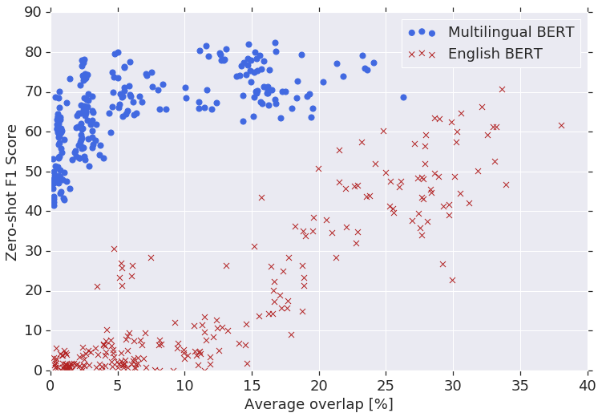
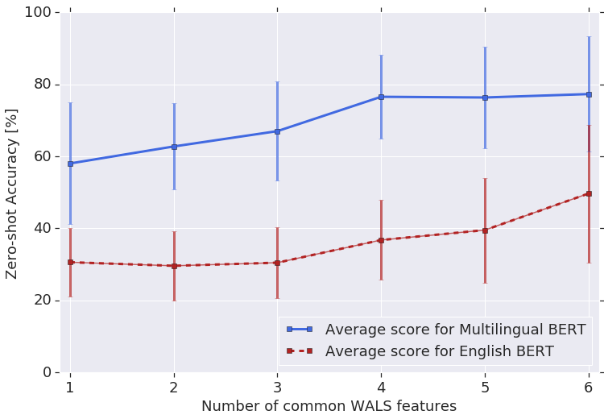
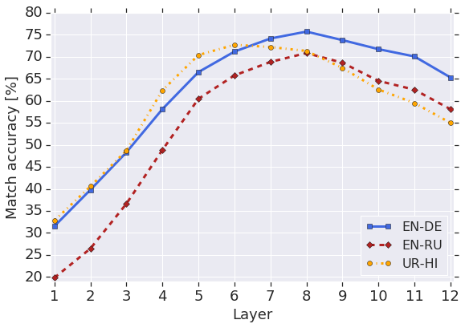

# Насколько многоязычным является проект Multilingual BERT?

> **Неофициальный перевод.** Оригинал: Telmo Pires, Eva Schlinger, Dan Garrette. «How Multilingual is Multilingual BERT?». ACL, 2019. DOI: [10.18653/v1/P19-1493](https://doi.org/10.18653/v1/P19-1493). Лицензия: CC BY 4.0.

## Аннотация

В данной работе мы показываем, что многоязычная модель BERT (M-Bert), выпущенная организацией [Devlin et al. (2019)] в качестве единой языковой модели, предварительно обученной на моноязычных корпусах на 104 языках, неожиданно хорошо справляется с задачей нулевого переноса модели между языками: при этом аннотации, относящиеся к конкретной задаче и сделанные на одном языке, используются для дообучения модели с целью её оценки на другом языке. Чтобы понять причины этого, мы провели множество экспериментов, в ходе которых выяснили, что такой перенос возможен даже между языками с различными алфавитами; что наилучшие результаты достигаются при переносе между типологически схожими языками; что моноязычные корпуса позволяют обучать модели для обработки текстов с переключением языков; а также что модель способна находить соответствующие пары перевода. На основании полученных результатов можно сделать вывод, что M-Bert действительно формирует многоязычные представления, однако эти представления обладают системными недостатками, влияющими на определенные пары языков.

## Введение

Глубокие контекстуализированные языковые модели обеспечивают мощные, универсальные лингвистические представления, способствовавшие значительному прогрессу во множестве задач обработки естественного языка [Peters et al. (2018b)]; [Devlin et al. (2019)]. Данные модели можно предварительно обучить на больших корпусах легкодоступного неаннотированного текста, а затем дообучить для конкретных задач на небольшом объеме размеченных данных, используя сформированную структуру языковой модели для обеспечения обобщения за пределами имеющихся аннотаций. Предыдущие исследования по пробингу моделей показали, что такие представления способны кодировать, помимо прочего, синтаксическую информацию и сведения о именованных сущностях; однако они до настоящего времени были сосредоточены на том, какие сведения о самом английском языке усваивают модели, обученные на английском тексте [Peters et al. (2018a)]; [Tenney et al. (2019b)]; [Tenney et al. (2019a)].

В данной работе мы эмпирически исследуем степень обобщения этих представлений *между* языками. Для изучения данного вопроса мы используем многоязычный BERT (далее — M-Bert), выпущенный [Devlin et al. (2019)] в качестве единой языковой модели, предварительно обученной на объединенном наборе моноязычных корпусов Википедии из 104 языков.11 https://github.com/google-research/bert M-Bert особенно подходит для данного исследования, поскольку позволяет применять крайне простой подход к межъязыковой передаче знаний без дополнительного обучения: мы дообучаем модель с использованием размеченных данных одного языка, после чего проверяем её работу на другом языке. Это дает нам возможность наблюдать, как модель обобщает полученную информацию между различными языками.

Полученные нами результаты свидетельствуют о том, что M-Bert способен к межъязыковей генерализации на удивление эффективно. Что ещё более важно, мы представляем результаты ряда пробных экспериментов, призванных проверить различные гипотезы относительно механизмов такой передачи информации между языками. Эксперименты показали, что хотя высокая лексическая схожесть между языками способствует эффективной передаче знаний, M-Bert также способен выполнять такую передачу между языками, использующими различные письменности — то есть при *полном* отсутствии лексического сходства; это указывает на то, что модель формирует многоязычные представления. Кроме того, мы установили, что передача знаний наиболее успешна между типологически схожими языками; это позволяет предположить, что, несмотря на способность M-Bert отображать изученные структуры на новые лексические наборы, модель, по-видимому, не вырабатывает систематических преобразований этих структур для адаптации к языку-цели с иной порядком слов.

## Модели и данные

Подобно исходной английской модели BERT (далее — En-Bert), M-Bert представляет собой трансформер из 12 слоёв ([Devlin et al., 2019]). Однако в отличие от En-Bert, обучавшейся исключительно на моноязычных английских данных с использованием английского словаря, M-Bert обучается на страницах Википедии на 104 языках, применяя общий словарный набор. При этом в модели не используются какие-либо маркеры, указывающие на входной язык, а также отсутствует механизм, стимулирующий формирование схожих представлений для пар предложений, эквивалентных с точки зрения перевода.

Для задач определения именованных сущностей и частеречной разметки мы используем ту же архитектуру последовательностной разметки, что и в [Devlin et al. (2019)]. Сначала предложение разбивается на токены; полученная последовательность подается в модель En-Bert. Затем извлекаются активации последнего слоя, после чего они передаются в финальный слой для формирования предсказаний по меткам. Вся модель в итоге дообучается с целью минимизации функции потерь перекрестной энтропии для данной задачи. Если при токенизации слово разделяется на несколько частей, в качестве предсказания для этого слова берется результат, полученный для первой части.

### Эксперименты по распознаванию именованных сущностей

Мы проводим эксперименты по распознаванию именованных сущностей на двух наборах данных: общедоступных наборах CoNLL-2002 и -2003, содержащих тексты на нидерландском, испанском, английском и немецком языках [Tjong Kim Sang (2002)]; [Sang and Meulder (2003)]; а также собственном наборе данных с 16 языками,22 арабским (Arabic), бенгальским (Bengali), чешским (Czech), немецким (German), английским (English), испанским (Spanish), французским (French), хинди (Hindi), индонезийским (Indonesian), итальянским (Italian), японским (Japanese), корейским (Korean), португальским (Portuguese), русским (Russian), турецким (Turkish) и китайским (Chinese). Во всех случаях используются те же категории CoNLL. В таблице 1 приведены результаты M-Bert в режиме нулевого обучения для всех языковых пар из набора CoNLL.

Результаты по метрике F1 для задачи распознавания именованных сущностей на данных CoNLL.

### Эксперименты по разметке частей речи

Мы проводим эксперименты по определению частей речи, используя данные проекта Universal Dependencies (UD) [Nivre et al. (2016)] для 41 языка: арабского, болгарского, каталанского, чешского, датского, немецкого, греческого, английского, испанского, эстонского, баскского, персидского, финского, французского, галисийского, иврита, хинди, хорватского, венгерского, индонезийского, итальянского, японского, корейского, латышского, маратхи, нидерландского, норвежского (букмол и нюнорск), польского, португальского (европейского и бразильского), румынского, русского, словацкого, словенского, шведского, тамильского, телугу, турецкого, урду и китайского. Для оценки результатов мы применяем наборы данных из [Zeman et al. (2017)]. В таблице 2 приведены результаты работы модели M-Bert в режиме zero-shot для четырех европейских языков. Как видно из таблицы, модель M-Bert хорошо обобщает знания на различные языки, демонстрируя точность, превышающую $80\%$, для всех языковых пар.

Точность позиционирования на подмножестве языков из проекта Universal Dependencies.

## Запоминание лексики

Поскольку M-Bert использует единый многоязычный словарь, один из видов межъязыковой передачи знаний возникает в том случае, когда элементы словаря, использовавшиеся при **дообучении (fine-tuning)**, также присутствуют в языках, на которых проводится оценка. В данном разделе мы описываем эксперименты, направленные на изучение зависимости M-Bert от такой поверхностной формы обобщения: насколько возможность передачи знаний зависит от лексического пересечения? Возможна ли передача знаний для языков, использующих разные алфавиты (пересечение по элементам *no*)?

### Влияние лексического перекрытия

Если бы способность M-Bert к обобщению в основном обусловливалась запоминанием лексики, то результаты работы модели в режиме zero-shot при решении задач NER в значительной степени зависели бы от степени совпадения используемых словесных элементов, поскольку сущности часто остаются схожими в разных языках. Для измерения этого эффекта мы вычисляем множества $E_{\textit{train}}$ и $E_{\textit{eval}}$ — множества словесных элементов, встречающихся в сущностях обучающего и тестового наборов данных соответственно, — и определяем степень совпадения как долю общих словесных элементов: $\textit{overlap}=|E_{\textit{train}}\cap E_{\textit{eval}}|~/~|E_{\textit{train}}\cup E_{\textit{eval}}|$.

Значения метрики F1 для задачи NER в режиме zero-shot в зависимости от степени совпадения словесных элементов в названиях сущностей для 16 языков. Если для модели En-Bert результаты напрямую зависят от такого совпадения, то показатели M-Bert практически не зависят от него, что свидетельствует о том, что данная модель формирует многоязычные представления на более глубоком уровне, чем простое запоминание словарного состава.

На рисунке 1 показана зависимость значения метрики F1 в задаче распознавания именованных сущностей от степени пересечения словораздельных элементов при нулевом переносе модели между всеми парами языков в составе внутреннего набора данных, включающего 16 языков; рассматриваются как модель M-Bert, так и модель En-Bert.44 Результаты, полученные на данных CoNLL, подтверждают те же тенденции; однако при использовании 16 языков эти тенденции проявляются более явно, чем при использовании лишь 4 языков. Видно, что эффективность работы модели En-Bert напрямую зависит от степени пересечения словораздельных элементов: способность к переносу модели снижается по мере уменьшения такого пересечения, а значения метрики F1 приближаются к нулю для языков, использующих разные письменности. В свою очередь, показатели модели M-Bert остаются практически неизменными при широком диапазоне значений пересечения словораздельных элементов; даже для пар языков с практически полным отсутствием лексического сходства значения F1 колеблются в пределах от $40\%$ до $70\%$. Это свидетельствует о том, что предварительное обучение модели M-Bert на множестве языков позволило ей сформировать более глубокие представления, чем простое запоминание словарного состава.55 Тенденции для отдельных языков аналогичны тем, что наблюдаются в агрегированных графиках.

Для дополнительной проверки того, что неспособность En-Bert к обобщению обусловлена отсутствием многоязычного представления, а не невозможностью его словаря, специфичного для английского языка, представлять данные на других языках, мы провели оценку на задаче *non*-cross-lingual NER и убедились, что его результаты сопоставимы с показателями ранее существовавшей модели передового уровня (см. таблицу 3).

Результаты по метрике F1 для задачи NER при проведении дообучения и оценки на *том же* языке (без использования подхода нулевого переноса).

### Обобщение на различные письменности

Способность модели M-Bert осуществлять перенос знаний между языками, записываемыми разными письменностями и, следовательно, практически не имеющими лексического пересечения, вызывает удивление, учитывая тот факт, что модель обучалась на отдельных моноязычных корпусах без использования многоязычной целевой функции. Для более глубокого изучения механизмов такой обобщающей способности в таблице 4 приведены примеры результатов определения частей речи при переносе на языки с иной письменностью.

Среди наиболее удивительных результатов следует отметить то, что модель M-Bert, дообученная исключительно на размеченном по частям речи тексте на урду (написанном арабским письмом), демонстрирует точность в 91% при обработке текстов на хинди (написанных деванагари); при этом модель ни разу не сталкивалась с ни одним размеченным по частям речи словом на деванагари. Это служит явным доказательством способности M-Bert к формированию многоязычных представлений: модель сопоставляет языковые структуры с новыми словарями, опираясь лишь на общее представление, выведенное из данных моноязычного обучения.

Однако передача языковых характеристик между различными письменностями менее точна для других пар языков, например английского и японского, что свидетельствует о том, что мультиязычное представление, формируемое моделью M-Bert, не всегда удается обобщать в равной степени во всех случаях. Возможное объяснение этому, как будет показано в разделе Обобщение на основе типологических признаков, заключается в типологическом сходстве языков. В английском и японском языках порядок слов — подлежащее, сказуемое и дополнение — отличается; в английском и болгарском же этот порядок одинаков, и, вероятно, именно поэтому M-Bert испытывает трудности с обобщением на языки с различным порядком слов.

Точность определения частеречной принадлежности на тестовом наборе UD для языков с различными алфавитами. Строка — дообучение, столбец — оценка.

## Кодирование лингвистической структуры

В предыдущем разделе мы продемонстрировали, что способность M-Bert к обобщению нельзя объяснить исключительно запоминанием словарного состава; модель, очевидно, формирует более глубокое многоязычное представление данных. В данном разделе мы описываем эксперименты по исследованию характеристик этого представления: как типологическая схожесть влияет на способность M-Bert к обобщению? Может ли M-Bert обобщать результаты, полученные при обработке моноязычных вводных данных, на тексты с переключением языков? Способна ли модель обобщать на тексты, транслитерированные без предварительного обучения языковой модели на подобных данных?

### Влияние сходства языков

Следуя методике [Naseem et al. (2012)], мы сравниваем языки по подмножеству характеристик WALS [Dryer and Haspelmath (2013)], имеющих отношение к грамматическому порядку.66 81A (порядок подлежащего, дополнения и глагола), 85A (порядок предлога/послелога и существительного), 86A (порядок генитива и существительного), 87A (порядок прилагательного и существительного), 88A (порядок указательного местоимения и существительного) и 89A (порядок числительного и существительного). На рисунке 2 показана точность POS в режиме нулевого обучения в зависимости от числа общих характеристик WALS. Как и ожидалось, качество растёт со сходством: M-Bert легче сопоставляет языковые структуры, когда они более похожи, хотя даже для языков с низким сходством модель всё ещё работает вполне достойно по сравнению с En-Bert.

Зависимость точности определения частей речи в режиме «zero-shot» от количества общих признаков по классификации WALS. Ввиду их малочисленности мы исключаем пары языков, не имеющие общих признаков.

### Обобщение на основе типологических признаков

В таблице 5 приведены усредненные по классам метки точности распознавания частей речи при межъязыковой передаче знаний; языки сгруппированы по двум типологическим признакам: порядку подлежащего, объекта и глагола, а также порядку прилагательного и существительного77 **Языки типа SVO**: болгарский, каталанский, чешский, датский, английский, испанский, эстонский, финский, французский, галисийский, иврит, хорватский, индонезийский, итальянский, латышский, норвежский (букмол и нюнорск), польский, португальский (европейский и бразильский), румынский, русский, словацкий, словенский, шведский и китайский. **Языки типа SOV**: баскский, персидский, хинди, японский, корейский, маратхи, тамильский, телугу, турецкий и урду. [Dryer and Haspelmath (2013)]. В представленных результатах учитывается лишь передача знаний в режиме «нулевого демонстрационного обучения»; случаи обучения и тестирования на одном и том же языке в расчет не принимаются. Как видно, наилучшие показатели достигаются при передаче знаний между языками, имеющими схожие характеристики порядка слов; это позволяет предположить, что хотя многоязычное представление M-Bert способно сопоставлять изученные структуры с новыми словарями, оно, по-видимому, не формирует систематических преобразований этих структур для адаптации к целевому языку с иным порядком слов.

Макросредние значения точности определения частей речи при передаче модели между языками типа SVO/SOV или AN/NA. Строка соответствует процессу дообучения, столбец — этапу оценки.

### Код-свичинг и транслитерация

Кодовая смена (Code-switching; смешивание нескольких языков в рамках одного высказывания) и транслитерация (написание текста не в стандартном алфавите данного языка) представляют собой специфические тестовые случаи для модели M-Bert, предварительно обученной на моноязычных корпусах текстов в стандартном алфавите. Обобщение модели на случаи кодовой смены схоже с другими сценариями межъязыковой передачи знаний; однако в данном случае ещё большее значение имеет наличие общей многоязычной репрезентации. Аналогичным образом, обобщение на транслитерированные тексты схоже с прочими экспериментами по передаче знаний между языками с разными алфавитами; однако существует дополнительная сложность: модель M-Bert не обучалась на текстах, внешне схожих с целевыми.

Мы тестируем модель M-Bert на корпусе CS Hindi/English UD из [Bhat et al. (2018)], содержащем тексты в двух форматах: *транслитерированном*, где хинди-слова записаны латиницей, и *исправленном*, где аннотаторы перевели их обратно в письменность деванагари. В таблице 6 приведены результаты работы моделей, прошедших **дообучение** с использованием как моноязычных хинди- и английских данных, так и обучающего набора CS (включая как дообучение на версии корпуса с исправленным письмом, так и на транслитерированной версии).

Точность определения частеречных меток в модели M-Bert на наборе данных с кодосвичингом на языках хинди и английском из [Bhat et al. (2018)], как для токенов в исправленном варианте письма, так и для исходных (транслитерированных) токенов; также приводятся сравнения с результатами существующих исследований по определению частеречных меток в подобных условиях.

При использовании входных данных с корректным написанием — то есть когда хинди записывается на письменности деванагари — результаты работы M-Bert, обученной исключительно на моноязычных корпусах, сопоставимы с результатами при обучении на кодосвиченных данных. Вероятно, часть оставшегося различия обусловлена несоответствием доменов. Это служит дополнительным доказательством того, что M-Bert формирует представления, способные интегрировать информацию из нескольких языков.

Однако M-Bert не способен эффективно переносить полученные знания на транслитерированный язык; это указывает на то, что именно предобучение (pre-training) модели на конкретном языке обеспечивает возможность её адаптации к этому языку. В сценариях обучения исключительно на моноязычных корпусах и на кодосмешанных данных результаты работы M-Bert уступают результатам, полученным в рамках предыдущих исследований. Ни в [Ball and Garrette (2018)], ни в [Bhat et al. (2018)] не используются контекстуализированные словесные эмбеддинги; однако в обоих подходах предусмотрено явное включение сигналов транслитерации.

## Многоязычная характеризация пространства признаков

В данном разделе мы исследуем структуру векторного пространства признаков модели M-Bert. Если это пространство является многоязычным, то преобразование, сопоставляющее один и тот же предложение на разных языках из множества $2$, не должно зависеть от самого предложения, а лишь от пары языков.

### Экспериментальная установка

Мы случайным образом выбираем $5000$ пар предложений из корпуса WMT16 [Bojar et al. (2016)] и подаем каждое предложение (по отдельности) на вход модели M-Bert без какого-либо дообучения. Затем извлекаем активации скрытых слоев для каждого предложения и усредняем полученные представления для всех входных токенов, за исключением [cls] и [sep]; таким образом получается вектор для каждого предложения на каждом слое $l$, $v_{\textsc{lang}}^{(l)}$. Для каждой пары предложений, например $(v_{\textsc{en}_{i}}^{(l)},v_{\textsc{de}_{i}}^{(l)})$, вычисляем вектор, направленный от одного предложения к другому, и усредняем его по всем парам: $\bar{v}_{\textsc{en}\rightarrow\textsc{de}}^{(l)}=\frac{1}{M}\sum_{i}\left(v_{\textsc{de}_{i}}^{(l)}-v_{\textsc{en}_{i}}^{(l)}\right)$, где $M$ обозначает общее количество пар. В конце переводим каждое предложение $v_{\textsc{en}_{i}}^{(l)}$ с помощью $\bar{v}_{\textsc{en}\rightarrow\textsc{de}}^{(l)}$; после этого находим ближайший к полученному вектору вектор немецкого предложения88 С точки зрения метрики $\ell_{2}$ расстояния. и определяем долю случаев, когда таким ближайшим соседом оказывается правильная пара; этот показатель мы называем «точностью по ближайшему соседу».

### Результаты

На рисунке 3 приведена кривая точности по методу ближайшего соседа для пары en-de (сплошная линия). Для всех слоёв, кроме самых нижних, показатель превышает $50\%$,99 По нашему мнению, в нижних слоях больше информации на уровне токенов, сильнее зависящей от языка, особенно если языки делят мало word pieces. что, по-видимому, означает: скрытые представления, хотя и разнесены в пространстве, имеют общее подпространство с полезной лингвистической информацией в языке-агностичном виде. Аналогичные кривые получаются для en-ru и ur-hi (внутренний набор данных), то есть подход работает для нескольких языков.

Точность перевода с использованием метода ближайшего соседа для пар языков en-de, en-ru и hi-ur.

Что касается причины снижения точности на последних слоях, то одним из возможных объяснений является то, что поскольку модель предварительно обучалась для задач языкового моделирования, ей, вероятно, требуется больше информации, специфичной для конкретного языка, чтобы корректно предсказать отсутствующее слово.

## Заключение

В данной работе мы продемонстрировали, что устойчивая, порой даже удивительная способность модели M-Bert к межъязыковой обобщации обусловлена наличием многоязычного представления, при этом модель не подвергалась специальной тренировке в этом направлении. Модель довольно успешно справляется с переносом знаний между языками, использующими различные письменности, а также с код-свичингом; однако для эффективного переноса знаний на языки, сильно отличающиеся по типологии или представленные в транслитерированном виде, вероятно потребуется введение в модель явной многоязычной обучающей цели, подобной той, что применяется в работах [Lample and Conneau (2019)] и [Artetxe and Schwenk (2018)].

Что касается причин, по которым модель M-Bert демонстрирует способность к обобщению между языками, мы предполагаем, что наличие таких элементов словаря, используемых во всех языках (числа, URL-адреса и т. д.), которые необходимо отобразить в единое пространство, вынуждает также отображать в это же пространство и сопутствующие элементы словаря. В результат данный эффект распространяется на остальные элементы словаря, вследствие чего различные языки оказываются близкими друг к другу в рамках этого общего пространства.

Мы надеемся, что подобные пробные эксперименты помогут направить исследователей по наиболее перспективным направлениям, побуждая их сосредоточиться на тех аспектах, в которых современные подходы к контекстуализированному представлению слов оказываются неэффективными.

## Благодарности

Мы хотели бы поблагодарить Марка Омерника, Ливио Бальдини Соареса, Эмили Питлер, Джейсона Риесу и Слава Петрова за ценные обсуждения и конструктивную обратную связь.

## Параметры модели

Все модели дообучались при размере пакета $32$ и максимальной длине последовательности $128$ в течение $3$ эпох. В качестве скорости обучения использовалось значение $3\mathrm{e}{-5}$; в течение первых $10\%$ шагов применялась постепенная накачка скорости обучения, после чего она линейно уменьшалась. На последний слой также применялся $10\%$ дропаут. Никакой настройки параметров не проводилось. Для обучения использовался чекпоинт `BERT-Base, Multilingual Cased` из набора [https://github.com/google-research/bert](https://github.com/google-research/bert).

## Результаты CoNLL для En-Bert

Результаты применения модели En-Bert к тестовым наборам CoNLL. В строках указан язык дообучения, в столбцах — язык оценки. Наблюдается значительная разница между результатами работы данной модели в режиме zero-shot и результатами модели M-Bert; это свидетельствует о том, что предобучение способствует эффективной межъязыковой передаче знаний.

## Некоторые результаты для En-Bert

Точность позиционной разметки на тестовых наборах UD для подмножества европейских языков при использовании модели En-Bert. В строках указан язык дообучения, в столбцах — язык оценки. Наблюдается значительный разрыв между показателями модели в режиме zero-shot и показателями модели M-Bert; это свидетельствует о том, что предобучение способствует формированию полезного межъязыкового представления грамматических структур.

## Список литературы

Artetxe and Schwenk (2018) Artetxe and Schwenk (2018) Mikel Artetxe and Holger Schwenk. 2018. Massively multilingual sentence embeddings for zero-shot cross-lingual transfer and beyond. arXiv preprint arXiv:1812.10464.
Ball and Garrette (2018) Ball and Garrette (2018) Kelsey Ball and Dan Garrette. 2018. Part-of-speech tagging for code-switched, transliterated texts without explicit language identification. In Proceedings of EMNLP.
Bhat et al. (2018) Bhat et al. (2018) Irshad Bhat, Riyaz A. Bhat, Manish Shrivastava, and Dipti Sharma. 2018. Universal dependency parsing for Hindi-English code-switching. In Proceedings of NAACL.
Bojar et al. (2016) Bojar et al. (2016) Ondřej Bojar, Yvette Graham, Amir Kamran, and Miloš Stanojević. 2016. Results of the WMT16 metrics shared task. In Proceedings of the First Conference on Machine Translation: Volume 2, Shared Task Papers.
Devlin et al. (2019) Devlin et al. (2019) Jacob Devlin, Ming-Wei Chang, Kenton Lee, and Kristina Toutanova. 2019. BERT: Pre-training of deep bidirectional transformers for language understanding. In Proceedings of NAACL.
Dryer and Haspelmath (2013) Dryer and Haspelmath (2013) Matthew S. Dryer and Martin Haspelmath, editors. 2013. WALS Online. Max Planck Institute for Evolutionary Anthropology, Leipzig. https://wals.info/.
Lample et al. (2016) Lample et al. (2016) Guillaume Lample, Miguel Ballesteros, Sandeep Subramanian, Kazuya Kawakami, and Chris Dyer. 2016. Neural architectures for named entity recognition. In Proceedings of NAACL.
Lample and Conneau (2019) Lample and Conneau (2019) Guillaume Lample and Alexis Conneau. 2019. Cross-lingual language model pretraining. arXiv preprint arXiv:1901.07291.
Naseem et al. (2012) Naseem et al. (2012) Tahira Naseem, Regina Barzilay, and Amir Globerson. 2012. Selective sharing for multilingual dependency parsing. In Proceedings of ACL.
Nivre et al. (2016) Nivre et al. (2016) Joakim Nivre, Marie-Catherine de Marneffe, Filip Ginter, Yoav Goldberg, Jan Hajic, Christopher D. Manning, Ryan T. McDonald, Slav Petrov, Sampo Pyysalo, Natalia Silveira, Reut Tsarfaty, and Daniel Zeman. 2016. Universal dependencies v1: A multilingual treebank collection. In Proceedings of LREC.
Peters et al. (2018a) Peters et al. (2018a) Matthew Peters, Mark Neumann, Luke Zettlemoyer, and Wen-tau Yih. 2018a. Dissecting contextual word embeddings: Architecture and representation. In Proceedings of EMNLP.
Peters et al. (2018b) Peters et al. (2018b) Matthew E. Peters, Mark Neumann, Mohit Iyyer, Matt Gardner, Christopher Clark, Kenton Lee, and Luke Zettlemoyer. 2018b. Deep contextualized word representations. In Proceedings of NAACL.
Sang and Meulder (2003) Sang and Meulder (2003) Erik F. Tjong Kim Sang and Fien De Meulder. 2003. Introduction to the CoNLL-2003 shared task: Language-independent named entity recognition. In Proceedings of CoNLL.
Tenney et al. (2019a) Tenney et al. (2019a) Ian Tenney, Dipanjan Das, and Ellie Pavlick. 2019a. BERT rediscovers the classical NLP pipeline. In Proceedings of ACL.
Tenney et al. (2019b) Tenney et al. (2019b) Ian Tenney, Patrick Xia, Berlin Chen, Alex Wang, Adam Poliak, R Thomas McCoy, Najoung Kim, Benjamin Van Durme, Sam Bowman, Dipanjan Das, and Ellie Pavlick. 2019b. What do you learn from context? Probing for sentence structure in contextualized word representations. In Proceedings of ICLR.
Tjong Kim Sang (2002) Tjong Kim Sang (2002) Erik F. Tjong Kim Sang. 2002. Introduction to the CoNLL-2002 shared task: Language-independent named entity recognition. In Proceedings of CoNLL.
Zeman et al. (2017) Zeman et al. (2017) Daniel Zeman, Martin Popel, Milan Straka, Jan Hajic, Joakim Nivre, Filip Ginter, Juhani Luotolahti, Sampo Pyysalo, Slav Petrov, Martin Potthast, Francis Tyers, Elena Badmaeva, Memduh Gokirmak, Anna Nedoluzhko, Silvie Cinkova, Jan Hajic jr., Jaroslava Hlavacova, Václava Kettnerová, Zdenka Uresova, Jenna Kanerva, Stina Ojala, Anna Missilä, Christopher D. Manning, Sebastian Schuster, Siva Reddy, Dima Taji, Nizar Habash, Herman Leung, Marie-Catherine de Marneffe, Manuela Sanguinetti, Maria Simi, Hiroshi Kanayama, Valeria dePaiva, Kira Droganova, Héctor Martínez Alonso, Çağrı Çöltekin, Umut Sulubacak, Hans Uszkoreit, Vivien Macketanz, Aljoscha Burchardt, Kim Harris, Katrin Marheinecke, Georg Rehm, Tolga Kayadelen, Mohammed Attia, Ali Elkahky, Zhuoran Yu, Emily Pitler, Saran Lertpradit, Michael Mandl, Jesse Kirchner, Hector Fernandez Alcalde, Jana Strnadová, Esha Banerjee, Ruli Manurung, Antonio Stella, Atsuko Shimada, Sookyoung Kwak, Gustavo Mendonca, Tatiana Lando, Rattima Nitisaroj, and Josie Li. 2017. CoNLL 2017 shared task: Multilingual parsing from raw text to universal dependencies. In Proceedings of CoNLL.
