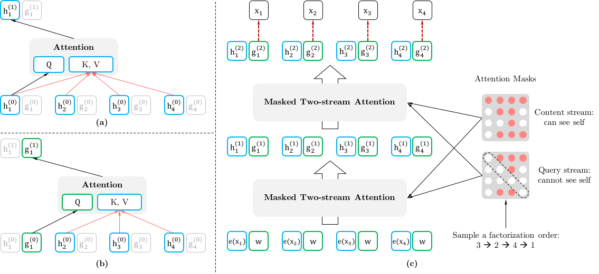
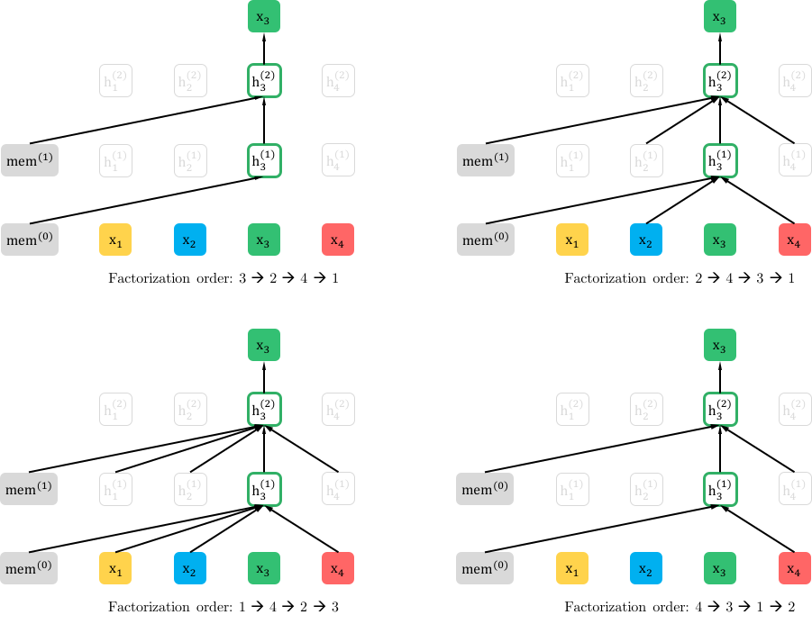
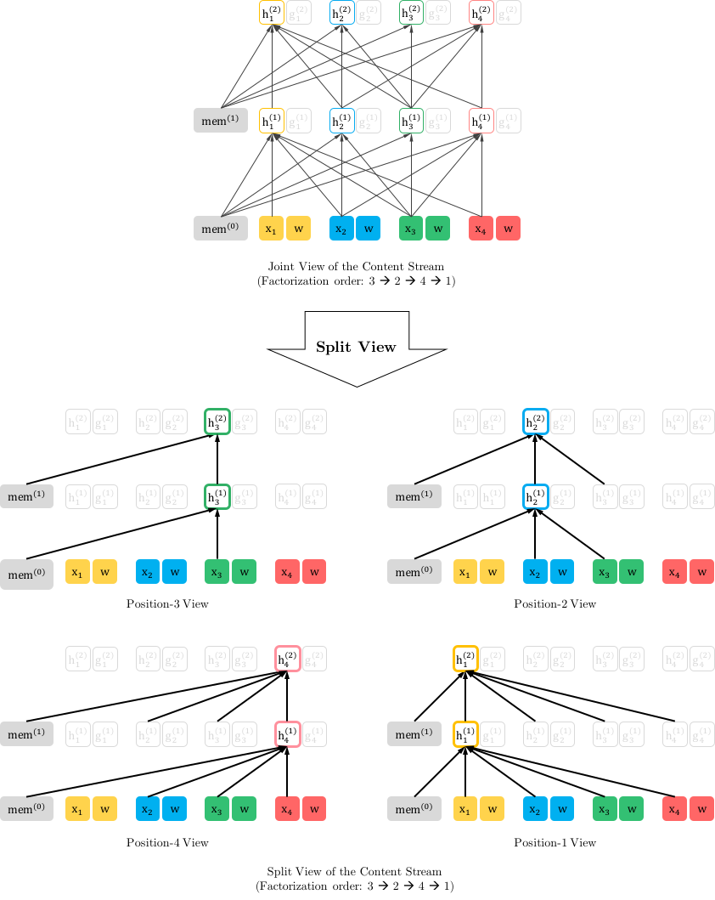
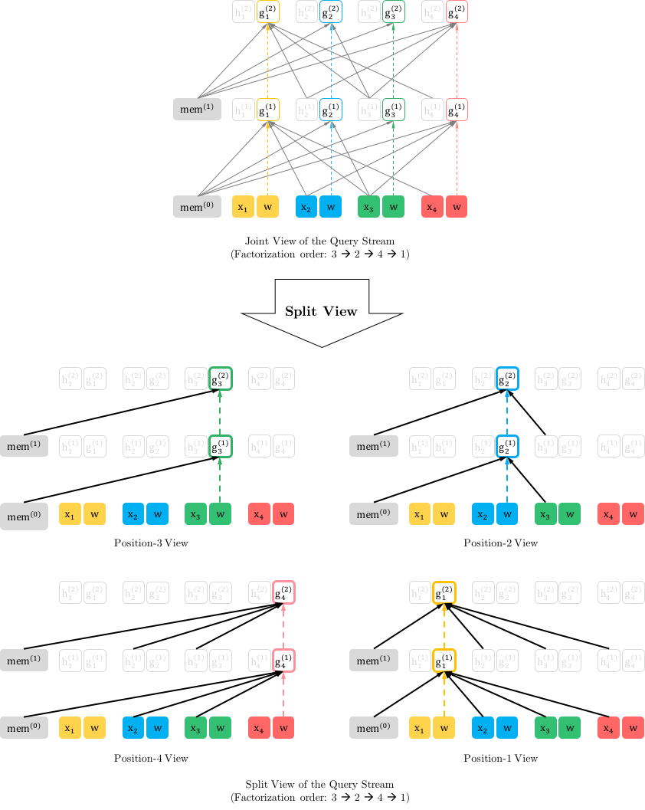

# XLNet: Обобщённая авторегрессивная предобучающая процедура для понимания языка

> **Неофициальный перевод.** Оригинал: Zhilin Yang, Zihang Dai, Yiming Yang, Jaime Carbonell, Ruslan Salakhutdinov, Quoc V. Le. «XLNet: Generalized Autoregressive Pretraining for Language Understanding». NeurIPS, 2019. DOI: [10.48550/arXiv.1906.08237](https://doi.org/10.48550/arXiv.1906.08237). Лицензия: arXiv perpetual non-exclusive.

## Аннотация

Благодаря возможности моделирования двунаправленных контекстов, предобучение с использованием денойзинг-автоэнкодеров, такое как BERT, обеспечивает более высокую эффективность по сравнению с подходами предобучения, основанными на авторегрессивном моделировании языка. Однако поскольку BERT предполагает маскирование элементов входного текста, он игнорирует взаимосвязи между замаскированными позициями и сталкивается с проблемой несоответствия между этапами предобучения и дообучения. Учитывая эти преимущества и недостатки, мы предлагаем XLNet — универсальный авторегрессивный метод предобучения, который (1) позволяет изучать двунаправленные контексты путем максимизации ожидаемой вероятности при всех возможных порядках факторизации и (2) устраняет ограничения, присущие BERT, благодаря своей авторегрессивной структуре. Кроме того, XLNet интегрирует идеи из Transformer-XL — передовой авторегрессивной модели — в процесс предобучения. Эмпирические испытания в сопоставимых условиях показали, что XLNet превосходит BERT в выполнении 20 задач, зачастую с существенным отрывом; к таким задачам относятся ответы на вопросы, распознавание импликаций в тексте, анализ тональности и ранжирование документов.11 Предобученные модели и исходный код доступны по адресу [https://github.com/zihangdai/xlnet](https://github.com/zihangdai/xlnet).

*[inlinelist,1]label=(),

## Введение

Обучение представлений без учителя продемонстрировало высокую эффективность в области обработки естественного языка [7, 22, 27, 28, 10]. Как правило, такие методы сначала осуществляют предварительное обучение нейронных сетей на крупных массивах неразмеченного текста, а затем производят дообучение моделей или представлений для решения конкретных прикладных задач (downstream task). В рамках этой общей концепции в научной литературе исследовались различные цели предварительного обучения без учителя. Среди них наибольшим успехом пользовались две стратегии: авторегрессивное моделирование языка (AR) и автокодирование (AE).

Авторегрессивное (AR) моделирование языка направлено на оценку распределения вероятностей в текстовом корпусе с использованием авторегрессивной модели [7, 27, 28]. В частности, при заданной последовательности текста $\mathbf{x}=(x_{1},\cdots,x_{T})$ авторегрессивное моделирование языка разлагает функцию правдоподобия на произведение вероятностей в направлении от начала к концу $p(\mathbf{x})=\prod_{t=1}^{T}p(x_{t}\mid\mathbf{x}_{<t})$ либо от конца к началу $p(\mathbf{x})=\prod_{t=T}^{1}p(x_{t}\mid\mathbf{x}_{>t})$. Параметрическая модель (например, нейронная сеть) обучается для аппроксимации каждого условного распределения. Поскольку авторегрессивная языковая модель обучается лишь на кодировании однонаправленного контекста (либо в прямом, либо в обратном направлении), она не способна эффективно моделировать глубокий двунаправленный контекст. Между тем задачи по пониманию языка зачастую требуют именно такой двунаправленной контекстной информации. Это порождает разрыв между принципами авторегрессивного моделирования языка и требованиями к эффективной предобученности моделей.

В отличие от этого, предобучение по методу автоэнкодера не подразумевает явного оценивания плотности распределения; вместо этого модель стремится восстановить исходные данные из поврежденного ввода. Ярким примером является BERT [10] — на данный момент этот метод считается наилучшим подходом к предобучению. При этом определенная часть токенов в последовательности заменяется специальным символом `[MASK]`, а модель обучается восстанавливать исходные токены из такой искаженной последовательности. Поскольку оценивание плотности не входит в целевую функцию, модели типа BERT разрешается использовать двунаправленный контекст для восстановления данных. Это позволяет устранить упомянутый выше разрыв в использовании двунаправленной информации в рамках моделей авторегрессивного типа, что в свою очередь повышает их эффективность. Однако искусственные символы, такие как `[MASK]`, применяемые в процессе предобучения моделями типа BERT, отсутствуют в реальных данных при этапе дообучения; это приводит к рассогласованию между процессами предобучения и дообучения. Кроме того, поскольку предсказанные токены в исходном вводе маскируются, модели типа BERT не могут вычислять совместную вероятность с помощью правила умножения, как это делается в моделях авторегрессивного типа. Иными словами, модели типа BERT предполагают, что предсказанные токены независимы друг от друга при условии заданных немаскированных токенов; однако такое допущение является чрезмерно упрощенным, поскольку в естественном языке [9] широко распространены зависимости высокого порядка и дальнего действия.

Сталкиваясь с преимуществами и недостатками существующих целей предобучения языковых моделей, в данной работе мы предлагаем XLNet — обобщённый авторегрессивный метод, сочетающий лучшие аспекты как авторегрессивного моделирования языка, так и автоэнкодера, при этом избегая их недостатков.

Помимо нового объекта предобучения, XLNet также совершенствует архитектурные решения, используемые в процессе предобучения.

Эмпирически, при сопоставимых условиях эксперимента, XLNet стабильно демонстрирует более высокие результаты, чем BERT [10], в широком спектре задач: задачах понимания языка (рид; короткий фрагмент ДНК после секвенирования), включая GLUE, задачах чтения с пониманием, таких как SQuAD и RACE, задачах классификации текстов, включая Yelp и IMDB, а также в задаче ранжирования документов ClueWeb09-B.

**Связанные исследования** Идея моделирования авторегрессионных распределений на основе перестановок рассматривалась в работе [32, 12]; однако существует несколько ключевых различий. Во-первых, предыдущие модели стремились улучшить оценку плотности распределения, заложив в свою структуру «безпорядковое» индуктивное смещение, тогда как XLNet создавалась с целью позволить авторегрессионным языковым моделям изучать двунаправленный контекст. С технической точки зрения, для построения корректного распределения прогнозов, учитывающего целевой элемент, XLNet включает информацию о позиции целевого элемента в скрытое состояние с помощью двухпоточного механизма внимания; в то время как предыдущие модели подобного типа опирались на неявное понимание позиций, заложенное в их архитектуре полносвязных слоев. Наконец, в отношении как безпорядковой модели NADE, так и XLNet следует подчеркнуть: термин «безпорядковое» не означает, что входная последовательность может произвольно переставляться; он указывает лишь на то, что модель допускает различные варианты факторизации распределения.

Еще одной связанной идеей является применение авторегрессивного удаления шума в контексте генерации текста [11]; при этом используется лишь фиксированный порядок элементов последовательности.

## Предлагаемый метод

### Предыстория

В данном разделе мы сначала рассмотрим и сравним традиционное авторегрессивное моделирование языка и BERT в контексте предобучения языковых моделей. При наличии текстовой последовательности ${\mathbf{x}}=\left[{x_{1},\cdots,x_{T}}\right]$ авторегрессивное моделирование языка осуществляет предобучение путем максимизации вероятности согласно прямой авторегрессивной факторизации.

Здесь $h_{\theta}({\mathbf{x}}_{1:t-1})$ представляет собой контекстное представление, формируемое нейронными моделями, такими как RNN или трансформеры; $e(x)$, в свою очередь, обозначает эмбеддинг $x$. В отличие от этого, BERT основывается на принципе денойзинг-автоэнкодирования. А именно: для текстовой последовательности ${\mathbf{x}}$ BERT сначала создает её искаженную версию $\hat{{\mathbf{x}}}$, случайным образом заменяя часть (например, 15%) токенов в ${\mathbf{x}}$ на специальный символ `[MASK]`. Пусть маскированные токены обозначаются как $\bar{{\mathbf{x}}}$. Целью обучения является восстановление исходной последовательности $\bar{{\mathbf{x}}}$ из $\hat{{\mathbf{x}}}$.

Здесь $m_{t}=1$ означает, что $x_{t}$ является маскированным токеном; кроме того, $H_{\theta}$ представляет собой Transformer, преобразующий текстовую последовательность длиной $T$ ${\mathbf{x}}$ в последовательность скрытых векторов $H_{\theta}({\mathbf{x}})=\left[{H_{\theta}({\mathbf{x}})_{1},H_{\theta}({\mathbf{x}})_{2},\cdots,H_{\theta}({\mathbf{x}})_{T}}\right]$. Преимущества и недостатки двух подходов к предобучению рассматриваются ниже.

### Цель: Перестановочное моделирование языка

Согласно проведенному сравнению, авторегрессионное моделирование языка и BERT обладают собственными преимуществами по сравнению друг с другом. Возникает естественный вопрос: существует ли такая цель предобучения, которая объединяла бы достоинства обоих подходов, устраняя при этом их недостатки?

Заимствовав идеи из бескординатного NADE [32], мы предлагаем целевую функцию перестановочного языкового моделирования, которая не только сохраняет преимущества моделей типа AR, но также позволяет моделям учитывать двунаправленный контекст. Конкретно говоря, для последовательности ${\mathbf{x}}$ длиной $T$ существует $T!$ различных порядков, обеспечивающих корректное авторегрессивное разложение. Интуитивно можно предположить, что при общих параметрах модели для всех вариантов разложения в среднем модель будет способна извлекать информацию из всех позиций как слева, так и справа.

Чтобы формализовать данную идею, обозначим $\mathcal{Z}_{T}$ множество всех возможных перестановок индексной последовательности длины $T$, обозначаемой как $\left[{1,2,\dots,T}\right]$. Для обозначения $t$-го элемента и первых $t-1$ элементов некоторой перестановки ${\mathbf{z}}\in\mathcal{Z}_{T}$ используются символы $z_{t}$ и ${\mathbf{z}}_{<t}$ соответственно. Предложенная нами целевая функция для моделирования перестановок формулируется следующим образом:

По сути, для текстовой последовательности ${\mathbf{x}}$ мы поочередно выбираем порядок разложения ${\mathbf{z}}$ и затем разделяем вероятность появления элементов последовательности $p_{\theta}({\mathbf{x}})$ в соответствии с этим порядком. Поскольку во время обучения один и тот же параметр модели $\theta$ используется для всех возможных порядков разложения, в среднем модель $x_{t}$ «видит» каждый возможный элемент $x_{i}\neq x_{t}$ в последовательности, благодаря чему способна учитывать контекст в обоих направлениях. Кроме того, поскольку данная целевая функция вписывается в рамки авторегрессионного подхода, она естественным образом исключает предположение о независимости элементов последовательности, а также проблему несоответствия между этапами предобучения и дообучения, описанную в разделе Предыстория.

**Примечание относительно перестановки** Предложенная целевая функция лишь изменяет порядок факторизации, но не порядок самих последовательностей. Иными словами, мы сохраняем исходный порядок элементов в последовательности, используем позиционные кодировки, соответствующие этому порядку, а также применяем соответствующую маску внимания в архитектуре Transformers для реализации перестановки порядка факторизации. Следует отметить, что такой подход необходим: в процессе дообучения модель будет сталкиваться исключительно с текстовыми последовательностями в естественном порядке.

Для того чтобы дать общее представление, в Приложении Визуализация памяти и перестановок мы приводим пример предсказания токена $x_{3}$ при использовании одной и той же входной последовательности ${\mathbf{x}}$, но при различных порядках факторизации; этот пример проиллюстрирован на рисунке 4.

### Архитектура: двухпотоковое самовнимание (self-attention) для формирования представлений, учитывающих целевой объект

(а): Внимание потока содержимого, которое совпадает со стандартным самовниманием. (б): Внимание потока запросов, которое не имеет доступа к информации о содержимом $x_{z_{t}}$. (в): Обзор обучения permutation language modeling с двухпотоковым вниманием.

Хотя целевая функция перестановочного моделирования языка обладает желательными свойствами, её простая реализация с использованием стандартной параметризации Transformer может оказаться неэффективной. Чтобы понять суть проблемы, предположим, что распределение следующего токена $p_{\theta}(X_{z_{t}}\mid{\mathbf{x}}_{{\mathbf{z}}_{<t}})$ задаётся с помощью обычной формулировки Softmax, то есть $p_{\theta}(X_{z_{t}}=x\mid{\mathbf{x}}_{{\mathbf{z}}_{<t}})=\frac{\exp\left({e(x)^{\top}h_{\theta}({\mathbf{x}}_{{\mathbf{z}}_{<t}})}\right)}{\sum_{x^{\prime}}\exp\left({e(x^{\prime})^{\top}h_{\theta}({\mathbf{x}}_{{\mathbf{z}}_{<t}})}\right)},$, где $h_{\theta}({\mathbf{x}}_{{\mathbf{z}}_{<t}})$ обозначает скрытое представление ${\mathbf{x}}_{{\mathbf{z}}_{<t}}$, полученное в результате работы общей сети Transformer после соответствующего маскирования. Однако представление $h_{\theta}({\mathbf{x}}_{{\mathbf{z}}_{<t}})$ не зависит от позиции, для которой производится предсказание, то есть от значения $z_{t}$. Вследствие этого предсказывается одно и то же распределение независимо от целевой позиции, что не позволяет сети выучить полезные представления (конкретный пример приведён в Приложении Конкретный пример того, как стандартная параметризация языковых моделей даёт сбой). Для устранения данной проблемы мы предлагаем переопределить распределение следующего токена так, чтобы оно учитывало целевую позицию.

Здесь $g_{\theta}({\mathbf{x}}_{{\mathbf{z}}_{<t}},z_{t})$ обозначает новый тип представлений, которые дополнительно принимают на вход позицию целевого элемента $z_{t}$.

**Двухпоточное самовнимание** Хотя концепция представлений, учитывающих позицию целевого элемента, устраняет неоднозначность при прогнозировании, вопрос о том, как сформулировать $g_{\theta}({\mathbf{x}}_{{\mathbf{z}}_{<t}},z_{t})$, остается сложной задачей. Среди прочих вариантов мы предлагаем «занять» позицию целевого элемента $z_{t}$ и использовать позицию $z_{t}$ для сбора информации из контекста ${\mathbf{x}}_{{\mathbf{z}}_{<t}}$ посредством самовнимания. Для корректной работы такой параметризации существуют два требования, противоречащих друг другу в стандартной архитектуре Transformer: (1) для прогнозирования токена $x_{z_{t}}$ переменная $g_{\theta}(\mathbf{x}_{\mathbf{z}_{<t}},z_{t})$ должна использовать лишь *позицию* $z_{t}$, а не *содержимое* $x_{z_{t}}$; в противном случае задача становится тривиальной; (2) для прогнозирования остальных токенов $x_{z_{j}}$ с помощью $j>t$ переменная $g_{\theta}(\mathbf{x}_{\mathbf{z}_{<t}},z_{t})$ также должна учитывать содержимое $x_{z_{t}}$, чтобы обеспечить полную контекстную информацию. Чтобы разрешить это противоречие, мы предлагаем использовать два набора скрытых представлений вместо одного.

С точки зрения вычислений, поток запросов первого слоя инициализируется обучаемым вектором, а именно $g_{i}^{(0)}=w$; поток содержимого в свою очередь задается соответствующим вектором вложения слова, то есть $h_{i}^{(0)}=e(x_{i})$. Для каждого слоя самовнимания $m=1,\dots,M$ оба потока представлений обновляются с использованием общего набора параметров следующим образом (схематически показано на рисунках 1 (а) и (б)). Чтобы избежать излишней сложности описания, мы опускаем детали реализации, включая механизм многоголового самовнимания, остаточные связи, нормализацию слоев и позиционно-зависимые преобразования, применяемые в Transformer(-XL). Эти детали приводятся в Приложении Двухпоточное внимание для справки.

Здесь Q, K и V обозначают запрос, ключ и значение в операции самовнимания [33]. Правило обновления представлений содержимого полностью совпадает с правилами стандартного самовнимания; поэтому при дообучении можно просто опустить поток запросов и использовать поток содержимого как обычный Transformer(-XL). В заключение, представление запроса из последнего слоя — $g_{z_{t}}^{(M)}$ — позволяет вычислить уравнение (4).

**Частичное прогнозирование** Хотя целевая функция перестановочного моделирования языка (3) обладает рядом преимуществ, она представляет собой гораздо более сложную задачу оптимизации из-за необходимости учета перестановок; в предварительных экспериментах это приводило к медленной сходимости. Для упрощения процесса оптимизации мы решили прогнозировать лишь последние токены в заданном порядке факторизации. Формально мы разделяем ${\mathbf{z}}$ на нетarget-подпоследовательность ${\mathbf{z}}_{\leq c}$ и target-подпоследовательность ${\mathbf{z}}_{>c}$; точкой разделения служит $c$. Задача заключается в максимизации логарифмической правдоподобности target-подпоследовательности при условии знания нетarget-подпоследовательности, то есть

Следует отметить, что ${\mathbf{z}}_{>c}$ выбран в качестве целевого элемента, поскольку при текущем порядке факторизации ${\mathbf{z}}$ он обладает наибольшим контекстом в последовательности. Используется гиперпараметр $K$; благодаря ему для прогнозирования выбирается примерно $1/K$ токенов, то есть $\left|{{\mathbf{z}}}\right|/(\left|{{\mathbf{z}}}\right|-c)\approx K$. Для остальных токенов не требуется вычислять их представления типа «запрос», что позволяет сэкономить время и память.

### Использование идей из Transformer-XL

Поскольку наша целевая функция соответствует рамкам авторегрессионного подхода, мы включаем в нашу систему предобучения передовую авторегрессионную языковую модель Transformer-XL [9] и называем наш метод в её честь. Мы также заимствуем из модели Transformer-XL два важных элемента: схему относительного позиционного кодирования и механизм повторного использования данных. Реализация относительного позиционного кодирования на основе исходной последовательности, как уже обсуждалось ранее, представляет собой простую задачу. Теперь рассмотрим, как интегрировать механизм повторного использования данных в предложенную схему перестановок, чтобы модель могла задействовать скрытые состояния из предыдущих сегментов. Без потери общности предположим, что имеются два сегмента, взятые из длинной последовательности ${\mathbf{s}}$; а именно $\tilde{{\mathbf{x}}}={\mathbf{s}}_{1:T}$ и ${\mathbf{x}}=\mathbf{s}_{T+1:2T}$. Пусть $\tilde{{\mathbf{z}}}$ и ${\mathbf{z}}$ представляют собой перестановки $[1\cdots T]$ и $[T+1\cdots 2T]$ соответственно. Тогда, опираясь на перестановку $\tilde{{\mathbf{z}}}$, мы обрабатываем первый сегмент и сохраняем полученные представления содержимого $\tilde{{\mathbf{h}}}^{(m)}$ для каждого слоя $m$. Для следующего сегмента $\mathbf{x}$ обновление внимания с учетом сохраненных данных можно записать следующим образом.

Здесь $[.,.]$ обозначает конкатенацию вдоль размерности последовательности. Следует отметить, что позиционные кодировки зависят исключительно от фактических позиций в исходной последовательности. Следовательно, описанное выше обновление механизма внимания не зависит от $\tilde{{\mathbf{z}}}$ после того, как получены представления $\tilde{{\mathbf{h}}}^{(m)}$. Это позволяет кэшировать и повторно использовать эти представления, не зная порядка факторизации предыдущего сегмента. В среднем модель учится применять эти представления при любом порядке факторизации последнего сегмента. Поток запросов также может быть вычислен аналогичным образом. Наконец, на рисунке 1 (c) представлен обзор предложенной модели языкового моделирования с использованием двухпоточного механизма внимания (более подробное описание см. в Приложении Визуализация памяти и перестановок).

### Моделирование нескольких сегментов

Для многих прикладных задач требуется обработка нескольких входных сегментов; например, в задачах ответов на вопросы необходимо учитывать сам вопрос и сопутствующий контекстный абзац. Далее описывается процесс предобучения модели XLNet с целью моделирования нескольких сегментов в рамках авторегрессивной схемы. На этапе предобучения, согласно подходу BERT, случайным образом выбираются два сегмента (возможно, из одного и того же контекста, а возможно и из разных); их объединение рассматривается как единая последовательность для применения метода перестановочного моделирования языка. При этом повторно используется лишь память, относящаяся к одному и тому же контексту. Входные данные для модели аналогичны тем, что применяются в BERT: [CLS, A, SEP, B, SEP], где «SEP» и «CLS» — специальные символы, а «A» и «B» — два исходных сегмента. Несмотря на использование формата данных, предполагающего наличие двух сегментов, модель XLNet-Large не применяет целевую функцию предсказания следующего предложения [10], поскольку в ходе проведенных экспериментов такой подход не привел к устойчивому улучшению результатов (см. раздел Исследование методом абляции).

**Относительное кодирование сегментов**  
В отличие от BERT, который добавляет абсолютное кодирование сегментов к векторному представлению слов в каждой позиции, мы расширили идею относительного кодирования, предложенную в Transformer-XL, так, чтобы она также учитывала сегменты. Пусть $i$ и $j$ — две позиции в последовательности; если $i$ и $j$ принадлежат к одному сегменту, используется кодировка сегмента $\mathbf{s}_{ij}=\mathbf{s}_{+}$, в противном случае — $\bm{\mathbf{s}}_{ij}=\bm{\mathbf{s}}_{-}$. Здесь $\mathbf{s}_{+}$ и $\mathbf{s}_{-}$ представляют собой обучаемые параметры модели для каждой головки внимания. Иными словами, учитывается лишь тот факт, находятся ли обе позиции *в одном и том же сегменте*, а не *в каких именно сегментах они расположены*. Это соответствует основной идее относительного кодирования: моделированию лишь взаимосвязей между позициями. Когда $i$ обращается к $j$, для вычисления веса внимания $a_{ij}=(\bm{\mathbf{q}}_{i}+\bm{\mathbf{b}})^{\top}\bm{\mathbf{s}}_{ij}$ применяется кодировка сегмента $\mathbf{s}_{ij}$; здесь $\bm{\mathbf{q}}_{i}$ — вектор запроса, как и в стандартной операции внимания, а $\bm{\mathbf{b}}$ — обучаемый вектор смещения, специфичный для каждой головки. В итоге значение $a_{ij}$ прибавляется к обычному весу внимания. Использование относительного кодирования сегментов дает два преимущества. Во-первых, встроенное свойство относительного кодирования способствует лучшей обобщающей способности модели [9]. Во-вторых, это открывает возможность дообучения модели на задачах, требующих обработки более чем двух входных сегментов, чего нельзя добиться при использовании абсолютного кодирования сегментов.

### Обсуждение

Сравнивая уравнения (2) и (5), мы видим, что как BERT, так и XLNet осуществляют частичное прогнозирование, то есть предсказывают лишь подмножество токенов в последовательности. Для BERT это необходимый подход: если все токены будут замаскированы, сделать какие-либо осмысленные предсказания окажется невозможно. Кроме того, как для BERT, так и для XLNet частичное прогнозирование способствует снижению сложности оптимизации, поскольку предсказываются лишь те токены, для которых имеется достаточный контекст. Однако предположение об независимости, рассмотренное в разделе Предыстория, не позволяет BERT моделировать взаимозависимость между целевыми переменными.

Чтобы лучше понять различия, рассмотрим конкретный пример: [New, York, is, a, city]. Предположим, что как BERT, так и XLNet выбирают две лексемы [New, York] в качестве целей предсказания и максимизируют значение $\log p(\text{New York}\mid\text{is a city})$. Кроме того, предположим, что XLNet выбирает порядок факторизации [is, a, city, New, York]. В этом случае BERT и XLNet сводятся соответственно к следующим целевым функциям:

Обратите внимание, что XLNet способен улавливать зависимость между парой слов «New» и «York», которую игнорирует BERT. Хотя в данном примере BERT также выучивает некоторые пары зависимостей, такие как «New»–«city» и «York»–«city», очевидно, что XLNet при тех же целевых параметрах всегда выучивает **больше** таких пар зависимостей, а также получает более «плотные» и эффективные обучающие сигналы.

Для более формального анализа и дополнительного обсуждения см. Приложение Обсуждение и анализ.

## Эксперименты

### Предобучение и реализация

Согласно BERT [10], в качестве данных для предобучения мы используем набор BooksCorpus [40] и английскую версию Википедии; общий объем их текстов составляет 13 ГБ. Кроме того, для предобучения привлекаются Giga5 (16 ГБ текста) [26], ClueWeb 2012-B (разработанный на основе [5]) и Common Crawl [6]. Для набора ClueWeb 2012-B и Common Crawl применяются эвристические методы отбора, позволяющие исключить короткие или низкокачественные статьи; в результате объем полученных текстов составляет 19 ГБ и 110 ГБ соответственно. После токенизации с использованием инструмента SentencePiece [17] получаем 2.78 млрд, 1.09 млрд, 4.75 млрд, 4.30 млрд и 19.97 млрд субсловных единиц для Википедии, BooksCorpus, Giga5, ClueWeb и Common Crawl; их общий объем равен 32.89 млрд.

Наша самая крупная модель XLNet-Large имеет те же гиперпараметры архитектуры, что и BERT-Large; в результате размер модели также оказывается схожим. В процессе предобучения мы всегда используем полную длину последовательности, равную 512. Во-первых, чтобы обеспечить корректное сравнение с моделью BERT (раздел Справедливое сравнение с BERT), мы также провели обучение модели XLNet-Large-wikibooks исключительно на наборах данных BooksCorpus и Википедия, при этом применив все гиперпараметры предобучения, использованные в исходной модели BERT. Затем мы масштабировали процесс обучения модели XLNet-Large, задействовав все вышеописанные наборы данных. В частности, обучение проводилось на 512 чипах TPU v3 в течение 500 тысяч шагов; для оптимизации использовался алгоритм Adam с затуханием весов, линейным затуханием скорости обучения и размером пакета 8192. Весь процесс занял примерно 5.5 дней. Было отмечено, что по завершении обучения модель всё ещё недостаточно хорошо подгонялась под данные. В заключение мы провели исследование чувствительности модели (раздел Исследование методом абляции) на основе модели XLNet-Base-wikibooks.

После внедрения механизма рекуррентности мы стали использовать двунаправленный конвейер ввода данных: при этом на каждое из направлений приходится половина размера пакета. Для обучения модели XLNet-Large константу частичного прогнозирования $K$ мы установили равной 6 (см. раздел 1). Процедура дообучения выполняется в соответствии с алгоритмом BERT [10], если не указано иное33 Параметры предобучения и дообучения приведены в Приложении Гиперпараметры. Мы применяем подход *прогнозирования по спанам*: сначала выбирается длина спана $L\in[1,\cdots,5]$, а затем случайным образом определяется непрерывный фрагмент из $L$ токенов, который и служит объектом прогнозирования в рамках контекста из $(KL)$ токенов.

Мы используем множество наборов данных для задач понимания естественного языка, чтобы оценить эффективность нашего метода. Подробное описание условий экспериментов для всех наборов данных приводится в Приложении Наборы данных.

### Справедливое сравнение с BERT

Справедливое сравнение с BERT. Все модели обучаются на тех же данных и с теми же гиперпараметрами, что и в BERT. Для сравнения мы используем наилучший из трех вариантов модели BERT: а именно оригинальную модель BERT, модель BERT с маскированием целых слов и модель BERT без предсказания следующего предложения.

В данном разделе мы сначала сравниваем эффективность работы моделей BERT и XLNet в равных условиях, чтобы отделить влияние использования большего объема данных от улучшений, обусловленных применением метода BERT для перехода к модели XLNet. В таблице 1 приводится сравнение: (1) наилучших результатов, полученных при использовании трех различных вариантов модели BERT, и (2) результатов работы модели XLNet, обученной на тех же данных и с применением тех же гиперпараметров. Как видно из таблицы, при обучении на одних и тех же данных и с практически идентичными параметрами обучения модель XLNet значительно превосходит модель BERT по всем рассматриваемым наборам данных.

### Сравнение с RoBERTa: Масштабирование

Сравнение с передовыми результатами на тестовом наборе RACE — задаче на понимание прочитанного — и на наборе ClueWeb09-B, предназначенном для ранжирования документов. Обозначение $*$ указывает на использование ансамблей (ensemble). Обозначение $\dagger$ относится к нашим собственным реализациям. В наборе RACE подкатегории «Middle» и «High» соответствуют заданиям средней и высокой степени сложности для учащихся средней и старшей школы. Все результаты, представленные для BERT, RoBERTa и XLNet, получены с использованием 24-слойной архитектуры и моделей схожего размера (так называемые BERT-Large).

Результаты на наборе данных SQuAD — это ансамбль тестов для оценки навыков чтения и понимания прочитанного. Обозначение $\dagger$ указывает на эксперименты, проведённые с использованием официального кода. $*$ обозначает использование ансамбля моделей. $\ddagger$: Спустя более месяца после отправки результатов организаторы так и не предоставили нам тестовые результаты нашей последней модели на наборе данных SQuAD1.1; поэтому мы приводим результаты более старой версии модели для этого набора данных.

Сравнение с наилучшими на данный момент показателями ошибок на тестовых выборках нескольких наборов данных для классификации текстов. Все результаты, полученные с использованием моделей BERT и XLNet, достигнуты при применении архитектуры из 24 слоев и схожих размеров моделей (так называемые BERT-Large).

Результаты для GLUE. Показатель $*$ означает использование ансамбля, а $\dagger$ обозначает результаты для одной задачи в строке, посвящённой нескольким задачам. Все результаты на выборке для валидации представляют собой медианное значение из 10 запусков. В верхней части представлено прямое сравнение на данных для валидации, а в нижней — сравнение с передовыми результатами, опубликованными на общедоступном лидерборде.

После первоначальной публикации нашей статьи были выпущены еще несколько предобученных моделей, таких как RoBERTa [21] и ALBERT [19]. Поскольку в модели ALBERT размер скрытого слоя увеличивается с 1024 до 2048/4096, что значительно возращает объем вычислений в единицах FLOPs, мы исключили модель ALBERT из дальнейших результатов — получить на ее основе достоверные научные выводы затруднительно. Для обеспечения относительно корректного сравнения с моделью RoBERTa эксперимент в данном разделе проводился на полном наборе данных с использованием тех же гиперпараметров, что и в модели RoBERTa; эти параметры описаны в разделе Предобучение и реализация.

Результаты представлены в таблицах 2 (понимание прочитанного и ранжирование документов), 3 (ответы на вопросы), 4 (классификация текстов) и 5 (понимание естественного языка); при этом XLNet, как правило, показывает лучшие результаты, чем BERT и RoBERTa. Кроме того, мы сделали еще два интересных вывода:

### Исследование методом абляции

Мы проводим исследование типа «абляции», чтобы определить значимость каждого элемента дизайна на основе четырех наборов данных с различными характеристиками. В частности, мы планируем изучить три основных аспекта.

Исходя из поставленных целей, в таблице 6 мы сравниваем 6 вариантов модели трансформера XLNet-Base с различными деталями реализации (строки 3 и 8), исходную модель трансформера BERT-Base (строка 1) и дополнительный базовый вариант Transformer-XL, обученный с использованием целевой функции денойзинг-автоэнкодирования (DAE), применявшейся в работе BERT, но с двунаправленным входным конвейером (строка 2). Для обеспечения корректного сравнения все модели построены по 12-слойной архитектуре с теми же гиперпараметрами, что и у модели BERT-Base, и обучались исключительно на данных из Википедии и BooksCorpus. Все приведённые результаты представляют собой медианное значение по 5 запускам.

Результаты работы модели BERT на датасете RACE взяты из [38]. Мы запускаем модель BERT на остальных датасетах, используя официальную реализацию и тот же поисковый пространство гиперпараметров, что и в случае с моделью XLNet. Параметр $K$ представляет собой гиперпараметр, регулирующий сложность процесса оптимизации (см. раздел 1).

Рассматривая строки 1 - 4 таблицы 6, видно, что и Transformer-XL, и permutation LM явно дают вклад в превосходство XLNet над BERT. Кроме того, если убрать механизм кэширования памяти (строка 5), качество явно падает, особенно на RACE, где самый длинный контекст среди 4 задач. Кроме того, строки 6 - 7 показывают, что и span-based prediction, и двунаправленный input pipeline играют важную роль в XLNet. Наконец, мы неожиданно обнаружили, что цель next-sentence prediction из оригинального BERT не обязательно приводит к улучшению в нашей постановке. Поэтому мы исключаем цель next-sentence prediction из XLNet.

В заключение мы также проводим качественное исследование шаблонов распределения внимания; данное исследование приводится в Приложении Качественный анализ закономерностей распределения внимания из-за ограничений по объему текста.

## Заключение

XLNet представляет собой обобщённый метод предобучения типа AR, использующий целевую функцию перестановочного моделирования языка для объединения преимуществ методов типа AR и AE. Нейронная архитектура XLNet разработана таким образом, чтобы беспрепятственно сочетаться с целевой функцией AR; в её состав входит Transformer-XL, а также тщательно спроектированный двухпоточный механизм внимания. XLNet демонстрирует значительное улучшение результатов по сравнению с ранее применявшимися целевыми функциями предобучения в различных задачах.

### Благодарности

Авторы выражают благодарность Цижэ Се и Адамсу Вэй Ю за ценные комментарии по проекту, Джейми Каллану за предоставление набора данных ClueWeb, Юлонгу Чэну, Яньпингу Хуану и Шибо Вану за предложения по усовершенствованию реализации алгоритма на TPU, а также Чэньяну Сюну и Чжуюню Даю за разъяснения относительно условий выполнения задачи ранжирования документов. Работа ZY и RS финансировалась за счет гранта Управления военно-морских исследований N000141812861, гранта Национального научного фонда (NSF) IIS1763562, стипендии от Nvidia и стипендии Siebel. Работа ZD и YY частично поддерживалась грантом NSF IIS-1546329, а также грантом Управления по науке Министерства энергетики США ASCR #KJ040201.

## Целенаправленное представление данных с использованием двухпоточного самовнимания

### Конкретный пример того, как стандартная параметризация языковых моделей даёт сбой

В данном разделе мы приводим конкретный пример, демонстрирующий, как стандартная параметризация языковых моделей дает сбой при использовании целевой функции перестановок, о чем говорилось в разделе 1. В частности, рассмотрим две различные перестановки ${\mathbf{z}}^{(1)}$ и ${\mathbf{z}}^{(2)}$, удовлетворяющие следующему соотношению.

Затем, подставив обе перестановки в простую параметризацию, получаем:

По сути, две различные целевые позиции $i$ и $j$ дают абсолютно одинаковый результат модели. Тем не менее, истинное распределение для этих двух позиций, несомненно, должно различаться.

### Двухпоточное внимание

Ниже мы приводим детали реализации двухпоточного механизма внимания с использованием архитектуры Transformer-XL.

### Наборы данных

#### Набор данных RACE

Набор данных RACE [18] содержит почти 100 тысяч вопросов, взятых из экзаменационных тестов по английскому языку для китайских учащихся средних и старших классов в возрасте от 12 до 18 лет; ответы на эти вопросы подготовлены экспертами. Это один из самых сложных наборов данных для тестирования навыков понимания прочитанного, включающий вопросы, требующие глубокого логического мышления. Кроме того, средняя длина текстовых фрагментов в RACE превышает 300 символов, что значительно больше, чем в других популярных наборах данных подобного типа, таких как SQuAD [29]. В связи с этим данный набор данных представляет собой сложный эталон для оценки способности понимать длинные тексты. В процессе дообучения мы используем длину последовательности, равную 512.

#### SQuAD

SQuAD представляет собой крупномасштабный датасет для тестирования навыков понимания прочитанного, включающий две задачи. В SQuAD1.1 [30] содержатся вопросы, на которые всегда имеется ответ в предоставленных отрывках текста; в свою очередь, в SQuAD2.0 [29] присутствуют вопросы, на которые ответить невозможно. Для дообучения модели XLNet на датасете SQuAD2.0 мы одновременно применяем функцию потерь логистической регрессии для определения возможности ответа на вопрос (аналогично задачам классификации) и стандартную функцию потерь для извлечения нужного фрагмента текста в рамках задачи поиска ответа [10].

#### Классификация текстов. Наборы данных

Опираясь на предыдущие исследования в области классификации текстов [39, 23], мы тестируем XLNet на следующих тестовых наборах: IMDB, Yelp-2, Yelp-5, DBpedia, AG, Amazon-2 и Amazon-5.

#### Набор данных GLUE

Набор данных GLUE [34] представляет собой совокупность из 9 задач по пониманию естественного языка. В публично доступной версии набора метки тестовых примеров удалены; поэтому все исследователи должны отправлять свои прогнозы на сервер оценки, чтобы получить результаты по тестовым данным. В таблице 5 приводятся результаты, полученные при различных условиях экспериментов: при обучении на одной задаче и на нескольких задачах, а также при использовании как отдельных моделей, так и **ансамблей**. В режиме многозадачного обучения мы совместно обучаем модель XLNet на четырех крупнейших наборах данных — MNLI, SST-2, QNLI и QQP, после чего производим дообучение сети на остальных наборах. Для этих четырех крупных наборов данных применяется только однозадачное обучение. При подготовке результатов для набора QNLI мы использовали схему ранжирования парных примеров, описанную в [20]; однако для справедливого сравнения с BERT результаты по набору QNLI получены в рамках стандартной парадигмы классификации. Для набора WNLI применяется функция потерь, описанная в [16].

#### Набор данных ClueWeb09-B

Следуя подходу, описанному в предыдущей работе [8], мы используем набор данных ClueWeb09-B для оценки эффективности ранжирования документов. Запросы были сформированы в рамках проектов TREC 2009-2012 Web Tracks на основе 50 миллионов документов; задача заключается в повторном ранжировании первых 100 документов, полученных с помощью стандартного метода поиска. Поскольку ранжирование документов, или ад-хок поиск, в основном опирается на низкоуровневые представления документов, а не на их высокоуровневую семантику, данный набор данных служит тестовой платформой для оценки качества векторных представлений слов. Для извлечения таких векторов мы применяем предварительно обученный XLNet без дополнительной настройки; для ранжирования документов используется сеть с ядерным пулингом [36].

### Гиперпараметры

#### Гиперпараметры предобучения

Гиперпараметры предобучения.

Гиперпараметры, использовавшиеся для предобучения XLNet, приведены в таблице 7.

#### Гиперпараметры для дообучения

Гиперпараметры для дообучения.

Гиперпараметры, использовавшиеся для дообучения XLNet при выполнении различных задач, приведены в таблице 8. Под «постепенным уменьшением скорости обучения по слоям» подразумевается экспоненциальное снижение скоростей обучения отдельных слоев сверху вниз. Например, пусть скорость обучения $m$-го слоя равна $l\alpha^{24-m}$, а коэффициент постепенного уменьшения скорости обучения по слоям составляет $\alpha$; тогда скорость обучения $24$-го слоя будет равна $l$.

### Обсуждение и анализ

#### Сравнение с BERT

Чтобы обосновать общий принцип на примере, выходящем за рамки единичного случая, перейдём к более формальным выражениям. Вдохновляясь предыдущими исследованиями [37], для заданной последовательности $\mathbf{x}=[x_{1},\cdots,x_{T}]$ определяем множество интересующих нас пар «целевой элемент–контекст», а именно $\mathcal{I}=\{(x,\mathcal{U})\}$; при этом $\mathcal{U}$ представляет собой множество токенов в $\mathbf{x}$, образующих контекст для $x$. По сути, мы стремимся к тому, чтобы модель выучила зависимость $x$ от $\mathcal{U}$ посредством соответствующего члена функции потерь при предобучении — $\log p(x\mid\mathcal{U})$. Например, для приведённого выше предложения интересующие нас пары $\mathcal{I}$ могут быть определены следующим образом:

Следует отметить, что $\mathcal{I}$ представляет собой лишь теоретическое понятие, для которого не существует единых эталонных данных (ground truth); при этом наши выводы остаются справедливыми независимо от того, как именно будет определён $\mathcal{I}$.

Пусть дан множество целевых токенов $\mathcal{T}$ и множество нецелевых токенов $\mathcal{N}={\mathbf{x}}\backslash\mathcal{T}$. В этом случае как BERT, так и XLNet максимизируют значение $\log p(\mathcal{T}\mid\mathcal{N})$, однако используют для этого различные формулировки.

Здесь $\mathcal{T}_{<x}$ обозначают токены в $\mathcal{T}$, у которых порядок факторизации предшествует порядку $x$. Обе целевые функции включают в себя множество *элементов потерь* в форме $\log p(x\mid\mathcal{V}_{x})$. Интуитивно говоря, если существует пара «целевой токен–контекст» $(x,\mathcal{U})\in\mathcal{I}$ такая, что выполняется условие $\mathcal{U}\subseteq\mathcal{V}_{x}$, то элемент потерь $\log p(x\mid\mathcal{V}_{x})$ формирует обучающий сигнал для зависимости между $x$ и $\mathcal{U}$. Для удобства мы говорим, что пара «целевой токен–контекст» $(x,\mathcal{U})\in\mathcal{I}$ *охватывается* моделью (целевой функцией), если выполняется условие $\mathcal{U}\subseteq\mathcal{V}_{x}$.

Исходя из данного определения, рассмотрим два случая:

#### Сравнение с моделированием языка

Используя примеры и обозначения из раздела Сравнение с BERT, можно отметить, что стандартная AR-модель языка вроде GPT [28] способна учитывать лишь зависимость $(x=\text{York},\mathcal{U}=\{\text{New}\})$, но не $(x=\text{New},\mathcal{U}=\{\text{York}\})$. В свою очередь XLNet способна учитывать обе зависимости в среднем по всем возможным порядкам факторизации. Подобное ограничение AR-моделирования языка может оказаться критичным в практических приложениях. Например, рассмотрим задачу извлечения ответа на вопрос в контексте: «Том Йорк — вокалист группы Radiohead», а вопрос звучит так: «Кто является вокалистом группы Radiohead?». При использовании AR-моделирования языка представления, относящиеся к «Тому Йорку», не зависят от представлений, относящихся к «Radiohead», поэтому стандартный подход, предполагающий применение функции softmax ко всем токенам, не выберет их в качестве ответа. Более формально рассмотрим пару «контекст–целевой объект» $(x,\mathcal{U})$.

Подходы вроде ELMo [27] предполагают лишь поверхностное объединение прямой и обратной языковых моделей; однако этого никак недостаточно для моделирования глубоких взаимодействий между этими двумя направлениями.

#### Преодоление разрыва между моделированием языка и предобучением

Языковое моделирование, глубоко укоренившееся в теории оценки плотности44, по сути представляет собой задачу оценки плотности для текстовых данных. [4, 32, 24], прикладная задача 55, языковое моделирование с давних пор является стремительно развивающейся областью исследований [9, 1, 3]. Однако, как проанализировано в разделе Сравнение с моделированием языка, между языковым моделированием и предобучением существует разрыв, обусловленный отсутствием возможности моделирования контекста в обоих направлениях. Некоторые специалисты в области машинного обучения даже ставят под сомнение целесообразность языкового моделирования, если оно напрямую не способствует решению прикладных задач 55 [https://openreview.net/forum?id=HJePno0cYm](https://openreview.net/forum?id=HJePno0cYm). XLNet обобщает подходы к языковому моделированию и устраняет данный разрыв; в результате это дополнительно «обосновывает» необходимость исследований в данной области. Кроме того, появляется возможность использовать стремительный прогресс в языковом моделировании для целей предобучения. В качестве примера мы интегрируем Transformer-XL в XLNet, чтобы продемонстрировать практическую пользу последних достижений в области языкового моделирования.

### Качественный анализ закономерностей распределения внимания

Мы сравниваем структуру внимания у BERT и XLNet без дополнительной дообучения. Во-первых, мы выявили 4 типичных шаблона, общих для обоих объектов; они представлены на рис. 2.

Паттерны внимания, **общие для XLNet и BERT**. Строки и столбцы соответственно обозначают запросы и ключи.

Что ещё более интересно, на рис. 3 мы показываем три паттерна, которые встречаются лишь в XLNet, но отсутствуют в BERT: (а) Паттерн самоисключения характеризуется тем, что модель обращает внимание на все токены, кроме самого себя; вероятно, это позволяет быстро собирать глобальную информацию; (б) Паттерн относительного шага подразумевает обращение внимания на позиции, находящиеся на расстоянии нескольких шагов *относительно* позиции запроса; (в) Паттерн односторонней маскировки очень похож на левую нижнюю часть рис. 1-(d), при этом правая верхняя часть маскируется. Похоже, модель учится не обращать внимание на *относительную* правую половину пространства признаков. Следует отметить, что все три описанных паттерна задействуют *относительные* позиции, а не абсолютные; следовательно, их возникновение, вероятно, обусловлено механизмом «относительного внимания» в XLNet. Мы предполагаем, что эти уникальные паттерны способствуют более высокой эффективности XLNet. С другой стороны, предложенная целевая функция для модели с перестановками в основном способствует повышению эффективности использования данных; её влияние, однако, может быть неочевидным при качественном визуальном анализе.

Паттерны внимания, **встречающиеся исключительно в XLNet**. Строки и столбцы соответственно обозначают запросы и ключи.

### Визуализация памяти и перестановок

Пример реализации целевой функции перестановочного моделирования языка: прогнозирование значения $x_{3}$ по одной и той же входной последовательности ${\mathbf{x}}$, но при различных порядках факторизации.

В данном разделе мы приводим подробную визуализацию предложенной цели пермутационного моделирования языка: механизм повторного использования памяти (так называемый механизм рекуррентности), способ применения масок внимания для изменения порядка факторизации, а также различия между двумя потоками внимания.

Как показано на рисунках 5 и 6, при заданной текущей позиции $z_{t}$ маска внимания определяется перестановкой (или порядком факторизации) $\mathbf{z}$ таким образом, что в качестве объектов самовнимания могут выступать лишь токены, расположенные перед позицией $z_{t}$ в этой перестановке; иными словами, это позиции $z_{i}$, удовлетворяющие условию $i<t$. Кроме того, сравнивая рисунки 5 и 6, можно увидеть, как поток запросов и поток содержимого по-разному взаимодействуют с конкретной перестановкой посредством масок внимания. Главное различие заключается в том, что поток запросов не способен к самовниманию и не имеет доступа к токену, находящемуся в текущей позиции, тогда как поток содержимого осуществляет обычное самовнимание.

Подробное описание **потока содержимого** предложенной модели: представлены как совмещённый, так и раздельные виды отображения для последовательности длиной 4 элемента при порядке разложения [3, 2, 4, 1]. Следует отметить, что если не учитывать представление запроса, вычисления, показанные на этом рисунке, представляют собой обычное самовнимание, однако с использованием специальной маски внимания.

Приведено подробное описание **потока запросов** предложенной задачи; показаны как совместный вид, так и раздельные виды на основе последовательности длиной 4 согласно порядку факторизации [3, 2, 4, 1]. Пунктирные стрелки указывают на то, что поток запросов не может получить доступ к токену (содержимому), находящемуся в той же позиции, а использует лишь информацию о расположении.

## Список литературы

[1] [1] Rami Al-Rfou, Dokook Choe, Noah Constant, Mandy Guo, and Llion Jones. Character-level language modeling with deeper self-attention. arXiv preprint arXiv:1808.04444, 2018.
[2] [2] Anonymous. Bam! born-again multi-task networks for natural language understanding. anonymous preprint under review, 2018.
[3] [3] Alexei Baevski and Michael Auli. Adaptive input representations for neural language modeling. arXiv preprint arXiv:1809.10853, 2018.
[4] [4] Yoshua Bengio and Samy Bengio. Modeling high-dimensional discrete data with multi-layer neural networks. In Advances in Neural Information Processing Systems, pages 400–406, 2000.
[5] [5] Jamie Callan, Mark Hoy, Changkuk Yoo, and Le Zhao. Clueweb09 data set, 2009.
[6] [6] Common Crawl. Common crawl. URl: http://http://commoncrawl. org, 2019.
[7] [7] Andrew M Dai and Quoc V Le. Semi-supervised sequence learning. In Advances in neural information processing systems, pages 3079–3087, 2015.
[8] [8] Zhuyun Dai, Chenyan Xiong, Jamie Callan, and Zhiyuan Liu. Convolutional neural networks for soft-matching n-grams in ad-hoc search. In Proceedings of the eleventh ACM international conference on web search and data mining, pages 126–134. ACM, 2018.
[9] [9] Zihang Dai, Zhilin Yang, Yiming Yang, William W Cohen, Jaime Carbonell, Quoc V Le, and Ruslan Salakhutdinov. Transformer-xl: Attentive language models beyond a fixed-length context. arXiv preprint arXiv:1901.02860, 2019.
[10] [10] Jacob Devlin, Ming-Wei Chang, Kenton Lee, and Kristina Toutanova. Bert: Pre-training of deep bidirectional transformers for language understanding. arXiv preprint arXiv:1810.04805, 2018.
[11] [11] William Fedus, Ian Goodfellow, and Andrew M Dai. Maskgan: better text generation via filling in the_. arXiv preprint arXiv:1801.07736, 2018.
[12] [12] Mathieu Germain, Karol Gregor, Iain Murray, and Hugo Larochelle. Made: Masked autoencoder for distribution estimation. In International Conference on Machine Learning, pages 881–889, 2015.
[13] [13] Jiafeng Guo, Yixing Fan, Qingyao Ai, and W Bruce Croft. A deep relevance matching model for ad-hoc retrieval. In Proceedings of the 25th ACM International on Conference on Information and Knowledge Management, pages 55–64. ACM, 2016.
[14] [14] Jeremy Howard and Sebastian Ruder. Universal language model fine-tuning for text classification. arXiv preprint arXiv:1801.06146, 2018.
[15] [15] Rie Johnson and Tong Zhang. Deep pyramid convolutional neural networks for text categorization. In Proceedings of the 55th Annual Meeting of the Association for Computational Linguistics (Volume 1: Long Papers), pages 562–570, 2017.
[16] [16] Vid Kocijan, Ana-Maria Cretu, Oana-Maria Camburu, Yordan Yordanov, and Thomas Lukasiewicz. A surprisingly robust trick for winograd schema challenge. arXiv preprint arXiv:1905.06290, 2019.
[17] [17] Taku Kudo and John Richardson. Sentencepiece: A simple and language independent subword tokenizer and detokenizer for neural text processing. arXiv preprint arXiv:1808.06226, 2018.
[18] [18] Guokun Lai, Qizhe Xie, Hanxiao Liu, Yiming Yang, and Eduard Hovy. Race: Large-scale reading comprehension dataset from examinations. arXiv preprint arXiv:1704.04683, 2017.
[19] [19] Zhenzhong Lan, Mingda Chen, Sebastian Goodman, Kevin Gimpel, Piyush Sharma, and Radu Soricut. Albert: A lite bert for self-supervised learning of language representations. arXiv preprint arXiv:1909.11942, 2019.
[20] [20] Xiaodong Liu, Pengcheng He, Weizhu Chen, and Jianfeng Gao. Multi-task deep neural networks for natural language understanding. arXiv preprint arXiv:1901.11504, 2019.
[21] [21] Yinhan Liu, Myle Ott, Naman Goyal, Jingfei Du, Mandar Joshi, Danqi Chen, Omer Levy, Mike Lewis, Luke Zettlemoyer, and Veselin Stoyanov. Roberta: A robustly optimized bert pretraining approach. arXiv preprint arXiv:1907.11692, 2019.
[22] [22] Bryan McCann, James Bradbury, Caiming Xiong, and Richard Socher. Learned in translation: Contextualized word vectors. In Advances in Neural Information Processing Systems, pages 6294–6305, 2017.
[23] [23] Takeru Miyato, Andrew M Dai, and Ian Goodfellow. Adversarial training methods for semi-supervised text classification. arXiv preprint arXiv:1605.07725, 2016.
[24] [24] Aaron van den Oord, Nal Kalchbrenner, and Koray Kavukcuoglu. Pixel recurrent neural networks. arXiv preprint arXiv:1601.06759, 2016.
[25] [25] Xiaoman Pan, Kai Sun, Dian Yu, Heng Ji, and Dong Yu. Improving question answering with external knowledge. arXiv preprint arXiv:1902.00993, 2019.
[26] [26] Robert Parker, David Graff, Junbo Kong, Ke Chen, and Kazuaki Maeda. English gigaword fifth edition, linguistic data consortium. Technical report, Technical Report. Linguistic Data Consortium, Philadelphia, Tech. Rep., 2011.
[27] [27] Matthew E Peters, Mark Neumann, Mohit Iyyer, Matt Gardner, Christopher Clark, Kenton Lee, and Luke Zettlemoyer. Deep contextualized word representations. arXiv preprint arXiv:1802.05365, 2018.
[28] [28] Alec Radford, Karthik Narasimhan, Tim Salimans, and Ilya Sutskever. Improving language understanding by generative pre-training. URL https://s3-us-west-2. amazonaws. com/openai-assets/research-covers/languageunsupervised/language understanding paper. pdf, 2018.
[29] [29] Pranav Rajpurkar, Robin Jia, and Percy Liang. Know what you don’t know: Unanswerable questions for squad. arXiv preprint arXiv:1806.03822, 2018.
[30] [30] Pranav Rajpurkar, Jian Zhang, Konstantin Lopyrev, and Percy Liang. Squad: 100,000+ questions for machine comprehension of text. arXiv preprint arXiv:1606.05250, 2016.
[31] [31] Devendra Singh Sachan, Manzil Zaheer, and Ruslan Salakhutdinov. Revisiting lstm networks for semi-supervised text classification via mixed objective function. 2018.
[32] [32] Benigno Uria, Marc-Alexandre Côté, Karol Gregor, Iain Murray, and Hugo Larochelle. Neural autoregressive distribution estimation. The Journal of Machine Learning Research, 17(1):7184–7220, 2016.
[33] [33] Ashish Vaswani, Noam Shazeer, Niki Parmar, Jakob Uszkoreit, Llion Jones, Aidan N Gomez, Łukasz Kaiser, and Illia Polosukhin. Attention is all you need. In Advances in neural information processing systems, pages 5998–6008, 2017.
[34] [34] Alex Wang, Amanpreet Singh, Julian Michael, Felix Hill, Omer Levy, and Samuel R. Bowman. GLUE: A multi-task benchmark and analysis platform for natural language understanding. 2019. In the Proceedings of ICLR.
[35] [35] Qizhe Xie, Zihang Dai, Eduard Hovy, Minh-Thang Luong, and Quoc V. Le. Unsupervised data augmentation. arXiv preprint arXiv:1904.12848, 2019.
[36] [36] Chenyan Xiong, Zhuyun Dai, Jamie Callan, Zhiyuan Liu, and Russell Power. End-to-end neural ad-hoc ranking with kernel pooling. In Proceedings of the 40th International ACM SIGIR conference on research and development in information retrieval, pages 55–64. ACM, 2017.
[37] [37] Zhilin Yang, Zihang Dai, Ruslan Salakhutdinov, and William W Cohen. Breaking the softmax bottleneck: A high-rank rnn language model. arXiv preprint arXiv:1711.03953, 2017.
[38] [38] Shuailiang Zhang, Hai Zhao, Yuwei Wu, Zhuosheng Zhang, Xi Zhou, and Xiang Zhou. Dual co-matching network for multi-choice reading comprehension. arXiv preprint arXiv:1901.09381, 2019.
[39] [39] Xiang Zhang, Junbo Zhao, and Yann LeCun. Character-level convolutional networks for text classification. In Advances in neural information processing systems, pages 649–657, 2015.
[40] [40] Yukun Zhu, Ryan Kiros, Rich Zemel, Ruslan Salakhutdinov, Raquel Urtasun, Antonio Torralba, and Sanja Fidler. Aligning books and movies: Towards story-like visual explanations by watching movies and reading books. In Proceedings of the IEEE international conference on computer vision, pages 19–27, 2015.
