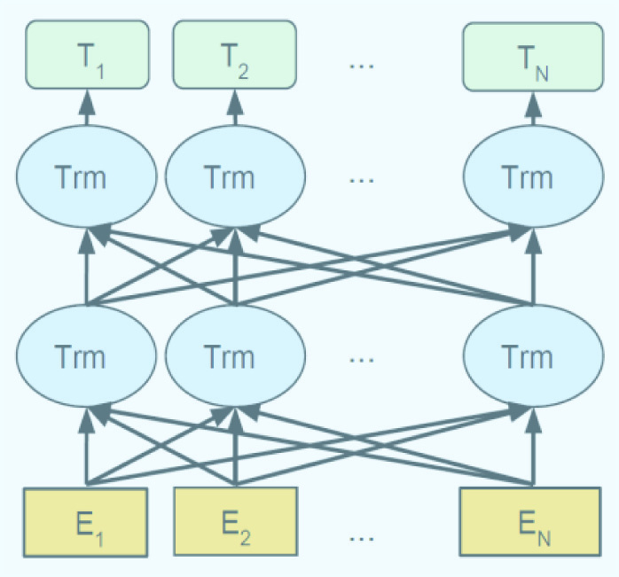
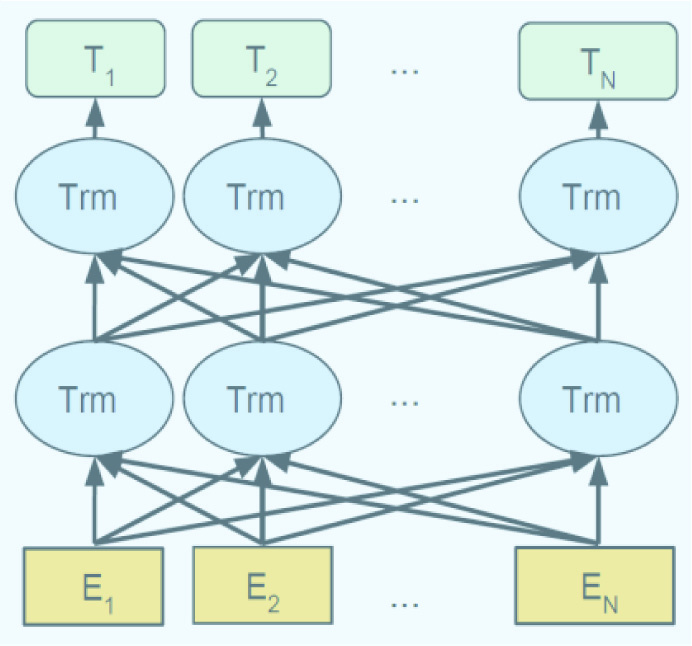

# BioBERT: предобученная модель представления биомедицинского языка, предназначенная для анализа биомедицинских текстов.

> **Неофициальный перевод.** Оригинал: Jinhyuk Lee, Wonjin Yoon, Sungdong Kim, Donghyeon Kim, Sunkyu Kim, Chan Ho So, Jaewoo Kang. «BioBERT: a pre-trained biomedical language representation model for biomedical text mining». Bioinformatics, 2020. DOI: [10.1093/bioinformatics/btz682](https://doi.org/10.1093/bioinformatics/btz682). Лицензия: CC BY 4.0.

## Аннотация

Биомедицинский текстовый анализ приобретает всё большее значение по мере стремительного увеличения числа биомедицинских документов. Благодаря прогрессу в области обработки естественного языка (ОЕЯ) извлечение полезной информации из биомедицинской литературы стало популярным направлением среди исследователей; кроме того, глубокое обучение способствовало разработке эффективных моделей для биомедицинского текстового анализа. Однако прямое применение достижений в области ОЕЯ к задачам биомедицинского текстового анализа зачастую даёт неудовлетворительные результаты из-за смещения распределения слов в корпусах общедоменного типа по сравнению с биомедицинскими корпусами. В данной статье мы исследуем, как недавно разработанная предобученная языковая модель BERT может быть адаптирована для использования в биомедицинских корпусах.

Мы представляем модель BioBERT (Bidirectional Encoder Representations from Transformers for Biomedical Text Mining; двунаправленные представления кодировщика на основе трансформеров для биомедицинского текстового анализа) — специализированную модель представления языка, прошедшую предобучение (pre-training) на крупномасштабных биомедицинных корпусах. Обладая практически идентичной архитектурой для всех задач, BioBERT значительно превосходит BERT и ранее существовавшие модели передового уровня в различных задачах биомедицинского текстового анализа после предобучения на биомедицинных корпусах. Хотя показатели работы BERT сопоставимы с показателями моделей передового уровня, BioBERT существенно их превосходит в следующих трех типичных задачах биомедицинского текстового анализа: распознавании именованных сущностей в биомедицинском тексте (улучшение показателя F1 на 0.62% %), извлечении биомедицинских отношений (улучшение показателя F1 на 2.80% %) и ответах на биомедицинские вопросы (улучшение показателя MRR на 12.24% %). Результаты нашего анализа свидетельствуют о том, что предобучение (pre-training) BERT на биомедицинных корпусах способствует лучшему пониманию ею сложных биомедицинских текстов.

Мы предоставляем свободный доступ к предобученным весам модели BioBERT по адресу [https://github.com/naver/biobert-pretrained](https://github.com/naver/biobert-pretrained), а также к исходному коду для дообучения (fine-tuning) модели BioBERT по адресу [https://github.com/dmis-lab/biobert](https://github.com/dmis-lab/biobert).

## 1 Введение

Объем биомедицинской литературы продолжает стремительно расти. В среднем ежедневно публикуется более 3000 новых статей в рецензируемых журналах, не считая препринтов и технических отчетов, таких как отчеты о клинических испытаниях в различных архивах. По состоянию на январь 2019 года в базе данных PubMed насчитывалось в общей сложности 29 миллионов статей. В уже огромный массив литературы постоянно добавляются отчеты, содержащие ценную информацию о новых открытиях и выводах. Вследствие этого растет спрос на точные инструменты для текстового анализа в биомедицине, позволяющие извлекать информацию из этой литературы.

Недавний прогресс в разработке моделей для биомедицинского текстового анализа стал возможен благодаря достижениям в области методов глубокого обучения, применяемых в обработке естественного языка (ОЕЯ). Например, модели типа Long Short-Term Memory (LSTM) и Conditional Random Field (CRF) за последние несколько лет значительно повысили эффективность распознавания именованных сущностей в биомедицинском контексте ([Giorgi and Bader, 2018]; [Habibi et al., 2017]; [Wang et al., 2018]; [Yoon et al., 2019]). Другие модели, основанные на глубоком обучении, также способствовали улучшению результатов в таких задачах биомедицинского текстового анализа, как извлечение отношений между сущностями (ИО) ([Bhasuran and Natarajan, 2018]; [Lim and Kang, 2018]) и ответы на вопросы (ОВ) ([Wiese et al., 2017]).

Однако прямое применение передовых методов обработки естественного языка к задачам анализа биомедицинских текстов сопряжено с определенными трудностями. Во-первых, поскольку современные модели представления слов, такие как Word2Vec ([Mikolov et al., 2013]), ELMo ([Peters et al., 2018]) и BERT ([Devlin et al., 2019]), обучаются и тестируются в основном на наборах данных, содержащих тексты из общей области (например, Википедия), бывает сложно оценить их эффективность при работе с биомедицинскими текстами. Кроме того, распределения слов в общих и биомедицинских корпусах существенно различаются, что часто создает проблемы для моделей анализа биомедицинских текстов. Вследствие этого современные модели в данной области в значительной степени опираются на адаптированные версии представлений слов ([Habibi et al., 2017]; [Pyysalo et al., 2013]).

В данном исследовании мы выдвигаем гипотезу о том, что современные модели представления слов, такие как BERT, должны обучаться на биомедицинских корпусах, чтобы быть эффективными в задачах текстового анализа в биомедицине. Ранее модель Word2Vec, являющаяся одной из наиболее известных моделей представления слов, не зависящих от контекста, обучалась на биомедицинских корпусах, содержащих термины и выражения, обычно отсутствующие в корпусах общего назначения ([Pyysalo et al., 2013]). Хотя ELMo и BERT продемонстрировали эффективность контекстно-зависимых представлений слов, они не способны показать высокую производительность на биомедицинских корпусах, поскольку были предварительно обучены лишь на корпусах общего назначения. Поскольку BERT демонстрирует выдающиеся результаты в различных задачах обработки естественного языка, используя практически одну и ту же архитектуру, адаптация BERT под нужды биомедицинской сферы может оказаться полезной для множества исследований в этой области.

## 2 Подход

В данной статье мы представляем модель BioBERT – предобученную языковую модель представления для биомедицинской области. Процесс предобучения и дообучения модели BioBERT описан на рисунке Figure 1. Сначала мы инициализируем параметры модели BioBERT с помощью весов из модели BERT, которая была предобучена на корпусах общедоменного характера (англоязычная Википедия и BooksCorpus). Затем модель BioBERT проходит предобучение на биомедицинских корпусах (аннотации из PubMed и полнотекстовые статьи из PMC). Для демонстрации эффективности нашего подхода в задачах анализа биомедицинских текстов модель BioBERT подвергается дообучению и тестируется на трех популярных задачах: распознавание именованных сущностей, извлечение отношений между сущностями и вопросно-ответный анализ. Мы испытываем различные стратегии предобучения, используя разные комбинации и объемы корпусов общедоменного и биомедицинского характера, а также анализируем влияние каждого корпуса на процесс предобучения. Кроме того, мы проводим подробный анализ моделей BERT и BioBERT, чтобы обосновать необходимость применения предложенных нами стратегий предобучения.

**Рис. 1..** Обзор процессов предобучения и дообучения для BioBERT

Вклад нашей работы заключается в следующем: BioBERT представляет собой первую модель типа BERT, прошедшую предобучение на биомедицинских корпусах в течение 23 дней на восьми графических процессорах NVIDIA V100. Мы показываем, что предобучение BERT на биомедицинских данных значительно повышает его эффективность. Модель BioBERT демонстрирует более высокие значения метрики F1 в задачах биомедицинской идентификации именованных сущностей (**0.62**) и биомедицинской отношений между сущностями (**2.80**), а также более высокий показатель MRR (**12.24**) в задачах биомедицинского вопросно-ответного взаимодействия по сравнению с существующими передовыми моделями. В отличие от большинства ранее разработанных моделей для обработки биомедицинского текста, ориентированных в основном на одну конкретную задачу (например, идентификацию сущностей или ответы на вопросы), наша модель BioBERT достигает передовых результатов в различных задачах анализа биомедицинского текста, при этом требуя лишь минимальных изменений в своей архитектуре. Мы публикуем подготовленные нами наборы данных, предобученные веса модели BioBERT, а также исходный код для дообучения BioBERT.

## 3 Материалы и методы

BioBERT по своей структуре практически идентичен BERT. Мы кратко рассмотрим недавно предложенный BERT, а затем подробно опишем процесс предобучения и дообучения модели BioBERT.

### 3.1 BERT: двунаправленные представления кодировщика на основе трансформеров

Получение векторных представлений слов на основе большого объема неаннотированного текста является давно известным методом. Если ранее модели (например, Word2Vec ([Mikolov et al., 2013]), GloVe ([Pennington et al., 2014])) ориентировались на формирование контекстно-независимых представлений слов, то в последнее время исследования сместились в сторону создания контекстно-зависимых представлений. Например, ELMo ([Peters et al., 2018]) использует двунаправленную языковую модель, а CoVe ([McCann et al., 2017]) применяет машинный перевод для включения контекстной информации в векторные представления слов.

BERT ([Devlin et al., 2019]) представляет собой модель контекстуализированных словесных представлений, основанную на маскированной языковой модели и предварительно обученную с использованием двунаправленных трансформеров ([Vaswani et al., 2017]). В силу особенностей задачи моделирования языка, при которой недопустимо использование информации о будущих словах, предыдущие модели ограничивались комбинацией двух однонаправленных языковых моделей (то есть слева направо и справа налево). BERT использует маскированную языковую модель, предсказывающую случайно замаскированные слова в последовательности; благодаря этому она позволяет формировать двунаправленные представления слов. Кроме того, данная модель демонстрирует передовые результаты в большинстве задач обработки естественного языка, требуя при этом минимальных изменений в архитектуре под конкретную задачу. По утверждению авторов BERT, включение информации из двунаправленных представлений, а не из однонаправленных, играет ключевую роль в адекватном описании слов в естественном языке. Мы предполагаем, что подобные двунаправленные представления также имеют решающее значение для анализа биомедицинских текстов, поскольку в таких корпусах часто встречаются сложные взаимосвязи между биомедицинскими терминами ([Krallinger et al., 2017]). Ввиду ограничений по объему мы отсылаем читателей к [Devlin et al. (2019)] за более подробным описанием модели BERT.

### 3.2 Предобучение BioBERT

BERT представляет собой универсальную модель языкового представления, прошедшую **предобучение** на текстах английской Википедии и BooksCorpus. Однако в текстах из области биомедицины встречается множество специфических собственных имён (например, BRCA1, c.248T>C) и терминов (например, *transcriptional*, *antimicrobial*), понятных в основном специалистам в данной области. Вследствие этого модели обработки естественного языка, предназначенные для общих задач понимания языка, часто демонстрируют низкую эффективность при анализе биомедицинских текстов. В данной работе мы проводим предобучение BioBERT на аннотациях из базы данных PubMed и полнотекстовых статьях из PubMed Central (PMC). Корпуса текстов, использованные для предобучения BioBERT, перечислены в Table 1; проверенные комбинации таких корпусов указаны в Table 2. Для повышения вычислительной эффективности, когда для предобучения применялись корпусы Wiki и BooksCorpus, мы инициализировали BioBERT с помощью предварительно обученной модели BERT, предоставленной [Devlin et al. (2019)]. Мы определяем BioBERT как модель языкового представления, для предобучения которой используются биомедицинские корпусы текстов (например, BioBERT в сочетании с PubMed).

Для токенизации BioBERT использует метод токенизации WordPiece ([Wu et al., 2016]), позволяющий устранять проблему отсутствия слов в словаре. При применении токенизации WordPiece любые новые слова могут быть представлены с помощью часто встречающихся подслов (например, *Immunoglobulin* преобразуется в *I ##mm ##uno ##g ##lo ##bul ##in*). Мы установили, что использование словаря с сохранением регистра букв (без перевода текста в нижний регистр) дает незначительно лучшие результаты при решении прикладных задач (downstream task). Хотя мы могли бы создать новый словарь WordPiece на основе биомедицинских корпусов, мы предпочли использовать исходный словарь BERT`BASE` по следующим причинам: (i) обеспечивается совместимость BioBERT с BERT, что позволяет повторно использовать модели BERT, предварительно обученные на корпусах общего назначения, а также упрощает взаимозаменяемое применение существующих моделей, основанных на BERT и BioBERT; (ii) любые новые слова по-прежнему могут быть представлены и дообучены для биомедицинской области с помощью исходного словаря WordPiece от BERT.

### 3.3 Дообучение BioBERT

При минимальных изменениях в архитектуре модель BioBERT может применяться к различным последующим задачам текстового анализа. Мы проводим дообучение модели BioBERT на трех типичных задачах биомедицинского текстового анализа: распознавание именованных сущностей (РИС), извлечение отношений (ИО) и вопросно-ответный анализ (ВОА).

*Named* и *e**ntity* *r**ecognition* представляют собой одну из самых фундаментальных задач биомедицинского текстового анализа; их суть заключается в распознавании множества специфических для данной области собственных имён в биомедицинских корпусах текстов. В то время как большинство предыдущих работ опирались на различные комбинации LSTM и CRF ([Giorgi and Bader, 2018]; [Habibi et al., 2017]; [Wang et al., 2018]), архитектура BERT отличается своей простотой и основана на двунаправленных трансформерах. В модели BERT используется единственный выходной слой, применяющий представления из последнего слоя модели для расчёта вероятностей на уровне отдельных токенов в формате BIO2. Следует отметить, что в ранее проводившихся исследованиях в области биомедицинской NER часто применялись векторные представления слов, обученные на корпусах PubMed или PMC ([Habibi et al., 2017]; [Yoon et al., 2019]); в отличие от них, модель BioBERT самостоятельно формирует такие векторные представления WordPiece в процессе как предобучения, так и дообучения. Для оценки результатов выполнения задачи NER мы использовали точность, полноту и F1-оценку на уровне отдельных сущностей.

Задача *Relation* *e**извлечения* заключается в классификации отношений между именованными сущностями в биомедицинском корпусе. Мы использовали классификатор предложений из исходной версии модели BERT; данный классификатор применяет токен [CLS] для определения отношений между сущностями. Классификация предложений осуществляется посредством единого выходного слоя, опирающегося на представление токена [CLS], полученное от модели BERT. Для анонимизации целевых именованных сущностей в предложениях использовались заранее определенные теги, такие как ＠GENE$ или ＠DISEASE$. Например, предложение, содержащее две целевые сущности (ген и заболевание), выглядит так: «*Серин в позиции 986 у ＠GENE$ может служить независимым генетическим предиктором развития ангиографического ＠DISEASE$*». В работе приводятся показатели точности, полноты и значения F1 для данной задачи классификации отношений.

*Question* *a* *Ответы* представляют собой задачу формулирования ответов на вопросы, заданные на естественном языке, на основе предоставленных текстов. Для дообучения BioBERT в контексте задач вопросно-ответной системы мы использовали ту же архитектуру BERT, что и при предобучении SQuAD ([Rajpurkar et al., 2016]). В качестве источника данных применялись наборы данных BioASQ, поскольку их формат схож с форматом SQuAD. Вероятности на уровне токенов, соответствующие начальной и конечной позициям фраз-ответов, рассчитываются с помощью единого выходного слоя. Однако было установлено, что примерно в 30% случаев вопросы из наборов BioASQ невозможно было ответить в рамках экстрактивного подхода, так как точные ответы отсутствовали в исходных текстах. Подобно [Wiese et al. (2017)], мы исключили из обучающих наборов примеры с такими неразрешимыми вопросами. Кроме того, мы применили тот же процесс предобучения, что и в случае [Wiese et al. (2017)], при этом использовался SQuAD; данный подход значительно повысил эффективность как BERT, так и BioBERT. Для оценки результатов применялись следующие метрики из набора BioASQ: строгая точность, снисходительная точность и средний обратный ранг.

## 4 Результаты

### 4.1 Наборы данных

Статистические данные по наборам данных для задачи NER в биомедицине приведены в Table 3. Мы использовали предварительно обработанные версии всех наборов данных для задачи NER, предоставленных [Wang et al. (2018)], за исключением наборов данных i2b2/VA 2010 года, JNLPBA и Species-800. В предварительно обработанном наборе данных NCBI Disease количество аннотаций меньше, чем в исходном наборе, поскольку из его обучающего множества были удалены дублирующиеся статьи. Для предварительной обработки наборов данных i2b2/VA 2010 года и JNLPBA мы применили формат CoNLL ([https://github.com/spyysalo/standoff2conll](https://github.com/spyysalo/standoff2conll)). Набор данных Species-800 был предварительно обработан и разделен в соответствии с методикой, описанной в работе Pyysalo ([https://github.com/spyysalo/s800](https://github.com/spyysalo/s800)). Для набора данных BC2GM мы не использовали альтернативные аннотации; все оценки эффективности методов NER основывались на точном совпадении сущностей на уровне отдельных элементов. Следует отметить, что, хотя в последнее время появилось множество других качественных наборов данных для задачи NER в биомедицине ([Mohan and Li, 2019]), мы выбрали те, которые широко применяются исследователями в области биомедицинской обработки естественного языка; это значительно упрощает сопоставление наших результатов с их результатами. Наборы данных для задачи RE содержат информацию о взаимосвязях между генами и заболеваниями, а также между белками и химическими веществами (Table 4). Предварительно обработанные наборы данных GAD и EU-ADR доступны вместе с нашими программными кодами. Для набора данных CHEMPROT мы применили ту же процедуру предварительной обработки, что и описано в [Lim and Kang (2018)]. Мы использовали фактоидные наборы данных BioASQ; их можно привести к тому же формату, что и набор данных SQuAD (Table 5). В работе применялись полные аннотации статей (PMID) а также соответствующие вопросы и ответы, предоставленные организаторами BioASQ. Предварительно обработанные наборы данных BioASQ были выложены в открытый доступ. Для всех наборов данных мы использовали те же разбиения на подмножества, что и в предыдущих исследованиях ([Lim and Kang, 2018]; [Tsatsaronis et al., 2015]; [Wang et al., 2018]), чтобы обеспечить корректное сравнение результатов; однако разбиения для наборов данных LINAAEUS и Species-800 не удалось найти в источнике [Giorgi and Bader (2018)], поэтому они могут отличаться. Подобно предыдущим работам ([Bhasuran and Natarajan, 2018]), для наборов данных, не имеющих отдельного тестового множества (например, GAD, EU-ADR), мы приводили результаты 10-кратной перекрестной проверки.

Мы сравниваем BERT и BioBERT с современными передовыми моделями и приводим их показатели. Следует отметить, что каждая из передовых моделей обладает своей архитектурой и процедурой обучения. Например, передовая модель, разработанная [Yoon et al. (2019)] и обученная на наборе данных JNLPBA, основана на нескольких моделях типа Bi-LSTM CRF с CNN на уровне символов; в то же время передовая модель, разработанная [Giorgi and Bader (2018)] и обученная на наборе данных LINNAEUS, использует модель типа Bi-LSTM CRF с LSTM на уровне символов и дополнительно обучается на наборах данных серебряного стандарта. С другой стороны, BERT и BioBERT имеют абсолютно одинаковую структуру и используют лишь наборы данных золотого стандарта, без каких-либо дополнительных наборов.

### 4.2 Экспериментальные установки

Мы использовали модель BERT`BASE`, предобученную на английской Википедии и BooksCorpus в течение 1M шагов. BioBERT v1.0 (+ PubMed + PMC) — это версия BioBERT (+ PubMed + PMC), обученная за 470 K шагов. При использовании корпусов PubMed и PMC мы установили, что оптимальны 200K шагов для PubMed и 270K для PMC. Мы также использовали упрощённые версии BioBERT v1.0, предобученные только на PubMed за 200K шагов (BioBERT v1.0 (+ PubMed)) и только на PMC за 270K шагов (BioBERT v1.0 (+ PMC)). После первого выпуска BioBERT v1.0 мы предобучили BioBERT на PubMed за 1M шагов; эту версию называем BioBERT v1.1 (+ PubMed). Прочие гиперпараметры (размер пакета, расписание learning rate) при предобучении BioBERT совпадают с параметрами для BERT, если не указано иное.

Мы предобучали BioBERT с помощью Naver Smart Machine Learning (NSML) ([Sung et al., 2017]), которая используется для масштабных экспериментов на нескольких GPU. Для предобучения мы использовали восемь NVIDIA V100 (32GB). Максимальная длина последовательности была фиксирована на 512, размер мини-пакета — 192, что даёт 98 304 слова за итерацию. В этой конфигурации предобучение BioBERT v1.0 (+ PubMed + PMC) занимает более 10 дней, а BioBERT v1.1 (+ PubMed) — почти 23 дня. Несмотря на все усилия использовать BERT`LARGE`, из-за вычислительной сложности BERT`LARGE` мы применяли только BERT`BASE`.

Для проведения дообучения BioBERT по каждой задаче мы использовали один GPU NVIDIA Titan Xp (объем памяти 12 ГБ). Следует отметить, что процесс дообучения требует меньше вычислительных ресурсов, чем предобучение BioBERT. При дообучении выбирался размер пакета данных, равный 10, 16, 32 или 64, а также скорость обучения на уровне 5e−5, 3e−5 или 1e−5. Дообучение BioBERT для задач вопросно-ответной системы и распознавания отношений заняло менее часа, поскольку объем обучающих данных значительно меньше, чем в случае с данными, использованными [Devlin et al. (2019)]. В то же время для достижения максимальной производительности на наборах данных по распознаванию именованных сущностей BioBERT требуется более 20 эпох.

### 4.3 Результаты экспериментов

Результаты, полученные при применении метода распознавания именованных сущностей, представлены в Table 6. Во-первых, мы отмечаем, что BERT, предварительно обученный лишь на корпусе общедоменного типа, демонстрирует достаточно высокую эффективность; однако значение микросреднего показателя F1 для BERT оказалось ниже (на 2.01 пункта) по сравнению с передовыми моделями. С другой стороны, BioBERT показывает более высокие результаты, чем BERT, на всех наборах данных. BioBERT превзошел передовые модели на шести из девяти наборов данных; кроме того, BioBERT v1.1 (+ PubMed) превзошел такие модели по значению микросреднего показателя F1 на 0.62 пункта. Относительно низкие результаты на наборе данных LINNAEUS обусловлены следующими причинами: (i) отсутствием серебряного стандарта набора данных для обучения ранее разработанных передовых моделей и (ii) использованием в предыдущих исследованиях иных разбиений обучающих и тестовых выборок ([Giorgi and Bader, 2018]), которые в настоящее время недоступны.

Результаты по задаче распознавания отношений между сущностями для каждой модели представлены на Table 7. Модель BERT продемонстрировала лучшие показатели, чем современные модели, на наборе данных CHEMPROT, что подтверждает её эффективность в решении данной задачи. В среднем (по метрике микро-F1) модель BioBERT v1.0 (+ PubMed) показала более высокий балл (на 2.80 выше), чем другие современные модели. Кроме того, модель BioBERT достигла наивысших значений F1 на двух из трёх биомедицинских наборов данных.

Результаты вопросно-ответных тестов представлены в Table 8. Мы рассчитали микросреднее значение наилучших показателей моделей передового уровня в каждой группе. BERT продемонстрировал более высокий микросредний показатель MRR (на 7.0 выше, чем у моделей передового уровня). Все версии BioBERT значительно превзошли по эффективности как BERT, так и модели передового уровня; в частности, BioBERT v1.1 (+ PubMed) показал точность 38.77 при строгих критериях, точность 53.81 при более мягких критериях и средний показатель взаимно-обратного ранжирования 44.77; все эти значения были рассчитаны методом микросреднего. На всех биомедицинских наборах данных для вопросно-ответных тестов BioBERT продемонстрировал новые рекордные результаты с точки зрения показателя MRR.

## 5 Обсуждение

Мы использовали дополнительные корпуса различного размера для **предобучения** и изучили их влияние на качество модели. Для BioBERT v1.0 (+ PubMed) мы установили количество шагов предобучения на уровне 200 тысяч и изменяли размер корпуса PubMed. На графике Figure 2(a) показано, как качество работы BioBERT v1.0 (+ PubMed) на трех наборах данных для задач распознавания именованных сущностей (NCBI Disease, BC2GM, BC4CHEMD) зависит от размера корпуса PubMed. Предобучение на объеме в 1 миллиард слов оказывается весьма эффективным; качество модели на каждом наборе данных в основном улучшается вплоть до объема в 4.5 миллиарда слов. Мы также сохраняли веса модели после различных этапов предобучения для BioBERT v1.0 (+ PubMed), чтобы оценить, как количество шагов предобучения влияет на результаты **дообучения**. График Figure 2(b) демонстрирует изменения качества работы BioBERT v1.0 (+ PubMed) на тех же трех наборах данных в зависимости от числа шагов предобучения. Полученные результаты однозначно свидетельствуют о том, что качество модели на каждом наборе данных возрастает по мере увеличения числа шагов предобучения. Наконец, на графике Figure 2(c) показано абсолютное улучшение показателей работы BioBERT v1.0 (+ PubMed + PMC) по сравнению с BERT на всех 15 наборах данных. Для задач распознавания именованных сущностей и отношений между сущностями использовались оценки F1, а для задач вопросно-ответной системы — оценки MRR. Использование BioBERT значительно повышает качество работы модели на большинстве наборов данных.

**Рис. 2..** (**a**) Влияние размера корпуса PubMed на предобучение. (**b**) Качество NER у BioBERT на разных чекпоинтах. (**c**) Прирост качества BioBERT v1.0 (+ PubMed + PMC) относительно BERT

Как видно на Table 9, мы сформировали выборку предсказаний от моделей BERT и BioBERT версии v1.1 (+PubMed), чтобы изучить влияние предобучения на решение прикладных задач. Модель BioBERT способна распознавать биомедицинские именованные сущности, чего не может сделать BERT; кроме того, она определяет точные границы этих сущностей. Хотя BERT зачастую дает неверные ответы на простые биомедицинские вопросы, BioBERT выдает на них корректные ответы. Кроме того, BioBERT способна возвращать в качестве ответов более длинные именованные сущности.

## 6 Заключение

В данной статье мы представили BioBERT — модель представления языка, прошедшую предобучение для анализа биомедицинских текстов. Мы продемонстрировали, что предобучение BERT на биомедицинских корпусах имеет решающее значение для его применения в данной области. При минимальных изменениях в архитектуре, специфичных для конкретной задачи, BioBERT превосходит ранее существовавшие модели в таких задачах анализа биомедицинских текстов, как выделение именованных сущностей, распознавание отношений между сущностями и вопросно-ответная задача.

Предварительная версия BioBERT (январь 2019 г.) уже продемонстрировала высокую эффективность при решении множества задач по анализу биомедицинских текстов, таких как распознавание именованных сущностей в клинических записях ([Alsentzer et al., 2019]), распознавание отношений между фенотипами и генами у человека ([Sousa et al., 2019]) и распознавание временных отношений в клинических текстах ([Lin et al., 2019]). В дальнейшем для сообщества bioNLP станут доступны следующие обновленные версии BioBERT: (i) BioBERT`BASE` и BioBERT`LARGE`, обученные исключительно на аннотациях из PubMed без предварительной инициализации на основе существующей модели BERT; а также (ii) BioBERT`BASE` и BioBERT`LARGE`, обученные с использованием специализированного словаря, составленного на основе WordPiece.

## Финансирование

Данное исследование проводилось при поддержке Национального исследовательского фонда Кореи (NRF), финансируемого правительством Республики Корея (NRF-2017R1A2A1A17069645, NRF-2017M3C4A7065887, NRF-2014M3C9A3063541).

## Список литературы

AlsentzerE. et al (2019) Publicly available clinical bert embeddings. In: Proceedings of the 2nd Clinical Natural Language Processing Workshop, Minneapolis, MN, USA. pp. 72–78. Association for Computational Linguistics. https://www.aclweb.org/anthology/W19-1909.
BhasuranB., NatarajanJ. (2018) Automatic extraction of gene-disease associations from literature using joint ensemble learning. PLoS One, 13, e0200699. doi:10.1371/journal.pone.0200699
BravoÀ. et al (2015) Extraction of relations between genes and diseases from text and large-scale data analysis: implications for translational research. BMC Bioinformatics, 16, 55. doi:10.1186/s12859-015-0472-9
DevlinJ. et al (2019) Bert: pre-training of deep bidirectional transformers for language understanding. In: Proceedings of the 2019 Conference of the North American Chapter of the Association for Computational Linguistics: Human Language Technologies, Volume 1 (Long and Short Papers), Minneapolis, MN, USA. pp. 4171–4186. Association for Computational Linguistics. https://www.aclweb.org/anthology/N19-1423.
DoğanR.I. et al (2014) NCBI disease corpus: a resource for disease name recognition and concept normalization. J. Biomed. Inform., 47, 1–10. doi:10.1016/j.jbi.2013.12.006
GernerM. et al (2010) Linnaeus: a species name identification system for biomedical literature. BMC Bioinformatics, 11, 85. doi:10.1186/1471-2105-11-85
GiorgiJ.M., BaderG.D. (2018) Transfer learning for biomedical named entity recognition with neural networks. Bioinformatics, 34, 4087. doi:10.1093/bioinformatics/bty449
HabibiM. et al (2017) Deep learning with word embeddings improves biomedical named entity recognition. Bioinformatics, 33, i37–i48. doi:10.1093/bioinformatics/btx228
KimJ.-D. et al (2004) Introduction to the bio-entity recognition task at JNLPBA In: Proceedings of the International Joint Workshop on Natural Language Processing in Biomedicine and its Applications (NLPBA/BioNLP), Geneva, Switzerland pp. 73–78. COLING. https://www.aclweb.org/anthology/W04-1213.
KrallingerM. et al (2015) The chemdner corpus of chemicals and drugs and its annotation principles. J. Cheminform., 7. doi:10.1186/1758-2946-7-S1-S2
KrallingerM. et al (2017) Overview of the BioCreative VI chemical-protein interaction track. In: Proceedings of the BioCreative VI Workshop, Bethesda, MD, USA, pp. 141–146. https://academic.oup.com/database/article/doi/10.1093/database/bay073/5055578.
LiJ. et al (2016) Biocreative V CDR task corpus: a resource for chemical disease relation extraction. Database, 2016. doi:10.1093/database/baw068
LimS., KangJ. (2018) Chemical–gene relation extraction using recursive neural network. Database, 2018. doi:10.1093/database/bay060
LinC. et al (2019) A bert-based universal model for both within-and cross-sentence clinical temporal relation extraction. In: Proceedings of the 2nd Clinical Natural Language Processing Workshop, Minneapolis, MN, USA. pp. 65–71. Association for Computational Linguistics. https://www.aclweb.org/anthology/W19-1908.
LouY. et al (2017) A transition-based joint model for disease named entity recognition and normalization. Bioinformatics, 33, 2363–2371. doi:10.1093/bioinformatics/btx172
LuoL. et al (2018) An attention-based BiLSTM-CRF approach to document-level chemical named entity recognition. Bioinformatics, 34, 1381–1388. doi:10.1093/bioinformatics/btx761
McCannB. et al (2017) Learned in translation: contextualized word vectors. In: Guyon,I. et al. (eds.), Advances in Neural Information Processing Systems 30, Curran Associates, Inc., pp. 6294–6305. http://papers.nips.cc/paper/7209-learned-in-translation-contextualized-word-vectors.pdf.
MikolovT. et al (2013) Distributed representations of words and phrases and their compositionality. In: Burges,C.J.C. (eds.), Advances in Neural Information Processing Systems 26, Curran Associates, Inc., pp. 3111–3119. http://papers.nips.cc/paper/5021-distributed-representations-of-words-and-phrases-and-their-compositionality.pdf.
MohanS., LiD. (2019) Medmentions: a large biomedical corpus annotated with UMLS concepts. arXiv preprint arXiv: 1902.09476.
PafilisE. et al (2013) The species and organisms resources for fast and accurate identification of taxonomic names in text. PLoS One, 8, e65390. doi:10.1371/journal.pone.0065390
PenningtonJ. et al (2014) Glove: Global vectors for word representation. In: Proceedings of the 2014 Conference on Empirical Methods in Natural Language Processing (EMNLP), Doha, Qatar. pp. 1532–1543. Association for Computational Linguistics. https://www.aclweb.org/anthology/D14-1162.
PetersM.E. et al (2018) Deep contextualized word representations. In: Proceedings of the 2018 Conference of the North American Chapter of the Association for Computational Linguistics: Human Language Technologies, Volume 1 (Long Papers), New Orleans, LA pp. 2227–2237. Association for Computational Linguistics. https://www.aclweb.org/anthology/N18-1202.
PyysaloS. et al (2013) Distributional semantics resources for biomedical text processing. In: Proceedings of the 5th International Symposium on Languages in Biology and Medicine, Tokyo, Japan, pp. 39–43. https://academic.oup.com/bioinformatics/article/33/14/i37/3953940.
RajpurkarP. et al (2016) Squad: 100,000+ questions for machine comprehension of text. In: Proceedings of the 2016 Conference on Empirical Methods in Natural Language Processing, Austin, TX pp. 2383–2392. Association for Computational Linguistics. https://www.aclweb.org/anthology/D16-1264.
SachanD.S. et al (2018) Effective use of bidirectional language modeling for transfer learning in biomedical named entity recognition. In: Finale,D.-V. et al. (eds.), Proceedings of Machine Learning Research, Palo Alto, CA, Vol. 85, pp. 383–402. PMLR. http://proceedings.mlr.press/v85/sachan18a.html.
SmithL. et al (2008) Overview of biocreative ii gene mention recognition. Genome Biol., 9, S2. doi:10.1186/gb-2008-9-s2-s2
SousaD. et al (2019) A silver standard corpus of human phenotype-gene relations. In: Proceedings of the 2019 Conference of the North American Chapter of the Association for Computational Linguistics: Human Language Technologies, Volume 1 (Long and Short Papers), Minneapolis, MN. pp. 1487–1492. Association for Computational Linguistics. https://www.aclweb.org/anthology/N19-1152.
SungN. et al (2017) NSML: A machine learning platform that enables you to focus on your models. arXiv preprint arXiv: 1712.05902.
TsatsaronisG. et al (2015) An overview of the BIOASQ large-scale biomedical semantic indexing and question answering competition. BMC Bioinformatics, 16, 138. doi:10.1186/s12859-015-0564-6
UzunerÖ. et al (2011) 2010 i2b2/VA challenge on concepts, assertions, and relations in clinical text. J. Am. Med. Inform. Assoc., 18, 552–556. doi:10.1136/amiajnl-2011-000203
Van MulligenE.M. et al (2012) The EU-ADR corpus: annotated drugs, diseases, targets, and their relationships. J. Biomed. Inform., 45, 879–884. doi:10.1016/j.jbi.2012.04.004
VaswaniA. et al (2017) Attention is all you need. In: Guyon,I. et al. (eds.), Advances in Neural Information Processing Systems, pp. 5998–6008. Curran Associates, Inc. http://papers.nips.cc/paper/7181-attention-is-all-you-need.pdf.
WangX. et al (2018) Cross-type biomedical named entity recognition with deep multi-task learning. Bioinformatics, 35, 1745–1752. doi:10.1093/bioinformatics/bty869
WieseG. et al (2017) Neural domain adaptation for biomedical question answering. In: Proceedings of the 21st Conference on Computational Natural Language Learning (CoNLL 2017), Vancouver, Canada pp. 281–289. Association for Computational Linguistics. https://www.aclweb.org/anthology/K17-1029.
WuY. et al (2016) Google’s neural machine translation system: Bridging the gap between human and machine translation. arXiv preprint arXiv: 1609.08144.
XuK. et al (2019) Document-level attention-based BiLSTM-CRF incorporating disease dictionary for disease named entity recognition. Comput. Biol. Med., 108, 122–132. doi:10.1016/j.compbiomed.2019.04.002
YoonW. et al (2019) Collabonet: collaboration of deep neural networks for biomedical named entity recognition. BMC Bioinformatics, 20, 249. doi:10.1186/s12859-019-2813-6
ZhuH. et al (2018) Clinical concept extraction with contextual word embedding. NIPS Machine Learning for Health Workshop http://par.nsf.gov/biblio/10098080.
