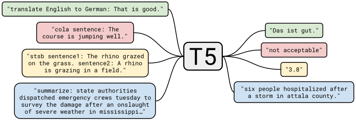
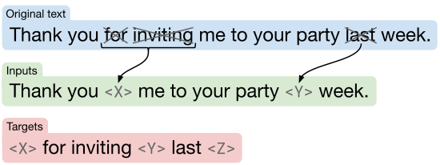
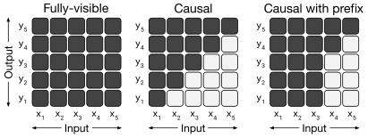
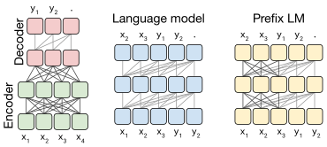
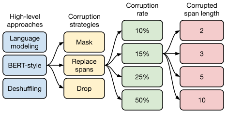
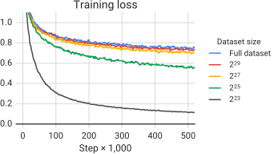

# Исследование пределов применимости трансферного обучения с использованием унифицированной текст-в-текст модели Transformer

> **Неофициальный перевод.** Оригинал: Colin Raffel, Noam Shazeer, Adam Roberts, Katherine Lee, Sharan Narang, Michael Matena, Yanqi Zhou, Wei Li, Peter J. Liu. «Exploring the Limits of Transfer Learning with a Unified Text-to-Text Transformer». JMLR, 2020. DOI: [10.48550/arXiv.1910.10683](https://doi.org/10.48550/arXiv.1910.10683). Лицензия: CC BY 4.0.

## Аннотация

Метод обучения с переносом знаний, при котором модель сначала проходит предобучение (pre-training) на задаче с большим объемом данных, а затем дообучается для решения какой-либо прикладной задачи (downstream task), стал мощным инструментом в области обработки естественного языка (NLP). Эффективность данного подхода способствовала появлению множества различных методик, методологий и практических решений. В данной работе мы анализируем различные техники обучения с переносом знаний в NLP, предлагая унифицированную схему, позволяющую привести все задачи обработки текста к формату «текст-в-текст». В ходе систематического исследования мы сравниваем цели предобучения, архитектуры моделей, наборы неразмеченных данных, способы переноса знаний и прочие факторы на десятках задач по пониманию языка. Опираясь на полученные результаты, а также используя наш новый масштабный корпус данных «Colossal Clean Crawled Corpus», мы добиваемся передовых показателей на множестве тестовых наборов, включая задачи суммаризации, ответов на вопросы и классификации текстов. Для содействия дальнейшим исследованиям в области обучения с переносом знаний в NLP мы публикуем наш набор данных, предобученные модели и исходный код.11 [https://github.com/google-research/text-to-text-transfer-transformer](https://github.com/google-research/text-to-text-transfer-transformer)

Колин Раффел, Ноам Шазир, Адам Робертс, Кэтрин Ли, Шаран Наранг, Майкл Матена, Яньци Чжоу, Вэй Ли и Питер Дж. Лю

## Введение

Для обучения модели машинного обучения выполнять задачи обработки естественного языка (ОЕЯ) часто требуется, чтобы модель могла обрабатывать текст таким образом, который благоприятствует последующему обучению. Это можно условно рассматривать как формирование универсальных знаний, позволяющих модели «понимать» текст. Эти знания могут быть как низкоуровневыми (например, правописание или значение слов), так и высокоуровневыми (например, тот факт, что туба слишком велика, чтобы поместиться в большинство рюкзаков). В современной практике машинного обучения такие знания редко предоставляются явно; вместо этого они часто извлекаются в процессе выполнения вспомогательной задачи. Например, традиционно распространенным подходом является использование векторов слов ([Mikolov et al., 2013b]; [Mikolov et al., 2013a]; [Pennington et al., 2014]) для сопоставления слов с непрерывным представлением, при котором по возможности похожие слова соответствуют похожим векторам. Эти векторы часто определяются с помощью целевой функции, которая, например, способствует тому, чтобы слова, часто встречающиеся вместе, располагались близко друг к другу в этом непрерывном пространстве ([Mikolov et al., 2013b]).

В последнее время всё чаще практикуется предобучение всей модели на задаче, для которой имеется большой объём данных. В идеале такое предобучение позволяет модели сформировать универсальные способности и знания, которые затем можно использовать при решении различных прикладных задач. В случае применения трансферного обучения в компьютерном зрении ([Oquab et al., 2014]; [Jia et al., 2014]; [Huh et al., 2016]; [Yosinski et al., 2014]) предобучение обычно осуществляется посредством обучения с учителем (supervised learning) на большом размеченном наборе данных, таком как ImageNet ([Russakovsky et al., 2015]; [Deng et al., 2009]). Напротив, современные методы трансферного обучения в области обработки естественного языка зачастую предполагают предобучение с использованием обучения без учителя на неразмеченных данных. Этот подход недавно позволил достичь передовых результатов во многих наиболее распространённых тестовых наборах для обработки естественного языка ([Devlin et al., 2018]; [Yang et al., 2019]; [Dong et al., 2019]; [Liu et al., 2019c]; [Lan et al., 2019]). Помимо высокой эффективности на практике, такой подход особенно привлекателен тем, что благодаря Интернету имеется огромное количество неразмеченных текстовых данных; например, проект Common Crawl22 [http://commoncrawl.org](http://commoncrawl.org) ежемесячно генерирует около 20 ТБ текстовой информации, извлечённой с веб-страниц. Это идеально подходит для нейронных сетей, у которых, как показано на практике, наблюдается высокая масштабируемость: часто удаётся добиться лучших результатов просто за счёт обучения более крупной модели на более большом наборе данных ([Hestness et al., 2017]; [Shazeer et al., 2017]; [Jozefowicz et al., 2016]; [Mahajan et al., 2018]; [Radford et al., 2019]; [Shazeer et al., 2018]; [Huang et al., 2018b]; [Keskar et al., 2019a]).

Данное взаимодействие послужило толчком к появлению множества исследований, посвященных разработке методологии трансферного обучения в области обработки естественного языка. В результате появился широкий спектр подходов к **предобучению** целей ([Howard and Ruder, 2018]; [Devlin et al., 2018]; [Yang et al., 2019]; [Dong et al., 2019]), наборов неразмеченных данных ([Yang et al., 2019]; [Liu et al., 2019c]; [Zellers et al., 2019]), тестовых наборов ([Wang et al., 2019b]; [Wang et al., 2018]; [Conneau and Kiela, 2018]), а также методов **дообучения (fine-tuning)** ([Howard and Ruder, 2018]; [Houlsby et al., 2019]; [Peters et al., 2019]) и прочего. Однако стремительный прогресс и многообразие техник в этой быстро развивающейся области затрудняют сравнение различных алгоритмов, выделение влияния новых разработок и понимание существующих подходов к трансферному обучению. Исходя из необходимости более глубокого анализа, мы применяем унифицированный подход к трансферному обучению, позволяющий систематически изучать различные методы и расширять текущие границы данной области.

Схема нашей текст-в-текст архитектуры. Любая рассматриваемая задача — будь то перевод, ответы на вопросы или классификация — сводится к подаче текста в качестве входных данных в нашу модель и обучению её генерировать требуемый выходной текст. Это позволяет нам использовать одну и ту же модель, функцию потерь, гиперпараметры и т. д. для всех задач. Кроме того, это создаёт единый тестовый стенд для методов, включённых в наше эмпирическое исследование. «T5» — это наша модель; мы называем её «**T**ext-**t**o-**T**ext **T**ransfer **T**ransformer».

Основная идея нашей работы заключается в том, чтобы рассматривать любую задачу обработки текста как задачу типа «текст-в-текст», то есть принимать текст на вход и выдавать новый текст в качестве результата. Этот подход обусловлен существованием ранее предложенных унифицирующих подходов к решению задач в области обработки естественного языка, включающих формулировку всех текстовых задач как задач на вопросно-ответное взаимодействие ([McCann et al., 2018]), моделирование языка ([Radford et al., 2019]) или извлечение нужных фрагментов текста [Keskar et al. (2019b)]. Ключевым преимуществом подхода «текст-в-текст» является возможность прямого применения одной и той же модели, функции потерь, процедуры обучения и алгоритма декодирования ко всем рассматриваемым задачам. Мы используем эту гибкость для оценки эффективности модели на широком спектре задач обработки английского языка, таких как вопросно-ответное взаимодействие, краткое изложение содержания документов и классификация тональности текстов. Благодаря такому унифицированному подходу мы можем сравнивать эффективность различных целей обучения с использованием трансферного обучения, наборов неразмеченных данных и прочих факторов; кроме того, мы исследуем пределы применимости трансферного обучения в обработке естественного языка путем увеличения размеров моделей и наборов данных сверх ранее использовавшихся значений.

Мы подчеркиваем, что наша цель — не предложение новых методов, а предоставление всестороннего обзора текущего состояния данной области. Соответственно, наша работа в основном включает обзор, исследование и эмпирическое сравнение существующих подходов. Мы также изучаем пределы применимости нынешних методов, масштабируя результаты нашего систематического исследования (обучая модели с количеством параметров до $11$ миллиардов), чтобы добиться передовых результатов во многих рассматриваемых задачах. Для проведения экспериментов в таком масштабе мы создали «Colossal Clean Crawled Corpus» (C4) — набор данных, содержащий сотни гигабайт очищенного английского текста, извлеченного из Интернета. Поскольку основная ценность трансферного обучения заключается в возможности использования предварительно обученных моделей в условиях нехватки данных, мы публикуем наш код, наборы данных и предварительно обученные модели.1

Далее в статье изложена следующая структура: в следующем разделе мы описываем нашу базовую модель и особенности её реализации, методику сведения любой задачи обработки текста к формату «текст-в-текст», а также перечень рассматриваемых задач. В Эксперименты приводится обширный набор экспериментов, посвящённых применению трансферного обучения в области обработки естественного языка. В конце этого раздела (Итоги и обобщение) мы, опираясь на результаты систематического исследования, достигаем передовых показателей на множестве стандартных тестов. Наконец, в Рефлексия приводится краткое резюме полученных результатов и обсуждаются перспективы дальнейших исследований.

## Подготовка

Прежде чем представить результаты нашего масштабного эмпирического исследования, мы рассмотрим необходимые предварительные сведения, позволяющие понять эти результаты, включая архитектуру модели Transformer и прикладные задачи, на которых мы проводили тестирование. Мы также описываем наш подход, позволяющий рассматривать любую задачу как задачу типа «текст-в-текст», а также наш корпус данных «Colossal Clean Crawled Corpus» (C4) — созданный на основе Common Crawl набор неразмеченных текстовых данных. Нашу модель и фреймворк мы называем «**Т**екст-**т**екстовый **Т**рансфер-**Т**рансформер» (T5).

### Модель

Первоначальные результаты применения трансферного обучения в области обработки естественного языка базировались на использовании рекуррентных нейронных сетей ([Peters et al., 2018]; [Howard and Ruder, 2018]), однако в последнее время всё чаще применяются модели, построенные на основе архитектуры «Transformer» ([Vaswani et al., 2017]). Архитектура Transformer изначально продемонстрировала свою эффективность в задачах машинного перевода, но впоследствии стала использоваться в самых различных областях обработки естественного языка ([Radford et al., 2018]; [Devlin et al., 2018]; [McCann et al., 2018]; [Yu et al., 2018]). Ввиду её всё большей распространённости все рассматриваемые нами модели построены на основе архитектуры Transformer. За исключением описанных ниже деталей и вариантов, исследуемых в Архитектуры, мы существенно не отходим от исходной реализации данной архитектуры. Вместо того чтобы давать исчерпывающее описание этой модели, мы направляем заинтересованных читателей к оригинальной статье ([Vaswani et al., 2017]) либо к последующим учебным материалам33 [http://nlp.seas.harvard.edu/2018/04/03/attention.html](http://nlp.seas.harvard.edu/2018/04/03/attention.html),44 [http://jalammar.github.io/illustrated-transformer/](http://jalammar.github.io/illustrated-transformer/), где представлено более подробное введение.

Основным конструктивным элементом модели Transformer является самовнимание ([Cheng et al., 2016]). Самовнимание (self-attention) представляет собой разновидность механизма внимания ([Graves, 2013]; [Bahdanau et al., 2015]), при котором каждый элемент последовательности заменяется взвешенным средним значением остальных элементов этой последовательности. Первоначальная модель Transformer имела архитектуру типа «кодировщик–декодировщик» и предназначалась для решения задач преобразования одной последовательности в другую ([Sutskever et al., 2014]; [Kalchbrenner et al., 2014]). В последнее время также стало распространенным использование моделей, состоящих из одного стека слоев Transformer; при этом различные варианты самовнимания применяются для создания архитектур, подходящих как для моделирования языка ([Radford et al., 2018]; [Al-Rfou et al., 2019]), так и для задач классификации и предсказания диапазонов в тексте ([Devlin et al., 2018]; [Yang et al., 2019]). Мы эмпирически исследуем эти варианты архитектур в работе Архитектуры.

В целом, наша реализация энкодер-декодерной архитектуры Transformer в точности повторяет первоначально предложенную форму ([Vaswani et al., 2017]). Сначала входная последовательность токенов преобразуется в последовательность эмбеддингов, которая затем поступает в энкодер. Энкодер состоит из стека «блоков»; каждый блок включает в себя два подкомпонента: слой самовнимания и небольшую полносвязную нейронную сеть. На вход каждого подкомпонента применяется нормализация слоя ([Ba et al., 2016]); мы используем упрощённую версию этой нормализации, при которой активации лишь масштабируются, а добавочный смещающий параметр не применяется. После нормализации слоя остаточная связь ([He et al., 2016]) добавляет входной сигнал подкомпонента к его выходному сигналу. В полносвязной сети, в самой остаточной связи, в весах самовнимания, а также на входе и выходе всего стека применяется техника дропаута ([Srivastava et al., 2014]). Декодер по структуре схож с энкодером; однако после каждого слоя самовнимания в нём присутствует стандартный механизм внимания, обращающийся к выходным данным энкодера. В декодере также используется авторегрессивная или каузальная форма самовнимания, позволяющая модели обращаться лишь к предыдущим выходным данным. Результат работы последнего блока декодера поступает в полносвязный слой с выходом в виде функции softmax; веса этого слоя совпадают с весами матрицы эмбеддингов. Во всех механизмах внимания в Transformer применяется разделение на независимые «головки»; их выходные данные конкатенируются перед дальнейшей обработкой.

Поскольку самовнимание не зависит от порядка элементов (то есть представляет собой операцию над множествами), обычно в Transformer передаётся явный сигнал о позиции. В исходной модели Transformer использовались синусоидальные сигналы позиции либо обучаемые позиционные эмбеддинги; в настоящее время всё чаще применяются относительные позиционные эмбеддинги ([Shaw et al., 2018]; [Huang et al., 2018a]). В отличие от фиксированных эмбеддингов для каждой позиции, относительные позиционные эмбеддинги формируют различные значения в зависимости от разницы между «ключом» и «запросом», сопоставляемыми в рамках механизма самовнимания. В нашей модели используется упрощённый вариант позиционных эмбеддингов: каждый такой эмбеддинг представляет собой просто скаляр, прибавляемый к соответствующему логиту при расчёте весов самовнимания. Для повышения эффективности параметры позиционных эмбеддингов общие для всех слоёв модели; однако в пределах одного слоя каждая «голова» самовнимания использует свой собственный обучаемый позиционный эмбеддинг. Обычно обучается фиксированное число эмбеддингов; каждый из них соответствует определённому диапазону возможных различий между «ключом» и «запросом». В данной работе для всех моделей применяются $32$ эмбеддингов; диапазоны их действия увеличиваются логарифмически вплоть до величины $128$; при более крупных различиях все относительные позиции отображаются на один и тот же эмбеддинг. Следует отметить, что конкретный слой не обладает чувствительностью (sensitivity) к относительным позициям, находящимся на расстоянии более $128$ токенов; однако последующие слои способны развивать такую чувствительность за счёт объединения локальной информации от предыдущих слоёв. Подводя итог, наша модель в целом эквивалентна исходной модели Transformer, предложенной [Vaswani et al. (2017)]; отличия заключаются в отсутствии смещения в слое нормализации, размещении операции нормализации вне резидуального пути и использовании иного схемы позиционных эмбеддингов. Поскольку эти изменения в архитектуре не связаны с экспериментальными факторами, рассматриваемыми в нашем эмпирическом исследовании переноса обучения, анализ их влияния мы оставляем для будущих работ.

В рамках нашего исследования мы изучаем масштабируемость этих моделей, то есть то, как их производительность меняется при увеличении числа параметров или слоёв. Обучение крупных моделей может оказаться непростым, поскольку они могут не помещаться на одной машине и требуют больших вычислений. Поэтому мы используем комбинацию модельного и данных параллелизма и обучаем модели на «срезах» Cloud TPU Pods.55 [https://cloud.google.com/tpu/](https://cloud.google.com/tpu/) TPU pods — это многостоечные ML-суперкомпьютеры, содержащие $1{,}024$ чипов TPU v3, соединённых высокоскоростной 2D-сеткой, с поддерживающими CPU-хостами. Мы используем библиотеку Mesh TensorFlow ([Shazeer et al., 2018]) для удобной реализации и модельного, и данных параллелизма ([Krizhevsky, 2014]).

### Колоссальный чистый индексированный корпус

В большинстве предыдущих исследований в области трансферного обучения для обработки естественного языка использовались крупные неразмеченные наборы данных для процесса предобучения. В данной работе нас интересует оценка влияния качества, характеристик и объема таких неразмеченных данных. Для создания наборов данных, соответствующих нашим требованиям, мы используем Common Crawl в качестве источника текстов, собранных из Интернета. Common Crawl уже применялся в качестве источника текстовых данных для задач обработки естественного языка: например, для обучения n-граммной языковой модели ([Buck et al., 2014]), в качестве обучающих данных для развития рассуждений на основе здравого смысла ([Trinh and Le, 2018]), для поиска параллельных текстов в целях машинного перевода ([Smith et al., 2013]), в качестве набора данных для предобучения ([Grave et al., 2018]; [Zellers et al., 2019]; [Liu et al., 2019c]), а также просто как огромный текстовый корпус для тестирования оптимизаторов ([Anil et al., 2019]).

Common Crawl представляет собой общедоступный веб-архив, предоставляющий «извлеченный из сети текст» после удаления разметки и прочего нетекстового содержимого из HTML-файлов. В результате этого ежемесячно получается около 20 ТБ текстовых данных. К сожалению, большая часть полученного текста не является естественным языком; в основном это бессмыслица или шаблонный текст — меню, сообщения об ошибках, дублирующийся контент. Кроме того, значительная часть извлеченного текста содержит материалы, вряд ли полезные для решения рассматриваемых нами задач (нецензурная лексика, текст-заполнитель, исходный код и т. д.). Для устранения этих проблем мы применили следующие эвристики для очистки текста, извлеченного из Common Crawl:

Кроме того, поскольку большинство наших прикладных задач ориентированы на тексты на английском языке, мы воспользовались инструментом `langdetect77
                
                
                
                
                
                
                
                
              https://pypi.org/project/langdetect/` для отсеивания тех страниц, которые с вероятностью не менее 0.99 не были классифицированы как английские. Наш подход основан на ранее проведенных исследованиях по использованию данных из Common Crawl в задачах обработки естественного языка: например, [Grave et al. (2018)] также применяет автоматический детектор языка для фильтрации текстов, удаляя при этом короткие строки и [Smith et al. (2013)]; кроме того, [Grave et al. (2018)] осуществляют дедупликацию на уровне строк. Тем не менее мы решили создать собственный набор данных, поскольку ранее существовавшие наборы использовали более ограниченный набор фильтрующих правил, не были доступны публично и/или имели иную направленность (например, ограничивались новостными материалами ([Zellers et al., 2019]; [Liu et al., 2019c]), включали лишь контент под лицензией Creative Commons ([Habernal et al., 2016]) или фокусировались на параллельных обучающих выборках для машинного перевода ([Smith et al., 2013])).

Для формирования нашего базового набора данных мы загрузили тексты, извлеченные из интернета в апреле 2019 года, и применили вышеописанные методы фильтрации. В результате получился массив текстов, объем которого во много раз превышает объем большинства наборов данных, используемых для предобучения (около 750 ГБ); при этом тексты отличаются относительной чистотой и естественностью на английском языке. Мы назвали этот набор данных «Colossal Clean Crawled Corpus» (Колоссальный чистый собранный корпус + английский, совокупность текстов, собранных из интернета без специальной очистки) — сокращенно C4, и выпустили его в составе TensorFlow Datasets.88 [https://www.tensorflow.org/datasets/catalog/c4](https://www.tensorflow.org/datasets/catalog/c4) В работе Набор данных для предобучения мы рассматриваем влияние использования различных альтернативных версий данного набора данных, однако подобное применение не гарантирует получения корректных результатов.

### Прикладные задачи

Целью данной работы является оценка общих способностей к изучению языка. Для этого мы исследуем эффективность моделей на разнообразных тестовых наборах, включая машинный перевод, ответы на вопросы, абстрактивное резюмирование и классификацию текстов. В частности, мы измеряем производительность на метатестах по классификации текстов GLUE и SuperGLUE; на задаче абстрактивного резюмирования CNN/Daily Mail; на задаче ответов на вопросы SQuAD; а также на задачах машинного перевода с английского языка на немецкий, французский и румынский языки. Все данные были взяты из TensorFlow Datasets.99 [https://www.tensorflow.org/datasets](https://www.tensorflow.org/datasets)

GLUE ([Wang et al., 2018]) и SuperGLUE ([Wang et al., 2019b]) представляют собой наборы задач текстовой классификации, предназначенные для проверки общих способностей к пониманию языка:

Мы используем наборы данных в том виде, в каком они распространяются в рамках бенчмарков GLUE и SuperGLUE. Для упрощения процесса дообучения все задачи из бенчмарка GLUE (и аналогично в случае SuperGLUE) рассматриваются как единая задача: для этого все соответствующие наборы данных объединяются в один. Согласно рекомендациям [Kocijan et al. (2019)], в состав объединенной задачи SuperGLUE также включается набор данных Definite Pronoun Resolution (DPR) ([Rahman and Ng, 2012]).

Набор данных CNN/Daily Mail ([Hermann et al., 2015]) изначально был предназначен для задачи вопросно-ответной обработки, однако [Nallapati et al. (2016)] адаптировал его для задачи суммаризации текстов; мы же используем неанонимизированную версию из [See et al. (2017)] в качестве набора данных для задачи абстрактивного суммирования. SQuAD ([Rajpurkar et al., 2016]) представляет собой широко применяемый эталонный набор данных для вопросно-ответной обработки. В ходе наших экспериментов модели подаются вопрос и его контекст, после чего от нее требуется генерировать ответ по одному токену за раз. Для задачи машинного перевода с английского языка на немецкий мы используем те же обучающие данные, что и в работе ([Vaswani et al., 2017]) (а именно News Commentary v13, Common Crawl, Europarl v7), а также `newstest2013` в качестве набора данных для валидации ([Bojar et al., 2014]). Для перевода с английского на французский применяются стандартные обучающие данные за 2015 год, а в качестве набора данных для валидации используется `newstest2014` ([Bojar et al., 2015]). Что касается перевода с английского на румынский — стандартного эталонного набора данных для машинного перевода при ограниченных ресурсах — то для него применяются обучающий и валидационный наборы данных с конференции WMT 2016 ([Bojar et al., 2016]). Следует отметить, что предварительное обучение моделей проводится исключительно на английских данных; следовательно, для освоения перевода модель должна научиться генерировать текст на новом языке.

### Формат входных и выходных данных

Для обучения единой модели на всем множестве описанных выше задач мы приводим все рассматриваемые задачи к формату «текст-в-текст»: модели предоставляется некоторый текст в качестве контекста или условия, после чего от нее требуется сгенерировать выходной текст. Данный подход обеспечивает единый критерий обучения как для предобучения, так и для дообучения. В частности, независимо от конкретной задачи модель обучается с использованием критерия максимальной правдоподобности (с применением метода «teacher forcing» ([Williams and Zipser, 1989])). Чтобы указать, какую именно задачу должна выполнить модель, к исходной входной последовательности перед ее подачей в модель добавляется специфический для задачи текстовый префикс.

В качестве примера, чтобы попросить модель перевести предложение «That is good.» с английского языка на немецкий, в модель подаётся последовательность «translate English to German: That is good.», после чего модель обучается выдавать в ответ «Das ist gut.» При решении задач классификации текста модель просто предсказывает одно слово, соответствующее целевой метке. Например, в рамках тестового набора MNLI ([Williams et al., 2017]) необходимо определить, подразумевает ли посылка («entailment»), противоречит ли она («contradiction») или не имеет отношения к гипотезе («neutral»). Благодаря нашей предварительной обработке входная последовательность принимает вид «mnli premise: I hate pigeons. hypothesis: My feelings towards pigeons are filled with animosity.», а целевым словом становится «entailment». Однако возникает проблема, если в задаче классификации текста модель выдаёт результат, не соответствующий ни одной из допустимых меток (например, если при допустимых метках «entailment», «neutral» и «contradiction» модель выдаёт слово «hamburger»). В таких случаях результат модели всегда считается неверным; однако подобного поведения мы ни разу не наблюдали у обученных моделей. Следует отметить, что выбор текстового префикса для конкретной задачи по сути является гиперпараметром; мы установили, что изменение формулировки префикса оказывает незначительное влияние, поэтому не проводили обширных экспериментов с различными вариантами префиксов. Схематическое изображение нашей текст-в-текст архитектуры с несколькими примерами входных и выходных данных приведено в Figure 1. Полные примеры предварительно обработанных входных данных для всех изученных нами задач представлены в Предобработанные примеры.

Наша текст-в-текст архитектура опирается на предыдущие исследования, в которых различные задачи обработки естественного языка приводились к единому формату: [McCann et al. (2018)] предложили концепцию «Десятиборья естественного языка» — тестового набора, использующего одинаковый формат вопросов и ответов для десяти различных задач NLP. В рамках этого набора также требуется, чтобы все модели были многозадачными, то есть способными одновременно решать все задачи. Мы же допускаем возможность отдельного дообучения модели под каждую конкретную задачу; вместо строгого формата вопросов используются короткие префиксы, определяющие тип задачи. [Radford et al. (2019)] для оценки способностей языковых моделей к обучению без примеров вводятся префиксы, после которых модель авторегрессивно генерирует ответ. Например, для автоматического составления резюме в качестве входных данных подаётся документ, за которым следует текст «TL;DR:» (сокращение от «too long, didn’t read», то есть рид (read; короткий фрагмент ДНК после секвенирования)). Затем модель авторегрессивно предсказывает итоговое резюме. В наших исследованиях мы в основном рассматриваем модели, в которых входной текст сначала обрабатывается энкодером, а затем генерируется выходной текст декодером; особое внимание уделяется трансферному обучению, а не обучению без примеров. Наконец, [Keskar et al. (2019b)] многие задачи NLP сводятся к процедуре «извлечения фрагментов текста»: к входному тексту добавляются варианты возможных ответов, и модель обучается извлекать из входного текста тот фрагмент, который соответствует правильному ответу. В отличие от этого, наша архитектура также поддерживает генеративные задачи, такие как машинный перевод и абстрактивное резюмирование, для которых невозможно перечислить все возможные варианты ответа.

Нам удалось без труда привести все рассматриваемые задачи к формату «текст-в-текст», за исключением задачи STS-B, представляющей собой регрессионную задачу, в которой требуется предсказать оценку сходства между $1$ и $5$. Мы обнаружили, что большинство таких оценок были аннотированы с шагом в $0.2$; поэтому мы просто округляли каждую оценку до ближайшего значения, кратного $0.2$, а затем преобразовывали результат в текстовое представление числа (например, вещественное число $2.57$ преобразовывалось в строку «2.6»). Во время тестирования, если модель выдает строку, соответствующую числу в диапазоне от $1$ до $5$, мы преобразуем её в вещественное число; в противном случае предсказание модели считается неверным. Таким образом задача регрессии STS-B фактически сводится к задаче классификации с 21 классом.

Отдельно мы также приводим задачи из набора Winograd (WNLI из GLUE, WSC из SuperGLUE, а также набор данных DPR, добавляемый в SuperGLUE) к более простому формату, удобному для использования в тексто-текстовой модели. Примеры из этих задач представляют собой текстовые фрагменты, содержащие неоднозначное местоимение, которое может относиться к нескольким существительным в данном фрагменте. Например, такой фрагмент может выглядеть так: «Городские советники отказали демонстрантам в разрешении, потому что *они* опасались насилия». В данном случае местоимение «они» может относиться как к «городским советникам», так и к «демонстрантам». Чтобы преобразовать задачи WNLI, WSC и DPR в тексто-текстовые задачи, мы выделяем в текстовом фрагменте неоднозначное местоимение и просим модель предсказать существительное, к которому оно относится. Упомянутый выше пример преобразуется в следующий ввод: «Городские советники отказали демонстрантам в разрешении, потому что *они* опасались насилия». Модель при этом обучается предсказывать целевой текст «Городские советники».

Для задачи WSC примеры содержат текстовый фрагмент, неоднозначное местоимение, вариант существительного и метку «True»/«False», указывающую, соответствует ли данное существительное местоимению (без учета артиклей). Мы обучаем модель только на примерах с меткой «True», поскольку для примеров с меткой «False» нам неизвестны правильные существительные. При оценке модели метка «True» присваивается в том случае, если слова в выходном тексте модели являются подмножеством слов в предложенном существительном (или наоборот); в противном случае присваивается метка «False». В результате из обучающего набора WSC исключается примерно половина примеров; однако в наборе данных DPR имеется около $1{,}000$ примеров, связанных с разрешением неоднозначностей местоимений. Примеры из набора DPR снабжены правильным существительным-референтом, что позволяет легко использовать этот набор данных в описанном выше формате.

Обучающий и валидационный наборы данных WNLI значительно пересекаются с обучающим набором WSC. Чтобы исключить попадание валидационных примеров в обучающие данные (что особенно актуально для многозадачных экспериментов Многозадачное обучение), мы никогда не проводим обучение на данных WNLI и не приводим результаты на их валидационном наборе. Не включение результатов по валидационному набору WNLI является общепринятой практикой ([Devlin et al., 2018]), поскольку этот набор является «конфронтационным» по отношению к обучающему набору: валидационные примеры представляют собой слегка измененные версии обучающих примеров с противоположными метками. По этой причине при расчете среднего значения оценки GLUE мы не учитываем результаты по WNLI (за исключением разделов Итоги и обобщение, где приводятся результаты на тестовых наборах). Преобразование примеров из WNLI в описанный выше формат «предсказание соответствующего существительного» требует дополнительных усилий; данный процесс описан в Преобразование данных из набора WNLI в наш формат «текст–текст».

## Эксперименты

Последние достижения в области трансферного обучения для обработки естественного языка обусловлены множеством факторов: новыми целями предобучения, архитектурами моделей, наборами неразмеченных данных и прочим. В данном разделе мы проводим эмпирическое исследование этих методов с целью выявления их вклада и значимости. Затем, опираясь на полученные результаты, мы добиваемся передовых показателей во многих рассматриваемых задачах. Поскольку трансферное обучение для обработки естественного языка представляет собой стремительно развивающуюся область исследований, нам не под силу охватить все возможные методы и идеи в рамках нашего исследования. Для более полного обзора литературы мы рекомендуем недавнюю работу [Ruder et al. (2019)].

Мы систематически исследуем данные подходы, используя разумный базовый вариант (описанный в Базовая конфигурация) и поочередно изменяя один из параметров экспериментальной установки. Например, в Безнадзорные цели мы измеряем эффективность различных **безнадзорных** методов, оставляя остальные элементы экспериментальной схемы неизменными. Такой подход «последовательного улучшения» может не учитывать эффекты второго порядка (например, некоторый конкретный **безнадзорный** метод может давать наилучшие результаты при использовании модели большего размера, чем в базовой установке); однако полный перебор всех возможных комбинаций факторов оказался бы чрезмерно затратным. В будущих исследованиях, вероятно, будет полезно более тщательно рассмотреть комбинации изучаемых нами подходов.

Наша цель — сравнить множество различных подходов на широком наборе задач, при этом максимально фиксируя все факторы. Для достижения этой цели в некоторых случаях мы не воспроизводим существующие подходы в точности. Например, модели типа «только энкодер», такие как BERT ([Devlin et al., 2018]), предназначены для выдачи единственного прогноза на каждый входной токен либо на всю входную последовательность. Это делает их пригодными для задач классификации или предсказания фрагментов текста, но не для генеративных задач, таких как перевод или реферирование. Поэтому ни одна из рассматриваемых нами архитектур моделей не идентична BERT и не представляет собой структуру исключительно с энкодером. Вместо этого мы тестируем подходы, близкие по духу: например, мы используем целевую функцию, аналогичную целевой функции **маскированного языкового моделирования** BERT, описанной в Безнадзорные цели; также применяем архитектуру модели, ведущую себя подобно BERT при решении задач классификации текстов, как описано в Архитектуры.

После описания базовой экспериментальной схемы в следующем подразделе мы проводим эмпирическое сравнение архитектур моделей (Архитектуры), методов безнадзорного обучения (Безнадзорные цели), наборов данных для предобучения (Набор данных для предобучения), подходов к передаче знаний (Стратегия обучения) и масштабирования (Масштабирование). В завершение данного раздела мы объединяем полученные результаты с учетом масштаба, добиваясь передовых показателей во многих рассматриваемых задачах (Итоги и обобщение).

### Базовая конфигурация

Наша цель при создании базовой модели — отразить типичную современную практику. Мы проводим предобучение стандартной модели Transformer (описанной в Модель) с использованием простой задачи удаления шума, после чего отдельно проводим дообучение на каждой из наших прикладных задач. Подробности данной экспериментальной схемы изложены в следующих подразделах.

#### Модель

Для нашей модели мы используем стандартную энкодер-декодерную **Transformer**, предложенную [Vaswani et al. (2017)]. Хотя многие современные подходы к трансферному обучению в области обработки естественного языка применяют архитектуру **Transformer**, состоящую лишь из одного «стека» (например, в задачах моделирования языка ([Radford et al., 2018]; [Dong et al., 2019]) или классификации и предсказания спанов ([Devlin et al., 2018]; [Yang et al., 2019])), мы установили, что использование стандартной энкодер-декодерной структуры позволяет получать хорошие результаты как в генеративных, так и в классификационных задачах. Характеристики различных архитектур моделей мы исследуем в Архитектуры.

Наш базовый модельный вариант спроектирован так, чтобы размер и конфигурация как энкодера, так и декодера соответствовали структуре «BERTBASE» ([Devlin et al., 2018]). В частности, как энкодер, так и декодер состоят из $12$ блоков (каждый блок включает в себя механизм самовнимания, при необходимости механизм внимания типа «энкодер–декодер» и полносвязную нейронную сеть). Полносвязные сети в каждом блоке содержат плотный слой с размерностью выходного вектора $d_{\mathrm{ff}}=3072$, за которым следует нелинейная функция ReLU и ещё один плотный слой. Внутренняя размерность матриц «ключей» и «значений» во всех механизмах внимания равна $d_{\mathrm{kv}}=64$; количество головок внимания во всех механизмах составляет $12$. Размерность всех остальных подслоев и слоев эмбеддинга равна $d_{\mathrm{model}}=768$. В итоге получается модель, содержащая примерно $220$ миллионов параметров. Это примерно в два раза больше, чем у модели BERTBASE, поскольку в нашем базовом варианте используются два стека слоев вместо одного. Для регуляризации в тех частях модели, где применяется техника dropout, используется вероятность отбрасывания нейронов, равная $0.1$.

#### Обучение

Как описано в Формат входных и выходных данных, все задачи формулируются как задачи типа «текст–текст». Это позволяет нам всегда проводить обучение с использованием стандартного метода максимального правдоподобия, а именно с применением метода teacher forcing ([Williams and Zipser, 1989]) и функции потерь кросс-энтропии. Для оптимизации мы используем алгоритм AdaFactor ([Shazeer and Stern, 2018]). Во время тестирования применяется жадное декодирование (то есть на каждом временном шаге выбирается логит с наибольшей вероятностью).

Сначала мы проводим **предобучение** каждой модели в течение $2^{19}=524{,}288$ шагов на наборе данных C4, после чего выполняем **дообучение**. Максимальная длина последовательности установлена на уровне $512$, а размер пакета составляет $128$ последовательностей. По возможности мы «упаковываем» несколько последовательностей в один элемент пакета1010 [https://www.pydoc.io/pypi/tensor2tensor-1.5.7/autoapi/data_generators/generator_utils/index.html#data_generators.generator_utils.pack_examples](https://www.pydoc.io/pypi/tensor2tensor-1.5.7/autoapi/data_generators/generator_utils/index.html#data_generators.generator_utils.pack_examples), в результате чего в каждом пакете содержится примерно $2^{16}=65{,}536$ токенов. В целом такой размер пакета и количество шагов предобучения соответствуют обработке $2^{35}\approx 34\mathrm{B}$ токенов. Этот показатель значительно меньше, чем у BERT ([Devlin et al., 2018]), где использовалось около $137\mathrm{B}$ токенов, а также у RoBERTa ([Liu et al., 2019c]), где использовалось около $2.2\mathrm{T}$ токенов. Использование лишь $2^{35}$ токенов позволяет соблюсти разумный бюджет вычислительных ресурсов и в то же время обеспечить достаточное предобучение для достижения приемлемой производительности. В работах Масштабирование и Итоги и обобщение рассматривается влияние увеличения количества шагов предобучения. Следует отметить, что объем данных, соответствующий $2^{35}$ токенам, составляет лишь небольшую часть всего набора C4; поэтому в процессе предобучения данные никогда не повторяются.

Во время предобучения мы используем график изменения скорости обучения по закону обратного квадратного корня: $1\big/\sqrt{\max(n,k)}$, где $n$ — текущий номер итерации обучения, а $k$ — количество шагов разогрева (во всех наших экспериментах это значение равно $10^{4}$). Согласно этому графику, в течение первых $10^{4}$ шагов скорость обучения остается постоянной и равной $0.01$; после этого она экспоненциально уменьшается до завершения предобучения. Мы также пробовали использовать треугольный график изменения скорости обучения ([Howard and Ruder, 2018]); он давал немного лучшие результаты, однако требовал предварительного знания общего числа шагов обучения. Поскольку в некоторых экспериментах мы планируем менять количество шагов обучения, мы выбрали более универсальный график по закону обратного квадратного корня.

Наши модели проходят дообучение в течение $2^{18}=262{,}144$ шагов по всем задачам. Это значение было выбрано как компромисс между задачами с большим объемом данных, которым полезно дополнительное дообучение, и задачами с меньшим объемом данных, подверженными быстрому переобучению. В процессе дообучения мы продолжаем использовать пакеты, содержащие $128$ последовательностей длиной $512$ (то есть $2^{16}$ токенов в каждом пакете). Во время дообучения применяется постоянная скорость обучения, равная $0.001$. Мы сохраняем контрольные точки каждые $5{,}000$ шагов и приводим результаты, полученные на той контрольной точке, при которой наблюдается наилучшая производительность на валидационном наборе. Для моделей, прошедших дообучение по нескольким задачам, мы выбираем наилучшую контрольную точку для каждой задачи отдельно. Во всех экспериментах, кроме тех, что описаны в Итоги и обобщение, результаты приводятся для валидационного набора, чтобы избежать процедуры выбора модели на тестовом наборе.

#### Лексика

Мы используем SentencePiece ([Kudo and Richardson, 2018]) для кодирования текста в WordPiece токенов ([Sennrich et al., 2015]; [Kudo, 2018]). Во всех экспериментах применялся словарь, содержащий $32{,}000$ словоэлементов. Поскольку в конечном итоге мы дообучаем нашу модель для перевода с английского языка на немецкий, французский и румынский языки, наш словарь должен охватывать также эти языки. Для этого мы классифицировали страницы из набора данных Common Crawl, использованного в проекте C4, как относящиеся к немецкому, французскому и румынскому языкам. Затем мы обучили модель SentencePiece на смеси данных: $10$ частей английских данных из C4 и по $1$ частей данных, отнесенных к немецкому, французскому и румынскому языкам соответственно. Этот словарь использовался как для входных, так и для выходных данных нашей модели. Следует отметить, что данный словарь ограничивает модель возможностью обработки лишь заранее определенного набора языков.

#### Безнадзорная целевая функция

Схематическое изображение цели, которую мы ставим в нашей базовой модели. В данном примере мы обрабатываем предложение: «Thank you for inviting me to your party last week.» Слова «for», «inviting» и «last» (отмеченные как $\times$) выбираются случайным образом для искажения. Каждый последовательный фрагмент искаженных токенов заменяется уникальным маркерным токеном (обозначенным как `<X>` и `<Y>`) в рамках данного примера. Поскольку слова «for» и «inviting» идут подряд, они заменяются единым маркерным токеном `<X>`. Итоговая выходная последовательность состоит из этих искаженных фрагментов, разделенных маркерными токенами, использованными для их замены во входных данных, а также завершающимся маркерным токеном `<Z>`.

Использование неразмеченных данных для **предобучения** модели требует наличия такой целевой функции, которая не требует разметки, но (в широком смысле) позволяет модели приобрести обобщаемые знания, полезные при решении различных **прикладных задач**. В предварительных исследованиях, применявших парадигму трансферного обучения, включающую **предобучение** и **дообучение** всех параметров модели для задач обработки естественного языка, в качестве целевой функции **предобучения** использовалась целевая функция причинно-следственного языкового моделирования ([Dai and Le, 2015]; [Peters et al., 2018]; [Radford et al., 2018]; [Howard and Ruder, 2018]). Однако недавно было показано, что целевые функции «деформования» данных» ([Devlin et al., 2018]; [Taylor, 1953]) (также называемые **маскированным языковым моделированием**) обеспечивают лучшие результаты, в связи с чем они быстро стали стандартом. При использовании таких целевых функций модель обучается предсказывать пропущенные или иным образом искаженные токены во входной последовательности. Вдохновившись целевой функцией **маскированного языкового моделирования**, предложенной BERT, а также методом регуляризации под названием «word dropout» ([Bowman et al., 2015]), мы разработали целевую функцию, в рамках которой случайным образом выбираются и удаляются $15\%$ токенов из входной последовательности. Все смежные группы удаленных токенов заменяются одним сигнальным токеном. Каждому сигнальному токену присваивается уникальный идентификатор, специфичный для данной последовательности; эти идентификаторы представляют собой особые токены, добавляемые в словарь модели и не соответствующие ни одному словоподобному элементу. Целевая последовательность состоит из всех удаленных групп токенов, разделенных теми же сигнальными токенами, что и во входной последовательности; в конце целевой последовательности добавляется еще один сигнальный токен, обозначающий ее завершение. Мы решили маскировать смежные группы токенов и предсказывать только удаленные токены с целью снижения вычислительных затрат при **предобучении**. Подробное исследование различных целевых функций **предобучения** представлено в Безнадзорные цели. Пример преобразования последовательности при использовании данной целевой функции приведен в Figure 2. Эмпирическое сравнение этой целевой функции с множеством других вариантов описано в Безнадзорные цели.

#### Базовая производительность

В этом разделе мы приводим результаты, полученные с использованием описанной выше базовой экспериментальной процедуры, чтобы понять, какой уровень эффективности можно ожидать при решении нашего набора прикладных задач. В идеале следовало бы проводить каждый эксперимент многократно, чтобы определить доверительный интервал для полученных результатов. Однако это оказалось бы чрезмерно затратным из-за большого количества проводимых экспериментов. В качестве более экономичной альтернативы мы обучаем нашу базовую модель $10$ раз с нуля (то есть с различными случайными начальными параметрами и перемешиванием набора данных) и предполагаем, что разброс результатов при таких запусках также характерен и для всех других вариантов экспериментов. Мы не ожидаем, что большинство вносимых изменений окажут существенное влияние на этот разброс, поэтому данный подход должен дать достаточно точное представление о значимости различных модификаций. Кроме того, мы измеряем эффективность обучения модели в течение $2^{18}$ шагов (столько же, сколько используется при дообучении) на всех прикладных задачах без предобучения. Это позволяет нам оценить, насколько предобучение способствует повышению эффективности модели в базовых условиях.

При представлении результатов в основном тексте мы указываем лишь часть показателей по всем тестовым наборам, чтобы сэкономить место и облегчить интерпретацию. Для GLUE и SuperGLUE мы приводим средний балл по всем подзадачам (согласно требованиям официальных тестов) в разделах «GLUE» и «SGLUE» соответственно. По всем задачам на перевод мы указываем значение метрики BLEU ([Papineni et al., 2002]), рассчитанное с помощью программы SacreBLEU v1.3.0 ([Post, 2018]) с использованием метода сглаживания «exp» и алгоритма токенизации «intl». Показатели для перевода с английского языка на немецкий, французский и румынский языки обозначаются как EnDe, EnFr и EnRo соответственно. В случае с тестовым набором CNN/Daily Mail мы установили высокую корреляцию между значениями метрик ROUGE-1-F, ROUGE-2-F и ROUGE-L-F ([Lin, 2004]); поэтому в разделе «CNNDM» приводится лишь значение ROUGE-2-F. Аналогично, для SQuAD мы обнаружили высокую корреляцию между показателями «точное совпадение» и «F1», поэтому в отчете указывается лишь значение «точное совпадение». Все полученные показатели по всем задачам и экспериментам приведены в документах Table 16 и Оценки по каждой задаче во всех экспериментах.

Все наши таблицы результатов оформлены таким образом, что каждая строка соответствует определенной экспериментальной конфигурации, а столбцы содержат значения оценок по каждому тестовому набору. В большинстве таблиц мы также указываем среднюю производительность базовой конфигурации. В тех случаях, когда базовая конфигурация присутствует в таблице, мы отмечаем её с помощью обозначения $\bigstar$ (как в первой строке таблицы Table 1). Кроме того, мы выделяем **жирным шрифтом** те оценки, которые находятся в пределах двух стандартных отклонений от максимального (лучшего) значения в рамках данного эксперимента.

Средние значения и стандартные отклонения показателей, полученных при использовании нашей базовой модели и процедуры предобучения. Для сравнения мы также приводим результаты обучения каждой задаче с нуля (то есть без какого-либо предобучения) за то же количество шагов, что и при дообучении базовой модели. Все значения в этой таблице (а также во всех таблицах нашей статьи, кроме Table 14) приведены на основе валидационных выборок соответствующих наборов данных.

Результаты работы нашей базовой модели приведены в Table 1. В целом они сопоставимы с результатами существующих моделей схожего размера. Например, модель BERTBASE продемонстрировала значение метрики точного совпадения $80.8$ на наборе данных SQuAD и точность $84.4$ на наборе MNLI-matched; наши показатели составили $80.88$ и $84.24$ соответственно (см. Table 16). Следует отметить, что напрямую сравнивать нашу базовую модель с BERTBASE нельзя, поскольку первая представляет собой модель типа энкодер-декодер и прошла **предобучение** примерно в $\nicefrac{{1}}{{4}}$ раз большее количество шагов. Неудивительно, что **предобучение** приводит к значительному улучшению результатов практически на всех тестовых наборах. Единственным исключением является задача перевода с английского языка на французский в рамках конкурса WMT; для этого достаточно большого набора данных прирост эффективности от **предобучения** оказывается незначительным. Мы включили эту задачу в наши эксперименты, чтобы изучить особенности применения трансферного обучения в условиях изобилия данных. Поскольку мы применяем раннюю остановку обучения, выбирая наилучший чекпоинт, значительная разница между результатами базовой модели и модели, обученной без **предобучения**, наглядно демонстрирует, насколько сильно **предобучение** повышает эффективность работы моделей на задачах с ограниченным объемом данных. Хотя в данной работе мы прямо не измеряли улучшения в плане эффективности использования данных, подчеркнем, что это одно из ключевых преимуществ трансферного обучения.

Что касается разброса результатов при многократных запусках, то для большинства задач стандартное отклонение значений оказывается меньше $1\%$ от базового значения оценки для данной задачи. Исключениями из этого правила являются CoLA, CB и COPA — это задачи с ограниченным объемом обучающих данных из наборов GLUE и SuperGLUE. Например, для задачи CB базовая модель показала среднее значение метрики F1, равное $91.22$, при стандартном отклонении $3.237$ (см. Table 16); это может частично объясняться тем, что валидационный набор для CB содержит всего лишь $56$ примеров. Следует отметить, что значения оценок для GLUE и SuperGLUE рассчитываются как среднее по всем задачам, входящим в соответствующие наборы. В связи с этим следует быть осторожными: высокий разброс результатов при многократных запусках для CoLA, CB и COPA может затруднить сравнение моделей исключительно на основе значений оценок по GLUE и SuperGLUE.

### Архитектуры

Хотя Transformer изначально был разработан с использованием архитектуры типа «кодировщик–декодировщик», в большинстве современных исследований в области трансферного обучения для обработки естественного языка применяются иные архитектуры. В данном разделе мы рассмотрим и сравним эти варианты архитектур.

#### Структуры моделей

Матрицы, отображающие различные варианты масок внимания. Входными и выходными данными механизма самовнимания являются $x$ и $y$ соответственно. Темная ячейка в строке $i$ и столбце $j$ означает, что механизм самовнимания имеет право обращать внимание на элемент входных данных $j$ в момент выходного временного шага $i$. Светлая ячейка указывает на то, что механизму самовнимания *not* разрешено обращать внимание на соответствующую комбинацию элементов $i$ и $j$. Слева: полностью видимая маска позволяет механизму самовнимания обращать внимание на все входные данные на каждом выходном временном шаге. В центре: каузальная маска не позволяет $i$-му выходному элементу зависеть от каких-либо входных элементов, относящихся к «будущему». Справа: каузальное маскирование с префиксом дает возможность механизму самовнимания применять полностью видимое маскирование к части входной последовательности.

Одним из ключевых отличительных факторов различных архитектур является «маска», используемая разными механизмами внимания в модели. Напомним, что операция самовнимания в Transformer принимает на вход последовательность и выдает новую последовательность той же длины. Каждый элемент выходной последовательности получается путем вычисления взвешенного среднего элементов входной последовательности. В частности, пусть $y_{i}$ обозначает $i$-й элемент выходной последовательности, а $x_{j}$ — $j$-й элемент входной последовательности. Значение $y_{i}$ вычисляется по формуле $\sum_{j}w_{i,j}x_{j}$, где $w_{i,j}$ — это скалярный вес, определяемый механизмом самовнимания в зависимости от $x_{i}$ и $x_{j}$. Далее маска внимания применяется для обнуления определенных весов, чтобы ограничить, к каким элементам входной последовательности можно обращаться на каждом временном шаге выходной последовательности. Схематические изображения рассматриваемых масок приведены на Figure 3. Например, каузальная маска (Figure 3, средний рисунок) обнуляет любое значение $w_{i,j}$, если выполняется условие $j>i$.

Схематические изображения вариантов архитектуры Transformer, которые мы рассматриваем. На этой схеме блоки обозначают элементы последовательности, а линии — возможность взаимодействия между ними посредством механизма внимания. Группы блоков разного цвета соответствуют различным стекам слоев Transformer. Темно-серые линии обозначают полностью видимое маскирование, а светло-серые линии — каузальное маскирование. Символ «.» используется для обозначения специального токена конца последовательности, сигнализирующего о завершении процесса предсказания. Входная и выходная последовательности обозначаются как $x$ и $y$ соответственно. Слева: стандартная архитектура типа энкодер-декодер применяет полностью видимое маскирование в энкодере и в механизме внимания между энкодером и декодером; в декодере используется каузальное маскирование. В центре: языковая модель состоит из единственного стека слоев Transformer; на вход подается объединенная последовательность входных данных и целевой последовательности, при этом повсеместно применяется каузальное маскирование. Справа: добавление префикса к языковой модели означает разрешение применения полностью видимого маскирования к входной последовательности.

Первая структура модели, которую мы рассматриваем, представляет собой энкодер-декодер Transformer; она состоит из двух стеков слоев: энкодера, которому подаётся входная последовательность, и декодера, генерирующего новую выходную последовательность. Схематическое изображение данного варианта архитектуры приведено в левой части Figure 4.

Энкодер использует маску внимания «полностью видимую». Применение такой маски позволяет механизму самовнимания учитывать любой элемент входной последовательности при формировании каждого элемента выходной последовательности. Эту схему маскирования мы демонстрируем на рисунке Figure 3 слева. Такой подход к маскированию целесообразен в случаях, когда требуется учитывать «префикс» — то есть определенный контекст, предоставляемый модели для последующего использования при вынесении прогнозов. В работе BERT ([Devlin et al., 2018]) также применяется полностью видимая маска; кроме того, в начало входной последовательности добавляется специальный «классификационный» токен. Значение, выдаваемое моделью BERT на временном шаге, соответствующем этому токену, затем используется для классификации всей входной последовательности.

Операции самовнимания в декодере Transformer используют «каузальный» шаблон масок. При формировании $i$-го элемента выходной последовательности данный шаблон не позволяет модели обращать внимание на $j$-й элемент входной последовательности в момент времени $j>i$. Это применяется в процессе обучения, чтобы модель не могла «заглядывать в будущее» при генерации выходных данных. Матрица самовнимания для такого шаблона масок приведена в Figure 3, в центральной части.

Декодер в архитектуре типа «кодировщик–декодировщик» Transformer используется для авторегрессивного формирования выходной последовательности. Иными словами, на каждом временном шаге генерируется токен, выбранный из распределения, предсказанного моделью; этот токен затем подается обратно в модель для получения прогноза на следующий шаг и так далее. Следовательно, декодер Transformer (без кодировщика) может выступать в роли языковой модели (LM), то есть модели, обученной исключительно для предсказания следующего элемента последовательности ([Liu et al., 2018]; [Radford et al., 2018]; [Al-Rfou et al., 2019]). Это вторая рассматриваемая нами структура модели. Схематическое изображение данной архитектуры представлено на Figure 4, в центральной части. На самом деле ранние исследования в области трансферного обучения в области обработки естественного языка использовали именно эту архитектуру с задачей моделирования языка в качестве метода **предобучения** ([Radford et al., 2018]).

Языковые модели обычно применяются для сжатия данных или генерации последовательностей ([Graves, 2013]). Однако их также можно использовать в рамках тексто-в-текст подхода, просто объединив входные данные и целевые последовательности в одну строку. В качестве примера рассмотрим перевод с английского языка на немецкий: если у нас имеется обучающий пример с входным предложением «That is good.» и целевым текстом «Das ist gut.», мы просто обучаем модель предсказывать следующий элемент последовательности на основе объединенной строки «translate English to German: That is good. target: Das ist gut.». Для получения прогноза модели в данном случае ей подается префикс «translate English to German: That is good. target:», после чего она авторегрессивно генерирует остальную часть последовательности. Таким образом модель способна предсказывать выходную последовательность по заданному входному тексту, что отвечает требованиям тексто-в-текст задач. Недавно этот подход был применен для демонстрации того, что языковые модели могут выполнять некоторые тексто-в-текст задачи без использования разметки ([Radford et al., 2019]).

Одним из фундаментальных и часто упоминаемых недостатков применения языковой модели в задачах типа «текст–текст» является то, что использование каузального маскирования заставляет представление модели для $i$-го элемента входной последовательности зависеть лишь от элементов, расположенных до позиции $i$ включительно. Чтобы понять, почему это может быть невыгодно, рассмотрим следующий сценарий: модели предоставляется префикс/контекст, после чего от нее требуется сделать прогноз (например, префикс представляет собой английское предложение, а модели нужно предсказать его немецкий перевод). При полном применении каузального маскирования представление модели о состоянии префикса может формироваться лишь на основе предшествующих элементов префикса. Следовательно, при прогнозировании элемента выходной последовательности модель будет опираться на представление префикса, которое является излишне ограниченным. Аналогичные аргументы выдвигались против использования однонаправленного энкодера на основе рекуррентных нейронных сетей в моделях типа «последовательность–последовательность» ([Bahdanau et al., 2015]).

Эту проблему можно избежать в языковой модели на основе Transformer, просто изменив шаблон маскирования. Вместо использования каузальной маски в части последовательности, соответствующей префиксу, применяется полностью видимая маска. Данный шаблон маскирования, а также схематическое изображение получающейся «модели с префиксом» (третья рассматриваемая нами архитектура модели) показаны на правых панелях на рисунках Figures 3 и 4 соответственно. В приведённом выше примере перевода с английского на немецкий язык полностью видимая маска применялась бы к префиксу «translate English to German: That is good. target:», тогда как каузальная маска использовалась бы в процессе обучения для предсказания целевой фразы «Das ist gut.». Использование такой модели в рамках текст-в-текст подхода впервые предложил [Liu et al. (2018)]. В последнее время [Dong et al. (2019)] продемонстрировал, что данная архитектура эффективна для широкого спектра задач текст-в-текст. Она схожа с моделью типа энкодер-декодер, в которой параметры энкодера и декодера общие, а механизм внимания между ними заменён на полное внимание между входной и целевой последовательностями.

Следует отметить, что при использовании нашей текст-в-текст рамки префиксная архитектура LM весьма схожа с BERT ([Devlin et al., 2018]) при решении задач классификации. Чтобы понять причину этого, рассмотрим пример из тестового набора MNLI: посылка звучит как «Я ненавижу голубей», гипотеза — «Мои чувства по отношению к голубям пронизаны враждебностью», а правильная метка — «entailment». Для подачи этого примера в языковую модель его необходимо преобразовать в последовательность «mnli premise: I hate pigeons. hypothesis: My feelings towards pigeons are filled with animosity. target: entailment». В данном случае полностью видимый префикс соответствует всей входной последовательности вплоть до слова «target:»; это можно сопоставить с токеном «classification», применяемым в BERT. Следовательно, наша модель получает полную информацию обо всем входном тексте и затем должна выполнить классификацию, выдав слово «entailment». Модели несложно научиться выдавать одну из допустимых меток классов, учитывая наличие префикса задачи (в данном случае «mnli»). Таким образом, главное отличие префиксной архитектуры LM от BERT заключается в том, что классификатор в префиксной архитектуре просто интегрирован в выходной слой декодера Transformer.

#### Сравнение различных структур моделей

Для экспериментального сравнения этих вариантов архитектуры мы хотели бы, чтобы каждая рассматриваемая нами модель была в некотором смысле эквивалентна остальным. Можно считать две модели эквивалентными, если у них одинаковое количество параметров либо если для обработки пары (входная последовательность, целевая последовательность) требуется примерно одинаковое вычислительное время. К сожалению, невозможно одновременно сравнивать модель типа «энкодер–декодер» и архитектуру языковой модели (состоящую из одного стека Transformer) по обоим этим критериям. Чтобы понять причину, заметим, что модель «энкодер–декодер», содержащая $L$ слоев в энкодере и $L$ слоев в декодере, имеет примерно столько же параметров, сколько и языковая модель с $2L$ слоями. Однако та же самая модель «энкодер–декодер» с $L+L$ слоями требует примерно столько же вычислительных ресурсов, сколько и языковая модель, содержащая *всего лишь* $L$ слоев. Это обусловлено тем, что слои $L$ в языковой модели применяются как к входной, так и к выходной последовательности, тогда как энкодер применяется только к входной последовательности, а декодер — только к выходной. Следует отметить, что эти эквивалентности являются приблизительными: в декодере присутствуют дополнительные параметры, связанные с механизмом внимания типа «энкодер–декодер», а также существуют вычислительные затраты на слои внимания, пропорциональные квадрату длины последовательности. Тем не менее на практике мы наблюдали практически одинаковое время обработки у языковых моделей с $L$ слоями и моделей «энкодер–декодер» с $L+L$ слоями, что указывает на примерно равные вычислительные затраты. Кроме того, для рассматриваемых размеров моделей количество параметров в слоях внимания типа «энкодер–декодер» составляет около 10% от общего числа параметров; поэтому мы делаем упрощающее предположение, что модель «энкодер–декодер» с $L+L$ слоями имеет столько же параметров, сколько и языковая модель с $2L$ слоями.

Для того чтобы обеспечить корректное сравнение, мы рассмотрим несколько конфигураций нашей модели типа «кодировщик-декодировщик». Количество слоев и параметров в стеке слоев размера BERTBASE мы обозначим как $L$ и $P$ соответственно. Величину FLOPs, необходимых для обработки заданной пары «вход-выход» моделью с $L+L$ слоями типа «кодировщик-декодировщик» или моделью с $L$ слоями, содержащей только декодировщик, мы обозначим как $M$. Всего мы будем сравнивать:

#### Цели

В качестве ненаправленной задачи мы рассмотрим как стандартную задачу моделирования языка, так и базовую задачу удаления шума, описанную в Безнадзорная целевая функция. Мы включаем задачу моделирования языка ввиду её исторического применения в качестве цели **предобучения** ([Dai and Le, 2015]; [Ramachandran et al., 2016]; [Howard and Ruder, 2018]; [Radford et al., 2018]; [Peters et al., 2018]), а также в силу её естественной соответствия архитектурам языковых моделей, которые мы изучаем. Для моделей, принимающих префикс перед формированием прогнозов (модели типа энкодер-декодер и модели с префиксом), мы выбираем фрагмент текста из набора неразмеченных данных и случайным образом разделяем его на префикс и целевую часть. В случае стандартной языковой модели обучение проводится так, чтобы модель предсказывала весь фрагмент текста от начала до конца. Наша ненаправленная задача удаления шума предназначена для моделей типа «текст–текст»; для её применения к языковым моделям вводные и целевые данные объединяются в соответствии с описанием в Структуры моделей.

#### Результаты

Эффективность различных вариантов архитектуры, описанных в Сравнение различных структур моделей. Для обозначения количества параметров в базовом стеке из 12 слоев Transformer мы используем термин $P$; величину же FLOPs, необходимых для обработки последовательности с применением модели типа «кодировщик–декодировщик», обозначаем как $M$. Оценка каждого варианта архитектуры проводится с использованием задачи денойзинга (описанной в Безнадзорная целевая функция) и задачи авторегрессивного обучения (которая обычно применяется при обучении языковых моделей).

Результаты, полученные для каждой из сравниваемых архитектур, приведены в Table 2. Для всех прикладных задач наилучшие показатели продемонстрировала архитектура типа «кодировщик–декодировщик» при использовании задачи шумоподавления. У данной архитектуры наибольшее количество параметров ($2P$), однако вычислительные затраты при этом остаются такими же, как у моделей с декодировщиком, содержащим $P$ параметров. К нашему удивлению, оказалось, что совместное использование параметров кодировщиком и декодировщиком дает почти такие же результаты. В противоположность этому, уменьшение числа слоев в блоках кодировщика и декодировщика существенно снижает качество работы модели. В другой работе ([Lan et al., 2019]) также отмечается, что совместное использование параметров между Transformer блоками позволяет эффективно уменьшить общее число параметров без значительной потери в качестве. Архитектура XLNet также имеет сходство с подходом совместного использования кодировщика и декодировщика при задаче шумоподавления ([Yang et al., 2019]). Кроме того, модель с общими параметрами кодировщика и декодировщика превосходит модели, использующие только декодировщик, что подтверждает пользу применения специального механизма внимания между кодировщиком и декодировщиком. Наконец, мы подтверждаем общепринятое мнение: использование задачи шумоподавления всегда приводит к лучшим результатам при решении прикладных задач, чем применение стандартной задачи моделирования языка. Данный вывод ранее делали [Devlin et al. (2018)], [Voita et al. (2019)] и [Lample and Conneau (2019)]. В следующем разделе мы более подробно рассмотрим различные варианты нерегулируемых обучающих задач.

### Безнадзорные цели

Выбор ненаправленного критерия оптимизации имеет решающее значение, поскольку именно он обеспечивает механизм, посредством которого модель приобретает общие знания, необходимые для решения прикладных задач. Это послужило стимулом для разработки множества различных критериев предобучения ([Dai and Le, 2015]; [Ramachandran et al., 2016]; [Radford et al., 2018]; [Devlin et al., 2018]; [Yang et al., 2019]; [Liu et al., 2019b]; [Wang et al., 2019a]; [Song et al., 2019]; [Dong et al., 2019]; [Joshi et al., 2019]). В данном разделе мы проведем детальное исследование пространства таких критериев. Во многих случаях мы не будем точно воспроизводить существующие критерии: некоторые из них будут модифицированы с учетом особенностей нашей архитектуры кодировщика-декодировщика для обработки текста; в других случаях будут использоваться критерии, объединяющие элементы нескольких распространенных подходов.

В целом все рассматриваемые нами целевые функции принимают на вход последовательность идентификаторов токенов, соответствующую токенизированному фрагменту текста из нашего набора неразмеченных данных. Эта последовательность токенов обрабатывается для получения (искажённой) входной последовательности и соответствующего целевого вектора. Затем модель, как обычно, обучается методом максимального правдоподобия с целью предсказания этой целевой последовательности. Примеры многих из рассматриваемых нами целевых функций приведены в Table 3.

Примеры входных данных и ожидаемых результатов при использовании некоторых рассматриваемых нами не supervised-целей на примере входного текста: «Thank you for inviting me to your party last week.» Следует отметить, что все рассматриваемые нами цели предполагают обработку *токенизированного* текста. В данном предложении все слова были сопоставлены с единым токеном согласно нашему словарю. В качестве ожидаемого результата мы указываем *(original text)*, подразумевая, что модель должна восстановить весь исходный текст. `<M>` обозначает общий маскирующий токен; `<X>`, `<Y>` и `<Z>` — это специальные токены, которым присвоены уникальные идентификаторы. Цель типа BERT (вторая строка) предполагает искажение исходного текста: некоторые токены заменяются на случайные идентификаторы; это проиллюстрировано затемнённым словом apple.

#### Различные подходы на высоком уровне

Вначале мы сравним три метода, основанные на широко используемых целевых функциях, но существенно различающиеся по подходу. Во-первых, мы рассматриваем базовую целевую функцию **префиксного языкового моделирования**, применявшуюся в Цели. Этот метод разделяет текстовый фрагмент на две части: одна служит входными данными для энкодера, а другая — целевой последовательностью, которую должен предсказать декодер. Во-вторых, мы рассматриваем целевую функцию, вдохновлённую методом **маскированного языкового моделирования** (MLM), использовавшимся в BERT ([Devlin et al., 2018]). MLM берёт фрагмент текста и искажает $15\%$ токенов. $90\%$ искажённых токенов заменяются специальным маскирующим токеном, а $10\%$ — случайным токеном. Поскольку BERT представляет собой модель только с энкодером, её задача во время **предобучения** заключается в восстановлении замаскированных токенов на выходе энкодера. В случае моделей типа энкодер-декодер в качестве целевой последовательности используется весь исходный текст без изменений. Следует отметить, что этот подход отличается от базовой целевой функции, в которой в качестве целей выступают лишь замаскированные токены; сравнение этих двух подходов приводится в Упрощение BERT-критерия. Наконец, мы также рассматриваем простую целевую функцию перестановки токенов, применявшуюся, например, в ([Liu et al., 2019a]) для последовательного автоэнкодера, предназначенного для удаления шума. При этом методе исходная последовательность токенов перемешивается, а в качестве цели используется исходная неизменённая последовательность. Примеры входных данных и целевых последовательностей для всех трёх методов приведены в первых трёх строках Table 3.

Эффективность трех различных целей предобучения, описанных в Различные подходы на высоком уровне.

Результаты применения этих трёх целевых функций представлены в Table 4. В целом мы отмечаем, что целевая функция типа BERT даёт наилучшие результаты; при этом целевая функция префиксного моделирования языка демонстрирует сопоставимую эффективность в задачах перевода. Целью разработки целевой функции BERT было превзойти подход предобучения на основе языковых моделей. Целевая функция дезшаффлинга показывает значительно худшие результаты по сравнению как с префиксным моделированием языка, так и с целевой функцией типа BERT.

#### Упрощение BERT-критерия

Исходя из результатов, представленных в предыдущем разделе, теперь мы сосредоточимся на изучении возможных изменений в целевой функции шумоподавления по типу BERT. Изначально эта функция предлагалась как метод **предобучения** для моделей исключительно с энкодером, предназначенных для классификации и предсказания фрагментов текста. Возможно, её удастся модифицировать так, чтобы она давала лучшие результаты или обеспечивала большую эффективность в нашей архитектуре типа энкодер-декодер для задач преобразования текста.

Во-первых, мы рассматриваем простой вариант целевой функции по типу BERT, в котором не предусмотрен этап случайной замены токенов. В результате данная целевая функция просто заменяет $15\%$ токенов во входной последовательности на маскирующий токен; модель при этом обучается восстанавливать исходную, неискаженную последовательность. Подобная маскирующая целевая функция использовалась в работе [Song et al. (2019)] под названием «MASS», поэтому мы называем данный вариант «MASS-стилем» целевой функции. Во-вторых, нас интересовало, можно ли избежать предсказания всей неискаженной текстовой последовательности, поскольку для этого требуется применение **самовнимания** к длинным последовательностям в декодере. Для этого мы рассмотрели два подхода: во-первых, вместо замены каждого искаженного токена на отдельный маскирующий токен мы заменяем всю группу подряд идущих искаженных токенов единым маскирующим токеном; целевая последовательность в этом случае представляет собой конкатенацию «искаженных» фрагментов, каждый из которых предваряется соответствующим маскирующим токеном. Именно такую целевую функцию **предобучения** мы используем в качестве базовой модели, описанной в Безнадзорная целевая функция. Во-вторых, мы также рассматриваем вариант, при котором искаженные токены полностью удаляются из входной последовательности, а модель получает задачу восстановить их в исходном порядке. Примеры реализации этих подходов приведены в пятой и шестой строках таблицы Table 3.

Сравнение вариантов целевой функции для предобучения в стиле BERT. В первых двух вариантах модель обучается восстанавливать исходный неискаженный фрагмент текста. В двух остальных вариантах модель предсказывает лишь последовательность искаженных токенов.

В Table 5 приводится эмпирическое сравнение исходной функции потерь по типу BERT с тремя альтернативными вариантами. Мы обнаружили, что в наших условиях все эти варианты показывают схожие результаты. Единственным исключением стало полное удаление поврежденных токенов: это привело к небольшому улучшению показателя GLUE за счет значительно более высокого результата на наборе данных CoLA ($60.04$; при этом средний показатель по базовому варианту составил $53.84$; см. Table 16). Возможно, это связано с тем, что задача классификации в CoLA заключается в определении грамматической и синтаксической корректности предложения; способность распознавать отсутствие токенов тесно связана с определением такой корректности. Однако при использовании набора данных SuperGLUE полное удаление токенов давало худшие результаты, чем их замена на специальные маркеры. Два варианта, не требующие предсказания всей исходной последовательности («замена поврежденных фрагментов» и «удаление поврежденных фрагментов»), представляются перспективными, поскольку они сокращают длину целевых последовательностей и тем самым ускоряют процесс обучения. В дальнейшем мы планируем исследовать варианты, при которых поврежденные фрагменты заменяются специальными маркерами, а предсказываются лишь сами поврежденные токены (как в нашей базовой функции потерь).

#### Изменение частоты искажений

До настоящего времени мы искажали 15% токенов — такое значение использовалось в BERT ([Devlin et al., 2018]). Поскольку наша текстовая модель отличается от модели BERT, нас интересует, не подойдёт ли для нас иной уровень искажения. В Table 6 мы сравниваем уровни искажения $10\%$, $15\%$, $25\%$ и $50\%$. В целом мы пришли к выводу, что уровень искажения оказывает лишь незначительное влияние на производительность модели. Единственным исключением является максимальный рассмотренный нами уровень искажения ($50\%$): он приводит к существенному снижению эффективности модели при работе с GLUE и SQuAD. Кроме того, более высокий уровень искажения увеличивает длину целевых последовательностей, что может замедлить процесс обучения. Исходя из этих результатов, а также из опыта, накопленного BERT, в дальнейшем мы будем использовать уровень искажения $15\%$.

Эффективность использования целевой функции с i.i.d.-искажениями при различных уровнях искажений.

#### Искажение последовательностей

Теперь мы рассмотрим возможность ускорения процесса предобучения за счёт предсказания более коротких целевых последовательностей. В рамках ранее использовавшегося подхода для каждого входного токена принималось i.i.d.-решение о том, следует ли его искажать. Если несколько соседних токенов подвергались искажению, они рассматривались как единый «диапазон», и вместо всего этого диапазона использовался один специальный токен-маска. Замена целых диапазонов токенов одним токеном позволяет преобразовывать необработанные текстовые данные в более короткие последовательности. Поскольку применяется именно i.i.d.-стратегия искажения, не всегда возникает ситуация, когда подряд идёт большое количество искажённых токенов. Следовательно, можно добиться дополнительного ускорения, специально искажая целые диапазоны токенов, а не поодиночке в рамках i.i.d.-подхода. Искажение диапазонов токенов ранее также рассматривалось в качестве цели предобучения для BERT; в ходе экспериментов было установлено, что это способствует повышению эффективности модели ([Joshi et al., 2019]).

Для проверки этой гипотезы мы рассматриваем целевую функцию, которая специально приводит к искажению смежных, случайно распределенных фрагментов токенов. Эту функцию можно задать с помощью доли токенов, подлежащих искажению, и общего количества таких фрагментов. Длина каждого фрагмента выбирается случайным образом так, чтобы соблюдались заданные параметры. Например, если обрабатывается последовательность из $500$ токенов, при этом задано, что $15\%$ токенов должны быть искажены, а общее число фрагментов равно $25$, то общее количество искаженных токенов составит $500\times 0.15=75$, а средняя длина фрагмента — $75/25=3$. Следует отметить, что при известной исходной длине последовательности и заданной доле искажения эту целевую функцию можно параметризовать либо через среднюю длину фрагмента, либо через общее число фрагментов.

Эффективность использования целевой функции корпускулярного искажения (вдохновленной [Joshi et al. (2019)]) при различных значениях средней длины спанов. Во всех случаях искажается 15% исходной текстовой последовательности.

Мы сравниваем целевую функцию, основанную на искажении последовательностей определенной длины, с целевой функцией, основанной на i.i.d.-искажениях, в Table 7. Во всех случаях мы используем коэффициент искажения, равный $15\%$, и сравниваем результаты при средней длине последовательностей $2$, $3$, $5$ и $10$. Как и ранее, различия между этими целевыми функциями оказываются незначительными; однако в некоторых случаях вариант с средней длиной последовательностей $10$ показывает чуть худшие результаты по сравнению с остальными значениями. Кроме того, при использовании средней длины последовательностей $3$ наблюдается небольшое (но статистически значимое) превосходство над i.i.d.-подходом на большинстве тестов, не связанных с переводом. К счастью, целевая функция, основанная на искажении последовательностей определенной длины, позволяет также ускорить процесс обучения по сравнению с методом i.i.d.-шума, поскольку при таком подходе в среднем получаются более короткие последовательности.

Схема нашего исследования различных ненаправленных целевых функций. Сначала мы рассмотрели несколько различных подходов в Различные подходы на высоком уровне и установили, что целевая функция шумоподавления в стиле BERT даёт наилучшие результаты. Затем мы изучили различные способы упрощения целевой функции BERT, чтобы в Упрощение BERT-критерия она генерировала более короткие целевые последовательности. Поскольку замена удалённых фрагментов определёнными маркерными токенами даёт хорошие результаты и приводит к формированию коротких целевых последовательностей, в Изменение частоты искажений мы провели эксперименты с различными уровнями искажения. В заключение в Искажение последовательностей мы протестировали целевую функцию, специально вносящую искажения в непрерывные фрагменты токенов.

#### Обсуждение

Figure 5 демонстрирует схему возможных вариантов, рассматривавшихся при подборе нерегулируемых целевых функций. В целом наиболее заметным различием в эффективности оказалось то, что целевые функции типа удаления шума давали лучшие результаты, чем моделирование языка и восстановление исходного порядка элементов при предобучении. Среди многочисленных вариантов целевых функций типа удаления шума мы не заметили существенных различий в их эффективности. Однако различные целевые функции (или их параметризации) могут приводить к разной длине обрабатываемых последовательностей и, соответственно, к разной скорости обучения. Это означает, что выбор подходящей целевой функции из числа рассмотренных здесь следует осуществлять в первую очередь исходя из их вычислительной сложности. Кроме того, наши результаты позволяют предположить, что дальнейшее исследование целевых функций, подобных рассмотренным, вряд ли принесет существенные улучшения для рассматриваемых задач и моделей. Возможно, более перспективным будет поиск совершенно иных способов использования неразмеченных данных.

### Набор данных для предобучения

Подобно нишенным целям предобучения, сам набор данных для предобучения представляет собой важнейший элемент процесса трансферного обучения. Однако в отличие от целей и эталонных тестов новые наборы данных для предобучения обычно не рассматриваются как самостоятельный значимый вклад в научное сообщество; их часто не публикуют вместе с предобученными моделями и исходным кодом. Как правило, такие наборы данных упоминаются лишь в рамках описания нового метода или модели. Вследствие этого сравнение различных наборов данных для предобучения проводилось крайне редко, а «стандартного» набора данных для этой цели так и не появилось. Тем не менее существуют несколько недавних примеров ([Baevski et al., 2019]; [Liu et al., 2019c]; [Yang et al., 2019]), в которых сравнивалось предобучение на основе нового крупного набора данных (часто взятого из Common Crawl) и на основе более мелкого уже существующего набора данных (часто Википедии). Чтобы глубже изучить влияние набора данных для предобучения на итоговые результаты, в данном разделе мы сравниваем различные варианты нашего набора данных C4 и другие возможные источники данных для предобучения. Все рассматриваемые нами варианты набора данных C4 публикуются в составе проекта TensorFlow Datasets.1111 [https://www.tensorflow.org/datasets/catalog/c4](https://www.tensorflow.org/datasets/catalog/c4)

#### Неразмеченные наборы данных

При создании набора данных C4 мы разработали ряд эвристических методов для фильтрации текста, извлеченного из Common Crawl (описание этих методов приведено в Колоссальный чистый индексированный корпус). Нас интересует, приводит ли такая фильтрация к улучшению результатов при решении различных прикладных задач; кроме того, мы хотим сравнить её с другими методами фильтрации и распространенными наборами данных для предобучения. С этой целью мы сравниваем эффективность нашей базовой модели после предобучения на следующих наборах данных:

Результаты работы модели после предобучения на различных наборах данных. Первые четыре варианта основаны на нашем новом наборе данных C4.

Результаты, полученные после **предобучения** на каждом из этих наборов данных, представлены в Table 8. Первый очевидный вывод заключается в том, что отказ от эвристической фильтрации данных в наборе C4 однозначно снижает качество работы модели; при этом вариант набора данных без фильтрации показывает наихудшие результаты по всем **прикладным задачам**. Кроме того, в некоторых случаях набор данных для **предобучения**, ограниченный определенной предметной областью, превосходит более разнообразный набор C4. Например, использование корпуса Wikipedia + TBC позволило достичь оценки SuperGLUE на уровне $73.24$, что выше, чем базовый показатель (полученный при использовании C4), равный $71.36$. Это улучшение практически полностью обусловлено ростом показателя Exact Match для задачи MultiRC при переходе от модели, **предобученной** на данных C4 ($25.78$), к модели, **предобученной** на данных Wikipedia + TBC ($50.93$); см. Table 16. MultiRC представляет собой набор данных для тестов на понимание прочитанного; основным источником его материалов являются художественные произведения, то есть именно та область, которую охватывает TBC. Аналогично, использование подобного набора данных RealNews при **предобучении** привело к росту показателя Exact Match для задачи ReCoRD с уровня $68.16$ до $73.72$; данный набор данных предназначен для оценки понимания текстов новостных статей. В качестве последнего примера можно привести использование данных из Wikipedia, позволившее добиться значительного (хотя и не столь заметного) улучшения результатов на наборе данных SQuAD — это набор вопросов и ответов, материалы для которого взяты из Wikipedia. Подобные наблюдения делались и в предыдущих исследованиях: например, в [Beltagy et al. (2019)] указывается, что **предобучение** модели BERT на текстах научных статей повышает её эффективность при решении научных задач. Главный вывод из всех этих результатов заключается в том, что ***предобучение** на неромаркированных данных, относящихся к конкретной предметной области, способно улучшить результаты на **прикладных задачах***. Это неудивительно, однако вызывает разочарование, если целью является создание модели, способной быстро адаптироваться к языковым задачам в любой области. В работе [Liu et al. (2019c)] также отмечается, что **предобучение** на более разнообразных данных приводит к улучшению показателей на **прикладных задачах**. Этот вывод подтверждает актуальность параллельного направления исследований в области адаптации моделей обработки естественного языка к различным доменам; обзоры по данной теме можно найти, например, в [Ruder (2019)] и [Li (2012)].

Одним из недостатков ограничения предобучения лишь одной доменной областью является то, что в результате получаются наборы данных, как правило, значительно меньшего размера. Хотя вариант набора данных, подобный WebText, продемонстрировал сопоставимые или даже лучшие результаты по сравнению с набором данных C4 в наших базовых условиях, фильтрация данных по признакам, связанным с Reddit, привела к формированию набора данных, размер которого оказался примерно $40\times$ меньше размера C4, несмотря на то, что для его создания использовалось $12\times$ больше данных из Common Crawl. Однако следует отметить, что в наших базовых условиях мы проводим предобучение лишь на $2^{35}\approx 34\mathrm{B}$ токенах; их количество примерно в $8$ раз больше, чем в самом маленьком из рассматриваемых нами наборов данных для предобучения. В следующем разделе мы исследуем, в какой момент использование наборов данных для предобучения меньшего размера начинает создавать проблемы.

#### Размер набора данных для предобучения

Конвейер, используемый нами для создания набора данных C4, был разработан с целью формирования чрезвычайно больших наборов данных для предобучения. Наличие такого объема данных позволяет нам проводить предобучение моделей без повторения одних и тех же примеров. Однако неясно, окажет ли повторение примеров в процессе предобучения положительное или отрицательное влияние на последующую эффективность моделей; ведь используемая нами целевая функция предобучения является стохастической, что само по себе способствует тому, чтобы модель не сталкивалась с абсолютно идентичными данными несколько раз.

Чтобы проверить влияние ограниченного размера набора неразмеченных данных, мы провели **предобучение** нашей базовой модели на искусственно усеченных версиях набора данных C4. Напомним, что для **предобучения** мы используем $2^{35}\approx 34\mathrm{B}$ токенов — это лишь небольшая часть общего объема данных C4. Мы также рассматривали варианты обучения на усеченных версиях C4, содержащих соответственно $2^{29}$, $2^{27}$, $2^{25}$ и $2^{23}$ токенов. Данные объемы данных соответствуют повторению исходного набора данных $64$, $256$, $1{,}024$ и $4{,}096$ раз в ходе процесса **предобучения**.

Оценка влияния многократного использования данных в процессе предобучения. В рамках данных экспериментов мы используем лишь первые $N$ токенов из набора C4 (значения параметра $N$ варьируются, как указано в первом столбце), однако предобучение проводится на общем количестве $2^{35}$ токенов. В результате набор данных многократно используется в ходе предобучения (количество повторений для каждого эксперимента указано во втором столбце); это может привести к заучиванию данных моделью (см. Figure 6).

Результаты по прикладной задаче представлены в Table 9. Как и ожидалось, качество работы модели снижается при уменьшении размера обучающего набора. Предполагается, что это связано с тем, что модель начинает запоминать данные, использованные при предобучении. Для проверки этой гипотезы на графике в Figure 6 показана величина функции потерь при различных размерах обучающего набора. Действительно, при уменьшении объема данных для предобучения величина функции потерь значительно снижается, что указывает на возможное запоминание моделью обучающих данных. [Baevski et al. (2019)] также отметили, что уменьшение объема данных для предобучения может негативно влиять на результаты по прикладной задаче.

Мы отмечаем, что данные эффекты проявляются в ограниченной степени, если набор данных для предобучения повторяется всего лишь $64$ раз. Это позволяет предположить, что определенное количество повторений данных для предобучения, вероятно, не наносит вреда. Однако, учитывая, что дополнительное предобучение может быть полезным (как мы продемонстрируем в Масштабирование) и что получение дополнительных неразмеченных данных обходится недорого и не представляет труда, мы рекомендуем использовать максимально большие наборы данных для предобучения. Кроме того, мы отмечаем, что данный эффект, возможно, более выражен для моделей большего размера; иными словами, более крупная модель, вероятно, склонна к переобучению на меньшем наборе данных для предобучения.

Потери при **предобучении** для нашего исходного набора данных C4, а также для его искусственно усечённых версий $4$. Указанные размеры соответствуют количеству токенов в каждом наборе данных. Четыре рассматриваемых размера соответствуют повторению исходного набора данных от $64$ до $4{,}096$ раз в процессе предобучения. Использование набора данных меньшего размера приводит к более низким значениям потерь при обучении; это может свидетельствовать о частичном запоминании содержимого неразмеченного набора данных.

### Стратегия обучения

До настоящего времени мы рассматривали ситуацию, при которой все параметры модели предварительно дообучаются на неруководящей задаче, после чего производится их дообучение на конкретных руководящих задачах. Хотя данный подход является простым в реализации, было предложено множество альтернативных методов обучения модели на последующих/руководящих задачах. В данном разделе мы сравниваем различные схемы дообучения модели, а также подход, предполагающий её одновременное обучение на нескольких задачах.

#### Методы дообучения

Высказывалось мнение, что дообучение всех параметров модели может привести к неоптимальным результатам, особенно при решении задач с ограниченным объемом обучающих данных ([Peters et al., 2019]). Первоначальные исследования в области трансферного обучения для задач классификации текстов рекомендовали проводить дообучение лишь параметров небольшого классификатора, которому подавались эмбеддинги предложений, сгенерированные заранее обученной моделью ([Subramanian et al., 2018]; [Kiros et al., 2015]; [Logeswaran and Lee, 2018]; [Hill et al., 2016]; [Conneau et al., 2017]). Однако данный подход менее применим к нашей модели типа энкодер-декодер, поскольку для получения целевых последовательностей по конкретной задаче необходимо обучать весь декодер. В связи с этим мы рассматриваем два альтернативных подхода к дообучению, при которых обновляется лишь часть параметров нашей модели.

Первый из рассматриваемых подходов — использование «адаптерных слоев» ([Houlsby et al., 2019]; [Bapna et al., 2019]) — обусловлен стремлением оставить большую часть исходной модели неизменной во время дообучения. Адаптерные слои представляют собой дополнительные блоки типа плотный слой–функция ReLU–плотный слой, добавляемые после каждой из существующих сетей прямого распространения в каждом блоке Transformer. Структура этих новых сетей такова, что их размерность выходного вектора совпадает с размерностью входного вектора; благодаря этому их можно вставить в сеть без каких-либо дополнительных изменений в её структуре или параметрах. В процессе дообучения обновляются лишь параметры адаптерных слоев и слоев нормализации. Основным гиперпараметром данного подхода является внутренняя размерность $d$ сети прямого распространения; от её значения зависит количество новых параметров, добавляемых в модель. Мы проводили эксперименты с различными значениями параметра $d$.

Вторым альтернативным методом дообучения, который мы рассматриваем, является «постепенное разморозивание» ([Howard and Ruder, 2018]). При использовании данного подхода со временем дообучается всё большее количество параметров модели. Изначально этот метод применялся к архитектуре языковой модели, состоящей из одного стека слоев. В таком случае в начале процесса дообучения обновлялись лишь параметры последнего слоя; после определенного числа итераций до обновления добавлялись параметры предпоследнего слоя, и так далее, пока не начинали дообучаться параметры всей сети. Чтобы адаптировать этот подход к нашей модели типа энкодер–декодер, мы параллельно постепенно размораживаем слои в энкодере и декодере, начиная с верхних слоев в обоих случаях. Поскольку параметры матрицы входных эмбеддингов и матрицы выходной классификации являются общими, их обновляют на протяжении всего процесса дообучения. Напомним, что наша базовая модель содержит по $12$ слоев в энкодере и декодере; дообучение проводится в течение $2^{18}$ шагов. Исходя из этого, мы разбиваем процесс дообучения на $12$ эпизодов, каждый из которых включает по $\nicefrac{{2^{18}}}{{12}}$ шагов; в $n$-м эпизоде дообучаются слои с номерами от $12-n$ до $12$. Стоит отметить, что [Howard and Ruder (2018)] предложил дообучать ещё один слой после каждой эпохи обучения. Однако, учитывая значительные различия в размерах наших наборов данных, а также тот факт, что некоторые из наших прикладных задач представляют собой совокупность множества задач (GLUE и SuperGLUE), мы предпочли более простую стратегию: дообучать ещё один слой после каждых $\nicefrac{{2^{18}}}{{12}}$ шагов.

Сравнение эффективности различных подходов к дообучению представлено в Table 10. Для адаптерных слоев мы приводим результаты при внутренней размерности $d$, равной значениям $32$, $128$, $512$ и $2048$. В соответствии с ранее полученными результатами ([Houlsby et al., 2019]; [Bapna et al., 2019]) мы установили, что для задач с ограниченным объемом данных, таких как SQuAD, хорошо подходит небольшое значение параметра $d$; в то же время для задач с большим объемом данных требуется высокая размерность, чтобы достичь приемлемой производительности. Это позволяет предположить, что использование адаптерных слоев может оказаться перспективным методом дообучения при меньшем количестве параметров, при условии корректного подбора их размерности в зависимости от характеристик задачи. Следует отметить, что в нашем исследовании как GLUE, так и SuperGLUE рассматриваются как единая «задача» — для этого мы объединили их исходные наборы данных; несмотря на наличие среди них наборов с малым объемом данных, итоговый набор оказался достаточно большим, что потребовало применения высокого значения параметра $d$. Мы обнаружили, что постепенное разморозивание весов приводит к незначительному снижению производительности по всем задачам, однако способствует ускорению процесса дообучения. Возможно, более качественные результаты удастся получить при более тщательной настройке графика разморозивания.

Сравнение различных альтернативных методов дообучения, при которых обновляется лишь подмножество параметров модели. В случае с адаптерными слоями $d$ обозначает внутреннюю размерность этих адаптеров.

#### Многозадачное обучение

Ранее мы проводили предобучение нашей модели на одной задаче без учителя, а затем выполняли дообучение для каждой конкретной прикладной задачи. Альтернативным подходом является так называемое «многозадачное обучение» ([Ruder, 2017]; [Caruana, 1997]): при этом модель обучается одновременно по нескольким задачам. Обычно целью такого подхода является создание единой модели, способной выполнять множество задач одновременно; при этом модель и большинство её параметров используются совместно для всех задач. Мы несколько смягчаем это требование и изучаем методы одновременного обучения по нескольким задачам с целью получения отдельных наборов параметров, оптимальных для каждой конкретной задачи. Например, можно обучить одну модель на множестве задач, но при оценке её эффективности иметь возможность выбирать для каждой задачи свой контрольный момент обучения. Это расширяет рамки многозадачного обучения и делает его более сопоставимым с подходом предобучения с последующим дообучением, который мы рассматривали ранее. Стоит отметить, что в нашей унифицированной текст-в-текст системе «многозадачное обучение» сводится просто к объединению различных наборов данных. Следовательно, при использовании данного подхода можно продолжать обучение на неразмеченных данных, рассматривая задачу без учителя как одну из входящих в набор задач. В отличие от этого, в большинстве применений многозадачного обучения в области обработки естественного языка добавляются специализированные классификационные сети или используются различные функции потерь для каждой задачи ([Liu et al., 2019b]).

Как отмечает [Arivazhagan et al. (2019)], чрезвычайно важным фактором в мультизадачном обучении является объем данных по каждой задаче, на которых следует обучать модель. Наша цель — избежать как недостаточного, так и чрезмерного обучения: модель должна получить достаточно данных по конкретной задаче, чтобы успешно её выполнять, но не столько, чтобы просто заучить обучающий набор. Точный способ определения доли данных от каждой задачи зависит от множества факторов: размера наборов данных, «сложности» освоения задачи (то есть объема данных, необходимого модели для эффективного выполнения задачи), методов регуляризации и прочего. Еще одной проблемой может стать так называемое «взаимное влияние задач» или «негативный перенос»: хорошие результаты по одной задаче способны ухудшить показатели по другой. Учитывая всё вышесказанное, мы начинаем с исследования различных подходов к определению доли данных от каждой задачи. Аналогичное исследование проводилось также [Wang et al. (2019a)].

Чтобы сопоставить данные стратегии смешивания с результатами нашего базового подхода «предобучение с последующей дообучением» на равных условиях, мы обучаем многозадачные модели в течение одинакового общего количества шагов: $2^{19}+2^{18}=786{,}432$. Полученные результаты представлены в Table 11.

В целом мы находим, что многозадачное обучение уступает предобучению с последующим дообучением на большинстве задач. Стратегия смешивания «equal» в частности даёт резко ухудшенное качество; это может быть потому, что низкоресурсные задачи переобучились, высокоресурсные задачи не видели достаточно данных, либо модель не видела достаточно неразмеченных данных, чтобы выучить общие языковые способности. Для смешивания пропорционально числу примеров мы находим, что для большинства задач есть «sweet spot» для $K$, где модель получает лучшее качество, а большие или меньшие значения $K$ обычно дают хуже результат. Исключением (для диапазона значений $K$, который мы рассматривали) был перевод WMT English to French, настолько высокоресурсная задача, что ей всегда помогает более высокая доля в смеси. Наконец, temperature-scaled mixing тоже даёт приемлемое качество на большинстве задач, причём $T=2$ работает лучше всего в большинстве случаев. То, что многозадачная модель уступает отдельным моделям, обученным на каждой задаче, ранее наблюдали, например, [Arivazhagan et al. (2019)] и [McCann et al. (2018)], хотя было показано, что многозадачная постановка может давать выигрыш на очень похожих задачах [Liu et al. (2019b)]; [Ratner et al. (2018)]. В следующем разделе мы исследуем способы сократить разрыв между многозадачным обучением и подходом pre-train-then-fine-tune.

Сравнение методов многозадачного обучения при использовании различных стратегий смешивания данных. Пропорциональное смешивание примеров подразумевает выбор примеров из каждого набора данных в соответствии с их общим размером, при этом устанавливается искусственное ограничение ($K$) на максимальный размер набора данных. При смешивании с использованием температурной шкалы вероятности выбора примеров пересчитываются с учетом параметра температуры $T$. В случае такого подхода мы также применяем искусственное ограничение на размер набора данных, равное $K=2^{21}$.

#### Сочетание многозадачного обучения с дообучением

Напомним, что мы изучаем упрощенную версию многозадачного обучения: обучаем один и тот же алгоритм на смеси различных задач, при этом имеем возможность оценивать его эффективность при разных параметрах (чекпоинтах). Этот подход можно расширить, рассмотрев случай, когда алгоритм сначала проходит **предобучение** на всех задачах одновременно, а затем проходит **дообучение** под каждую отдельную прикладную задачу. Именно такой метод используется в модели «MT-DNN» ([Liu et al., 2015]; [Liu et al., 2019b]); при своем появлении она продемонстрировала передовые результаты на GLUE и других тестовых наборах.

Мы рассматриваем три варианта реализации данного подхода. В первом варианте алгоритм сначала проходит **предобучение** на смеси примеров, пропорциональной количеству задач; при этом устанавливается ограничение на размер искусственного набора данных — $K=2^{19}$. После этого проводится **дообучение** под каждую отдельную прикладную задачу. Это позволяет выяснить, способствует ли одновременное включение задач с заданными метками и задач без таковых в процессе **предобучения** более эффективному освоению алгоритмом особенностей прикладных задач. Мы также надеемся, что использование множества различных типов заданий поможет алгоритму сформировать более широкий набор «навыков» (в широком смысле слова) до того, как он будет адаптирован к конкретной задаче.

Для непосредственной проверки этого предположения мы рассматриваем второй вариант: **предобучение** проводится на той же пропорциональной смеси примеров (с ограничением размера набора данных $K=2^{19}$), однако одна из прикладных задач исключается из этой смеси. Затем алгоритм проходит **дообучение** именно по этой исключенной задаче. Процедуру повторяют для каждой из рассматриваемых прикладных задач. Этот подход мы называем «многозадачным обучением с исключением одной задачи». Он моделирует реальную ситуацию, когда **предобученный** алгоритм проходит **дообучение** под задачу, с которой он ранее не сталкивался. Следует отметить, что многозадачное **предобучение** обеспечивает разнообразную совокупность задач с заданными метками. Поскольку в других областях (например, в компьютерном зрении ([Oquab et al., 2014]; [Jia et al., 2014]; [Huh et al., 2016]; [Yosinski et al., 2014])) **предобучение** также проводится на наборах данных с заданными метками, нас интересовало, сохранятся ли хорошие результаты при исключении задач без заданных меток из многозадачной смеси.

В третьем варианте **предобучение** проводится на пропорциональной смеси всех рассматриваемых задач с заданными метками; при этом размер искусственного набора данных ограничивается значением $K=2^{19}$. Во всех вариантах мы придерживаемся стандартной процедуры: сначала проводится **предобучение** в течение $2^{19}$ шагов, а затем — **дообучение** в течение $2^{18}$ шагов.

Сравнение методов неконтролируемого предобучения, многозадачного обучения и различных вариантов многозадачного предобучения.

Мы сравниваем результаты применения этих подходов в Table 12. Для сравнения мы также приводим результаты нашего базового подхода (предобучение с последующим дообучением) и стандартного многозадачного обучения (без этапа дообучения) на смеси данных, пропорциональной количеству примеров, с использованием $K=2^{19}$. Мы установили, что применение дообучения после многозадачного предобучения обеспечивает результаты, сопоставимые с результатами базового подхода. Это позволяет предположить, что дообучение после многозадачного обучения может помочь уменьшить некоторые негативные последствия, связанные с различными коэффициентами смешивания данных, описанные в Многозадачное обучение. Примечательно, что результаты обучения по схеме «оставить одну задачу» оказались лишь незначительно хуже; это указывает на то, что модель, обученная на множестве задач, способна адаптироваться к новым задачам (то есть многозадачное предобучение, вероятно, не приводит к значительному взаимному влиянию задач друг на друга). Наконец, результаты применения контролируемого многозадачного предобучения во всех случаях, кроме задач перевода, оказались значительно хуже. Это может свидетельствовать о том, что задачи перевода меньше выигрывают от предобучения, тогда как неконтролируемое предобучение играет важную роль для остальных задач.

### Масштабирование

«Горький урок» в исследованиях в области машинного обучения гласит, что универсальные методы, позволяющие эффективно использовать дополнительные вычислительные ресурсы, в конечном итоге превосходят методы, основанные на человеческом экспертном знании ([Sutton, 2019]; [Hestness et al., 2017]; [Shazeer et al., 2017]; [Jozefowicz et al., 2016]; [Mahajan et al., 2018]; [Shazeer et al., 2018]; [Shazeer et al., 2017]; [Huang et al., 2018b]; [Keskar et al., 2019a]). Недавние результаты позволяют предположить, что это справедливо и для трансферного обучения в области обработки естественного языка ([Liu et al., 2019c]; [Radford et al., 2019]; [Yang et al., 2019]; [Lan et al., 2019]): неоднократно доказывалось, что увеличение вычислительных мощностей приводит к повышению качества результатов по сравнению с более тщательно разработанными методами. Однако существует множество способов масштабирования: использование более крупной модели, увеличение количества этапов обучения, а также применение ансамблей моделей. В данном разделе мы сравним эти подходы, рассматривая следующую гипотезу: «Вам только что предоставили $4\times$ дополнительных вычислительных ресурсов. Как их следует использовать?»

Мы начинаем с нашей базовой модели, содержащей $220\mathrm{M}$ параметров; эта модель прошла предобучение и последующее дообучение в течение $2^{19}$ и $2^{18}$ шагов соответственно. Размеры как энкодера, так и декодера сопоставимы с размерами модели «BERTBASE». Для экспериментов с увеличением размера модели мы следуем рекомендациям модели «BERTLARGE» [Devlin et al. (2018)] и применяем механизмы внимания с $d_{\mathrm{ff}}=4096$, $d_{\mathrm{model}}=1024$, $d_{\mathrm{kv}}=64$ и $16$ головками. Затем мы создаем две модификации, в которых в энкодере и декодере по $16$ и $32$ слоев; в результате получаются модели, содержащие $2\times$ и $4\times$ параметров соответственно. Вычислительные затраты на эти две модификации примерно равны $2\times$ и $4\times$ от затрат на исходную модель. Используя базовую модель и эти две более крупные модели, мы рассматриваем три способа максимально эффективного использования вычислительных ресурсов $4\times$: обучение в течение $4\times$ шагов; обучение в течение $2\times$ шагов с применением более крупной модели $2\times$; а также обучение более крупной модели $4\times$ в течение стандартного количества шагов. При увеличении числа шагов обучения для простоты мы пропорционально увеличиваем как этап предобучения, так и этап дообучения. Следует отметить, что при увеличении числа шагов предобучения мы фактически используем больший объем данных для предобучения, поскольку набор данных C4 настолько велик, что даже после $2^{23}$ шагов обучения мы не успеваем полностью обработать все данные.

Альтернативным способом обеспечить модели доступ к большему объему данных $4\times$ является увеличение размера пакета в $4$ раз. Это может ускорить процесс обучения за счет более эффективной параллелизации. Однако обучение с более крупным размером пакета $4\times$ может привести к иным результатам по сравнению с обучением в течение такого же количества шагов $4\times$ ([Shallue et al., 2018]). Мы провели дополнительный эксперимент, в рамках которого обучали нашу базовую модель с увеличенным размером пакета $4\times$, чтобы сравнить оба подхода.

На многих рассматриваемых нами тестовых наборах обычно применяется практика повышения производительности за счёт обучения и оценки с использованием ансамбля (ensemble) моделей. Это представляет собой альтернативный способ задействования дополнительных вычислительных ресурсов. Для сравнения других методов масштабирования с использованием ансамблей мы также измеряем производительность ансамбля, состоящего из $4$ моделей, предварительно прошедших предобучение (pre-training) и последующую дообучение. Перед подачей результатов в нелинейный элемент $\mathrm{softmax}$ мы усредняем логиты, полученные от всех моделей ансамбля, чтобы получить итоговый прогноз. Вместо того чтобы проводить предобучение (pre-training) для каждой из $4$ моделей отдельно, можно воспользоваться более экономичным подходом: взять одну предварительно обученную модель и создать на её основе $4$ дообученных версий. Хотя этот метод не позволяет полностью использовать наш $4\times$ вычислительный ресурс, мы всё же включили его в исследование, чтобы выяснить, обеспечивает ли он сопоставимую с другими методами производительность.

Сравнение различных методов масштабирования нашей базовой модели. Во всех методах, кроме объединения дообученных моделей, в качестве базового показателя используется вычислительная нагрузка $4\times$. Под «размером» понимается количество параметров в модели, а под «временем обучения» — количество шагов, затраченных как на предобучение, так и на дообучение.

Результаты, полученные при применении различных методов масштабирования, представлены в Table 13. Как и ожидалось, увеличение времени обучения и/или размера модели неизменно приводит к улучшению показателей по сравнению с базовым уровнем. Четкого преимущества одного из подходов — обучения модели в течение $4\times$ шагов или использования более крупного размера пакета $4\times$ — выявлено не было; однако оба метода оказались полезными. В целом увеличение размера модели дает дополнительный прирост производительности по сравнению с простым увеличением времени обучения или размера пакета. Мы не заметили существенной разницы между обучением более крупной модели $2\times$ в течение $2\times$ шагов и обучением еще более крупной модели $4\times$ — ни по одной из изученных задач. Это свидетельствует о том, что увеличение времени обучения и размера модели могут дополнять друг друга в деле повышения производительности. Наши результаты также показывают, что метод ансамблирования представляет собой эффективный и принципиально иной способ улучшения показателей за счет масштабирования. Для некоторых задач (CNN/DM, WMT английский–немецкий и WMT английский–румынский) ансамблирование полностью независимо обученных моделей $4$ значительно превосходило все остальные методы масштабирования. Ансамблирование моделей, предварительно обученных вместе, но затем дообученных по отдельности, также обеспечивало существенный прирост производительности по сравнению с базовым уровнем; это указывает на более экономичный способ улучшения результатов. Единственным исключением стала задача SuperGLUE: в этом случае ни один из методов ансамблирования не привел к значительному улучшению показателей.

Следует отметить, что различные методы масштабирования моделей сопряжены с разными компромиссами, не связанными напрямую с их производительностью. Например, использование более крупной модели может значительно увеличить затраты на её дообучение в рамках конкретной прикладной задачи и на последующие вычисления. В противоположность этому, затраты на предобучение небольшой модели в течение более длительного времени фактически окупаются, если данная модель применяется к множеству прикладных задач. Кроме того, объединение нескольких моделей $N$ в единый алгоритм требует затрат, сопоставимых с использованием одной модели $N\times$, обладающей более высокой вычислительной сложностью. Следовательно, при выборе подходящего метода масштабирования важно учитывать предполагаемый способ применения модели.

### Итоги и обобщение

Теперь мы используем выводы, полученные в ходе нашего систематического исследования, чтобы определить, насколько далеко можно продвинуть производительность моделей на популярных тестах для обработки естественного языка. Нас также интересует изучение текущих пределов применения трансферного обучения в данной области — для этого мы планируем обучать более крупные модели на больших объемах данных. Мы начинаем с нашего базового подхода к обучению и вносим следующие изменения:

Помимо вышеописанных изменений, мы используем ту же процедуру предобучения и те же гиперпараметры, что и в базовом варианте (оптимизатор AdaFactor, расписание изменения скорости обучения по закону обратной квадратной коренной функции для предобучения, постоянная скорость обучения при дообучении, регуляризация методом дропаута, словарь и т.д.). Для справки эти параметры подробно описаны в Подготовка.

Результаты работы наших вариантов модели T5 по каждой из изучаемых задач. Обозначения «Small», «Base», «Large», «3B» и «11B» соответствуют конфигурациям моделей, содержащим $60$ миллионов, $220$ миллионов, $770$ миллионов, $3$ миллиардов и $11$ миллиардов параметров соответственно. В первой строке каждой таблицы приводятся лучшие на данный момент результаты по соответствующей задаче (по состоянию на 24 октября 2019 года); верхний индекс указывает на источник этих данных, ссылки на который приведены в конце данного описания. Все результаты приводятся для тестового набора, за исключением случая с SQuAD, где используется валидационный набор. *a*([Lan et al., 2019]) *b*([Wang et al., 2019c]) *c*([Zhu et al., 2019]) *d*([Liu et al., 2019c]) *e*([Edunov et al., 2018]) *f*([Lample and Conneau, 2019]) *g*([Dong et al., 2019])

Результаты этого последнего цикла экспериментов представлены в Table 14. В целом мы добились передовых показателей на $18$ из $24$ рассматриваемых задач. Как и ожидалось, наша самая крупная модель (содержащая $11$ миллиардов параметров) продемонстрировала наилучшие результаты среди всех вариантов моделей по всем задачам. Наша модель T5-3B превзошла предыдущие рекордные результаты в нескольких задачах; однако увеличение количества параметров до $11$ миллиардов стало ключевым фактором достижения наилучших показателей. Далее мы проанализируем результаты по каждому отдельному тестовому набору.

Мы добились среднего показателя GLUE на уровне $90.3$, что является новым рекордом. Примечательно, что наши результаты значительно превзошли предыдущие рекордные показатели по задачам вывода смысла из естественного языка — MNLI, RTE и WNLI. RTE и WNLI относятся к тем задачам, где результаты машинного моделирования исторически уступали человеческим показателям; эти значения равны $93.6$ и $95.9$ соответственно ([Wang et al., 2018]). По количеству параметров наша модель с 11 миллиардами параметров является крупнейшей среди всех моделей, участвовавших в тестировании по бенчмарку GLUE. Однако большинство моделей, показавших наилучшие результаты, используют множество моделей в виде ансамбля и значительные вычислительные ресурсы для получения прогнозов. Например, наилучшая версия модели ALBERT ([Lan et al., 2019]) использует модель, схожую по размеру и архитектуре с нашей 3-миллиардной моделью (хотя количество её параметров значительно меньше благодаря эффективному распределению параметров). Для достижения высоких результатов по задаче GLUE авторы из ALBERT формировали ансамбль из «от 6 до 17» моделей в зависимости от конкретной задачи. Вероятно, именно поэтому генерация прогнозов с использованием ансамбля ALBERT требует больше вычислительных ресурсов, чем генерация прогнозов с помощью модели T5-11B.

Для SQuAD мы превзошли предыдущий уровень наилучших результатов (ALBERT ([Lan et al., 2019])) — разница в показателе Exact Match составила более одного балла. SQuAD представляет собой давно существующий тестовый набор, созданный более трех лет назад; последние улучшения не позволили существенно повысить уровень наилучших результатов, увеличив его лишь на долю процента. Следует отметить, что при публикации результатов на этом тестовом наборе обычно используется **ансамбль** моделей и/или привлекаются внешние наборы данных (например, TriviaQA ([Joshi et al., 2017]) или NewsQA ([Trischler et al., 2016])), чтобы компенсировать небольшой объем обучающего набора SQuAD. Уровень производительности человека на SQuAD оценивается в $82.30$ и $91.22$ по метрикам Exact Match и F1 соответственно ([Rajpurkar et al., 2016]); поэтому неясно, будут ли дальнейшие улучшения на этом тестовом наборе значимыми.

В рамках проекта SuperGLUE мы значительно превзошли существующие передовые результаты (средний показатель вырос с $84.6$ ([Liu et al., 2019c]) до $88.9$). SuperGLUE был разработан таким образом, чтобы включать задачи, «выходящие за рамки возможностей современных передовых систем, но решаемые большинством людей с высшим образованием, владеющих английским языком» ([Wang et al., 2019b]). Наш результат почти сопоставим с человеческим уровнем производительности, зафиксированным для $89.8$ ([Wang et al., 2019b]). Примечательно, что в задачах на понимание прочитанного (MultiRC и ReCoRD) мы значительно превосходим людей, что позволяет предположить, будто используемые для этих задач метрики оценки могут быть предвзяты в пользу предсказаний, сделанных машинами. В то же время люди демонстрируют точность на уровне $100\%$ как в тесте COPA, так и в тесте WSC; этот показатель существенно выше результатов нашей модели. Это свидетельствует о том, что существуют языковые задачи, которые нашей модели пока трудно решать идеально, особенно в условиях дефицита обучающих данных.

Мы не смогли достичь передовых показателей на ни одной из задач перевода в рамках проекта WMT. Возможно, это отчасти обусловлено использованием нами набора данных без разметки, состоящего исключительно из английского языка. Кроме того, следует отметить, что большинство наилучших результатов по этим задачам получены при применении обратного перевода ([Edunov et al., 2018]; [Lample and Conneau, 2019]) — сложной методики аугментации данных. Для достижения передовых показателей на тестовом наборе с ограниченным количеством данных для перевода с английского на румынский язык также применяются иные формы межъязыкового предобучения без разметки ([Lample and Conneau, 2019]). Полученные нами результаты позволяют предположить, что одного лишь увеличения объема данных и предобучения на английском языке может быть недостаточно для сопоставления с эффективностью более сложных методов. Что касается конкретных случаев, то наилучшие результаты по переводу с английского на немецкий на наборе данных `newstest2014` были достигнуты при использовании гораздо большего по объему набора данных из проекта WMT 2018 ([Edunov et al., 2018]); из-за этого прямое сравнение с нашими результатами затруднено.

В конечном итоге, на датасете CNN/Daily Mail наши модели демонстрируют передовые показатели, хотя улучшение составляет лишь значительную величину в показателе ROUGE-2-F. Было показано, что повышение значения показателя ROUGE не обязательно означает улучшение связности резюме ([Paulus et al., 2017]). Кроме того, несмотря на то, что CNN/Daily Mail рассматривается как эталонный датасет для задачи абстрактивного резюмирования, было доказано, что чисто экстрактивные подходы также дают хорошие результаты ([Liu, 2019]). Также утверждается, что генеративные модели, обученные методом максимального правдоподобия, склонны создавать повторяющиеся резюме ([See et al., 2017]). Несмотря на эти потенциальные проблемы, наши модели действительно генерируют связные и в целом корректные резюме. В документе Примеры предсказаний на корпусе CNN/Daily Mail приведены несколько примеров из валидационного набора, выбранных не произвольно.

Для достижения столь высоких результатов T5 сочетает в себе выводы, полученные в ходе нашего экспериментального исследования, с беспрецедентным масштабом работы. Стоит отметить, что в работе Масштабирование мы установили: увеличение объема **предобучения** или размера базовой модели приводит к значительному улучшению показателей. Исходя из этого, нас заинтересовало, насколько внесенные нами в структуру T5 изменения, не связанные с масштабированием, способствовали его высокой эффективности. Поэтому мы провели заключительный эксперимент, в рамках которого сравнивали три конфигурации моделей: во-первых, стандартную базовую модель, **предобученную** на **1 триллион** токенов из набора $2^{35}\approx 34\mathrm{B}$; во-вторых, базовую модель, обученную на примерно 1 триллионе токенов (то есть на том же объеме **предобучения**, что и в случае с T5); эту модель мы называем «baseline-1T»; и, в-третьих, модель T5-Base. Различия между моделями baseline-1T и T5-Base как раз и представляют собой те изменения, не связанные с масштабированием, которые были внесены при разработке T5. Следовательно, сравнение показателей этих двух моделей позволяет нам точно оценить влияние выводов, полученных в ходе нашего систематического исследования.

Результаты работы этих трех конфигураций моделей приведены в Table 15. В соответствии с данными из Масштабирование мы установили, что дополнительное предобучение повышает эффективность моделей по сравнению с базовой версией. Тем не менее, модель T5-Base значительно превосходит baseline-1T во всех прикладных задачах. Это свидетельствует о том, что масштаб не является единственным фактором, влияющим на успех T5. Мы предполагаем, что более крупные модели получают выгоду не только от увеличенного размера, но и от вышеупомянутых факторов, не связанных с масштабом.

Сравнение производительности модели T5-Base с нашей базовой экспериментальной установкой, использованной в остальной части статьи. Результаты приводятся для валидационного набора данных. Показатель «Baseline-1T» отражает производительность модели после **предобучения** на 1 триллионе токенов (точно такое же количество, как при обучении вариантов модели T5), в отличие от обучения на $2^{35}\approx 34\mathrm{B}$ токенах (как это делалось в базовой модели).

## Рефлексия

Завершив наше систематическое исследование, мы в заключение кратко обобщим некоторые из наших наиболее важных выводов. Полученные результаты дают общее представление о том, какие направления исследований могут оказаться более или менее перспективными. В заключение мы перечислим несколько тем, которые, по нашему мнению, позволят добиться дальнейшего прогресса в данной области.

### Выводы

### Перспективы

## Вклады

Колин определил направления данного проекта, написал данную статью, провёл все эксперименты, описанные в Базовая конфигурация, Архитектуры, Безнадзорные цели, Набор данных для предобучения, Стратегия обучения и Масштабирование, а также внёс значительный вклад в разработку нашего кода. Ноам предложил множество идей, включая концепцию текст-в-текст, методы обучения без учителя и стратегии комбинирования наборов данных; реализовал базовую модель Transformer и её варианты архитектуры; также провёл эксперименты, описанные в Итоги и обобщение. Адам курировал все инженерные аспекты проекта, создал набор данных C4, реализовал конвейер обработки данных и добавил различные наборы данных для тестирования. Кэтрин координировала проведение экспериментов, писала и обновляла документацию, проводила тесты для формирования базовой модели и внесла вклад во многие части нашего кода. Шаран подготовил необходимые наборы данных и средства предобработки, провёл ряд предварительных экспериментов, а также принимал участие в открытии исходного кода для общественного использования. Майкл отвечал за все аспекты работы с наборами данных Winograd, загрузил множество использовавшихся нами наборов данных, внёс различные улучшения и исправления в нашу инфраструктуру, а также провёл некоторые предварительные эксперименты. Яньци проводила эксперименты и разрабатывала методы, помогавшие определить подходящую базовую модель; также участвовала в завершающем этапе дообучения моделей, описанном в Итоги и обобщение. Вэй также помогал с завершающим дообучением и усовершенствовал некоторые средства предобработки. Питер создал первую версию набора данных для предобучения и решил проблемы, связанные с задачами SQuAD и CNN/DM. Все авторы внесли вклад в определение направлений и целей исследований, реализованных в данной работе.

## Преобразование данных из набора WNLI в наш формат «текст–текст»

Следует отметить, что, как обсуждается в Формат входных и выходных данных, мы не проводим обучение на каких-либо данных из WNLI. Вместо этого, при оценке на тестовом наборе WNLI (для результатов, представленных в Итоги и обобщение), мы преобразуем этот набор в формат текст-в-текст для задачи предсказания исходного существительного, чтобы иметь возможность проводить оценку с помощью модели, обученной на данных WSC и DPR. Наш предобработчик данных WNLI вдохновлен подходом, предложенным [He et al. (2019)]. Напомним, что примеры из WNLI включают посылку, гипотезу и метку, указывающую, является ли гипотеза истинной или ложной. Возьмем пример из Формат входных и выходных данных: гипотеза звучит так: «Городские советники отказали демонстрантам в разрешении, поскольку опасались насилия», посылка — «Демонстранты опасались насилия», а метка — «Ложно». Сначала мы определяем позиции всех местоимений в посылке (в нашем примере это «они»). Затем находим максимальное количество слов, расположенных перед или после каждого местоимения, которые являются подстрокой гипотезы (в примере это «опасались насилия»), при этом не учитывая регистр и знаки препинания. Если в посылке присутствует несколько подходящих местоимений, выбирается то, после или перед которым находится наибольшая подстрока гипотезы. После этого это местоимение выделяется в посылке с помощью звездочек. Что касается существительного-кандидата (сравниваемого с предсказанием нашей модели для получения метки «Истинно» или «Ложно»), то из гипотезы удаляется соответствующая подстрока; по желанию существительное может быть приведено к непритяжательной форме (в результате получается «демонстранты»).

## Примеры предсказаний на корпусе CNN/Daily Mail

Чтобы продемонстрировать, что наша модель генерирует связные резюме, мы приводим несколько примеров выходных данных нашей лучшей модели (T5-11B), полученных на выборке для валидации, вместе с эталонными резюме. Эти примеры были выбраны случайным образом; их не отбирали специально.

## Предобработанные примеры

В данном разделе мы приводим примеры нашей предварительной обработки для каждого из рассматриваемых наборов данных.

### Кола

### RTE

### MNLI

### MRPC

### QNLI

### QQP

### SST2

### STSB

### КБ

### COPA

### MultiRC

### WiC

### WSC и DPR

### CNN/Daily Mail

### SQuAD

### Примеры предварительной обработки данных для набора данных WMT «Английский язык — немецкий язык»

### Примеры предварительной обработки данных для набора данных WMT English to French.

### Примеры предварительной обработки данных для набора данных WMT English to Romanian

## Оценки по каждой задаче во всех экспериментах

В приведённой ниже таблице указаны результаты, полученные при выполнении каждой задачи в экспериментах, описанных в Архитектуры, Безнадзорные цели, Набор данных для предобучения, Стратегия обучения и Масштабирование.

Полученные баллы по всем рассматриваемым задачам во всех экспериментах, описанных в данной статье. В первом столбце указывается таблица, в которой представлены сводные результаты для соответствующего эксперимента. Как и в основном тексте, строка, помеченная как $\bigstar$, обозначает наш базовый рид (read; модель, используемая в качестве отправной точки для сравнения), описанный в Базовая конфигурация.

## Список литературы

Al-Rfou et al. (2019) Al-Rfou et al. (2019) Rami Al-Rfou, Dokook Choe, Noah Constant, Mandy Guo, and Llion Jones. Character-level language modeling with deeper self-attention. In Proceedings of the AAAI Conference on Artificial Intelligence, 2019.
Anil et al. (2019) Anil et al. (2019) Rohan Anil, Vineet Gupta, Tomer Koren, and Yoram Singer. Memory-efficient adaptive optimization for large-scale learning. arXiv preprint arXiv:1901.11150, 2019.
Arivazhagan et al. (2019) Arivazhagan et al. (2019) Naveen Arivazhagan, Ankur Bapna, Orhan Firat, Dmitry Lepikhin, Melvin Johnson, Maxim Krikun, Mia Xu Chen, Yuan Cao, George Foster, Colin Cherry, et al. Massively multilingual neural machine translation in the wild: Findings and challenges. arXiv preprint arXiv:1907.05019, 2019.
Ba et al. (2016) Ba et al. (2016) Jimmy Lei Ba, Jamie Ryan Kiros, and Geoffrey E. Hinton. Layer normalization. arXiv preprint arXiv:1607.06450, 2016.
Baevski et al. (2019) Baevski et al. (2019) Alexei Baevski, Sergey Edunov, Yinhan Liu, Luke Zettlemoyer, and Michael Auli. Cloze-driven pretraining of self-attention networks. arXiv preprint arXiv:1903.07785, 2019.
Bahdanau et al. (2015) Bahdanau et al. (2015) Dzmitry Bahdanau, Kyunghyun Cho, and Yoshua Bengio. Neural machine translation by jointly learning to align and translate. In Third International Conference on Learning Representations, 2015.
Bapna et al. (2019) Bapna et al. (2019) Ankur Bapna, Naveen Arivazhagan, and Orhan Firat. Simple, scalable adaptation for neural machine translation. arXiv preprint arXiv:1909.08478, 2019.
Beltagy et al. (2019) Beltagy et al. (2019) Iz Beltagy, Kyle Lo, and Arman Cohan. SciBERT: A pretrained language model for scientific text. In Proceedings of the 2019 Conference on Empirical Methods in Natural Language Processing and the 9th International Joint Conference on Natural Language Processing (EMNLP-IJCNLP), 2019.
Bojar et al. (2014) Bojar et al. (2014) Ondřej Bojar, Christian Buck, Christian Federmann, Barry Haddow, Philipp Koehn, Johannes Leveling, Christof Monz, Pavel Pecina, Matt Post, Herve Saint-Amand, et al. Findings of the 2014 workshop on statistical machine translation. In Proceedings of the Ninth Workshop on Statistical Machine Translation, 2014.
Bojar et al. (2015) Bojar et al. (2015) Ondřej Bojar, Rajen Chatterjee, Christian Federmann, Barry Haddow, Matthias Huck, Chris Hokamp, Philipp Koehn, Varvara Logacheva, Christof Monz, Matteo Negri, et al. Findings of the 2015 workshop on statistical machine translation. In Proceedings of the Tenth Workshop on Statistical Machine Translation, 2015.
Bojar et al. (2016) Bojar et al. (2016) Ondřej Bojar, Rajen Chatterjee, Christian Federmann, Yvette Graham, Barry Haddow, Matthias Huck, Antonio Jimeno Yepes, Philipp Koehn, Varvara Logacheva, Christof Monz, et al. Findings of the 2016 conference on machine translation. In Proceedings of the First Conference on Machine Translation, 2016.
Bowman et al. (2015) Bowman et al. (2015) Samuel R. Bowman, Luke Vilnis, Oriol Vinyals, Andrew M. Dai, Rafal Jozefowicz, and Samy Bengio. Generating sentences from a continuous space. arXiv preprint arXiv:1511.06349, 2015.
Buck et al. (2014) Buck et al. (2014) Christian Buck, Kenneth Heafield, and Bas Van Ooyen. N-gram counts and language models from the common crawl. In LREC, 2014.
Caruana (1997) Caruana (1997) Rich Caruana. Multitask learning. Machine learning, 28(1), 1997.
Cer et al. (2017) Cer et al. (2017) Daniel Cer, Mona Diab, Eneko Agirre, Inigo Lopez-Gazpio, and Lucia Specia. Semeval-2017 task 1: Semantic textual similarity-multilingual and cross-lingual focused evaluation. arXiv preprint arXiv:1708.00055, 2017.
Cheng et al. (2016) Cheng et al. (2016) Jianpeng Cheng, Li Dong, and Mirella Lapata. Long short-term memory-networks for machine reading. arXiv preprint arXiv:1601.06733, 2016.
Clark et al. (2019) Clark et al. (2019) Christopher Clark, Kenton Lee, Ming-Wei Chang, Tom Kwiatkowski, Michael Collins, and Kristina Toutanova. BoolQ: Exploring the surprising difficulty of natural yes/no questions. arXiv preprint arXiv:1905.10044, 2019.
Clark et al. (2020) Clark et al. (2020) Kevin Clark, Minh-Thang Luong, Quoc V Le, and Christopher D Manning. Electra: Pre-training text encoders as discriminators rather than generators. arXiv preprint arXiv:2003.10555, 2020.
Conneau and Kiela (2018) Conneau and Kiela (2018) Alexis Conneau and Douwe Kiela. SentEval: An evaluation toolkit for universal sentence representations. arXiv preprint arXiv:1803.05449, 2018.
Conneau et al. (2017) Conneau et al. (2017) Alexis Conneau, Douwe Kiela, Holger Schwenk, Loic Barrault, and Antoine Bordes. Supervised learning of universal sentence representations from natural language inference data. arXiv preprint arXiv:1705.02364, 2017.
Dagan et al. (2005) Dagan et al. (2005) Ido Dagan, Oren Glickman, and Bernardo Magnini. The PASCAL recognising textual entailment challenge. In Machine Learning Challenges Workshop, 2005.
Dai and Le (2015) Dai and Le (2015) Andrew M. Dai and Quoc V. Le. Semi-supervised sequence learning. In Advances in neural information processing systems, 2015.
De Marneff et al. (2019) De Marneff et al. (2019) Marie-Catherine De Marneff, Mandy Simons, and Judith Tonhauser. The CommitmentBank: Investigating projection in naturally occurring discourse. In Sinn und Bedeutung 23, 2019.
Deng et al. (2009) Deng et al. (2009) Jia Deng, Wei Dong, Richard Socher, Li-Jia Li, Kai Li, and Li Fei-Fei. ImageNet: A large-scale hierarchical image database. In 2009 IEEE conference on computer vision and pattern recognition, 2009.
Devlin et al. (2018) Devlin et al. (2018) Jacob Devlin, Ming-Wei Chang, Kenton Lee, and Kristina Toutanova. BERT: Pre-training of deep bidirectional transformers for language understanding. arXiv preprint arXiv:1810.04805, 2018.
Dolan and Brockett (2005) Dolan and Brockett (2005) William B. Dolan and Chris Brockett. Automatically constructing a corpus of sentential paraphrases. In Proceedings of the Third International Workshop on Paraphrasing (IWP2005), 2005.
Dong et al. (2019) Dong et al. (2019) Li Dong, Nan Yang, Wenhui Wang, Furu Wei, Xiaodong Liu, Yu Wang, Jianfeng Gao, Ming Zhou, and Hsiao-Wuen Hon. Unified language model pre-training for natural language understanding and generation. arXiv preprint arXiv:1905.03197, 2019.
Edunov et al. (2018) Edunov et al. (2018) Sergey Edunov, Myle Ott, Michael Auli, and David Grangier. Understanding back-translation at scale. arXiv preprint arXiv:1808.09381, 2018.
Grave et al. (2018) Grave et al. (2018) Edouard Grave, Piotr Bojanowski, Prakhar Gupta, Armand Joulin, and Tomas Mikolov. Learning word vectors for 157 languages. arXiv preprint arXiv:1802.06893, 2018.
Graves (2013) Graves (2013) Alex Graves. Generating sequences with recurrent neural networks. arXiv preprint arXiv:1308.0850, 2013.
Habernal et al. (2016) Habernal et al. (2016) Ivan Habernal, Omnia Zayed, and Iryna Gurevych. C4Corpus: Multilingual web-size corpus with free license. In Proceedings of the Tenth International Conference on Language Resources and Evaluation (LREC’16), pages 914–922, 2016.
He et al. (2016) He et al. (2016) Kaiming He, Xiangyu Zhang, Shaoqing Ren, and Jian Sun. Deep residual learning for image recognition. In Proceedings of the IEEE conference on computer vision and pattern recognition, 2016.
He et al. (2018) He et al. (2018) Kaiming He, Ross Girshick, and Piotr Dollár. Rethinking ImageNet pre-training. arXiv preprint arXiv:1811.08883, 2018.
He et al. (2019) He et al. (2019) Pengcheng He, Xiaodong Liu, Weizhu Chen, and Jianfeng Gao. A hybrid neural network model for commonsense reasoning. arXiv preprint arXiv:1907.11983, 2019.
Hermann et al. (2015) Hermann et al. (2015) Karl Moritz Hermann, Tomas Kocisky, Edward Grefenstette, Lasse Espeholt, Will Kay, Mustafa Suleyman, and Phil Blunsom. Teaching machines to read and comprehend. In Advances in neural information processing systems, 2015.
Hestness et al. (2017) Hestness et al. (2017) Joel Hestness, Sharan Narang, Newsha Ardalani, Gregory Diamos, Heewoo Jun, Hassan Kianinejad, Md. Mostofa Ali Patwary, Yang Yang, and Yanqi Zhou. Deep learning scaling is predictable, empirically. arXiv preprint arXiv:1712.00409, 2017.
Hill et al. (2016) Hill et al. (2016) Felix Hill, Kyunghyun Cho, and Anna Korhonen. Learning distributed representations of sentences from unlabelled data. arXiv preprint arXiv:1602.03483, 2016.
Hinton et al. (2015) Hinton et al. (2015) Geoffrey Hinton, Oriol Vinyals, and Jeff Dean. Distilling the knowledge in a neural network. arXiv preprint arXiv:1503.02531, 2015.
Houlsby et al. (2019) Houlsby et al. (2019) Neil Houlsby, Andrei Giurgiu, Stanislaw Jastrzebski, Bruna Morrone, Quentin De Laroussilhe, Andrea Gesmundo, Mona Attariyan, and Sylvain Gelly. Parameter-efficient transfer learning for NLP. arXiv preprint arXiv:1902.00751, 2019.
Howard and Ruder (2018) Howard and Ruder (2018) Jeremy Howard and Sebastian Ruder. Universal language model fine-tuning for text classification. arXiv preprint arXiv:1801.06146, 2018.
Huang et al. (2018a) Huang et al. (2018a) Cheng-Zhi Anna Huang, Ashish Vaswani, Jakob Uszkoreit, Ian Simon, Curtis Hawthorne, Noam Shazeer, Andrew M. Dai, Matthew D. Hoffman, Monica Dinculescu, and Douglas Eck. Music transformer: Generating music with long-term structure. In Seventh International Conference on Learning Representations, 2018a.
Huang et al. (2018b) Huang et al. (2018b) Yanping Huang, Yonglong Cheng, Dehao Chen, HyoukJoong Lee, Jiquan Ngiam, Quoc V Le, and Zhifeng Chen. GPipe: Efficient training of giant neural networks using pipeline parallelism. arXiv preprint arXiv:1811.06965, 2018b.
Huh et al. (2016) Huh et al. (2016) Minyoung Huh, Pulkit Agrawal, and Alexei A. Efros. What makes ImageNet good for transfer learning? arXiv preprint arXiv:1608.08614, 2016.
Iyer et al. (2017) Iyer et al. (2017) Shankar Iyer, Nikhil Dandekar, and Kornel Csernai. First Quora dataset release: Question pairs. https://data.quora.com/First-Quora-Dataset-Release-Question-Pairs, 2017.
Jia et al. (2014) Jia et al. (2014) Yangqing Jia, Evan Shelhamer, Jeff Donahue, Sergey Karayev, Jonathan Long, Ross Girshick, Sergio Guadarrama, and Trevor Darrell. Caffe: Convolutional architecture for fast feature embedding. In Proceedings of the 22nd ACM international conference on Multimedia, 2014.
Jiao et al. (2019) Jiao et al. (2019) Xiaoqi Jiao, Yichun Yin, Lifeng Shang, Xin Jiang, Xiao Chen, Linlin Li, Fang Wang, and Qun Liu. TinyBERT: Distilling BERT for natural language understanding. arXiv preprint arXiv:1909.10351, 2019.
Joshi et al. (2017) Joshi et al. (2017) Mandar Joshi, Eunsol Choi, Daniel S. Weld, and Luke Zettlemoyer. TriviaQA: A large scale distantly supervised challenge dataset for reading comprehension. arXiv preprint arXiv:1705.03551, 2017.
Joshi et al. (2019) Joshi et al. (2019) Mandar Joshi, Danqi Chen, Yinhan Liu, Daniel S. Weld, Luke Zettlemoyer, and Omer Levy. SpanBERT: Improving pre-training by representing and predicting spans. arXiv preprint arXiv:1907.10529, 2019.
Jozefowicz et al. (2016) Jozefowicz et al. (2016) Rafal Jozefowicz, Oriol Vinyals, Mike Schuster, Noam Shazeer, and Yonghui Wu. Exploring the limits of language modeling. arXiv preprint arXiv:1602.02410, 2016.
Kalchbrenner et al. (2014) Kalchbrenner et al. (2014) Nal Kalchbrenner, Edward Grefenstette, and Phil Blunsom. A convolutional neural network for modelling sentences. In Proceedings of the 52nd Annual Meeting of the Association for Computational Linguistics, 2014.
Keskar et al. (2019a) Keskar et al. (2019a) Nitish Shirish Keskar, Bryan McCann, Lav R. Varshney, Caiming Xiong, and Richard Socher. CTRL: A conditional transformer language model for controllable generation. arXiv preprint arXiv:1909.05858, 2019a.
Keskar et al. (2019b) Keskar et al. (2019b) Nitish Shirish Keskar, Bryan McCann, Caiming Xiong, and Richard Socher. Unifying question answering and text classification via span extraction. arXiv preprint arXiv:1904.09286, 2019b.
Khashabi et al. (2018) Khashabi et al. (2018) Daniel Khashabi, Snigdha Chaturvedi, Michael Roth, Shyam Upadhyay, and Dan Roth. Looking beyond the surface: A challenge set for reading comprehension over multiple sentences. In Proceedings of North American Chapter of the Association for Computational Linguistics (NAACL), 2018.
Kiros et al. (2015) Kiros et al. (2015) Ryan Kiros, Yukun Zhu, Ruslan R. Salakhutdinov, Richard Zemel, Raquel Urtasun, Antonio Torralba, and Sanja Fidler. Skip-thought vectors. In Advances in neural information processing systems, 2015.
Kocijan et al. (2019) Kocijan et al. (2019) Vid Kocijan, Ana-Maria Cretu, Oana-Maria Camburu, Yordan Yordanov, and Thomas Lukasiewicz. A surprisingly robust trick for Winograd schema challenge. arXiv preprint arXiv:1905.06290, 2019.
Konečnỳ et al. (2015) Konečnỳ et al. (2015) Jakub Konečnỳ, Brendan McMahan, and Daniel Ramage. Federated optimization: Distributed optimization beyond the datacenter. arXiv preprint arXiv:1511.03575, 2015.
Konečnỳ et al. (2016) Konečnỳ et al. (2016) Jakub Konečnỳ, H. Brendan McMahan, Felix X. Yu, Peter Richtárik, Ananda Theertha Suresh, and Dave Bacon. Federated learning: Strategies for improving communication efficiency. arXiv preprint arXiv:1610.05492, 2016.
Kornblith et al. (2018) Kornblith et al. (2018) Simon Kornblith, Jonathon Shlens, and Quoc V. Le. Do better ImageNet models transfer better? arXiv preprint arXiv:1805.08974, 2018.
Krizhevsky (2014) Krizhevsky (2014) Alex Krizhevsky. One weird trick for parallelizing convolutional neural networks. arXiv preprint arXiv:1404.5997, 2014.
Kudo (2018) Kudo (2018) Taku Kudo. Subword regularization: Improving neural network translation models with multiple subword candidates. arXiv preprint arXiv:1804.10959, 2018.
Kudo and Richardson (2018) Kudo and Richardson (2018) Taku Kudo and John Richardson. SentencePiece: A simple and language independent subword tokenizer and detokenizer for neural text processing. arXiv preprint arXiv:1808.06226, 2018.
Lample and Conneau (2019) Lample and Conneau (2019) Guillaume Lample and Alexis Conneau. Cross-lingual language model pretraining. arXiv preprint arXiv:1901.07291, 2019.
Lan et al. (2019) Lan et al. (2019) Zhenzhong Lan, Mingda Chen, Sebastian Goodman, Kevin Gimpel, Piyush Sharma, and Radu Soricut. ALBERT: A lite BERT for self-supervised learning of language representations. arXiv preprint arXiv:1909.11942, 2019.
Levesque et al. (2012) Levesque et al. (2012) Hector Levesque, Ernest Davis, and Leora Morgenstern. The Winograd schema challenge. In Thirteenth International Conference on the Principles of Knowledge Representation and Reasoning, 2012.
Li (2012) Li (2012) Qi Li. Literature survey: domain adaptation algorithms for natural language processing. 2012.
Lin (2004) Lin (2004) Chin-Yew Lin. ROUGE: A package for automatic evaluation of summaries. In Text summarization branches out, 2004.
Liu et al. (2018) Liu et al. (2018) Peter J. Liu, Mohammad Saleh, Etienne Pot, Ben Goodrich, Ryan Sepassi, Lukasz Kaiser, and Noam Shazeer. Generating Wikipedia by summarizing long sequences. arXiv preprint arXiv:1801.10198, 2018.
Liu et al. (2019a) Liu et al. (2019a) Peter J. Liu, Yu-An Chung, and Jie Ren. SummAE: Zero-shot abstractive text summarization using length-agnostic auto-encoders. arXiv preprint arXiv:1910.00998, 2019a.
Liu et al. (2015) Liu et al. (2015) Xiaodong Liu, Jianfeng Gao, Xiaodong He, Li Deng, Kevin Duh, and Ye-Yi Wang. Representation learning using multi-task deep neural networks for semantic classification and information retrieval. In Proceedings of the 2015 Conference of the North American Chapter of the Association for Computational Linguistics: Human Language Technologies, 2015.
Liu et al. (2019b) Liu et al. (2019b) Xiaodong Liu, Pengcheng He, Weizhu Chen, and Jianfeng Gao. Multi-task deep neural networks for natural language understanding. arXiv preprint arXiv:1901.11504, 2019b.
Liu (2019) Liu (2019) Yang Liu. Fine-tune BERT for extractive summarization. arXiv preprint arXiv:1903.10318, 2019.
Liu et al. (2019c) Liu et al. (2019c) Yinhan Liu, Myle Ott, Naman Goyal, Jingfei Du, Mandar Joshi, Danqi Chen, Omer Levy, Mike Lewis, Luke Zettlemoyer, and Veselin Stoyanov. RoBERTa: A robustly optimized BERT pretraining approach. arXiv preprint arXiv:1907.11692, 2019c.
Logeswaran and Lee (2018) Logeswaran and Lee (2018) Lajanugen Logeswaran and Honglak Lee. An efficient framework for learning sentence representations. arXiv preprint arXiv:1803.02893, 2018.
Mahajan et al. (2018) Mahajan et al. (2018) Dhruv Mahajan, Ross Girshick, Vignesh Ramanathan, Kaiming He, Manohar Paluri, Yixuan Li, Ashwin Bharambe, and Laurens van der Maaten. Exploring the limits of weakly supervised pretraining. In Proceedings of the European Conference on Computer Vision (ECCV), 2018.
McCann et al. (2018) McCann et al. (2018) Bryan McCann, Nitish Shirish Keskar, Caiming Xiong, and Richard Socher. The natural language decathlon: Multitask learning as question answering. arXiv preprint arXiv:1806.08730, 2018.
Mikolov et al. (2013a) Mikolov et al. (2013a) Tomas Mikolov, Kai Chen, Greg Corrado, and Jeffrey Dean. Efficient estimation of word representations in vector space. arXiv preprint arXiv:1301.3781, 2013a.
Mikolov et al. (2013b) Mikolov et al. (2013b) Tomas Mikolov, Ilya Sutskever, Kai Chen, Greg S. Corrado, and Jeff Dean. Distributed representations of words and phrases and their compositionality. In Advances in neural information processing systems, 2013b.
Nallapati et al. (2016) Nallapati et al. (2016) Ramesh Nallapati, Bowen Zhou, Cicero Nogueira dos santos, Caglar Gulcehre, and Bing Xiang. Abstractive text summarization using sequence-to-sequence RNNs and beyond. arXiv preprint arXiv:1602.06023, 2016.
Oquab et al. (2014) Oquab et al. (2014) Maxime Oquab, Leon Bottou, Ivan Laptev, and Josef Sivic. Learning and transferring mid-level image representations using convolutional neural networks. In Proceedings of the IEEE conference on computer vision and pattern recognition, 2014.
Papineni et al. (2002) Papineni et al. (2002) Kishore Papineni, Salim Roukos, Todd Ward, and Wei-Jing Zhu. BLEU: a method for automatic evaluation of machine translation. In Proceedings of the 40th annual meeting on association for computational linguistics. Association for Computational Linguistics, 2002.
Paulus et al. (2017) Paulus et al. (2017) Romain Paulus, Caiming Xiong, and Richard Socher. A deep reinforced model for abstractive summarization. arXiv preprint arXiv:1705.04304, 2017.
Pennington et al. (2014) Pennington et al. (2014) Jeffrey Pennington, Richard Socher, and Christopher Manning. GloVe: Global vectors for word representation. In Proceedings of the 2014 conference on empirical methods in natural language processing (EMNLP), 2014.
Peters et al. (2019) Peters et al. (2019) Matthew Peters, Sebastian Ruder, and Noah A. Smith. To tune or not to tune? adapting pretrained representations to diverse tasks. arXiv preprint arXiv:1903.05987, 2019.
Peters et al. (2018) Peters et al. (2018) Matthew E. Peters, Mark Neumann, Mohit Iyyer, Matt Gardner, Christopher Clark, Kenton Lee, and Luke Zettlemoyer. Deep contextualized word representations. arXiv preprint arXiv:1802.05365, 2018.
Phang et al. (2018) Phang et al. (2018) Jason Phang, Thibault Févry, and Samuel R. Bowman. Sentence encoders on STILTs: Supplementary training on intermediate labeled-data tasks. arXiv preprint arXiv:1811.01088, 2018.
Pilehvar and Camacho-Collados (2018) Pilehvar and Camacho-Collados (2018) Mohammad Taher Pilehvar and Jose Camacho-Collados. WIC: 10,000 example pairs for evaluating context-sensitive representations. arXiv preprint arXiv:1808.09121, 2018.
Post (2018) Post (2018) Matt Post. A call for clarity in reporting BLEU scores. arXiv preprint arXiv:1804.08771, 2018.
Radford et al. (2018) Radford et al. (2018) Alec Radford, Karthik Narasimhan, Tim Salimans, and Ilya Sutskever. Improving language understanding by generative pre-training, 2018.
Radford et al. (2019) Radford et al. (2019) Alec Radford, Jeffrey Wu, Rewon Child, David Luan, Dario Amodei, and Ilya Sutskever. Language models are unsupervised multitask learners, 2019.
Rahman and Ng (2012) Rahman and Ng (2012) Altaf Rahman and Vincent Ng. Resolving complex cases of definite pronouns: the Winograd schema challenge. In Proceedings of the 2012 Joint Conference on Empirical Methods in Natural Language Processing and Computational Natural Language Learning. Association for Computational Linguistics, 2012.
Rajpurkar et al. (2016) Rajpurkar et al. (2016) Pranav Rajpurkar, Jian Zhang, Konstantin Lopyrev, and Percy Liang. Squad: 100,000+ questions for machine comprehension of text. arXiv preprint arXiv:1606.05250, 2016.
Ramachandran et al. (2016) Ramachandran et al. (2016) Prajit Ramachandran, Peter J. Liu, and Quoc V. Le. Unsupervised pretraining for sequence to sequence learning. arXiv preprint arXiv:1611.02683, 2016.
Ratner et al. (2018) Ratner et al. (2018) Alex Ratner, Braden Hancock, Jared Dunnmon, Roger Goldman, and Christopher Ré. Snorkel MeTaL: Weak supervision for multi-task learning. In Proceedings of the Second Workshop on Data Management for End-To-End Machine Learning, 2018.
Roemmele et al. (2011) Roemmele et al. (2011) Melissa Roemmele, Cosmin Adrian Bejan, and Andrew S Gordon. Choice of plausible alternatives: An evaluation of commonsense causal reasoning. In 2011 AAAI Spring Symposium Series, 2011.
Ruder (2017) Ruder (2017) Sebastian Ruder. An overview of multi-task learning in deep neural networks. arXiv preprint arXiv:1706.05098, 2017.
Ruder (2019) Ruder (2019) Sebastian Ruder. Neural transfer learning for natural language processing. PhD thesis, NUI Galway, 2019.
Ruder et al. (2019) Ruder et al. (2019) Sebastian Ruder, Matthew E. Peters, Swabha Swayamdipta, and Thomas Wolf. Transfer learning in natural language processing. In Proceedings of the 2019 Conference of the North American Chapter of the Association for Computational Linguistics: Tutorials, pages 15–18, 2019.
Russakovsky et al. (2015) Russakovsky et al. (2015) Olga Russakovsky, Jia Deng, Hao Su, Jonathan Krause, Sanjeev Satheesh, Sean Ma, Zhiheng Huang, Andrej Karpathy, Aditya Khosla, Michael Bernstein, et al. ImageNet large scale visual recognition challenge. International journal of computer vision, 2015.
Sanh et al. (2019) Sanh et al. (2019) Victor Sanh, Lysandre Debut, Julien Chaumond, and Thomas Wolf. DistilBERT, a distilled version of BERT: smaller, faster, cheaper and lighter. arXiv preprint arXiv:1910.01108, 2019.
See et al. (2017) See et al. (2017) Abigail See, Peter J. Liu, and Christopher D. Manning. Get to the point: Summarization with pointer-generator networks. arXiv preprint arXiv:1704.04368, 2017.
Sennrich et al. (2015) Sennrich et al. (2015) Rico Sennrich, Barry Haddow, and Alexandra Birch. Neural machine translation of rare words with subword units. arXiv preprint arXiv:1508.07909, 2015.
Shallue et al. (2018) Shallue et al. (2018) Christopher J Shallue, Jaehoon Lee, Joe Antognini, Jascha Sohl-Dickstein, Roy Frostig, and George E. Dahl. Measuring the effects of data parallelism on neural network training. arXiv preprint arXiv:1811.03600, 2018.
Shaw et al. (2018) Shaw et al. (2018) Peter Shaw, Jakob Uszkoreit, and Ashish Vaswani. Self-attention with relative position representations. arXiv preprint arXiv:1803.02155, 2018.
Shazeer and Stern (2018) Shazeer and Stern (2018) Noam Shazeer and Mitchell Stern. Adafactor: Adaptive learning rates with sublinear memory cost. arXiv preprint arXiv:1804.04235, 2018.
Shazeer et al. (2017) Shazeer et al. (2017) Noam Shazeer, Azalia Mirhoseini, Krzysztof Maziarz, Andy Davis, Quoc Le, Geoffrey Hinton, and Jeff Dean. Outrageously large neural networks: The sparsely-gated mixture-of-experts layer. arXiv preprint arXiv:1701.06538, 2017.
Shazeer et al. (2018) Shazeer et al. (2018) Noam Shazeer, Youlong Cheng, Niki Parmar, Dustin Tran, Ashish Vaswani, Penporn Koanantakool, Peter Hawkins, HyoukJoong Lee, Mingsheng Hong, Cliff Young, Ryan Sepassi, and Blake Hechtman. Mesh-tensorflow: Deep learning for supercomputers. In Advances in Neural Information Processing Systems, 2018.
Smith et al. (2013) Smith et al. (2013) Jason R. Smith, Herve Saint-Amand, Magdalena Plamada, Philipp Koehn, Chris Callison-Burch, and Adam Lopez. Dirt cheap web-scale parallel text from the common crawl. In Proceedings of the 51st Annual Meeting of the Association for Computational Linguistics, 2013.
Socher et al. (2013) Socher et al. (2013) Richard Socher, Alex Perelygin, Jean Wu, Jason Chuang, Christopher D. Manning, Andrew Ng, and Christopher Potts. Recursive deep models for semantic compositionality over a sentiment treebank. In Proceedings of the 2013 conference on empirical methods in natural language processing, 2013.
Song et al. (2019) Song et al. (2019) Kaitao Song, Xu Tan, Tao Qin, Jianfeng Lu, and Tie-Yan Liu. MASS: Masked sequence to sequence pre-training for language generation. arXiv preprint arXiv:1905.02450, 2019.
Srivastava et al. (2014) Srivastava et al. (2014) Nitish Srivastava, Geoffrey Hinton, Alex Krizhevsky, Ilya Sutskever, and Ruslan Salakhutdinov. Dropout: a simple way to prevent neural networks from overfitting. The Journal of Machine Learning Research, 2014.
Subramanian et al. (2018) Subramanian et al. (2018) Sandeep Subramanian, Adam Trischler, Yoshua Bengio, and Christopher J. Pal. Learning general purpose distributed sentence representations via large scale multi-task learning. arXiv preprint arXiv:1804.00079, 2018.
Sutskever et al. (2014) Sutskever et al. (2014) Ilya Sutskever, Oriol Vinyals, and Quoc V. Le. Sequence to sequence learning with neural networks. In Advances in neural information processing systems, 2014.
Sutton (2019) Sutton (2019) Richard S. Sutton. The bitter lesson. http://www.incompleteideas.net/IncIdeas/BitterLesson.html, 2019.
Taylor (1953) Taylor (1953) Wilson L. Taylor. “Cloze procedure”: A new tool for measuring readability. Journalism Bulletin, 1953.
Trinh and Le (2018) Trinh and Le (2018) Trieu H. Trinh and Quoc V. Le. A simple method for commonsense reasoning. arXiv preprint arXiv:1806.02847, 2018.
Trischler et al. (2016) Trischler et al. (2016) Adam Trischler, Tong Wang, Xingdi Yuan, Justin Harris, Alessandro Sordoni, Philip Bachman, and Kaheer Suleman. NewsQA: A machine comprehension dataset. arXiv preprint arXiv:1611.09830, 2016.
Vaswani et al. (2017) Vaswani et al. (2017) Ashish Vaswani, Noam Shazeer, Niki Parmar, Jakob Uszkoreit, Llion Jones, Aidan N. Gomez, Łukasz Kaiser, and Illia Polosukhin. Attention is all you need. In Advances in neural information processing systems, 2017.
Voita et al. (2019) Voita et al. (2019) Elena Voita, Rico Sennrich, and Ivan Titov. The bottom-up evolution of representations in the transformer: A study with machine translation and language modeling objectives. arXiv preprint arXiv:1909.01380, 2019.
Wang et al. (2018) Wang et al. (2018) Alex Wang, Amapreet Singh, Julian Michael, Felix Hill, Omer Levy, and Samuel R. Bowman. GLUE: A multi-task benchmark and analysis platform for natural language understanding. arXiv preprint arXiv:1804.07461, 2018.
Wang et al. (2019a) Wang et al. (2019a) Alex Wang, Jan Hula, Patrick Xia, Raghavendra Pappagari, R. Thomas McCoy, Roma Patel, Najoung Kim, Ian Tenney, Yinghui Huang, Katherin Yu, et al. Can you tell me how to get past Sesame Street? Sentence-level pretraining beyond language modeling. In Proceedings of the 57th Annual Meeting of the Association for Computational Linguistics, 2019a.
Wang et al. (2019b) Wang et al. (2019b) Alex Wang, Yada Pruksachatkun, Nikita Nangia, Amanpreet Singh, Julian Michael, Felix Hill, Omer Levy, and Samuel R. Bowman. SuperGLUE: A stickier benchmark for general-purpose language understanding systems. arXiv preprint arXiv:1905.00537, 2019b.
Wang et al. (2019c) Wang et al. (2019c) Wei Wang, Bin Bi, Ming Yan, Chen Wu, Zuyi Bao, Liwei Peng, and Luo Si. StructBERT: Incorporating language structures into pre-training for deep language understanding. arXiv preprint arXiv:1908.04577, 2019c.
Warstadt et al. (2018) Warstadt et al. (2018) Alex Warstadt, Amanpreet Singh, and Samuel R. Bowman. Neural network acceptability judgments. arXiv preprint arXiv:1805.12471, 2018.
Williams et al. (2017) Williams et al. (2017) Adina Williams, Nikita Nangia, and Samuel R. Bowman. A broad-coverage challenge corpus for sentence understanding through inference. arXiv preprint arXiv:1704.05426, 2017.
Williams and Zipser (1989) Williams and Zipser (1989) Ronald J. Williams and David Zipser. A learning algorithm for continually running fully recurrent neural networks. Neural computation, 1989.
Wu et al. (2016) Wu et al. (2016) Yonghui Wu, Mike Schuster, Zhifeng Chen, Quoc V. Le, Mohammad Norouzi, Wolfgang Macherey, Maxim Krikun, Yuan Cao, Qin Gao, Klaus Macherey, et al. Google’s neural machine translation system: Bridging the gap between human and machine translation. arXiv preprint arXiv:1609.08144, 2016.
Yang et al. (2019) Yang et al. (2019) Zhilin Yang, Zihang Dai, Yiming Yang, Jaime Carbonell, Ruslan Salakhutdinov, and Quoc V. Le. XLNet: Generalized autoregressive pretraining for language understanding. arXiv preprint arXiv:1906.08237, 2019.
Yosinski et al. (2014) Yosinski et al. (2014) Jason Yosinski, Jeff Clune, Yoshua Bengio, and Hod Lipson. How transferable are features in deep neural networks? In Advances in neural information processing systems, 2014.
Yu et al. (2018) Yu et al. (2018) Adams Wei Yu, David Dohan, Minh-Thang Luong, Rui Zhao, Kai Chen, Mohammad Norouzi, and Quoc V. Le. QAnet: Combining local convolution with global self-attention for reading comprehension. arXiv preprint arXiv:1804.09541, 2018.
Zellers et al. (2019) Zellers et al. (2019) Rowan Zellers, Ari Holtzman, Hannah Rashkin, Yonatan Bisk, Ali Farhadi, Franziska Roesner, and Yejin Choi. Defending against neural fake news. arXiv preprint arXiv:1905.12616, 2019.
Zhang et al. (2018) Zhang et al. (2018) Sheng Zhang, Xiaodong Liu, Jingjing Liu, Jianfeng Gao, Kevin Duh, and Benjamin Van Durme. ReCoRD: Bridging the gap between human and machine commonsense reading comprehension. arXiv preprint arXiv:1810.12885, 2018.
Zhu et al. (2019) Zhu et al. (2019) Chen Zhu, Yu Cheng, Zhe Gan, Siqi Sun, Thomas Goldstein, and Jingjing Liu. Freelb: Enhanced adversarial training for language understanding. arXiv preprint arXiv:1909.11764, 2019.
Zhu et al. (2015) Zhu et al. (2015) Yukun Zhu, Ryan Kiros, Rich Zemel, Ruslan Salakhutdinov, Raquel Urtasun, Antonio Torralba, and Sanja Fidler. Aligning books and movies: Towards story-like visual explanations by watching movies and reading books. In Proceedings of the IEEE international conference on computer vision, 2015.
