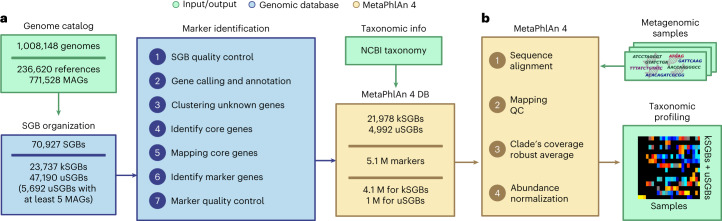
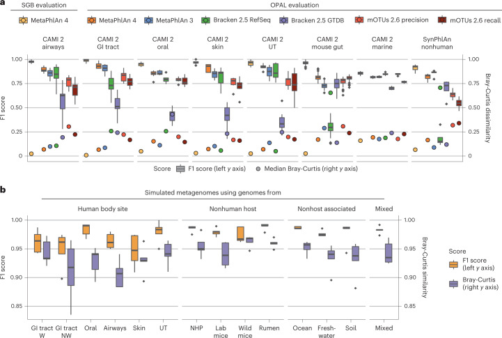
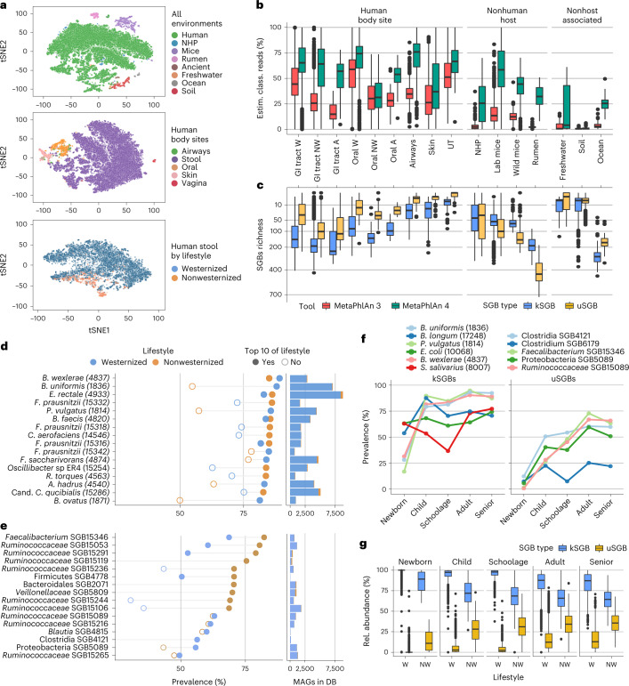
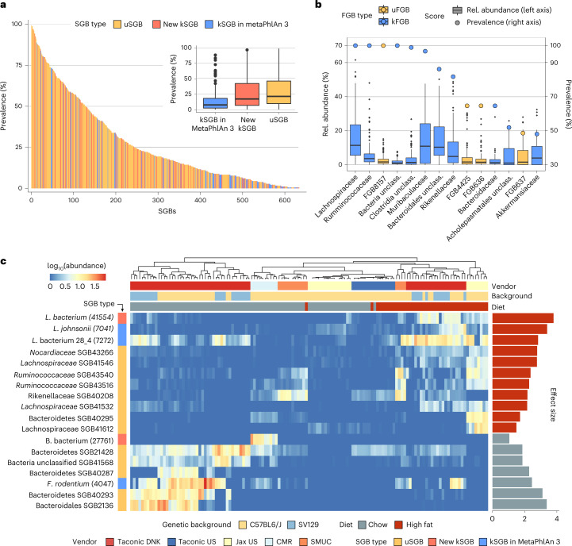
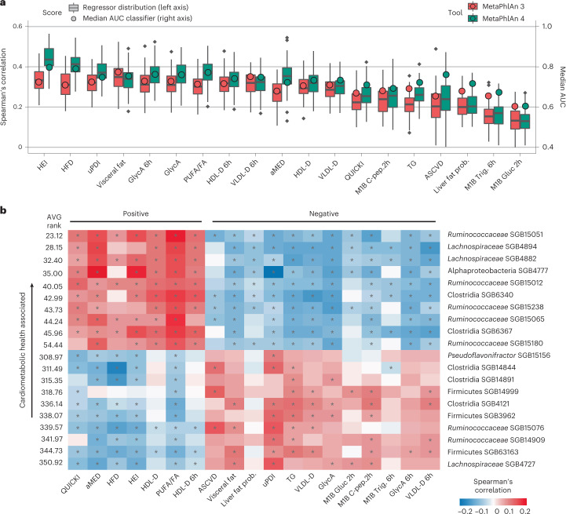
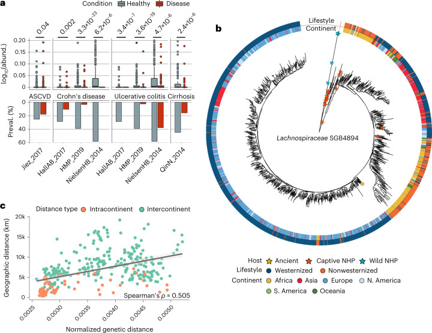

# Расширение и совершенствование метагеномного таксономического профилирования с учетом нехарактеризованных видов с использованием MetaPhlAn 4

> **Неофициальный перевод.** Оригинал: Aitor Blanco-Míguez, Francesco Beghini, Fabio Cumbo, Lauren J. McIver, Kelsey N. Thompson, Moreno Zolfo, Paolo Manghi, Leonard Dubois, Kun D. Huang, Andrew Maltez Thomas, William A. Nickols, Gianmarco Piccinno, Elisa Piperni, Michal Punčochář, Mireia Valles-Colomer, Adrian Tett, Francesca Giordano, Richard Davies, Jonathan Wolf, Sarah E. Berry, Tim D. Spector, Eric A. Franzosa, Edoardo Pasolli, Francesco Asnicar, Curtis Huttenhower, Nicola Segata. «Extending and improving metagenomic taxonomic profiling with uncharacterized species using MetaPhlAn 4». Nature Biotechnology, 2023. DOI: [10.1038/s41587-023-01688-w](https://doi.org/10.1038/s41587-023-01688-w). Лицензия: CC BY 4.0.

## Аннотация

Сборка (assembly) метагеномов позволяет открывать новые организмы в микробных сообществах, но в большинстве метагеномов удаётся захватить лишь немногие обильные организмы. Здесь мы представляем MetaPhlAn 4, который объединяет информацию из сборок метагеномов и геномов микробных изолятов для более полного таксономического профилирования метагеномов. Из курированной коллекции из 1.01 M прокариотических референсных и метагеномно-собранных геномов (MAG) мы определяем уникальные маркерные гены (marker gene) для 26 970 SGB (species-level genome bins; бины геномов на уровне вида), 4 992 из которых таксономически не идентифицированы на уровне вида. MetaPhlAn 4 объясняет ~20% больше ридов (read; короткий фрагмент ДНК после секвенирования) в большинстве международных микробиомов кишечника человека и >40% в менее охарактеризованных средах, таких как микробиом рубца, и оказывается точнее доступных альтернатив на синтетических оценках, надёжно количественно оценивая и организмы без культивируемых изолятов. Применение метода к >24 500 метагеномам выделяет ранее не обнаруженные виды как сильные биомаркеры состояний хозяина и образа жизни в микробиомах человека и мыши и показывает, что даже ранее не охарактеризованные виды можно генетически профилировать с разрешением отдельных микробных штаммов.

## Основная часть

За последние 25 лет шотган-метагеномное секвенирование[1] и связанные вычислительные методы стали надёжными и эффективными способами изучения таксономического состава[2–6] и функционального потенциала[4,7,8] сложных микробных сообществ, населяющих человека, животных и природные среды. Методы сборки геномов, разработанные для микробных изолятов, были расширены для применения к шотган-метагеномам; однако, несмотря на их высокую эффективность в выявлении новых организмов из сообществ, их чувствительность (sensitivity) часто ограничена сложностью таких сред[9]. Референс-ориентированные вычислительные подходы дополняют сборку, опираясь на аннотированную референсную последовательность для точной идентификации и количественной оценки известных таксонов и генов в микробиоме по гомологии[4–7]. Этот набор методов позволил глубоко исследовать микробиомы человека и открыть микробные ассоциации с множеством состояний здоровья[10–18] и пищевых паттернов[19–23], а также охарактеризовать эволюцию и передачу микробных видов и штаммов[24–29]. Однако референс-ориентированные методы могут обнаруживать только те микробные виды, которые включены в существующие референсные базы (reference database); эти базы обычно охватывают лишь часть членов сообщества в различных средах, что ограничивает возможности интерпретации данных шотган-метагеномов[30].

В отличие от этого, методы *de novo* сборки генома из метагеномных данных — позволяющие получать так называемые MAG — достигли высокой специфичности (хотя зачастую обладают низкой чувствительностью) при извлечении генетической информации непосредственно из метагеномов[31–35]. Это дает возможность выделять последовательности микроорганизмов, которые пока не были выделены или охарактеризованы и поэтому отсутствуют в референсных базах[36]. За последние несколько лет методы сборки генома и биннинга (binning) значительно усовершенствовались[31–35]; в результате были составлены крупномасштабные каталоги MAG, содержащие огромное количество неизвестных и некультивируемых видов микроорганизмов, обитающих в различных средах[37–46]. Однако подобные методы сборки генома обычно способны выявить лишь небольшую часть организмов в сложных сообществах: это обусловлено недостаточным покрытием (coverage) для многих таксонов, наличием генетически близкородственных таксонов, мешающих корректной сборке или приводящих к ошибкам, а также трудностями в контроле качества полученных MAG[9].

Чтобы использовать преимущества как референсного, так и основанного на сборке подходов к анализу метагеномов, мы представляем метод MetaPhlAn 4. Данный метод использует расширенный свод данных о геномах микроорганизмов и MAG для определения дополнительного набора SGB, то есть SGB, геномных структур на уровне видов[42], а также для точного определения их присутствия и обилия (abundance) в метагеномах. Эти SGB могут представлять собой как уже известные виды (kSGB), так и еще не охарактеризованные виды (uSGB), определяемые исключительно на основе данных MAG[42]. Используя коллекцию, включающую 1.01 миллиона MAG и геномов бактерий и архей, полученных в ходе новейших исследований [37–45], а также дополнительные недавно собранные MAG из различных сред, мы расширили определение 54 596 SGB; кроме того, для 21 978 kSGB и 4 992 uSGB были определены уникальные маркерные гены, характерные именно для каждого SGB. Полученный набор данных дополняет существующий алгоритм MetaPhlAn[2–4], позволяя проводить более глубокий и точный количественный таксономический анализ микробиомов человека, связанных с хозяином и окружающей среды; он также способствует пониманию результатов многочисленных исследований, связывающих микробиом с состоянием организма.

## Результаты

### MetaPhlAn 4 Профилирование SGB на видовом уровне

MetaPhlAn 4 расширяет и улучшает существующие возможности по таксономическому профилированию метагеномов за счёт использования подхода, при котором обширные сборки геномов интегрируются с существующими референсными геномами бактерий и архей (reference genome). После этого они совместно подвергаются предварительной обработке, что позволяет эффективно сопоставлять метагеномы с миллионами уникальных маркерных генов и, в конечном итоге, количественно оценивать как изолированные микроорганизмы, так и те, чьи геномы были собраны метагеномным способом в новых сообществах. Алгоритм включает в себя четыре основных усовершенствования по сравнению с предыдущими версиями: (1) использование SGB[42] в качестве основных таксономических единиц; каждый SGB объединяет геномы микроорганизмов и MAG в рамки уже существующих видов либо вновь определённых геномных кластеров, обладающих видовым уровнем разнообразия; (2) интеграция более чем 1 млн MAG и геномов в эту структуру SGB, что позволило создать один из крупнейших на данный момент баз данных надёжных референсных последовательностей микроорганизмов; (3) курирование таксономических единиц на основе согласованности таксономически идентифицированных геномов, а также присвоение новых таксономических обозначений SGB, определённым исключительно на основе MAG; (4) усовершенствованная процедура выделения уникальных маркерных генов из каждого SGB для реализации стратегии сопоставления на основе референсного геномаMetaPhlAn[2–4]. Таким образом, MetaPhlAn 4 сочетает в себе преимущества MAG, способной выявлять ранее неизвестные таксоны[40–42,45], и высокую чувствительность методов профилирования на основе референсных геномов, обеспечивающих точную идентификацию и количественную оценку микроорганизмов.

Использование SGB в качестве основной единицы таксономического анализа является ключевым элементом данного подхода[42]. SGB[42] определяет границы микробного вида исключительно на основе кластеризации геномов по генетическим расстояниям при пороге геномной идентичности 5%[47]; затем таксономическая метка присваивается данному SGB в зависимости от наличия (или отсутствия) уже охарактеризованных геномов, полученных при секвенировании изолятов. Такое определение позволяет упорядочивать произвольные микробные геномы подобно тому, как ампликоны группируются в операционные таксономические единицы (OTU), и весьма точно соответствует ожидаемым границам существующей таксономии[42,47,48]. В результате доступные референсные геномы микроорганизмов и MAG среднего и высокого качества, группируются в четко определенные таксономически виды («известные» SGB, или kSGB, если в составе SGB присутствует геном изолята с известной таксономической принадлежностью) либо в неизвестные аналогичные клады (uSGB).

В соответствии с подходом к кластеризации SGB база данных, используемая MetaPhlAn 4, содержит SGB, образовавшиеся в результате объединения видов, которые изначально неверно классифицировались как отдельные виды. Например, геномы, отнесенные в NCBI[49] к *Lawsonibacter asaccharolyticus* и *Clostridium phoceensis*, на 98.7% идентичны; вероятно, это обусловлено независимым наименованием представителей нового вида, в результате чего они были объединены в один [SGB15154](SGB15154) (вспомогательная таблица 1). Такое объединение также применяется к таксономическим видам, которые генетически трудно или невозможно различить (например, виды группы *Bacillus cereus*, различающиеся генетически лишь по своим плазмидным последовательностям[50]); такие виды также включаются в один и тот же SGB. Напротив, виды, у которых подклады различаются более чем на 5% по генетической идентичности, разделяются на несколько SGB (например, *Prevotella copri* представлен четырьмя различными SGB[51], а для *Faecalibacterium prausnitzii* существуют отдельные SGB, соответствующие его различным (под)видам[52]; вспомогательная таблица 1). Наконец, были выявлены и скорректированы некорректно или частично классифицированные референсные геномы; коррекция проводилась на основе обнаружения аномальных обозначений, возникших вследствие опечаток или неверной классификации со стороны пользователей, загружающих геномы в NCBI (например, SGB7865 из *Staphylococcus epidermidis* состоит из 700 референсных геномов; у 32 из них в базе данных NCBI указаны иные или неопределенные обозначения видов[49]; вспомогательная таблица 1).

Для создания базы данных SGB, подлежащей анализу в MetaPhlAn 4, в качестве исходного материала использовались 236 620 геномов бактерий и архей, доступных в NCBI[53] и помеченных как «реконструированные на основе секвенирования изолятов или одиночных клеток». Эти геномы были объединены с 771 528 MAG (MAG), собранными из образцов, полученных от людей (пять основных участков тела, 164 различные группы испытуемых), животных (включая 22 вида приматов) и не связанных с хозяевами сред (почва, пресная вода, океаны; см. вспомогательные таблицы 2 и 3). После удаления референсных геномов и MAG, не соответствовавших критериям качества (то есть с полнотой генома более 50 % и уровнем загрязнения ниже 5 %; см. Методы), в базе осталось 729 195 геномов (560 084 MAG и 169 111 референсных геномов). С помощью алгоритма Mash[54] эти геномы были сгруппированы в SGB при пороге сходства последовательностей в 5 %[42]; в итоге была сформирована база данных, включающая 70.9 тыс. SGB, из которых 47.6 тыс. не поддаются таксономической идентификации на уровне видов (uSGB; см. рис. 1a). Данная база охватывает 95 различных типов; при этом uSGB встречаются в них довольно часто (см. вспомогательную таблицу 4). По сравнению с исходной базой SGB[42] нынешняя коллекция содержит в 3.6 раза больше MAG, полученных из самых разнообразных сред (см. вспомогательную таблицу 3), а также включает в 4.3 раза больше SGB. Хотя данная база может использоваться для геномных исследований в более широких масштабах, чем ранее[40–42,45,51,55–57], в данной работе мы сосредоточились на задаче идентификации и количественной оценки таксонов по метагеномным данным. Для снижения вероятности ложноположительных результатов при выявлении SGB, не имеющих достаточной поддержки или встречающихся крайне редко, мы оставили лишь те uSGB, в состав которых входило не менее пяти MAG из различных образцов; в итоге формировалась окончательная база, включающая 29.4 тыс. качественно отобранных SGB (см. Методы).

**Рис. 1.** MetaPhlAn 4 интегрирует референсные последовательности из изолированных организмов и MAG для таксономического анализа метагеномов.**a** Из совокупности в 1.01 млн бактериальных и архейных референсных геномов и MAG (MAG), охватывающих 70 927 SGB, наша методика выявила 5.1 млн уникальных маркерных генов, специфичных для каждого SGB; эти гены используются MetaPhlAn 4 (в среднем 189 ± 34 гена на каждый SGB). **b** Расширенная база маркерных генов позволяет MetaPhlAn 4 определять наличие и оценивать относительное обилие 26 970 SGB; среди них 4 992 представляют собой потенциальные новые виды, для которых не существует референсных геномов (uSGB), и для которых выявлено не менее пяти MAG из различных образцов. Анализ проводится в следующем порядке: (1) сопоставление ридов входных метагеномов с базой маркерных генов; (2) отбраковка низкокачественных сопоставлений; (3) расчет среднего покрытия маркерных генов в каждом SGB; (4) нормализация полученных значений между всеми SGB для получения данных об их относительном обилии (см. Методы). Все данные представлены в виде среднего значения ± стандартного отклонения.

На основе этого каталога геномов SGB мы построили пангеном каждого SGB (совокупность всех генных семейств, найденных хотя бы в одном геноме SGB) и использовали их для выявления видоспецифичных маркерных генов для профилирования MetaPhlAn. Пангеномы строили, относя кодирующие последовательности всех 729 k геномов к кластерам UniRef90[58] при совпадении с идентичностью аминокислот 90% в базе UniRef либо путём de novo кластеризации оставшихся последовательностей при идентичности аминокислот 90% по критериям Uniclust90[59] (см. Методы). Из полученных 50.6 M идентичностей UniRef90 и 77.7 M новых генных семейств Uniclust90 мы затем выделили ядерные генные семейства (то есть присутствующие почти во всех геномах и MAG данного SGB; см. Методы) и отобрали среди них видоспецифичные, картируя их на все последовательности всех SGB (см. Методы). Эта процедура дала 5.1 M уникальных маркерных генов в сумме для 26 970 высококачественных SGB, в среднем 189 ± 34 уникальных маркерных гена на SGB. Таксономическое профилирование MetaPhlAn 4 использует эти маркеры, чтобы выявлять присутствие SGB (известного или неизвестного) в новых метагеномах по картированию ридов на достаточную долю видоспецифичных маркерных генов (по умолчанию 20%) и количественно оценивать их относительное обилие по нормализованным внутри образца оценкам среднего покрытия (см. �илие по нормализованным внутри образца оценкам среднего покрытия (см. Методы; рис. 1b).

### MetaPhlAn 4 повышает эффективность таксономического профилирования.

Для оценки эффективности таксономического профилирования с помощью MetaPhlAn 4 мы сначала проверили его способность определять хорошо изученные виды (то есть виды, относящиеся к kSGB) в сравнении с существующими методами; для этого использовались 133 синтетических метагенома (всего около 4 млрд ридов). Большинство из этих синтетических образцов (128) взяты из конкурса по таксономическому профилированию CAMI 2[60] и представляют собой сообщества, связанные с хозяевами, а также морские сообщества; остальные пять образцов представляют собой дополнительные нечеловеческие синтетические метагеномы (полученные с помощью SynPhlAn; см. Методы), отражающие более разнообразные условия среды, чем в предыдущих исследованиях[4].

С помощью тестовой платформы OPAL[61] мы оценили производительность MetaPhlAn 4 в сравнении с MetaPhlAn 3 (см. [4]), mOTUs 2.6 (см. [6]) (последняя доступная база данных на март 2021 года) и Bracken 2.5 (см. [5]) (использовались две базы данных: одна создана на основе релиза RefSeq от апреля 2019 года[62], а другая — на основе релиза GTDB 207 (см. [63])). Ввиду высокого уровня ложноположительных результатов, характерного для Bracken 2.5, мы решили оценить его эффективность после отфильтровывания результатов с низким обилие (минимальное относительное обилие — 0.01%; см. вспомогательный рисунок 1). MetaPhlAn 4 показал лучшие результаты по показателю F1 (см. рисунок 2a), рассчитанному на основе общепринятой таксономической классификации NCBI. Это справедливо даже с учетом того, что платформа OPAL не учитывает группы видов, определяемые по принципу SGB (то есть отдельные виды, ошибочно классифицированные как разные виды, но включенные в один и тот же SGB), что неблагоприятно сказывается на оценке результатов работы MetaPhlAn 4, не способного соответствовать таким меткам; тем не менее новая версия программы выявила большее количество видов по сравнению с MetaPhlAn 3 во всех проведенных тестах (в среднем 96.65 ± 66.08 и 85.32 ± 61.95 истинно положительных результатов соответственно), при этом количество ложноположительных результатов осталось низким (в среднем 16.09 ± 17.65 и 13.63 ± 16.56 соответственно; см. вспомогательный рисунок 2a,b и вспомогательную таблицу 5). Большинство ложноположительных результатов (84.6%) обусловлены новыми метками групп видов, определяемых по принципу SGB (например, вид *Marinilactibacillus* sp. 15R, присутствующий практически во всех оральных метагеномах из набора CAMI 2, относится к группе видов *Marinilactibacillus piezotolerans* SGB7875); таким образом, их нельзя считать строго ложноположительными результатами. Дополнительные тесты с использованием последовательностей отдельных изолятов (см. Методы) показали отсутствие ложноположительных результатов при запуске MetaPhlAn 4 с параметрами по умолчанию, а также отсутствие ложноотрицательных результатов во всех случаях, когда покрытие достигало 0.5× и выше. Данный порог покрытие гарантирует, что MetaPhlAn 4 способен обнаружить все SGB, чье относительное обилие составляет не менее 0.01%, в метагеномных образцах с типичной глубиной секвенирования 10 млрд пар оснований; при этом обнаружение видов с более низким обилие также часто возможно (см. вспомогательную таблицу 6). Улучшение показателя чувствительности в значительной степени объясняется расширенным каталогом референсных геномов, включенных в MetaPhlAn 4 (169.1 тыс. геномов, относящихся к 31.9 тыс. видам, по сравнению с 99.2 тыс. геномами от 13.5 тыс. видов в MetaPhlAn 3).

**Рис. 2.** MetaPhlAn 4 повышает чувствительность и специфичность метагеномного таксономического профилирования.**a** Для оценки его эффективности MetaPhlAn 4 применили к синтетическим метагеномам, представляющим сообщества микроорганизмов, ассоциированные с хозяевами; эти данные взяты из конкурса по таксономическому профилированию CAMI 2[60] (*n* = 128 образцов) и из набора данных SynPhlAn-nonhuman (*n* = 5 образцов); эти наборы отражают более разнообразные условия по сравнению с предыдущими исследованиями[4]. Оценка на уровне видов с использованием фреймворка OPAL[61] показывает, что MetaPhlAn 4 обладает большей точностью по сравнению с другими методами как в определении присутствующих таксонов (значение F1 представляет собой гармоническое среднее точности и полноты обнаружения), так и в количественной оценке их обилия (показатель BC beta-разнообразия рассчитывается на основе сравнения оценочных профилей с истинными значениями обилия). Дополнительные тесты, проведенные с использованием геномов, организованных по принципу SGB (раздел «Оценка SGB»; см. Методы), демонстрируют, что MetaPhlAn 4 ещё больше повышает точность на этом более детализированном таксономическом уровне. Более подробную информацию см. в дополнительных таблицах 5 и 7 (GI – желудочно-кишечный тракт; UT – мочеполовая система). **b** MetaPhlAn 4 также применялся к синтетическим метагеномам (*n* = 70 образцов), моделирующим различные среды, связанные и не связанные с хозяевами; в среднем в этих образцах содержится 47 геномов как из категории kSGB, так и из категории uSGB (см. Методы). Прямая оценка на уровне SGB подтверждает надёжность MetaPhlAn 4 в количественной оценке как известных, так и неизвестных видов микроорганизмов. Ещё один тест, основанный на смеси новых MAG, полученных из образцов, не использовавшихся при создании геномной базы данных (раздел «Смешанная оценка», *n* = 5 образцов), подтверждает высокую точность метода независимо от того, включались ли анализируемые данные в базу данных. Более подробную информацию см. в дополнительных таблицах 9 и 10 (NHP – человекообразные обезьяны; W – западные страны; NW – страны, не относящиеся к западной цивилизации). На диаграммах в разделах **a** и **b** показаны медиана (центр), 25-й и 75-й процентили (нижняя и верхняя «шарнирные» точки), интервал 1.5× межквартильного размаха («усы») и выбросы (точки).

Мы оценили точность количественного определения относительного обилия с помощью программы MetaPhlAn 4, используя показатель несходства Брей–Кертиса и среднеквадратичную ошибку по отношению к составу синтетических эталонных сообществ. Программа MetaPhlAn 4 показала лучшие результаты по сравнению с другими методами (среднее значение показателя Брей–Кертиса составило 0.13 ± 0.07; среднеквадратичная ошибка — 0.016 ± 0.019), включая предыдущую версию MetaPhlAn 3 (среднее значение показателя Брей–Кертиса — 0.19 ± 0.12; среднеквадратичная ошибка — 0.019 ± 0.018; см. дополнительную таблицу 7 и рисунок 2a). Вероятно, ключевым фактором этого улучшения стало качество набора маркерных генов; оно обусловлено филогенетической однородностью SGB, что гарантирует геномное сходство таксонов с одинаковыми метками. Это позволило избежать ошибок в таксономической классификации, которые трудно выявить при использовании первоначальных, вручную присвоенных меток, и позволило сформировать набор маркерных генов, который: (1) является более обширным (в среднем 189 ± 34 гена на каждый SGB против 84 ± 47 генов на вид в программе MetaPhlAn 3), (2) более надежным (см. дополнительную таблицу 6 и дополнительный рисунок 3) и (3) более уникальным (доля уникальных маркерных генов составила 99.3% по сравнению с 72.7% в программе MetaPhlAn 3; кроме того, количество случайно назначенных ридов сократилось в диапазоне от 3.8 до 15.55 раз в зависимости от условий среды; см. дополнительную таблицу 8).

Кстати, поскольку вышеупомянутые оценки не учитывали возможные изменения в таксономии видов, позволяющие избежать подобных проблем, мы затем протестировали алгоритм MetaPhlAn 4 на тех же синтетических метагеномах, но с использованием таксономии, основанной на SGB (см. Методы). Принимая за эталонные метки для каждого генома в синтетическом сообществе соответствующие SGB, алгоритм MetaPhlAn 4 продемонстрировал высокую точность как при расчете показателя F1 (в среднем 0.95 ± 0.06), так и при оценке несходства по метрике BC (в среднем 0.031 ± 0.023; рис. 2a).

В заключение мы оценили эффективность MetaPhlAn 4 в выявлении uSGB, представляющих таксоны, для которых не найдено таксономически идентифицированных изолятов. Мы создали 65 синтетических метагеномов, имитирующих микробиомы из 12 различных участков человеческого тела, среды обитания животных и не связанных с хозяевами экосистем; для их формирования использовались как kSGB, так и uSGB, полученные в результате метагеномной сборка (генома) (см. Методы) из реальных метагеномных данных. Кроме того, мы составили пять дополнительных синтетических метагеномов, используя смесь MAG и референсных геномов из образцов, не входивших в нашу исходную геномную базу данных (см. Методы). MetaPhlAn 4 продемонстрировал высокую точность при выявлении и количественной оценке uSGB (средний показатель F1 составил 0.97 ± 0.02; см. рис. 2b и дополнительный рис. 2c,d); эти показатели сопоставимы с результатами для уже известных видов (kSGB; средний показатель F1 — 0.96 ± 0.024; см. рис. 2a). Как показатель F1, так и степень сходства с референсным геномом по метрике BC оставались стабильными во всех исследованных средах. Синтетические образцы, созданные на основе MAG, которые отсутствовали в базе данных MetaPhlAn 4 на момент её формирования, также показали схожие результаты (средний показатель F1 — 0.98 ± 0.006; см. рис. 2b и дополнительные таблицы 9 и 10). В целом MetaPhlAn 4 превзошел другие доступные инструменты при работе с синтетическими данными; кроме того, он позволяет количественно оценивать виды, ещё не описанные таксономически, сохраняя при этом высокую точность для хорошо изученных таксонов.

### MetaPhlAn 4 расширяет долю метагеномов, подлежащих анализу.

База данных MetaPhlAn 4 позволяет количественно оценивать большее число известных микробных видов (на 18.4 тысячи видов больше, чем в базе данных MetaPhlAn 3), повышает точность идентификации многих видов, описанных с помощью kSGB (всего 21 978 kSGB; в среднем по 1.15 kSGB на вид), а также включает 4 992 пока еще не охарактеризованных микробных вида (uSGB). Для оценки способности данной базы данных объяснять большую долю всех **рид** в метагеноме мы проанализировали 24.5 тысячи метагеномных образцов (из 145 различных исследований; см. Вспомогательную таблицу 11), полученных из различных человеческих, животных и не связанных с хозяином сред обитания (см. Рис. 3a и Вспомогательный рис. 4). Кроме того, мы разделили 19.5 тысячи человеческих метагеномов по месту их происхождения в организме и образу жизни донора (западный или незападный; полное описание понятия «западнизация» см. в Методы).

**Рис. 3.** MetaPhlAn 4 позволяет расширить наблюдаемое разнообразие микроорганизмов, в первую очередь за счёт количественной оценки пока ещё не охарактеризованных видов (uSGBs).**a** Мы применили метод профилирования MetaPhlAn 4 к общему числу 24.5 тысяч метагеномных образцов из различных сред, продемонстрировав его способность определять состав микробиомов и чёткие различия между ними, даже с учётом различных участков человеческого тела и особенностей образа жизни доноров (вспомогательный рисунок 5b и вспомогательная таблица 11). **b** Расширенная геномная база данных MetaPhlAn 4 значительно увеличивает долю ридов, поддающихся классификации, по сравнению с предыдущей версией MetaPhlAn, независимо от типа среды обитания (*n* = 24 515 образцов). **c** Программа MetaPhlAn 4 в среднем выявляет 48 неизвестных бактериальных видов (uSGBs) в каждом микробиоме человеческого кишечника; в других нечеловеческих средах это число достигает более 700 (*n* = 24 515 образцов). **d** Наиболее распространёнными микроорганизмами в ЖКТ населения, ведущего западный образ жизни, являются уже известные виды (kSGBs). Десять наиболее распространённых kSGBs в обеих группах (западной и незападной) приведены в порядке убывания их распространённости; рядом с каждым видом указано количество MAG, собранных из метагеномов человеческого кишечника и включённых в геномный каталог MetaPhlAn. Названия видов приводятся вместе с их идентификаторами SGB в скобках. **e** В группе населения, ведущего незападный образ жизни, наиболее распространёнными SGB являются виды, ещё не культивированные и не получившие официальных названий. Для каждого образа жизни перечислены десять наиболее распространённых uSGBs в порядке убывания их частоты встречаемости. **f** В популяциях, ведущих западный образ жизни, наиболее распространённые kSGBs и uSGBs различаются в зависимости от возрастной группы; для каждой возрастной категории указаны два наиболее распространённых SGB. **g** Доля uSGBs по отношению к kSGB увеличивается после младенческого возраста (*n* = 19 468). На диаграммах в **b**, **c** и **g** показаны медиана (центр), 25-й и 75-й процентили (нижняя и верхняя «шарнирные» точки), 1.5-кратный интерквартильный диапазон («усы» графика) и выбросы (точки). NHP — приматы, не являющиеся людьми; W — западный образ жизни; NW — незападный образ жизни; A — древний.

В полученных таксономических профилях MetaPhlAn 4 выявил 11 132 SGB, присутствующих как минимум в 1 % образцов из любой из исследуемых сред; из них 3 527 (31.68 %) оказались таксономически неизвестными на уровне вида (uSGB). Новые профили позволили объяснить гораздо большую долю ридов в метагеномных образцах по сравнению с предыдущей версией во всех исследуемых средах (рис. 3b). В участках человеческого тела наибольшее улучшение наблюдалось в дыхательных путях (в среднем количество объясненных ридов возросло в 1.95 раза); ещё более значительные улучшения были зафиксированы в образцах из микробиомов нечеловекообразных млекопитающих: от среднего увеличения в 3.26 раза у диких мышей до 14.15-кратного роста в рубце. У этих животных среднее количество обнаруженных uSGB превысило количество kSGB (за исключением нечеловекообразных приматов; рис. 3c и дополнительный рис. 5a). Такое увеличение коррелирует с числом новых MAG, позволивших определить дополнительные uSGB в микробиомах нечеловекообразных животных (всего 90 606 MAG, описывающих 1 287 uSGB).

В экологических экосистемах метагеномы в целом хуже поддавались объяснению с помощью таксонов, учитывавшихся в MetaPhlAn 4; особенно плохо изучена почва из-за её исключительного микробного разнообразия и отсутствия систематических масштабных метагеномных исследований (в нашей базе данных имеется лишь 2 495 MAG, определяющих 26 uSGB). В то же время в океанической микробиоте наблюдалось увеличение показателей в 6.65 раза, в основном благодаря включению MAG[64] из проекта Tara Ocean в базу данных SGB (рис. 3c). В целом uSGB сыграли ключевую роль в повышении доли метагеномов, поддающихся анализу с помощью MetaPhlAn 4 (рис. 3b); они в среднем составляли 23.13 % (стандартное отклонение: 17.89 %) от общего разнообразия видов в полученных профилях во всех исследованных средах (рис. 3c).

### Анализ SGB выявляет пересечения между видами в различных средах обитания

Одним из главных преимуществ метагеномного профилирования с использованием референсной базы по сравнению с **сборкой (генома)** является способность выявлять геномы [37,39,40,42,43,45], присутствующие в низких концентрациях и трудно поддающиеся сборке. Это позволяет получать достоверные экологические статистические данные относительно распространенных и редких таксонов; такие данные трудно получить точно при наличии множества технических факторов, препятствующих обнаружению геномов в результатах одной лишь **сборки (генома)**. В рамках данного набора данных MetaPhlAn 4 выявили 1 657 SGB, обнаруженных минимум в 1% образцов из кишечника людей, не подвергшихся западной диете (550 из них являются uSGB); также было выявлено 331 SGB с таким же порогом распространенности в влагалищной микробиоте человека, характеризующейся низким разнообразием (61 из них — uSGB). В других средах количество обнаруженных SGB оказалось промежуточным (вспомогательный рисунок 5b).

Это подтвердило, что метагеномы кишечника, полученные из древних образцов (возрастом от 150 до 5 300 лет в имеющихся наборах данных), имеют больше SGB, общих с теми, чья распространенность в кишечной микробиоте современных незападных популяций превышает 1 % (1 039 SGB), чем с теми, что характерны для западных популяций (748 SGB), несмотря на то, что в наборах данных и базах данных преобладают сведения, полученные от западных популяций (в десять раз больше образцов; см. вспомогательный рисунок 5b и вспомогательную таблицу 3). Аналогичным образом, при использовании того же порога распространенности в 1 %, SGB, обнаруженные в кишечнике нелюдских приматов (включая содержащихся в неволе) имели больше общего с образцами древней микробиоты (879 SGB), чем с образцами современной микробиоты (668 SGB); это дополнительно подчеркивает влияние образа жизни на формирование человеческой микробиоты (см. вспомогательный рисунок 5b). Подобная экологическая адаптация наблюдается и в кишечной микробиоте лабораторных мышей: здесь обнаружено гораздо больше SGB, характерных для кишечника современных людей (481 SGB), по сравнению с мышами в дикой природе (53 SGB). Двадцать восемь SGB встречаются с распространенностью более 1 % во всех участках человеческого тела (см. вспомогательную таблицу 12); к ним относятся преимущественно микроорганизмы ротовой полости, способные проникать в нижние отделы желудочно-кишечного тракта, загрязнять кожу и колонизировать другие слизистые оболочки, в частности влагалище; это так называемая группа *Haemophilus parainfluenzae* (SGB9712), группа *Streptococcus salivarius* (SGB8007), *Veillonella parvula* (SGB6939), *Rothia mucilaginosa* ([SGB16971](SGB16971)) и *Streptococcus oralis* (SGB8130).

Виды, присутствующие в различных средах при одинаковом пороге распространенности в 1%, также могут указывать на возможное загрязнение; таковы девять SGB, общих как для образцов кишечной микрофлоры современных людей, так и для образцов морской воды (Вспомогательная таблица 13). В основном это микробы кожи и ротовой полости, способные загрязнять водные образцы с низким содержанием биомассы в ходе лабораторных процедур: *Cutibacterium acnes* ([SGB16955](SGB16955)), *Staphylococcus aureus* (SGB7852), *Streptococcus thermophilus* (SGB8002), *Escherichia coli* ([SGB10068](SGB10068)), *V. parvula* (SGB6939), *Staphylococcus epidermidis* (SGB7865), *Staphylococcus hominis* (SGB7858), *Streptococcus mitis* (SGB8163) и *R. mucilaginosa* ([SGB16971](SGB16971)). В целом, новый метод профилирования MetaPhlAn 4 показывает, что микробиомы большинства сред, не связанных с человеком, практически не пересекаются с человеческим микробиомом (Вспомогательный рисунок 5c); как и ожидалось, микробиомы различных участков тела человека имеют ограниченное, но значимое сходство (Вспомогательная таблица 12).

### MetaPhlAn 4 расширяет список распространённых видов микроорганизмов кишечника человека.

Мы оценили распространенность SGB в кишечной микробиоте человека (Справочная таблица 14), проанализировав 19.5 тысяч метагеномов человеческого кишечника из 86 наборов данных, охватывающих различные возрастные группы, географические регионы и образы жизни (Справочная таблица 15). Наиболее распространенными SGB в западных популяциях оказались представители известных видов (Рис. 3d): в частности, *Blautia wexlerae* (SGB4837, 89.2%), группа *Bacteroides uniformis* (SGB1836, 88.1%) и *Phocaeicola vulgatus* (ранее называвшийся *Bacteroides vulgatus*; SGB1814, 85.8%). Четыре различных SGB вида *F. prausnitzii* вошли в десятку наиболее распространенных видов; три из них демонстрировали существенные различия в распространенности в зависимости от образа жизни (Рис. 3d). Это подтверждает, что анализ SGB позволяет повысить точность идентификации видов, обладающих значительными генетическими отличиями[52]. Кроме того, высокой распространенностью характеризовались *Cibionibacter quicibialis*[42], а также ряд других видов, относящихся к категории kSGB, поскольку у них имеются секвенированные представители, несмотря на то, что они в основном остаются малоизученными (например, *Oscillibacter sp*. ER4) (Рис. 3d).

Хотя у большинства uSGB показатель распространенности в данной популяции был низким, у 4 uSGB из семейства *Ruminococcaceae* этот показатель превысил 75%; причем многие из них встречались значительно чаще в незападных популяциях по сравнению с западными (Рис. 3e). Виды с наивысшим уровнем распространенности в каждой возрастной категории демонстрировали различную распространенность в остальных возрастных группах (Рис. 3f, Дополнительный рис. 6 и Дополнительная таблица 14); кроме того, uSGB, как правило, особенно распространены в детском возрасте, который, возможно, изучается недостаточно по сравнению с младенчеством и взрослым периодом (Рис. 3g и Дополнительная таблица 16). В целом, данные о распространенности вновь выявленных SGB в различных популяциях и при разных образе жизни (Дополнительная таблица 14) позволяют расширить как объем, так и детализацию информации, полученной в ходе предыдущих метагеномных исследований.

### Маркеры питания у мышей в основном представлены уSGB (уникальные структурные геномные блоки).

MetaPhlAn 4 включает в себя 22 718 MAG, полученных в ходе сборки (генома) 1 906 метагеномов кишечника мышей (как лабораторных, так и диких), и выделяет 540 uSGB; это позволяет более детально анализировать микробиоту кишечника мышей. При применении к разнообразному публичному набору данных, включающему 184 образца микробиома кишечника мышей с восьмью генетическими вариантами и от шести различных производителей (Справочная таблица 17)[65], программа MetaPhlAn 4 выявила 632 различных SGB; при этом 45.57 % из них не удалось бы обнаружить, используя лишь MAG, реконструированные из тех же образцов (Справочная таблица 18). Как уже отмечалось в недавних исследованиях[66], применяющих методику, основанную на сборке (генома) метагеномных данных[67], большинство обнаруженных SGB в кишечнике мышей (60.8 %) представляют собой uSGB (Рис. 4a и Вспомогательный рис. 7a). В сравнении с этим программа MetaPhlAn 3 смогла идентифицировать лишь 108 видов по тем же образцам. Примечательно, что из 43 SGB, присутствующих более чем в 75 % образцов, большинство являются uSGB; 12 kSGB, в свою очередь, соответствуют слабо изученным видам, таким как *Lachnospiraceae* bacterium 28_4 (SGB7272), *Dorea* sp. 5_2 (SGB7275) и *Oscillibacter* sp. 1_3 (SGB7266); именно их единственные удалось обнаружить с помощью MetaPhlAn 3. Низкая способность выравнивания последовательностей микробиомов мышей с геномами изолированных штаммов проявляется также на таксономических уровнях выше уровня видов: более половины семейств (то есть семейственных уровней геномных бинов (FGB), определяемых аналогично SGB, но допускающих до 30 % различий в нуклеотидной последовательности; см. Методы), присутствующих более чем в 20 % образцов, до сих пор остаются нехарактеризованными (uFGB; Рис. 4b и Вспомогательный рис. 7b).

**Рис. 4.** MetaPhlAn 4 позволяет проводить точный метагеномный анализ микробиомов мышей, в которых присутствует лишь небольшое количество таксонов, имеющих культивируемые изоляты.**a** Таксономический анализ с использованием MetaPhlAn 4 выборки образцов кишечного микробиома мышей (*n* = 181 образец), представляющей восемь генетических линий и шесть различных производителей[65] показал, что большинство выявленных микробных таксонов представляют собой неизученные SGB (uSGBs), для которых не найдено секвенированных изолятов. **b** Некоторые из наиболее распространенных семейств в кишечном микробиоме мышей (*n* = 181 образец) до сих пор не классифицированы на уровне семейств (uFGBs). На рисунке показаны FGB, выявленные как минимум в 20% образцов (круги и правая ось *y*) и имеющие медианное относительное обилие выше 1% (гистограммы и левая ось *y*). **c** Модели со случайными эффектами, примененные к профилям, полученным с помощью MetaPhlAn 4, выявили, что большинство микробных биомаркеров, характерных для диет с высоким и низким содержанием жиров, относятся к неизученным видам (FDR < 0.2). Относительное обилие этих биомаркеров после лог10-преобразования представлено на тепловой карте; их величина эффекта (коэффициент бета в линейной модели) указана на столбчатых диаграммах. Для kSGB рядом с названиями видов указывается их идентификатор SGB в круглых скобках. [SGB41568](SGB41568) в работе NCBI отнесен к неклассифицированному типу; поэтому мы указываем лишь его царство. SMUC — Южный медицинский университет в Китае; CMR — база данных черепно-лицевых мутантов в Лаборатории Джексона (Jax). На гистограммах в разделах **a** и **b** показаны медиана (центр), 25-й и 75-й процентили (нижний и верхний «шарниры»), 1.5-кратный межквартильный размах («усы») и выбросы (точки).

Для проверки применимости uSGB в рамках типичных исследований микробиома мышей мы воспроизвели ранее проводившиеся статистические тесты с целью выявления таксономических биомаркеров при употреблении диеты с высоким содержанием жиров (HF) по сравнению с обычным кормом у мышей различных генетических линий и от разных поставщиков[65]. Применяя линейные смешанные модели к MetaPhlAn 4 таксономическим профилям и учитывая пол, возраст, генетическую принадлежность и поставщика (см. Методы; Дополнительная таблица 19), мы выявили 18 биомаркеров типа SGB при уровне ложноотрицательной вероятности FDR < 0.2; среднее относительное обилие этих биомаркеров в соответствующей диете превышало 1% (рис. 4c). Большинство биомаркеров, обилие которых возрастало при употреблении высококалорийной диеты, представляли собой uSGB (13 uSGB, то есть 72% от общего числа биомаркеров); кроме того, были выявлены три таксона, обнаруживаемые с помощью MetaPhlAn 3 (бактерия *Lachnospiraceae* 28_4 SGB7272, *Lactobacillus johnsonii* SGB7041 и *Faecalibaculum rodentium* SGB4047), а также 2 kSGB, соответствующих слабо изученным видам (бактерия *Lachnospiraceae* [SGB41544](SGB41544) и бактерия из отряда Bacteroidales [SGB27761](SGB27761)). Хотя существуют и другие методы использования специфичных для конкретной среды каталогов MAG, метагеномного анализа[67–69], способность MetaPhlAn 4 быстро и точно определять виды исключительно по данным MAG (то есть uSGB) представляется особенно важной для малоизученных микробных сред, где культивированные и секвенированные таксоны по-прежнему составляют лишь небольшую часть общего микробного разнообразия.

### Более тесная взаимосвязь между кишечной микробиотой, рационом и метаболизмом

Мы использовали MetaPhlAn 4 для расширения взаимосвязей между кишечной микробиотой, рационом и метаболизмом организма[19–23,70] путем повторного анализа метагеномных данных 1 001 индивида с подробной фенотипической характеристикой в рамках исследования ZOE PREDICT 1[22]. Как и в первоначальном исследовании, степень взаимосвязи между микробиотой и как диетическими, так и кардиометаболическими показателями оценивалась посредством проверки прогностической способности классификаторов и регрессоров типа «случайный лес» (random forest), обученных на основе таксономических профилей (см. Методы). Из 19 маркеров здоровья и питания, наиболее тесно связанных с микробиотой согласно данным MetaPhlAn 3 в первоначальной работе, для всех, кроме двух, наблюдалось улучшение точности прогнозирования при включении в анализ таксонов MetaPhlAn 4 (новое медианное значение площади под кривой AUC составило 0.74, что соответствует улучшению на 4.84% %; см. рис. 5a). Наибольшее улучшение было зафиксировано для показателя риска развития атеросклеротических сердечно-сосудистых заболеваний в течение 10 лет (увеличение значения AUC на 0.106, улучшение на 16.24% %); при этом индекс здорового питания (Healthy Eating Index, HEI)[71] продемонстрировал наивысшую корреляцию с микробиотой (увеличение значения AUC на 0.072, улучшение на 10.05% % и улучшение результатов регрессионного анализа на 31% %).

**Рис. 5.** MetaPhlAn 4 демонстрирует наличие тесных связей между неизвестной частью микробиома человеческого кишечника, рационом питания и кардиометаболическими маркерами.**a** По сравнению с первоначальными результатами исследования ZOE PREDICT 1, основанными на таксономических профилях MetaPhlAn 3[22], модели метода случайного леса (RF), обученные на профилях микробиома MetaPhlAn 4 (*n* = 1 001 образец), значительно улучшают результаты классификации (круги и ось *y* справа) и регрессионного анализа (столбчатые диаграммы и ось *y* слева) для набора из 19 маркеров, отражающих состояние питания и кардиометаболического здоровья (см. Методы). На столбчатых диаграммах указаны медиана (центр), 25-й и 75-й процентили (нижний и верхний «шарниры»), интерквартильный размах, умноженный на 1.5 («усы»), а также выбросы (точки). **b** Приведен список из 20 неизвестных видов микроорганизмов (uSGBs), демонстрирующих наиболее сильные корреляции с положительными (верхняя половина списка) и отрицательными (нижняя половина списка) маркерами питания и кардиометаболического здоровья соответственно (∗FDR < 0.2).

Учет неизвестных SGB позволил значительно улучшить связи микробиома с показателями питания (рис. 5a); ранее взаимосвязи между висцеральным жиром и уровнем липидов в крови с микробиомом оказывались более выраженными, чем связи с показателями питания при использовании таксономических профилей MetaPhlAn 3. Это подтверждается анализом корреляций между обилием каждого из неизвестных SGB и всеми 19 показателями питания, антропометрии и физиологии человека. Действительно, наиболее значительные корреляции (с учетом возраста, пола и ИМТ; рис. 5b) в основном наблюдались для неизвестных SGB (6 из 10 SGB, наиболее тесно связанных с благоприятным состоянием здоровья, относились к категории неизвестных SGB); три самые высокие по величине корреляции касались представителя класса Alphaproteobacteria SGB4777, который положительно коррелирует с баллами по альтернативной средиземноморской диете (aMED[72], *ρ* = 0.21) и индексу здоровья питания (*ρ* = 0.19), а также отрицательно коррелирует с индексом нездорового питания (*ρ* = −0.25).

Мы дополнительно сравнили те SGB, которые недавно были связаны с рационом и биометрическими показателями в ходе повторного анализа данных проекта ZOE PREDICT 1, с SGB, ассоциированными с другими состояниями здоровья и заболеваниями в нашем более широком наборе данных о микробиоте человека, включающем MetaPhlAn 4 профиля. Среди десяти uSGB, наиболее тесно связанных со здоровьем согласно средним рангам корреляций с 19 эталонными маркерами, выбранными в рамках исследования ZOE PREDICT 1, особенно значимым таксоном оказался *Lachnospiraceae* SGB4894. Данный uSGB широко распространен как в современных группах людей (встречается у 44.33% здоровых испытуемых), так и у нелюдских приматов (частота встречаемости — 41.36%). Кроме того, он обнаружен в 60% метагеномов, полученных из древних образцов фекалий (вспомогательный рисунок 8a), что свидетельствует о том, что этот таксон представляет собой важного, но пока недостаточно изученного представителя здоровой микробиоты человека.

При сравнении относительного обилия *Lachnospiraceae* SGB4894 в исследованиях с контрольной группой, охватывающих 11 различных заболеваний у человека (см. Методы; вспомогательная таблица 20), мы обнаружили статистически значимые корреляции не только с заболеваниями, напрямую связанными с сердечно-сосудистым и метаболическим здоровьем, такими как атеросклеротические сердечно-сосудистые заболевания (*P* = 0.045) и цирроз печени (*P* = 9.20 × 10−7), но также с воспалительными заболеваниями кишечника (IBD; рис. 6a). В трех различных когортах наблюдалось более высокое обилие и распространенность *Lachnospiraceae* SGB4894 как при болезни Крона (*P* = 2.50 × 10−28, 4.67 × 10−6 и 0.0016), так и при язвенном колите (*P* = 1.85 × 10−22, 3.89 × 10−6 и 1.28 × 10−8). В совокупности эти результаты подчеркивают важность изучения той неизвестной части микробиома, даже в относительно хорошо изученных средах, таких как кишечник человека; ведь связи между микроорганизмами, метаболитами крови, связанными с сердечно-сосудистым здоровьем, особенностями питания и заболеваниями могут помочь в выявлении новых типов uSGB.

**Рис. 6.** StrainPhlAn 4 точно восстанавливает филогенетические деревья на уровне штаммов для плохо изученных микробных видов. **a** Относительное обилие (представлено в виде боксовых диаграмм и верхней оси *y*) и распространенность (представлены столбчатыми диаграммами и нижней осью *y*) неопределенного вида (uSGB) *Lachnospiraceae* SGB4894 значительно выше у здоровых людей (*n* = 738 образцов), чем у пациентов, страдающих различными желудочно-кишечными заболеваниями (*n* = 1 183 образца); данная разница воспроизводится в разных популяциях (односторонний тест Манна–Уитни *U*). На боксовых диаграммах отображены медиана (центр), 25-й и 75-й процентили (нижний и верхний «шарниры»), 1.5-кратный интерквартильный размах («усы») и выбросы (точки). **b** У *Lachnospiraceae* SGB4894 наблюдается генетическое разнообразие внутри вида, тесно связанное с географическим происхождением и образом жизни. **c** Парные географические расстояния между штаммами из разных стран коррелируют с их средними генетическими расстояниями (коэффициент Спирмена *ρ* = 0.505; см. Методы); это позволяет предположить, что человеческие штаммы *Lachnospiraceae* SGB4894 могли подчиняться механизму изоляции по расстоянию.

### StrainPhlAn 4 позволяет восстанавливать крупные филогенетические деревья uSGB.

Уникальные маркерные гены, специфичные для определенных клад, которые используются MetaPhlAn для выявления и количественной оценки микробных таксонов, также могут применяться для реконструкции генетического состава отдельных штаммов в конкретных образцах с помощью метода StrainPhlAn[4,73]. MetaPhlAn 4 расширил возможности StrainPhlAn 4, сделав его применимым к SGB, а значит, и к неизученным видам (uSGBs). В рамках StrainPhlAn 4 используется MetaPhlAn 4 — процедура сопоставления ридов с маркерными генами, позволяющая получать генотипы доминирующих штаммов в каждом образце для всех SGB при достаточном покрытии. По сравнению со StrainPhlAn 3 мы усовершенствовали процесс отбора и обработки маркерных генов и образцов, внедрив более надежный и проверенный набор стандартных параметров, а также более строгую стратегию удаления пропусков в последовательностях. Кроме того, мы воспользовались расширенной базой данных маркерных генов, включающей SGB с высокой степенью филогенетической согласованности (в среднем 189 ± 34 маркерных гена на один SGB). Это позволило получить более точные филогенетические деревья: средний уровень корреляции между филогенетическими расстояниями, рассчитанными с помощью StrainPhlAn, и филогенетическими деревьями, построенными на основе MAG, увеличился на 1.33% (оценка проводилась на 100 образцах для трех наиболее распространенных kSGB, для которых характерен однородный набор видов по данным MetaPhlAn 3; см. Дополнительную таблицу 21 и Дополнительный рисунок 9a–f; см. также Методы).

Чтобы продемонстрировать потенциал метода StrainPhlAn для анализа uSGB, мы продолжили изучение связанного со здоровьем *Lachnospiraceae* SGB4894, о котором уже упоминалось ранее, используя тот же набор из 19.5 тысяч образцов кишечной метагеномики, применявшийся в работе MetaPhlAn 4 (Справочная таблица 12). В ходе анализа были задействованы все 5.8 тысяч образцов, в которых программа MetahlAn 4 выявила присутствие *Lachnospiraceae* SGB4894; среди них оказались 79 образцов от нечеловекообразных приматов и 12 древних человеческих кишечных метагеномов (Справочная таблица 22). В 1 683 образцах, где покрытие данного uSGB было достаточным для профилирования штаммов (то есть в образцах, в которых было восстановлено не менее 20 *Lachnospiraceae* маркерных генов SGB4894 при степени покрытия более 80 %), программа StrainPhlAn 4 выявила 37 специфичных для SGB4894 маркерных генов; их последовательности охватывают 19 449 нуклеотидных позиций после удаления невариабельных участков. На основе полученных данных автоматически была построена филогенетическая схема, объединяющая профили всех штаммов данного uSGB из различных групп хозяев.

Полученная филогения показала, что *Lachnospiraceae* SGB4894 состоит из нескольких подклад, включая один подклад, в котором преобладают штаммы от представителей западноориентированных популяций, и два других подклада, в которых доминируют штаммы от представителей незападных или китайских популяций; при этом в последнем подкладе наблюдается более высокое внутриподкладное разнообразие (рис. 6b). Один штамм, реконструированный по образцу древних фекалий возрастом примерно 1 300 лет[74], также был включен в филогению *Lachnospiraceae* SGB4894 и расположен в основании подклада, состоящего в основном из штаммов европейских и североамериканских особей (рис. 6b); штаммы от нечеловекообразных приматов, в свою очередь, склонны занимать общую, отдаленную область дерева филогении.

Филогения SGB4894, представленная в работе *Lachnospiraceae*, дополнительно продемонстрировала наличие генетической структуры, связанной с географическим происхождением хозяев (рис. 6b). Действительно, при анализе пар штаммов, взятых из разных стран, мы обнаружили корреляцию между географическим расстоянием и средним генетическим расстоянием между ними (коэффициент Спирмена *P* = 0.505); это позволяет выдвигать гипотезу о наличии эффектов изоляции по расстоянию[75], как уже отмечалось ранее для *Helicobacter pylori*[76] и *Eubacterium rectale*[55] (рис. 6c). Соответственно, в популяциях, не подвергшихся западному влиянию, в рамках SGB4894 наблюдалась более высокая внутрипопуляционная генетическая изменчивость (тест Манна–Уитни *U*, *P* < 2.22 × 10−46; вспомогательный рис. 8b), а также более высокие показатели внутрииндивидуального полиморфизма (рассчитанные как процент нуклеотидных позиций в реконструированных маркерах, где доминирование одного аллеля составляет менее 80% %; тест Манна–Уитни *U*, *P* = 8.6 × 10-14; вспомогательный рис. 8c). Таким образом, программа StrainPhlAn 4 позволяет с высокой точностью проводить филогенетическую реконструкцию и популяционно-генетический анализ некультивируемых, пока не названных видов (см. Методы; вспомогательная таблица 21 и вспомогательный рис. 9g,h).

StrainPhlAn 4 также позволяет анализировать обмен штаммами и их передачу между сообществами[4,25,28,73,77–79] у неизученных видов, то есть у uSGB (см. Методы). Примечательно, что по данным StrainPhlAn 4 штаммы вида *Lachnospiraceae* SGB4894 не передавались от матерей их детям в возрасте менее 1 года во всех 21 случае, когда их удалось достоверно обнаружить у обоих членов пары (вспомогательный рисунок 8d). Аналогично, лишь 5.63% взрослых из одного домохозяйства, у которых был обнаружен *Lachnospiraceae* SGB4894, имели одинаковые штаммы (вспомогательный рисунок 8d); это свидетельствует о том, что как вертикальная, так и горизонтальная передача данного вида встречаются редко. Тем не менее имеются некоторые доказательства горизонтальной передачи между разными видами хозяев: мы обнаружили, что два содержащихся в неволе нелюдских примата имели с людьми очень близкородственные штаммы *Lachnospiraceae* SGB4894 (рисунок 6b). В целом этот пример демонстрирует, что расширение функционала StrainPhlAn 4 за счет включения SGB наряду с MetaPhlAn 4 позволяет проводить детальный филогенетический анализ на уровне ниже вида как для хорошо изученных, так и для пока не культивируемых микроорганизмов.

## Обсуждение

MetaPhlAn 4 предлагает методику, позволяющую объединить процесс сборка (генома) метагеномных данных с подходами профилирования на основе референсных последовательностей. Это позволяет повысить чувствительность и специфичность анализа за счёт более точного сопоставления с предварительно отобранными маркерными последовательностями. Данная методика опирается на результаты нескольких крупномасштабных исследований по каталогизации микробного разнообразия[37–46]; в рамках этих исследований более 1 миллиона прокариотических последовательностей были сгруппированы в SGB. Это способствует расширению охвата различных типов микробиомов по сравнению с существующими базами данных и позволяет эффективно применять полученные данные для профилирования новых метагеномов с использованием маркерного подхода. Применение данной методики позволило повысить точность определения биомаркеров, связанных со здоровьем, а также проводить филогенетическую реконструкцию и анализ популяционной генетики как для уже изученных, так и для пока нехарактеризованных таксонов на основе десятков тысяч метагеномных данных, полученных в десятках различных условий среды.

Примечательно, что даже при использовании расширенного набора из 4 SGB и маркеров MetaPhlAn предстоит ещё много работы по более точному анализу плохо изученных сред обитания. В экологических условиях, вне связи с хозяевами, а также в других малоизученных микробных сообществах по-прежнему встречается множество последовательностей, которые не удаётся выявить даже с помощью современных uSGB. Тем не менее алгоритмы и программная архитектура могут постоянно обновляться по мере появления новых MAG (MAG). Мы планируем выпускать как минимум две новые базы данных MetaPhlAn в год, что значительно расширит спектр изучаемого микробного разнообразия. Существующие методы также в недостаточной степени учитывают последовательности вирусов и эукариотических микроорганизмов из-за их уникальных геномных структур и особых требований к контролю качества по сравнению с геномами бактерий и архей. Поскольку SGB по сути представляют собой кластеры ОТУ, соответствующие целым геномам[80], сохраняется множество статистических проблем, требующих решения; например, необходимость выбора оптимального баланса между чувствительностью и специфичностью при применении мер контроля качества для выявления редких, но реально существующих таксонов. Ещё одним важным направлением современных метагеномных исследований является филогенетическая и таксономическая классификация плохо изученных видов, в частности uSGB. Хотя инструмент MetaPhlAn 4 предназначен для присвоения таксономических обозначений на основе референсных геномов, наиболее близких к анализируемым образцам (если таковые имеются), а PhyloPhlAn[81] предлагает специализированные методы филогенетической характеристики, всё ещё требуется интеграция геномов изолятов и разработка новых подходов к определению таксономических клад выше уровня семейства. Мы рассчитываем продолжить решение этих задач в будущих версиях методики; они также послужат основой для других обновлений платформы bioBakery с учётом особенностей MAG (MAG)[4,82].

## Методы

### Обзор подхода

MetaPhlAn 4 позволяет проводить таксономический анализ путем выявления наличия и оценки покрытия набора маркерных генов, специфичных для конкретных видов; это, в свою очередь, позволяет определить относительное обилие как известных, так и неизвестных микробных таксонов в шотган-метагеномных образцах. Начиная с версии 4, MetaPhlAn использует концепцию SGB — геномных бинов на уровне вида, определяемых по последовательностям ДНК[42]. Данный подход позволяет преодолеть множество ограничений, присущих ручному таксономическому анализу; он охватывает как таксоны, для которых имеются референсные геномы, полученные в результате культивирования (kSGBs), так и таксоны, определяемые исключительно на основе MAG (uSGBs).

Вкратце, для создания базы данных MetaPhlAn, содержащей маркерные гены, специфичные для SGB, мы собрали каталог из 729 195 геномов, прошедших дублирование-фильтрацию и контроль качества (в том числе 560 084 MAG и 169 111 референсных геномов); этот каталог послужил основой для расширения классификации SGB, предложенной Пасолли и соавт. [42]. В результате было определено 21 373 FGB, 47 643 GGB и 70 927 SGB; при этом 23 737 из них имеют хотя бы один референсный геном (kSGB), а 47 190 содержат исключительно MAG (uSGB). Чтобы свести к минимуму вероятность включения в состав SGB артефактов сборки генома или химерных последовательностей, мы учитывали лишь те uSGB, для которых было найдено не менее пяти MAG (для kSGB никакая фильтрация не применялась). Далее каталог геномов был аннотирован с использованием базы данных UniRef90[58] (см. ниже); в рамках каждого SGB гены, не поддавшиеся аннотации по базе UniRef90, были объединены в кластеры с помощью критериев UniClust90 (источник [59]): степень идентичности должна превышать 90 %, а покрытие центроида кластера — 80 %. На основе полученных аннотаций по UniRef90 и UniClust90 мы выделили набор «ядерных» генов для каждого проверенного SGB (гены, присутствующие практически во всех геномах, входящих в состав данного SGB); после сопоставления всех этих ядерных генов с полным каталогом геномов был сформирован набор из 5.1 млн маркерных генов, специфичных для SGB (то есть ядерных генов, отсутствующих в любом другом SGB). В итоге такие маркерные гены были выявлены для 21 978 kSGB и 4 992 uSGB.

Для этапа таксономического профилирования, при котором используются маркерные гены, полученные на основе данных SGB, MetaPhlAn 4 сопоставляет метагеномные риды (желательно уже прошедшие контроль качества) с базой данных маркеров с помощью программы Bowtie 2 (источник [83]). На основе полученных результатов сопоставления MetaPhlAn оценивает покрытие каждого маркерного гена и вычисляет общее покрытие данной клады как устойчивое среднее значение покрытия по всем маркерам, относящимся к этой кладе. В конечном итоге значения покрытия клад нормализуются по всем обнаруженным кладам, чтобы определить относительное обилие каждого таксона. В пакете программ MetaPhlAn предусмотрены также различные последующие анализы, включая построение филогенетического профиля SGB на уровне штаммов с помощью программы StrainPhlAn.

### Исходный каталог референсных геномов и MAG

Исходя из исходного каталога из 154 724 человеческих MAG и 80 990 референсных геномов, собранных Pasolli et al. [42], мы получили дополнительный набор из 616 805 MAG, охватывающих разные участки тела человека, животных-хозяев и среды без хозяина (Дополнительная таблица 2), и 155 767 новых референсных геномов, доступных на ноябрь 2020 в базе NCBI Genbank[84]. Чтобы обеспечить качество загруженных последовательностей, мы выполнили CheckM версии 1.1.4 (ref. [85]) на полном каталоге из 1 008 148 геномов (то есть референсных последовательностей и MAG), отфильтровав те, у которых полнота ниже 50% или контаминация выше 5%. Чтобы избежать многократного включения одних и тех же штаммов, мы вычислили попарные расстояния MASH[54] (версия 2.0) на последовательностях после контроля качества и затем выполнили дерепликацию при генетической идентичности 99,99%. В результате получился каталог после контроля качества из 729 195 геномов, включающий 560 084 MAG и 169 111 референсных геномов.

### Создание расширенного каталога SGB

Используя новый геномный каталог, мы расширили систему классификации SGB, предложенную Пасолли и соавторами [42]. Во-первых, с помощью подпрограммы ‘*phylophlan_metagenomic*’ из пакета PhyloPhlAn 3 (источник [81]) мы проанализировали 493 482 новых MAG и референсных геномов, чтобы определить их наиболее близкие SGB, GGB и FGB, а также значения MASH-расстояний между ними. Опираясь на полученные данные, мы распределили геномы по уже существующим SGB, GGB и FGB в соответствии с пороговыми значениями, установленными Пасолли и соавторами (5 %, 15 % и 30 % генетического расстояния соответственно)[42]. Затем для геномов, не отнесенных ни к одной из существующих групп, мы применили иерархическую кластеризацию с использованием метода средних связей; в качестве инструмента использовался пакет ‘fastcluster’ версии 1.1.25. Полученное дендрограммное дерево было разделено на группы при порогах в 5 %, 15 % и 30 % генетического расстояния; в результате было выделено 54 596 новых SGB, 37 546 новых GGB и 18 211 новых FGB. В итоге из первоначального отфильтрованного каталога, включавшего 729 195 MAG и референсных геномов, было выделено 21 373 FGB, 47 643 GGB и 70 927 SGB; при этом 23 737 из этих групп содержат хотя бы один референсный геном (kSGBs), а 47 190 групп состоят исключительно из MAG (uSGBs; вспомогательная таблица 1). По сравнению с самыми крупными на данный момент коллекциями MAG[43,45], наш геномный каталог включает на 5 092 больше kSGBs и на 19 121 больше uSGBs.

Мы присвоили таксономическую метку всем 70 927 SGB на основе данных таксономической базы данных NCBI (по состоянию на февраль 2021 года)[49]. Для kSGB таксономия определялась с применением правила большинства к таксономическим меткам референсных геномов, входящих в состав каждого SGB. В случае равенства голосов в качестве таксономической метки выбирался таксон, стоящий в алфавитном порядке первым. Для uSGB применялось аналогичное правило большинства, однако к таксономиям референсных геномов, находящихся на уровне GGB; при этом таксономическая метка присваивалась вплоть до уровня рода. Если референсные геномы отсутствовали на уровне GGB, аналогичная процедура повторялась на уровне FGB. В отсутствие референсных геномов на уровне FGB таксономические метки присваивались лишь до уровня типа: выбирался тот тип, который встречался чаще всего среди таксономических меток ближайших референсных геномов; при этом рассматривалось не более ста референсных геномов, находящихся на расстоянии не более 5 % геномного сходства от исследуемого SGB, определенных с помощью программы ‘*phylophlan_metagenomic*’. Для таксономических уровней, которым не удалось присвоить метку, все внутренние таксономические узлы, содержащие идентификаторы SGB, GGB и FGB, также помечались соответствующими метками; это позволило сохранить полную таксономическую иерархию и обеспечить корректную категоризацию uSGB.

### Аннотация геномов и формирование пангенома

Отфильтрованный каталог из 729 195 MAG и референсных геномов был пропущен через аннотационный пайплайн, в котором (1) FASTA-файлы обрабатывали Prokka (версия 1.14)[86] для детекции и аннотации кодирующих последовательностей (CDS) и (2) затем присваивали CDS кластеру UniRef90[58] с помощью пайплайна на основе DIAMOND (доступен в [https://github.com/biobakery/uniref_annotator](https://github.com/biobakery/uniref_annotator)). Пайплайн на основе DIAMOND выполняет поиск последовательностей (DIAMOND версии 0.9.24)[87] белковых последовательностей против базы UniRef90 (релиз 2019_06) и затем применяет критерии включения UniRef90 к результатам картирования, чтобы аннотировать входные последовательности (>90% идентичности и >80% покрытия центроида кластера). Внутри каждого SGB белковые последовательности, не отнесённые ни к одному кластеру UniRef90, кластеризовали с помощью MMseqs2 (ref. [88]) по критериям Uniclust90 (параметры ‘*-c 0.80–min-seq-id 0.9*’)[59].

Для каждого SGB на основе аннотаций UniRef90 и UniClust90 строили пангеном, собирая все кластеры UniRef/UniClust90, присутствующие хотя бы в одном геноме SGB. Для каждого кластера репрезентативную последовательность выбирали случайно среди всех геномов, а значение coreness считали по распространённости кластера среди 2 k геномов SGB наивысшего качества. uSGB, содержащие менее пяти MAG, отбрасывали на следующих шагах. Мы ввели это ограничение, потому что нашли признаки того, что некоторые малые uSGB содержат вероятные артефакты сборки или химерные геномы, и они также с большей вероятностью давали ложноположительные результаты, не исключая потенциальные маркеры, которые позже оказывались неоднозначными. На этом шаге из 70 927 SGB отбросили 41 498 uSGB, тогда как все kSGB сохранили, поскольку они представлены теоретически более надёжными последовательностями.

### База данных маркеров MetaPhlAn 4 vJan21

На основе этих пангеномов процесс создания базы данных маркеров для MetaPhlAn 4 разделяется на два последовательных этапа: выявление ядерных генов в каждом SGB и отбор этих генов по критерию их специфичности для конкретного SGB.

Для идентификации ядерных генов процедура сначала задаёт порог процента coreness (то есть процентную распространённость гена внутри SGB) на основе пангеномов SGB. В частности, мы выбрали максимальный порог coreness, позволявший получить не менее 800 ядерных генов (длиной от 450 до 4 500 нуклеотидов). Минимальный порог coreness был ограничен 60% для SGB с менее чем 100 геномами и 50% для остальных. Для каждого SGB набор ядерных генов строили с использованием выведенных порогов coreness. В среднем мы получили 2 985 ядерных генов на SGB (медиана 2 687; s.d. 1 861). SGB с менее чем 200 ядерными генами отбрасывали и далее не рассматривали (9 SGB).

Для выявления маркерных генов, специфичных для каждого SGB, совокупность ядерных генов выравнивалась с геномами остальных SGB с помощью программы Bowtie 2 (версия 2.3.5.1; параметр --*sensitive*)[83]. По соображениям вычислительной эффективности для каждого SGB выбирался подмножество из максимум 100 наиболее качественных геномов для последующего сопоставления. Каждый ядерный ген разбивался на фрагменты длиной 150 нуклеотидов, имитирующие риды в метагеномных данных; эти фрагменты затем сопоставлялись с выбранным подмножеством геномов соответствующего SGB. Попадание фрагмента в зону выравнивания считалось подтверждением наличия соответствующего ядерного гена в геномах. В качестве маркерных генов отбирались те ядерные гены, которые не попадали в зону выравнивания ни в одном из геномов других SGB (то есть являлись абсолютно уникальными маркерами) либо попадали в менее чем 1% геномов других SGB (квази-маркеры), при этом количество геномов своего SGB, с которыми они сопоставлялись, превышало или равнялось заданному порогу уникальности. Важно отметить, что данная процедура отбора оказалась значительно строже аналогичных методов, применявшихся в предыдущих MetaPhlAn версиях; это обусловлено повышенной согласованностью SGB по сравнению с исходными таксономическими классификациями видов.

Небольшая группа SGB, у которых количество маркерных генов оказалось меньше 100 (всего 810 SGB), подверглась следующей процедуре обработки: если число коррелирующих с целевым SGB коровых генов, принадлежащих какому-либо внешнему SGB (kSGB того же вида или uSGB), превышало 200, а доля геномов целевого SGB, содержащих эти гены, оказывалась меньше 10%, то такой внешний SGB исключался из рассмотрения (всего таких случаев было 392 для kSGB и 150 для uSGB). Данная процедура повторялась до тех пор, пока целевой SGB не набирал 100 маркерных генов или пока не оставалось ни одного подходящего внешнего SGB для анализа; в последнем случае все ранее исключенные SGB возвращались в исходный набор. Если после этого целевой SGB всё ещё не набирал десяти маркерных генов, из рассмотрения исключались внешние SGB с низкокачественными таксономическими обозначениями вида (всего таких случаев было 822 для kSGB и 286 для uSGB). Для распознавания таких обозначений использовались следующие регулярные выражения: ‘(C|c)andidat(e|us) | _sp(_.*|$) | (.*_|^)(b|B)acterium(_.*|) |.*(eury|)archaeo(n_|te|n$).* |.*(endo|)symbiont.* |.*genomosp_.* |.*unidentified.* |.*_bacteria_.* |.*_taxon_.* |.*_et_al_.* |.*_and_.* |.*(cyano|proteo|actino)bacterium_.*’. Процедура повторялась до тех пор, пока целевой SGB не набирал десять маркерных генов или пока не оставалось ни одного подходящего внешнего SGB для анализа; в последнем случае все ранее исключенные SGB возвращались в исходный набор. Для тех SGB, у которых так и не удалось набрать хотя бы десять маркерных генов, строился конфликтный граф, включающий все коррелирующие с внешними SGB коровые гены, при этом конфликт возникал при сопоставлении более чем 200 коровых генов. Затем данный граф обрабатывался путем объединения SGB таким образом, чтобы минимизировать число объединенных SGB и максимизировать количество получаемых маркерных генов. В результате этой процедуры было объединено 849 SGB, образовавших 237 групп SGB.

В заключение, для каждого SGB было отобрано не более 200 маркерных генов: сначала по критерию их уникальности, а затем по длине (сначала более длинные гены). SGB, у которых осталось менее десяти маркерных генов, были исключены из дальнейшего анализа (всего 188 SGB). Каждому маркерному гену был присвоен запись в базе данных MetaPhlAn 4 vJan21, содержащая информацию о том, какой SGB является носителем данной последовательности, список всех SGB, разделяющих этот маркер, длину последовательности и её таксономическую принадлежность. В итоге был сформирован список из 5.1 миллиона маркерных генов, относящихся к 21 978 kSGB и 4 992 uSGB (при этом 4 863 kSGB и 1 198 uSGB до сих пор не включены в самые полные каталоги геномов[43,45]).

### MetaPhlAn 4 Таксономический профилинг

Система таксономического профилирования MetaPhlAn 4 основывается на степени гомологии ридов к специфическим маркерам SGB и на покрытии этих маркеров, позволяя оценить относительное обилие таксономических клад в метагеномном образце. Конвейер обработки MetaPhlAn начинает свою работу с выравнивания необработанных ридов метагеномных образцов к базе данных специфических маркеров SGB с использованием программы Bowtie 2 (источник: [83]). В качестве входных данных могут выступать один FASTQ-файл (сжатый с помощью различных алгоритмов), несколько FASTQ-файлов, объединенных в один сжатый архив, либо результаты предварительного выравнивания в формате *bowtie2out*. По умолчанию для выравнивания ридов применяется режим ‘--*very-sensitive*’. Для обеспечения качества выравнивания отбраковываются короткие риды (длиной менее 70 bp; параметр ‘*--read_min_len*’) и некачественные результаты выравнивания (со значением MAPQ ниже 5; параметр ‘*--min_mapq_val*’).

Используя результаты картирования после контроля качества, MetaPhlAn оценивает покрытие каждого маркера и вычисляет общее покрытие клады как устойчивое среднее значение покрытий всех маркеров данной клады, исключая при этом верхние и нижние квантильные значения обилия маркеров (параметр ‘*--stat_q*’). При анализе SGB по умолчанию это значение устанавливается равным 0.2, в результате чего исключаются 20% маркеров с наибольшим обилием и 20% маркеров с наименьшим обилием. Покрытие так называемых «квазимаркеров» не учитывается в этих расчетах, если в соответствующем внешнем SGB присутствует как минимум 33% маркеров (значение по умолчанию — параметр ‘*--perc_nonzero*’). В конечном итоге значения покрытия для всех выявленных клад нормализуются, чтобы получить относительное обилие каждого таксона, как описано ранее в работе (ссылки [2,3]).

### MetaPhlAn 4 совместимость с таксономией GTDB

MetaPhlAn 4 позволяет использовать дополнительные таксономические системы за счет сопоставления геномов и MAG с другими базами данных. В частности, мы реализовали сопоставление таксономических профилей, построенных на основе SGB из MetaPhlAn 4, с профилями, основанными на видах в базе данных GTDB[63]. Эта функция доступна посредством вспомогательного скрипта ‘*sgb_to_gtdb_profile.py*’, включенного в выпуск версии 4. Для привязки каждого SGB к соответствующему виду GTDB мы воспользовались таксономическим классификатором GTDB-Tk (версия 2.1.1)[89]; с его помощью каждому из 26 970 SGB, содержащихся в базе данных MetaPhlAn 4, был присвоен вид, определенный GTDB (выпуск 207).

### MetaPhlAn Расчёт 4 неклассифицированных ридов

В версии MetaPhlAn 4 реализована функция для оценки доли входящих рид, которые не удаётся отнести к каким-либо таксонам из базы данных (параметр «--unclassified_estimation»). Данная величина рассчитывается путём вычитания из общего числа входящих рид среднего покрытия каждого SGB, нормализованного по средней длине генома данного SGB; формула расчёта приведена ниже:

$$\begin{array}{l}\% {\mathrm{uncl.}\mathrm{reads}} =\\ \frac{{{\mathrm{Total}\,\mathrm{reads}} - \left( {\mathop {\sum}\nolimits_{{\mathrm{sp}} = 0}^{n} {\left( {{\mathrm{avg}\,\mathrm{non} \mathrm{zero}\,\mathrm{markers}\,\mathrm{coverage}_\mathrm{sp} \times {\mathrm{avg}\,\mathrm{genome}\,\mathrm{length}_{\mathrm{sp}}}}} \right)} } \right) /{\mathrm{avg}\,\mathrm{read}\,\mathrm{length}}}}{{{\mathrm{Total}\,\mathrm{reads}}}}\end{array}$$

$${\mathrm{sp} = \mathrm{indices}\,\mathrm{of}\,\mathrm{all}\,\mathrm{the}\,\mathrm{SGBs}\,\mathrm{reported}\,\mathrm{in}\,\mathrm{the}\,\mathrm{MetaPhlAn}\,\mathrm{profile}}$$

Средняя глубина ридов для каждого SGB рассчитывается как среднее значение глубины ридов по всем обнаруженным (с ненулевым значением) маркерным генам данного SGB. Длина референсного генома, характерная для конкретного SGB, для kSGB определяется исключительно на основе длин референсных геномов, а для uSGB это среднее значение увеличивается на 7% (это значение представляет собой среднюю разницу между размерами референсных геномов и MAG в пределах одного и того же SGB).

### Построение древа жизни MetaPhlAn 4

Пакет MetaPhlAn 4 содержит филогенетическое дерево всех SGB, имеющихся в базе данных MetaPhlAn («древо жизни микробов»; вспомогательный рисунок 10). Это позволяет как рассчитывать показатели бета-разнообразия на основе филогении между образцами, например индекс UniFrac[90] (вспомогательный рисунок 4), так и дополнительно изучать филогенетические связи между SGB. Для построения дерева мы отобрали наиболее качественные геномы для каждого из 26 970 SGB с использованием инструмента CheckM. Затем был запущен алгоритм PhyloPhlAn 3 (источник [81]) с оптимизированным набором параметров, предназначенным для анализа очень больших филогений, как описано в работе (источник [81]). В частности, PhyloPhlAn выполнил **DIAMOND[87]**-маппинг (версия 0.9.24) по базе данных из 400 универсальных маркеров PhyloPhlAn; для обрезки последовательностей использовалась программа TrimAl версии 1.4.rev15 (источник [91]), для построения множественного выравнивания последовательностей — программа MAFFT версии 7.475 (источник [92]), а для филогенетической реконструкции — программа IQ-TREE версии 2.0.3 (источник [93]). При этом применялись предустановки PhyloPhlAn ‘--*diversity high–fast*’.

### MetaPhlAn 4 Синтетическая оценка

Мы оценили работу MetaPhlAn 4, используя различные опубликованные и вновь созданные синтетические метагеномы. В первую очередь мы проанализировали эффективность MetaPhlAn 4 в сравнении с несколькими существующими аналогами: MetaPhlAn 3 (источник: [4]), mOTUs 2.6 (последняя доступная база данных на март 2021 года)[6] и Bracken 2.5 (источник: [5]). С помощью тестовой платформы OPAL[61] мы оценили производительность каждого инструмента, проанализировав метагеномы из набора тестов CAMI 2 для таксономического профилирования[60], а также синтетические метагеномы SynPhlAn-nonhuman[4]. Метагеномы CAMI 2 включают 128 образцов, представляющих микробиомы пяти участков человеческого тела (дыхательные пути, ротовая полость, желудочно-кишечный тракт, кожа и мочеполовая система), морскую среду и микробиом кишечника мышей; метагеномы SynPhlAn-nonhuman были созданы так, чтобы имитировать глубину секвенирования и структуру сообществ, характерные для метагеномов CAMI 2 (то есть 30 миллионов парных ридов длиной 150 нуклеотидов, полученных из геномов, входящих в kSGB, при логнормальном распределении обилия), однако предназначены для исследования сред, отличных от человеческого организма.

Мы запускали каждый инструмент с использованием стандартных параметров. Для mOTUs 2.6 были рассмотрены два варианта настроек; поэтому инструмент запускался дважды с параметрами ‘*-C recall*’ и ‘*-C precision*’ с целью оптимизации точности и полноты соответственно. Оба этих параметра представляют собой предустановленные конфигурации, разработанные создателями mOTUs 2 специально для конкурса CAMI 2. Результаты, полученные с помощью Bracken 2.5, были отфильтрованы: исключались виды, чье обилие оказалось ниже 0.01%. Кроме того, для более тщательной оценки архитектуры SGB мы провели дополнительную проверку, направленную на выявление и количественную оценку геномов, присутствующих в синтетических метагеномах. Для этого мы определили: (1) «истинно положительный результат» — обнаружение SGB, содержащего геном, присутствующий в синтетическом метагеноме; (2) «ложноположительный результат» — обнаружение SGB, не содержащего ни одного генома из данного метагенома; (3) «ложноотрицательный результат» — невыявление SGB, содержащего геном, присутствующий в синтетическом метагеноме. Обнаружение SGB, представляющего собой перекрывающийся с другими SGB элемент, также считалось «истинно положительным результатом». В качестве эталона относительное обилие определялось путем суммирования значений обилия всех геномов, относящихся к одному и тому же SGB. Что касается MetaPhlAn 3, в котором содержатся маркеры, описывающие группы видов, то здесь под «истинно положительным результатом» понималось наличие в группе видов хотя бы одного вида, присутствующего в синтетическом метагеноме; «ложноположительным результатом» считалась группа видов, не содержащая ни одного вида из данного метагенома.

Для дополнительной оценки эффективности MetaPhlAn 4 в определении как известных, так и неизвестных SGB на основе синтетических образцов из наборов CAMI 2 и SynPhlAn, мы сгенерировали еще пять синтетических метагеномов в различных средах, у хозяев и в различных участках человеческого тела с помощью программы ART[94] с использованием модели ошибок Illumina HiSeq 2500 (доступно по адресу [http://segatalab.cibio.unitn.it/tools/metaphlan/](http://segatalab.cibio.unitn.it/tools/metaphlan/)). Для каждой среды мы смоделировали по пять метагеномов, содержащих по 30 миллионов парных ридов длиной 150 нуклеотидов; в качестве исходных последовательностей использовались случайно выбранные геномы из SGB, в состав которых входят MAG, взятые из соответствующей среды (при этом на один SGB приходился лишь один геном), а обилие этих геномов распределялось по логнормальному закону. Затем проводилась оценка эффективности MetaPhlAn 4 путем анализа способности программы обнаруживать и количественно определять геномы, включенные в синтетические метагеномы. Кроме того, чтобы убедиться в отсутствии предвзятости в результатах оценки, вызванной использованием геномов из нашего геномного каталога, мы с помощью аналогичной процедуры создали еще пять метагеномов, включив в них новые MAG и референсные геномы, отсутствующие в нашей базе данных. Принадлежность новых геномов к тем или иным SGB определялась с помощью подпрограммы ‘*phylophlan_metagenomic*’ из пакета PhyloPhlAn 3 (источник: [81]) с использованием базы данных Jan21.

Наконец, чтобы определить минимальное относительное обилие, при котором MetaPhlAn 4 способен с высокой уверенностью идентифицировать вид, мы случайным образом выбрали пять референсных геномов и пять MAG (метагеномных сборок) из числа геномов, не входящих в нашу базу данных. С их помощью с использованием программы ART[94] и модели ошибок Illumina HiSeq 2 500 (доступной по адресу [http://segatalab.cibio.unitn.it/tools/metaphlan/](http://segatalab.cibio.unitn.it/tools/metaphlan/)) были смоделированы синтетические метагеномы, содержащие лишь один изолят, при различных уровнях покрытия. Для каждого генома генерировались риды при уровнях покрытия 0.01×, 0.05×, 0.1×, 0.5×, 1×, 5×, 10×, 50× и 100×.

### Применение MetaPhlAn 4 к метагеномам человека и других организмов

Для измерения увеличения доли классифицированных рид при сравнении с MetaPhlAn 3 мы проанализировали 24 515 образцов из 145 наборов данных, охватывающих различные участки человеческого тела (дыхательные пути, желудочно-кишечный тракт, ротовая полость, кожа и мочеполовая система), разные образы жизни, животных-хозяев (нелюдские приматы, мыши и жвачные животные) а также иные не связанные с хозяевами среды обитания (почва, пресная вода и океан) (Вспомогательная таблица 11). Анализ проводился как с помощью MetaPhlAn 3 (версия 3.0.12), так и MetaPhlAn 4 (версия 4.beta.1) с использованием функции оценки неизвестных/неклассифицированных последовательностей (Вспомогательная таблица 23). Улучшения в результатах наблюдались лишь в тех случаях, когда оба инструмента выявляли хотя бы один вид в данном образце. Наличие конкретного SGB в определенной среде считалось подтвержденным, если он обнаруживался минимум в 1% образцов из этой среды. Наконец, для изучения обилия и распространенности SGB, связанных с кишечником, в различных возрастных группах и при разных образах жизни мы выбрали подмножество из 19 468 метагеномов человеческого кишечника из 86 наборов данных, для которых имелась информация о возрасте (Вспомогательная таблица 15); эти данные были собраны и обработаны в пакете curatedMetagenomicData[95] 3.

### Определение понятия «вестернизация»

Процесс вестернизации, вызванный индустриализацией и урбанизацией за последние двести лет, оказал значительное влияние на человеческие популяции. К числу этих изменений относятся доступ к фармацевтическим препаратам и медицинской помощи, улучшение санитарии и гигиены, рост числа людей, проживающих в городах, и снижение контактов с домашним скотом; также изменились привычки питания (вестернизированная диета характеризуется повышенным содержанием жиров и животных белков, большим количеством соли и простых углеводов). В данном исследовании мы классифицируем индивидов или популяции как вестернизированные либо невестернизированные либо по категориям, указанным в первоисточнике, либо на основе вышеописанных критериев.

### Анализ таксонов, связанных с рационом питания, в микробиоме мышей

Мы выполнили анализ дифференциального обилия диет HF против обычного корма в публичной когорте из 181 образца микробиома кишечника мыши[65]. Из исходной когорты мы исключили десять образцов без информации о возрасте и отобрали только образцы из генетических фонов, тестировавшихся для обоих типов диеты. В сумме мы проанализировали 43 мышей на HF и 88 мышей на обычном контрольном корме, дополнительно стратифицированных по двум генетическим фонам и пяти поставщикам (Дополнительная таблица 17). Чтобы скорректировать композиционность данных, мы сначала импутировали нулевые значения минимальным значением обилия в наборе, затем применили centered-log-ratio преобразование к распределению относительного обилия SGB (пакет ‘*scikit-bio*’ для Python, версия 0.5.6). Затем для каждого признака (SGB) построили модель со случайным пересечением с помощью пакета ‘*statsmodels*’ для Python версии 0.11.1. Мы связали диету (HF или chow, как бинарный фактор) с преобразованным обилием штамма, используя пол, возраст в днях и генетический фон мышей как фиксированные эффекты и поставщика как группирующую переменную. Значимость определяли критерием Вальда. Значения *P* корректировали по Benjamini-Hochberg (пакет ‘*statsmodels*’ для Python, *Q* < 0.2). Перед построением графика отбирали биомаркеры со средним обилием в ассоциированной группе больше 1%. Приведённую тепловую карту строили пакетом ‘*pheatmap*’ для R версии 1.0.12 (параметры ‘*clustering_distance_cols* = *‘euclidean’, clustering_method* = *‘complete’, cluster_rows* = *FALSE*’).

### Повторный анализ интервенционного исследования ZOE PREDICT 1

Мы изучали взаимосвязи между микробиомом, состоянием сердечно-сосудистой и обменной системы, а также пищевыми привычками, используя данные 1 001 глубоко фенотипированного участника из Великобритании, привлеченного к исследованию ZOE PREDICT 1[22]. Анализы методами машинного обучения проводились с применением пакета ‘*scikit-learn*’ для Python (версия 0.22.2) на основе 19 репрезентативных показателей питания и состояния сердечно-сосудистой системы, описанных в исходном исследовании[22]. Для проверки точности модели использовался метод перекрестной валидации: данные случайным образом делились на обучающую и тестовую выборки в соотношении 80/20; данная процедура повторялась 100 раз с применением того же подхода, что и в исходном исследовании. Поскольку в выборке ZOE PREDICT 1 присутствуют близнецы, для предотвращения переобучения из обучающей выборки исключался тот близнец, чей партнер попадал в тестовую выборку. В основе модели машинного обучения лежат случайные леса; в качестве входных данных использовались относительные **обилие** таксонов на уровне SGB, рассчитанные с помощью MetaPhlAn 4; значения обилия подвергались преобразованию по формуле arcsine-sqrt.

Для задачи классификации с использованием случайных лесов непрерывные признаки были разделены на два класса — верхний и нижний квартили. Для этой цели применялась функция ‘*RandomForestClassifier*’ с параметрами ‘*n_estimators*=*1000, max_features*=*‘sqrt’*’. В задаче регрессии использовалась функция RandomForestRegressor с параметрами ‘*n_estimators*=*1**000, criterion*=*‘mse’, max_features* = *‘sqrt’*’. Кроме того, на обучающих данных обучался линейный регрессор (функция ‘*LinearRegression*’ с параметрами по умолчанию) с целью калибровки диапазона значений, предсказываемых моделью регрессии на основе случайных лесов. Были рассчитаны попарные корреляции по Спирмену между относительным обилием uSGB, встречающихся как минимум в 20% случаев (то есть как минимум в 200 из 1001 образца), и набором из 19 показателей питания и кардиометаболических параметров; при этом учитывались возраст, пол и индекс массы тела. Расчеты проводились с помощью пакета ‘*ppcor*’ версии 1.1 (Дополнительная таблица 24); значения *P* были скорректированы по методу Бенджамини–Хохберга.

### *Lachnospiraceae* Взаимосвязь SGB4894 с состоянием здоровья

Чтобы исследовать ассоциации между *Lachnospiraceae* SGB4894 и состояниями здоровья хозяина при нескольких заболеваниях, мы собрали 21 набор данных «случай–контроль» по заболеваниям, доступных через curatedMetagenomicData[95] (Дополнительная таблица 20). Для каждого набора мы оценивали ассоциации *Lachnospiraceae* SGB4894 с субъектами, указанными как здоровые контроли, вычисляя односторонний критерий Манна–Уитни *U* на профилях относительных обилий после arcsin-квадратного корня с помощью функции ‘*stats.mannwhitneyu*’ пакета ‘*scipy*’ для Python версии 1.5.2. Использовались образцы взрослых из вестернизированных популяций, и сравнения выполнялись только при наличии не менее десяти здоровых и десяти болезненных образцов. Статистически значимые ассоциации определялись как *P* < 0.05.

### Профилирование с помощью инструмента StrainPhlAn 4

Программа StrainPhlAn позволяет построить филогенетические деревья на уровне штаммов для конкретных видов; для этого реконструируются консенсусные последовательности маркерных генов каждого вида в рамках отдельного образца, после чего производится выравнивание последовательностей и построение филогенетической модели[4,73]. По сравнению с версией StrainPhlAn 3 точность и производительность версии StrainPhlAn 4 повысились в основном за счет: (1) переработанной процедуры отбора и обработки маркерных генов и образцов, подлежащих включению в анализ, а также (2) использования той же базы данных MetaPhlAn 4, содержащей маркерные гены, полученные из большого набора филогенетически согласованных SGB. В данном процессе ключевую роль играют последовательности MetaPhlAn, характерные для каждого вида.

В рамках пункта (1) в качестве входных данных StrainPhlAn 4 использует результаты выравнивания ридов по маркерным генам (в формате SAM[96]), полученные в ходе профилирования с помощью MetaPhlAn 4, а также базу данных MetaPhlAn 4. Для каждого образца StrainPhlAn 4 восстанавливает консенсусные последовательности видоспецифичных маркерных генов: для каждой позиции выбирается нуклеотид с наибольшей частотой среди всех ридов, отображающихся на эту позицию. По умолчанию консенсусные маркерные гены, покрытие которых составляет менее восьми ридов или чья степень покрытия ниже 80%, отбрасываются (то есть пропорция позиций маркерного гена, покрытых ридами; параметр ‘*--breadth_threshold*’). В данном этапе позиции, содержащие неоднозначные нуклеотиды (то есть позиции выравнивания с качеством ниже 30 или с долей доминирующего аллеля менее 80%), считаются неотображенными. После восстановления маркерных генов StrainPhlAn отбрасывает образцы, в которых сохранилось менее 80% доступных маркерных генов, а также маркерные гены, присутствующие менее чем в 80% образцов (параметры ‘*--sample_with_n_markers*’ и ‘*–marker_in_n_samples*’ соответственно). Затем от маркерных генов отрезаются по 50 нуклеотидов с начала и конца (параметр ‘*–trim_sequences*’), после чего формируется отчет о частоте полиморфизмов. В конце оставшиеся образцы и маркерные гены передаются на обработку в PhyloPhlAn[81]. По умолчанию множественное выравнивание последовательностей выполняется с помощью MAFFT[92]; позиции с большим количеством пропусков (то есть позиции, где доля пропусков превышает 67%) удаляются с помощью trimAl[91]; построение филогенетических деревьев осуществляется с использованием RAxML[97].

### *Lachnospiraceae* Анализы на уровне штаммов для образца SGB4894

Для анализа *Lachnospiraceae* SGB4894 на уровне штаммов мы отобрали 5 883 метагеномных образца кишечника человека из 86 наборов данных, в которых *Lachnospiraceae* SGB4894 был отмечен как присутствующий по данным MetaPhlAn 4 (Дополнительная таблица 15). Семьдесят девять образцов нечеловекообразных приматов (NHP) и 12 древних метагеномных образцов кишечника человека также включили из 12 разных наборов данных (Дополнительная таблица 22). Видоспецифичные маркерные гены SGB4894 успешно реконструировали из 2 787 метагеномов, из которых 2 738 были из современных образцов микробиома кишечника человека, пять — из древних образцов микробиома кишечника и 44 — из образцов микробиома кишечника NHP. Профилирование на уровне штаммов StrainPhlAn 4 выполняли с параметрами ‘*--marker_in_n_samples 70 —sample_with_n_markers 10 ––phylophlan_mode accurate*’. Филогенетическое дерево, построенное StrainPhlAn, визуализировали GraPhlAn версии 1.1.4 (ref. [98]). Филогенетические расстояния извлекали по расстоянию между образцами на дереве и нормализовали по общей длине ветвей дерева. Географические расстояния между странами считали функцией ‘*distGeo*’ пакета ‘*geosphere*’ для R версии 1.5–10. Затем корреляцию Спирмена между генетическим и географическим расстоянием считали функцией ‘*cor.test*’ пакета ‘*stats*’ для R версии 4.0.5. Наконец, чтобы оценить передаваемость *Lachnospiraceae* SGB4894, мы запустили скрипт StrainPhlAn ‘*strain_transmission.py*’, подав на вход филогенетическое дерево (параметры по умолчанию). Скрипт, входящий в релиз StrainPhlAn, может использовать видоспецифичные пороги на нормализованных филогенетических расстояниях, заранее посчитанные на доступных наборах данных с продольным семплированием.

### Оценка работы StrainPhlAn 4

Были выбраны три наиболее распространенных одновидовых kSGB, виды которых присутствуют в базе данных MetaPhlAn 3: *B. wexlerae* (SGB4837), *B. uniformis* (SGB1836) и *E. rectale* (SGB4933). Их использовали для оценки улучшений, внесенных в версию StrainPhlAn 4 по сравнению с предыдущей версией. В качестве эталона для каждого вида были случайным образом отобраны 100 качественных MAG из геномного каталога (Дополнительная таблица 25); затем на их основе построена филогенетическая дерево с помощью выравнивания ядерных генов при помощи программы Roary и последующего построения дерева с использованием RAxML. Для каждого набора ядерных генов (присутствующих минимум в 90% геномов) с помощью программы Roary версии 3.13.0 (источник [99]) с параметрами ‘*-cd 90 -i 90 -e --mafft*’ было выполнено множественное выравнивание последовательностей; после этого запущена программа RAxML версии 8.2.4 (источник [97]) с параметрами ‘*-f a -# 100 -p 12345 -x 12345 -m GTRGAMMA*’. Используя метагеномные образцы, на основе которых были собраны указанные MAG, были запущены программы StrainPhlAn 3 и 4 с применением их соответствующих баз данных, стандартных параметров и ключа ‘*–mutation_rates*’. Кроме того, аналогичная оценка (но с использованием базы данных MetaPhlAn 4 при запуске StrainPhlAn 3) проводилась для uSGB *Lachnospiraceae* SGB4894; для этого применялись 170 MAG из геномного каталога, для которых имелись доступные метагеномные образцы. Попарные филогенетические расстояния, нормализованные по общей длине ветвей дерева, рассчитывались с помощью пакета PyPhlAn ([https://github.com/SegataLab/pyphlan](https://github.com/SegataLab/pyphlan)). Коэффициенты корреляции Пирсона между результатами, полученными с помощью StrainPhlAn, и эталонными данными вычислялись с использованием функции ‘*stats.pearsonr*’ из пакета ‘*scipy*’ версии 1.5.2.

### Краткое описание результатов

Дополнительная информация о дизайне исследования содержится в Nature Portfolio Reporting Summary, размещенном по ссылке в данной статье.

## Онлайн-контент

Описание методов, дополнительные источники, сводки по отчетности Nature Portfolio, исходные данные, дополнительные материалы, вспомогательная информация, сведения об авторах и их конкурирующих интересах, а также информация о доступности данных и кода приведены по ссылке 10.1038/s41587-023-01688-w.

### Дополнительная информация

Дополнительные рисунки 1–10 и дополнительные таблицы 1–25.

Краткое описание результатов

Дополнительные таблицы 1–25.

Архив в формате ZIP, содержащий Дополнительную таблицу 2.

**Примечание издателя**: Издательство Springer Nature сохраняет нейтралитет в отношении юрисдикционных претензий, указанных на опубликованных картах, а также в части принадлежности организаций к той или иной юрисдикции.

## Дополнительная информация

В онлайн-версии представлены дополнительные материалы, доступные по ссылке 10.1038/s41587-023-01688-w.

## Благодарности

Мы выражаем благодарность всем сотрудникам лабораторий Сегата и Хаттенхауэра за их ценный вклад в данную работу, а также пользователям предыдущих версий MetaPhlAn за их предложения и поддержку. Исследование финансировалось Европейским исследовательским советом (проект MetaPG-716575 в рамках программы ERC-STG и проект microTOUCH-101045015 в рамках программы ERC-COG) — Н.С.; программой H2020 Европейского союза (проекты ONCOBIOME-825410 и MASTER-818368) — Н.С.; Национальным институтом онкологии при Национальных институтах здравоохранения (проект 1U01CA230551) — Н.С.; премией Premio Internazionale Lombardia e Ricerca 2019 — Н.С.; Центром анализа микробиома Гарвардской школы общественного здравоохранения им. Чана (для К.Х.); Национальным институтом диабета, заболеваний пищеварительной и почечной систем при Национальных институтах здравоохранения (проект R24DK110499) — К.Х.; грантом Cancer Research UK Grand Challenge C10674/A27140, предоставленным У. Гарреттом (для К.Х.); а также Национальным институтом аллергии и инфекционных заболеваний (проект U19AI110820) — Д. Раско (для К.Х.).

## Участие авторов

А.Б.М. и Н.С. разработали концепцию исследования. А.Б.М. написал, проверил и протестировал код, а также выполнил большую часть анализов. Ф.Б., Ф.Ц., Л.Й.М., К.Н.Т., М.З., П.М., Л.Д., К.Д.Х., А.М.Т., В.А.Н., Г.П., Е. Пиперни, М.П., М.В.Ц., А.Т. и Ф.А. способствовали разработке и проверке метода и программного обеспечения, а также принимали участие в анализах. А.Б.М., Ф.А., Ц.Х. и Н.С. подготовили текст статьи при участии и редакторской помощи всех авторов. Ц.Х. и Н.С. курировали проведение работы. Все авторы рид (рид) и одобрили окончательную версию рукописи.

## Рецензирование

### Информация о рецензировании

Журнал *Nature Biotechnology* выражает благодарность К. Титусу Брауну и другим анонимным рецензентам за их вклад в рецензирование данной работы.

## Доступность данных

Все метагеномные исследования, проанализированные в данной работе, доступны публично в соответствующих публикациях, перечисленных в дополнительной таблице 11. Все референсные геномы и таксономические данные доступны публично в базе данных NCBI GenBank ([https://www.ncbi.nlm.nih.gov/genbank/](https://www.ncbi.nlm.nih.gov/genbank/)). Релиз 207 базы данных GTDB также доступен публично по адресу [https://gtdb.ecogenomic.org/](https://gtdb.ecogenomic.org/). Синтетические метагеномы и эталонные данные, использованные в конкурсе CAMI 2, доступны по ссылке [https://www.microbiome-cosi.org/cami/cami/cami2](https://www.microbiome-cosi.org/cami/cami/cami2). Синтетические метагеномы и эталонные данные для метода SynPhlAn-nonhuman также доступны по адресу [http://segatalab.cibio.unitn.it/tools/biobakery](http://segatalab.cibio.unitn.it/tools/biobakery). Новые синтетические метагеномы, содержащие kSGB и uSGB, а также соответствующие эталонные данные и синтетические метагеномы, созданные на основе одного изолята, доступны по ссылке [http://segatalab.cibio.unitn.it/tools/metaphlan/](http://segatalab.cibio.unitn.it/tools/metaphlan/). Распространенность SGB в различных средах, возрастных группах и образах жизни указана в дополнительных таблицах 13 и 14. Метаданные по публично проанализированным человеческим метагеномам также доступны через пакет curatedMetagenomicData для R[95]. Полный перечень метагеномных исследований, использованных для анализа *Lachnospiraceae* SGB4894 на уровне штаммов, приведен в дополнительных таблицах 15 и 22.

## Доступность кода

Версия MetaPhlAn 4, описанная в данной работе, обозначается как MetaPhlAn 4.beta.1 и доступна по адресу [http://segatalab.cibio.unitn.it/tools/metaphlan](http://segatalab.cibio.unitn.it/tools/metaphlan); исходный код также размещен на [https://github.com/biobakery/MetaPhlAn](https://github.com/biobakery/MetaPhlAn) (источник: [100]) вместе с программой StrainPhlAn 4. Кроме того, она доступна через платформу Bioconda по адресу [https://anaconda.org/bioconda/metaphlan](https://anaconda.org/bioconda/metaphlan) (источник: [101]) и через систему PIP по адресу [https://pypi.org/project/MetaPhlAn](https://pypi.org/project/MetaPhlAn).

## Конфликты интересов

С.Е.Б., Т.Д.С., Ф.А. и Н.С. являются консультантами компании Zoe Global. Ф.Г., Р.Д. и Дж.В. работают в компании Zoe Global. Остальные авторы заявляют об отсутствии конфликта интересов.

## Список литературы

1. Quince C, Walker AW, Simpson JT, Loman NJ, Segata N. Shotgun metagenomics, from sampling to analysis. Nat. Biotechnol.. 2017;35:833–844. doi:10.1038/nbt.3935
2. Segata N. Metagenomic microbial community profiling using unique clade-specific marker genes. Nat. Methods. 2012;9:811–814. doi:10.1038/nmeth.2066
3. Truong DT. MetaPhlAn2 for enhanced metagenomic taxonomic profiling. Nat. Methods. 2015;12:902–903. doi:10.1038/nmeth.3589
4. Beghini F. Integrating taxonomic, functional, and strain-level profiling of diverse microbial communities with bioBakery 3. eLife. 2021;10:e65088. doi:10.7554/eLife.65088
5. Lu J, Breitwieser FP, Thielen P, Salzberg SL. Bracken: estimating species abundance in metagenomics data. PeerJ Comput. Sci.. 2017;3:e104. doi:10.7717/peerj-cs.104
6. Milanese A. Microbial abundance, activity and population genomic profiling with mOTUs2. Nat. Commun.. 2019;10:1014. doi:10.1038/s41467-019-08844-4
7. Franzosa EA. Species-level functional profiling of metagenomes and metatranscriptomes. Nat. Methods. 2018;15:962–968. doi:10.1038/s41592-018-0176-y
8. Nazeen S, Yu YW, Berger B. Carnelian uncovers hidden functional patterns across diverse study populations from whole metagenome sequencing reads. Genome Biol.. 2020;21:47. doi:10.1186/s13059-020-1933-7
9. Ayling M, Clark MD, Leggett RM. New approaches for metagenome assembly with short reads. Brief Bioinform.. 2020;21:584–594. doi:10.1093/bib/bbz020
10. Qin N. Alterations of the human gut microbiome in liver cirrhosis. Nature. 2014;513:59–64. doi:10.1038/nature13568
11. Tett A. Unexplored diversity and strain-level structure of the skin microbiome associated with psoriasis. NPJ Biofilms Microbiomes. 2017;3:14. doi:10.1038/s41522-017-0022-5
12. Jie Z. The gut microbiome in atherosclerotic cardiovascular disease. Nat. Commun.. 2017;8:845. doi:10.1038/s41467-017-00900-1
13. Schirmer M. Dynamics of metatranscription in the inflammatory bowel disease gut microbiome. Nat. Microbiol.. 2018;3:337–346. doi:10.1038/s41564-017-0089-z
14. Ye Z. A metagenomic study of the gut microbiome in Behcet’s disease. Microbiome. 2018;6:135. doi:10.1186/s40168-018-0520-6
15. Zhou W. Longitudinal multi-omics of host-microbe dynamics in prediabetes. Nature. 2019;569:663–671. doi:10.1038/s41586-019-1236-x
16. Thomas AM. Metagenomic analysis of colorectal cancer datasets identifies cross-cohort microbial diagnostic signatures and a link with choline degradation. Nat. Med.. 2019;25:667–678. doi:10.1038/s41591-019-0405-7
17. Ghensi P. Strong oral plaque microbiome signatures for dental implant diseases identified by strain-resolution metagenomics. NPJ Biofilms Microbiomes. 2020;6:47. doi:10.1038/s41522-020-00155-7
18. Zhu F. Metagenome-wide association of gut microbiome features for schizophrenia. Nat. Commun.. 2020;11:1612. doi:10.1038/s41467-020-15457-9
19. Claesson MJ. Gut microbiota composition correlates with diet and health in the elderly. Nature. 2012;488:178–184. doi:10.1038/nature11319
20. David LA. Diet rapidly and reproducibly alters the human gut microbiome. Nature. 2014;505:559–563. doi:10.1038/nature12820
21. Hansen LBS. A low-gluten diet induces changes in the intestinal microbiome of healthy Danish adults. Nat. Commun.. 2018;9:4630. doi:10.1038/s41467-018-07019-x
22. Asnicar F. Microbiome connections with host metabolism and habitual diet from 1,098 deeply phenotyped individuals. Nat. Med.. 2021;27:321–332. doi:10.1038/s41591-020-01183-8
23. Wang DD. The gut microbiome modulates the protective association between a Mediterranean diet and cardiometabolic disease risk. Nat. Med.. 2021;27:333–343. doi:10.1038/s41591-020-01223-3
24. Asnicar F. Studying vertical microbiome transmission from mothers to infants by strain-level metagenomic profiling. mSystems. 2017;2:e00164-16. doi:10.1128/mSystems.00164-16
25. Ferretti P. Mother-to-infant microbial transmission from different body sites shapes the developing infant gut microbiome. Cell Host Microbe. 2018;24:133–145. doi:10.1016/j.chom.2018.06.005
26. Yassour M. Strain-level analysis of mother-to-child bacterial transmission during the first few months of life. Cell Host Microbe. 2018;24:146–154. doi:10.1016/j.chom.2018.06.007
27. Brito IL. Transmission of human-associated microbiota along family and social networks. Nat. Microbiol.. 2019;4:964–971. doi:10.1038/s41564-019-0409-6
28. Ianiro G. Faecal microbiota transplantation for the treatment of diarrhoea induced by tyrosine-kinase inhibitors in patients with metastatic renal cell carcinoma. Nat. Commun.. 2020;11:4333. doi:10.1038/s41467-020-18127-y
29. Chen L. The long-term genetic stability and individual specificity of the human gut microbiome. Cell. 2021;184:2302–2315. doi:10.1016/j.cell.2021.03.024
30. Thomas AM, Segata N. Multiple levels of the unknown in microbiome research. BMC Biol.. 2019;17:48. doi:10.1186/s12915-019-0667-z
31. Li D, Liu C-M, Luo R, Sadakane K, Lam T-W. MEGAHIT: an ultra-fast single-node solution for large and complex metagenomics assembly via succinct de Bruijn graph. Bioinformatics. 2015;31:1674–1676. doi:10.1093/bioinformatics/btv033
32. Nurk S, Meleshko D, Korobeynikov A, Pevzner PA. metaSPAdes: a new versatile metagenomic assembler. Genome Res.. 2017;27:824–834. doi:10.1101/gr.213959.116
33. Kang DD. MetaBAT 2: an adaptive binning algorithm for robust and efficient genome reconstruction from metagenome assemblies. PeerJ. 2019;7:e7359. doi:10.7717/peerj.7359
34. Wu Y-W, Simmons BA, Singer SW. MaxBin 2.0: an automated binning algorithm to recover genomes from multiple metagenomic datasets. Bioinformatics. 2016;32:605–607. doi:10.1093/bioinformatics/btv638
35. Nissen, J. N. et al. Improved metagenome binning and assembly using deep variational autoencoders. Nat. Biotechnol.10.1038/s41587-020-00777-4 (2021).
36. Saheb Kashaf S, Almeida A, Segre JA, Finn RD. Recovering prokaryotic genomes from host-associated, short-read shotgun metagenomic sequencing data. Nat. Protoc.. 2021;16:2520–2541. doi:10.1038/s41596-021-00508-2
37. Tully BJ, Graham ED, Heidelberg JF. The reconstruction of 2,631 draft metagenome-assembled genomes from the global oceans. Sci. Data. 2018;5:170203. doi:10.1038/sdata.2017.203
38. Manara S. Microbial genomes from non-human primate gut metagenomes expand the primate-associated bacterial tree of life with over 1000 novel species. Genome Biol.. 2019;20:299. doi:10.1186/s13059-019-1923-9
39. Stewart RD. Compendium of 4,941 rumen metagenome-assembled genomes for rumen microbiome biology and enzyme discovery. Nat. Biotechnol.. 2019;37:953–961. doi:10.1038/s41587-019-0202-3
40. Nayfach S, Shi ZJ, Seshadri R, Pollard KS, Kyrpides NC. New insights from uncultivated genomes of the global human gut microbiome. Nature. 2019;568:505–510. doi:10.1038/s41586-019-1058-x
41. Almeida A. A new genomic blueprint of the human gut microbiota. Nature. 2019;568:499–504. doi:10.1038/s41586-019-0965-1
42. Pasolli E. Extensive unexplored human microbiome diversity revealed by over 150,000 genomes from metagenomes spanning age, geography, and lifestyle. Cell. 2019;176:649–662. doi:10.1016/j.cell.2019.01.001
43. Nayfach S. A genomic catalog of Earth’s microbiomes. Nat. Biotechnol.. 2020. doi:10.1038/s41587-020-0718-6
44. Lesker TR. An integrated metagenome catalog reveals new insights into the murine gut microbiome. Cell Rep.. 2020;30:2909–2922. doi:10.1016/j.celrep.2020.02.036
45. Almeida A. A unified catalog of 204,938 reference genomes from the human gut microbiome. Nat. Biotechnol.. 2020. doi:10.1038/s41587-020-0603-3
46. Levin D. Diversity and functional landscapes in the microbiota of animals in the wild. Science. 2021;372:eabb5352. doi:10.1126/science.abb5352
47. Jain C, Rodriguez-R LM, Phillippy AM, Konstantinidis KT, Aluru S. High throughput ANI analysis of 90K prokaryotic genomes reveals clear species boundaries. Nat. Commun.. 2018;9:5114. doi:10.1038/s41467-018-07641-9
48. Parks DH. A complete domain-to-species taxonomy for Bacteria and Archaea. Nat. Biotechnol.. 2020;38:1079–1086. doi:10.1038/s41587-020-0501-8
49. Schoch CL. NCBI taxonomy: a comprehensive update on curation, resources and tools. Database. 2020;2020:baaa062. doi:10.1093/database/baaa062
50. Rasko DA, Altherr MR, Han CS, Ravel J. Genomics of the. FEMS Microbiol. Rev.. 2005;29:303–329. doi:10.1016/j.femsre.2004.12.005
51. Tett A. The Prevotella copri complex comprises four distinct clades underrepresented in westernized populations. Cell Host Microbe. 2019;26:666–679. doi:10.1016/j.chom.2019.08.018
52. De Filippis F, Pasolli E, Ercolini D. Newly explored faecalibacterium diversity is connected to age, lifestyle, geography and disease. Curr. Biol.. 2020;30:4932–4943. doi:10.1016/j.cub.2020.09.063
53. Database resources of the National Center for Biotechnology Information. Nucleic Acids Res.. 2018;46:D8–D13. doi:10.1093/nar/gkx1095
54. Ondov BD. Mash: fast genome and metagenome distance estimation using MinHash. Genome Biol.. 2016;17:132. doi:10.1186/s13059-016-0997-x
55. Karcher N. Analysis of 1321. Genome Biol.. 2020;21:138. doi:10.1186/s13059-020-02042-y
56. Karcher N. Genomic diversity and ecology of human-associated Akkermansia species in the gut microbiome revealed by extensive metagenomic assembly. Genome Biol.. 2021;22:209. doi:10.1186/s13059-021-02427-7
57. Hall AB. A novel. Genome Med.. 2017;9:103. doi:10.1186/s13073-017-0490-5
58. Suzek BE. UniRef clusters: a comprehensive and scalable alternative for improving sequence similarity searches. Bioinformatics. 2015;31:926–932. doi:10.1093/bioinformatics/btu739
59. Mirdita M. Uniclust databases of clustered and deeply annotated protein sequences and alignments. Nucleic Acids Res.. 2017;45:D170–D176. doi:10.1093/nar/gkw1081
60. Meyer, F. et al. Tutorial: assessing metagenomics software with the CAMI benchmarking toolkit. Nat. Protoc.10.1038/s41596-020-00480-3 (2021).
61. Meyer F. Assessing taxonomic metagenome profilers with OPAL. Genome Biol.. 2019;20:51. doi:10.1186/s13059-019-1646-y
62. O’Leary NA. Reference sequence (RefSeq) database at NCBI: current status, taxonomic expansion, and functional annotation. Nucleic Acids Res.. 2016;44:D733–D745. doi:10.1093/nar/gkv1189
63. Parks DH. GTDB: an ongoing census of bacterial and archaeal diversity through a phylogenetically consistent, rank normalized and complete genome-based taxonomy. Nucleic Acids Res.. 2022;50:D785–D794. doi:10.1093/nar/gkab776
64. Sunagawa S. Structure and function of the global ocean microbiome. Science. 2015;348:1261359. doi:10.1126/science.1261359
65. Xiao L. A catalog of the mouse gut metagenome. Nat. Biotechnol.. 2015;33:1103–1108. doi:10.1038/nbt.3353
66. Kieser S, Zdobnov EM, Trajkovski M. Comprehensive mouse microbiota genome catalog reveals major difference to its human counterpart. PLoS Comput. Biol.. 2022;18:e1009947. doi:10.1371/journal.pcbi.1009947
67. Kieser S, Brown J, Zdobnov EM, Trajkovski M, McCue LA. ATLAS: a Snakemake workflow for assembly, annotation, and genomic binning of metagenome sequence data. BMC Bioinf.. 2020;21:257. doi:10.1186/s12859-020-03585-4
68. Wood DE, Lu J, Langmead B. Improved metagenomic analysis with Kraken 2. Genome Biol.. 2019;20:257. doi:10.1186/s13059-019-1891-0
69. Saenz C, Nigro E, Gunalan V, Arumugam M. MIntO: a modular and scalable pipeline for microbiome metagenomic and metatranscriptomic data integration. Front. Bioinform.. 2022;2:846922. doi:10.3389/fbinf.2022.846922
70. Ley RE, Turnbaugh PJ, Klein S, Gordon JI. Microbial ecology: human gut microbes associated with obesity.. Nature. 2006;444:1022–1023. doi:10.1038/4441022a
71. Guenther PM. Update of the healthy eating index: HEI-2010. J. Acad. Nutr. Diet.. 2013;113:569–580. doi:10.1016/j.jand.2012.12.016
72. Fung TT. Diet-quality scores and plasma concentrations of markers of inflammation and endothelial dysfunction. Am. J. Clin. Nutr.. 2005;82:163–173. doi:10.1093/ajcn/82.1.163
73. Truong DT, Tett A, Pasolli E, Huttenhower C, Segata N. Microbial strain-level population structure and genetic diversity from metagenomes. Genome Res.. 2017;27:626–638. doi:10.1101/gr.216242.116
74. Hagan RW. Comparison of extraction methods for recovering ancient microbial DNA from paleofeces. Am. J. Phys. Anthropol.. 2020;171:275–284. doi:10.1002/ajpa.23978
75. Wright S. Isolation by distance. Genetics. 1943;28:114–138. doi:10.1093/genetics/28.2.114
76. Linz B. An African origin for the intimate association between humans and Helicobacter pylori. Nature. 2007;445:915–918. doi:10.1038/nature05562
77. Shao Y. Stunted microbiota and opportunistic pathogen colonization in caesarean-section birth. Nature. 2019;574:117–121. doi:10.1038/s41586-019-1560-1
78. Valles-Colomer M. Variation and transmission of the human gut microbiota across multiple familial generations. Nat. Microbiol.. 2022;7:87–96. doi:10.1038/s41564-021-01021-8
79. Ianiro G. Variability of strain engraftment and predictability of microbiome composition after fecal microbiota transplantation across different diseases. Nat. Med.. 2022;28:1913–1923. doi:10.1038/s41591-022-01964-3
80. Hamady M, Knight R. Microbial community profiling for human microbiome projects: tools, techniques and challenges. Genome Res.. 2009;19:1141–1152. doi:10.1101/gr.085464.108
81. Asnicar F. Precise phylogenetic analysis of microbial isolates and genomes from metagenomes using PhyloPhlAn 3.0. Nat. Commun.. 2020;11:2500. doi:10.1038/s41467-020-16366-7
82. McIver LJ. bioBakery: a meta’omic analysis environment. Bioinformatics. 2018;34:1235–1237. doi:10.1093/bioinformatics/btx754
83. Longmead B, Salzberg SL. Fast gapped-read alignment with Bowtie 2. Nat. Methods. 2012;9:357–359. doi:10.1038/nmeth.1923
84. Benson DA. GenBank. Nucleic Acids Res.. 2012;41:D36–D42. doi:10.1093/nar/gks1195
85. Parks DH, Imelfort M, Skennerton CT, Hugenholtz P, Tyson GW. CheckM: assessing the quality of microbial genomes recovered from isolates, single cells, and metagenomes. Genome Res.. 2015;25:1043–1055. doi:10.1101/gr.186072.114
86. Seemann T. Prokka: rapid prokaryotic genome annotation. Bioinformatics. 2014;30:2068–2069. doi:10.1093/bioinformatics/btu153
87. Buchfink B, Xie C, Huson DH. Fast and sensitive protein alignment using DIAMOND. Nat. Methods. 2015;12:59–60. doi:10.1038/nmeth.3176
88. Steinegger M, Söding J. MMseqs2 enables sensitive protein sequence searching for the analysis of massive data sets. Nat. Biotechnol.. 2017;35:1026–1028. doi:10.1038/nbt.3988
89. Chaumeil P-A, Mussig AJ, Hugenholtz P, Parks DH. GTDB-Tk: a toolkit to classify genomes with the Genome Taxonomy Database. Bioinformatics. 2019. doi:10.1093/bioinformatics/btz848
90. Lozupone C, Knight R. UniFrac: a new phylogenetic method for comparing microbial communities. Appl. Environ. Microbiol.. 2005;71:8228–8235. doi:10.1128/AEM.71.12.8228-8235.2005
91. Capella-Gutiérrez S, Silla-Martínez JM, Gabaldón T. trimAl: a tool for automated alignment trimming in large-scale phylogenetic analyses. Bioinformatics. 2009;25:1972–1973. doi:10.1093/bioinformatics/btp348
92. Katoh K, Standley DM. MAFFT multiple sequence alignment software version 7: improvements in performance and usability. Mol. Biol. Evol.. 2013;30:772–780. doi:10.1093/molbev/mst010
93. Nguyen L-T, Schmidt HA, von Haeseler A, Minh BQ. IQ-TREE: a fast and effective stochastic algorithm for estimating maximum-likelihood phylogenies. Mol. Biol. Evol.. 2015;32:268–274. doi:10.1093/molbev/msu300
94. Huang W, Li L, Myers JR, Marth GT. ART: a next-generation sequencing read simulator. Bioinformatics. 2012;28:593–594. doi:10.1093/bioinformatics/btr708
95. Pasolli E. Accessible, curated metagenomic data through ExperimentHub. Nat. Methods. 2017;14:1023–1024. doi:10.1038/nmeth.4468
96. Li H. The sequence alignment/map format and SAMtools. Bioinformatics. 2009;25:2078–2079. doi:10.1093/bioinformatics/btp352
97. Stamatakis A. RAxML version 8: a tool for phylogenetic analysis and post-analysis of large phylogenies. Bioinformatics. 2014;30:1312–1313. doi:10.1093/bioinformatics/btu033
98. Asnicar F, Weingart G, Tickle TL, Huttenhower C, Segata N. Compact graphical representation of phylogenetic data and metadata with GraPhlAn. PeerJ. 2015;3:e1029. doi:10.7717/peerj.1029
99. Page AJ. Roary: rapid large-scale prokaryote pan genome analysis. Bioinformatics. 2015;31:3691–3693. doi:10.1093/bioinformatics/btv421
100. Blanco-Miguez, A. et al. MetaPhlAn 4 code repository. GitHub. http://segatalab.cibio.unitn.it/tools/metaphlan/ (2022).
101. Blanco-Miguez, A. et al. MetaPhlAn 4 package. Bioconda. https://anaconda.org/bioconda/metaphlan (2022).
