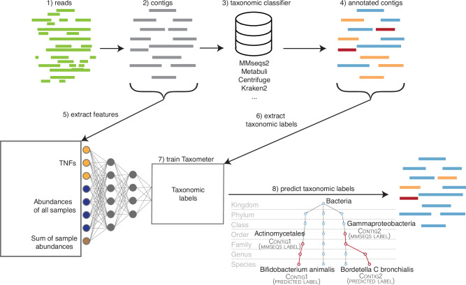
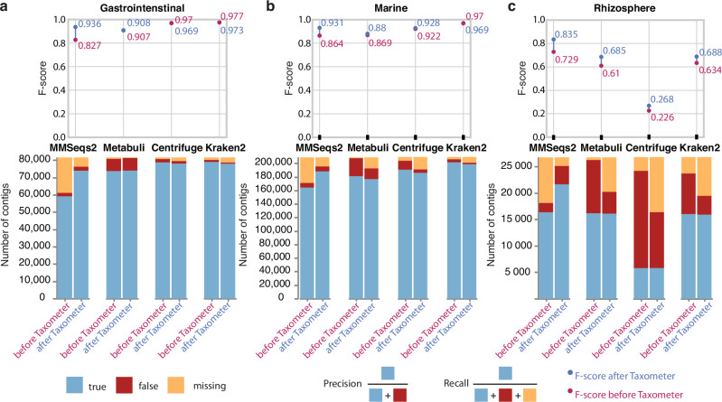
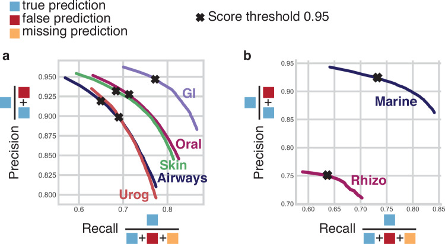
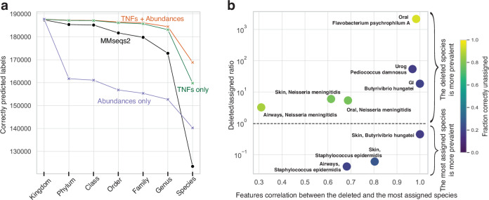
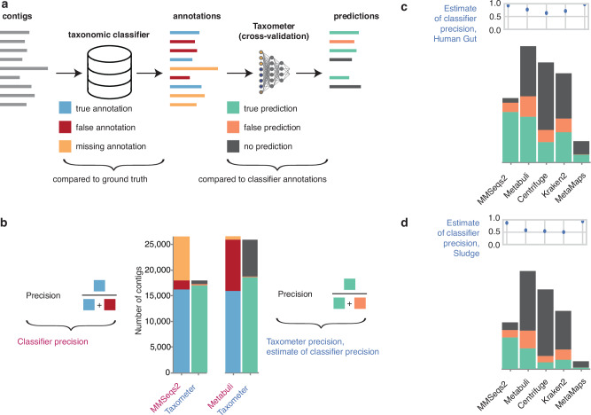

# Taxometer: Совершенствование таксономической классификации метагеномных контигов (contig; собранная из ридов более длинная последовательность)

> **Неофициальный перевод.** Оригинал: Svetlana Kutuzova, Mads Nielsen, Pau Piera, Jakob Nybo Nissen, Simon Rasmussen. «Taxometer: Improving taxonomic classification of metagenomics contigs». Nature Communications, 2024. DOI: [10.1038/s41467-024-52771-y](https://doi.org/10.1038/s41467-024-52771-y). Лицензия: CC BY 4.0.

## Аннотация

Для классификации собранных в ходе метагеномного анализа контигов по таксономическим группам в современных методах используется сходство последовательностей для определения наиболее вероятной таксономической принадлежности. Однако в смежной области метагеномного биннинга (binning) контиги обычно объединяются в кластеры на основе информации как о самих последовательностях, так и об их обилие (abundance). Мы предлагаем метод Taxometer, основанный на нейронных сетях; он позволяет улучшить аннотации и оценить качество любого таксономического классификатора с использованием профилей обилия контигов и частот встречаемости тетрануклеотидов. Мы применили Taxometer к пяти наборам данных, полученным с помощью коротких рид (read; короткий фрагмент ДНК после секвенирования) CAMI2; в результате средняя доля правильных аннотаций контигов на уровне видов в инструменте MMSeqs2 возросла с 66.6% до 86.2%. Кроме того, данный метод снизил в среднем в два раза долю неверных аннотаций на уровне видов в наборе данных Rhizosphere CAMI2 для инструментов Metabuli, Centrifuge и Kraken2. Далее мы использовали Taxometer для тестирования таксономических классификаторов на двух сложных наборах данных метагеномного анализа с длинными ридами, для которых отсутствуют эталонные данные (ground truth). Программное обеспечение Taxometer распространяется в открытом доступе и способно повысить точность любой таксономической аннотации метагеномных контигов.

## Введение

Метагеномные классификаторы присваивают ридам или контигам таксономическую информацию путем поиска схожих подстрок в референсной базе (reference database). Качество таких аннотаций зависит как от выбранного метода[1–8], так и от самой референсной базы (reference database); поэтому необходим тщательный подбор инструментов с учетом конкретных исследовательских задач. Ввиду высокой сложности метагеномных данных и неизбежной неполноты референсных баз (reference database) полная характеристика образцов обычно не достигается.

Большинство метагеномных классификаторов основываются на сходстве последовательностей и работают путем поиска в референсной базе совпадений для отдельных контигов. Если для какого-либо контига в базе данных не находится соответствий, его невозможно классифицировать. Однако в смежной области метагеномного биннинга контиги, принадлежащие к одному организму, успешно объединяются на основе сходства их характеристик — таких как тетрануклеотидные частоты (TNF) или обилие[9–14]. Эти связи используются для группировки контигов с целью реконструкции MAG из плохо изученных сред, для которых референсная база недостаточно полна; при этом использование самой референсной базы не требуется[15–17]. Биннинг подразумевает, что контиг, не имеющий соответствий в базе данных, может быть связан с контигом, имеющим такие соответствия, на основе сходства векторов характеристик.

Таксономическая метка представляет собой иерархический объект, содержащий последовательность таксономических рангов (taxonomic rank), начиная с самого высокого — типа — и заканчивая более конкретными обозначениями, например видом. Задачу классификации можно свести к предсказанию класса на выбранном таксономическом ранге (например, вида), который на этапе обучения задаётся в виде вектора «один-из-многих». Однако глубокая иерархическая функция потерь, широко применяемая, например, в области компьютерного зрения[18–20], учитывает филогенетическое сходство между истинным и предсказанным узлом, что позволяет моделировать потери для всей таксономической линии (lineage) вложенных меток. Подобные иерархические подходы для микробных данных ранее использовались для предсказания таксономии по различным типам данных, таким как последовательности рРНК[21,22] и данные фурье-спектроскопии в инфракрасном диапазоне[23,24]. Насколько нам известно, подобная функция потерь ещё не применялась в задачах таксономической классификации ДНК-последовательностей; в этих случаях предсказания либо ограничиваются одним таксономическим рангом[25–28], либо функциональность глубокой иерархической функции потерь имитируется путём последовательного соединения слоёв нейронной сети[29].

В данной работе мы предлагаем метод улучшения таксономического профилирования путем использования признаков, применяемых при биннинге. Наш метод, Taxometer, предназначен для работы с любым стандартным метагеномным набором данных, содержащим один или несколько образцов, требующих аннотации контигов. Taxometer основан на нейронной сети, использующей тетрануклеотидные частоты, обилие и таксономические метки, полученные от любого метагеномного классификатора. Благодаря вектору обилия Taxometer учитывает особенности экспериментов с несколькими образцами; насколько нам известно, подобный подход ранее в контексте таксономической классификации не применялся. Далее нейронная сеть обучается предсказывать таксономическую принадлежность для данного набора данных, используя подмножество контигов, уже имеющих аннотации. После этого обученная сеть применяется к остальным входным контигам; в результате получаются уточненные таксономические метки для всех контигов, включая те, у которых ранее не было таксономических обозначений (рис. 1). Поскольку таксономические метки содержат полный путь от корня таксономической иерархии до конкретного положения в дереве бактериальных таксонов, мы реализовали иерархическую функцию потерь, основанную на структуре дерева (дополнительный рис. 1). Это позволяет учитывать частичные аннотации, не охватывающие все таксономические уровни; кроме того, Taxometer способен производить предсказания на всех уровнях с оценками в диапазоне от 0.5 до 1. После отбора меток, соответствующих заданному пользователем порогу, в результате работы метода получаются уточненные таксономические аннотации, характеризующиеся большим числом истинно положительных результатов и меньшим числом ложноположительных по сравнению с исходной классификацией.

**Рис. 1.** Рабочий процесс: процедура таксономического профилирования с использованием Taxometer. После сборки метагеномных ридов контиги аннотируются с помощью любого таксономического классификатора. Далее контиги обрабатываются в рамках Taxometer с целью определения обилия и частот встречаемости тетрануклеотидов. На основе полученных признаков обучается модель Taxometer, предназначенная для предсказания таксономических аннотаций. Использование иерархической функции потерь позволяет обучать модель на аннотациях, относящихся ко всем таксономическим уровням. В результате для каждого контига формируются предсказания по всем таксономическим уровням (например, аннотация может быть дополнена от уровня порядка Actinomycetales до уровня вида Bifidobacteruim animalis). Для каждой аннотации выдается соответствующий балл.

## Результаты

### Усовершенствование аннотации контигов в метагеномике на основе коротких ридов

Для демонстрации того, что алгоритм Taxometer способен улучшать аннотации, выполняемые различными таксономическими классификаторами, мы обучили его на данных MMseqs2[3] и Metabuli[30], настроенных на использование базы данных GTDB[31], а также на данных Centrifuge[5] и Kraken2[2], настроенных на использование базы данных NCBI[32]. Для наборов данных человеческого микробиома CAMI2 мы установили, что MMseqs2 корректно аннотировал в среднем 66.6 % контигов на уровне видов (рис. 2a). При применении Taxometer, обученного на результатах аннотаций MMseqs2, доля корректно аннотированных контигов возросла до 86.2 %. Кроме того, при применении к двум более сложным наборам данных — Marine и Rhizosphere (CAMI2) — Taxometer повысил уровень аннотаций, выполняемых MMseqs2, с 78.6 % до 90 % и с 61.1 % до 80.9 % соответственно (рис. 2c). Это привело к увеличению значений F1-оценки аннотаций между 0.1 и 0.13 для наборов данных человеческого микробиома. При применении Metabuli, Centrifuge и Kraken2 к наборам данных человеческого микробиома CAMI2 они корректно аннотировали в среднем более 94.8 % контигов на уровне видов. В этом случае Taxometer не смог улучшить этот почти идеальный уровень аннотаций, однако и не снизил показатели эффективности (абсолютное изменение F1-оценки составило *<* 0.002). Однако при применении к наборам данных Marine и Rhizosphere эффективность всех трех методов значительно снизилась. Например, Metabuli давал неверные видовые аннотации для 12.7 % и 37.6 % контигов в этих наборах данных соответственно (рис. 2c, дополнительный рис. 2). В данном случае Taxometer сократил количество неверных аннотаций до 7.6 % и 15.4 %, повысив значения F1-оценки с 0.87 до 0.88 и с 0.61 до 0.69 соответственно. Аналогичным образом, при применении Centrifuge и Kraken2 к набору данных Rhizosphere Taxometer сократил количество неверных аннотаций с

**Рис. 2.** Результаты работы CAMI2: аннотации, полученные с помощью таксономических классификаторов, а также результаты работы Taxometer на уровне видов, сравнивались с эталонными данными при пороге уверенности 0.95. Программы MMseqs2 и Metabuli выдали GTDB аннотаций; программы Centrifuge и Kraken2 выдали NCBI аннотаций. Сравнение проводилось с этими эталонными данными. **(a)** Наборы данных CAMI2 «Желудочно-кишечный тракт», **(b)** CAMI2 «Морская среда» и **(c)** CAMI2 «Ризосфера». Исходные данные приводятся в файле с исходными данными.

68.7% и 39.5% (значение метрики F1 — от 0.22 до 0.27) а также 28.7% и 13.3% (значение метрики F1 — от 0.64 до 0.68) соответственно (вспомогательный рисунок 2). Несмотря на то, что Taxometer демонстрировал высокую точность при таксономической аннотации, он допускал ошибки: небольшая часть корректных аннотаций видового уровня, полученных с помощью программы MMseqs2, была им неверно переаннотирована (1.6%–3.3% в случае микробиома человека из набора CAMI2). Мы также провели аналогичный анализ на двух искусственно созданных сообществах: ZymoBIOMICS Microbial Community Standard, содержащем 10 штаммов, и ZymoBIOMICS Gut Microbiome Standard, содержащем 21 штамм (вспомогательные рисунки 3, 4). Программа Taxometer повысила качество таксономической аннотации в обоих искусственных сообществах; исключением стали программы Kraken2 и MetaMaps, показавшие исключительно высокую эффективность: после применения Taxometer их результаты не изменились (значение метрики F1 составило около 0.91). В случае программы MMseqs2 значение метрики F1 возросло с 0.28 до 0.847 для образца микробиома человека из набора ZymoBIOMICS и с 0.623 до 0.889 для образца искусственного микробного сообщества из того же набора. В заключение мы изучили влияние изменения порогового значения оценки качества аннотации; установлено, что порог 0.95 обеспечивает оптимальный баланс между полнотой и точностью при работе с множественными образцами (рисунок 3, вспомогательные рисунки 5, 6). В целом, мы пришли к выводу, что программа Taxometer способна устранять пробелы в аннотации и исправлять неверные таксономические метки у большого числа контигов из различных сред обитания; при этом лишь незначительная часть корректно аннотированных контигов получает неверные метки.

**Рис. 3.** Кривые точности и полноты. Кривые точности и полноты для предсказаний на уровне видов в сравнении с эталонными данными: **(a)** данные по микробиоме человека CAMI2, **(b)** наборы данных из морской среды и ризосферы. Значения, полученные при пороге оценки 0.95, отмечены крестиком. Исходные данные приводятся в файле с исходными данными.

### Использование как обилия, так и тетрануклеотидных частот позволило повысить точность прогнозов.

Учитывая способность Taxometer корректно предсказывать как верные, так и неверные аннотации, мы изучили вклад признаков обилие и тетрануклеотидные частоты в процесс предсказания. Для этого мы обучили Taxometer предсказывать аннотации, полученные с помощью MMseqs2, для наборов данных человеческого микробиома CAMI2, используя либо данные об обилие, либо данные о тетрануклеотидных частотах (рис. 4a, вспомогательный рис. 7). В результате было установлено, что на более высоких таксономических уровнях (от типа до рода) до 98% аннотаций Taxometer можно воспроизвести при обучении модели исключительно на основе тетрануклеотидных частот. Это согласуется с ранее полученными результатами, согласно которым тетрануклеотидные частоты позволяют классифицировать фрагменты метагеномных данных на уровне родов, а обилие обеспечивает более высокую точность при биннинге на уровне штаммов по сравнению с тетрануклеотидными частотами[14,33]. Количество правильно предсказанных видовых обозначений моделью, использовавшей одновременно тетрануклеотидные частоты и данные об обилие, оказалось на 18–35% выше, чем у моделей, применявших лишь тетрануклеотидные частоты или данные об обилие для аннотирования данных из набора CAMI2 Airways с помощью MMseqs2.

**Рис. 4.** Анализ важности признаков и новых таксонов. **а** Вклад признаков, связанных с обилием и тетрануклеотидными частотами, в эффективность работы алгоритма Taxometer при обработке коротких ридов из набора данных CAMI2 Airways. Количество корректно идентифицированных контигов на каждом таксономическом уровне при пороге оценки 0.5. **б** Моделирование ситуаций с неизвестными таксонами. По оси X отложен коэффициент корреляции Пирсона между средними векторами признаков удаленного и назначенного таксона. По оси Y — отношение числа контигов удаленного таксона («удаленный») к числу контигов таксона, наиболее распространенного среди некорректно идентифицированных («назначенный») в обучающей выборке. Цветовая легенда отражает долю корректно определенных таксонов, равную 1 − *FP*; FP обозначает долю ложноположительных результатов. Значение FP возрастает, если назначенный таксон более распространен в обучающей выборке, а тетрануклеотидные частоты и обилие между удаленным и назначенным таксонами сильно коррелируют. Исходные данные представлены в файле с исходными данными.

Поскольку вектор обилия являлся важной характеристикой для прогнозирования меток, мы изучили, улучшаются ли результаты аннотаций в том случае, если данный вектор состоит лишь из данных одного образца. Для этого мы использовали только те контиги, которые были получены из одного образца в каждом из 5 наборов данных о микробиоме человека: CAMI2 (Airways, Oral, Skin, Urogenital, Gastrointestinal). Мы установили, что применение Taxometer по-прежнему приводило к значительному улучшению результатов аннотаций с помощью алгоритма MMseqs2 (значение F1-балла для набора данных Airways возросло с 0.738 до 0.866); при этом показатели лучших классификаторов снижались лишь незначительно (наибольшее падение F1-балла наблюдалось для набора данных Skin: с 0.926 до 0.895). Это подтверждает наши предыдущие выводы, полученные при использовании вектора обилия, составленного из данных нескольких образцов (вспомогательный рисунок 8). Следовательно, применение Taxometer оказалось эффективным как в экспериментах с одним образцом, так и в экспериментах с несколькими образцами.

Большинство алгоритмов биннинга метагеномных данных также используют вектор **обилие**; поэтому мы провели сравнительное тестирование Taxometer с алгоритмом VAMB в качестве инструмента уточнения таксономических меток. Мы применили алгоритм VAMB к наборам данных CAMI2; в результате были получены **контиги**, отнесенные к различным бинам. Для каждого бина мы определили его таксономическую принадлежность, выбрав наиболее распространенную таксономическую метку среди всех входящих в него **контигов** с помощью таксономического классификатора Kraken2. Затем эту таксономическую метку присвоили каждому **контигу** данного бина. Сопоставив полученные метки с **эталонными данными**, мы установили, что точность таксономической классификации после применения данной процедуры оказалась ниже, чем при использовании как классификации Kraken2, так и метода уточнения классификации Kraken2, предложенного Taxometer (при применении метода биннинга правильно классифицировано 86% **контигов**, тогда как по результатам работы Kraken2 этот показатель составил 91%) (Вспомогательный рис. 9). Следовательно, сам по себе биннинг не может служить эффективным инструментом таксономического уточнения, несмотря на то, что в его основе лежит учет **обилие** **контигов**.

### На уровне рода были предсказаны новые виды.

Для изучения ограничений Taxometer мы исследовали его эффективность в ситуации, когда виды из исходного набора данных отсутствовали в базе данных. Для этого мы удалили аннотации пяти видов из результатов работы алгоритма MMseqs2 по анализу микробиома человека CAMI2 перед обучением Taxometer. В результате из каждого набора данных было удалено от 649 до 5127 аннотаций для контигов. Поскольку удаленные виды не входили в обучающий набор, идеальный классификатор должен был присваивать отсутствующие метки контигам, принадлежащим этим видам. В наших экспериментах Taxometer верно определил род для всех таких контигов. Однако доля некорректно присвоенных аннотаций на уровне видов варьировалась от 6% до 82% в зависимости от вида и набора данных. Для этих неверных аннотаций наиболее значимыми факторами оказались количество контигов удаленного и назначенного видов, а также средняя корреляция их признаков (рис. 4b). Мы установили, что ложноположительные результаты чаще возникают, когда назначенный вид встречается в обучающем наборе чаще, чем удаленный вид; например, в наборе данных Airways *Staphylococcus aureus* был присвоен 1312 из 1879 контигам, принадлежащим удаленному виду *Staphylococcus epidermidis*. Это объясняется тем, что обилие *Staphylococcus epidermidis* в обучающем наборе в 17 раз превышало обилие *Staphylococcus aureus*; при этом 78% всех контигов рода *Staphylococcus* принадлежали виду *Staphylococcus aureus*. Во-вторых, ошибки возникали в случаях, когда тетрануклеотидные частоты и обилие контигов сильно коррелировали между удаленным и назначенным видами. Например, в наборе данных Gastrointestinal 183 из 229 контигов удаленного вида *Butyrivibrio hungatei* были отнесены к виду *Butyrivibrio sp900103635*, у которого в обучающем наборе имелось всего 8 контигов; при этом коэффициент корреляции Пирсона между средними векторами признаков этих двух видов составил 0.99. Следовательно, для контигов нового таксона Taxometer может присвоить таксон, близкий по характеристикам, вместо того чтобы указать отсутствие соответствующей аннотации.

### Taxometer повысил точность распознавания аннотаций на всех уровнях уверенности.

Некоторые таксономические классификаторы предоставляют интерфейс для задания порогового значения уверенности в назначаемых таксономических метках. Поскольку это влияет на точность получаемых аннотаций, мы протестировали производительность Taxometer при пяти различных значениях уровня уверенности классификатора Kraken2 на наборах данных CAMI2 (вспомогательный рисунок 10). Например, при использовании набора данных CAMI2 Gastrointestinal и повышении уровня уверенности для Kraken2 до 0.977 значение F1-оценки снизилось с 0.0 при уровне уверенности 0.859 до 0.25; при уровне уверенности 0.825 значение составило 0.5, при 0.726 — 0.75, а при уровне уверенности 0.029 — лишь 1.0 (вспомогательный рисунок 11). В наборе данных Rhizosphere, где при стандартном уровне уверенности 0.0 показатель Kraken2 демонстрировал низкую точность, повышение уровня уверенности с 0.0 до 0.25 привело к росту F1-оценки с 0.715 до 0.717. В этом случае применение Taxometer позволило увеличить F1-оценку до 0.25 при уровне уверенности 0.731. Однако при дальнейшем повышении уровня уверенности до 0.5 и 0.75 значение F1-оценки для Kraken2 снизилось до 0.49 и 0.327 соответственно; при этом прогнозы Taxometer практически не изменились, оставаясь на уровне 0.72 при обоих значениях уровня уверенности (вспомогательный рисунок 12). В итоге фильтрация результатов работы классификатора по уровню уверенности способствует повышению точности, но снижает полноту распознавания. Мы продемонстрировали, что применение Taxometer к отфильтрованным результатам позволяет улучшить как полноту, так и точность, в результате чего значение F1-оценки возрастает.

### Taxometer в качестве инструмента для бенчмаркинга

Нас интересовало, как Taxometer справляется с аннотированием данных в метагеномике, полученных с использованием длинных ридов. Поскольку подходящего по размеру набора данных с эталонными данными не существовало, мы проанализировали стандартный образец ZymoBIOMICS Gut Microbiome Standard, содержащий 21 штамм и один образец. Несмотря на то, что вектор обилия включал лишь одно число, Taxometer позволил повысить значение F1-балла классификатора MMSeqs2 с 0.28 до 0.854; для других классификаторов наблюдалось улучшение показателя на уровне 0.0-0.05. Однако данный набор данных не отражал реальный масштаб и сложность реальных данных. Поэтому мы решили выяснить, можно ли использовать согласованность аннотаций, полученных с помощью Taxometer, в качестве критерия оценки эффективности классификатора при отсутствии эталонных данных. Поскольку метод биннинга в метагеномике позволяет получать сотни тысяч MAG-объектов, тетрануклеотидные частоты и обилие несут в себе важную информацию о контигах одного происхождения[17], мы выдвинули гипотезу: способность Taxometer предсказывать результаты аннотирования классификатором может служить показателем его эффективности. В частности, чем больше неверных меток классификатор присваивает контигам одного происхождения, тем сложнее будет Taxometer воспроизвести эти метки. Следовательно, несогласованность аннотаций, создаваемых классификатором, приведет к снижению оценки, выставляемой Taxometer любому таксону в наборе данных. Таким образом, оценки, выдаваемые Taxometer, могут служить индикатором согласованности работы классификатора.

Для проверки этого мы получили аннотации, сделанные четырьмя классификаторами для семи наборов данных CAMI2, а также стандартных образцов ZymoBIOMICS Microbial Community Standard и ZymoBIOMICS Gut Microbiome Standard; кроме того, для последнего образца был применен дополнительный классификатор MetaMaps. В итоге было получено 37 наборов таксономических меток. Каждый набор данных был разделен на пять частей; затем Taxometer обучался предсказывать аннотации каждого классификатора пять раз, при этом каждый раз новая часть использовалась в качестве тестового набора. Далее мы сравнивали степень соответствия предсказаний Taxometer аннотациям конкретного классификатора и **эталонным данным** (рис. 5a, c, дополнительный рис. 13, табл. 1). Оказалось, что корреляция между метриками точности предсказаний Taxometer и аналогичными метриками классификаторов по Спирмену равна 1.0 в 3 из 9 наборов данных, что свидетельствует об идеальном ранжировании; в 8 из 9 наборов данных этот показатель превышает 0.78, что означает наличие лишь одного неправильно ранжированного классификатора (рис. 5b, дополнительный рис. 14, табл. 1). Также мы заметили, что в том наборе данных, где ранжирование по точности Taxometer давало наихудшие результаты (отрицательная корреляция по Спирмену), речь шла об образце микробного сообщества, содержащем всего 303 **контига** и лишь один образец. Следовательно, при отсутствии **эталонных данных** точность предсказаний Taxometer относительно меток, присвоенных классификаторами, может служить критерием для оценки различных таксономических классификаторов в рамках одного набора данных.

**Рис. 5.** Сравнительный анализ таксономических профилировщиков и обработка наборов данных, полученных с использованием длинных ридов. **а** Описание метода оценки по схеме k-кратной перекрестной проверки. Прогнозы, полученные с помощью Taxometer, сравниваются с аннотациями, созданными классификаторами, а не с эталонными данными. **б** Пример количества истинно положительных, ложно положительных и ложно отрицательных результатов, используемых при k-кратной перекрестной проверке на уровне видов для набора данных Rhizosphere; рассматриваются классификаторы MMseqs2 и Metabuli. Общее число контигов, по которым делаются прогнозы с помощью Taxometer, совпадает с количеством аннотаций, изначально выданных классификатором. **в**, **г** Результаты k-кратной перекрестной проверки на реальных наборах данных длинных ридов, полученных от человеческой кишечной микрофлоры и сточных вод. Исходные данные приводятся в файле с исходными данными.

### Сравнительная оценка качества аннотаций контигов в наборах данных, полученных с использованием длинных ридов

Затем мы нашли два набора данных ридов PacBio HiFi для сложных метагеномов; 4 образца из микробиома кишечника человека и 3 образца из ила анаэробного реактора[34]. У этих наборов не было эталонных меток, и при применении классификаторов на основе GTDB или NCBI они расходились для 28%–39% контигов на уровне аннотаций вида (Supplementary Fig. 15). Поэтому мы применили описанную выше схему k-fold evaluation, чтобы использовать точности Taxometer для бенчмарка классификаторов. MetaMaps имел наивысшую точность 0.95, но также наименьшую долю аннотированных контигов на уровне вида (16%, тогда как MMseqs2 аннотировал 49%). У MMseqs2 была вторая по величине точность, т.е. 0.84 для набора данных кишечника человека (Metabuli 0.68, Centrifuge 0.62, Kraken2 0.68) (Fig. 5d, Supplementary Fig. 16a). Значения точности и полноты для классификатора MMseqs2 лежали в диапазоне значений для наборов CAMI2 ([0.8,0.95] для точности и [0.6,0.85] для полноты) (Supplementary Fig. 16b). Это согласовалось с работой классификаторов на самом сложном наборе CAMI2, Rhizosphere, и поэтому мы заключили, что MMseqs2 дал наиболее точные аннотации как для микробиома кишечника человека, так и для наборов ила по сравнению с любым из других классификаторов.

## Обсуждение

В целом, Taxometer способен повысить точность таксономических аннотаций, создаваемых любым классификатором метагеномных данных на уровне контигов. Важно отметить, что поскольку обилие контигов в каждом наборе данных уникально, Taxometer обучается заново для каждого конкретного набора данных. Следовательно, несмотря на то, что Taxometer разработан как метод глубокого обучения с учителем, мы не производим передачу модели, не пытаемся обеспечить её обобщаемость на различные наборы данных и не проводим предварительное обучение на других наборах данных.

При тестировании на аннотациях двух таксономических классификаторов по нескольким реальным и смоделированным наборам данных Taxometer и заполнял пробелы в аннотациях, и удалял неверные метки. Кроме того, Taxometer спроектирован как легковесный инструмент, менее вычислительно затратный, чем сами таксономические аннотации. Например, аннотация наборов CAMI2 и длинных ридов с помощью MMSeqs2 заняла 2–4 ч, тогда как обучение Taxometer на одном GPU заняло <30 мин для всех наборов данных (доп. рис. 17). Аналогично обучение можно было выполнить на CPU за 10–120 мин.

Кроме того, Taxometer предоставляет метрику для оценки качества аннотаций в отсутствие эталонных данных. Анализ наборов данных, полученных с использованием длинных ридов, показал, что результаты остаются стабильными независимо от применяемых технологий секвенирования. Основным ограничением применения Taxometer к метагеномным наборам данных является необходимость наличия информации на уровне отдельных ридов для расчёта обилия контигов в конкретном наборе данных. Поэтому Taxometer невозможно использовать для аннотирования контигов, загруженных из крупных баз данных, при отсутствии подобной информации. Тем не менее, качество таксономических аннотаций можно повысить в любом метагеномном эксперименте, в котором имеются соответствующие данные на уровне ридов; таким экспериментом может быть как лабораторное исследование, так и анализ данных, доступных для загрузки из SRA или ENA. Следовательно, мы считаем, что Taxometer весьма пригоден для улучшения аннотаций практически во всех метагеномных наборах данных.

При тестировании Taxometer на наборах данных, полученных с использованием коротких ридов, мы обнаружили, что для 6 из 7 наборов данных CAMI2 (Airways, Oral, Skin, Urogenital, Gastrointestinal и Marine) проверяемые таксономические классификаторы демонстрировали почти идеальную точность, из-за чего сравнивать их эффективность оказалось сложно. Хотя наборы данных CAMI2 по-прежнему являются стандартом в оценке методов биннинга метагеномов и таксономических классификаторов, их использование подчеркивает необходимость в более сложных синтетических наборах данных, лучше отражающих реальные условия. При тестировании Taxometer на данных, полученных с помощью длинных ридов, мы столкнулись с обратной проблемой: отсутствием соответствующего синтетического набора данных с таксономическими аннотациями для контигов. В связи с этим не удалось провести аналогичный анализ, как в случае с наборами данных коротких ридов, используя k-кратную оценку и возможности Taxometer для тестирования таксономических классификаторов. Появление новых методов в области таксономической аннотации и биннинга метагеномов требует создания новых синтетических наборов данных как для технологий коротких, так и длинных ридов, с параметрами, сопоставимыми с реальными данными.

Хотя Taxometer использует вектор обилия, аналогичный подходу метагеномных биннеров вроде VAMB, простое присвоение всем контигам внутри бина метки таксона, наиболее часто встречающегося в данных, приводит к ухудшению качества аннотаций. Это подчеркивает важность сетевой структуры Taxometer и иерархической функции потерь.

Taxometer применяет плоскую иерархическую функцию потерь типа softmax для учета структуры таксономических меток. Хотя иерархические функции потерь в области глубокого обучения не являются чем-то новым, их применение к таксономическим меткам в задачах **биннинг** метагеномов и таксономической классификации пока остается редкостью. В будущих исследованиях можно было бы изучить различные иерархические функции потерь в рамках метагеномных инструментов на основе глубокого обучения; это, вероятно, позволит улучшить процессы **биннинг** и классификации. Кроме того, Taxometer использует **тетрануклеотидные частоты** для анализа ДНК-информации в каждом **контиге** с помощью многослойного перцептрона. Возможно, данный подход к формированию признаков в будущем будет заменен более универсальной основной моделью для работы с ДНК. В таком случае в качестве входных данных для Taxometer будут выступать либо весь **контиг**, либо его эмбеддинг, полученный с помощью такой основной модели, а не извлеченные **тетрануклеотидные частоты**. Дальнейшие исследования в этом направлении предполагают сравнительный анализ различных основных моделей и оценку их способности формировать осмысленные эмбеддинги **контигов** в контексте метагеномных данных. Сочетание подобной модели, предварительно обученной на большом количестве соответствующих геномов, с иерархической функцией потерь, описанной в данной работе, представляет собой перспективное направление для развития методов таксономической классификации.

Применение метода биннинг для классификации последовательностей ДНК в сочетании с использованием глубокой иерархической функции потерь открывает путь к дальнейшим достижениям в области глубокого обучения при работе с метагеномными данными. Taxometer может применяться к результатам любого классификатора метагеномов, использующего любую филогению бактерий, что делает его пригодным для широкого спектра областей и биоинформатических процедур.

## Методы

### Наборы данных для оценки

Для тестирования на коротких ридах мы использовали синтетические наборы данных CAMI2, полученные из пяти человеческих микробиомов (дыхательных путей, ротовой полости, кожи, мочеполовой системы и желудочно-кишечного тракта) и двух окружающих микробиомов (морского и ризосферного)[35]. При проведении оценок по методике CAMI2 мы сопоставляли результаты работы таксономических классификаторов и Taxometer с предоставленными эталонными данными для каждого контига.

Мы провели тестирование двух стандартов микробных сообществ от ZymoBIOMICS: ZymoBIOMICS Microbial Community Standard, содержащий 8 бактериальных штаммов и 2 дрожжевых штамма, секвенированных с использованием технологии коротких ридов, и ZymoBIOMICS Gut Microbiome Standard, включающий 21 штамм, секвенированный с применением технологии длинных ридов. Для получения аналога эталонных данных мы сопоставили контиги с предоставленными референсными геномами (reference genome) с помощью программы BLAST; в качестве эталонных данных использовались результаты с наивысшим баллом для каждого контига. Чтобы обеспечить совместимость анализа с базой данных GTDB, мы учитывали лишь те контиги, которые сопоставились с бактериальными геномами; в итоге было выделено 303 и 84 контига соответственно.

Мы также провели тестирование Taxometer с использованием двух реальных наборов данных длинных ридов от PacBio HiFi: набора данных «микрофлора кишечника человека», полученного из образцов человеческих фекалий [34], и набора данных «осадок», полученного из осадка анаэробного биореактора (идентификаторы в базе ENA: ERR10905741–ERR10905743). Поскольку синтетических наборов данных длинных ридов с эталонными данными не существует, оценка производилась на реальных наборах данных методом k-кратной перекрестной проверки.

### Предварительная обработка данных

Для бенчмарка на коротких ридах мы использовали sample-specific сборки для семи наборов данных CAMI2: Airways (10 samples), Oral (10 samples), Skin (10 samples), Gastrointestinal (10 samples), Urogenital (9 samples), Marine (10 samples), Rhizosphere (21 samples) и ZymoBIOMICS Microbial Community Standard with 1 sample. Для каждого набора мы выравнивали синтетические короткие парные риды из каждого образца с помощью bwa-mem (v.0.7.15)[36] на конкатенацию per-sample контигов данного набора. BAM-файлы сортировали с помощью samtools (v.1.14)[37]. Для всех наборов использовали только контиги ≥ 2000 base pairs (bp). Для бенчмарка на длинных ридах использовали ZymoBIOMICS Gut Microbiome Standard with 1 sample, набор микробиома кишечника человека with 4 samples и набор из anaerobic digester sludge with 3 samples[38], оба секвенированы с помощью Pacific Biosciences HiFi technology. Каждый образец собирали с помощью metaMDBG (v. b55df39)[39], риды картировали с помощью minimap2 (v.2.24)[40] с параметром ’-ax map-hifi’, и далее поступали так же, как для коротких ридов.

### Обилие и тетрануклеотидные частоты

Расчёт обилия и тетрануклеотидных частот выполнялся с помощью инструмента для метагеномного биннинга VAMB[14]. Для определения тетрануклеотидных частот для каждого контига вычислялись частоты тетрануклеотидов из неоднозначных оснований; затем эти данные проецировались в 103-мерное ортонормированное пространство и нормализовались посредством z-масштабирования для каждого тетрануклеотида по всем контигам. Для определения обилия каждого образца использовался инструмент pycoverm (v.0.6.0)[41]. Сначала обилие нормализовалось внутри каждого образца по общему числу отображённых ридов, а затем — между всеми образцами так, чтобы сумма значений равнялась 1. Для определения относительного обилия образца суммировались значения обилия для каждого контига до проведения нормализации между образцами. В результате размерность таблицы признаков составила *N**c* × (103+*N**s* + 1), где *N**c* — количество контигов, а *N**s* — количество образцов.

### Эталонные данные

Для пяти наборов микробиома человека CAMI2 предоставленные последовательности геномов классифицировали инструментом GTDB-tk[42] (v.2.4.0), в результате чего все контиги были аннотированы до уровня вида идентификаторами GTDB[31]. Эталонные метки для наборов Marine и Rhizosphere конвертировали из NCBI[43] в GTDB (v.207) с помощью инструмента *gtdb to taxdump* (v.0.1.9), доступного по адресу [https://github.com/nick-youngblut/gtdb_to_taxdump](https://github.com/nick-youngblut/gtdb_to_taxdump) (commit hash 24b82d6). Не все метки NCBI имели соответствие 1-to-1 в GTDB, и не все контиги в наборе CAMI2 были аннотированы до уровня вида. Итоговое число полностью аннотированных контигов, использованных в анализе, составило 208 783 из 438 686 контигов (48%) для набора Marine и 26 734 из 300 222 контигов (9%) для набора Rhizosphere. Эталонные данные (ground truth) — таксономические метки для стандартов ZymoBIOMICS Microbial Community Standards мы аппроксимировали следующим образом. Контиги каждого набора картировали на предоставленные референсные геномы с помощью NCBI-BLAST (v2.15.0). Для каждого контига в качестве эталонной метки брали хит с наибольшим bit-score.

### Таксономические классификаторы

Мы получили таксономические аннотации для всех контигов из семи наборов данных с короткими ридами и двух наборов данных с длинными ридами с помощью программ MMseqs2 (v.7e2840)[3], Metabuli (v.1.0.1)[30], Centrifuge (v1.0.4)[5] и Kraken2 (v2.1.3)[2]. Для набора данных с длинными ридами мы также получили аннотации с использованием программы MetaMaps (v.633d2e)[44]. В работе с MMseqs2 мы применяли команду *mmseqs taxonomy*. Для программы Metabuli использовалась команда *metabuli classify* с флагом *–seq-mode 1*. Для программы Centrifuge применялась команда *centrifuge* с флагом *-k 1*. Для программы Kraken2 использовалась команда *kraken* с флагом *–minimum-hit-groups 3*. В экспериментах по определению уровня достоверности для программы Kraken2 применялась команда *kraken* с флагами *–confidence-level* со значениями 0.0, 0.25, 0.5, 0.75 и 1.0. В программах MMseqs2 и Metabuli в качестве референсной базы использовалась версия GTDB v207. Программы Centrifuge, Kraken2 и MetaMaps были настроены на использование идентификаторов из референсной базы NCBI.

### Архитектура сети и гиперпараметры

Входной вектор размерности *N**c* × (103 + *N**s* + 1), описанный в подразделе «Обилие (abundance) и тетрануклеотидные частоты (TNF)», пропускали через 4 полносвязных слоя ((103 + *N**s* + 1) × 512, 512 × 512, 512 × 512, 512 × 512) с функцией активации leaky ReLU (отрицательный наклон 0.01), каждый со batch normalization (epsilon 1*e* − 05, momentum 0.1) и dropout (*P* = 0.2). Выходной слой имел размерность 512× *N**l*, где *N**l* — число листьев в таксономическом дереве (см. подраздел 4). Выход — вектор размерности *N**l*, где *N**l* — число видов в таксономическом дереве. Элементы выхода — логиты, которые при вычислении иерархической функции потерь (описана в следующем подразделе) проходят softmax. Для всех наборов сеть обучали 100 эпох с batch size 1024 оптимизатором Adam; learning rate задавали через D-Adaptation[45]. Модель реализовали в PyTorch (v.1.13.1)[46], а при запуске на GPU V100 использовали CUDA (v.11.7.99).

### Иерархическая функция потерь

Для каждого набора данных был построен таксономический дерево на основе аннотаций классификатора, относящихся к совокупности контигов. В результате полученное таксономическое дерево *T* представляло собой подграф полного таксономического дерева; пространство возможных предсказаний ограничивалось таксономическими единицами, присутствующими в результатах поиска. Для обучения модели использовалась плоская функция потерь типа softmax, рассчитываемая следующим образом. Пусть *N**l* обозначает количество листьев в дереве *T*. Сеть выдает вектор логитов размерности *N**l*; каждый элемент этого вектора соответствует значению для одного из листьев таксономического дерева. Вероятности принадлежности к листьям дерева вычисляются с помощью функции softmax от вектора выходных данных сети. Внутренние узлы дерева не входят в число выходных элементов, поэтому их вероятность определяется как сумма вероятностей всех дочерних узлов и вычисляется рекурсивно снизу вверх. Итоговый выходной вектор модели содержит вероятности для всех возможных меток, включая внутренние узлы. При обратном распространении ошибки вычисляется отрицательный логарифм вероятности для всех предков истинного узла, а также для самого истинного узла. Например, если истинная метка относится к уровню рода, её вероятность равна сумме вероятностей всех видов, принадлежащих этому роду; при этом в выходной вектор сети явно включаются лишь логиты, относящиеся к видам. Предсказания делались для всех таксономических уровней. Для каждого уровня, начиная с корневого уровня домена, выбирался дочерний узел с наибольшей вероятностью; этот узел включался в итоговый вывод модели, записываемый в CSV-файл. Если ни один дочерний узел не имел вероятности, превышающей 0.5, предсказания для данного уровня и всех нижележащих уровней в вывод не включались.

### K-кратная оценка

Все контиги в наборе данных, которые были аннотированы классификатором, случайным образом разделяются на пять групп. Затем Taxometer обучается пять раз: в каждом случае одна группа используется в качестве валидационного набора, а остальные четыре — в качестве обучающего набора. После обучения сети на четырех группах делаются предсказания для пяти валидационных наборов. Впоследствии эти пять валидационных наборов объединяются, вновь образуя полный набор данных. Таким образом, предсказание для каждого контига делается без предварительного знания о его аннотации, сделанной классификатором. Метрика F1-оценки, применявшаяся для оценки качества работы классификаторов в рамках набора данных, рассчитывается следующим образом:

$${precision}=\frac{{TP}}{{TP}+{FP}}$$

$${recall}=\frac{{TP}}{{TP}+{FP}+{FN}}$$

$$F1\_{score}=\frac{2 \cdot {precision} \cdot {recall}}{{precision}+{recall}}$$

, где *TP* (истинно положительные результаты) — общее количество контигов, для которых предсказание Taxometer совпадает с аннотацией классификатора; *FP* (ложно положительные результаты) — общее количество контигов, для которых предсказание Taxometer не совпадает с аннотацией классификатора; *FN* (ложно отрицательные результаты) — случаи, когда предсказание Taxometer отсутствует, но аннотация классификатора имеется. Для данной оценки пороговое значение составляло 0.5.

### Краткое описание результатов

Дополнительная информация о дизайне исследования содержится в Nature Portfolio Reporting Summary, размещённом по ссылке в данной статье.

## Дополнительная информация

Дополнительная информация

Дополнительная информация

Краткое описание отчета

## Исходные данные

Исходные данные

**Примечание издателя** Издательство Springer Nature сохраняет нейтральность в отношении юрисдикционных претензий, указанных на опубликованных картах, а также в отношении принадлежности организаций к той или иной юрисдикции.

Авторы внесли равный вклад в работу: Якоб Нюбо Ниссен, Симон Расмуссен.

## Дополнительная информация

В онлайн-версии представлены дополнительные материалы, доступные по ссылке 10.1038/s41467-024-52771-y.

## Благодарности

С.К., М.Н. и С.Р. получали поддержку от Фонда Novo Nordisk (гранты NNF19SA0059348). П.П., Дж.Н.Н. и С.Р. также получали поддержку от Фонда Novo Nordisk (грант NNF20OC0062223). С.К., П.П., Дж.Н.Н. и С.Р. получали поддержку от Фонда Novo Nordisk (гранты NNF23SA0084103 и NNF14CC0001). С.Р. получал поддержку от Фонда Novo Nordisk (грант NNF21SA0072102).

## Участие авторов

С.К., Дж.Н.Н. и С.Р. разработали план экспериментов. П.П. и Дж.Н.Н. выполнили предварительную обработку наборов данных. С.К. написал программное обеспечение и провёл анализ. М.Н., П.П., Дж.Н.Н. и С.Р. давали рекомендации и вносили свой вклад в проведение анализа. С.К. подготовил черновик рукописи при участии всех соавторов. Все авторы рид (read) рукопись и одобрили её окончательную версию.

## Рецензирование

### Информация о рецензировании

Журнал *Nature Communications* выражает благодарность Луису Педро Коэльо, Юньси Лю и Джеймсу Мортону за их участие в рецензировании данной работы. Файл с результатами рецензирования доступен для ознакомления.

## Доступность данных

Наборы данных CAMI2 были загружены с сайта [https://data.cami-challenge.org/participate](https://data.cami-challenge.org/participate) из разделов «2nd CAMI Toy Human Microbiome Project Dataset» (5 наборов данных по микробиоме человека), «2nd CAMI Challenge Marine Dataset» (морская среда) и «2nd CAMI Challenge Rhizosphere challenge» (ризосфера). Набор данных по микробиому человека, полученный с использованием технологии длинных ридов, доступен по адресу [https://downloads.pacbcloud.com/public/dataset/Sequel-IIe-202104/metagenomics/](https://downloads.pacbcloud.com/public/dataset/Sequel-IIe-202104/metagenomics/). Набор данных по сточным водам, полученный с применением технологии длинных ридов, размещен в базе данных ENA в рамках исследования с идентификатором PRJEB39861. Наборы данных ZymoBIOMICS доступны на сайтах [https://zymoresearch.eu/collections/zymobiomics-microbial-community-standards/products/zymobiomics-gut-microbiome-standard](https://zymoresearch.eu/collections/zymobiomics-microbial-community-standards/products/zymobiomics-gut-microbiome-standard) и [https://zymoresearch.eu/collections/zymobiomics-microbial-community-standards/products/zymobiomics-microbial-community-standard](https://zymoresearch.eu/collections/zymobiomics-microbial-community-standards/products/zymobiomics-microbial-community-standard). Все данные, полученные в ходе данного исследования, представлены в виде исходных данных. Файлы Исходные данные прилагаются к данной статье.

## Доступность кода

Весь код доступен на GitHub по адресу [https://github.com/RasmussenLab/vamb](https://github.com/RasmussenLab/vamb) и распространяется свободно в соответствии с либеральной лицензией MIT[47].

## Конфликт интересов

С.Р. является основателем и владельцем компании BioAI. Остальные авторы заявляют об отсутствии конфликта интересов.

## Список литературы

1.
2. Wood, D. E., Lu, J. & Langmead, B. Improved metagenomic analysis with kraken 2. Genome Biol.20, 257 (2019). doi:10.1186/s13059-019-1891-0
3.
4.
5.
6. Blanco-M´ıguez, A. et al. Extending and improving metagenomic taxonomic profiling with uncharacterized species using MetaPhlAn 4. Nat. Biotechnol. 47, 1633–1644 (2023). doi:10.1038/s41587-023-01688-w
7. Milanese, A. et al. Microbial abundance, activity and population genomic profiling with mOTUs2. Nat. Commun.10, 1014 (2019). doi:10.1038/s41467-019-08844-4
8. Portik, D. M., Brown, C. T. & Pierce-Ward, N. T. Evaluation of taxonomic classification and profiling methods for long-read shotgun metagenomic sequencing datasets. BMC Bioinform.23, 541 (2022). doi:10.1186/s12859-022-05103-0
9.
10.
11.
12.
13.
14.
15.
16.
17.
18. Morin, F. & Bengio, Y. Hierarchical probabilistic neural network language model. In Proc. Tenth International Workshop on Artificial Intelligence and Statistics. 246–252 (PMLR, 2005).
19. Redmon, J., Divvala, S., Girshick, R. & Farhadi, A. You only look once: unified, real-time object detection. arXiv10.48550/arXiv.1506.02640 (2016).
20. Valmadre, J. Oh, A. H., Agarwal, A., Belgrave, D. & Cho, K. (eds) Hierarchical classification at multiple operating points. Adv. Neural Inform. Process. Syst.10.48550/arXiv.2210.10929 (2022).
21.
22.
23.
24.
25.
26.
27. Xiao, L., Deng, L. & Liu, X. Metagenomic sequence classification based on one-dimensional convolutional neural network. In Proc. 2022 11th International Conference on Computing and Pattern Recognition. 191–196 (Association for Computing Machinery, New York, NY, USA, 2023).
28.
29.
30. Kim, J. & Steinegger, M. Metabuli: sensitive and specific metagenomic classification via joint analysis of amino-acid and DNA. Nat. Methods21, 971–973 (2023). doi:10.1038/s41592-024-02273-y
31.
32.
33.
34. BioSciences, P. Data Release: Human Microbiome Samples Demonstrate Advances in Hifi-Enabled Metagenomic Sequencing. https://downloads.pacbcloud.com/public/dataset/Sequel-IIe-202104/metagenomics/ (2023).
35.
36. Li, H. Aligning sequence reads, clone sequences and assembly contigs with bwamem. arXiv Genom.10.48550/arXiv.1303.3997 (2013).
37.
38.
39. Benoit, G. et al. Efficient High-Quality Metagenome Assembly from Long Accurate Reads using Minimizer-space de Bruijn Graphs.https://www.biorxiv.org/content/10.1101/2023.07.07.548136v1 (2023).
40.
41. Camargo, A. Apcamargo/pycoverm: Simple Python Interface to CoverM’s Fast Coverage Estimation Functions.https://github.com/apcamargo/pycoverm/tree/main (2023).
42.
43.
44.
45. Defazio, A. & Mishchenko, K. Learning-rate-free learning by d-adaptation. In Proc. 40th International Conference on Machine Learning. 7449–7479 (PMLR, 2023).
46. Paszke, A. et al. PyTorch: An imperative style, high-performance deep learning library. In Proc. 33rd Conference on Neural Information Processing Systems. 8026–8037 (NeurIPS, 2019).
47.
