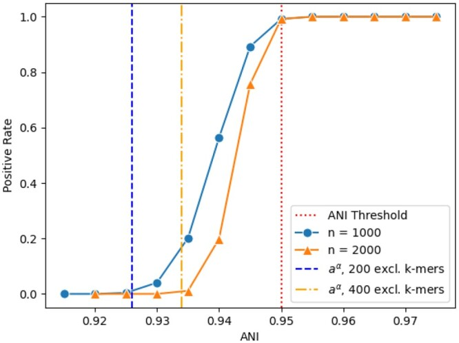
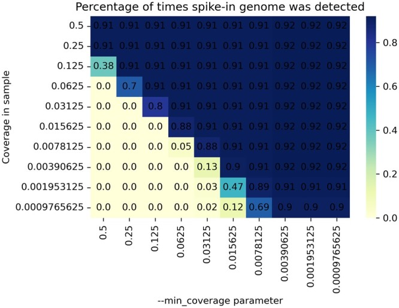
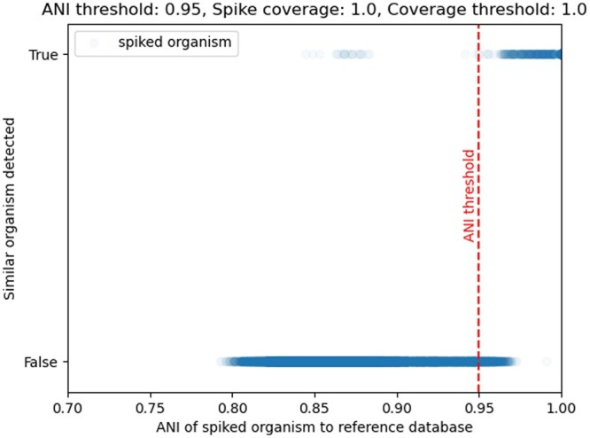
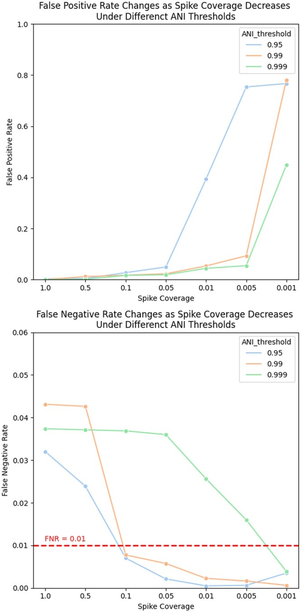
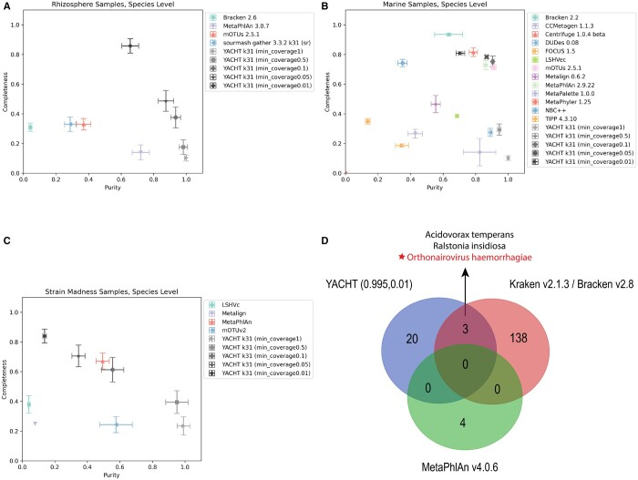

# `YACHT`: это статистический тест, основанный на показателе средней нуклеотидной идентичности (ANI), предназначенный для определения наличия или отсутствия микроорганизмов в метагеномном образце.

> **Неофициальный перевод.** Оригинал: David Koslicki, Stephen White, Chunyu Ma, Alexei Novikov. «YACHT: an ANI-based statistical test to detect microbial presence/absence in a metagenomic sample». Bioinformatics, 2024. DOI: [10.1093/bioinformatics/btae047](https://doi.org/10.1093/bioinformatics/btae047). Лицензия: CC BY 4.0.

## Аннотация

В метагеномике, науке, изучающей микробные сообщества в окружающей среде на основе анализа взятой у них ДНК, одной из базовых вычислительных задач является определение того, какие геномы из референсной базы (reference database) присутствуют или отсутствуют в конкретном метагеноме образца. Существующие инструменты, как правило, выдают точечные оценки, не сопровождая их данными о достоверности или степени неопределенности. Это создает трудности для исследователей при интерпретации полученных результатов, особенно в случае организмов с низким обилием (abundance); такие организмы часто попадают в зону ошибочных предсказаний. Кроме того, лишь немногие инструменты учитывают тот факт, что референсные базы (reference database) зачастую неполны и крайне редко содержат точные копии геномов, присутствующих в метагеноме природного происхождения.

Мы предлагаем решения данных проблем, представив алгоритм `YACHT`: **Y**es/No **A**nswers to **C**ommunity membership via **Hypothesis Testing** (Ответы «да»/«нет» на вопрос о принадлежности к сообществу посредством проверки статистических гипотез (hypothesis testing)). Данный подход предполагает использование статистической модели, учитывающей различия в последовательностях между референсным геномом (reference genome) и геномами образцов, выраженные через показатель средней нуклеотидной идентичности (ANI), а также неполноту данных секвенирования. Это позволяет проводить проверку статистических гипотез (hypothesis testing) с целью определения наличия или отсутствия референсного генома в анализируемом образце. После описания подхода мы оцениваем его статистическую мощность и зависимость этой величины от различных параметров. Затем проводятся обширные эксперименты с использованием как смоделированных, так и реальных данных для подтверждения точности и масштабируемости предложенного метода.

Исходный код, реализующий данный подход, доступен через Conda и по адресу [https://github.com/KoslickiLab/YACHT](https://github.com/KoslickiLab/YACHT). Мы также предоставляем код для воспроизведения экспериментов по адресу [https://github.com/KoslickiLab/YACHT-reproducibles](https://github.com/KoslickiLab/YACHT-reproducibles).

## 1 Введение

### 1.1 Предыстория и контекст

В метагеномике, то есть в области изучения микробных сообществ посредством анализа ДНК, отобранной из окружающей среды, наблюдается растущий интерес к так называемой «редкой микробиоте» ([Sogin et al. 2006], [Reveillaud et al. 2014], [Ainsworth et al. 2015], [Noecker et al. 2017], [Rocca et al., 2020], [Cao et al. 2021]). Речь идет о микроорганизмах или таксонах, имеющих низкое относительное обилие в конкретном образце, в котором присутствует множество экологически важных микробов ([Jousset et al. 2017]). Однако вычислительные методы, позволяющие определять наличие и относительное обилие микроорганизмов в метагеномных образцах — так называемые «методы профилирования» — зачастую не способны различать статистический шум и микроорганизмы с низким относительным обилием ([Mande et al. 2012], [Shakya et al. 2013], [Sczyrba et al. 2017], [Meyer et al. 2022]). Вследствие этого исследователи часто прибегают к фильтрации полученных профилей на основе определенного порога обилия: игнорируют предсказания инструментов относительно таксонов с относительным обилием ниже заданного порога ([Simon et al. 2019]) либо удаляют элементы с наименьшим обилием до тех пор, пока не будет достигнуто требуемое количество удаленных данных ([Meyer et al. 2022]). Подобные подходы носят произвольный характер; при этом отсутствуют четкие рекомендации по выбору порогов ([Cao et al. 2021]), а их применение негативно сказывается как на анализе и интерпретации микробных сообществ ([Schloss 2020], [Jia et al. 2022]), так и на эффективности самих методов профилирования ([Meyer et al. 2022]). Существуют более сложные методы фильтрации, однако они обычно ориентированы лишь на конкретные числовые показатели (например, сохранение взаимной информации ([Mokhtari and Ridenhour 2022]) или максимизацию ковариации ([Smirnova et al. 2019])); кроме того, они часто игнорируют биологически значимые факторы, такие как молекулярная эволюция, ошибки секвенирования и низкая частота выборки (за некоторыми исключениями, включая [Piro et al. (2016)]). В результате современные специалисты в области микробиологии располагают лишь ограниченным набором инструментов, позволяющих достоверно утверждать о наличии того или иного микроорганизма в образце при низком его обилии либо исключать его как статистический шум. Это негативно влияет на изучение редкой микробиоты; в некоторых случаях приводит даже к серьезным ошибкам в определении присутствия или отсутствия микроорганизмов в образцах (например, случай с чумой в нью-йоркском метро ([Ackelsberg et al. 2015], [Afshinnekoo et al. 2015], [Gonzalez et al. 2016])).

Мы решаем эту проблему, разрабатывая теоретически обоснованный статистический тест для определения наличия или отсутствия микроорганизма в метагеномном образце с учетом ограничений по глубине секвенирования и эволюционных различий между референсным геномом и геномом образца. Мы описываем данный метод, математически характеризуем его и демонстрируем его эффективность с помощью экспериментов, проведенных как на смоделированных, так и на реальных данных.

### 1.2 Краткое описание подхода

Ниже изложена общая концепция предложенного подхода и его биологическая интерпретация. Двумя недавними достижениями, способствовавшими его разработке, стали: (i) статистическая модель для изучения эволюции последовательностей с использованием подходов, не требующих выравнивания и основанных на *k*-мерах (k-mer) ([Blanca et al. 2022]) и (ii) новый метод сокращения объема данных ([Hera et al. 2023]) в сочетании с соответствующим метагеномным профилировщиком ([Irber et al. 2022]). Первый из этих методов позволяет связать статистические показатели, рассчитанные на основе *k*-меров (например, индекс Жаккара или индекс включения), с биологически значимыми параметрами, такими как средняя нуклеотидная идентичность (ANI) ([Konstantinidis and Tiedje 2005a], [b]); кроме того, он дает возможность определить доверительные интервалы и провести соответствующие проверки гипотез. Второй метод позволяет быстро получать необходимые показатели, рассчитанные на основе *k*-меров, а также предоставляет теоретическую базу для разработки проверок гипотез.

Наш подход требует от пользователя следующей информации: во-первых, заданного уровня ложноотрицательных результатов `1−α`, определяющего чувствительность (sensitivity) метода прогнозирования наличия или отсутствия микроорганизма. Во-вторых, пользователь указывает, при каком значении средней нуклеотидной идентичности (ANI) *A* он считает два организма биологически идентичными; это позволяет учитывать эволюционные различия в последовательностях ДНК между референсным геномом и геномом образца. Наконец, пользователь указывает, какая доля *c* генетического материала, характерного исключительно для данного микроорганизма, должна присутствовать в образце (то есть минимальное покрытие (coverage; [Sims et al. 2014])), чтобы данный микроорганизм считался «присутствующим в образце».

Данный метод использует упрощенную референсную базу микробных геномов и упрощенный образец метагеномного секвенирования. Эти упрощенные представления можно сгенерировать с помощью `sourmash` ([Brown and Irber 2016], [Pierce et al. 2019]). Сначала метод обрабатывает референсную базу: удаляются «дублирующиеся» геномы (то есть геномы, средняя нуклеотидная идентичность (ANI) между которыми не превышает пороговое значение *A*). Затем из референсной базы исключаются организмы, у которых отсутствует пересечение *k*-меров с анализируемым образцом; для этого используется заданное пороговое значение *k* (например, `k=31,51,` и т. д.). Среди оставшихся потенциальных микроорганизмов метод определяет, какие *k*-меры являются эксклюзивными для каждого генома. После этого для каждого из этих геномов проводится проверка гипотезы, отвечающая на вопрос:

Содержит ли образец достаточное количество **k**-меров *k*, характерных исключительно для данного референсного генома, чтобы подтвердить предположение о наличии в образце микроорганизма, чья средняя нуклеотидная идентичность (ANI) по отношению к этому референсному геному составляет не менее *A*, при при этом уровне покрытия не ниже *c*?

Если ответ положительный, то данный организм считается *присутствующим* в образце. Важно отметить, что данный процесс выполняется без выравнивания последовательностей, что позволяет проводить масштабные анализы и постоянно расширять референсную базу.

В данной работе под термином «тест гипотезы» понимается тест, при котором рассматривается лишь одна «нулевая» гипотеза, а статистические данные анализируются с целью определения, следует ли эту гипотезу отвергать или нет. Подобный статистический тест иногда называют «тестом значимости» [Fisher (1955)]; именно эти два возможных результата лежат в основе использования слов «да» и «нет» в названии нашего подхода.

### 1.3 Вклад

Насколько нам известно, это первый метод, позволяющий различать организмы из образца с низким обилием и те, чья генетическая последовательность сильно отличается от данных в референсной базе. В образцах организмы с низким обилием часто имеют лишь небольшую часть своего генома, покрытую ридами (read; короткий фрагмент ДНК после секвенирования). Порог средней нуклеотидной идентичности (ANI) *A* и параметр покрытия *c* в нашем методе учитывают этот факт. Следовательно, если хотя бы *c* процентов уникальных k-меров генома, а именно *k*, покрыты хотя бы одним ридом, можно с уверенностью утверждать о наличии или отсутствии данного генома в образце. Проведенные нами эксперименты (см. Fig. 4) показали, что значение *c* можно надежно устанавливать ниже 10%, что соответствует относительному обилию на уровне 0.0035%; однако при этом для `c<0.05` начинает расти количество ложноположительных результатов.

Недостатком данного метода является то, что невозможно различить влияние эволюции генома и ошибок секвенирования. Действительно, с точки зрения *k*-меров и предполагаемой нами модели мутаций разницы нет между «степенью сходства исходного генома и его версии, подвергшейся `1−A` мутациям» и «степенью сходства исходного генома и версии, полученной при покрытии 1x, в которой уровень ошибок секвенирования составляет `1−A`». К счастью, однако, *k*-меры, возникшие в результате ошибок секвенирования, не влияют на определение наличия или отсутствия организмов в образце при достаточно большом значении *k*, поскольку в проверке гипотезы учитываются лишь уникальные *k*-меры, совпадающие с эталонным геномом.

Данный метод также позволяет работать с неполными референсными базами, которые, как известно, затрудняют метагеномный профилирование и анализ ([Kunin et al. 2008], [Schlaberg et al. 2017], [Loeffler et al. 2020], [Marcelino et al. 2020]); для его применения достаточно, чтобы мутированная версия организма находилась в пределах порога средней нуклеотидной идентичности (ANI).

Еще одним недостатком данного подхода является то, что в отличие от методов, основанных на использовании маркерных генов (marker gene), специфичных для определенных клад ([Segata et al. 2012], [Sunagawa et al. 2013], [Milanese et al. 2019]), или методов, использующих *k*-меры, специфичные для клад ([Lu et al. 2017], [Wood et al. 2019]), наш метод при применении в качестве таксономического профилировщика не пытается классифицировать объекты по более высоким внутренним таксономическим рангам (taxonomic rank). Это обусловлено тем, что средняя нуклеотидная идентичность (ANI) не согласуется с таксономической классификацией; при этом предпринимались попытки пересмотреть саму таксономию для устранения этого несоответствия ([Chaumeil et al. 2020], [Parks et al. 2022]). Поэтому мы делаем акцент на сходстве по показателю ANI, а не на таксономическом сходстве.

Наша методика не ограничивается лишь обнаружением организмов в метагеномных образцах; для её применения требуется лишь наличие референсной базы и образца, содержащего мутированные либо частично секвенированные риды. Поэтому весьма просто расширить данный подход на другие области, такие как функциональная аннотация (где в качестве референса выступают гены или семейства белков, а образцом служат предполагаемые последовательности, кодирующие белки), метатранскриптомика (где референсом являются транскрипты, а образцом — результаты секвенирования РНК методом шотган) и т. д.

## 2 Алгоритм

В данном разделе мы описываем алгоритм `YACHT` для обнаружения организмов в метагеномном образце, а также соответствующую математическую модель.

### 2.1 Предварительные сведения

Теперь мы формализуем задачу определения наличия или отсутствия организмов в метагеномном образце с помощью математических средств. Для начала определим следующие параметры нашей модели:

Интуиция и настройка параметров алгоритма `YACHT` основываются на простой модели мутаций, описанной в работе ([Blanca et al. 2022]): при заданном значении средней нуклеотидной идентичности (ANI) *a* и последовательности нуклеотидов *S* (геноме) мутация происходит независимо в каждом месте с вероятностью `1−a`; при этом соответствующий нуклеотид равновероятно заменяется на любой из остальных трех нуклеотидов.

Мы предполагаем наличие референсной базы `G={Gi}i=1N`, содержащей *k*-меры геномов; каждый набор `Gi` представляет собой совокупность всех *k*-меров из *i*-го референсного генома. На практике из-за вычислительных ограничений мы имеем дело лишь с «схематическим представлением», состоящим из подмножеств каждого из наборов `Gi`. С небольшим нарушением общепринятых обозначений мы будем использовать термин `Gi` для обозначения множества таких схематических *k*-меров. В качестве метода построения схематического представления мы применяем алгоритм FracMinHash ([Hera et al. 2023], [Irber et al. 2022]), поскольку он обладает важным свойством: если некий *k*-мер присутствует в двух геномах *i* и *j* и входит в схематическое представление `Gi`, то он также окажется в схематическом представлении `Gj`. В алгоритме FracMinHash имеется параметр «коэффициент масштабирования» *s*, определяющий долю *k*-меров, отбираемых для включения в схематическое представление; именно поэтому образуется множество `0<s≤1`. Схематическое представление *k*-меров, построенное с помощью FracMinHash, представляет собой равновероятный выбор `s%` из всех таких *k*-меров. Для этого используется фиксированная хэш-функция *h*, определенная на множестве всех *k*-меров и принимающая значения из диапазона `[0,4k]`; в результате отбираются те *k*-меры *x*, для которых выполняется условие `h(x)≤s4k`.

### 2.2 Математическая модель для выборки `S`

При использовании вышеописанной простой модели мутаций, при условии, что масштабный коэффициент *s* является относительно малым, а *k* — относительно большим, возникают следующие последствия. Они выполняются с такой высокой вероятностью, что любые отклонения можно считать допустимым шумом.

Примечание: если выбрать значение *s* слишком большим и/или значение *k* слишком малым, то вышеуказанные предположения нарушаются, а эффективность данного подхода снижается; возможно также увеличение доли ложноотрицательных результатов. Разумеется, предположение об исключительно точечных мутациях является биологически нереалистичным, однако в ходе многочисленных экспериментов мы убедились, что это предположение не оказывает существенного негативного влияния на данный подход.

Имея черновой вариант генома *G*, мы можем смоделировать черновой вариант `Ga` *мутированной копии* генома *G*, средняя нуклеотидная идентичность (ANI) которой по отношению к исходному геному равна *a*, следующим образом: для каждого *k*-мера `g∈G` каждый нуклеотид мутирует с вероятностью `1−a`; это означает, что каждый *k*-мер в целом мутирует с вероятностью `1−ak`. Поскольку мутации происходят в неперекрывающихся позициях, они оказываются независимыми друг от друга. Если *k*-мер *g* подвергается мутации, то в результате одностороннего характера мутаций он не попадает в итоговый черновой вариант; кроме того, благодаря уникальности данный *k*-мер был единственным представителем своего типа в геноме, описываемом *G*, поэтому *g* и *g* также отсутствуют в моделированном черновом варианте. Таким образом, черновой вариант `Ga` мутированного генома можно описать следующим процессом: для каждого `g∈G` он мутирует с вероятностью `1−ak`. Тогда множество `Ga` состоит из всех *k*-меров, которые «выживают» в ходе этого процесса, то есть не подвергаются *not* мутации.

Согласно данному определению, «скетч» случайного метагеномного образца можно моделировать как объединение множества подобных «скетчей», полученных из случайно мутировавших копий известных геномов. Более точно:

Определение 1 (**Случайно мутировавший «скетч»**). Пусть длина k-мера равна *k*, средняя нуклеотидная идентичность (ANI) равна `a∈[0,1]`, множество известных геномов обозначается как *k*, а конечное множество k-меров — как *G*. Пусть также `{χg}g∈G` представляет собой множество независимых случайных величин Бернулли, принимающих значения из множества `{0,1}` с параметром `P(χg=1)=ak`; при этом элементы множества *k* соответствуют исходным геномам. Тогда «скетч» случайно *a*-мутировавшей копии генома *G* определяется как случайное множество `Ga={g∈G|χg=1}`.

По сути, `Ga` представляет собой множество неизменённых *k*-меров в *G* после применения простого процесса мутации при средней нуклеотидной идентичности (ANI) *a*. Соответственно, если *G* является скетчем *k*-меров из некоторого генома, то `Ga` представляет собой скетч *k*-меров из мутированной версии этого генома, средняя нуклеотидная идентичность (ANI) которой по отношению к исходному геному равна *a*. Аналогично мы предлагаем следующую математическую модель для выборки `S`: Определение 2 (**Скетч случайно мутированной выборки**). При заданном размере *k-*-мера, равном *k*, и конечном множестве значений средней нуклеотидной идентичности (ANI) *N-*, обозначенном как `a`, пусть `G` будет совокупностью *N* конечных множеств *k-*-меров, обозначенных как `Gi`*.*. Тогда скетч случайно `a`-мутированной выборки `Sa` определяется как объединение `ai` скетчей *-* мутированных копий множества `Gi`*:*

```
Sa=∪i=1NGiai.
```

.

По сути, при наличии множества значений средней нуклеотидной идентичности (ANI) `a` множество k-меров *k* каждого генома, обозначенное как `Gi∈G`, подвергается мутациям в соответствии с параметром ANI `ai`, в результате чего формируется новый набор данных `Giai.`. Данное определение учитывает ситуацию, когда в выборке присутствует лишь подмножество геномов из множества `G`: для остальных геномов задаётся значение `ai=0`, поскольку согласно данной модели ни один из их k-меров *k* никогда не попадёт в набор `Sa`.

Задачу определения принадлежности организмов к исследуемому сообществу можно сформулировать следующим образом: при заданном пороге средней нуклеотидной идентичности (ANI) *A*, исходном наборе данных `G` и случайной выборке `Sa` необходимо для каждого *i* установить, содержится ли в выборке модифицированная версия генома *i*, при этом значение средней нуклеотидной идентичности (ANI) между ними должно быть не меньше заданного порога: `ai≥A`.

### 2.3 Алгоритм YACHT: `N=1`

Сначала рассмотрим случай, когда наша опорная совокупность `G` состоит лишь из одного геномного скетча *G*, содержащего фрагменты длиной `K k` нуклеотидов. В этом случае, согласно модели случайной выборки из Определения 2, наш выборочный скетч `S` совпадает со скетчем мутировавшей копии генома *G*, для которой значение средней нуклеотидной идентичности (ANI) равно неизвестному параметру *a*; а именно: `Sa=Ga`.

Поскольку предполагается, что у всех *k*-меров и *k*-меров в каждом геноме вероятность мутации одинакова, для нас важен лишь размер множества `|Sa|`, а не конкретные k-меры, входящие в `Sa`. Согласно модели, описанной в Определении 2, при параметрах `N=1` и `|Sa|=|Ga|=∑g∈Gχg` случайная величина `|Ga|` распределяется по биномиальному закону: количество испытаний равно *K*, а вероятность успеха — `ak`. Данное распределение мы обозначаем как `Binom(ak,K)`.

Как и прежде, наша цель — определить, верна ли гипотеза `a≥A`; это эквивалентно проверке статистических гипотез относительно того, верна ли гипотеза `ak≥Ak`. Таким образом, задачу можно свести к проверке статистических гипотез относительно того, верна ли гипотеза `ak<Ak`, на основе единственной выборки `|Sa|∼Binom(ak,K)`. Это классическая задача проверки статистических гипотез; данная область широко изучалась [Neyman and Pearson (1933)]. Нейман и Пирсон установили, что для корректного проведения проверки статистических гипотез необходимо разделить возможные ошибки на два типа: *ошибки первого рода*, при которых тест неверно отвергает нулевую гипотезу (*H*0), оказавшуюся верной; и *ошибки второго рода*, при которых тест не способен отвергнуть нулевую гипотезу, хотя она на самом деле неверна. Согласно общепринятому подходу при построении подобных тестов выбирается *уровень значимости* (равный единице за вычетом вероятности ошибки одного из типов), после чего стремятся минимизировать вероятность ошибки другого типа.

Мы придерживаемся именно такого подхода: задаем вероятность ложноотрицательного результата (то есть вероятность невыявления присутствия организма в образце). Для этого определим *границу гипотезы* следующим образом:

**Определение 3 (Граница гипотезы).** Граница гипотезы для k-меров типа `n k` размера *k* и длины *k*, при пороге средней нуклеотидной идентичности (ANI) *A* и уровне значимости `α` обозначается как `q(n,k,A,α)` и представляет собой наибольшее целое число *q*, удовлетворяющее условию `P(X≥q)≥α` для случайной величины `X∼Binom(Ak,n)`.

С точки зрения биологии, пусть дан набор *G* из *k*-меров; тогда `q(|G|,k,A,α)` представляет собой наибольшее число, при котором вероятность того, что «набросок» случайно мутировавшей копии последовательности *G* со средней нуклеотидной идентичностью (ANI) равной *A* будет содержать как минимум `q(|G|,k,A,α)` немутантных *k*-меров, будет не меньше `α`. Следовательно, согласно определению, при заданном значении `α` тест, отвергающий нулевую гипотезу при выполнении условия `|S|<q(|G|,k,A,α)` и принимающий её в противном случае, гарантированно будет иметь вероятность ошибки первого рода не более чем `1−α`; см. Algorithm 1. С биологической точки зрения это означает, что максимальная вероятность ложноотрицательного результата составляет `1−α`; под «ложноотрицательным результатом» понимается ситуация, когда тест указывает на отсутствие организма в образце, хотя на самом деле он там присутствует (напомним, что нулевая гипотеза гласит: «организм присутствует в образце»). Более того, данное утверждение справедливо без каких-либо предположений относительно распределения значений средней нуклеотидной идентичности (ANI) *a*; более мощные тесты возможны при условии наличия предположений относительно распределения ANI *a*, однако они будут сильно зависеть от конкретной биологической системы.

С биологической точки зрения мы утверждаем, что референсный геном присутствует в образце, если в образце имеется как минимум `q(|G|,k,A,α) k` k-меров, совпадающих с референсным геномом; если же в образце обнаруживается менее `q(|G|,k,A,α)` общих *k*-меров, мы приходим к выводу, что произошло слишком много мутаций в *k*-мерах, и геном образца не может считаться родственным референсному при уровне средней нуклеотидной идентичности (ANI) *A*.

Алгоритм 1YACHT_N1, `N=1` **Входные данные:** уровень значимости `α`, порог ANI *A*, размер *k*-мера *k*, референсный геном *G*, образец `S`. **Результат:** логическое значение, указывающее, содержится ли референсный геном в образце или нет.1: Задать `q=q(|G|,k,A,α)`, границу гипотезы (3) для `|G| k`-меров с размером *k*-мера *k*, порогом ANI *A* и уровнем значимости `α`.2: Вернуть `bool(|S|≥q)`

### 2.4 Учет покрытия

Текущая модель предполагает, что *k*-меры отсутствуют в `S` исключительно из-за мутаций; при этом считается, что покрытие (доля *k*-меров генома, зафиксированных в выборке) равно 1. На практике это условие часто не выполняется из-за различий в глубине секвенирования.

Учет параметра покрытия влечет за собой определенные компромиссы: например, для обеспечения заданной частоты ложноотрицательных результатов при произвольно низком покрытии пришлось бы допускать наличие организмов, у которых хотя бы один *k*-мер совпадает с соответствующим фрагментом в образце. Чтобы избежать необходимости вводить какие-либо предположения относительно распределения параметра покрытия, мы вводим пользователем задаваемый параметр минимального покрытия `C∈(0,1]` и настраиваем границу гипотезы в Algorithm 1 таким образом, чтобы для любого организма в образце, у которого доля его уникальных *k*-меров, присутствующих в образце, составляет не менее *C*, обеспечивалась статистическая значимость `α`. Полученный алгоритм, подробно описанный в Algorithm 2, идентичен алгоритму Algorithm 1; при этом в расчете границы гипотезы *q* параметр `|G|` заменяется на `⌊C|G|⌋`, а `⌊⋅⌋` представляет собой функцию целой части числа.

Алгоритм 2YACHT_N1, `N=1` **Входные данные:** уровень значимости *α*, порог ANI *A*, размер *k*-мера *k*, минимальное покрытие *C*, референсный геном *G*, образец `S` **Результат:** логическое значение, указывающее, содержится ли референс в образце или нет.1: Задать `q=q(⌊C|G|⌋,k,A,α)`, границу гипотезы (3) для `|G| k`-меров с размером *k*-мера *k*, порогом ANI *A* и уровнем значимости `α`.2: Вернуть `bool(|S|≥q)`

### 2.5 YACHT: Общий случай, `N≥1`

В общем случае мы не можем использовать тот же алгоритм, что и в случае `N=1`, из-за проблемы совпадения k-меров *k* между геномами. Непосредственное применение Algorithm 2 позволит k-мерам *k* присутствовать в образце, что будет свидетельствовать о наличии нескольких организмов в качестве источника генома, что, в свою очередь, может привести к ложноположительным результатам.

Однако благодаря особенностям метагеномных данных мы можем применить Algorithm 1, внеся лишь незначительные изменения. На практике даже у близкородственных геномов в их «скетчах» сохраняется значительная доля *k*-меров, уникальных для каждого генома (то есть таких *k*-меров, которые отсутствуют в «скетчах» любых других геномов `Gi`), при условии, что значение *k* достаточно велико. Следовательно, мы можем ограничить применение Algorithm 2 лишь теми *k*-мерами, которые не являются общими для нескольких геномов из набора сравнения. С математической точки зрения используется следующее определение:

**Определение 4 (Уникальные *k*-меры)**. Пусть дан набор геномов `G={Gi}i=1N`; множество `G˜i` уникальных *k*-меров генома *i* определяется как совокупность таких *k*-меров из `Gi`, которые отсутствуют в `Gj` для любого другого генома `j≠i`: 

```
G˜i=Gi−∪j∈(I−{i})Gj.
```


Далее мы применяем Algorithm 2 к `G˜i` и к модифицированному набору данных `Si=G˜i∩S`. Поскольку учитываются лишь уникальные *k*-меры, решение о включении того или иного генома никак не влияет на решение относительно других геномов; это позволяет проводить проверку гипотез для каждого генома независимо и поочередно. По своей сути такой подход не сказывается на точности тестов для отдельных организмов (за исключением возможного снижения точности из-за использования меньшего числа *k*-меров — ведь применяются лишь те *k*-меры, которые уникальны для каждого конкретного организма).

Мы проводим предварительную фильтрацию наших референсных геномов, удаляя те из них, которые не содержат ни одного *k*-мера, совпадающего с образцом; такие геномы никогда не будут признаны «присутствующими», что предотвращает их влияние на остальные неотфильтрованные геномы. В результате получается алгоритм YACHT, описанный в Algorithm 3. Следует отметить, что алгоритм 3 предполагает одинаковое минимальное покрытие для всех организмов; однако нет никаких причин, по которым этот параметр не мог бы задаваться индивидуально для каждого организма.

Алгоритм 3YACHT **Входные данные:** уровень значимости `α`, порог ANI *A*, размер *k*-мера *k*, минимальное покрытие *C*, набор референсных геномов `G`, образец `S`. **Результат:** вектор `x` с логическими элементами `xi`, указывающими, содержится ли геном `Gi` в образце выше порога ANI *A* или нет.1: Создать `x`, вектор `N×1` из нулей2: Задать `I={i∈{1,…,N} s.t. |Gi∩S|>0}`3: Для `i∈I` задать `G˜i=Gi−∪j∈(I−{i})Gj`4: **for**`i∈I`**do**5:   Задать `Si=G˜i∩S`6:   `xi=YACHTC_N1(α,k,C,G˜i,Si)`7: **end for**8: вернуть `x`

### 2.6 Статистическая мощность

Поскольку вероятность ошибки второго рода задается конструкцией нашего теста, подходящей мерой эффективности гипотезного теста является его *мощность* — вероятность того, что при ложности нулевой гипотезы тест действительно её отвергает. Хотя вероятность ошибки второго рода определяется параметром `α`, мощность алгоритма YACHTC_N1 будет различаться у разных организмов из референсной выборки в зависимости от количества уникальных *k*-меров, присущих каждому из них; у организмов с большим числом таких уникальных *k*-меров вероятность ошибки первого рода оказывается ниже.

Для точного расчёта мощности теста `YACHT` необходимо знать распределение значений средней нуклеотидной идентичности (ANI), однако мы намеренно воздерживаемся от его использования, поскольку это распределение сильно зависит от конкретной биологической ситуации, в которой применяется данный алгоритм. В качестве альтернативы, не требующей знания распределения, можно вычислить **альтернативную значимую ANI** `aiα` (согласно Определению 5: «Альтернативная значимая ANI»). При наличии набора геномов `G`, выборки `S` и уровня значимости `α`, альтернативная значимая ANI для организма *i*, обозначаемая как `aiα`, представляет собой единственное решение уравнения 

```
(1)P(|Si|≥qi(|G˜i|,k,A,α)|ai=aiα)=1−α.
```

*In other words*. При этом `aiα` — это такое значение средней нуклеотидной идентичности (ANI), при котором, если `aiα` является истинным значением ANI для данного организма, вероятность того, что `YACHT` выдаст ложноположительный результат, точно равна вероятности ложноотрицательного результата `1−α`.

Уравнение Equation 1 легко решается численно благодаря монотонности функции `P(|Si|≥q(|G˜i|,k,A,α)|ai=aiα)` от переменной `aiα`. Эта монотонность также гарантирует выполнение условия для `aiα≤A`; кроме того, она подразумевает, что любой геном со значением средней нуклеотидной идентичности (ANI), меньшим, чем `aiα`, ещё менее вероятно будет признан ложноположительным результатом. Чем ближе значение `aiα` к пороговому значению средней нуклеотидной идентичности (ANI) *A*, тем уже диапазон, в пределах которого `YACHT` может выдать ложноположительный результат; следовательно, статистическая мощность метода возрастает.

### 2.7 Практические аспекты

Algorithm 3 может быть запущен для любого набора референсных геномов `G`. Хорошие практические результаты будут достигнуты лишь в том случае, если каждый геном содержит значительное количество уникальных k-меров *k*; для этого необходимо, чтобы ни один из референсных геномов не имел практически всех k-меров *k* при заданном размере k-мера *k*. Поэтому мы применяем следующий алгоритм предварительной обработки, гарантирующий, что никакие два организма не окажутся более близкими друг к другу, чем допустимый порог средней нуклеотидной идентичности (ANI) *A*. С помощью жадного алгоритма находится *A-различное подмножество* `GA⊆G`, определяемое следующим образом:

Определение 6 (***A*-различное подмножество**). При заданном размере k-мера *k*, пороге средней нуклеотидной идентичности (ANI) *A* и наборе референсных геномов `G`, *A*-различным подмножеством множества `G` называется такое подмножество `GA⊆G`, что для любого элемента `GiA,GjA∈GA` из него выполняется условие 

```
(2)GiA∩GjAmin{|GiA|,|GjA|}≤Ak.
```

 при пороге средней нуклеотидной идентичности (ANI) `i≠j`.

С биологической точки зрения, если два референсных организма оказываются более близкими друг к другу, чем допустимый порог средней нуклеотидной идентичности (ANI), мы выбираем один из них для представления данной «группы» родственных организмов. Из двух таких организмов отбрасывается тот, чей геном меньше по размеру, поскольку более крупный геном обычно обеспечивает большую статистическую мощность при использовании `YACHT`. Подробное описание алгоритма приводится в Algorithm 4.

**Входные данные:** размер **k-мера** *k**k*, порог средней нуклеотидной идентичности (ANI) *A*, набор **референсных геномов** `G`.

**Результат:** подмножество `GA⊆G`, состоящее из элементов, отличающихся по значению *A*.

1: Отсортируйте `G` по возрастанию размера.

2: Задайте значение для `J={1,2,…,N}`

3: **для** `i=1:N` **выполнить**

4:  **для** `j∈J−{i}` **выполнить**

5:   **если** `|Gi∩Gj||Gi|>Ak` **то**

6:    `J=J−{i}`

7:    **разрыв**

8:  **конец условия**

9:   **конец цикла**

10: **end for**

11: Установите `GA={Gj∈G|j∈J}`

12: вернуть `GA`

Влияние исключения данного этапа предобработки отражено в Supplementary Fig. S8; для синтетических данных наблюдается резкое увеличение доли ложноположительных результатов в тех случаях, когда организмы из набора сравнения более близко родственны друг другу, чем допускается по порогу средней нуклеотидной идентичности (ANI).

## 3 Теория

В данном разделе мы приводим теоретические границы для границы гипотезы `q(n,k,A,α)`, а также для альтернативного показателя значимости — средней нуклеотидной идентичности (ANI) `aα`. Для упрощения записи мы ограничимся рассмотрением случая с одним геномом; однако полученные результаты в равной степени применимы и к случаю `N>1` при замене `G→G˜i` и `S→Si`. Для дальнейшего упрощения обозначений в этом разделе будем использовать следующие сокращения: `n=|G|`, `q=q(n,k,A,α)` и `μ=nAk`. Все доказательства приведены в Supplementary material.

Начнём с следующей теоремы, которая ограничивает расстояние между *q* и средним количеством немутировавших *k*-меров `μ` (доказательство см. в Supplementary Section S1):

**Теорема 1.** Зафиксируем `α∈(0,1)`. Пусть *X* — биномиальная случайная величина с вероятностью успеха *p*, количеством испытаний *n* и средним значением `μ=nAk`. Пусть *q* — наибольшее целое число, удовлетворяющее условию `P(X≥q)≥α`. Тогда существует положительная константа `Cα`, зависящая только от `α`, такая что: 

```
μ−Cαμ≤q≤μ+Cαμ.
```

В качестве следствия можно сразу заключить, что при увеличении значения *n* величина *q* стремится к среднему значению `μ`: **Следствие 1.** `μ/q→1` при `n→∞`.

Теперь мы докажем ограничение, связывающее альтернативный уровень значимости средней нуклеотидной идентичности (ANI) `aα` с пороговым значением средней нуклеотидной идентичности (ANI) *A*: Теорема 2. Пусть `α∈(0.5,1)` — фиксированное число; обозначим *q* как наибольшее целое число, удовлетворяющее условию `P(X≥q)≥α` при `X∼Binom(Ak,n)`. Пусть `aα` — число из множества `(0,A)`, для которого при `Y∼Binom((aα)k,n)` выполняется условие `P(Y≥q)=1−α`. Тогда существует положительная константа `Cα`, зависящая исключительно от `α`, такая что: 

```
(3)γn,k,AA≤aα≤A
```

, где 

```
γn,k,A=(1−Cαmin{nAk,nAk})1/k.
```

.

В частности, при фиксированном *k* для `n→∞` выполняется `aα→A`.

Иными словами, это означает, что статистическая мощность теста стремится к 1 по мере увеличения количества уникальных k-меров *k*.

Теорема 2 также указывает на довольно неожиданный результат: увеличение значения *k* не приводит к монотонному повышению точности (в смысле сближения значения `aα` с *A*). В выражении `γn,k,A`, приведенном в строке (3), существует единственный глобальный и локальный максимум относительно параметра `k≥1`; это свидетельствует о наличии оптимального значения *k*, при котором мощность теста `YACHT` достигает максимума при заданном количестве уникальных *k*-меров *n*. Данное явление обусловлено тем, что при больших значениях *k* практически все *k*-меры генома подвергаются мутациям на уровне порога средней нуклеотидной идентичности (ANI) *A*; поэтому границу гипотезы *q* необходимо устанавливать очень близко к нулю. В таком случае для того, чтобы геномы с более высоким уровнем мутаций перешли порог включения в выборку, требуются лишь незначительные отклонения от этого порога. Подобное поведение отражается в графике Supplementary Fig. S3.

## 4 Эксперименты

В данном разделе мы провели серию экспериментов с использованием как смоделированных, так и реальных данных с целью всесторонней оценки `YACHT`. Было выполнено четыре типа экспериментов: 1) эксперименты на основе синтетических данных; 2) эксперименты с добавлением тестовых последовательностей; 3) эксперименты, проведенные в рамках второго этапа проекта Critical Assessment of Metagenome Interpretation (CAMI); 4) эксперименты на основе реальных данных. Чтобы продемонстрировать преимущества `YACHT` в определении наличия или отсутствия организма в образце, мы также сравнили его с подпрограммами `prefetch` и `gather` из состава sourmash, выполняющими аналогичные функции в рамках Supplementary Section S4.

### 4.1 Эксперименты на синтетических данных

Мы использовали синтетические данные для выяснения влияния параметров модели на её эффективность, а также для проверки теории; см. Supplementary Section S2.

На рисунке Fig. 1 показан важный результат: влияние количества k-меров типа *k* и значения средней нуклеотидной идентичности (ANI) генома в качестве эталона на эффективность работы алгоритма `YACHT` при фиксированном пороге ANI, равном 0.95. В рамках данного эксперимента в качестве синтетической выборки использовались 200 случайно выбранных организмов, значения ANI которых варьировались от 0.92 до 0.97. Для каждой из более чем 100 таких выборок алгоритм `YACHT` определял, присутствует ли организм в выборке или нет; доля успешных определений «присутствия» служила показателем положительной пропускной способности. Кроме того, мы сравнивали различия в эффективности работы `YACHT` при разном общем количестве k-меров типа *k*.



**Рис. 1..** Влияние средней нуклеотидной идентичности (ANI) при различном количестве k-меров на результаты, полученные с использованием синтетических данных. По вертикальной оси *y* отображается положительная частота — доля случаев из 100 итераций для каждого организма, в которых YACHT определяет его как «присутствующий» в синтетическом образце при пороге ANI, равном 0.95. По горизонтальной оси *x* указывается истинная величина средней нуклеотидной идентичности (ANI) каждого организма по отношению к геному из референсной выборки. Параметр *n* обозначает общее количество k-меров для каждого организма. Две левые пунктирные вертикальные линии соответствуют альтернативным порогам ANI, рассчитанным при использовании 200 и 400 уникальных *k*-меров; крайняя правая пунктирная вертикальная линия обозначает основной порог ANI.

Как и ожидалось, при значении средней нуклеотидной идентичности (ANI), существенно меньшем порогового уровня, доля положительных результатов равна 0; после превышения порога она быстро возрастает до 1. Это свидетельствует о том, что алгоритм `YACHT` чувствителен к пороговому значению ANI и корректно использует его для определения наличия или отсутствия определенного признака. Также заметно, что переход от значения 0 к 1 происходит быстрее для `n=2000`, чем для `n=1000`; это отражает увеличение статистической мощности при большем количестве *k*-меров на один организм. Синие и оранжевые вертикальные линии обозначают альтернативные значения средней нуклеотидной идентичности (ANI) (`aα`), рассчитанные с использованием 200 и 400 исключительных *k*-меров соответственно; они показывают, что большее число *k*-меров приводит к значению `aα`, более близкому к пороговому уровню ANI. Это подтверждает высокую статистическую мощность данного подхода, описанного в Определении 5; его точность оценивается в Теоремах 1 и 2. Иными словами, Fig. 1 демонстрирует точность расчета альтернативных значений средней нуклеотидной идентичности.

### 4.2 Эксперименты со спайк-инами

Эксперименты с добавлением внешних геномов проводились для изучения влияния двух важных параметров, используемых в `YACHT`: `—min_coverage` и `ani_thresh`. Для создания референсной базы мы воспользовались 1 044 бактериальными геномами, случайным образом отобранными из NCBI RefSeq ([O’Leary et al. 2016]); в качестве образца метагенома использовались данные о метагеноме человеческой кишечной микрофлоры из репозитория ENA ([Leinonen et al. 2010]). Для проверки параметра `ani_thresh` мы отобрали геномы, отсутствующие в референсной базе, но имеющие известное значение средней нуклеотидной идентичности (ANI) по отношению к геномам из этой базы. Для этих целей были использованы 28 595 геномов из набора GTDB ([Chaumeil et al. 2020], [Parks et al. 2022]), представляющих собой так называемые «известные неизвестные»: они не входят ни в образец, ни в референсную базу, однако имеют известное значение ANI по отношению к геномам из референсной базы. Более подробное описание данных и этапов их предварительной обработки приведено в Supplementary Section S3.

#### 4.2.1 Тестирование параметра покрытия

В данной работе мы стремимся проверить, позволяет ли параметр `min_coverage` `YACHT` успешно восстановить геном из образца (соответственно, корректно определить его отсутствие в образце), если покрытие достаточно высокое (соответственно, если покрытие слишком низкое). Для каждого из референсных геномов, заранее определенных как «отсутствующие» в метагеномном образце (см. раздел S3), мы отбирали риды без ошибок и мутаций до тех пор, пока общее покрытие не достигало значения *c*. Затем эти риды вводились в метагеномный образец, после чего запускалась программа `YACHT` с заданным значением параметра `min_coverage`, равным *C*. В зависимости от результатов работы программы Algorithm 3 введенный геном помечался как «обнаруженный» или «не обнаруженный». Далее мы изменяли значения параметров *c* и *C* в виде степеней двойки и повторяли эксперимент 100 раз, используя различные референсные геномы; результаты усреднялись. На рисунке Figure 2 представлены полученные данные в виде тепловой карты. Как показано на рисунке Fig. 2, наш метод позволяет с очень высокой вероятностью восстановить геном из метагенома, если его покрытие в образце достигает или превышает заданное значение параметра `min_coverage`. Однако соответствие между фактическим покрытием генома в образце и значением параметра `min_coverage` не является идеальным: некоторое количество введенных геномов было обнаружено при покрытии ниже заданного порога. Тем не менее данную зависимость следует рассматривать как нижнюю границу обнаружения: установка параметра `min_coverage` на уровень *C* практически гарантирует возможность обнаружения генома, чье реальное покрытие в образце составляет не менее *C*.



**Рис. 2..** Тепловая карта, показывающая процентное соотношение случаев обнаружения спайк-ин генома в метагеноме. По вертикальной/*y* оси отображается покрытие спайк-ин генома в метагеноме; в основном тексте этот параметр обозначается как *c*. По горизонтальной/*x* оси указывается значение параметра min_coverage; в основном тексте он называется *C*. Диапазоны значений по обеим осям изменяются кратно степеням двойки.

#### 4.2.2 Проверка параметра порогового значения средней нуклеотидной идентичности (ANI)

Для оценки влияния параметра `ani_thresh` мы используем геномы категории «известные неизвестные» и добавляем их в образец метагенома так же, как в предыдущем разделе. Сначала мы зафиксировали покрытие каждого добавленного генома на уровне `c=1` и установили значение параметра `min_coverage` равным `C=1`. Затем мы сгенерировали 28 595 метагеномов (см. Supplementary Section S3); по одному для каждого генома «известный неизвестный», добавленного в образец. На каждом из этих метагеномов мы запустили программу `YACHT`. Для каждого случая мы фиксировали, был ли обнаружен похожий организм: иными словами, определила ли программа Algorithm 3 наличие в образце генома `Gi`, где `Gi` представляет собой геном из референсной базы, обладающий максимальной средней нуклеотидной идентичностью (ANI) по сравнению с добавленным геномом. Следует отметить, что фактическое обилие этих добавленных геномов не превышало 0.35 % с учетом общего числа ридов в метагеноме и ридов, принадлежащих добавленным геномам.

На рисунке Figure 3 представлены результаты данного эксперимента. Более подробно: в 97.06% случаев подобный организм корректно не обнаруживался (истинно отрицательный результат), поскольку средняя нуклеотидная идентичность (ANI) между добавленным организмом и референсным геномом оказывалась ниже порогового значения `ani_thresh`; это видно по синим точкам, расположенным слева внизу от вертикальной красной пунктирной линии. В 99.80% экспериментов алгоритм `YACHT` корректно идентифицировал референсный организм, сходный с добавленным (истинно положительный результат); средняя нуклеотидная идентичность (ANI) для этой пары превышала пороговое значение `ani_thresh`; это видно по синим точкам, расположенным справа сверху от вертикальной красной пунктирной линии. Случаи ложноположительных результатов, когда средняя нуклеотидная идентичность (ANI) между добавленным организмом и референсным геномом `Gi` оказывалась ниже порогового значения, однако алгоритм `YACHT` всё равно обнаруживал организм `Gi`, отображены слева сверху от вертикальной красной пунктирной линии. Мы предполагаем, что это обусловлено наличием в образце *k*-меров, совпадающих с k-мерами из референсного генома `Gi`, но происходящих от организмов, отличных от добавленного. Незначительное превышение частоты ложноотрицательных результатов над уровнем значимости (0.029 против 0.01) вероятно связано с нарушением предположений, изложенных в разделе 2.2, а также с тем, что реальные мутации не являются независимыми и не происходят в одном направлении.



**Рис. 3..** На графике представлены 28 595 метагеномов; в каждом из них содержится лишь один искусственно добавленный геном, отсутствующий в референсной базе, но имеющий известное максимальное значение средней нуклеотидной идентичности (ANI) по отношению к геному из референсной базы `Gi`. Это значение ANI указано на оси *x*. На бинарной оси *y* отмечается, был ли геном `Gi` определен программой YACHT как присутствующий (True) или отсутствующий (False); в зависимости от этого ставится светло-голубая точка. Красная вертикальная линия обозначает заданное значение параметра ani_thresh, которое в данном случае равно `A=0.95`.

Далее мы изменяли как параметр *C* типа `min_coverage`, так и покрытие добавленного в метагеном генома *c*, при этом фиксируя значение параметра `C=c`. Мы использовали 8 тысяч образцов метагеномов с добавленным геномом из ранее описанного эксперимента, сосредоточив внимание на ложноположительных и ложноотрицательных результатах. На графике Figure 4 представлены результаты этих экспериментов при изменении параметров *c* и *C* в диапазоне от 1.0 до 0.001 при неизменном значении `C=c` (результаты с использованием параметра `C≠c` также приведены на графике Supplementary Fig. S11). Как видно из этих графиков, при снижении покрытия добавленного генома (а также при уменьшении порогового значения покрытия *c*) уровень ложноположительных результатов возрастает, а уровень ложноотрицательных — снижается. Это ожидаемый результат, поскольку пороговое значение покрытия `c=0.001` означает, что для того, чтобы программа YACHT признала геном «присутствующим», алгоритму необходимо обнаружить приблизительно `10−6` уникальных *k*-меров данного генома; при этом значение `YACHT` определяет минимальное число таких k-меров, требуемое для корректной идентификации генома (вследствие действия коэффициентов масштабирования `s=1/1000` и `c=0.001`). Для многих организмов этого количества *k*-меров может быть всего один, а при достаточно малом размере генома — даже ни одного *k*-мера. Однако при фиксированном покрытии увеличение порогового значения средней нуклеотидной идентичности (ANI) позволяет снизить уровень ложноположительных результатов, но при этом повышается уровень ложноотрицательных. На этих графиках также видно, что при использовании порогового значения ANI выше 0.99 и значения покрытия *c* в диапазоне от 0.1 до 0.01 удается добиться оптимального баланса между уровнями ложноположительных и ложноотрицательных результатов.



**Рис. 4..** Графики, показывающие зависимость доли ложноположительных и ложноотрицательных результатов от покрытия при различных пороговых значениях средней нуклеотидной идентичности (ANI). На каждом графике по горизонтальной оси изменяется покрытие *c* добавленного в метагеном генома (при этом порог покрытия *C* фиксируется на уровне *c*); по вертикальной оси отображаются соответственно доля ложноположительных и ложноотрицательных результатов. Для обозначения различных пороговых значений ANI использовались линии разного цвета. На графике доли ложноположительных результатов красной пунктирной линией выделена кривая, соответствующая значению FNR = 0.01; это связано с тем, что порог ANI был установлен на уровне 0.99 (`α`). Следует обратить внимание на различия в масштабах осей *y* на обоих графиках.

### 4.3 Эксперименты на основе CAMI II

`YACHT` можно применить для решения двух задач в рамках конкурса CAMI II ([Meyer et al. 2022]): определения таксономической принадлежности и выявления патогенов; об этом мы рассказываем в данном разделе. Для создания референсной базы мы собрали референсные геномы из баз данных NCBI RefSeq, Genbank, а также из Бактериального и вирусного биоинформатического ресурсного центра (BV-BRC) ([Olson et al. 2023]). В качестве метагеномных образцов использовались данные, предоставленные участникам конкурса CAMI II: 10 наборов данных из морской среды, 1 набор для задачи выявления патогенов, 21 набор из ризосферы и 100 наборов из серии «Strain Madness». Более подробное описание исходных данных и процедур их предварительной обработки приводится в Supplementary Section S3.

#### 4.3.1 Наличие/отсутствие в таксономическом профилировании

Для оценки эффективности алгоритма `YACHT` при выполнении задачи таксономического профилирования с точки зрения наличия/отсутствия таксонов мы сравнили его с передовыми методами, описанными в статье по CAMI II; к ним относятся Bracken ([Lu et al. 2017]), MetaPhlAn ([Segata et al. 2012], [Beghini et al. 2021]), mOTU ([Milanese et al. 2019]), LSHvec ([Shi and Chen 2021]), sourmash_gather, CCMetagen ([Marcelino et al. 2020]), Centrifuge ([Kim et al. 2016]), DUDes ([Piro et al. 2016]), MetaPalette ([Koslicki and Falush 2016]), Metalign ([LaPierre et al. 2020]), NBC++ ([Zhao et al. 2020]), MetaPhyler ([Liu et al. 2011]), TIPP ([Shah et al. 2021]) и FOCUS ([Silva et al. 2014]). Мы запустили программу `YACHT` при пяти различных значениях параметра `min_coverage` (а именно 1, 0.5, 0.1, 0.05 и 0.01) на трех типах наборов данных CAMI II (морских, ризосферных и strain madness), а полученные результаты оценивали с помощью OPAL v1.0.12 ([Meyer et al. 2019]). На рисунках Figure 5A–C представлено сравнение показателей полноты (то есть **чувствительности**) и чистоты (то есть специфичности) алгоритма `YACHT` и вышеуказанных передовых методов для трех типов наборов данных на уровне видов. Как видно из графиков, изменяя значение параметра `min_coverage` в диапазоне от 1 до 0.01, можно добиться оптимального баланса между показателями полноты и чистоты работы алгоритма `YACHT`. Алгоритм `YACHT` при условии *min_converage = 0.1* неизменно демонстрирует высокую эффективность по сравнению с другими передовыми методами во всех трех типах наборов данных.



**Рис. 5..** Сравнение между YACHT и передовыми инструментами, участвовавшими в конкурсе CAMI II, в задачах определения наличия/отсутствия таксонов и выявления патогенов. (A) Использование наборов данных CAMI II из ризосферы для сравнения YACHT с передовыми инструментами по метрикам полноты и чистоты; (B) на морских наборах данных; (C) на наборах данных Strain Madness. (D) Сравнение между YACHT и передовыми инструментами в определении возбудителя заболевания – ортонаировируса геморрагической лихорадки (CCHFV).

#### 4.3.2 Обнаружение патогенов

Выявление клинических патогенов по метагеномным данным представляет собой важную задачу в вычислительной биологии. В рамках проекта CAMI II был предоставлен клинический метагеномный образец крови пациента, инфицированного крымско-конголезским геморрагическим ортонаировирусом (CCHFV). Задача заключается в корректном определении данного патогена, а также других возможных возбудителей заболевания. Мы проверяем, способен ли `YACHT` выявить крымско-конголезский геморрагический ортонаировирус в рамках этой задачи. Для сравнения мы также используем две самые современные программы, описанные в статье по CAMI II: Bracken v2.8 и MetaPhlAn v4.0.6. Результаты, представленные в Figure 5D, показывают, что `YACHT` при параметрах *ani_threshold = 0.995* и *min_converage = 0.01* успешно определяет крымско-конголезский геморрагический ортонаировирус и прочие микроорганизмы. Программа Bracken v2.8 также способна корректно идентифицировать данный патоген; у нее три совпадающих предсказания с `YACHT`. Хотя в статье по CAMI II утверждается, что MetaPhlAn также может выявлять крымско-конголезский геморрагический ортонаировирус, нам не удалось воспроизвести этот результат с использованием последней версии MetaPhlAn при стандартных параметрах.

### 4.4 Эксперимент на основе реальных данных

В этом разделе описывается лабораторный аналог ранее проведенных экспериментов с добавлением модельных микроорганизмов; для этих целей использовались метагеномные данные из предыдущей публикации ([Costea et al. 2017]). В указанной работе представлен образец кала, содержащий модельное бактериальное сообщество из 10 известных видов бактерий, а также семь отдельных образцов кала, в которые в определенных пропорциях добавлялось это модельное сообщество. Для анализа мы воспользовались той же самой референсной базой, что и при выполнении задачи по выявлению патогенов в эксперименте, основанном на данных CAMI II. Более подробное описание исходных данных и этапов их предварительной обработки приведено в Supplementary Section S3.

#### 4.4.1 Идентификация целевых бактерий

Целью данного эксперимента является проверка того, может ли `YACHT` идентифицировать все 10 целевых бактерий, указанных в публикации, во всех образцах. Для образца с модельным сообществом, в котором, как сообщается, присутствуют только эти 10 целевых бактерий, покрытие этих видов должно быть относительно высоким. При значении *min_converage = 0.5* программа `YACHT` идентифицирует 9 целевых бактерий; при значении *min_converage* 0.1 программа `YACHT` обнаруживает все 10 видов. При понижении значения *min_converage* программа `YACHT` также выявляет другие микроорганизмы (например, фаги); эти нецелевые микроорганизмы обнаруживаются лишь при низком покрытии, а потому, вероятно, являются загрязнителями. В семи отдельных образцах, в которые был добавлен модельный микробиологический состав, программа `YACHT` успешно идентифицирует все 10 целевых видов при различных значениях *min_converage*, поскольку доля целевых организмов в каждом образце различна. Все результаты работы программы `YACHT` по этим образцам вместе с метаданными и информацией о целевых организмах представлены в Supplementary materials.

## 5 Заключение

В данном исследовании мы представили `YACHT` — статистический тест, предназначенный для определения наличия или отсутствия генома в метагеномном образце; при этом учитывается степень сходства геномов по показателю средняя нуклеотидная идентичность (ANI), неполнота баз данных и уровень покрытия генома в образце. Результаты экспериментов как на синтетических, так и на реальных данных подтверждают надежность `YACHT` и свидетельствуют о том, что теоретические предсказания корректно применимы к реальным данным. Кроме того, данный подход допускает обработку больших объемов данных благодаря использованию метода FracMinHash.

Мы надеемся, что данный подход окажется полезным для биологов: он позволит отличать микроорганизмы с низким обилием в образце от случайного шума, облегчая тем самым анализ микробиома с достаточной статистической достоверностью. Кроме того, с использованием `YACHT` отнюдь не возникает необходимости в специальной фильтрации микроорганизмов с низким обилием, предположительно присутствующих в образце. Пользователи могут самостоятельно выбрать уровень значимости (а значит, и желаемую долю ложноотрицательных результатов), порог средней нуклеотидной идентичности (ANI), при котором геномы различных организмов считаются «по сути идентичными», а также значение покрытия, позволяющее определить наличие генома в образце. Затем `YACHT` выполнит фильтрацию с помощью своего статистического теста.

Мы предполагаем, что `YACHT` может служить заменой для подпрограммы `prefetch` в рамках sourmash. После этого применение подпрограммы `gather` из sourmash позволит определить относительное обилие тех геномов, которые, согласно результатам работы `YACHT`, присутствуют в образце.

## Дополнительные материалы

Нажмите здесь, чтобы скачать дополнительный файл с данными.

## Благодарности

Авторы выражают благодарность Максу Лупею, Джудит Родригез, Шаопэну Лю и Вэй Вэю из KoslickiLab при Пеннстейтском университете за помощь в доработке репозитория Github.

## Дополнительные данные

Supplementary data доступны в Интернете по адресу *Bioinformatics*.

## Конфликт интересов

Заявлений нет.

## Финансирование

Частичная поддержка A.N. и S.W. была оказана в рамках гранта NSF (№ DMS-1813943); полной поддержки не имелось. D.K. и C.M. получали поддержку от NSF (№ DMS-1664803) и от гранта NIH (5R01GM146462-02); полной поддержки также не имелось.

## Доступность данных

Весь код и примерные данные доступны по адресу [https://github.com/KoslickiLab/YACHT](https://github.com/KoslickiLab/YACHT).

## Список литературы

Ackelsberg J , RakemanJ, HughesS et al Lack of evidence for plague or anthrax on the New York city subway. Cell Syst2015;1:4–5. doi:10.1016/j.cels.2015.07.008
Afshinnekoo E , MeydanC, ChowdhuryS et al Geospatial resolution of human and bacterial diversity with city-scale metagenomics. Cell Syst2015;1:72–87. doi:10.1016/j.cels.2015.01.001
Ainsworth TD , KrauseL, BridgeT et al The coral core microbiome identifies rare bacterial taxa as ubiquitous endosymbionts. ISME J2015;9:2261–74. doi:10.1038/ismej.2015.39
Beghini F , McIverLJ, Blanco-MíguezA et al Integrating taxonomic, functional, and strain-level profiling of diverse microbial communities with biobakery 3. Elife2021;10:e65088. doi:10.7554/eLife.65088
Blanca A , HarrisRS, KoslickiD et al The statistics of k-mers from a sequence undergoing a simple mutation process without spurious matches. J Comput Biol2022;29:155–68. doi:10.1089/cmb.2021.0431
Brown CT , IrberL. Sourmash: a library for minhash sketching of DNA. JOSS2016;1:27.
Cao Q , SunX, RajeshK et al Effects of rare microbiome taxa filtering on statistical analysis. Front Microbiol2021;11:607325. doi:10.3389/fmicb.2020.607325
Chaumeil P-A , MussigAJ, HugenholtzP et al Gtdb-tk: a toolkit to classify genomes with the genome taxonomy database. 2020. doi:10.1093/bioinformatics/btz848
Costea PI , ZellerG, SunagawaS et al Towards standards for human fecal sample processing in metagenomic studies. Nat Biotechnol2017;35:1069–76. doi:10.1038/nbt.3960
Fisher R. Statistical methods and scientific induction. J R Stat Soc Series B Stat Methodol1955;17:69–78.
Gonzalez A , Vázquez-BaezaY, PettengillJ et al Avoiding pandemic fears in the subway and conquering the platypus. MSystems2016;1:e00050–16. doi:10.1128/mSystems.00050-16
Hera MR , Pierce-WardNT, KoslickiD. Debiasing fracminhash and deriving confidence intervals for mutation rates across a wide range of evolutionary distances. Genome Research, 2023. . doi:10.1101/gr.277651.123
Irber LC , BrooksPT, ReiterTE et al Lightweight compositional analysis of metagenomes with fracminhash and minimum metagenome covers. bioRxiv, 2022, preprint: not peer reviewed. . doi:10.1101/2022.01.11.475838
Jia Y , ZhaoS, GuoW et al Sequencing introduced false positive rare taxa lead to biased microbial community diversity, assembly, and interaction interpretation in amplicon studies. Environ Microbiome2022;17:43–18. doi:10.1186/s40793-022-00436-y
Jousset A , BienholdC, ChatzinotasA et al Where less may be more: how the rare biosphere pulls ecosystems strings. Isme J2017;11:853–62. doi:10.1038/ismej.2016.174
Kim D , SongL, BreitwieserFP et al Centrifuge: rapid and sensitive classification of metagenomic sequences. Genome Res2016;26:1721–9. doi:10.1101/gr.210641.116
Konstantinidis KT , TiedjeJM. Genomic insights that advance the species definition for prokaryotes. Proc Natl Acad Sci U S A2005a;102:2567–72. doi:10.1073/pnas.0409727102
Konstantinidis KT , TiedjeJM. Towards a genome-based taxonomy for prokaryotes. J Bacteriol2005b;187:6258–64. doi:10.1128/JB.187.18.6258-6264.2005
Koslicki D , FalushD. Metapalette: ak-mer painting approach for metagenomic taxonomic profiling and quantification of novel strain variation. MSystems2016;1:e00020–16. doi:10.1128/mSystems.00020-16
Kunin V , CopelandA, LapidusA et al A bioinformatician’s guide to metagenomics. Microbiol Mol Biol Rev2008;72:557–78, Table of Contents. doi:10.1128/MMBR.00009-08
LaPierre N , AlserM, EskinE et al Metalign: efficient alignment-based metagenomic profiling via containment min hash. Genome Biol2020;21:242–15. doi:10.1186/s13059-020-02159-0
Leinonen R , AkhtarR, BirneyE et al The european nucleotide archive. Nucleic Acids Res2010;38:D39–D45. doi:10.1093/nar/gkp998
Liu B , GibbonsT, GhodsiM et al Accurate and fast estimation of taxonomic profiles from metagenomic shotgun sequences. Genome Biol2011;12:1–27. doi:10.1186/1471-2164-12-S2-S4
Loeffler C , KarlsbergA, MartinLS et al Improving the usability and comprehensiveness of microbial databases. BMC Biol2020;18:37–6. doi:10.1186/s12915-020-0756-z
Lu J , BreitwieserFP, ThielenP et al Bracken: estimating species abundance in metagenomics data. PeerJ Computer Science2017;3:e104. doi:10.7717/peerj-cs.104
Mande SS , MohammedMH, GhoshTS. Classification of metagenomic sequences: methods and challenges. Brief Bioinform2012;13:669–81. doi:10.1093/bib/bbs054
Marcelino VR , ClausenPT, BuchmannJP et al Ccmetagen: comprehensive and accurate identification of eukaryotes and prokaryotes in metagenomic data. Genome Biol2020;21:103–15. doi:10.1186/s13059-020-02014-2
Meyer F , BremgesA, BelmannP et al Assessing taxonomic metagenome profilers with opal. Genome Biol2019;20:51–10. doi:10.1186/s13059-019-1646-y
Meyer F , FritzA, DengZ-L et al Critical assessment of metagenome interpretation: the second round of challenges. Nat Methods2022;19:429–40. doi:10.1038/s41592-022-01431-4
Milanese A , MendeDR, PaoliL et al Microbial abundance, activity and population genomic profiling with motus2. Nat Commun2019;10:1014–1. doi:10.1038/s41467-019-08844-4
Mokhtari EB , RidenhourBJ. Filtering asvs/otus via mutual information-based microbiome network analysis. BMC Bioinform2022;23:380–17. doi:10.1186/s12859-022-04919-0
Neyman J , PearsonES. On the problem of the most efficient tests of statistical hypotheses. Philos Trans Royal Soc Lond Ser A Contain Pap Math Phys Char1933;231:289–337.
Noecker C , McNallyCP, EngA et al High-resolution characterization of the human microbiome. Transl Res2017;179:7–23. doi:10.1016/j.trsl.2016.07.012
O'Leary NA , WrightMW, BristerJR et al Reference sequence (refseq) database at ncbi: current status, taxonomic expansion, and functional annotation. Nucleic Acids Res2016;44:D733–D745. doi:10.1093/nar/gkv1189
Olson RD , AssafR, BrettinT et al Introducing the bacterial and viral bioinformatics resource center (bv-brc): a resource combining patric, ird and vipr. Nucleic Acids Res2023;51:D678–D689. doi:10.1093/nar/gkac1003
Parks DH , ChuvochinaM, RinkeC et al Gtdb: an ongoing census of bacterial and archaeal diversity through a phylogenetically consistent, rank normalized and complete genome-based taxonomy. Nucleic Acids Res2022;50:D785–D794. doi:10.1093/nar/gkab776
Pierce NT , IrberL, ReiterT et al Large-scale sequence comparisons with sourmash. F1000Res2019;8:1006. doi:10.12688/f1000research.19675.1
Piro VC , LindnerMS, RenardBY. Dudes: a top-down taxonomic profiler for metagenomics. Bioinformatics2016;32:2272–80. doi:10.1093/bioinformatics/btw150
Reveillaud J , MaignienL, ErenAM et al Host-specificity among abundant and rare taxa in the sponge microbiome. ISME J2014;8:1198–209. doi:10.1038/ismej.2013.227
Rocca JD , SimoninM, BernhardtES et al Rare microbial taxa emerge when communities collide: freshwater and marine microbiome responses to experimental mixing. Ecology2020;101:e02956. doi:10.1002/ecy.2956
Schlaberg R , ChiuCY, MillerS, et alValidation of metagenomic next-generation sequencing tests for universal pathogen detection. Arch Pathol Lab Med2017;141:776–86. doi:10.5858/arpa.2016-0539-RA
Schloss PD. Removal of rare amplicon sequence variants from 16s rrna gene sequence surveys biases the interpretation of community structure data. bioRxiv, 2020, preprint: not peer reviewed. . doi:10.1101/2020.12.11.422279
Sczyrba A , HofmannP, BelmannP et al Critical assessment of metagenome interpretation—a benchmark of metagenomics software. Nat Methods2017;14:1063–71. doi:10.1038/nmeth.4458
Segata N , WaldronL, BallariniA et al Metagenomic microbial community profiling using unique clade-specific marker genes. Nat Methods2012;9:811–4. doi:10.1038/nmeth.2066
Shah N , MolloyEK, PopM et al Tipp2: metagenomic taxonomic profiling using phylogenetic markers. Bioinformatics2021;37:1839–45. doi:10.1093/bioinformatics/btab023
Shakya M , QuinceC, CampbellJH et al Comparative metagenomic and rrna microbial diversity characterization using archaeal and bacterial synthetic communities. Environ Microbiol2013;15:1882–99. doi:10.1111/1462-2920.12086
Shi L , ChenB. Lshvec: a vector representation of DNA sequences using locality sensitive hashing and fasttext word embeddings. In: Proceedings of the 12th ACM Conference on Bioinformatics, Computational Biology, and Health Informatics, Gainesville, Florida, New York, NY, United States: Association for Computing Machinery. pp. 1–10, 2021.
Silva GGZ , CuevasDA, DutilhBE et al Focus: an alignment-free model to identify organisms in metagenomes using non-negative least squares. PeerJ2014;2:e425. doi:10.7717/peerj.425
Simon HY , SiddleKJ, ParkDJ et al Benchmarking metagenomics tools for taxonomic classification. Cell2019;178:779–94. doi:10.1016/j.cell.2019.07.010
Sims D , SudberyI, IlottNE et al Sequencing depth and coverage: key considerations in genomic analyses. Nat Rev Genet2014;15:121–32. doi:10.1038/nrg3642
Smirnova E , HuzurbazarS, JafariF. Perfect: permutation filtering test for microbiome data. Biostatistics2019;20:615–31. doi:10.1093/biostatistics/kxy020
Sogin ML , MorrisonHG, HuberJA et al Microbial diversity in the deep sea and the underexplored “rare biosphere. Proc Natl Acad Sci U S A2006;103:12115–20. doi:10.1073/pnas.0605127103
Sunagawa S , MendeDR, ZellerG et al Metagenomic species profiling using universal phylogenetic marker genes. Nat Methods2013;10:1196–9. doi:10.1038/nmeth.2693
Wood DE , LuJ, LangmeadB. Improved metagenomic analysis with kraken 2. Genome Biol2019;20:257–13. doi:10.1186/s13059-019-1891-0
Zhao Z , CristianA, RosenG. Keeping up with the genomes: efficient learning of our increasing knowledge of the tree of life. BMC Bioinformatics2020;21:412–23. doi:10.1186/s12859-020-03744-7
