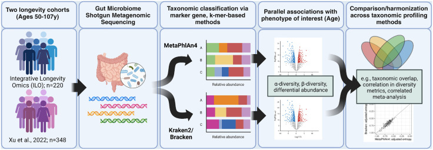
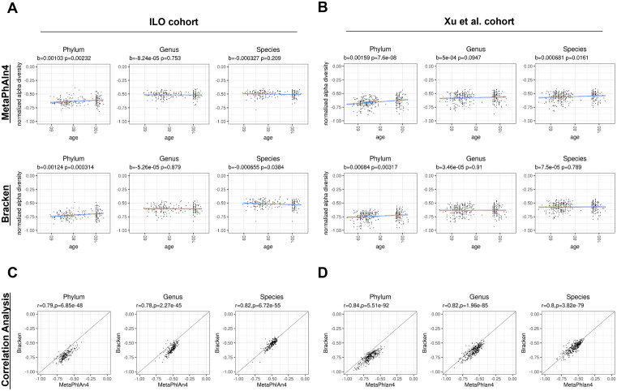
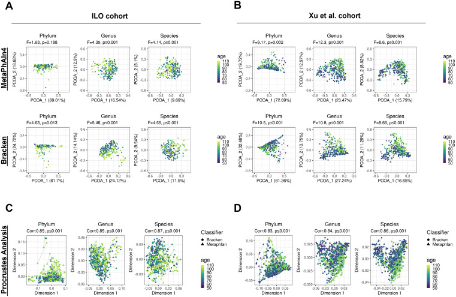
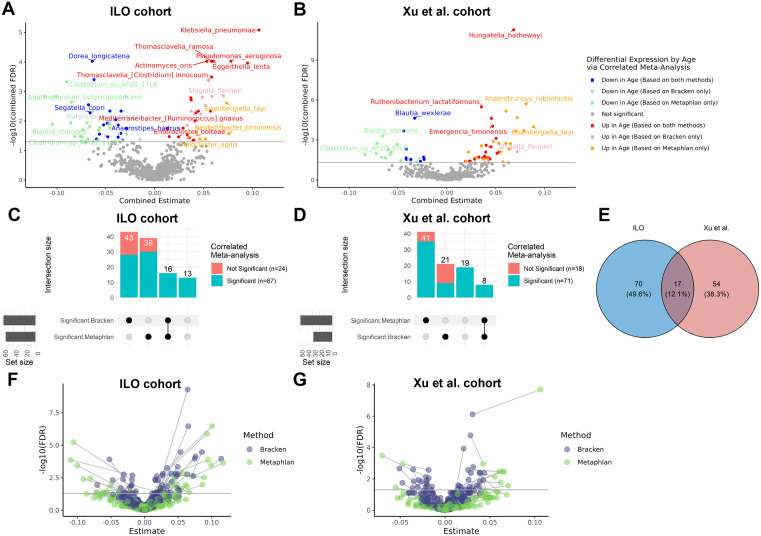

# Интегративный анализ различных метагеномных таксономических классификаторов: пример исследования микробиоты кишечника при старении и долголетии в рамках Интегративного омикс-исследования долголетия

> **Неофициальный перевод.** Оригинал: Tanya T. Karagiannis, Ye Chen, Sarah Bald, Albert Tai, Eric R. Reed, Sofiya Milman, Stacy L. Andersen, Thomas T. Perls, Daniel Segrè, Paola Sebastiani, Meghan I. Short. «Integrative analysis across metagenomic taxonomic classifiers: A case study of the gut microbiome in aging and longevity in the Integrative Longevity Omics Study». PLOS Computational Biology, 2026. DOI: [10.1371/journal.pcbi.1013883](https://doi.org/10.1371/journal.pcbi.1013883). Лицензия: CC BY 4.0.

## Аннотация

Существует множество хорошо проверенных таксономических классификаторов для анализа данных метагеномики; среди них наиболее популярными являются два метода: MetaPhlAn (основанный на маркерных генах) и Kraken (основанный на k-мерах (k-mer)). Несмотря на различия между подходами классификации и на призывы к разработке универсальных методов, в большинстве исследований микробиома для анализа данных метагеномики используется лишь один таксономический классификатор. В данной работе мы сравниваем результаты, полученные с помощью двух широко применяемых классификаторов — MetaPhlAn4 и Kraken2, — при анализе метагеномных образцов кала участников исследования Integrative Longevity Omics; целью было выявление взаимосвязей между таксономическим разнообразием, обилием (abundance) видов и возрастом; аналогичные исследования проводились также на независимой выборке. Кроме того, мы предлагаем консенсусные и метааналитические подходы для сопоставления и объединения результатов, полученных различными классификаторами. Хотя многие выводы совпадают при использовании обоих классификаторов, существуют и специфические для каждого из них результаты, которые не были бы выявлены при применении лишь одного метода. Оба классификатора продемонстрировали схожие возрастные изменения в уровне таксономического разнообразия в разных группах испытуемых; однако различия между ними влияли на оценку альфа-разнообразия видов. При применении метааналитического подхода AdjMaxP для сопоставления данных, полученных разными классификаторами, удалось выявить больше видов, статистически значимо связанных с возрастом; в их числе 17 видов, чья связь с возрастом подтвердилась в обеих выборках. Данное исследование подчеркивает важность использования нескольких таксономических классификаторов и предлагает новые методы, способствующие интеграции результатов, полученных различными подходами.

## Введение

Методы высокопроизводительного секвенирования, такие как шотган-метагеномика, значительно расширили наши возможности по изучению изменений в микробных сообществах человеческого кишечника [1]. Для обработки данных шотган-метагеномики и получения таксономических профилей микробных сообществ существует множество методов классификации. Таксономические анализаторы определяют виды микроорганизмов и их относительное обилие в каждом образце путем сопоставления секвенированных рид (read; короткий фрагмент ДНК после секвенирования) с референсной базой (reference database). В основе этих классификационных инструментов лежат различные подходы: методы, основанные на маркерных генах (например, MetaPhlAn [2], mOTUs [3]), подходы, использующие k-меры (например, Kraken [4,5], Bracken [6,7], Centrifuge [8]) и методы, основанные на белках (например, Kaiju [9], DIAMOND [10]); каждый из этих подходов обладает своими преимуществами.

Два популярных метода — MetaPhlAn и Kraken — неизменно применяются в метагеномных исследованиях, в том числе при изучении процессов старения. MetaPhlAn классифицирует риды, выравнивая их по специально подготовленной базе данных, содержащей маркерные гены (marker gene) для различных таксонов; относительное обилие видов при этом оценивается на основе показателя покрытия (coverage) для каждой таксономической группы [2,11]. Несмотря на то, что данный метод не использует всю совокупность полученных данных, было доказано, что MetaPhlAn обладает высокой чувствительностью (sensitivity) и высоким покрытием (coverage) микробиома человека [2,12]. Kraken же осуществляет классификацию на основе k-меров, сопоставляя отдельные риды с таксонами посредством специальных методов «голосования» по k-мерам [4]. В частности, Kraken привязывает риды к самой низкой таксономической группе, для которой характерен данный k-мер, с целью определения таксономического обилия; расчет относительного обилия на конкретном уровне выполняется с помощью Bracken [4,6]. Хотя подход, используемый в Kraken/Bracken, обладает большей чувствительностью (sensitivity), чем методы, основанные на маркерных генах (marker gene), и задействует всю совокупность последовательностей, он склонен давать ложноположительные результаты [12–15]. Эти различия между методами классификации способны существенно влиять на идентификацию таксонов, оценку их относительного обилия и последующие анализы [11,16].

Ввиду существующих различий и взаимодополняющих преимуществ различных методов таксономической классификации, в предыдущих исследованиях высказывалось предположение, что методы, основанные на консенсусе, могут оказаться полезными для надёжного анализа микробиома [14,17,18]. Однако на практике существует мало рекомендаций и примеров применения подобных подходов. Такие инструменты, как MetaMeta [19], WEVOTE [20], FlexTaxD [21], а также недавно разработанная *стратегия объединения*, основанная на взвешенном голосовании [22], открывают возможности для анализа метагеномных данных с использованием нескольких методов таксономической классификации. Данные интегративные подходы применяют различные методы для объединения результатов отдельных классификаторов с целью повышения точности определения таксонов. Тем не менее их применение ограничено спектром поддерживаемых инструментов: например, MetaMeta не поддерживает MetaPhlAn, FlexTaxD работает лишь с классификаторами, использующими k-меры, а *стратегия объединения* была протестирована лишь на ограниченном числе профилировщиков, исключая методы, основанные на маркерных генах. Кроме того, разработчики перестали поддерживать такие инструменты, как MetaMeta и WEVOTE. Все эти подходы осуществляют интеграцию на уровне таксономической классификации, формируя единую таблицу данных для последующего анализа. Однако такой способ объединения не позволяет сравнивать таксономические профили и результаты, полученные с помощью различных профилировщиков. Наконец, несмотря на наличие соответствующих инструментов и потенциальные преимущества анализа с использованием нескольких классификаторов, большинство исследований по-прежнему опираются на один таксономический профилировщик [17,23,24].

Движимые стремлением сравнить результаты анализа, полученные с помощью различных классификаторов, а также использовать их взаимодополняющие преимущества, мы параллельно применили два метода таксономического профилирования (Kraken2 и MetaPhlAn4) для выявления закономерностей в разнообразии микробиоты и отдельных таксонов, связанных с возрастом, в двух исследованиях людей, доживших до крайне преклонного возраста. Мы провели секвенирование микробиома кишечника методом шотган-метагеномики у участников Интегративного омиксного исследования долголетия (ILO) — нового когортного исследования столетних жителей Северной Америки и их потомков. Кроме того, мы получили общедоступные метагеномные последовательности от когорты представителей ханьской этнической группы в качестве репликационной когорты [25]. В данной работе мы представляем этот анализ в виде тематического исследования, демонстрирующего целесообразность применения взаимодополняющих методов для анализа метагеномных данных; также описываем новые методы, включая оригинальный подход коррелированного метаанализа AdjMaxP, способный интегрировать результаты, полученные с помощью различных таксономических классификаторов, и обеспечить всесторонний анализ данных.

## Результаты

### Два широко используемых таксономических классификатора выявляют различные таксономические профили.

Мы получили данные метагеномного секвенирования микробиома кишечника от 220 участников исследования Integrative Longevity Omics (ILO) в возрасте 59–107 лет; эти участники имели североамериканское/европейское происхождение, среди них было 78 столетних людей (возраст 100–107 лет) и 142 их биологических потомка (возраст 59–99 лет) Fig 1; см. также S1 Text. Кроме того, мы получили набор данных метагеномного секвенирования микробиома кишечника от 348 лиц китайского происхождения в возрасте 50–105 лет; 116 из них относились к пожилой возрастной группе (возраст 90–105 лет), включая 13 столетних людей (возраст 100–105 лет), а также 232 их потомка (возраст 50–79 лет) [25] (Fig 1). Оба набора необработанных последовательностей мы обработали с помощью программы KneadData [26], после чего провели их таксономическую классификацию с использованием 1) MetaPhlAn4 нуклеотидная матрица ДНК (DNA) [2] и 2) Kraken2 нуклеотидная матрица РНК (RNA) [4]; завершающим этапом стала обработка данных с помощью Bracken [6].

**Fig 1.** Обзор аналитического конвейера для проведения шотган-метагеномного анализа с использованием взаимодополняющих методов таксономической классификации. Данные шотган-метагеномного секвенирования микробиоты кишечника были получены от участников Интегративного исследования по долголетию (Integrative Longevity Omics Study, ILO), а также от когорты китайцев ханьского происхождения, выступавшей в качестве репликационной группы. Мы параллельно применили два взаимодополняющих метода таксономического профилирования (Kraken2 и MetaPhlAn4) с целью выявления таксонов, связанных с возрастом в рамках двух исследований людей с экстремально высокой продолжительностью жизни. С помощью результатов обоих классификаторов в обеих когортах мы оценили взаимосвязь альфа- и бета-разнообразия с возрастом, а также различия в **обилие** таксонов в зависимости от возраста. Для определения степени согласованности результатов и их последующей интеграции мы использовали методы сравнения таксономических профилей, корреляционный анализ, метод Прокруста, методы голосования и недавно разработанный в нашей лаборатории подход метаанализа с учетом корреляций. Схема создана в BioRender. Short, M. (2025) [https://BioRender.com/d16j755](https://BioRender.com/d16j755).

Между базами данных, использованными MetaPhlAn4 (20789 видов) и Kraken2/Bracken (23127 видов), наблюдались различия в количестве видов; степень их пересечения оказалась относительно невелика (6292 общих вида, что составляет 27–30% от общего числа видов в каждой базе данных) (Table 1). После проведения таксономической классификации и фильтрации данных в наборах данных различных групп Kraken2/Bracken выявили большее число видов (ILO:1044, Xu:1504), чем MetaPhlAn4 (ILO:787, Xu:898). Степень совпадения выявленных видов в пределах одной группы при использовании двух методов анализа оказалась низкой (ILO:335 (22.4%), Xu:442 (21.3%)); в то же время при применении одного и того же метода к разным группам наблюдалось большее совпадение (MetaPhlAn4:626 (59.1%), Kraken2/Bracken:846 (49.7%)). Аналогичные тенденции прослеживались на большинстве таксономических уровней (S1 Table).

Поскольку мы обнаружили различия в видах, выявляемых разными классификаторами, мы далее изучили, отличаются ли эти два метода в оценке относительного обилие видов, выявленных обоими классификаторами. Таксономические профили, полученные с помощью Bracken и MetaPhlAn4, существенно различались в зависимости от состава общих видов, выявленных обоими классификаторами. Эти общие виды составляли основную часть профилей образцов при использовании Bracken: в среднем они составляли 88.1% от общего относительного обилие в профилях образцов из когорты ILO и 90.0% в когорте Xu et al. При использовании MetaPhlAn4 доля таких видов в общем обилие была меньше: в среднем они составляли 68.7% в профилях образцов из когорты ILO и 68.3% в когорте Xu et al (S2A, S2B Fig). Иными словами, мы установили, что MetaPhlAn4 выявляет меньшее количество видов, не обнаруживаемых Kraken2/Bracken, однако эти виды характеризуются более высоким обилие. В свою очередь, Kraken2/Bracken выявляют больше уникальных видов, которые в среднем обладают более низким обилие. Стоит отметить, что наиболее обильные виды в каждом профиле были схожими при использовании разных методов классификации (S2C, S2D Fig); это указывает на то, что доминирующие таксоны остаются одинаковыми независимо от применяемого классификатора, а различия, вероятно, обусловлены различиями в выявлении видов с более низким обилие. Кроме того, мы изучили уникальные таксоны в каждом наборе данных, которые не выявлялись обоими классификаторами (Table 2 и S1 Table). Из видов, обнаруженных только с помощью Kraken2/Bracken (709 видов в когорте ILO и 1082 вида в когорте Xu), 61.2% (в когорте ILO) и 52.7% (в когорте Xu) присутствовали в базе данных MetaPhlAn4; то есть MetaPhlAn4 имел возможность выявить эти виды, но этого не сделал. Напротив, из видов, обнаруженных только с помощью MetaPhlAn4 в каждом наборе данных (452 вида в когорте ILO и 476 видов в когорте Xu), лишь 1.6% (в когорте ILO) и 2.3% (в когорте Xu) также присутствовали в базе данных Kraken2/Bracken; то есть Kraken2/Bracken имел возможность выявить эти виды, но этого не сделал. Это позволяет предположить, что Kraken2/Bracken обладает более высокой чувствительностью по сравнению с MetaPhlAn4 и/или, возможно, выявляет больше ложноположительных результатов, как уже отмечалось ранее [12,15]. Схожие тенденции наблюдались на большинстве таксономических уровней (S1 Table).

### Зависимость показателей альфа-разнообразия от возраста варьируется в зависимости от таксономического уровня и используемого классификатора.

Мы рассчитали нормализованное альфа-разнообразие относительного обилия таксонов на каждом таксономическом уровне с использованием обоих классификаторов (S2 Table и S1 Text). В обеих группах — ILO и Xu и др. — при применении обоих классификаторов наблюдалось значительное увеличение нормализованного альфа-разнообразия с возрастом на уровне типов (для группы ILO MetaPhlAn4: угловой коэффициент = 0.00103, p = 0.00232; для ILO Bracken: угловой коэффициент = 0.00124, p = 0.000314; для группы Xu MetaPhlAn4: угловой коэффициент = 0.00159, p = 7.6e-8; для Xu Bracken: угловой коэффициент = 0.00084, p = 0.00317) (Fig 2A, 2B). Эта закономерность изменения разнообразия с возрастом сохранялась также на уровнях классов и отрядов таксономии (S3A, S3B Fig). На уровне родов и видов тенденция к увеличению нормализованного альфа-разнообразия с возрастом не наблюдалась (Fig 2A, 2B). Результаты различались в зависимости от используемого классификатора и группы испытуемых; при этом на уровне видов в двух случаях наблюдалась статистическая значимость, хотя тренды были менее выраженными (для ILO Bracken: угловой коэффициент = 0.000655, p = 0.0384; для Xu MetaPhlAn4: угловой коэффициент = 0.000681, p = 0.0161). Статистическая значимость углового коэффициента при использовании Bracken в группе ILO, возможно, обусловлена наличием выбросов среди профилей образцов с особенно низким уровнем разнообразия (Fig 2A).

**Fig 2.** Альфа-разнообразие демонстрирует схожие изменения с возрастом на более высоких таксономических уровнях; на более низких уровнях оно варьируется в зависимости от используемых методов классификации. **(A-B)** На диаграммах рассеяния показаны нормализованные значения альфа-разнообразия для каждого образца в зависимости от возраста; сравнение проводится на уровнях типа, рода и вида внутри каждой когорты, а также между когортами и методами классификации. Для оценки взаимосвязи с возрастом применялись модели линейной регрессии; порог значимости при этом составлял 0.05. **(C-D)** На диаграммах рассеяния сравниваются нормализованные значения альфа-разнообразия образцов в зависимости от используемого метода классификации в рамках каждой когорты. Для выявления различий между методами применялся корреляционный анализ Пирсона; порог значимости также составлял 0.05.

Нормализованные показатели альфа-разнообразия, рассчитанные с помощью MetaPhlAn4 и Kraken2/Bracken, демонстрировали высокую корреляцию (коэффициент корреляции Пирсона r >= 0.78; p < 0.001 для всех таксономических уровней) (Figs 2C, 2D, S3C, S3D). Аналогичные результаты наблюдались при анализе только тех таксонов, которые были выявлены обоими методами классификации (S4 Fig). В целом полученные данные позволяют предположить, что оба таксономических классификатора адекватно отражают взаимосвязь показателей альфа-разнообразия с возрастом в двух когортах на более высоких таксономических уровнях; однако на более низких уровнях результаты оказались неоднозначными.

В рамках анализа чувствительности мы провели дополнительный анализ, направленный на оценку нормализованного показателя альфа-разнообразия с учетом геномных бинов из профилей MetaPhlAn4 (S5 Fig). Доля этих геномных бинов в общем обилии составила 26.7% в профилях образцов ILO и 17.9% в профилях образцов Xu (S5A, S5B Fig). Для обеих групп образцов полученные значения нормализованного альфа-разнообразия совпадали с результатами первоначального анализа на уровне видов. Однако в группе образцов ILO в ряде случаев наблюдались расхождения на более высоких таксономических уровнях (S5C, S5D Fig).

Кроме того, анализ таксономического разнообразия (общего числа таксонов, выявленных на том или ином уровне) показал, что взаимосвязи с возрастом могут различаться в зависимости от используемых классификаторов (S6 Fig). Разнообразие на более высоких таксономических уровнях (тип, класс) возрастало с возрастом в профилях MetaPhlAn4, однако в профилях Kraken2/Bracken такая зависимость отсутствовала. Разнообразие на уровне родов увеличивалось с возрастом в группе, изученной Сю и соавторами, в профилях MetaPhlAn4; в профилях Bracken же этот показатель оставался неизменным. Разнообразие на уровне видов не зависело от возраста ни в одном из случаев. Хотя показатели, учитывающие равномерность распределения (то есть нормализованное альфа-разнообразие по Шеннону) демонстрировали схожие зависимости от возраста при использовании различных классификаторов, выводы относительно общего таксономического разнообразия оказались более чувствительными к выбору конкретного классификатора.

### Зависимости видового разнообразия от возраста согласуются между различными таксономическими классификаторами.

Мы рассчитали бета-разнообразие с использованием индекса несходства Брей–Кертиса для каждой когорты и обоих таксономических классификаторов, чтобы изучить его изменения в зависимости от возраста. Затем мы провели анализ главных координат (PCoA) с целью визуализации сходств и различий между образцами (Figs 3 и S7; S3, S4 Tables). Доля изменчивости, объясняемая первой главной компонентой в результате анализа PCoA, превышала 69% на уровне типов и снижалась до менее 20% на уровне видов независимо от используемых классификаторов и когорт. На графиках PCoA наблюдается большая схожесть между образцами одинакового возраста по сравнению с образцами разного возраста; в большинстве случаев выявлены статистически значимые корреляции между различными классификаторами и когортами (Figs 3A, 3B и S7A, S7B). Исключением стали различия на уровне типов в когорте ILO: в данном случае MetaPhlAn4 не выявил статистически значимых изменений бета-разнообразия в зависимости от возраста (PERMANOVA F = 1.63, p = 0.188), тогда как при использовании Bracken такие изменения были зафиксированы (PERMANOVA F = 4.63, p = 0.013) (Fig 3A).

**Fig 3.** Бета-разнообразие демонстрирует схожие изменения с возрастом в зависимости от используемого метода анализа в каждой когорте. **(A-B)** Графики основной координатной анализизации, отображающие показатели несходства по методу Брей-Кертиса между образцами; сравнение проводится на уровнях таксонов типа, рода и вида внутри каждой когорты, а также между различными когортами и методами классификации. Для оценки различий в показателях несходства, обусловленных возрастом, использовалась процедура PERMANOVA; порог статистической значимости при этом составлял 0.05. **(C-D)** Результаты анализа Прокруста, проведенного для показателей несходства по методу Брей-Кертиса в обоих методах классификации в рамках каждой когорты; линии на графиках соединяют соответствующие образцы. Для проверки того, насколько согласованность полученных расстояний превышает уровень случайных совпадений, применялся рандомизационный тест Прокруста (метод Монте-Карло); порог статистической значимости также составлял 0.05.

Мы использовали метод Прокруста для визуальной оценки того, сохраняются ли различия между любыми двумя образцами в пределах одной когорты независимо от применяемого таксономического классификатора. Для более детальной проверки мы применили рандомизационный тест Прокруста, чтобы определить, насколько степень соответствия результатов, полученных разными методами, превышает уровень, ожидаемый случайным образом (Figs 3C, 3D и S7C, S7D). В обеих когортах наблюдалось высокое соответствие показателей различий на всех таксономических уровнях (коэффициент корреляции: 0.83-0.87, p ≤ 0.001) между профилями, построенными на основе данных Bracken и MetaPhlAn4. Кроме того, тесты Мантеля продемонстрировали высокую корреляцию между показателями несходства по методу Брей–Кертиса, рассчитанными на основе данных MetaPhlAn4 и Kraken2 (коэффициент корреляции >0.75, p ≤ 0.001 на всех таксономических уровнях; Table 3). Аналогичные результаты были получены при анализе только тех таксонов, которые были выявлены обоими классификаторами (S8 Fig). В целом, результаты анализа бета-разнообразия свидетельствуют о том, что оба таксономических классификатора адекватно отражают сходные изменения сообщества с возрастом в обеих когортах.

### Анализ различий в обилии демонстрирует преимущества использования нескольких таксономических классификаторов.

Для изучения изменений в обилии отдельных таксонов с возрастом с использованием каждого из таксономических классификаторов мы провели анализ дифференциального обилия на уровне видов (Fig 4 и S5 Table). Визуализации типа «вулкан» на рисунке Fig 4 отражают результаты анализа для группы ILO (Fig 4A) и группы Xu et al. (Fig 4B). В группе ILO анализ, выполненный с помощью MetaPhlAn4, выявил 55 видов, чье относительное обилие коррелировало с возрастом; анализ с использованием Kraken2/Bracken позволил выявить 59 видов, связанных с возрастом при уровне ложноотрицательных результатов 5% (Fig 4C). В группе Xu et al. анализ, основанный на MetaPhlAn4, выявил 49 видов, чье относительное обилие зависело от возраста; анализ с применением Kraken2/Bracken позволил выявить 29 видов, связанных с возрастом при том же уровне ложноотрицательных результатов (Fig 4D). Совместное использование как MetaPhlAn4, так и Bracken позволило выявить множество видов, связанных с возрастом, которые не были бы обнаружены при применении лишь одного метода. Например, в группе ILO (Xu) 43 (21) вида оказались связанными с возрастом при использовании только Bracken; эти виды не были бы выявлены при применении MetaPhlAn4. Аналогично, в группе ILO (Xu) 39 (41) видов оказались связанными с возрастом при использовании только MetaPhlAn4 (Fig 4C, 4D).

**Fig 4.** Анализ дифференциального обилия выявляет общие различия, а также различия, специфичные для конкретного классификатора или когорты. **(A-B)** Диаграммы типа «вулкан» демонстрируют виды с дифференциальным обилием в зависимости от возраста в каждой когорте. Для оценки связи возраста с относительным обилием видов использовались модели линейной регрессии с применением обобщенных оценочных уравнений; для получения совокупных p-значений и оценок эффекта по видам, выявленным обоими классификаторами в рамках одной когорты, применялся коррелированный метаанализ. Значимость определялась по критерию совокупного FDR < 0.05. Виды с достоверно изменяющимся обилием в зависимости от возраста обозначались как имеющие повышенное или пониженное обилие при использовании обоих классификаторов либо лишь одного из них. **(C-D)** Диаграммы типа UpSet отображают все виды, статистически значимо связанные с возрастом по результатам индивидуальных тестов или коррелированного метаанализа. Высота вертикальных столбцов указывает на количество видов, связанных с возрастом в профилях Bracken, профилях MetaPhlAn4 (MetaPhlAn), в обоих типах профилей или ни в одном из них согласно результатам индивидуальных тестов. Синим цветом обозначено количество видов, значимо связанных с возрастом по данным коррелированного метаанализа; красным цветом — количество видов, значимо связанных с возрастом по результатам индивидуальных тестов, но не подтвержденных коррелированным метаанализом. Из 87 (71) видов, выявленных коррелированным метаанализом в когортах ILO (Xu), лишь 16 (8) могли бы быть обнаружены методом анализа с использованием одного классификатора, независимо от того, применялся ли Bracken или MetaPhlAn4. Кроме того, коррелированный метаанализ позволил выявить в когортах ILO (Xu) 13 (19) видов, связанных с возрастом, которые не были бы обнаружены ни с помощью Bracken, ни с помощью MetaPhlAn4 по отдельности. **(E)** Диаграмма Венна демонстрирует виды, связанные с возрастом и выявленные коррелированным метаанализом в когортах ILO и Xu et al. **(F-G)** Диаграммы типа «вулкан» показывают виды с дифференциальным обилием в зависимости от возраста в каждой когорте по результатам индивидуальных тестов. Для оценки связи возраста с относительным обилием видов с учетом пола и уровня образования использовались модели линейной регрессии с обобщенными оценочными уравнениями; при этом применялись оба классификатора в рамках одной когорты. Для каждого таксона приводятся оценки и значения FDR, полученные с помощью каждого из классификаторов; эти данные соединены линиями: для Bracken — фиолетовой линией, для MetaPhlAn4 (MetaPhlAn) — зеленой линией. Значимость результатов определялась по критерию FDR < 0.05 для каждого из классификаторов.

Мы применили коррелированный метаанализ по методу AdjMaxP [27,28] для объединения результатов, полученных с помощью обоих методов классификации, с учетом ненезависимости тестов на ассоциацию для таксонов, измеренных с помощью обоих классификаторов у одних и тех же индивидов (см. Методы). Сначала мы приводим результаты на уровне видов в рамках каждой из групп. Из 43(21) видов в ILO(Xu), которые имели значимую возрастную ассоциацию в профилях Bracken, но не имели таковой (или отсутствовали) в профилях MetaPhlAn4, у 28(9) видов была выявлена значимая связь с возрастом с использованием коррелированного метаанализа (Fig 4C, 4D). К этим видам относится *Mediterraneibacter [Ruminococcus] gnavus*, связанный с воспалением и процессами старения [29,30]; его обилие в ILO положительно коррелировало с возрастом по данным метода Bracken и коррелированного метаанализа; при этом по данным метода MetaPhlAn4 наблюдалась граничная, но не значимая возрастная ассоциация (p = 0.051). Из 39(41) видов в ILO(Xu), которые имели значимую возрастную ассоциацию в профилях MetaPhlAn4, но не имели таковой (или отсутствовали) в профилях Bracken, у 30 (35) видов была выявлена значимая связь с возрастом с помощью коррелированного метаанализа (Fig 4C, 4D). В эту группу входят *Neglectibacter timonensis*, *Eisenbergiella tayi* и *Clostridium_sp_AF20_17LB*, ранее упоминавшиеся в связи с долголетием [31]. Кроме того, 16 (8) видов в ILO(Xu) продемонстрировали значимую возрастную ассоциацию по данным обоих методов классификации; все они также были выявлены с помощью коррелированного метаанализа (Fig 4C, 4D). Кроме того, коррелированный метаанализ позволил выявить виды, которые по отдельности ни в профилях MetaPhlAn4, ни в профилях Bracken не показывали значимой возрастной ассоциации, однако в рамках метаанализа такая ассоциация оказалась значимой (13 видов в ILO и 19 в работе Xu et al.; Fig 4C, 4D). Среди них — виды с уже задокументированной возрастной ассоциацией, такие как *Anaerostipes hadrus*, *Faecalibacterium prausnitzii* и *M. gnavus* в группе Xu et al. [30,32,33].

Из 141 вида, которые, согласно корреляционному метаанализу, демонстрируют связь с возрастом хотя бы в одной когорте, мы выявили 17 видов, связанных с возрастом в *обеих* когортах (Fig 4E и S5 Table). Кроме того, мы сравнили эффекты на уровне отдельных видов и значения q-критерия FDR между различными методами классификации на основе результатов индивидуальных тестов (Fig 4F, 4G). Величина эффекта возраста, как правило, оказывалась больше для MetaPhlAn4 по сравнению с Bracken; при этом четкой закономерности в отношении значений q-критерия FDR между методами классификации не наблюдалось.

### Сравнительный анализ метода AdjMaxP

Для оценки относительной эффективности метода коррелированного метаанализа AdjMaxP в выявлении консервативных признаков в рамках взаимозависимых исследований (то есть профилей классификаторов) мы сравнили его с другими методами поиска таких признаков (то есть признаков, связанных с определенным фенотипом в обоих исследованиях). В качестве сравнительных методов использовались: 1) подход, предложенный Province и Borecki [34]; 2) «наивный» метод определения консервативности признаков на основе совпадения направления эффекта и статистической значимости в обоих исследованиях. Мы смоделировали p-значения ассоциаций между видами для двух исследований (то есть профилей классификаторов) с различной степенью взаимозависимости, а также фенотипические ассоциации как консервативные, так и неконсервативные, различающиеся по силе сигнала; после этого сравнили эффективность всех трех методов (см. Методы). Средние показатели эффективности по всем метрикам и условиям приведены в S6 Table для моделирования с двумя исследованиями и 400 общими признаками. В сценариях, где консервативные и неконсервативные признаки отсутствовали, все методы поддерживали номинальный уровень ошибки первого рода на уровне 5%; при этом «наивный» метод давал чрезмерно строгие результаты при низкой корреляции между исследованиями (S9 Fig, левая панель). Кроме того, метод AdjMaxP обеспечивал среднюю специфичность по отношению к консервативным признакам более 90% во всех рассмотренных случаях (S9 Fig). При пороге FDR q-значения 0.05 специфичность и точность были высокими у методов AdjMaxP и «наивного» метода; у подхода Province и Borecki эти показатели снижались по мере увеличения числа и силы сигнала неконсервативных признаков, что подчеркивает преимущества метода AdjMaxP в выявлении консервативных признаков (S10A, S10B Fig). Высокая специфичность и точность метода AdjMaxP в выявлении консервативных признаков достигались за счет более низкой чувствительности по сравнению с подходом Province и Borecki. Однако в большинстве случаев AdjMaxP демонстрировал более высокую чувствительность, чем «наивный» метод, за исключением ситуаций с высокой корреляцией между исследованиями (>0.8) (S10C Fig). Для справки: значения тетрахорической корреляции в данном исследовании составили 0.376 для ILO и 0.334 для работы Xu и др. Площадь под кривой ROC оказалась максимальной для метода AdjMaxP практически во всех рассмотренных сценариях моделирования (S10D Fig). В целом, при наличии в данных неконсервативных признаков метод AdjMaxP превосходил подход Province и Borecki, а также «наивный» метод по целому ряду метрик.

## Обсуждение

### Обзор

Предыдущие бенчмарки таксономических классификаторов метагеномных данных рекомендовали консенсусные методы как способ выявлять устойчивые результаты [14,17,18]. В этой работе мы представляем анализ возраст-ассоциированных признаков микробных сообществ кишечника у пожилых и долгоживущих взрослых (50–107 лет), в котором используем консенсус и новый мета-аналитический подход, чтобы объединить находки двух популярных метагеномных таксономических классификаторов, MetaPhlAn4 и Kraken2. Мы выполнили анализ разнообразия, в котором оба классификатора уловили сходные возраст-ассоциированные изменения в двух когортах долгожителей, при этом на уровне видов наблюдалась вариабельность между классификаторами и когортами. Мы также провели новый анализ, объединяющий результаты дифференциального обилия между классификаторами с помощью коррелированного метаанализа, который выявил 17 видов с устойчивой ассоциацией с возрастом между когортами, включая виды, которые не были бы обнаружены при использовании только одного профилировщика.

### Различия в базах данных и таксоны с низким обилием обусловливают различия в профилях, получаемых разными классификаторами.

При анализе степени таксономического пересечения наблюдается, что выбор таксономического классификатора существенно влияет на набор выявляемых таксонов на всех уровнях. В наших когортах классификаторы Kraken2 и Bracken выявили на 33–67% больше видов, чем классификатор MetaPhlAn4 (Table 1); это согласуется с результатами предыдущих исследований по сравнению классификаторов [16]. Данное различие, по-видимому, не обусловлено разницей в количестве видов в референсных базах: в референсной базе Kraken2 содержится лишь на 11% больше видов, чем в референсной базе MetaPhlAn4; кроме того, классификатор Kraken2 выявил множество видов, присутствующих в референсной базе MetaPhlAn4, но не обнаруженных классификатором MetaPhlAn4 (Table 2). Этот результат подтверждает данные предыдущих исследований, согласно которым классификаторы Kraken2 и Bracken обладают большей чувствительностью и склонностью к ложноположительным результатам по сравнению с классификатором MetaPhlAn4 [12,15]. Восемь из десяти наиболее распространенных видов были выявлены обоими классификаторами (S2C, S2D Fig), что свидетельствует о согласованности в оценке частотности наиболее распространенных видов. Одной из возможных причин низкого уровня пересечения выявленных видов является то, что референсные базы, доступные для использования классификаторами MetaPhlAn4 и Kraken2, имеют относительно мало (~30%) общих видов. Эти различия могут быть вызваны ограничениями методов, применяемых каждым таксономическим классификатором: например, в базе данных MetaPhlAn4 отсутствуют подходящие маркерные гены, а в референсных базах Kraken2 и RefSeq не хватает SGB, собранных методом сборки MAG.

### Возрастные тенденции в разнообразии микробиома, как правило, согласуются между различными методами классификации.

Несмотря на различия в составе микробиома, выявленные с помощью обоих инструментов, последующие анализы разнообразия микробиома в целом дали схожие результаты. Например, оба классификатора показали, что альфа-разнообразие кишечного микробиома возрастает с возрастом на уровне типов (Fig 2); этот вывод не противоречит результатам ранее проведенных исследований [23,35,36]. Кроме того, мы обнаружили высокую корреляцию между нормализованными показателями альфа-разнообразия, рассчитанными на основе данных обоих классификаторов. Однако наличие несоответствий в оценках альфа-разнообразия на уровне отдельных видов свидетельствует о существовании специфических для каждого классификатора погрешностей: они проявляются как в определении конкретных видов (Fig 2A, 2B), так и в количественной оценке их обилия ( abundance). Это, в свою очередь, влияет на интерпретацию полученных биологических данных. В других исследованиях также отмечались расхождения в зависимости возраста от показателей альфа-разнообразия на уровне видов [24]; наши результаты позволяют предположить, что выбор таксономического классификатора может быть одним из факторов, вызывающих подобные расхождения. Взаимосвязь между таксономическим разнообразием и возрастом оказалась чувствительной к выбору классификатора; это неудивительно, учитывая значительные различия в идентифицируемых таксонах. Исследователям следует проявлять осторожность при формулировании выводов о таксономическом разнообразии на основе данных, полученных с использованием лишь одного классификатора.

Графики ординации бета-разнообразия продемонстрировали схожие взаимосвязи между образцами при использовании как MetaPhlAn4, так и Kraken2/Bracken; также наблюдались сопоставимые корреляции между таксономическим составом и возрастом согласно результатам PERMANOVA (Fig 3). Значительные изменения бета-разнообразия в зависимости от возраста, зафиксированные при применении обоих классификаторов, также описывались в предыдущих исследованиях [23,24,37,38]. Анализ Прокруста и тесты Мантеля выявили значительное соответствие и высокую корреляцию таксономических профилей на всех уровнях (Fig 3C, 3D и Table 3); это позволяет предположить, что, несмотря на различия в профилях на уровне отдельных таксонов, общие фенотипические взаимосвязи с таксономическими профилями могут сохраняться при использовании разных классификаторов.

### Анализы обилия таксонов, проведенные с использованием обоих методов классификации, позволяют выявить большее число таксонов, связанных с возрастом.

Методы консенсусного анализа и метаанализа могут оказаться особенно эффективными при сопоставлении результатов исследований фенотипических ассоциаций с отдельными таксонами (Fig 4 и S5 Table). Однако при идентификации отдельных таксонов часто возникают ложноположительные и ложноотрицательные результаты, а также погрешности в их количественной оценке; поэтому инструменты для выявления надежных ассоциаций крайне важны [16]. Для обобщения данных, полученных с помощью различных методов классификации, мы применили разрабатываемую в нашей группе процедуру коррелированного метаанализа [27,28], позволяющую объединять p-значения результатов тестов на связь с возрастом, проведенных для двух таксономических профилей из одних и тех же образцов. В тех случаях, когда лишь один метод выявлял наличие конкретного таксона, использовалось p-значение, полученное в рамках этого теста. Из 141 вида, чья связь с возрастом была подтверждена данным методом, 17 оказались значимо ассоциированными с возрастом в обеих группах испытуемых; эти виды представляют собой таксоны, для которых наши данные свидетельствуют о наиболее выраженной связи с возрастом. В дальнейшей части раздела рассматриваются именно эти 17 видов (S5 Table).

Среди 17 видов, чья связь с возрастом подтвердилась в обеих когортах, многие остались бы незамеченными, если бы мы использовали лишь один таксономический классификатор. Из семи таксонов, идентифицированных исключительно с помощью MetaPhlAn4, виды *Neglectibacter timonensis* и *Eisenbergiella tayi*, а также *Clostridium_sp_AF20_17LB* ранее уже были выявлены как имеющие различную распространенность у долгоживущих людей по сравнению с более молодыми участниками исследования; это исследование охватывало когорту Сюй и еще семь других когорт [31]. Что касается остальных видов, определенных только с помощью MetaPhlAn4 (*Diplocloster agilis*, *Clostridium sp_AM22_11AC*, *Blautia stercoris*, *Agathobaculum butyriciproducens*), то ранее не было зафиксировано никаких связей между ними и процессами старения или долголетия у человека. Тем не менее эти виды упоминаются в исследованиях на мышах в контексте старения и возрастных заболеваний, что позволяет предположить их потенциальную связь с возрастом и необходимость дальнейшего изучения у людей. *A. butyriciproducens* и *B. stercoris* используются в моделях на мышах для изучения возрастных изменений когнитивных функций и других состояний. Установлено, что *A. butyriciproducens* снижает возраст-зависимые когнитивные нарушения [39] а также когнитивные дефекты и патологии, связанные с болезнью Альцгеймера [40] у мышей. Кроме того, этот вид обладает нейропротекторным действием в моделях болезни Паркинсона [41]; у людей с болезнью Альцгеймера он ассоциируется с уменьшением накопления амилоида, выявляемого методом ПЭТ [42]. *B. stercoris* также применяется в моделях аутизма у мышей; он способствует уменьшению поведенческих нарушений [43].

Кроме того, из 17 выявленных видов три были определены исключительно с помощью методов Kraken2/Bracken. Тот факт, что *Shigella flexneri* был обнаружен в образцах Kraken2/Bracken, но не в образцах MetaPhlAn4, можно объяснить тем, что *S. flexneri* и *Escherichia coli* трудно различить; предыдущие исследования показывают, что методы, основанные на анализе k-меров, могут быть более эффективными, чем методы, опирающиеся на маркерные гены, при различении этих двух [44,45]. Остальные возрастно-ассоциированные таксоны, выявленные исключительно с помощью Kraken2/Bracken, представляли собой виды с крайне низким обилием, ранее не выделявшиеся у людей: *Butyrivibrio hungatei*, обычно встречающийся у жвачных животных [46], и *Romboutsia ilealis*, выделенный из тонкого кишечника крысы [47]. При поверхностной проверке всех **forward ридов**, классифицированных Kraken2 как *R. ilealis*, в одном из образцов было обнаружено больше совпадений на 100% % с последовательностями *R. timonensis* (33 из 162 ридов), чем с последовательностями *R. ilealis* (30 из 162 ридов). Аналогичная проверка того же образца для ридов, отнесенных к виду *B. hungatei*, показала, что наибольшее количество совпадений на 100% % приходится на *Blautia luti* (133 из 835 ридов), *Blautia obium* (119 из 835 ридов) и *Blautia wexlerae* (115 из 835 ридов). Вполне возможно, что Kraken2/Bracken ошибочно определяют риды, происходящие от близкородственных человеку видов, как принадлежащие этим таксонам; это связано с известной склонностью методов, основанных на анализе k-меров, давать ложноположительные результаты, особенно в отношении видов с низким обилием. Хотя объединение данных от различных анализаторов позволяет выявить большее число возрастно-ассоциированных видов, важно учитывать ограничения каждого из используемых классификаторов; по нашему мнению, виды, определенные обоими классификаторами, наиболее вероятно являются истинно положительными находками.

Среди 17 видов, имеющих достоверную связь с возрастом, семь были выявлены обоими классификаторами. Для всех этих видов корреляционный метаанализ показал значимую связь с возрастом; при этом ни один из отдельных тестов не выявил такой связи хотя бы в одной из когорт. Как правило, эти виды демонстрировали граничную статистическую значимость в отдельных тестах обоих профилей (то есть значения FDR q были чуть выше 0.05); однако совпадение результатов по всем профилям привело к получению значимого значения FDR q в рамках метаанализа. К числу таких видов относятся виды, выработка которыми короткоцепочечных жирных кислот (SCFA) с противовоспалительным действием снижается с возрастом (например, *Anaerostipes hadrus*, *Faecalibacterium prausnitzii*, *Phocaeicola vulgatis*), а также виды, обладающие патогенными, потенциально патогенными или провоспалительными свойствами, численность которых с возрастом увеличивается (*Enterocloster bolteae*, *Thomasclavelia [Clostridium] innocuum*, *Mediterraneibacter [Ruminococcus] gnavus*). Воспаление оказывает значительное влияние на процесс старения: хроническое низкоинтенсивное воспаление считается одним из характерных признаков старения [48]. Полученные нами результаты подтверждают гипотезу о том, что изменения в составе микробиоты с возрастом способствуют усилению воспалительных процессов у пожилых людей [49–51]. Например, снижение численности бактерий, вырабатывающих бутират, таких как *A. hadrus* и *F. prausnitzii*, приводит к усилению воспаления и связано с развитием воспалительных заболеваний, включая воспалительные заболевания кишечника [32,33]. Кроме того, штаммы *Phocaeicola vulgatus* также влияют на развитие воспалительных заболеваний [52]. *M. gnavus* ранее ассоциировался с дисбиозом кишечника и воспалительными состояниями, такими как синдром раздраженного кишечника, что имеет отношение к процессу старения [29,30]. В целом, использованный нами метод метаанализа AdjMaxP позволил объединить результаты, полученные с помощью различных таксономических классификаторов, и выявить виды, имеющие достоверную и биологически обоснованную связь с возрастом, которые в противном случае остались бы незамеченными.

### Ограничения исследования

Одним из недостатков данного исследования является отсутствие эталонных данных (ground truth) или золотого стандарта для сравнения при оценке работы различных таксономических анализаторов на реальных данных. Вместо этого мы сосредоточились на степени совпадения и расхождения результатов, полученных разными методами, а также на устойчивости выявленных связей с возрастом в различных выборках и на поддержке таких связей в рамках существующей литературы. Еще одним ограничением является поперечный характер наших данных: это не позволяет делать выводы о процессах старения и долголетия у конкретных индивидов. Кроме того, для сопоставления и интеграции результатов мы ограничили анализ таксонами, которые можно идентифицировать в базе данных NCBI; это исключает возможность использования множества таксономических назначений на основе SGB, доступных, в частности, в базе MetaPhlAn4. Тем не менее в работе MetaPhlAn4 также применялся подобный подход для сравнения MetaPhlAn4 с другими классификаторами [2], а мы в рамках анализа чувствительности изучили влияние SGB на связи между возрастом и разнообразием микробиома. Для упрощения расчетов мы выбрали индекс несходства Брей–Кертиса в качестве меры бета-разнообразия, поскольку он широко используется в исследованиях микробиома, посвященных старению и долголетию. Хотя такие факторы, как питание и прием лекарств, также могут влиять на состав микробиома, наша основная цель заключалась в сопоставлении и интеграции результатов, полученных различными методами; всестороннее изучение факторов, влияющих на старение и микробиом, выходит за рамки данного исследования. В будущих работах эти факторы будут учтены по мере накопления более полных метаданных и образцов в рамках когорты ILO. Наконец, одним из недостатков подхода к обработке таксонов, выявленных лишь одним классификатором в рамках метаанализа, является возможность признания таких таксонов значимыми, хотя по результатам других методов они могут оказаться незначимыми или вовсе не выявленными. Однако в нашем исследовании подобная ситуация наблюдалась лишь для двух видов, которые по результатам коррелированного метаанализа стали считаться гранично значимыми; это обусловлено лишь незначительными различиями в расчетах FDR между методами.

### Выводы

В данном исследовании мы демонстрируем полезность объединения результатов, полученных с помощью нескольких методов классификации, при последующем анализе данных микробиома в связи с интересующими фенотипами; для этого были проанализированы данные новой когорты Integrative Longevity Omics (ILO) и репликационной когорты. Ранее уже отмечались преимущества различных методов таксономической классификации. Используя два популярных классификатора, мы показываем, что такие методы анализа, как Прокруст и новый коррелированный метааналитический подход, способны выявлять воспроизводимые ассоциации, имеющие биологическую обоснованность. Кроме того, мы установили, что независимо от выбранного метода применение лишь одного таксономического классификатора (что является стандартной практикой в данной области) приводит к упущению потенциально значимых связей между таксонами и фенотипами.

## Методы

### Заявление об этических нормах

В период с 2019 по 2024 год в Северной Америке в исследование ILO были включены долгожители, их биологические дети и супруги этих детей (контрольная группа). Исследование было одобрено Советом по этике исследований Медицинской школы имени Альберта Эйнштейна; все участники дали письменное информированное согласие.

### Экспериментальная процедура

Ниже приводится краткий обзор общей методологии; подробная информация и методы отбора испытуемых, сбора образцов кала, анализа с использованием метагеномного секвенирования и все статистические методы описаны в S1 Text.

#### Данные, полученные методом шотгун-метагеномного секвенирования.

Мы провели анализ с использованием метода шотган-метагеномного секвенирования микробиома кишечника у 220 участников исследования ILO, относящихся к североамериканской/европейской этнической группе; среди них было значительное количество столетних людей. Кроме того, мы воспользовались общедоступным набором данных шотган-метагеномного секвенирования, полученным от лиц китайского происхождения [25]; для этого набора данных мы повторили те же этапы обработки и анализа, что и для когорты ILO. Подробное описание обоих наборов данных приводится в S1 Text.

### Унифицированная предварительная обработка и таксономическая классификация

Оба метагеномических набора данных были обработаны с помощью программы KneadData; таксономическая классификация выполнялась как с использованием MetaPhlAn4 [2], так и Kraken2 [4] в рамках разработанной нами метагеномической конвейерной системы (доступной по адресу [https://github.com/Integrative-Longevity-Omics/MGS_pipeline](https://github.com/Integrative-Longevity-Omics/MGS_pipeline)). Подробные методы контроля качества последовательностей, классификации на основе маркерных генов с применением MetaPhlAn4, а также классификации по k-мерам с использованием Kraken2 и последующей обработкой в Bracken описаны в S1 Text.

### Контроль качества данных после таксономической классификации

Мы применили одинаковые процедуры контроля качества к обоим метагеномным наборам данных после классификации с использованием как MetaPhlAn4, так и Kraken2 с целью оценки качества образцов, а также исключения таксонов с низким обилие и потенциальных ложноположительных результатов. Подробные методы описаны в S1 Text.

### Статистический анализ

#### Альфа-разнообразие в зависимости от возраста.

Для оценки изменений в альфа-разнообразии в зависимости от возраста с использованием различных методов классификации мы рассчитали нормализованный показатель альфа-разнообразия (см. S1 Text) [53], отражающий общую степень неоднородности обилия таксонов в каждом образце; также определялась таксономическая насыщенность как количество таксонов, выявленных в образце на заданном таксономическом уровне. Для выявления различий в нормализованном показателе альфа-разнообразия и таксономической насыщенности в зависимости от возраста применялась модель линейной регрессии. Для сравнения показателей альфа-разнообразия, полученных с помощью двух методов классификации в рамках каждой возрастной группы, использовалась корреляция Пирсона. Статистическая значимость определялась по критерию p-value < 0.05.

#### Бета-разнообразие в зависимости от возраста.

Для оценки изменений в бета-разнообразии в зависимости от возраста при использовании различных методов классификации мы рассчитали индекс несходства Брэя–Кертиса для пар образцов и провели анализ PCoA с целью визуализации сходств и различий между образцами. Для оценки различий в значениях индекса Брэя–Кертиса в зависимости от возраста применялся метод PERMANOVA. Для анализа различий в степени несходства образцов при использовании разных методов классификации проводились анализ Прокруста и тесты Мантеля. Статистическая значимость определялась по критерию p-value < 0.05.

#### Анализ дифференциального обилия в зависимости от возраста.

Для оценки различий в обилии микроорганизмов в зависимости от возраста мы проанализировали логарифмированные значения относительного обилия каждого таксона с использованием модели обобщенных оценочных уравнений, в которой в качестве ковариат выступали возраст, пол и уровень образования. Для всех исследуемых таксонов мы рассчитали уровень ложноотрицательных результатов (FDR) с применением коррекции Бенджамина–Хохберга при множественных тестах. Статистическая значимость каждого таксона определялась по критерию FDR < 0.05.

#### Согласование методов анализа дифференциального обилия в различных таксономических классификаторах.

Для согласования анализов различий в обилие, учитывающих данные от нескольких классификаторов в рамках каждой когорты, мы применили метод коррелированного метаанализа AdjMaxP [27,28], позволяющий получить объединенные p-значения и оценки эффекта для всех видов, выявленных как MetaPhlAn4, так и Kraken2. Данный метод позволяет выявлять сигналы, сохраняющиеся в независимых наборах результатов тестов, относящихся к одним и тем же признакам; для этого для каждого признака (то есть вида) рассчитывается объединенное p-значение, представляющее собой степень номинальных p-значений, полученных при анализе различий в обилие для данного признака по всем классификаторам, с использованием так называемого «скорректированного максимального p-значения». Для этого используется модификация метода объединения p-значений, применяемого в независимых исследованиях: максимальное p-значение для данного признака возводится в степень, равную количеству исследований. Например, если в одном исследовании p для данного признака равно 0.05, а в другом — 0.10, то объединенное p-значение составит 0.12 (это вероятность получения p-значения, не превышающего 0.10, в обоих исследованиях при нулевой гипотезе). В методе AdjMaxP степень заменяется на так называемое «эффективное количество исследований», учитывающее степень зависимости между исследованиями (то есть классификаторами). Для определения этого показателя используется тетрахорическая корреляция между p-значениями, предварительно преобразованными с помощью функции пробит. В приведенном выше примере положительная корреляция между результатами, полученными разными классификаторами, приведет к тому, что объединенное p-значение будет равно 0.1, возведенному в степень, большую единицы, но меньшую двух. Это позволяет учесть зависимость между результатами, подлежащими метаанализу; в данном случае речь идет о связи возраста с двумя показателями обилие вида, измеренными на одних и тех же образцах. Для получения совокупных оценок эффекта использовалось среднее значение оценок, полученных от обоих классификаторов, поскольку объемы выборок в рамках каждой когорты одинаковы. Для видов, выявленных лишь одним классификатором, применялись p-значения и оценки эффекта, предоставленные этим классификатором. Для учета множественных тестов по всем признакам рассчитывалась доля ложнообнаруженных эффектов на основе полученных объединенных p-значений.

Для оценки эффективности метода AdjMaxP в выявлении устойчивых статистических зависимостей в условиях взаимосвязи между исследованиями мы смоделировали результаты тестов на наличие зависимостей для 400 общих признаков и сравнили полученные данные между методом AdjMaxP, подходом Province-Borecki и «наивным» подходом, при котором устойчивость зависимости определялась по совпадению направления эффекта и статистической значимости в различных исследованиях (см. S1 Text). Эффективность каждого подхода оценивалась по специфичности при пороговом значении p-уровня 0.05; затем — по специфичности, чувствительности, относительной точности и площади под кривой при пороговом значении q-уровня 0.05, скорректированном с учетом частоты ложных открытий.

Подробное описание методики коррелированного метаанализа и результаты оценок, полученных в ходе моделирования, приведены в S1 Text.

## Дополнительная информация

Дополнительные материалы и методы. (DOCX)

Количество таксонов, идентифицированных MetaPhlAn4 и Kraken2/Bracken на различных таксономических уровнях. (XLSX)

Нормализованные показатели альфа-разнообразия для образцов в каждой группе, рассчитанные на основе профилей MetaPhlAn4 и Kraken2/Bracken на различных таксономических уровнях.(XLSX)

Компоненты PCoA, отражающие бета-разнообразие образцов из когорты ILO, рассчитанные на основе профилей MetaPhlAn4 и Kraken2/Bracken на различных таксономических уровнях.(XLSX)

Компоненты PCoA, характеризующие бета-разнообразие образцов из когорты MetaPhlAn4, рассчитанные на основе профилей Kraken2 и Bracken на различных таксономических уровнях. (XLSX)

Результаты анализа дифференциального обилия, полученные с помощью отдельных тестов и метода коррелированного метаанализа для каждой когорты.(XLSX)

Имитационная оценка коррелированного метода мета-анализа в сравнении с другими подходами. (XLSX)

Распределение количества ридов и количества уникальных k-меров, обрабатываемых минимизатором (minimizer), в данных из когорты ILO, когорты Сю и др. и набора данных Bracken. **(Вверху)** Диаграммы рассеяния, сравнивающие количество ридов (n_bracken_read) и количество уникальных k-меров, обрабатываемых минимизатором (minimizer) (n_unique_minimizer) в каждом наборе данных Bracken; пороговые значения отображены красными пунктирными линиями. Были выбраны три пороговых значения для количества ридов в логарифмической шкале (0, 0.5, 1) и три пороговых значения для количества уникальных k-меров, обрабатываемых минимизатором (minimizer) в логарифмической шкале (0, 1, 3). **(Внизу)** Диаграммы рассеяния, сравнивающие количество ридов (n_bracken_read) и количество уникальных k-меров, обрабатываемых минимизатором (minimizer) (n_unique_minimizer) в каждом наборе данных Bracken; линии между видами показывают наиболее тесно коррелирующий с данным видом другой вид с более высоким значением n_unique_minimizer (при корреляции > 0.8). (TIF)

Сравнение таксономических профилей в различных группах на основе данных таксономического классификатора. **(A)** Группированная столбчатая диаграмма, отображающая общее относительное обилие таксонов в образцах группы ILO: таксонов, выявленных обоими методами классификации, а также таксонов, характерных только для каждого из методов. **(B)** Группированная столбчатая диаграмма, отображающая общее относительное обилие таксонов в образцах группы Xu: таксонов, выявленных обоими методами классификации, а также таксонов, характерных только для каждого из методов. **(C)** Группированная столбчатая диаграмма, отображающая общее относительное обилие 10 наиболее распространенных таксонов в образцах группы ILO согласно данным каждого из методов классификации. **(D)** Группированная столбчатая диаграмма, отображающая общее относительное обилие 10 наиболее распространенных таксонов в образцах группы Xu согласно данным каждого из методов классификации. (TIF)

Возрастные различия в альфа-разнообразии на различных таксономических уровнях при использовании обоих таксономических классификаторов. **(A-B)** Диаграммы рассеяния, отображающие нормализованные значения альфа-разнообразия для каждого образца в зависимости от возраста; сравнение проводится на уровнях класса, отряда и семейства в пределах каждой когорты, а также между когортами и методами классификации. Для оценки взаимосвязи с возрастом использовались модели линейной регрессии; порог значимости при этом составлял 0.05. **(C-D)** Диаграммы рассеяния, сравнивающие нормализованные значения альфа-разнообразия образцов в зависимости от применяемого метода классификации в рамках каждой когорты. Для анализа различий между методами использовался корреляционный анализ Пирсона; порог значимости также составлял 0.05. (TIF)

Возрастные различия в альфа-разнообразии на различных таксономических уровнях, определяемые по общим таксонам, выявленным обоими классификаторами. **(A-B)** Диаграммы рассеяния значений нормализованного показателя альфа-разнообразия для каждого образца в зависимости от возраста в рамках каждой когорты; сравнение проводится по различным таксономическим уровням при использовании обоих классификаторов (MetaPhlAn4 и Bracken) и при ограничении анализа только теми таксонами, которые выявлены обоими методами. Для оценки взаимосвязи с возрастом применялись модели линейной регрессии; порог значимости составил 0.05. **(C-D)** Взаимосвязь между значениями нормализованного показателя альфа-разнообразия при использовании различных методов классификации в рамках каждой когорты. Для оценки различий в значениях этого показателя между методами применялся корреляционный анализ по методу Пирсона; порог значимости также составил 0.05.(TIF)

Возрастные различия в нормализованном обилии альфа-разнообразия, определяемом по профилям MetaPhlAn4 на различных таксономических уровнях с учетом геномных бинов.**(A-B)** График с накопленными столбцами, отображающий общие относительные обилия таксонов с геномными бинами и таксонов, имеющих таксономические идентификаторы NCBI, на основе профилей MetaPhlAn4 в каждой когорте. **(C-D)** Диаграммы рассеяния, показывающие зависимость нормализованного обилия альфа-разнообразия от возраста для каждого образца; сравнение проводится на различных таксономических уровнях внутри когорт и между когортами на основе профилей MetaPhlAn4, включающих геномные бины. Для оценки этой зависимости использовались модели линейной регрессии; порог значимости при этом составил 0.05.(TIF)

Различия в видовом разнообразии, связанные с возрастом, на различных таксономических уровнях при использовании обоих таксономических классификаторов. **(A-B)** Графики рассеяния значений видового разнообразия (общего числа таксонов на данном уровне) для каждого образца в зависимости от возраста; на этих графиках сравниваются показатели по различным таксономическим уровням внутри когорт, а также между когортами и методами классификации. Для оценки взаимосвязи с возрастом использовались модели линейной регрессии; порог статистической значимости при этом составил 0.05. (TIF)

Возрастные различия в бета-разнообразии на различных таксономических уровнях при использовании обоих таксономических классификаторов.**(A-B)** Графики главных координат, отображающие показатели несходства по методу Брей-Кертиса между образцами; сравнение проводится по таксономическим уровням класса, отряда и семейства в пределах каждой когорты, а также между когортами и методами классификации. Для оценки зависимости этих показателей от возраста использовались модели PERMANOVA; порог значимости при этом установлен на уровне 0.05. **(C-D)** Значения, полученные в результате анализа Прокруста, примененного к показателям несходства по методу Брей-Кертиса для образцов, полученных с помощью обоих классификаторов в рамках каждой когорты; линии соединяют одинаковые образцы. Для проверки того, превышает ли степень согласованности между расстояниями, рассчитанными по различным таксономическим классификаторам, ожидаемый уровень случайности, использовался рандомизационный тест Прокруста (метод Монте-Карло); порог значимости также составил 0.05.(TIF)

Возрастные различия в бета-разнообразии на различных таксономических уровнях, определяемые по общим таксонам, выявленным обоими классификаторами. **(A-B)** Графики результатов основной координатной анализа, отражающие значения показателя Брей-Кертиса для образцов из когорт ILO и Xu; сравнение проводилось по различным таксономическим уровням и методам классификации (MetaPhlAn4 и Bracken) при условии использования только тех таксонов, которые были выявлены обоими методами. Для оценки зависимости этих различий от возраста применялась процедура PERMANOVA; порог статистической значимости составил 0.05. **(C-D)** Взаимосвязь показателей несходства образцов, полученных с помощью различных методов классификации в рамках каждой когорты. Для анализа использовались два теста: 1) Прокрустовская рандомизация (метод Монте-Карло) для проверки того, превышает ли степень согласованности между расстояниями, рассчитанными разными таксономическими классификаторами, уровень, ожидаемый при случайном распределении; порог значимости составил 0.05. 2) Тест Мантеля для корреляционного анализа различий в показателях Брей-Кертиса между методами; порог значимости также составил 0.05. (TIF)

Сравнение специфичности результатов моделирования в двух исследованиях, в которых отсутствуют консервативные признаки, на основе порогового значения p-значения, равного 0.05. На диаграммах типа «ящичек с усами» показано распределение результатов при пороговом значении p-значения 0.05; данные получены в ходе 200 моделирований с использованием 400 общих признаков при различных уровнях фоновой корреляции и неконсервативного сигнала. Термины «консервативные» и «неконсервативные» признаки обозначают признаки, для которых сигнал был добавлен соответственно во всех исследованиях или в меньшем числе исследований (то есть признаки, отклоняющиеся от нулевого распределения). Параметры «Пропорция» и «Сигнал» указывают соответственно на долю признаков, для которых был добавлен сигнал, и на его интенсивность.

Сравнение метрик эффективности, полученных в результате моделирования двух исследований, в которых 20% признаков являются консервированными; порог q-значения после коррекции по методу ложноотрицательной вероятности составляет 0.05. На диаграммах типа «ящичек с усами» показано распределение показателей эффективности при данном пороге для 200 моделирований, в каждом из которых использовалось по 400 общих признаков при различных уровнях фоновой корреляции и величине неконсервированного сигнала. Под «консервированными» и «неконсервированными» признаками понимаются признаки, для которых сигнал был добавлен (то есть которые отклоняются от нулевого распределения) во всех исследованиях или в меньшем их числе соответственно. Понятия «пропорция» и «сигнал» обозначают долю признаков, для которых был добавлен сигнал, и его величину соответственно. **(A)** Специфичность **(B)** Точность **(C)** Чувствительность **(D)** Площадь под кривой. (TIF)

## Список литературы

1 KnightR, VrbanacA, TaylorBC, AksenovA, CallewaertC, DebeliusJ, et al. Best practices for analysing microbiomes. Nat Rev Microbiol. 2018;16(7):410–22. doi: doi:10.1038/s41579-018-0029-9
2 Blanco-MíguezA, BeghiniF, CumboF, McIverLJ, ThompsonKN, ZolfoM, et al. Extending and improving metagenomic taxonomic profiling with uncharacterized species using MetaPhlAn 4. Nat Biotechnol. 2023;41(11):1633–44. doi: doi:10.1038/s41587-023-01688-w
3 MilaneseA, MendeDR, PaoliL, SalazarG, RuscheweyhH-J, CuencaM, et al. Microbial abundance, activity and population genomic profiling with mOTUs2. Nat Commun. 2019;10(1):1014. doi: doi:10.1038/s41467-019-08844-4
4 WoodDE, LuJ, LangmeadB. Improved metagenomic analysis with Kraken 2. Genome Biol. 2019;20(1):257. doi: doi:10.1186/s13059-019-1891-0
5 BreitwieserFP, BakerDN, SalzbergSL. KrakenUniq: confident and fast metagenomics classification using unique k-mer counts. Genome Biol. 2018;19(1):198. doi: doi:10.1186/s13059-018-1568-0
6 LuJ, BreitwieserFP, ThielenP, SalzbergSL. Bracken: estimating species abundance in metagenomics data. PeerJ Comput Sci. 2017;3:e104. doi: doi:10.7717/peerj-cs.104
7 LuJ, RinconN, WoodDE, BreitwieserFP, PockrandtC, LangmeadB, et al. Metagenome analysis using the Kraken software suite. Nat Protoc. 2022;17(12):2815–39. doi: doi:10.1038/s41596-022-00738-y
8 KimD, SongL, BreitwieserFP, SalzbergSL. Centrifuge: rapid and sensitive classification of metagenomic sequences. Genome Res. 2016;26(12):1721–9. doi: doi:10.1101/gr.210641.116
9 MenzelP, NgKL, KroghA. Fast and sensitive taxonomic classification for metagenomics with Kaiju. Nat Commun. 2016;7:11257. doi: doi:10.1038/ncomms11257
10 BuchfinkB, XieC, HusonDH. Fast and sensitive protein alignment using DIAMOND. Nat Methods. 2015;12(1):59–60. doi: doi:10.1038/nmeth.3176
11 SunZ, HuangS, ZhangM, ZhuQ, HaiminenN, CarrieriAP, et al. Challenges in benchmarking metagenomic profilers. Nat Methods. 2021;18(6):618–26. doi: doi:10.1038/s41592-021-01141-3
12 BradfordLM, CarrilloC, WongA. Managing false positives during detection of pathogen sequences in shotgun metagenomics datasets. BMC Bioinformatics. 2024;25(1):372. doi: doi:10.1186/s12859-024-05952-x
13 BreitwieserFP, BakerDN, SalzbergSL. KrakenUniq: confident and fast metagenomics classification using unique k-mer counts. Genome Biol. 2018;19(1):198. doi: doi:10.1186/s13059-018-1568-0
14 Jurado-RuedaF, Alonso-GuiradoL, Perea-Cham-BleeTE, ElliottOT, FilipI, RabadánR, et al. Benchmarking of microbiome detection tools on RNA-seq synthetic databases according to diverse conditions. Bioinform Adv. 2023;3(1):vbad014. doi: doi:10.1093/bioadv/vbad014
15 MeyerF, FritzA, DengZ-L, KoslickiD, LeskerTR, GurevichA, et al. Critical Assessment of Metagenome Interpretation: the second round of challenges. Nat Methods. 2022;19(4):429–40. doi: doi:10.1038/s41592-022-01431-4
16 XuR, RajeevS, SalvadorLCM. The selection of software and database for metagenomics sequence analysis impacts the outcome of microbial profiling and pathogen detection. PLoS One. 2023;18(4):e0284031. doi: doi:10.1371/journal.pone.0284031
17 McIntyreABR, OunitR, AfshinnekooE, PrillRJ, HénaffE, AlexanderN, et al. Comprehensive benchmarking and ensemble approaches for metagenomic classifiers. Genome Biol. 2017;18(1):182. doi: doi:10.1186/s13059-017-1299-7
18 YeSH, SiddleKJ, ParkDJ, SabetiPC. Benchmarking Metagenomics Tools for Taxonomic Classification. Cell. 2019;178(4):779–94. doi: doi:10.1016/j.cell.2019.07.010
19 PiroVC, MatschkowskiM, RenardBY. MetaMeta: integrating metagenome analysis tools to improve taxonomic profiling. Microbiome. 2017;5(1):101. doi: doi:10.1186/s40168-017-0318-y
20 MetwallyAA, DaiY, FinnPW, PerkinsDL. WEVOTE: Weighted Voting Taxonomic Identification Method of Microbial Sequences. PLoS One. 2016;11(9):e0163527. doi: doi:10.1371/journal.pone.0163527
21 SundellD, ÖhrmanC, SvenssonD, KarlssonE, BrindefalkB, MyrtennäsK, et al. FlexTaxD: flexible modification of taxonomy databases for improved sequence classification. Bioinformatics. 2021;37(21):3932–3. doi: doi:10.1093/bioinformatics/btab621
22 TianQ, ZhangP, ZhaiY, WangY, ZouQ. Application and Comparison of Machine Learning and Database-Based Methods in Taxonomic Classification of High-Throughput Sequencing Data. Genome Biol Evol. 2024;16(5):evae102. doi: doi:10.1093/gbe/evae102
23 BadalVD, VaccarielloED, MurrayER, YuKE, KnightR, JesteDV, et al. The Gut Microbiome, Aging, and Longevity: A Systematic Review. Nutrients. 2020;12(12):3759. doi: doi:10.3390/nu12123759
24 GhoshTS, ShanahanF, O’ToolePW. Toward an improved definition of a healthy microbiome for healthy aging. Nat Aging. 2022;2(11):1054–69. doi: doi:10.1038/s43587-022-00306-9
25 XuQ, WuC, ZhuQ, GaoR, LuJ, Valles-ColomerM, et al. Metagenomic and metabolomic remodeling in nonagenarians and centenarians and its association with genetic and socioeconomic factors. Nat Aging. 2022;2(5):438–52. doi: doi:10.1038/s43587-022-00193-0
26 McIverLJ, Abu-AliG, FranzosaEA, SchwagerR, MorganXC, WaldronL, et al. bioBakery: a meta’omic analysis environment. Bioinformatics. 2018;34(7):1235–7. doi: doi:10.1093/bioinformatics/btx754
27 ReedER, ChandlerKB, LopezP, CostelloCE, AndersenSL, PerlsTT, et al. Cross-platform proteomics signatures of extreme old age. Geroscience. 2025;47(1):1199–220. doi: doi:10.1007/s11357-024-01286-x
28 ReedE, SebastianiP. A Simple Strategy for Identifying Conserved Features across Non-independent Omics Studies. bioRxiv. 2024:2023.11.22.568276. doi: doi:10.1101/2023.11.22.568276
29 JiangH, SongT, LiZ, AnL, HeC, ZhengK. Dissecting the association between gut microbiota and liver cancer in European and East Asian populations using Mendelian randomization analysis. Front Microbiol. 2023;14:1255650. doi: doi:10.3389/fmicb.2023.1255650
30 GhoshTS, ShanahanF, O’ToolePW. The gut microbiome as a modulator of healthy ageing. Nat Rev Gastroenterol Hepatol. 2022;19(9):565–84. doi: doi:10.1038/s41575-022-00605-x
31 ChenS, ZhangZ, LiuS, ChenT, LuZ, ZhaoW, et al. Consistent signatures in the human gut microbiome of longevous populations. Gut Microbes. 2024;16(1):2393756. doi: doi:10.1080/19490976.2024.2393756
32 ZhangQ, WuY, WangJ, WuG, LongW, XueZ, et al. Accelerated dysbiosis of gut microbiota during aggravation of DSS-induced colitis by a butyrate-producing bacterium. Sci Rep. 2016;6:27572. doi: doi:10.1038/srep27572
33 LenoirM, MartínR, Torres-MaravillaE, ChadiS, González-DávilaP, SokolH, et al. Butyrate mediates anti-inflammatory effects of Faecalibacterium prausnitzii in intestinal epithelial cells through Dact3. Gut Microbes. 2020;12(1):1–16. doi: doi:10.1080/19490976.2020.1826748
34 ProvinceMA, BoreckiIB. A correlated meta-analysis strategy for data mining “OMIC” Scans | Biocomputing 2013. In: Biocomputing 2013. 2012. doi: doi:10.1142/9789814447973_0023
35 SantoroA, OstanR, CandelaM, BiagiE, BrigidiP, CapriM, et al. Gut microbiota changes in the extreme decades of human life: a focus on centenarians. Cell Mol Life Sci. 2018;75(1):129–48. doi: doi:10.1007/s00018-017-2674-y
36 OdamakiT, KatoK, SugaharaH, HashikuraN, TakahashiS, XiaoJ-Z, et al. Age-related changes in gut microbiota composition from newborn to centenarian: a cross-sectional study. BMC Microbiol. 2016;16:90. doi: doi:10.1186/s12866-016-0708-5
37 WilmanskiT, DienerC, RappaportN, PatwardhanS, WiedrickJ, LapidusJ, et al. Gut microbiome pattern reflects healthy ageing and predicts survival in humans. Nat Metab. 2021;3(2):274–86. doi: doi:10.1038/s42255-021-00348-0
38 RampelliS, SoveriniM, D’AmicoF, BaroneM, TavellaT, MontiD, et al. Shotgun Metagenomics of Gut Microbiota in Humans with up to Extreme Longevity and the Increasing Role of Xenobiotic Degradation. mSystems. 2020;5(2):e00124-20. doi: doi:10.1128/mSystems.00124-20
39 GoJ, MaengS-Y, ChangD-H, ParkH-Y, MinK-S, KimJ-E, et al. Agathobaculum butyriciproducens improves ageing-associated cognitive impairment in mice. Life Sci. 2024;339:122413. doi: doi:10.1016/j.lfs.2024.122413
40 GoJ, ChangD-H, RyuY-K, ParkH-Y, LeeI-B, NohJ-R, et al. Human gut microbiota Agathobaculum butyriciproducens improves cognitive impairment in LPS-induced and APP/PS1 mouse models of Alzheimer’s disease. Nutr Res. 2021;86:96–108. doi: doi:10.1016/j.nutres.2020.12.010
41 LeeDW, RyuY-K, ChangD-H, ParkH-Y, GoJ, MaengS-Y, et al. Agathobaculum butyriciproducens Shows Neuroprotective Effects in a 6-OHDA-Induced Mouse Model of Parkinson’s Disease. J Microbiol Biotechnol. 2022;32(9):1168–77. doi: doi:10.4014/jmb.2205.05032
42 KimGH, KimBR, YoonH-J, JeongJH. Alterations in Gut Microbiota and Their Correlation with Brain Beta-Amyloid Burden Measured by 18F-Florbetaben PET in Mild Cognitive Impairment Due to Alzheimer’s Disease. J Clin Med. 2024;13(7):1944. doi: doi:10.3390/jcm13071944
43 SenP, SherwinE, SandhuK, BastiaanssenTFS, MoloneyGM, GolubevaA, et al. The live biotherapeutic Blautia stercoris MRx0006 attenuates social deficits, repetitive behaviour, and anxiety-like behaviour in a mouse model relevant to autism. Brain Behav Immun. 2022;106:115–26. doi: doi:10.1016/j.bbi.2022.08.007
44 ValenciaEM, MakiKA, DootzJN, BarbJJ. Mock community taxonomic classification performance of publicly available shotgun metagenomics pipelines. Sci Data. 2024;11(1). doi: doi:10.1038/s41597-023-02877-7
45 Devanga RagupathiNK, Muthuirulandi SethuvelDP, InbanathanFY, VeeraraghavanB. Accurate differentiation of Escherichia coli and Shigella serogroups: challenges and strategies. New Microbes New Infect. 2017;21:58–62. doi: doi:10.1016/j.nmni.2017.09.003
46 KopečnýJ, ZorecM, MrázekJ, KobayashiY, Marinšek-LogarR. Butyrivibrio hungatei sp. nov. and Pseudobutyrivibrio xylanivorans sp. nov., butyrate-producing bacteria from the rumen. Int J Syst Evol Microbiol. 2003;53(Pt 1):201–9. doi: doi:10.1099/ijs.0.02345-0
47 GerritsenJ, FuentesS, GrievinkW, van NiftrikL, TindallBJ, TimmermanHM, et al. Characterization of Romboutsia ilealis gen. nov., sp. nov., isolated from the gastro-intestinal tract of a rat, and proposal for the reclassification of five closely related members of the genus Clostridium into the genera Romboutsia gen. nov., Intestinibacter gen. nov., Terrisporobacter gen. nov. and Asaccharospora gen. nov. Int J Syst Evol Microbiol. 2014;64(Pt 5):1600–16. doi: doi:10.1099/ijs.0.059543-0
48 BaechleJJ, ChenN, MakhijaniP, WinerS, FurmanD, WinerDA. Chronic inflammation and the hallmarks of aging. Mol Metab. 2023;74:101755. doi: doi:10.1016/j.molmet.2023.101755
49 BiagiE, FranceschiC, RampelliS, SevergniniM, OstanR, TurroniS, et al. Gut Microbiota and Extreme Longevity. Curr Biol. 2016;26(11):1480–5. doi: doi:10.1016/j.cub.2016.04.016
50 CerroED-D, LambeaM, FélixJ, SalazarN, GueimondeM, De la FuenteM, et al. Daily ingestion of Akkermansia mucciniphila for one month promotes healthy aging and increases lifespan in old female mice. Biogerontology 2021 23:1. doi: doi:10.1007/s10522-021-09943-w
51 WellsC, RobertsonT, ShethP, AbrahamS. How aging influences the gut-bone marrow axis and alters hematopoietic stem cell regulation. Heliyon. 2024;10(12):e32831. doi: doi:10.1016/j.heliyon.2024.e32831
52 Da Silva MoraisE, GrimaudGM, WardaA, StantonC, RossP. Genome plasticity shapes the ecology and evolution of Phocaeicola dorei and Phocaeicola vulgatus. Sci Rep. 2024;14(1):10109. doi: doi:10.1038/s41598-024-59148-7
53 KaragiannisTT, MontiS, SebastianiP. Cell Type Diversity Statistic: An Entropy-Based Metric to Compare Overall Cell Type Composition Across Samples. Front Genet. 2022;13:855076. doi: doi:10.3389/fgene.2022.855076
