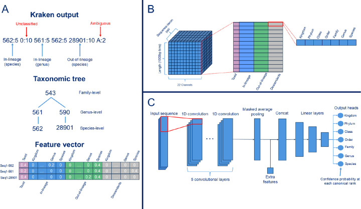
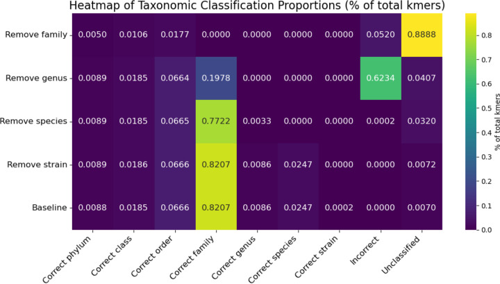
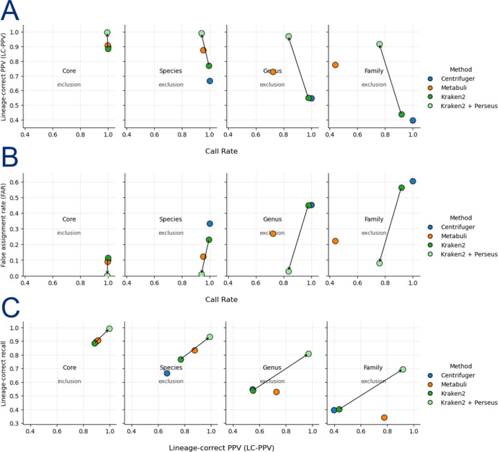
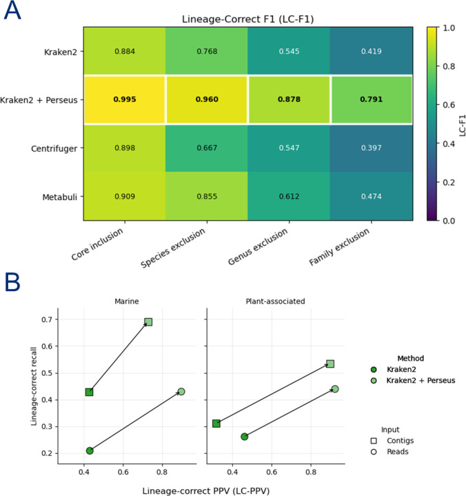
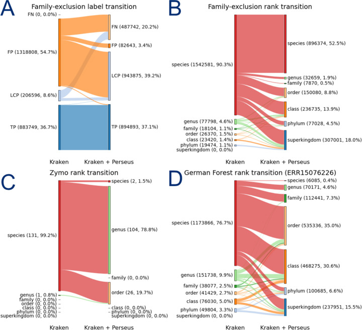

# Perseus: Уточнение таксономической классификации методом Kraken2 с учетом таксономической линии (lineage) для метагеномов, полученных из длинных ридов (read; короткий фрагмент ДНК после секвенирования).

> **Неофициальный перевод.** Оригинал: Matthew H. Nguyen, Michael C. Schatz. «Perseus: Lineage-Aware Refinement of Kraken2 Taxonomic Classification for Long Read Metagenomes». bioRxiv, 2026. DOI: [10.64898/2026.03.06.710148](https://doi.org/10.64898/2026.03.06.710148). Лицензия: CC BY-NC 4.0.

## Аннотация

Использование метагеномного секвенирования с длинными ридами (long reads) способствует повышению качества сборки (assembly) контигов (contig) и позволяет проводить анализ сложных микробных сообществ на уровне отдельных геномов. Однако точная таксономическая классификация как самих длинных ридов, так и полученных в результате сборки контигов остается сложной задачей. Высокомасштабируемые классификаторы, основанные на анализе k-меров (k-mer), такие как Kraken2, зачастую присваивают слишком детализированные таксономические метки при обработке данных, полученных с помощью длинных ридов; это приводит к высокому уровню ложноположительных результатов. Причиной служат редкие или локализованные совпадения k-меров, особенно в микробиомах, характеризующихся значительным таксономическим разнообразием.

Мы представляем **Perseus** — фреймворк для оценки уверенности (confidence score) в таксономической классификации, учитывающий особенности конкретной таксономической линии; он моделирует пространственное распределение и иерархическую согласованность k-меров вдоль последовательностей. Данный подход позволяет рассматривать таксономическую классификацию как задачу иерархической оценки уверенности, а не как простое предсказание категории на одном таксономическом ранге (taxonomic rank). Perseus уточняет таксономические сигналы на уровне отдельных k-меров, полученные от Kraken2, с помощью многослойной сверточной нейронной сети; эта сеть вычисляет скорректированные оценки уверенности (confidence score) в корректности классификации на каждом таксономическом ранге (taxonomic rank). Опираясь на эти оценки, Perseus либо подтверждает результаты классификации, либо переходит к более высоким таксономическим рангам, либо воздерживается от вывода при недостаточности доказательств; при этом приоритет отдается корректности и согласованности с соответствующей таксономической линией, а не чрезмерно детализированным назначениям. В ходе моделирования ситуаций, характеризующихся новизной таксономических форм, а также на реальных метагеномных наборах данных Perseus последовательно и существенно снижает уровень неверных классификаций, повышая при этом точность и согласованность результатов с таксономической линией. Наибольший эффект наблюдается при обработке длинных ридов и сформированных из них контигов: пространственный контекст позволяет надежно различать истинные таксономические сигналы и случайные совпадения.

Perseus совместим с существующими рабочими процессами Kraken2 и доступен по адресу [https://github.com/matnguyen/perseus](https://github.com/matnguyen/perseus).

## Введение

Точная таксономическая классификация представляет собой важнейший этап в метагеномных исследованиях; она позволяет определять состав микробных сообществ в клинических и экологических образцах [[25]]. Однако в экологических микробиомах, особенно в почвах, наблюдается один из самых высоких уровней микробного разнообразия на планете [[5]]; большая часть этих микроорганизмов не поддается культивированию и не имеет таксономической характеристики [[20]]. В метагеномике коротких ридов успешно применяются высокооптимизированные референсные базы (reference database) и классификаторы, основанные на анализе k-меров; к таким алгоритмам относятся широко используемые Kraken и Kraken2 [[6], [25]]. Эти алгоритмы обеспечивают сверхбыструю таксономическую классификацию за счет точного сопоставления k-меров и определения наименьшего общего предка [[9], [16]]. Алгоритм Kraken2 позволил дополнительно снизить потребности в памяти при одновременном расширении объема референсных баз; это способствовало унификации методов классификации на основе k-меров в различных областях метагеномики [[11, 24]].

Однако данные методы рассматривают последовательности в первую очередь как совокупность независимых совпадений k-меров и не моделируют явно, как таксономические данные распределяются вдоль последовательности. Это особенно актуально для технологий секвенирования с использованием длинных ридов, которые в настоящее время получают широкое распространение в этой области [[1], [3], [22], [26]]. Результаты нескольких сравнительных исследований показывают, что при применении классификаторов, основанных на k-мерах, к длинным ридам даже одна неверно идентифицированная область (например, случайное скопление совпадений k-меров) способна привести к, казалось бы, достоверным, но биологически неправдоподобным результатам классификации [13, 18]. Вследствие этого в наборах данных, полученных с помощью длинных ридов, часто наблюдается повышенный уровень ложноположительных результатов; это особенно характерно для случаев, когда искомый таксон отсутствует в референсной базе или когда близкие таксономические линии имеют схожие геномные фрагменты. Подобные ошибки возникают потому, что локальные совпадения k-меров могут оказывать решающее влияние на процесс классификации, даже если общий контекст последовательности не подтверждает принадлежность к данной таксономической линии.

Было предложено несколько подходов для решения этой проблемы: расширение референсных баз [[6], [15]], использование порогов уверенности [[25]] и применение постобработочных фильтров [[14]]. Однако простое увеличение объема референсных баз становится всё более сложной задачей: для многих экологических таксономических линий отсутствуют качественные представители [[17]]. Эвристики, основанные на уровне уверенности, требуют ручной настройки порогов под конкретный набор данных; эти пороги различаются в зависимости от используемых платформ секвенирования и условий эксперимента. При этом часто приходится жертвовать чувствительностью (sensitivity) ради специфичности, не понимая, почему то или иное предсказание следует отвергать [10]. В более общем плане современные методы не способны эффективно использовать многообразные пространственные и иерархические закономерности, присущие последовательностям; обычно каждая последовательность рассматривается как неструктурированный «набор голосов». Кроме того, эти методы в большинстве случаев игнорируют иерархическую природу таксономии: ошибочная классификация на уровне вида может при этом частично соответствовать действительности на уровне рода или семейства. Однако большинство фильтров принимают бинарные решения лишь на одном таксономическом ранге, не задействуя доказательства, согласующиеся с данной таксономической линией на других уровнях.

В данной работе мы представляем **Perseus** — сверточную нейронную сеть, учитывающую таксономическую линию; она уточняет результаты классификации длинных ридов и контигов, извлекаемые с помощью Kraken2, путем анализа пространственно структурированных закономерностей распределения k-меров вдоль каждой последовательности. Для каждой пары «последовательность–таксон», полученной от Kraken2, Perseus формирует 22-канальное представление, отражающее исходные сигналы k-меров, доказательства, относящиеся к данной таксономической линии и к другим линиям, а также вклад потомков и предков таксонов. Затем модель одновременно оценивает вероятности принадлежности к семи стандартным таксономическим рангам; это позволяет ей учитывать иерархичность таксономии и определять самый глубокий ранг, подтвержденный имеющимися данными. С точки зрения машинного обучения Perseus представляет собой модель иерархической оценки уверенности, действующую в пространстве таксономических меток; она позволяет рассматривать таксономическую классификацию не как определение единственного ранга, а как определение самой глубокой таксономической линии, подтвержденной доказательствами.

По сути, Perseus разделяет процесс накопления доказательств и оценку уровня уверенности в таксономической классификации: Kraken2 суммирует совпадения k-меров, а Perseus определяет, образуют ли эти совпадения целостную и согласованную с таксономической линией совокупность доказательств. Вместо того чтобы рассматривать k-меры как независимые элементы для голосования, Perseus производит оценку уровня уверенности с учетом таксономической линии, опираясь на пространственную и иерархическую согласованность этих k-меров; при этом моделируется распределение таксономических доказательств вдоль каждой последовательности. Благодаря этому Perseus способен определить самый глубокий таксономический ранг, подтвержденный наличием структурированных доказательств; при этом в случаях, когда назначение более точного ранга обусловлено лишь редкими или локализованными совпадениями, модель отказывается от такого назначения или воздерживается от него.

## Методы

### Обучающие и тестовые данные

Мы сформировали четыре экспериментальных набора данных на основе стандартной бактериальной референсной базы Kraken2 с целью систематической оценки устойчивости классификации при различной степени таксономической новизны изучаемых последовательностей. Три набора данных предназначены для моделирования возрастающего эволюционного расстояния между анализируемыми последовательностями и референсной базой: для этого из базы исключаются таксоны на уровне видов, родов и семейств соответственно. Чтобы уменьшить влияние фрагментированных или низкокачественных последовательностей, мы сначала отфильтровали бактериальную референсную базу, оставив лишь геномы длиной более 1 Мбп вместе с сопутствующими плазмидами. Затем для каждого уровня исключения таксоны распределялись по типам, после чего удалялись 250 видов, 150 родов или 100 семейств; при этом исключенные таксоны охватывали широкий спектр филогенетического разнообразия, а не концентрировались лишь в нескольких кладах. Помимо этих наборов данных, был создан еще один набор — «ядро», включающий виды, сохранившиеся во всех трех предыдущих наборах. В итоге каждый из четырех наборов данных стал самостоятельной Kraken2 референсной базой.

Затем мы используем MeSS [4] для генерации симулированных длинных ридов, необходимых для обучения и оценки модели. Для каждого набора данных как включенные, так и исключенные таксоны разделяются на три непересекающихся группы — для обучения, валидации и тестирования; для каждой из этих групп проводятся отдельные симуляции. Чтобы охватить различные характеристики данных, для каждого набора данных моделируются четыре варианта секвенирования: (i) высококачественные длинные риды PacBio HiFi (длина 8–22 тыс. пар оснований); (ii) более короткие и менее качественные длинные риды PacBio HiFi (длина 1–7 тыс. пар оснований); (iii) риды Oxford Nanopore длиной 2–100 тыс. пар оснований; (iv) распределение длин ридов Oxford Nanopore с длинным «хвостом», включающее риды длиной до 200 тыс. пар оснований. В процессе обучения модель обучается на данных всех четырех вариантов секвенирования; валидация и тестирование проводятся на отдельных симулированных наборах данных. Чтобы учесть реальное разнообразие обилия (abundance) различных таксонов в метагеномных образцах, диапазон покрытия (coverage) варьируется от 0.5× до 300×. С использованием этих данных модель обучается один раз на симулированных наборах данных и затем применяется без повторного обучения ко всем наборам данных для оценки.

Помимо этих синтетических наборов данных, мы также оцениваем работу Perseus на наборах данных CAMI II, связанных с растениями и морской средой. Кроме того, мы проверяем модель на реальных данных. Для оценки её эффективности на реальном наборе данных длинных ридов с известным составом видов мы используем результаты секвенирования ZymoBIOMICS Gut Microbiome Standard D6331 (регистрационный номер: SRR13128014) с платформы PacBio HiFi. В заключение мы применяем Perseus к метагеному почвы из леса Шёнбух [2], полученному с помощью технологии Oxford Nanopore; это служит пробным исследованием эффективности модели при работе со сложными микробиомами окружающей среды.

### Кодирование признаков

Kraken2 представляет собой таксономический классификатор, основанный на k-мерах; он присваивает последовательностям таксоны на основе совпадений k-меров с данными из референсной базы. Для этой цели используется компактная хеш-таблица минимизаторов (minimizer); каждому k-меру в последовательности сопоставляется наименьший общий предок всех референсных геномов (reference genome), содержащих данный k-мер. Итоговая классификация последовательности определяется путем агрегирования таксономических меток всех ее k-меров и выбора таксона с наибольшим количеством совпадений. Основным результатом работы Kraken2 является файл в формате табуляцией, в котором каждая строка соответствует одной последовательности; в файле пять столбцов: (1) статус классификации (C — классифицировано, U — не классифицировано), (2) имя последовательности/рида, (3) присвоенный таксономический идентификатор, (4) длина последовательности, (5) строка отчета по k-мерам, указывающая количество подряд идущих k-меров, относящихся к конкретному таксону.

Perseus рассматривает таксономическую фильтрацию как задачу оценки достоверности с учетом таксономической линии. Вместо того чтобы рассматривать k-меры независимо друг от друга, мы моделируем пространственную согласованность их распределения вдоль каждой последовательности. Для обучения модели Perseus мы формируем признаки путем постобработки выходных данных Kraken2 (Figure 1). Для каждой последовательности `s` программа Kraken2 выдает список таксономических назначений на уровне k-меров для каждой позиции `p:κs(p)∈𝒯`; при этом `𝒯` представляет собой множество таксономических идентификаторов NCBI, а `κs(p)=0` и `κs(p)=A` соответственно обозначают неклассифицированные и неоднозначные k-меры. Сначала мы разбиваем строку отчета о k-мерах для каждой последовательности на `T` неперекрывающихся блоков длиной `Δ=1000bp`; блок `Bt` охватывает позиции `[(t-1)Δ,tΔ)` для последовательности `t=1,…,T`. Для каждой таксономической линии `c`, присутствующей в выходных данных Kraken2 по конкретной последовательности, формируется пара «последовательность–таксономическая линия» `(s,c)`. Для каждой такой пары вычисляются признаки `C=22` с учетом таксономической линии по всем `T` блокам; в результате получается структурированное представление пространственного распределения k-меров, относящихся к таксономической линии `c`, вдоль данной последовательности.

Каждый признаковый канал отражает долю k-меров, отнесённых к тому или иному таксону, в пределах соответствующего интервала. Для последовательности `s` количество k-меров, отнесённых к таксону в интервале `Bt`, обозначается как 

```
Ns(t)=∑p∈Bt1κs(p)≠0∧κs(p)≠A
```

; при этом исключаются все k-меры, чьё отнесение по критерию Kraken2 не было классифицировано `κs(p)=0` или оказалось неоднозначным `κs(p)=A`. Все значения признаков принимаются равными нулю в тех случаях, когда выполняется условие `Ns(t)=0`.

Для обеспечения пространственной и иерархической согласованности таксономических данных мы разделяем каналы признаков на четыре категории в зависимости от их таксономической связи с предполагаемой таксономической линией `c`: необработанные данные, данные внутри таксономической линии, данные вне таксономической линии и данные о потомках. Канал необработанных данных отражает долю k-меров в группе `Bt`, которые точно отнесены к таксономической линии `c`: 

```
Xrawt,c=1Nst∑p∈Bt1κsp=c.
```

Доказательства, относящиеся к данной таксономической линии, учитывают те k-меры в данном бине, которые Kraken2 относит к любому из предков `c`; это свидетельствует о поддержке данной таксономической линии на более высоком таксономическом уровне. Пусть `anc(c)` обозначает множество всех таксонов-предков `c`, удовлетворяющих условию `anc(c)∈{kingdom,phylum,class,order,family,genus,species}`. Тогда 

```
Xint,c=1Nst∑p∈Bt1κsp∈ancc.
```

Данные, не относящиеся к данной таксономической линии, отражают долю k-меров, которые не были отнесены ни к `c`, ни к какому-либо предку `c`; это позволяет оценить наличие противоречивых сигналов: 

```
Xoutt,c=1Nst∑p∈Bt1κsp≠c∧κsp∉ancc.
```

Наконец, показатель потомков позволяет оценить степень поддержки более специфичных таксонов, расположенных ниже `c`. Пусть `desc(c)` обозначает совокупность всех строгих потомков `c` в таксономическом дереве. Тогда 

```
Xdesct,c=1Nst∑p∈Bt1κsp∈descc.
```

В совокупности эти каналы отражают распределение сигналов, соответствующих данной таксономической линии, а также сигналов, ей не соответствующих, по всей последовательности; в результате формируется тензорное представление `Xs,c∈RC×T`, используемое сверточной нейронной сетью.

### Архитектура модели

Для выявления пространственных закономерностей таксономических признаков и моделирования иерархической структуры таксономических рангов мы используем многоголовочную одномерную сверточную нейронную сеть, работающую с тензором признаков `Xs,c∈RC×T` для каждой пары «последовательность–таксон». Сеть начинает работу с пяти 1D сверточных блоков, извлекающих локальные пространственные закономерности в соседних областях. Затем применяется маскированное усреднение, позволяющее получить вектор фиксированной длины из результатов свертки; при этом позиции, заполненные нулями, игнорируются, что обеспечивает обработку последовательностей разной длины. Далее длина последовательности объединяется с полученным вектором, формируя единый эмбеддинг. Этот совместный эмбеддинг проходит через три полносвязных слоя; после этого финальный слой разделяется на семь независимых выходных головок, соответствующих основным таксономическим рангам — от царства до вида. В процессе обучения для каждой головки независимо применяется фокальная функция потерь; это позволяет уделить больше внимания сложным примерам с низкой уверенностью и устранить дисбаланс классов между различными таксономическими рангами, особенно на самых высоких уровнях, где значение Kraken2 уже достаточно точно определено. Для последовательностей, не имеющих меток по определенным таксономическим рангам, вклад соответствующих головок в функцию потерь маскируется; общая функция потерь нормализуется по количеству предсказаний по всем таксономическим рангам в каждой партии данных.

Поскольку необработанные выходные данные сигмоиды для каждой головы часто плохо калибруются, мы применяем постфактум изотоническую регрессию для преобразования оценок, полученных с помощью сверточных нейронных сетей, в надежные оценки вероятности. Для сбора пар «сырые оценки CNN» — «бинарные метки корректности» по каждому таксономическому рангу использовался валидационный набор данных, составляющий 20% от обучающего набора и стратифицированный по видам. Для каждого ранга мы строим отдельную модель изотонической регрессии, получая монотонное отображение от сырых оценок к эмпирическим частотам корректности. Данная процедура позволяет привести выходные данные к калиброванной шкале вероятностей; в результате каждая голова выдает единственное значение вероятности `ys,c(r)∈[0,1]`, отражающее уверенность в том, что таксон `c` корректно определен на ранге `r`.

### Метрики оценки качества

Мы измеряем точность работы Kraken до и после применения Perseus на уровне каждого рид (read). Поскольку риды, сгенерированные с помощью MeSS, можно сопоставить с соответствующим референсным геномом, для каждого смоделированного рида известна его таксономическая принадлежность согласно эталонным данным (ground truth). Большинство используемых нами метрик эффективности основаны на определениях, применяемых в исследованиях по бенчмаркингу Kraken [25]; к ним относятся количество истинно положительных результатов (TP), количество таксономических результатов, соответствующих таксономической линии (LCP), количество ложно положительных результатов (FP) и количество ложно отрицательных результатов (FN). Для вида, являющегося эталонными данными (ground truth), истинно положительный результат возникает, когда классификация совпадает с этими данными. Результат типа LCP возникает, когда классификация указывает на таксон, являющийся предком истинного вида в рамках таксономической линии. Ложно положительный результат (FP) представляет собой неверную классификацию, не совпадающую с истинным видом и не входящую в его таксономическую линию. Ложно отрицательный результат (FN) возникает в случае, когда Kraken2 или Perseus не могут присвоить последовательности какую-либо классификацию. Все последовательности в наборах данных для анализа должны соответствовать записям в референсной базе как минимум на уровне типа; поэтому в данном контексте оценки понятие «истинно отрицательный результат» не определяется.

Используя эти категории, мы определяем долю корректно классифицированных последовательностей как отношение числа последовательностей, получивших таксономическую принадлежность на любом уровне, к общему числу последовательностей: (TP + LCP + FP) / (TP + LCP + FP + FN). Положительную прогностическую ценность (PPV) мы определяем как долю корректных классификаций среди всех результатов, при этом исключая случаи, когда таксономическая линия определена верно: TP / (TP + FP). Кроме того, вводится понятие положительной прогностической ценности с учетом верной таксономической линии: (TP + LCP) / (TP + LCP + FP). Долю некорректных классификаций (FAR) определяем как отношение числа неверных результатов к общему числу всех результатов: FP / (FP + TP + LCP). Показатель воспроизводимости определяется как доля последовательностей, корректно классифицированных: TP / (TP + LCP + FP + FN). Оценка F1-балла рассчитывается как гармоническое среднее показателя воспроизводимости и положительной прогностической ценности. Поскольку F1-балл не учитывает верность определения таксономической линии, вводится также показатель воспроизводимости с учетом верной таксономической линии: (TP + LCP) / (TP + LCP + FP + FN). Соответственно, LC-F1-балл определяется как гармоническое среднее показателя воспроизводимости с учетом верной таксономической линии и положительной прогностической ценности с учетом этой же верности.

## Результаты

### Эксперимент по удалению таксономического ранга

Мы провели эксперимент по удалению последовательностей определённого таксономического ранга с целью изучения сценариев сбоев в работе Kraken2 при классификации последовательностей из новых геномов. Сначала мы создали стандартную бактериальную базу данных Kraken2, включающую все RefSeq полные бактериальные геномы. Затем мы выполнили запрос по подштамму *E. coli* O104:H4. После этого мы удалили все последовательности вида *E. coli*, вновь сформировали базу данных Kraken2 и повторно выполнили запрос по подштамму O104:H4. Далее мы повторили эту процедуру для удаления всех последовательностей рода *Escherichia*, а также после удаления всех последовательностей из семейства Enterobacteriaceae.

На каждом уровне мы подсчитываем количество k-меров, относящихся к следующим категориям: «корректные» — k-меры, которые напрямую соответствуют субштамму O104:H4; «корректные по таксономической линии» — k-меры, отнесенные к более высокому таксономическому рангу в рамках таксономической линии данного субштамма; «некорректные» — k-меры, не соответствующие данной таксономической линии; «не классифицированные» — k-меры, которые не удалось классифицировать или чья классификация оказалась неоднозначной.

Как видно на Figure 2, большинство k-меров соотносятся с таксономическими группами не ниже уровня семейства; лишь 0.02% k-меров относятся к правильному штамму. Следовательно, первичные определения штамма обычно подтверждаются лишь небольшим числом k-меров. Это обусловлено высокой степенью сходства последовательностей у близкородственных видов, а также ограниченным количеством k-меров, специфичных именно для данного штамма. В результате точные прогнозы основываются на скудных данных и становятся особенно подверженными ошибкам в тех случаях, когда в базе данных отсутствуют точные совпадения.

Это поведение становится очевидным при удалении всего рода *Escherichia*: уровень неверной классификации возрастает до 62%. При удалении всей семейства Enterobacteriaceae подавляющее большинство k-меров остаются неклассифицированными (89%), что является желательным результатом для по-настоящему новых последовательностей. Однако даже в этих идеализированных условиях Kraken2 всё равно демонстрирует 5%-ный уровень неверной классификации, что выше показателя при удалении лишь отдельных видов или рода. В сценарии исключения семейства наблюдается, что неверно классифицированные k-меры не распределяются случайным образом по таксономической иерархии: 9.7% таких k-меров приходится на семейство Morganellaceae. На уровне видов наиболее частым случаем ложноположительной классификации является *Proteus mirabilis*, на долю которого приходится 6.1% всех неверно классифицированных k-меров. Это свидетельствует о том, что даже при отсутствии классификации для большинства k-меров оставшиеся ложноположительные результаты могут соответствовать соседним, но неверным таксонам; это подчеркивает уязвимость классификаторов, основанных на точном совпадении k-меров, при неполноте референсной базы. В совокупности эти результаты показывают, что значительная часть таксономических назначений, сделанных Kraken2, обусловлена ложноположительными данными, возникающими из-за некорректного сопоставления k-меров, особенно в условиях неполной или недостаточно детализированной референсной базы.

### Источник ошибочной классификации

Для лучшего понимания причин ошибочной классификации мы сначала выполнили выравнивание последовательностей субштамма *E. coli* O104:H4 по отношению к референсному геному штамма *Proteus mirabilis* HI4320 с помощью программы Minimap2 [8]. В результате было выявлено 13 локальных участков выравнивания (средняя длина — 1147 пар оснований). Аннотация этих участков в субштамме O104:H4 показала, что они соответствуют оперонам рРНК. За пределами этих рибосомных участков не наблюдалось ни одного консервативного участка, кодирующего белки; это свидетельствует о том, что сигнал *Proteus* обусловлен высоко консервативными рибосомными последовательностями, а не общим геномным сходством.

Для оценки степени консервативности последовательностей в бактериальных геномах мы случайным образом отобрали 100 референсных геномов бактерий из RefSeq и выполнили все возможные парные сравнения целых геномов с использованием программы MUMmer4 [12]. Данный анализ развивает результаты предыдущего исследования, изучая консервативность последовательностей в широком наборе бактериальных геномов; это позволяет лучше понять специфическое сходство между геномом O104:H4 и геномом *Proteus mirabilis*.

Среди всех 9000 пар геномов в 73 % случаев (то есть в 6604 парах) наблюдалось наличие хотя бы одного консервативного участка длиной не менее 50 пар оснований; это свидетельствует о наличии множества смежных совпадений k-меров (для 31-меров их количество составляет минимум 50–31+1=20) в Kraken2. Кроме того, в 24 % пар (2154 пары) обнаруживался хотя бы один консервативный участок длиной не менее 200 пар оснований. В среднем на одну пару геномов приходилось 170 консервативных участков; медианное значение равнялось 4. Это указывает на то, что большинство пар геномов имеют лишь ограниченное количество консервативных участков длиной ≥ 50 пар оснований, тогда как небольшая часть пар содержит до 12 000 таких участков. Как правило, эти консервативные участки оказывались короткими: средняя длина участков длиной ≥ 50 пар оснований составляла 256 пар оснований, а медианная — 73 пары оснований. Это означает, что типичный консервативный участок превышает стандартную длину k-мера, используемую в таких классификаторах, как Kraken2 (31 пара оснований); следовательно, он охватывает множество смежных k-меров, что служит механистическим объяснением тому, как короткие консервативные участки могут порождать ошибочные данные о совпадениях k-меров. Напротив, средняя длина консервативных участков длиной ≥ 200 пар оснований составляет 3.03 тыс. пар оснований, а медианная — 1.28 тыс. пар оснований.

Для последовательной аннотации выравненных участков каждый геном независимо аннотировался с помощью программы Bakta [[21]], в результате чего получались аннотации в формате GFF3, включающие белок-кодирующие гены, структурные РНК-элементы и прочие геномные особенности. Выравненные участки пересекались с результатами геномной аннотации с использованием инструмента bedtools intersect [19]. В случае интервалов выравнивания, пересекающихся с несколькими геномными особенностями, выбиралась та особенность, с которой наблюдалось наибольшее перекрытие; это позволяло присвоить каждому выравненному участку единственную аннотацию. Впоследствии выравненные участки классифицировались на общие категории: белок-кодирующие участки, РНК, мобильные генетические элементы и участки межгенного пространства — в зависимости от типа соответствующей геномной особенности.

Для оценки взаимосвязи между длиной выравненных участков и степенью их функциональной консервативности участки были разбиты по длине на интервалы от 50 пар оснований до 200 пар оснований; для каждого интервала рассчитывалась доля участков, пересекающихся с аннотированными консервативными элементами. На основе полученных данных по всем парам геномов были вычислены сводные статистические показатели, позволяющие систематически анализировать консервативные участки, способные образовывать совпадения с k-мерами, что в свою очередь может привести к ошибочному определению таксономической принадлежности.

Среди консервированных участков длиной не менее 200 пар оснований 93% совпадают с аннотированными элементами. Из этих аннотированных участков (184 916) 143 206 (77.44%) относятся к областям, кодирующим белки; 27 348 (14.79%) — к структурированным РНК-элементам; 14 362 (7.77%) — к мобильным генетическим элементам. Среди генов, кодирующих белки, консервированные участки в наибольшей степени соответствуют важнейшим генам, обеспечивающим базовые клеточные функции: генам, участвующим в процессах транскрипции и трансляции (например, субъединицам РНК-полимеразы и элонгационным факторам), метаболическим ферментам (например, нитратредуктазе и транскетолазе), а также бактериальным молекулярным шаперонам (например, GroEL, DnaK). Примечательно, что наиболее распространенной категорией среди этих генов являются гипотетические белки. Структурированные РНК-элементы также встречаются часто; длинные консервированные участки часто совпадают с оперонами рРНК, причем наиболее распространенными являются участки, соответствующие 23S рРНК, за ними следуют участки, соответствующие 16S рРНК. Многочисленные виды тРНК и трансфер-мессенджерная РНК SsrA также представлены в значительной степени. Наконец, большая часть длинных консервированных участков относится к мобильным генетическим элементам; преимущественно это транспозазы семейства вставочных последовательностей (IS), среди которых наиболее распространенными являются представители семейства IS1.

Полученные результаты свидетельствуют о том, что ошибочная таксономическая классификация зачастую обусловлена наличием коротких, локализованных в пространстве консервативных участков, формирующих скопления совпадений k-меров. Это подтверждает необходимость разработки методов, учитывающих пространственное распределение и согласованность таксономических линий данных k-меров вдоль последовательностей.

### Влияние пороговой обработки оценки уверенности

В Kraken2 параметр уверенности (`--confidence`) определяет минимальную долю k-мерных данных, необходимую для подтверждения принадлежности последовательности к тому или иному таксону; это обеспечивает соблюдение минимального порога достоверности и приводит к тому, что последовательности с недостаточной поддержкой переклассифицируются в более высокие таксономические ранги или помечаются как неклассифицированные. Чтобы выяснить, способно ли изменение внутреннего параметра уверенности в Kraken2 уменьшить количество чрезмерно специфичных назначений, мы оценили эффективность классификации при различных значениях этого параметра (от 0.0 до 1.0 с шагом 0.01). Для каждого значения параметра риды классифицировались независимо друг от друга, а результаты проверялись с использованием одних и тех же наборов данных для включения и исключения (Supplementary Figure S1).

Как и ожидалось, увеличение порога оценки уверенности приводит к монотонному снижению общего процента правильных классификаций во всех наборах данных. В наборе данных для включения процент правильных классификаций оставался высоким при широком диапазоне пороговых значений, однако резко падал при их экстремальных значениях (> 0.9). В наборах данных для исключения исходный процент правильных классификаций был ниже, а его снижение при увеличении порога происходило быстрее, особенно при исключении таксонов семейного таксономического ранга. Положительная прогностическая ценность значительно возрастает при переходе от порога 0.0 к небольшим положительным значениям; при этом при промежуточных порогах её изменения незначительны. При очень высоких значениях оценки уверенности положительная прогностическая ценность подвержена колебаниям из-за существенного уменьшения числа классифицированных ридов. Аналогичные тенденции наблюдаются и для LC-PPV: этот показатель постепенно растёт с увеличением оценки уверенности и достигает максимальных значений лишь при таких порогах, при которых большое количество ридов не поддаётся классификации. Показатель FAR уменьшается при повышении порога оценки уверенности, однако на промежуточных значениях он стабилизируется. При экстремальных порогах FAR стремится к нулю, поскольку большинство ридов классифицируются на более высокие таксономические ранги или остаются неклассифицированными. В соответствии с этими тенденциями значение F1-балла неуклонно снижается с ростом порога оценки уверенности, что отражает компромисс между повышением точности и снижением полноты классификации.

Полученные результаты показывают, что хотя повышение порога уверенности Kraken2 приводит к снижению количества неверных классификаций, это достигается в основном за счёт резкого уменьшения доли корректно классифицированных последовательностей. В широком диапазоне промежуточных значений порога уверенности в исключаемых наборах данных сохраняется значительная доля неверных классификаций; это свидетельствует о том, что сама по себе фильтрация по уровню уверенности не способна устранить чрезмерно специфичные классификации, подтверждаемые наличием локализованных и консервативных k-меров. Следовательно, можно сделать вывод, что порог уверенности Kraken обусловливает грубый баланс между точностью и полнотой классификаций, не учитывая при этом пространственную или иерархическую согласованность данных, полученных на основе k-меров.

### Оценка на наборах данных включения/исключения

Далее мы оцениваем работу Perseus на как смоделированных, так и стандартных метагеномных наборах данных: в том числе на ридах, сгенерированных с помощью MeSS из нашего основного набора данных, а также на трех наборах данных с исключениями; кроме того, используются смоделированные риды и собранные контиги из стандартных наборов данных CAMI II, относящихся к морским и растительным экосистемам. Основной и наборы данных с исключениями позволяют нам изучить поведение классификатора при различной степени неполноты референсной базы, что соответствует исключению таксонов на уровне семейств, родов и видов. В свою очередь, наборы данных CAMI II дают возможность оценить работу Perseus как на уровне отдельных ридов, так и на уровне контигов. Для каждого стандартного набора данных мы сравниваем результаты классификации, полученные с помощью базового Kraken2, с результатами, полученными после постобработки с применением Perseus (Supplementary Table S1).

Мы оцениваем эффективность работы Kraken2 и Kraken2 после фильтрации с использованием Perseus, а также Centrifuger [[23]] и Metabuli [7] в Figure 3. И Centrifuger, и Metabuli представляют собой методы классификации, основанные на референсных данных: Centrifuger применяет FM-индекс для точного сопоставления нуклеотидных последовательностей, тогда как Metabuli использует гибридную систему k-меров (т.н. «метамеры»), в которой учитывается степень сохранности аминокислотных последовательностей; это позволяет повысить чувствительность к гомологичным последовательностям при наличии нуклеотидных различий. Во всех наборах данных как с включением, так и с исключением таксономических линий Kraken2 демонстрирует стабильно высокий процент корректных определений, однако характеризуется повышенным уровнем ложноотрицательных результатов, особенно в случаях исключения таксономических единиц высокого ранга; в наборе данных с исключением семейств этот показатель достигает 50%, что свидетельствует о чувствительности метода к неполноте референсных данных. Напротив, Perseus значительно повышает положительную прогностическую ценность при учете таксономических линий (Панель А) и снижает уровень ложноотрицательных результатов (Панель Б), особенно в экспериментах по исключению таксономических единиц. Эти улучшения обусловлены более консервативным подходом к классификации, основанным на согласованности с таксономической линией. Хотя после фильтрации снижается общий процент корректных определений, это обусловлено сознательным отказом от присвоения классификации в случаях неопределенности на низких таксономических уровнях, а не ошибочными классификациями.

На панели C показано соотношение точности и полноты для модели Perseus; оно свидетельствует о смещении прогнозов в сторону более высокой положительной прогностической ценности при сохранении конкурентоспособной полноты по правильным таксономическим линиям. Такое поведение указывает на то, что модель Perseus предпочитает использовать более высокие таксономические ранги в рамках соответствующей таксономической линии, вместо того чтобы делать чрезмерно уверенные предсказания на уровне видов. Важно отметить, что после фильтрации модель Kraken2 с применением Perseus демонстрирует лучшие показатели по положительной прогностической ценности, частоте ложных срабатываний и LC-F1 по сравнению с Centrifuger и Metabuli практически во всех экспериментах. В сценариях исключения более высоких таксономических рангов пайплайн, включающий фильтрацию по Perseus и обработку Kraken2, обеспечивает наилучшее соотношение точности и полноты. На панели A (Figure 4) видно, что после постобработки с помощью Perseus значение LC-F1 остается максимальным, что свидетельствует о повышенной устойчивости модели в условиях анализа геномов, ранее не встречавшихся в обучающей выборке.

Как видно из Figure 5, Perseus подавляет низкодоверительные и ошибочные назначения на низкие таксономические уровни, преобразуя большое количество ложноположительных результатов в назначения на более высокие уровни, соответствующие таксономической линии (теперь называемые LCP), либо в случаи воздержания от назначения (FN/неклассифицированные), при этом сохраняя значительную часть истинно-положительных результатов. Также наблюдается, что многие ложноположительные результаты переклассифицируются в LCP; это свидетельствует о том, что многие из них возникают из-за чрезмерно специфичных назначений, а не из-за полностью неверных назначений на высокие таксономические уровни. Эти результаты демонстрируют осторожное поведение Perseus, которое ставит во главу угла корректность и соответствие таксономической линии, особенно на более высоких уровнях классификации, вместо того чтобы делать чрезмерно уверенные назначения на низкие уровни. Важно отметить, что Perseus не просто снижает общий уровень назначений; напротив, многие ложноположительные назначения на уровне видов преобразуются в назначения на более высокие уровни, соответствующие таксономической линии, вместо того чтобы полностью игнорироваться, что указывает на целенаправленное и учитывающее таксономические уровни уточнение результатов, а не простое безосновательное воздержание от назначений.

### Оценка на наборах данных CAMI

На тестовых наборах данных CAMI II после фильтрации с использованием Perseus наблюдается повсеместное улучшение показателей положительной прогностической ценности, LC-PPV и FAR. В случае морского набора данных частота выявления объектов умеренно снижается как для ридов, так и для контигов. Напротив, при обработке ридов, связанных с растениями, Perseus практически полностью устраняет ложные назначения (значение FAR становится крайне низким); однако при этом происходит значительное сокращение частоты выявлений, а также снижение значения F1-оценки. Это, вероятно, обусловлено тем, что длинные риды в данном наборе чрезвычайно короткие — их средняя длина составляет всего 2 кб. Примечательно, что при применении Perseus к контигам, связанным с растениями, степень консервативности алгоритма заметно снижается: наблюдается улучшение показателей положительной прогностической ценности, LC-PPV и FAR при сохранении более сбалансированной частоты выявлений. Эти результаты указывают на два ключевых свойства алгоритма: во-первых, Perseus эффективнее работает с более длинными ридами или даже контигами, когда доступен более широкий контекст k-меров; во-вторых, в условиях сильно неизученных или слабо представленных экосистем Perseus отдает предпочтение консервативным прогнозам, предпочитая воздерживаться от выводов, чем делать излишне уверенные, но ошибочные классификации.

На тестовых наборах CAMI II (панель B на рис. Figure 4) алгоритм Perseus неизменно повышает точность и чувствительность при определении таксономической линии по сравнению с Kraken2. В морском наборе данных как риды, так и контиги демонстрируют заметное улучшение показателей LC-PPV и точности восстановления таксономической линии после фильтрации. Наибольший эффект наблюдается для контигов: значение LC-PPV существенно возрастает, а чувствительность увеличивается с 0.43 до 0.69. Это свидетельствует о том, что Perseus способен использовать более длинный контекст последовательности для уточнения таксономической классификации без снижения чувствительности. В данных, связанных с растениями, также наблюдается улучшение как для ридов, так и для контигов. Для ридов Perseus повышает значение LC-PPV и одновременно улучшает точность восстановления таксономической линии. Для контигов эффект ещё более выражен: одновременно возрастают как LC-PPV, так и чувствительность, что указывает на благоприятное изменение соотношения точности и полноты классификации.

### Оценка на реальных данных

Мы также применили Perseus к ридам типа PacBio HiFi, полученным из стандартного образца микробиома кишечника ZymoBIOMICS Gut Microbiome Standard (SRR13128014) (панель C на рисунке Figure 5). В данном искусственно созданном сообществе Kraken2 уже демонстрирует высокую эффективность на уровне видов, поскольку все 21 присутствующий вид хорошо представлены в референсных базах и, как правило, существенно отличаются друг от друга. В случае верно определенных объектов Perseus отказывается от присвоения видовых или штаммовых категорий в пользу более высоких таксономических рангов, чаще всего уровня рода. Это обусловлено отсутствием достаточных k-мерных данных, подтверждающих таксономическую линию и пространственную структуру на уровне видов. Следовательно, Perseus отдает предпочтение таксономическим назначениям на более высоких рангах, которые имеют надежную поддержку данных, даже если более детальные предсказания могут оказаться верными. В результате Perseus эффективно устраняет ошибки типа Kraken2: Perseus отфильтровывает большую часть некорректных классификаций на уровне видов, предложенных Kraken2, переводя их на соответствующие более высокие таксономические ранги. В совокупности эти результаты показывают, что Perseus идет на компромисс между таксономической детализацией и повышением надежности классификации на более высоких рангах, таких как уровень рода или семейства.

Затем мы применили Perseus к отдельным ридам, полученным с использованием технологии Oxford Nanopore из образца почвы из леса Шёнбух в Германии (панель D на рисунке Figure 5). Для данного образца также проводились тесты на время выполнения и потребление памяти (Supplementary Table S2). Эти данные отличаются большим разнообразием и неравномерным покрытием, что создает особенно сложную задачу для таксономической классификации на основе k-меров. В результатах, полученных с помощью базового Kraken2, наиболее частыми являются назначения таксономического ранга на уровне вида; более 1 100 000 ридов получили такую классификацию. Однако после фильтрации с применением Perseus лишь 5974 рида сохранили назначение на уровне вида, то есть снижение более чем на 2 порядка величины. Вместо того чтобы считать эти риды неклассифицированными, Perseus консервативно назначает большинству из них более высокие таксономические ранги: в основном на уровне отряда (35 %) или класса (30 %); при этом назначения на еще более высокие ранги встречаются редко.

Чтобы выяснить, связано ли снижение числа классификаций на уровне видов повышением специфичности анализа, а не утратой информации, мы изучили количество k-меров, подтверждающих эти классификации. В исходных результатах, полученных с использованием Kraken2, классификации на уровне видов часто подтверждались лишь небольшим числом k-меров (медиана — 5, среднее значение — 14), несмотря на то, что длина ридов обычно превышала килобазы. После фильтрации с применением Perseus у оставшихся классификаций на уровне видов поддержка со стороны k-меров значительно возросла: медиана составила 187, а среднее значение — 389 k-меров, соответствующих данному таксону. Эта тенденция сохраняется и после нормализации по длине ридов; показатель поддержки, нормализованный по длине, существенно увеличивается после фильтрации с использованием Perseus.

Для дальнейшего изучения биологической обоснованности механизма «отката» у Perseus мы оценили степень подтверждения результатов выравнивания с помощью программы Minimap2 [8] для различных групп классификаций в анализируемом образце. Для рид Kraken2, изначально отнесенных к определенному виду, мы сгруппировали результаты по итоговому таксономическому рангу, определенному Perseus, после чего рассчитали процент успешно выровненных рид и медианное значение покрытия среди этих рид (Supplementary Figure S2). Рид, оставшиеся в категориях вида или рода, демонстрируют практически полное выравнивание и высокое медианное покрытие; это свидетельствует о высокой степени соответствия с использованным референсным геномом. Однако у рид, которые Perseus относит к более высоким таксономическим рангам (семейство и выше), наблюдается значительно меньший процент выравнивания и резкое снижение покрытия. Такое монотонное уменьшение показателей указывает на то, что Perseus сохраняет точные таксономические назначения лишь при наличии достаточных последовательностных данных; в противном случае происходит откат к более общим категориям. Полученные результаты служат подтверждением корректности подхода Perseus, а также демонстрируют, что модель оценки уверенности Perseus позволяет проводить биологически обоснованную таксономическую классификацию в реальных данных микробиома: она сохраняет надежно подтвержденные назначения и систематически исключает ошибочные предсказания на тонком уровне таксономии.

## Обсуждение

Точная таксономическая классификация метагеномных данных, полученных с использованием длинных ридов, по-прежнему представляет сложность, особенно в случае сложных экологических микробиомов, где для многих организмов в референсных базах отсутствуют близкие аналоги. Хотя классификаторы, основанные на k-мерах, такие как Kraken2, позволяют выполнять таксономическую идентификацию с высочайшей скоростью, при применении их к длинным ридам или собранным контигам они часто дают чрезмерно специфичные результаты. Проведенный нами анализ показывает, что подобные ошибки обусловлены редкими скоплениями консервативных k-меров, происходящих из общих геномных элементов — таких как гены, необходимые для поддержания жизнедеятельности, участки рРНК или мобильные генетические элементы. Эти локальные сигналы могут ошибочно подтверждать назначение организма к определенной таксономической линии, даже если общий контекст последовательностей не подтверждает такого вывода. Кроме того, наши результаты свидетельствуют о том, что эти ошибки невозможно эффективно устранить с помощью внутреннего порога уверенности, используемого в Kraken2: данный механизм снижает количество неверных назначений в основном за счет увеличения числа случаев воздержания от классификации, а не за счет определения того, подтверждают ли имеющиеся данные принадлежность организма к более глубокому уровню таксономической иерархии.

Для устранения этого недостатка мы разработали Perseus — фреймворк постобработки, учитывающий таксономическую линию; он уточняет классификации, полученные с помощью Kraken2, моделируя пространственное распределение и иерархическую согласованность k-мерных признаков вдоль каждой последовательности. В ходе экспериментов с моделированием включения/исключения последовательностей, тестов по стандарту CAMI и анализа реальных наборов данных Perseus неизменно снижал количество ложноположительных классификаций, сохраняя при этом корректные классификации более высоких таксономических уровней. Эти улучшения особенно заметны в условиях высокой таксономической новизны, когда неполнота референсной базы повышает вероятность чрезмерно детализированных классификаций. Важно отметить, что многие ложноположительные назначения на уровень вида преобразуются в корректные предсказания более высоких таксономических уровней, а не просто отбрасываются. В рамках всех тестовых сценариев Perseus значительно повысил положительную прогностическую ценность и LC-PPV; эти показатели зачастую достигали уровня 0.99, при этом существенно снижая частоту ложноположительных результатов. Хотя в некоторых случаях это приводит к снижению чувствительности на уровне вида, такой подход лучше отражает биологическую специфику многих окружающих микробиомов, где высокая таксономическая новизна и неполнота референсной базы ограничивают достоверность детализированных классификаций. В подобных условиях достоверные предсказания на более высоких таксономических уровнях часто несут больше информации, чем ошибочные предсказания на уровне вида.

Наибольшее улучшение производительности наблюдалось при обработке длинных ридов и собранных контигов: в этих случаях пространственный контекст позволяет более надёжно различать сигналы, соответствующие определённой таксономической линии, и локализованные консервативные совпадения последовательностей. Важно отметить, что Perseus вызывает лишь незначительное увеличение вычислительной нагрузки и работает непосредственно с типовыми выходными данными Kraken2, не требуя при этом изменений в референсной базе или внутренней структуре классификатора. Такая архитектура позволяет легко интегрировать Perseus в уже существующие рабочие процессы, основанные на Kraken2, для проведения крупномасштабных метагеномных исследований. В более широком смысле данная работа показывает, что при разработке систем таксономической классификации длинных ридов и контигов целесообразно разделять процесс накопления доказательств и оценку их достоверности. Современные классификаторы, основанные на анализе k-меров, весьма эффективно агрегируют последовательностные данные, однако они не проверяют, образуют ли эти данные пространственно и иерархически согласованную структуру вдоль всей последовательности. Предложив подход к таксономической классификации, учитывающий особенности таксономической линии и требующий оценки достоверности результатов, Perseus позволяет определить наиболее глубокий таксономический ранг, подтверждённый наличием согласующихся доказательств, вместо того чтобы навязывать предсказание лишь для одного ранга.

Помимо текущей реализации, существует ряд перспективных направлений для дальнейших исследований. Perseus не пытается переклассифицировать последовательности за пределами той таксономической линии, которую определил Kraken2; поэтому он не способен присваивать точные метки таксонам, находящимся вне этой линии. Проведенные нами эксперименты показывают, что это в основном обусловлено пробелами в референсных базах, а не ограничениями модели Perseus. Тем не менее в будущем можно будет расширить данную модель так, чтобы она оценивала степень таксономической новизны последовательностей относительно референсной базы. Это, в свою очередь, может способствовать разработке методов последующего анализа, включая целенаправленную сборку (генома) ранее неизученных таксономических линий. Кроме того, перенос подхода к оценке уверенности с учетом таксономической линии на результаты работы других классификаторов, таких как Centrifuger или Metabuli, представляет собой перспективное направление для улучшения таксономической классификации независимо от используемого алгоритма. Наконец, наше исследование ограничивалось бактериальными геномами; расширение применения Perseus на архейные, вирусные и эукариотические последовательности станет важным шагом в дальнейших работах.

Подводя итог, следует отметить, что Perseus предлагает масштабируемый и обоснованный подход к снижению чрезмерной специфичности таксономических назначений в метагеномике длинных ридов. Благодаря моделированию пространственных закономерностей и характеристик таксономической линии, присущих k-мерам, Perseus позволяет получать классификации, более точно отражающие степень достоверности и ограничения исходных последовательностей, особенно в сложных и слабо изученных микробных сообществах. Это наглядно демонстрирует, как разделение процессов накопления доказательств и оценки их достоверности способствует повышению надежности классификации в метагеномике длинных ридов.

## Дополнительные материалы

**Дополнительная информация:** Дополнительные данные доступны онлайн.

## Благодарности

Мы хотели бы поблагодарить наших коллег из консорциума BioDIGS. Также мы благодарим Бена Лэнгмида, Стивена Сальцберга, Сину Маджидиан, Омара Ахмеда, Махлера Ревсина, Викрама Шивакумара, Александра Свитена и Алекса Островского за полезные обсуждения.

### Финансирование

Данная работа частично финансировалась за счёт грантов NIH U24 AI183870, U24 HG010263, U41 HG006620 и гранта NSF DBI-2419522, предоставленных М.К.С.

Конфликт интересов

Конфликта интересов не выявлено.

## Доступность кода

Код для Perseus распространяется в открытом доступе на платформе `Github`: [https://github.com/matnguyen/perseus](https://github.com/matnguyen/perseus). `Perseus` можно установить посредством `Conda`, `pip` или `Docker`. Скрипты, необходимые для воспроизведения результатов, доступны на `Github`: [https://github.com/matnguyen/perseus-scripts](https://github.com/matnguyen/perseus-scripts).



**Рис. 1:.** Кодирование признаков и архитектура модели в Perseus. (A) Распределение k-меров Kraken2, определённых для каждой последовательности, агрегируется в интервалы по 1 кб, в результате чего формируется многоканальный тензор признаков. Для каждой пары «последовательность–таксон» каналы отражают распределение k-меров, относящихся к данному таксону (taxid `c`), его предкам (в рамках той же таксономической линии), потомкам и таксонам, не входящим в эту линию, на различных таксономических рангах (от царства до вида). Такая репрезентация сохраняет пространственную структуру таксономических сигналов вдоль последовательности. (B) Пример преобразования выходных данных Kraken2 в тензор признаков. Показано распределение k-меров для последовательности Kraken2, изначально отнесённой к таксону с номером 562. Для каждой пары «последовательность–таксон» алгоритм Perseus формирует векторы признаков, отражающие как согласующиеся, так и несогласующиеся с таксономической линией данные. В данном примере для каждого k-мера указаны таксономические идентификаторы 562 (*Escherichia coli*), 561 (*Escherichia*) и 28901 (*Salmonella enterica*). Для первого вектора (Seq1-562) таксон 543 находится в рамках той же таксономической линии на уровне рода, тогда как таксон 28901 не входит в эту линию на уровне вида. Для второго вектора (Seq1-561) таксон 562 является потомком на уровне вида, а таксон 28901 по-прежнему не входит в таксономическую линию на уровне вида. Наконец, для третьего вектора (Seq1-28901) таксон 562 не входит в таксономическую линию на уровне вида, а таксон 561 не входит в неё на уровне рода. K-меры, не поддающиеся классификации или имеющие неоднозначное происхождение, исключаются на этапе формирования признаков. (C) Полученный тензор признаков обрабатывается слоями 1D-сверток, позволяющими выявить локальные закономерности в распределении таксономических сигналов. Затем применяется маскированное усреднение, дающее вектор фиксированной длины для последовательностей разной протяжённости; этот вектор объединяется с дополнительными признаками (например, длиной последовательности) и передаётся в полносвязные слои. На выходе сети формируется несколько блоков, каждый из которых выдаёт вероятность правильности отнесения последовательности к определённому таксону на конкретном таксономическом ранге (от царства до вида).



**Рис. 2:.** Распределение таксономических назначений на уровне k-меров при систематическом удалении таксономических рангов. Тепловая карта, отражающая долю k-меров, отнесенных к каждой из категорий классификации в базовой и модифицированной Kraken2 референсной базе после удаления рангов. Алгоритм Kraken2 выдает единственное таксономическое соответствие для каждого k-мера. Строки карты соответствуют таксономическому рангу, удаленному из референсной базы; столбцы указывают на наиболее детализированный таксономический уровень, на который был отнесен каждый k-мер. Категория «Верные назначения (достоверные)» включает k-меры, отнесенные к истинному штамму O104:H4; категория «Верные назначения `i`» охватывает случаи, когда k-меры отнесены к рангу `i` в рамках истинной таксономической линии (от домена до вида); категория «Неверные назначения» включает k-меры, отнесенные к неправильной таксономической линии; категория «Неклассифицированные» охватывает k-меры, которым не было дано никакого назначения (или которые остались неоднозначными). Значения на карте отражают долю таких k-меров от общего их числа. Например, все k-меры, отнесенные к семейству Enterobacteriaceae, попадают в категорию «Верный род». Полученные результаты показывают, что удаление более низких таксономических рангов приводит к смещению распределения k-меров в сторону более высоких рангов, совместимых с истинной таксономической линией, а также к увеличению числа неклассифицированных и неверных назначений.



**Рис. 3:.** Эффективность работы Perseus в ходе моделирования с включением/исключением таксонов и в рамках тестов CAMI. Анализ результатов на наборах данных с включением/исключением таксонов. Каждая колонка соответствует определенному эксперименту (включение основного таксона, исключение вида, исключение рода, исключение семейства); точки на графиках обозначают используемые методы (Centrifuger, Metabuli, Kraken2 и Kraken2 после фильтрации с помощью Perseus). Стрелки соединяют точки, полученные после фильтрации с помощью Kraken2 и Perseus, чтобы продемонстрировать влияние постобработки. 

(А) Положительная прогностическая ценность с учетом таксономической линии (LC-PPV) в зависимости от доли корректных определений. Во всех наборах данных Perseus обеспечивает более высокое значение LC-PPV по сравнению с Kraken2; наибольший прирост наблюдается при исключении таксонов более высокого ранга, при этом доля корректных определений остается сопоставимой. 

(Б) Доля некорректных определений (FAR) в зависимости от доли корректных определений. Perseus значительно снижает значение FAR по сравнению с Kraken2, особенно в наборах данных с исключением видов и родов; это свидетельствует о его устойчивости к отсутствию соответствующих справочных данных. 

(В) Доля корректных определений с учетом таксономической линии в зависимости от LC-PPV. Perseus способствует смещению результатов в сторону более сбалансированного соотношения точности и полноты, особенно в наборах данных с исключением родов и семейств. Это обусловлено более консервативным, но в то же время согласующимся с таксономической линией подходом Perseus к формированию прогнозов.



**Рис. 4:.** Результаты работы Perseus в ходе моделирования сценариев включения/исключения таксонов и на тестовых наборах CAMI. (А) Тепловая карта значений показателя F1 с учётом таксономической линии (LC-F1) для различных наборов данных. Значения LC-F1 остаются максимальными после постобработки с использованием Perseus; наибольший прирост наблюдается в наборах данных с исключением видов, родов и семейств, что свидетельствует об улучшении эффективности алгоритма в ситуациях, связанных с анализом новых геномов. (Б) Результаты тестирования на морских и растительных наборах данных CAMI II (риды и контиги). Точки на графике отражают таксономически корректную полноту восстановления информации в зависимости от значения LC-PPV. Perseus способствует повышению как LC-PPV, так и таксономически корректной полноты восстановления информации в обоих наборах данных и при использовании любых типов входных данных; наибольший эффект достигается при работе с контигами.



**Рис. 5:.** Перераспределение таксономических назначений до и после фильтрации с использованием Perseus. (А) В эксперименте по исключению семейств прогнозы, полученные с помощью Kraken2, классифицируются как TP, LCP и FP. Perseus значительно сокращает количество FP: многие неуверенные и ошибочные назначения на низких таксономических уровнях преобразуются в корректные назначения на более высоких уровнях или в случаи воздержания от назначения; при этом большинство TP сохраняются. Значительная часть FP также переклассифицируется как LCP, что свидетельствует о том, что многие из них возникают из-за чрезмерно специфичных назначений, а не из-за полностью неверных назначений на высоких таксономических уровнях. (Б) Перераспределение назначений на различных таксономических уровнях в условиях исключения семейств показывает переход от уровня вида к уровням порядка, класса, типа и надцарства; это отражает подавление необоснованных назначений на низких уровнях. (В) В наборе данных Zymo Perseus переводит значительную часть прогнозов, сделанных на уровне вида, на более высокие таксономические уровни; в результате снижается количество чрезмерно специфичных назначений, а увеличивается доля консервативных и согласующихся с таксономической линией назначений. (Г) Аналогичные тенденции наблюдаются в микробиоме леса Шёнбух в Германии (ERR15076226): многие прогнозы на уровне вида переназначаются на уровни порядка или класса; это подтверждает эффективность фильтрации, учитывающей таксономические уровни и отдающей предпочтение согласованности с таксономической линией перед чрезмерной специфичностью назначений.

## Список литературы

[1] Agustinho Daniel P., Fu Yilei, Menon Vipin K., Metcalf Ginger A., Treangen Todd J., and Sedlazeck Fritz J.. Unveiling microbial diversity: harnessing long-read sequencing technology. Nature Methods, 21(6):954–966, April 2024. ISSN 1548–7105. doi: . URL http://dx.doi.org/10.1038/s41592-024-02262-1.
[2] Bağcı Caner, Negri Timo, Buena-Atienza Elena, Gross Caspar, Ossowski Stephan, and Ziemert Nadine. Ultra-deep long-read metagenomics captures diverse taxonomic and biosynthetic potential of soil microbes. GigaScience, 14, 2025. ISSN 2047–217X. doi: . URL http://dx.doi.org/10.1093/gigascience/giaf135.
[3] BioDIGS Consortium, Alberts Tristen, Albritton Claude F, Alcazar Rosa, Aljabri Zainab, Alvarez Maria, Aradhey Anish, Ayalew Mentewab, Azizian Nareh, Balayah Yasmeen, Ball Destiny D, Barragan Efren, Beshoar Corey, Best Lyle, Biggane Emily, Biggane Joseph, Blick Jesse, Blosser Myron, Brown Alex Kenneth, Campbell Michael C, Canizares Zoe, Chanhuhwa Faith N, Chen Yu, Chin Daniel R, Chowdhury Kamal, Collins Tyler, Compton Blair, Da Silva Jefferson, Davis Nia R, DeCaro Natalie, Delgadillo Frida, Deng Youping, Duncan Joceph, Egwu Arinzechukwu C, Ekalle Grace D, Elnawam Noha, Enke Ray, Ewhe Naomi, Ferrel Marco A, Fierst Janna, Freymiller Grace, Fuller Karla, Fulton-Wright Lena, Gaysinskaya Valeriya, Gill Torrence, Gillespie Ellie, Moreno Perla Gonzalez, Goodwin Sara, Graham Natajha, Graham Madeline E, Graves Joseph L, Grob Emily, Gutierrez Rachael, Hager Aisha, Hakim Shazia Tabassum, Harris Aaliyah, Hoffman Ava M, Hoffmann Tobias, Horton Alani M, Hughes Allison, Humphries Elizabeth M, Ikechi-Konkwo Josh-Samuel, Ishtiaq Aadil, Jackson Ryan, James Joshua Ronnie, James Kaitlan, Jamison Sydney A, Jimenez Armando, Johnson Rachel, Kauffman Abigail, Kaur Harkiran, Kc Kritika, Keeton Analyse, Kelly Olivia E, Kerr Jennifer, Kucher Nataliya, Kuehu Donna Lee, Larson Wendy A, Lee Joslynn, Lee Andrew, Leek Jeffrey T, Lemaic Danilo, Liburd Lincoln E, Fernando Lopez Alan, Mahmanzar Mohammadamin, Mamae Karwitha, Manjikian Raffi, Marone Michael, Marquez Katerin, Martinson Amara, Senem Mavruk Eskipehlivan, Medrano Ashley, Melendrez-Vallard Melanie, Meller Robert, Méndez Loyda B, Mendez Gonzalez Miguel P, Mesquita Nicolli, Miller Concepcion Martinez, Mohd-Ibrahim Isam, Mortensen Peter, Mosher Stephen, Muja Alketa, Nasrin Nadia, Nasu Masaki, Nguyen Matthew H, Nguyen Ba Thong, Nishiguchi Michele, O’Connor Lance M, Okie Disomi, Olowookorun Tolulope, Ostrovsky Alex, Ozuna Keyan, Pandey Asmita, Patel Shiv B, Paul Gauri, Pawar Shrikant, Pearson Andrea, Petrik Deborah, Platero Jordan, Pontino Carl, Pratap Arjun P, Pratap Siddharth, Qin Yujia, Rai Sudhir Kumar, Ray Nisttha, Repesh Ethan, Rhinehardt Kristen, Roche Brennan, Rodriguez Ariana, Roy Shriya, Roy Sourav, Sawa Alexa, Schatz Michael C, Sen Shurjo K, Serikawa Randon, Smith Tyler, Smith Loraye, Sniezek James, Stewart Ryley D, Suarez-Martinez Edu B, Taganna Joelle, Tan Frederick J, Tsotakos Nikolaos, Udolisa Nwanneka, Ulbricht Katherine, Veo Tanner, Vessio Jennifer, Walker Lia, Wang Oscar, Wang Qingguo, Wappel Robert, Wesby Kalynn, Whitford Malachi, Wild Nicole, Xie Xianfa, Yang Hua, York Sayumi, and Zirkle Lindsay. Unearthing soil biodiversity through collaborative genomic research and education. Nature Genetics, December 2025. doi: . URL https://doi.org/10.1038/s41588-025-02442-5.
[4] Chaabane Farid, Pillonel Trestan, and Bertelli Claire. Mess and assembly finder: a toolkit for in silico metagenomic sample generation. Bioinformatics, 41(1), December 2024. ISSN 1367–4811. doi: . URL http://dx.doi.org/10.1093/bioinformatics/btae760.
[5] Delmont Tom O., Robe Patrick, Cecillon Sébastien, Clark Ian M., Constancias Florentin, Simonet Pascal, Hirsch Penny R., and Vogel Timothy M.. Accessing the Soil Metagenome for Studies of Microbial Diversity. Applied and Environmental Microbiology, 77(4):1315–1324, February 2011. doi: . doi:10.1128/AEM.01526-10
[6] Edwin Niranjana Rose, Fitzpatrick Amy Heather, Brennan Fiona, Abram Florence, and O’Sullivan Orla. An in-depth evaluation of metagenomic classifiers for soil microbiomes. Environmental Microbiome, 19 (1):19, March 2024. ISSN 2524–6372. doi: . doi:10.1186/s40793-024-00561-w
[7] Kim Jaebeom and Steinegger Martin. Metabuli: sensitive and specific metagenomic classification via joint analysis of amino acid and dna. Nature Methods, 21(6):971–973, May 2024. ISSN 1548–7105. doi: . URL http://dx.doi.org/10.1038/s41592-024-02273-y.
[8] Li Heng. Minimap2: pairwise alignment for nucleotide sequences. Bioinformatics, 34(18):3094–3100, May 2018. ISSN 1367–4811. doi: . URL http://dx.doi.org/10.1093/bioinformatics/bty191.
[9] Liu Yunlong, Ghaffari Morteza H., Ma Tao, and Tu Yan. Impact of database choice and confidence score on the performance of taxonomic classification using kraken2. aBIOTECH, 5(4):465–475, December 2024. ISSN 2662–1738. doi: . URL http://dx.doi.org/10.1007/s42994-024-00178-0.
[10] Liu Yunlong, Ghaffari Morteza H., Ma Tao, and Tu Yan. Impact of database choice and confidence score on the performance of taxonomic classification using Kraken2. aBIOTECH, 5(4):465–475, July 2024. ISSN 2096–6326. doi: . doi:10.1007/s42994-024-00178-0
[11] Lu Jennifer, Rincon Natalia, Wood Derrick E., Breitwieser Florian P., Pockrandt Christopher, Langmead Ben, Salzberg Steven L., and Steinegger Martin. Metagenome analysis using the kraken software suite. Nature Protocols, 17(12):2815–2839, September 2022. ISSN 1750–2799. doi: . URL http://dx.doi.org/10.1038/s41596-022-00738-y.
[12] Marçais Guillaume, Delcher Arthur L., Phillippy Adam M., Coston Rachel, Salzberg Steven L., and Zimin Aleksey. Mummer4: A fast and versatile genome alignment system. PLOS Computational Biology, 14(1):e1005944, January 2018. ISSN 1553–7358. doi: . URL http://dx.doi.org/10.1371/journal.pcbi.1005944.
[13] Marić Josip, Križanović Krešimir, Riondet Sylvain, Nagarajan Niranjan, and Šikić Mile. Comparative analysis of metagenomic classifiers for long-read sequencing datasets. BMC Bioinformatics, 25(1):15, January 2024. ISSN 1471–2105. doi: . doi:10.1186/s12859-024-05634-8
[14] McIntyre Alexa B. R., Ounit Rachid, Afshinnekoo Ebrahim, Prill Robert J., Hénaff Elizabeth, Alexander Noah, Minot Samuel S., Danko David, Foox Jonathan, Ahsanuddin Sofia, Tighe Scott, Hasan Nur A., Subramanian Poorani, Moffat Kelly, Levy Shawn, Lonardi Stefano, Greenfield Nick, Colwell Rita R., Rosen Gail L., and Mason Christopher E.. Comprehensive benchmarking and ensemble approaches for metagenomic classifiers. Genome Biology, 18(1):182, September 2017. ISSN 1474–760X. doi: . doi:10.1186/s13059-017-1299-7
[15] Nasko Daniel J., Koren Sergey, Phillippy Adam M., and Treangen Todd J.. RefSeq database growth influences the accuracy of k-mer-based lowest common ancestor species identification. Genome Biology, 19(1):165, October 2018. ISSN 1474–760X. doi: . doi:10.1186/s13059-018-1554-6
[16] Park Helen, Lim Shen Jean, Cosme Jonathan, O’Connell Kyle, Sandeep Jilla, Gayanilo Felimon, Cutter George R., Montes Enrique, Nitikitpaiboon Chotinan, Fisher Sam, Moustahfid Hassan, and Thompson Luke R.. Investigation of machine learning algorithms for taxonomic classification of marine metagenomes. Microbiology Spectrum, 11(5), October 2023. ISSN 2165–0497. doi: . URL http://dx.doi.org/10.1128/spectrum.05237-22.
[17] Parks Donovan H, Chaumeil Pierre-Alain, Mussig Aaron J, Rinke Christian, Chuvochina Maria, and Hugenholtz Philip. GTDB release 10: A complete and systematic taxonomy for 715 230 bacterial and 17 245 archaeal genomes. Nucleic Acids Research, page gkaf1040, October 2025. ISSN 1362–4962. doi: . doi:10.1093/nar/gkaf1040
[18] Portik Daniel M., Brown C. Titus, and Pierce-Ward N. Tessa. Evaluation of taxonomic classification and profiling methods for long-read shotgun metagenomic sequencing datasets. BMC Bioinformatics, 23 (1):541, December 2022. ISSN 1471–2105. doi: . doi:10.1186/s12859-022-05103-0
[19] Quinlan Aaron R. and Hall Ira M.. Bedtools: a flexible suite of utilities for comparing genomic features. Bioinformatics, 26(6):841–842, January 2010. ISSN 1367–4803. doi: . URL http://dx.doi.org/10.1093/bioinformatics/btq033.
[20] Rinke Christian, Schwientek Patrick, Sczyrba Alexander, Ivanova Natalia N., Anderson Iain J., Cheng Jan-Fang, Darling Aaron, Malfatti Stephanie, Swan Brandon K., Gies Esther A., Dodsworth Jeremy A., Hedlund Brian P., Tsiamis George, Sievert Stefan M., Liu Wen-Tso, Eisen Jonathan A., Hallam Steven J., Kyrpides Nikos C., Stepanauskas Ramunas, Rubin Edward M., Hugenholtz Philip, and Woyke Tanja. Insights into the phylogeny and coding potential of microbial dark matter. Nature, 499(7459):431–437, July 2013. ISSN 1476–4687. doi: . doi:10.1038/nature12352
[21] Schwengers Oliver, Jelonek Lukas, Dieckmann Marius Alfred, Beyvers Sebastian, Blom Jochen, and Goesmann Alexander. Bakta: rapid and standardized annotation of bacterial genomes via alignment-free sequence identification: Find out more about bakta, the motivation, challenges and applications, here. Microbial Genomics, 7(11), November 2021. ISSN 2057–5858. doi: . URL http://dx.doi.org/10.1099/mgen.0.000685.
[22] Sereika Mantas, Mussig Aaron James, Jiang Chenjing, Knudsen Kalinka Sand, Jensen Thomas Bygh Nymann, Petriglieri Francesca, Yang Yu, Jørgensen Vibeke Rudkjøbing, Delogu Francesco, Sørensen Emil Aarre, Nielsen Per Halkjær, Singleton Caitlin Margaret, Hugenholtz Philip, and Albertsen Mads. Genome-resolved long-read sequencing expands known microbial diversity across terrestrial habitats. Nature Microbiology, 10(8):2018–2030, July 2025. ISSN 2058–5276. doi: . URL http://dx.doi.org/10.1038/s41564-025-02062-z.
[23] Song Li and Langmead Ben. Centrifuger: lossless compression of microbial genomes for efficient and accurate metagenomic sequence classification. Genome Biology, 25(1), April 2024. ISSN 1474–760X. doi: . URL http://dx.doi.org/10.1186/s13059-024-03244-4.
[24] Stamouli Sofia, Beber Moritz E., Normark Tanja, Christensen Thomas A., Andersson-Li Lili, Borry Maxime, Jamy Mahwash, and Fellows Yates James A.. nf-core/taxprofiler: highly parallelised and flexible pipeline for metagenomic taxonomic classification and profiling. October 2023. doi: . URL http://dx.doi.org/10.1101/2023.10.20.563221.
[25] Wood Derrick E., Lu Jennifer, and Langmead Ben. Improved metagenomic analysis with Kraken 2. Genome Biology, 20(1):257, November 2019. ISSN 1474–760X. doi: . doi:10.1186/s13059-019-1891-0
[26] Zaragoza-Solas Asier, Haro-Moreno Jose M., Rodriguez-Valera Francisco, and López-Pérez Mario. Long-read metagenomics improves the recovery of viral diversity from complex natural marine samples. mSystems, 7(3), June 2022. ISSN 2379–5077. doi: . URL http://dx.doi.org/10.1128/msystems.00192-22.
